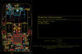
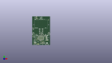
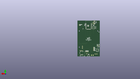
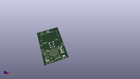

Contents
========

* [PROJ-SPAR-17369-STAN-01>SparkFun RTK Surveyor](#proj-spar-17369-stan-01sparkfun-rtk-surveyor)
	* [Images](#images)
	* [Interactive BOM](#interactive-bom)
	* [OOMP Parts](#oomp-parts)
	* [Tags](#tags)
  
![][im]
# PROJ-SPAR-17369-STAN-01>SparkFun RTK Surveyor

- ID: PROJ-SPAR-17369-STAN-01
- Hex ID: PRS17369
- Name: SparkFun RTK Surveyor
- Description: 

## Images
  
  

|eagleImage|kicadPcb3dFront|kicadPcb3dBack|kicadPcb3d|
| :---: | :---: | :---: | :---: |
|||||

## Interactive BOM

- Interactive BOM page: [ibom.html](kicad/bom/ibom.html)

## OOMP Parts
  

|OOMP Parts|
| :---: |
|UNMATCHED-UNMATCHED-X-UNMATCHED-01, BLUETOOTH_BROADCAST, 3.8099999999999996, 19.049999999999997, 90,BLUETOOTH_BROADCAST, SWITCH_DPDT_SMD_AYZ0202, SparkFun-Switches, (0.15, 0.75), R90|
|CAPE-0402-X-UNMATCHED-01, C1, 21.59, 16.256, 270,C1, 47pF, 0402, SparkFun-Capacitors, (0.85, 0.64), R270|
|CAPE-0603-X-UNMATCHED-01, C2, 30.479999999999997, 38.099999999999994, 90,C2, 1.0uF, 0603, SparkFun-Capacitors, (1.2, 1.5), R90|
|CAPE-0603-X-UNMATCHED-01, C4, 27.94, 38.099999999999994, 90,C4, 1.0uF, 0603, SparkFun-Capacitors, (1.1, 1.5), R90|
|CAPE-0603-X-NF100-01, C5, 25.4, 38.099999999999994, 270,C5, 0.1uF, 0603, SparkFun-Capacitors, (1, 1.5), R270|
|CAPE-0603-X-UNMATCHED-01, C6, 34.29, 40.64, 180,C6, 1.0uF, 0603, SparkFun-Capacitors, (1.35, 1.6), R180|
|CAPE-0603-X-NF100-01, C7, 26.669999999999998, 40.64, 0,C7, 0.1uF, 0603, SparkFun-Capacitors, (1.05, 1.6), R0|
|CAPE-0603-X-UNMATCHED-01, C8, 7.619999999999999, 105.41, M0,C8, 4.7uF, 0603, SparkFun-Capacitors, (0.3, 4.15), MR0|
|CAPE-0603-X-UNMATCHED-01, C9, 7.619999999999999, 98.044, M0,C9, 4.7uF, 0603, SparkFun-Capacitors, (0.3, 3.86), MR0|
|CAPE-0603-X-UNMATCHED-01, C10, 10.16, 94.996, M180,C10, 10uF, 0603, SparkFun-Capacitors, (0.4, 3.74), MR180|
|CAPE-0603-X-NF100-01, C11, 35.559999999999995, 99.05999999999999, M270,C11, 0.1uF, 0603, SparkFun-Capacitors, (1.4, 3.9), MR270|
|CAPE-0603-X-NF100-01, C12, 38.099999999999994, 95.25, M270,C12, 0.1uF, 0603, SparkFun-Capacitors, (1.5, 3.75), MR270|
|CAPE-0603-X-NF100-01, C13, 37.083999999999996, 99.05999999999999, M270,C13, 0.1uF, 0603, SparkFun-Capacitors, (1.46, 3.9), MR270|
|CAPE-0603-X-UNMATCHED-01, C14, 10.16, 96.52, M180,C14, 10uF, 0603, SparkFun-Capacitors, (0.4, 3.8), MR180|
|CAPE-0603-X-NF100-01, C15, 7.619999999999999, 106.934, M0,C15, 0.1uF, 0603, SparkFun-Capacitors, (0.3, 4.21), MR0|
|CAPE-0603-X-NF100-01, C16, 41.401999999999994, 17.510000032, 180,C16, 0.1uF, 0603, SparkFun-Capacitors, (1.63, 0.68937008), R180|
|CAPE-0603-X-UNMATCHED-01, C17, 25.4, 48.26, 180,C17, 1.0uF, 0603, SparkFun-Capacitors, (1, 1.9), R180|
|CAPE-0603-X-UNMATCHED-01, C18, 25.4, 43.18, 0,C18, 1.0uF, 0603, SparkFun-Capacitors, (1, 1.7), R0|
|UNMATCHED-0603-X-UNMATCHED-01, D1, 30.987999999999996, 53.974999999999994, 0,D1, Yellow, LED-0603, SparkFun-LED, (1.22, 2.125), R0|
|UNMATCHED-UNMATCHED-X-UNMATCHED-01, D2, 36.83, 13.97, 90,D2, PRTR5V0U2F, SOT886, SparkFun-IC-Power, (1.45, 0.55), R90|
|UNMATCHED-0603-X-UNMATCHED-01, D3, 30.987999999999996, 46.355, 0,D3, WHITE, LED-0603, SparkFun-LED, (1.22, 1.825), R0|
|UNMATCHED-0603-X-UNMATCHED-01, D4, 30.987999999999996, 61.59499999999999, 0,D4, BLUE, LED-0603, SparkFun-LED, (1.22, 2.425), R0|
|UNMATCHED-UNMATCHED-X-UNMATCHED-01, D6, 24.13, 13.97, 90,D6, PRTR5V0U2F, SOT886, SparkFun-IC-Power, (0.95, 0.55), R90|
|UNMATCHED-UNMATCHED-X-UNMATCHED-01, D7, 13.97, 99.05999999999999, M90,D7, 3A/10V/280mV, SOD-323, SparkFun-DiscreteSemi, (0.55, 3.9), MR90|
|UNMATCHED-0603-X-UNMATCHED-01, D8, 19.812, 61.59499999999999, 0,D8, GREEN, LED-0603, SparkFun-LED, (0.78, 2.425), R0|
|UNMATCHED-UNMATCHED-X-UNMATCHED-01, D9, 36.83, 11.160000032, 180,D9, 3A/10V/280mV, SOD-323, SparkFun-DiscreteSemi, (1.45, 0.43937008), R180|
|UNMATCHED-0603-X-UNMATCHED-01, D10, 19.812, 53.974999999999994, 0,D10, GREEN, LED-0603, SparkFun-LED, (0.78, 2.125), R0|
|UNMATCHED-0603-X-UNMATCHED-01, D11, 19.812, 46.355, 0,D11, GREEN, LED-0603, SparkFun-LED, (0.78, 1.825), R0|
|UNMATCHED-0603-X-UNMATCHED-01, D12, 7.619999999999999, 35.433, 0,D12, RED, LED-0603, SparkFun-LED, (0.3, 1.395), R0|
|UNMATCHED-UNMATCHED-X-UNMATCHED-01, D13, 43.18, 35.306, 0,D13, LED-TRICOLOR-5050, SparkFun-LED, (1.7, 1.39), R0|
|UNMATCHED-0402-X-UNMATCHED-01, D14, 13.208, 10.795, 180,D14, PESD0402, 0402, SparkFun-DiscreteSemi, (0.52, 0.425), R180|
|UNMATCHED-UNMATCHED-X-UNMATCHED-01, DUAL_OUTPUT, -1.27, 31.75, M270,DUAL_OUTPUT, SMT-JUMPER_2_NO_SILK, SparkFun-Jumpers, (-0.05, 1.25), MR270|
|UNMATCHED-UNMATCHED-X-UNMATCHED-01, E1, 13.97, 3.6560000539999997, 180,E1, SMA, SMA-EDGE, SparkFun-RF, (0.55, 0.14393701), R180|
|UNMATCHED-0402-X-UNMATCHED-01, FB1, 19.939, 16.891, 0,FB1, 2.66?, 0402-TIGHT, SparkFun-Coils, (0.785, 0.665), R0|
|UNMATCHED-UNMATCHED-X-UNMATCHED-01, J1, 44.449999999999996, 24.13, 90,J1, 1X04_NO_SILK, SparkFun-Connectors, (1.75, 0.95), R90|
|UNMATCHED-UNMATCHED-X-UNMATCHED-01, J2, 48.26, 1.2540000319999998, 0,J2, JST-4-SMD-1.25MM-LOCKING, SparkFun-Connectors, (1.9, 0.04937008), R0|
|ERROR, J3 USB Female, 0, 0, 0,J3, USB, Female, Type, C, Connector, USB-C-16P_4LAYER-PADS, SparkFun-Connectors, (1.45, 0.24437008), R0|
|UNMATCHED-UNMATCHED-X-UNMATCHED-01, J4, 25.4, 4.810000032, M0,J4, External, JST04_1MM_RA, SparkFun-Connectors, (1, 0.18937008), MR0|
|ERROR, J5 USB Female, 0, 0, 0,J5, USB, Female, Type, C, Connector, USB-C-16P_4LAYER-PADS, SparkFun-Connectors, (1, 0.24437008), R0|
|ERROR, J6 Start Base, 0, 0, 0,J6, Start, Base, JST-2-SMD, SparkFun-Connectors, (-0.175, 1.7), R180|
|ERROR, J7 Power Switch, 0, 0, 0,J7, Power, Switch, JST-2-SMD, SparkFun-Connectors, (2.17, 1.7), R180|
|UNMATCHED-UNMATCHED-X-UNMATCHED-01, J8, 3.8099999999999996, 102.86999999999999, 90,J8, JST-2-SMD, SparkFun-Connectors, (0.15, 4.05), R90|
|UNMATCHED-UNMATCHED-X-UNMATCHED-01, J9, 2.54, 1.2540000319999998, 0,J9, JST-4-SMD-1.25MM-LOCKING, SparkFun-Connectors, (0.1, 0.04937008), R0|
|UNMATCHED-UNMATCHED-X-UNMATCHED-01, J10, 11.43, 102.86999999999999, M270,J10, 1X02_NO_SILK, SparkFun-Connectors, (0.45, 4.05), MR270|
|UNMATCHED-UNMATCHED-X-UNMATCHED-01, J11, 6.35, 7.254999967999999, 180,J11, 1X04_NO_SILK, SparkFun-Connectors, (0.25, 0.28562992), R180|
|UNMATCHED-UNMATCHED-X-UNMATCHED-01, J12, 52.06999999999999, 17.510000032, 180,J12, 1X04_NO_SILK, SparkFun-Connectors, (2.05, 0.68937008), R180|
|UNMATCHED-UNMATCHED-X-UNMATCHED-01, J13, -4.571999999999999, 61.97599999999999, 180,J13, Internal, JST04_1MM_RA, SparkFun-Connectors, (-0.18, 2.44), R180|
|UNMATCHED-UNMATCHED-X-UNMATCHED-01, J14, 53.899999896, 98.09999988799999, 270,J14, 1X02_NO_SILK, SparkFun-Connectors, (2.12204724, 3.86220472), R270|
|UNMATCHED-UNMATCHED-X-UNMATCHED-01, J15, -6.35, 34.29, 270,J15, 1X02_NO_SILK, SparkFun-Connectors, (-0.25, 1.35), R270|
|UNMATCHED-UNMATCHED-X-UNMATCHED-01, J16, 51.56199999999999, 15.605000032, M180,J16, microSD, MICRO-SD-SOCKET, SparkFun-Connectors, (2.03, 0.61437008), MR180|
|ERROR, J17 Qwiic Right, 0, 0, 0,J17, Qwiic, Right, Angle, 1X04_NO_SILK, SparkFun-Connectors, (1.05, 0.55), R0|
|UNMATCHED-UNMATCHED-X-UNMATCHED-01, J18, 10.16, 27.94, 270,J18, 1X05_NO_SILK, SparkFun-Connectors, (0.4, 1.1), R270|
|UNMATCHED-UNMATCHED-X-UNMATCHED-01, JP21, 54.60999999999999, 4.349999936, 0,JP21, FIDUCIALUFIDUCIAL, FIDUCIAL-MICRO, SparkFun-Aesthetics, (2.15, 0.17125984), R0|
|UNMATCHED-UNMATCHED-X-UNMATCHED-01, JP61, -3.630000106, 105.230000106, 0,JP61, FIDUCIALUFIDUCIAL, FIDUCIAL-MICRO, SparkFun-Aesthetics, (-0.14291339, 4.14291339), R0|
|UNMATCHED-UNMATCHED-X-UNMATCHED-01, JP71, 54.60999999999999, 4.349999936, M0,JP71, FIDUCIALUFIDUCIAL, FIDUCIAL-MICRO, SparkFun-Aesthetics, (2.15, 0.17125984), MR0|
|UNMATCHED-UNMATCHED-X-UNMATCHED-01, JP81, -3.630000106, 105.230000106, M0,JP81, FIDUCIALUFIDUCIAL, FIDUCIAL-MICRO, SparkFun-Aesthetics, (-0.14291339, 4.14291339), MR0|
|UNMATCHED-UNMATCHED-X-UNMATCHED-01, MEAS, 31.115000000000002, 7.985000031999999, 0,MEAS, COMBO-JUMPER_2_NC_TRACE, SparkFun-Jumpers, (1.225, 0.31437008), R0|
|UNMATCHED-UNMATCHED-X-UNMATCHED-01, MEAS1, 7.619999999999999, 108.712, 0,MEAS1, COMBO-JUMPER_2_NC_TRACE, SparkFun-Jumpers, (0.3, 4.28), R0|
|UNMATCHED-UNMATCHED-X-UNMATCHED-01, Q2, 3.8099999999999996, 88.89999999999999, M90,Q2, MBT3904DW1T1, SC70-6, SparkFun-DiscreteSemi, (0.15, 3.5), MR90|
|RESE-0603-X-UNMATCHED-01, R1, 43.225999908, 38.970000037999995, 180,R1, 4.7k, 0603, SparkFun-Resistors, (1.70181102, 1.53425197), R180|
|RESE-UNMATCHED-X-UNMATCHED-01, R2, 12.7, 24.13, 90,R2, 33, 1206_RA, SparkFun-Resistors, (0.5, 0.95), R90|
|RESE-0603-X-UNMATCHED-01, R3, 12.7, 34.29, 90,R3, 33, 0603, SparkFun-Resistors, (0.5, 1.35), R90|
|RESE-UNMATCHED-X-UNMATCHED-01, R4, 40.64, 27.94, 90,R4, 33, 1206_RA, SparkFun-Resistors, (1.6, 1.1), R90|
|RESE-0603-X-UNMATCHED-01, R5, 2.54, 102.99699999999999, M0,R5, 0, 0603, SparkFun-Resistors, (0.1, 4.055), MR0|
|RESE-0603-X-UNMATCHED-01, R6, 38.200000054, 33.299999948, 90,R6, 1k, 0603, SparkFun-Resistors, (1.50393701, 1.31102362), R90|
|RESE-0603-X-UNMATCHED-01, R7, 5.08, 101.6, M90,R7, 1k, 0603, SparkFun-Resistors, (0.2, 4), MR90|
|RESE-0603-X-UNMATCHED-01, R8, 38.200000054, 36.599999952, 270,R8, 1k, 0603, SparkFun-Resistors, (1.50393701, 1.44094488), R270|
|RESE-UNMATCHED-X-UNMATCHED-01, R9, 12.7, 30.479999999999997, 90,R9, 33, 1206_RA, SparkFun-Resistors, (0.5, 1.2), R90|
|<table><tr><td></td><td> R10</td><td>[RESE-0603-X-O331-01 SMD (0603) 330 Ohm Resistor](https://github.com/oomlout/oomlout_OOMP_parts/tree/main/RESE-0603-X-O331-01/)</td><td>[R6331](https://github.com/oomlout/oomlout_OOMP_parts/tree/main/RESE-0603-X-O331-01/)</td></tr></table>|
|RESE-0603-X-UNMATCHED-01, R11, 30.987999999999996, 55.24499999999999, 0,R11, 20, 0603, SparkFun-Resistors, (1.22, 2.175), R0|
|<table><tr><td></td><td> R12</td><td>[RESE-0603-X-O331-01 SMD (0603) 330 Ohm Resistor](https://github.com/oomlout/oomlout_OOMP_parts/tree/main/RESE-0603-X-O331-01/)</td><td>[R6331](https://github.com/oomlout/oomlout_OOMP_parts/tree/main/RESE-0603-X-O331-01/)</td></tr></table>|
|<table><tr><td></td><td> R13</td><td>[RESE-0603-X-O104-01 SMD (0603) 100k Ohm Resistor](https://github.com/oomlout/oomlout_OOMP_parts/tree/main/RESE-0603-X-O104-01/)</td><td>[R6104](https://github.com/oomlout/oomlout_OOMP_parts/tree/main/RESE-0603-X-O104-01/)</td></tr></table>|
|RESE-0603-X-UNMATCHED-01, R14, 24.256999999999998, 16.891, 0,R14, 10, 0603, SparkFun-Resistors, (0.955, 0.665), R0|
|<table><tr><td></td><td> R15</td><td>[RESE-0603-X-O104-01 SMD (0603) 100k Ohm Resistor](https://github.com/oomlout/oomlout_OOMP_parts/tree/main/RESE-0603-X-O104-01/)</td><td>[R6104](https://github.com/oomlout/oomlout_OOMP_parts/tree/main/RESE-0603-X-O104-01/)</td></tr></table>|
|RESE-0603-X-UNMATCHED-01, R16, 29.209999999999997, 9.890000032, 180,R16, 5.1k, 0603, SparkFun-Resistors, (1.15, 0.38937008), R180|
|RESE-0603-X-UNMATCHED-01, R17, 21.59, 9.890000032, 0,R17, 5.1k, 0603, SparkFun-Resistors, (0.85, 0.38937008), R0|
|<table><tr><td></td><td> R18</td><td>[RESE-0603-X-O103-01 SMD (0603) 10k Ohm Resistor](https://github.com/oomlout/oomlout_OOMP_parts/tree/main/RESE-0603-X-O103-01/)</td><td>[R6103](https://github.com/oomlout/oomlout_OOMP_parts/tree/main/RESE-0603-X-O103-01/)</td></tr></table>|
|<table><tr><td></td><td> R20</td><td>[RESE-0603-X-O103-01 SMD (0603) 10k Ohm Resistor](https://github.com/oomlout/oomlout_OOMP_parts/tree/main/RESE-0603-X-O103-01/)</td><td>[R6103](https://github.com/oomlout/oomlout_OOMP_parts/tree/main/RESE-0603-X-O103-01/)</td></tr></table>|
|<table><tr><td></td><td> R23</td><td>[RESE-0603-X-O103-01 SMD (0603) 10k Ohm Resistor](https://github.com/oomlout/oomlout_OOMP_parts/tree/main/RESE-0603-X-O103-01/)</td><td>[R6103](https://github.com/oomlout/oomlout_OOMP_parts/tree/main/RESE-0603-X-O103-01/)</td></tr></table>|
|RESE-0603-X-UNMATCHED-01, R24, 19.812, 62.865, 180,R24, 20, 0603, SparkFun-Resistors, (0.78, 2.475), R180|
|RESE-0603-X-UNMATCHED-01, R25, 19.812, 55.24499999999999, 180,R25, 20, 0603, SparkFun-Resistors, (0.78, 2.175), R180|
|RESE-0603-X-UNMATCHED-01, R26, 19.812, 47.625, 180,R26, 20, 0603, SparkFun-Resistors, (0.78, 1.875), R180|
|RESE-0603-X-UNMATCHED-01, R27, 17.779999999999998, 38.099999999999994, 270,R27, 27, 0603, SparkFun-Resistors, (0.7, 1.5), R270|
|RESE-0603-X-UNMATCHED-01, R28, 20.32, 38.099999999999994, 270,R28, 27, 0603, SparkFun-Resistors, (0.8, 1.5), R270|
|<table><tr><td></td><td> R29</td><td>[RESE-0603-X-O103-01 SMD (0603) 10k Ohm Resistor](https://github.com/oomlout/oomlout_OOMP_parts/tree/main/RESE-0603-X-O103-01/)</td><td>[R6103](https://github.com/oomlout/oomlout_OOMP_parts/tree/main/RESE-0603-X-O103-01/)</td></tr></table>|
|<table><tr><td></td><td> R30</td><td>[RESE-0603-X-O154-01 SMD (0603) 150k Ohm Resistor](https://github.com/oomlout/oomlout_OOMP_parts/tree/main/RESE-0603-X-O154-01/)</td><td>[R6154](https://github.com/oomlout/oomlout_OOMP_parts/tree/main/RESE-0603-X-O154-01/)</td></tr></table>|
|<table><tr><td></td><td> R34</td><td>[RESE-0603-X-O331-01 SMD (0603) 330 Ohm Resistor](https://github.com/oomlout/oomlout_OOMP_parts/tree/main/RESE-0603-X-O331-01/)</td><td>[R6331](https://github.com/oomlout/oomlout_OOMP_parts/tree/main/RESE-0603-X-O331-01/)</td></tr></table>|
|RESE-0603-X-UNMATCHED-01, R37, 40.64, 9.890000032, 180,R37, 5.1k, 0603, SparkFun-Resistors, (1.6, 0.38937008), R180|
|RESE-0603-X-UNMATCHED-01, R38, 33.019999999999996, 9.890000032, 0,R38, 5.1k, 0603, SparkFun-Resistors, (1.3, 0.38937008), R0|
|UNMATCHED-UNMATCHED-X-UNMATCHED-01, SERIAL1_CONNECTION, 3.8099999999999996, 31.75, 90,SERIAL1_CONNECTION, SWITCH_DPDT_SMD_AYZ0202, SparkFun-Switches, (0.15, 1.25), R90|
|UNMATCHED-UNMATCHED-X-UNMATCHED-01, U1, 25.4, 95.2000001, M90,U1, ESP-WROOM-3232D-NARROW, ESP-WROOM-32D-NARROW, SparkFun-RF, (1, 3.7480315), MR90|
|UNMATCHED-UNMATCHED-X-UNMATCHED-01, U2, 34.29, 38.099999999999994, 90,U2, 3.3V, SOT23-5, SparkFun-IC-Power, (1.35, 1.5), R90|
|UNMATCHED-UNMATCHED-X-UNMATCHED-01, U3, 25.4, 26.669999999999998, 0,U3, U-BLOX_ZED-F9P, ZED-F9P, SparkFun-GPS, (1, 1.05), R0|
|UNMATCHED-UNMATCHED-X-UNMATCHED-01, U4, 25.4, 45.72, 90,U4, 3.3V, SOT23-5, SparkFun-IC-Power, (1, 1.8), R90|
|UNMATCHED-UNMATCHED-X-UNMATCHED-01, U6, 10.16, 88.89999999999999, M270,U6, CH340C, SO016, SparkFun-IC-Comms, (0.4, 3.5), MR270|
|UNMATCHED-UNMATCHED-X-UNMATCHED-01, U7, 11.43, 105.41, M0,U7, MAX17048, DFN-8, SparkFun-IC-Power, (0.45, 4.15), MR0|
|UNMATCHED-UNMATCHED-X-UNMATCHED-01, U10, 7.619999999999999, 101.6, M90,U10, MCP73833, DFN-10, SparkFun-IC-Power, (0.3, 4), MR90|
|UNMATCHED-UNMATCHED-X-UNMATCHED-01, ZED_CONTROL, -1.8795999999999997, 19.049999999999997, M90,ZED_CONTROL, SWITCH_DPDT_SMD_AYZ0202, SparkFun-Switches, (-0.074, 0.75), MR90|

## Tags

- hexID: PRS17369
- oompType: PROJ
- oompSize: SPAR
- oompColor: 17369
- oompDesc: STAN
- oompIndex: 01
- oompName: SparkFun RTK Surveyor
- sources: All source files from https://github.com/sparkfun/SparkFun_RTK_Surveyor (source licence details in srcLicense.md)
- linkBuyPage: https://www.sparkfun.com/products/17369
- oompPart: UNMATCHED-UNMATCHED-X-UNMATCHED-01, BLUETOOTH_BROADCAST, 3.8099999999999996, 19.049999999999997, 90
- oompPart: CAPE-0402-X-UNMATCHED-01, C1, 21.59, 16.256, 270
- oompPart: CAPE-0603-X-UNMATCHED-01, C2, 30.479999999999997, 38.099999999999994, 90
- oompPart: CAPE-0603-X-UNMATCHED-01, C4, 27.94, 38.099999999999994, 90
- oompPart: CAPE-0603-X-NF100-01, C5, 25.4, 38.099999999999994, 270
- oompPart: CAPE-0603-X-UNMATCHED-01, C6, 34.29, 40.64, 180
- oompPart: CAPE-0603-X-NF100-01, C7, 26.669999999999998, 40.64, 0
- oompPart: CAPE-0603-X-UNMATCHED-01, C8, 7.619999999999999, 105.41, M0
- oompPart: CAPE-0603-X-UNMATCHED-01, C9, 7.619999999999999, 98.044, M0
- oompPart: CAPE-0603-X-UNMATCHED-01, C10, 10.16, 94.996, M180
- oompPart: CAPE-0603-X-NF100-01, C11, 35.559999999999995, 99.05999999999999, M270
- oompPart: CAPE-0603-X-NF100-01, C12, 38.099999999999994, 95.25, M270
- oompPart: CAPE-0603-X-NF100-01, C13, 37.083999999999996, 99.05999999999999, M270
- oompPart: CAPE-0603-X-UNMATCHED-01, C14, 10.16, 96.52, M180
- oompPart: CAPE-0603-X-NF100-01, C15, 7.619999999999999, 106.934, M0
- oompPart: CAPE-0603-X-NF100-01, C16, 41.401999999999994, 17.510000032, 180
- oompPart: CAPE-0603-X-UNMATCHED-01, C17, 25.4, 48.26, 180
- oompPart: CAPE-0603-X-UNMATCHED-01, C18, 25.4, 43.18, 0
- oompPart: UNMATCHED-0603-X-UNMATCHED-01, D1, 30.987999999999996, 53.974999999999994, 0
- oompPart: UNMATCHED-UNMATCHED-X-UNMATCHED-01, D2, 36.83, 13.97, 90
- oompPart: UNMATCHED-0603-X-UNMATCHED-01, D3, 30.987999999999996, 46.355, 0
- oompPart: UNMATCHED-0603-X-UNMATCHED-01, D4, 30.987999999999996, 61.59499999999999, 0
- oompPart: UNMATCHED-UNMATCHED-X-UNMATCHED-01, D6, 24.13, 13.97, 90
- oompPart: UNMATCHED-UNMATCHED-X-UNMATCHED-01, D7, 13.97, 99.05999999999999, M90
- oompPart: UNMATCHED-0603-X-UNMATCHED-01, D8, 19.812, 61.59499999999999, 0
- oompPart: UNMATCHED-UNMATCHED-X-UNMATCHED-01, D9, 36.83, 11.160000032, 180
- oompPart: UNMATCHED-0603-X-UNMATCHED-01, D10, 19.812, 53.974999999999994, 0
- oompPart: UNMATCHED-0603-X-UNMATCHED-01, D11, 19.812, 46.355, 0
- oompPart: UNMATCHED-0603-X-UNMATCHED-01, D12, 7.619999999999999, 35.433, 0
- oompPart: UNMATCHED-UNMATCHED-X-UNMATCHED-01, D13, 43.18, 35.306, 0
- oompPart: UNMATCHED-0402-X-UNMATCHED-01, D14, 13.208, 10.795, 180
- oompPart: UNMATCHED-UNMATCHED-X-UNMATCHED-01, DUAL_OUTPUT, -1.27, 31.75, M270
- oompPart: UNMATCHED-UNMATCHED-X-UNMATCHED-01, E1, 13.97, 3.6560000539999997, 180
- oompPart: UNMATCHED-0402-X-UNMATCHED-01, FB1, 19.939, 16.891, 0
- oompPart: UNMATCHED-UNMATCHED-X-UNMATCHED-01, J1, 44.449999999999996, 24.13, 90
- oompPart: UNMATCHED-UNMATCHED-X-UNMATCHED-01, J2, 48.26, 1.2540000319999998, 0
- oompPart: ERROR, J3 USB Female, 0, 0, 0
- oompPart: UNMATCHED-UNMATCHED-X-UNMATCHED-01, J4, 25.4, 4.810000032, M0
- oompPart: ERROR, J5 USB Female, 0, 0, 0
- oompPart: ERROR, J6 Start Base, 0, 0, 0
- oompPart: ERROR, J7 Power Switch, 0, 0, 0
- oompPart: UNMATCHED-UNMATCHED-X-UNMATCHED-01, J8, 3.8099999999999996, 102.86999999999999, 90
- oompPart: UNMATCHED-UNMATCHED-X-UNMATCHED-01, J9, 2.54, 1.2540000319999998, 0
- oompPart: UNMATCHED-UNMATCHED-X-UNMATCHED-01, J10, 11.43, 102.86999999999999, M270
- oompPart: UNMATCHED-UNMATCHED-X-UNMATCHED-01, J11, 6.35, 7.254999967999999, 180
- oompPart: UNMATCHED-UNMATCHED-X-UNMATCHED-01, J12, 52.06999999999999, 17.510000032, 180
- oompPart: UNMATCHED-UNMATCHED-X-UNMATCHED-01, J13, -4.571999999999999, 61.97599999999999, 180
- oompPart: UNMATCHED-UNMATCHED-X-UNMATCHED-01, J14, 53.899999896, 98.09999988799999, 270
- oompPart: UNMATCHED-UNMATCHED-X-UNMATCHED-01, J15, -6.35, 34.29, 270
- oompPart: UNMATCHED-UNMATCHED-X-UNMATCHED-01, J16, 51.56199999999999, 15.605000032, M180
- oompPart: ERROR, J17 Qwiic Right, 0, 0, 0
- oompPart: UNMATCHED-UNMATCHED-X-UNMATCHED-01, J18, 10.16, 27.94, 270
- oompPart: UNMATCHED-UNMATCHED-X-UNMATCHED-01, JP21, 54.60999999999999, 4.349999936, 0
- oompPart: UNMATCHED-UNMATCHED-X-UNMATCHED-01, JP61, -3.630000106, 105.230000106, 0
- oompPart: UNMATCHED-UNMATCHED-X-UNMATCHED-01, JP71, 54.60999999999999, 4.349999936, M0
- oompPart: UNMATCHED-UNMATCHED-X-UNMATCHED-01, JP81, -3.630000106, 105.230000106, M0
- oompPart: UNMATCHED-UNMATCHED-X-UNMATCHED-01, MEAS, 31.115000000000002, 7.985000031999999, 0
- oompPart: UNMATCHED-UNMATCHED-X-UNMATCHED-01, MEAS1, 7.619999999999999, 108.712, 0
- oompPart: UNMATCHED-UNMATCHED-X-UNMATCHED-01, Q2, 3.8099999999999996, 88.89999999999999, M90
- oompPart: RESE-0603-X-UNMATCHED-01, R1, 43.225999908, 38.970000037999995, 180
- oompPart: RESE-UNMATCHED-X-UNMATCHED-01, R2, 12.7, 24.13, 90
- oompPart: RESE-0603-X-UNMATCHED-01, R3, 12.7, 34.29, 90
- oompPart: RESE-UNMATCHED-X-UNMATCHED-01, R4, 40.64, 27.94, 90
- oompPart: RESE-0603-X-UNMATCHED-01, R5, 2.54, 102.99699999999999, M0
- oompPart: RESE-0603-X-UNMATCHED-01, R6, 38.200000054, 33.299999948, 90
- oompPart: RESE-0603-X-UNMATCHED-01, R7, 5.08, 101.6, M90
- oompPart: RESE-0603-X-UNMATCHED-01, R8, 38.200000054, 36.599999952, 270
- oompPart: RESE-UNMATCHED-X-UNMATCHED-01, R9, 12.7, 30.479999999999997, 90
- oompPart: RESE-0603-X-O331-01, R10, 30.987999999999996, 62.865, 180
- oompPart: RESE-0603-X-UNMATCHED-01, R11, 30.987999999999996, 55.24499999999999, 0
- oompPart: RESE-0603-X-O331-01, R12, 30.987999999999996, 47.625, 0
- oompPart: RESE-0603-X-O104-01, R13, 42.545, 85.09, M180
- oompPart: RESE-0603-X-UNMATCHED-01, R14, 24.256999999999998, 16.891, 0
- oompPart: RESE-0603-X-O104-01, R15, 22.86, 38.099999999999994, 270
- oompPart: RESE-0603-X-UNMATCHED-01, R16, 29.209999999999997, 9.890000032, 180
- oompPart: RESE-0603-X-UNMATCHED-01, R17, 21.59, 9.890000032, 0
- oompPart: RESE-0603-X-O103-01, R18, 2.54, 106.934, M0
- oompPart: RESE-0603-X-O103-01, R20, 36.57599999999999, 95.25, M270
- oompPart: RESE-0603-X-O103-01, R23, 3.8099999999999996, 86.36, M180
- oompPart: RESE-0603-X-UNMATCHED-01, R24, 19.812, 62.865, 180
- oompPart: RESE-0603-X-UNMATCHED-01, R25, 19.812, 55.24499999999999, 180
- oompPart: RESE-0603-X-UNMATCHED-01, R26, 19.812, 47.625, 180
- oompPart: RESE-0603-X-UNMATCHED-01, R27, 17.779999999999998, 38.099999999999994, 270
- oompPart: RESE-0603-X-UNMATCHED-01, R28, 20.32, 38.099999999999994, 270
- oompPart: RESE-0603-X-O103-01, R29, 3.8099999999999996, 91.44, M0
- oompPart: RESE-0603-X-O154-01, R30, 2.54, 104.90199999999999, M0
- oompPart: RESE-0603-X-O331-01, R34, 7.619999999999999, 37.719, 180
- oompPart: RESE-0603-X-UNMATCHED-01, R37, 40.64, 9.890000032, 180
- oompPart: RESE-0603-X-UNMATCHED-01, R38, 33.019999999999996, 9.890000032, 0
- oompPart: UNMATCHED-UNMATCHED-X-UNMATCHED-01, SERIAL1_CONNECTION, 3.8099999999999996, 31.75, 90
- oompPart: UNMATCHED-UNMATCHED-X-UNMATCHED-01, U1, 25.4, 95.2000001, M90
- oompPart: UNMATCHED-UNMATCHED-X-UNMATCHED-01, U2, 34.29, 38.099999999999994, 90
- oompPart: UNMATCHED-UNMATCHED-X-UNMATCHED-01, U3, 25.4, 26.669999999999998, 0
- oompPart: UNMATCHED-UNMATCHED-X-UNMATCHED-01, U4, 25.4, 45.72, 90
- oompPart: UNMATCHED-UNMATCHED-X-UNMATCHED-01, U6, 10.16, 88.89999999999999, M270
- oompPart: UNMATCHED-UNMATCHED-X-UNMATCHED-01, U7, 11.43, 105.41, M0
- oompPart: UNMATCHED-UNMATCHED-X-UNMATCHED-01, U10, 7.619999999999999, 101.6, M90
- oompPart: UNMATCHED-UNMATCHED-X-UNMATCHED-01, ZED_CONTROL, -1.8795999999999997, 19.049999999999997, M90
- rawPart: BLUETOOTH_BROADCAST, SWITCH_DPDT_SMD_AYZ0202, SparkFun-Switches, (0.15, 0.75), R90
- rawPart: C1, 47pF, 0402, SparkFun-Capacitors, (0.85, 0.64), R270
- rawPart: C2, 1.0uF, 0603, SparkFun-Capacitors, (1.2, 1.5), R90
- rawPart: C4, 1.0uF, 0603, SparkFun-Capacitors, (1.1, 1.5), R90
- rawPart: C5, 0.1uF, 0603, SparkFun-Capacitors, (1, 1.5), R270
- rawPart: C6, 1.0uF, 0603, SparkFun-Capacitors, (1.35, 1.6), R180
- rawPart: C7, 0.1uF, 0603, SparkFun-Capacitors, (1.05, 1.6), R0
- rawPart: C8, 4.7uF, 0603, SparkFun-Capacitors, (0.3, 4.15), MR0
- rawPart: C9, 4.7uF, 0603, SparkFun-Capacitors, (0.3, 3.86), MR0
- rawPart: C10, 10uF, 0603, SparkFun-Capacitors, (0.4, 3.74), MR180
- rawPart: C11, 0.1uF, 0603, SparkFun-Capacitors, (1.4, 3.9), MR270
- rawPart: C12, 0.1uF, 0603, SparkFun-Capacitors, (1.5, 3.75), MR270
- rawPart: C13, 0.1uF, 0603, SparkFun-Capacitors, (1.46, 3.9), MR270
- rawPart: C14, 10uF, 0603, SparkFun-Capacitors, (0.4, 3.8), MR180
- rawPart: C15, 0.1uF, 0603, SparkFun-Capacitors, (0.3, 4.21), MR0
- rawPart: C16, 0.1uF, 0603, SparkFun-Capacitors, (1.63, 0.68937008), R180
- rawPart: C17, 1.0uF, 0603, SparkFun-Capacitors, (1, 1.9), R180
- rawPart: C18, 1.0uF, 0603, SparkFun-Capacitors, (1, 1.7), R0
- rawPart: D1, Yellow, LED-0603, SparkFun-LED, (1.22, 2.125), R0
- rawPart: D2, PRTR5V0U2F, SOT886, SparkFun-IC-Power, (1.45, 0.55), R90
- rawPart: D3, WHITE, LED-0603, SparkFun-LED, (1.22, 1.825), R0
- rawPart: D4, BLUE, LED-0603, SparkFun-LED, (1.22, 2.425), R0
- rawPart: D6, PRTR5V0U2F, SOT886, SparkFun-IC-Power, (0.95, 0.55), R90
- rawPart: D7, 3A/10V/280mV, SOD-323, SparkFun-DiscreteSemi, (0.55, 3.9), MR90
- rawPart: D8, GREEN, LED-0603, SparkFun-LED, (0.78, 2.425), R0
- rawPart: D9, 3A/10V/280mV, SOD-323, SparkFun-DiscreteSemi, (1.45, 0.43937008), R180
- rawPart: D10, GREEN, LED-0603, SparkFun-LED, (0.78, 2.125), R0
- rawPart: D11, GREEN, LED-0603, SparkFun-LED, (0.78, 1.825), R0
- rawPart: D12, RED, LED-0603, SparkFun-LED, (0.3, 1.395), R0
- rawPart: D13, LED-TRICOLOR-5050, SparkFun-LED, (1.7, 1.39), R0
- rawPart: D14, PESD0402, 0402, SparkFun-DiscreteSemi, (0.52, 0.425), R180
- rawPart: DUAL_OUTPUT, SMT-JUMPER_2_NO_SILK, SparkFun-Jumpers, (-0.05, 1.25), MR270
- rawPart: E1, SMA, SMA-EDGE, SparkFun-RF, (0.55, 0.14393701), R180
- rawPart: FB1, 2.66?, 0402-TIGHT, SparkFun-Coils, (0.785, 0.665), R0
- rawPart: J1, 1X04_NO_SILK, SparkFun-Connectors, (1.75, 0.95), R90
- rawPart: J2, JST-4-SMD-1.25MM-LOCKING, SparkFun-Connectors, (1.9, 0.04937008), R0
- rawPart: J3, USB, Female, Type, C, Connector, USB-C-16P_4LAYER-PADS, SparkFun-Connectors, (1.45, 0.24437008), R0
- rawPart: J4, External, JST04_1MM_RA, SparkFun-Connectors, (1, 0.18937008), MR0
- rawPart: J5, USB, Female, Type, C, Connector, USB-C-16P_4LAYER-PADS, SparkFun-Connectors, (1, 0.24437008), R0
- rawPart: J6, Start, Base, JST-2-SMD, SparkFun-Connectors, (-0.175, 1.7), R180
- rawPart: J7, Power, Switch, JST-2-SMD, SparkFun-Connectors, (2.17, 1.7), R180
- rawPart: J8, JST-2-SMD, SparkFun-Connectors, (0.15, 4.05), R90
- rawPart: J9, JST-4-SMD-1.25MM-LOCKING, SparkFun-Connectors, (0.1, 0.04937008), R0
- rawPart: J10, 1X02_NO_SILK, SparkFun-Connectors, (0.45, 4.05), MR270
- rawPart: J11, 1X04_NO_SILK, SparkFun-Connectors, (0.25, 0.28562992), R180
- rawPart: J12, 1X04_NO_SILK, SparkFun-Connectors, (2.05, 0.68937008), R180
- rawPart: J13, Internal, JST04_1MM_RA, SparkFun-Connectors, (-0.18, 2.44), R180
- rawPart: J14, 1X02_NO_SILK, SparkFun-Connectors, (2.12204724, 3.86220472), R270
- rawPart: J15, 1X02_NO_SILK, SparkFun-Connectors, (-0.25, 1.35), R270
- rawPart: J16, microSD, MICRO-SD-SOCKET, SparkFun-Connectors, (2.03, 0.61437008), MR180
- rawPart: J17, Qwiic, Right, Angle, 1X04_NO_SILK, SparkFun-Connectors, (1.05, 0.55), R0
- rawPart: J18, 1X05_NO_SILK, SparkFun-Connectors, (0.4, 1.1), R270
- rawPart: JP21, FIDUCIALUFIDUCIAL, FIDUCIAL-MICRO, SparkFun-Aesthetics, (2.15, 0.17125984), R0
- rawPart: JP61, FIDUCIALUFIDUCIAL, FIDUCIAL-MICRO, SparkFun-Aesthetics, (-0.14291339, 4.14291339), R0
- rawPart: JP71, FIDUCIALUFIDUCIAL, FIDUCIAL-MICRO, SparkFun-Aesthetics, (2.15, 0.17125984), MR0
- rawPart: JP81, FIDUCIALUFIDUCIAL, FIDUCIAL-MICRO, SparkFun-Aesthetics, (-0.14291339, 4.14291339), MR0
- rawPart: MEAS, COMBO-JUMPER_2_NC_TRACE, SparkFun-Jumpers, (1.225, 0.31437008), R0
- rawPart: MEAS1, COMBO-JUMPER_2_NC_TRACE, SparkFun-Jumpers, (0.3, 4.28), R0
- rawPart: Q2, MBT3904DW1T1, SC70-6, SparkFun-DiscreteSemi, (0.15, 3.5), MR90
- rawPart: R1, 4.7k, 0603, SparkFun-Resistors, (1.70181102, 1.53425197), R180
- rawPart: R2, 33, 1206_RA, SparkFun-Resistors, (0.5, 0.95), R90
- rawPart: R3, 33, 0603, SparkFun-Resistors, (0.5, 1.35), R90
- rawPart: R4, 33, 1206_RA, SparkFun-Resistors, (1.6, 1.1), R90
- rawPart: R5, 0, 0603, SparkFun-Resistors, (0.1, 4.055), MR0
- rawPart: R6, 1k, 0603, SparkFun-Resistors, (1.50393701, 1.31102362), R90
- rawPart: R7, 1k, 0603, SparkFun-Resistors, (0.2, 4), MR90
- rawPart: R8, 1k, 0603, SparkFun-Resistors, (1.50393701, 1.44094488), R270
- rawPart: R9, 33, 1206_RA, SparkFun-Resistors, (0.5, 1.2), R90
- rawPart: R10, 330, 0603, SparkFun-Resistors, (1.22, 2.475), R180
- rawPart: R11, 20, 0603, SparkFun-Resistors, (1.22, 2.175), R0
- rawPart: R12, 330, 0603, SparkFun-Resistors, (1.22, 1.875), R0
- rawPart: R13, 100k, 0603, SparkFun-Resistors, (1.675, 3.35), MR180
- rawPart: R14, 10, 0603, SparkFun-Resistors, (0.955, 0.665), R0
- rawPart: R15, 100k, 0603, SparkFun-Resistors, (0.9, 1.5), R270
- rawPart: R16, 5.1k, 0603, SparkFun-Resistors, (1.15, 0.38937008), R180
- rawPart: R17, 5.1k, 0603, SparkFun-Resistors, (0.85, 0.38937008), R0
- rawPart: R18, 10k, 0603, SparkFun-Resistors, (0.1, 4.21), MR0
- rawPart: R20, 10k, 0603, SparkFun-Resistors, (1.44, 3.75), MR270
- rawPart: R23, 10k, 0603, SparkFun-Resistors, (0.15, 3.4), MR180
- rawPart: R24, 20, 0603, SparkFun-Resistors, (0.78, 2.475), R180
- rawPart: R25, 20, 0603, SparkFun-Resistors, (0.78, 2.175), R180
- rawPart: R26, 20, 0603, SparkFun-Resistors, (0.78, 1.875), R180
- rawPart: R27, 27, 0603, SparkFun-Resistors, (0.7, 1.5), R270
- rawPart: R28, 27, 0603, SparkFun-Resistors, (0.8, 1.5), R270
- rawPart: R29, 10k, 0603, SparkFun-Resistors, (0.15, 3.6), MR0
- rawPart: R30, 150k, 0603, SparkFun-Resistors, (0.1, 4.13), MR0
- rawPart: R34, 330, 0603, SparkFun-Resistors, (0.3, 1.485), R180
- rawPart: R37, 5.1k, 0603, SparkFun-Resistors, (1.6, 0.38937008), R180
- rawPart: R38, 5.1k, 0603, SparkFun-Resistors, (1.3, 0.38937008), R0
- rawPart: SERIAL1_CONNECTION, SWITCH_DPDT_SMD_AYZ0202, SparkFun-Switches, (0.15, 1.25), R90
- rawPart: U1, ESP-WROOM-3232D-NARROW, ESP-WROOM-32D-NARROW, SparkFun-RF, (1, 3.7480315), MR90
- rawPart: U2, 3.3V, SOT23-5, SparkFun-IC-Power, (1.35, 1.5), R90
- rawPart: U3, U-BLOX_ZED-F9P, ZED-F9P, SparkFun-GPS, (1, 1.05), R0
- rawPart: U4, 3.3V, SOT23-5, SparkFun-IC-Power, (1, 1.8), R90
- rawPart: U6, CH340C, SO016, SparkFun-IC-Comms, (0.4, 3.5), MR270
- rawPart: U7, MAX17048, DFN-8, SparkFun-IC-Power, (0.45, 4.15), MR0
- rawPart: U10, MCP73833, DFN-10, SparkFun-IC-Power, (0.3, 4), MR90
- rawPart: ZED_CONTROL, SWITCH_DPDT_SMD_AYZ0202, SparkFun-Switches, (-0.074, 0.75), MR90

[im]: kicadPcb3d_450.png
