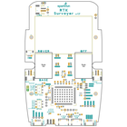
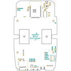
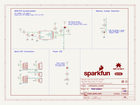
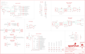
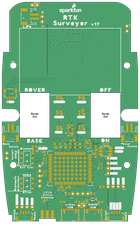
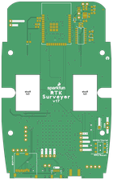

Contents
========

* [PRS17369 > SparkFun RTK Surveyor](#prs17369--sparkfun-rtk-surveyor)
	* [Schematic](#schematic)
	* [PCB](#pcb)
	* [Interactive BOM](#interactive-bom)
	* [OOMP Parts](#oomp-parts)
	* [Images](#images)
	* [Tags](#tags)
  
![][im]
# PRS17369 > SparkFun RTK Surveyor

- ID: PROJ-SPAR-17369-STAN-01
- Hex ID: PRS17369
- Name: Sparkfun
- Description: Sparkfun
- Long Link: [http://oom.lt/PROJ-SPAR-17369-STAN-01](http://oom.lt/PROJ-SPAR-17369-STAN-01)
- Short Link: [http://oom.lt/PRS17369](http://oom.lt/PRS17369)

## Schematic
  

## PCB
  

## Interactive BOM

- Interactive BOM page: [ibom.html](https://htmlpreview.github.io/?https://github.com/oomlout/oomlout_OOMP_projects/blob/main/PROJ-SPAR-17369-STAN-01/kicad/bom/ibom.html)

## OOMP Parts
  

|OOMP ID|Name|Identifier|
| :---: | :---: | :---: |
|UNMATCHED-UNMATCHED-X-UNMATCHED-01||BLUETOOTH_BROADCAST, BT1, DUAL_OUTPUT, E1, J3, J5, J8, J16, MEAS, MEAS1, Q2, SERIAL1_CONNECTION, U$2, U1, U3, U6, U7, U10, ZED_CONTROL|
|[CAPC-0402-X-PF47-V50](https://github.com/oomlout/oomlout_OOMP_parts/tree/main/CAPC-0402-X-PF47-V50/)|[SMD (0402) 47 pF Capacitor (Ceramic) 50v](https://github.com/oomlout/oomlout_OOMP_parts/tree/main/CAPC-0402-X-PF47-V50/)|[C1](https://github.com/oomlout/oomlout_OOMP_parts/tree/main/CAPC-0402-X-PF47-V50/)|
|CAPC-0603-X-UNMATCHED-01||C2, C4, C6, C17, C18|
|[CAPC-0603-X-NF100-V50](https://github.com/oomlout/oomlout_OOMP_parts/tree/main/CAPC-0603-X-NF100-V50/)|[SMD (0603) 100 nF Capacitor (Ceramic) 50v](https://github.com/oomlout/oomlout_OOMP_parts/tree/main/CAPC-0603-X-NF100-V50/)|[C5, C7, C11, C12, C13, C15, C16](https://github.com/oomlout/oomlout_OOMP_parts/tree/main/CAPC-0603-X-NF100-V50/)|
|[CAPC-0603-X-UF47D-V10](https://github.com/oomlout/oomlout_OOMP_parts/tree/main/CAPC-0603-X-UF47D-V10/)|[SMD (0603) 4.7 uF Capacitor (Ceramic) 10v](https://github.com/oomlout/oomlout_OOMP_parts/tree/main/CAPC-0603-X-UF47D-V10/)|[C8, C9](https://github.com/oomlout/oomlout_OOMP_parts/tree/main/CAPC-0603-X-UF47D-V10/)|
|[CAPC-0603-X-UF10-V63D](https://github.com/oomlout/oomlout_OOMP_parts/tree/main/CAPC-0603-X-UF10-V63D/)|[SMD (0603) 10 uF Capacitor (Ceramic) 6.3v](https://github.com/oomlout/oomlout_OOMP_parts/tree/main/CAPC-0603-X-UF10-V63D/)|[C10, C14](https://github.com/oomlout/oomlout_OOMP_parts/tree/main/CAPC-0603-X-UF10-V63D/)|
|[LEDS-0603-Y-STAN-01](https://github.com/oomlout/oomlout_OOMP_parts/tree/main/LEDS-0603-Y-STAN-01/)|[SMD (0603) Yellow LED](https://github.com/oomlout/oomlout_OOMP_parts/tree/main/LEDS-0603-Y-STAN-01/)|[D1](https://github.com/oomlout/oomlout_OOMP_parts/tree/main/LEDS-0603-Y-STAN-01/)|
|DIOD-UNMATCHED-X-UNMATCHED-01||D2, D6|
|[LEDS-0603-G-STAN-01](https://github.com/oomlout/oomlout_OOMP_parts/tree/main/LEDS-0603-G-STAN-01/)|[SMD (0603) Green LED](https://github.com/oomlout/oomlout_OOMP_parts/tree/main/LEDS-0603-G-STAN-01/)|[D3, D8, D10, D11](https://github.com/oomlout/oomlout_OOMP_parts/tree/main/LEDS-0603-G-STAN-01/)|
|[LEDS-0603-L-STAN-01](https://github.com/oomlout/oomlout_OOMP_parts/tree/main/LEDS-0603-L-STAN-01/)|[SMD (0603) Blue LED](https://github.com/oomlout/oomlout_OOMP_parts/tree/main/LEDS-0603-L-STAN-01/)|[D4](https://github.com/oomlout/oomlout_OOMP_parts/tree/main/LEDS-0603-L-STAN-01/)|
|DIOD-S323-X-UNMATCHED-01||D7, D9|
|[LEDS-0603-R-STAN-01](https://github.com/oomlout/oomlout_OOMP_parts/tree/main/LEDS-0603-R-STAN-01/)|[SMD (0603) Red LED](https://github.com/oomlout/oomlout_OOMP_parts/tree/main/LEDS-0603-R-STAN-01/)|[D12](https://github.com/oomlout/oomlout_OOMP_parts/tree/main/LEDS-0603-R-STAN-01/)|
|LEDS-5050-G-STAN-01||D13|
|DIOD-0402-X-UNMATCHED-01||D14|
|FERB-0402-X-UNMATCHED-01||FB1|
|[HEAD-I01-X-PI04-01](https://github.com/oomlout/oomlout_OOMP_parts/tree/main/HEAD-I01-X-PI04-01/)|[2.54 mm 4 Pin Header](https://github.com/oomlout/oomlout_OOMP_parts/tree/main/HEAD-I01-X-PI04-01/)|[J1, J11, J12, J17](https://github.com/oomlout/oomlout_OOMP_parts/tree/main/HEAD-I01-X-PI04-01/)|
|HEAD-UNMATCHED-X-UNMATCHED-01||J2, J9|
|[HEAD-JSTSH-X-PI04-RS](https://github.com/oomlout/oomlout_OOMP_parts/tree/main/HEAD-JSTSH-X-PI04-RS/)|[JST XH (1 mm) 4 Pin Header Right Angle (SMD)](https://github.com/oomlout/oomlout_OOMP_parts/tree/main/HEAD-JSTSH-X-PI04-RS/)|[J4, J13](https://github.com/oomlout/oomlout_OOMP_parts/tree/main/HEAD-JSTSH-X-PI04-RS/)|
|HEAD-I01-X-UNMATCHED-01||J6, J7|
|[HEAD-I01-X-PI02-01](https://github.com/oomlout/oomlout_OOMP_parts/tree/main/HEAD-I01-X-PI02-01/)|[2.54 mm 2 Pin Header](https://github.com/oomlout/oomlout_OOMP_parts/tree/main/HEAD-I01-X-PI02-01/)|[J10, J14, J15](https://github.com/oomlout/oomlout_OOMP_parts/tree/main/HEAD-I01-X-PI02-01/)|
|[HEAD-I01-X-PI05-01](https://github.com/oomlout/oomlout_OOMP_parts/tree/main/HEAD-I01-X-PI05-01/)|[2.54 mm 5 Pin Header](https://github.com/oomlout/oomlout_OOMP_parts/tree/main/HEAD-I01-X-PI05-01/)|[J18](https://github.com/oomlout/oomlout_OOMP_parts/tree/main/HEAD-I01-X-PI05-01/)|
|[RESE-0603-X-O472-01](https://github.com/oomlout/oomlout_OOMP_parts/tree/main/RESE-0603-X-O472-01/)|[SMD (0603) 4.7k Ohm Resistor](https://github.com/oomlout/oomlout_OOMP_parts/tree/main/RESE-0603-X-O472-01/)|[R1, R16, R17, R37, R38](https://github.com/oomlout/oomlout_OOMP_parts/tree/main/RESE-0603-X-O472-01/)|
|RESE-1206-X-O330-01||R2, R4, R9|
|[RESE-0603-X-O330-01](https://github.com/oomlout/oomlout_OOMP_parts/tree/main/RESE-0603-X-O330-01/)|[SMD (0603) 33 Ohm Resistor](https://github.com/oomlout/oomlout_OOMP_parts/tree/main/RESE-0603-X-O330-01/)|[R3](https://github.com/oomlout/oomlout_OOMP_parts/tree/main/RESE-0603-X-O330-01/)|
|RESE-0603-X-UNMATCHED-01||R5|
|[RESE-0603-X-O102-01](https://github.com/oomlout/oomlout_OOMP_parts/tree/main/RESE-0603-X-O102-01/)|[SMD (0603) 1k Ohm Resistor](https://github.com/oomlout/oomlout_OOMP_parts/tree/main/RESE-0603-X-O102-01/)|[R6, R7, R8](https://github.com/oomlout/oomlout_OOMP_parts/tree/main/RESE-0603-X-O102-01/)|
|[RESE-0603-X-O331-01](https://github.com/oomlout/oomlout_OOMP_parts/tree/main/RESE-0603-X-O331-01/)|[SMD (0603) 330 Ohm Resistor](https://github.com/oomlout/oomlout_OOMP_parts/tree/main/RESE-0603-X-O331-01/)|[R10, R12, R34](https://github.com/oomlout/oomlout_OOMP_parts/tree/main/RESE-0603-X-O331-01/)|
|[RESE-0603-X-O200-01](https://github.com/oomlout/oomlout_OOMP_parts/tree/main/RESE-0603-X-O200-01/)|[SMD (0603) 20 Ohm Resistor](https://github.com/oomlout/oomlout_OOMP_parts/tree/main/RESE-0603-X-O200-01/)|[R11, R24, R25, R26](https://github.com/oomlout/oomlout_OOMP_parts/tree/main/RESE-0603-X-O200-01/)|
|RESE-0603-X-O1003-01||R13, R15|
|[RESE-0603-X-O100-01](https://github.com/oomlout/oomlout_OOMP_parts/tree/main/RESE-0603-X-O100-01/)|[SMD (0603) 10 Ohm Resistor](https://github.com/oomlout/oomlout_OOMP_parts/tree/main/RESE-0603-X-O100-01/)|[R14](https://github.com/oomlout/oomlout_OOMP_parts/tree/main/RESE-0603-X-O100-01/)|
|[RESE-0603-X-O103-01](https://github.com/oomlout/oomlout_OOMP_parts/tree/main/RESE-0603-X-O103-01/)|[SMD (0603) 10k Ohm Resistor](https://github.com/oomlout/oomlout_OOMP_parts/tree/main/RESE-0603-X-O103-01/)|[R18, R20, R23, R29](https://github.com/oomlout/oomlout_OOMP_parts/tree/main/RESE-0603-X-O103-01/)|
|[RESE-0603-X-O270-01](https://github.com/oomlout/oomlout_OOMP_parts/tree/main/RESE-0603-X-O270-01/)|[SMD (0603) 27 Ohm Resistor](https://github.com/oomlout/oomlout_OOMP_parts/tree/main/RESE-0603-X-O270-01/)|[R27, R28](https://github.com/oomlout/oomlout_OOMP_parts/tree/main/RESE-0603-X-O270-01/)|
|RESE-0603-X-O1503-01||R30|
|[VREG-SO235-X-KAP2112K-V33D](https://github.com/oomlout/oomlout_OOMP_parts/tree/main/VREG-SO235-X-KAP2112K-V33D/)|[SMD (SOT-23-5) AP2112K Voltage Regulator 3.3v](https://github.com/oomlout/oomlout_OOMP_parts/tree/main/VREG-SO235-X-KAP2112K-V33D/)|[U2, U4](https://github.com/oomlout/oomlout_OOMP_parts/tree/main/VREG-SO235-X-KAP2112K-V33D/)|

## Images
  
  

|bominteractivefront|bominteractiveback|kicadPcb3d|kicadPcb3dFront|kicadPcb3dBack|kicadSchem|eagleImage|eagleSchemImage|pcbdraw|pcbdrawback|
| :---: | :---: | :---: | :---: | :---: | :---: | :---: | :---: | :---: | :---: |
|||||||||||

## Tags

- hexID: PRS17369
- oompType: PROJ
- oompSize: SPAR
- oompColor: 17369
- oompDesc: STAN
- oompIndex: 01
- oompName: SparkFun RTK Surveyor
- sources: All source files from https://github.com/sparkfun/SparkFun_RTK_Surveyor (source licence details in srcLicense.md)
- linkBuyPage: https://www.sparkfun.com/products/17369
- oompID: PROJ-SPAR-17369-STAN-01
- oompParts: BLUETOOTH_BROADCAST,UNMATCHED-UNMATCHED-X-UNMATCHED-01
- oompParts: BT1,UNMATCHED-UNMATCHED-X-UNMATCHED-01
- oompParts: C1,CAPC-0402-X-PF47-V50
- oompParts: C2,CAPC-0603-X-UNMATCHED-01
- oompParts: C4,CAPC-0603-X-UNMATCHED-01
- oompParts: C5,CAPC-0603-X-NF100-V50
- oompParts: C6,CAPC-0603-X-UNMATCHED-01
- oompParts: C7,CAPC-0603-X-NF100-V50
- oompParts: C8,CAPC-0603-X-UF47D-V10
- oompParts: C9,CAPC-0603-X-UF47D-V10
- oompParts: C10,CAPC-0603-X-UF10-V63D
- oompParts: C11,CAPC-0603-X-NF100-V50
- oompParts: C12,CAPC-0603-X-NF100-V50
- oompParts: C13,CAPC-0603-X-NF100-V50
- oompParts: C14,CAPC-0603-X-UF10-V63D
- oompParts: C15,CAPC-0603-X-NF100-V50
- oompParts: C16,CAPC-0603-X-NF100-V50
- oompParts: C17,CAPC-0603-X-UNMATCHED-01
- oompParts: C18,CAPC-0603-X-UNMATCHED-01
- oompParts: D1,LEDS-0603-Y-STAN-01
- oompParts: D2,DIOD-UNMATCHED-X-UNMATCHED-01
- oompParts: D3,LEDS-0603-G-STAN-01
- oompParts: D4,LEDS-0603-L-STAN-01
- oompParts: D6,DIOD-UNMATCHED-X-UNMATCHED-01
- oompParts: D7,DIOD-S323-X-UNMATCHED-01
- oompParts: D8,LEDS-0603-G-STAN-01
- oompParts: D9,DIOD-S323-X-UNMATCHED-01
- oompParts: D10,LEDS-0603-G-STAN-01
- oompParts: D11,LEDS-0603-G-STAN-01
- oompParts: D12,LEDS-0603-R-STAN-01
- oompParts: D13,LEDS-5050-G-STAN-01
- oompParts: D14,DIOD-0402-X-UNMATCHED-01
- oompParts: DUAL_OUTPUT,UNMATCHED-UNMATCHED-X-UNMATCHED-01
- oompParts: E1,UNMATCHED-UNMATCHED-X-UNMATCHED-01
- oompParts: FB1,FERB-0402-X-UNMATCHED-01
- oompParts: J1,HEAD-I01-X-PI04-01
- oompParts: J2,HEAD-UNMATCHED-X-UNMATCHED-01
- oompParts: J3,UNMATCHED-UNMATCHED-X-UNMATCHED-01
- oompParts: J4,HEAD-JSTSH-X-PI04-RS
- oompParts: J5,UNMATCHED-UNMATCHED-X-UNMATCHED-01
- oompParts: J6,HEAD-I01-X-UNMATCHED-01
- oompParts: J7,HEAD-I01-X-UNMATCHED-01
- oompParts: J8,UNMATCHED-UNMATCHED-X-UNMATCHED-01
- oompParts: J9,HEAD-UNMATCHED-X-UNMATCHED-01
- oompParts: J10,HEAD-I01-X-PI02-01
- oompParts: J11,HEAD-I01-X-PI04-01
- oompParts: J12,HEAD-I01-X-PI04-01
- oompParts: J13,HEAD-JSTSH-X-PI04-RS
- oompParts: J14,HEAD-I01-X-PI02-01
- oompParts: J15,HEAD-I01-X-PI02-01
- oompParts: J16,UNMATCHED-UNMATCHED-X-UNMATCHED-01
- oompParts: J17,HEAD-I01-X-PI04-01
- oompParts: J18,HEAD-I01-X-PI05-01
- oompParts: MEAS,UNMATCHED-UNMATCHED-X-UNMATCHED-01
- oompParts: MEAS1,UNMATCHED-UNMATCHED-X-UNMATCHED-01
- oompParts: Q2,UNMATCHED-UNMATCHED-X-UNMATCHED-01
- oompParts: R1,RESE-0603-X-O472-01
- oompParts: R2,RESE-1206-X-O330-01
- oompParts: R3,RESE-0603-X-O330-01
- oompParts: R4,RESE-1206-X-O330-01
- oompParts: R5,RESE-0603-X-UNMATCHED-01
- oompParts: R6,RESE-0603-X-O102-01
- oompParts: R7,RESE-0603-X-O102-01
- oompParts: R8,RESE-0603-X-O102-01
- oompParts: R9,RESE-1206-X-O330-01
- oompParts: R10,RESE-0603-X-O331-01
- oompParts: R11,RESE-0603-X-O200-01
- oompParts: R12,RESE-0603-X-O331-01
- oompParts: R13,RESE-0603-X-O1003-01
- oompParts: R14,RESE-0603-X-O100-01
- oompParts: R15,RESE-0603-X-O1003-01
- oompParts: R16,RESE-0603-X-O472-01
- oompParts: R17,RESE-0603-X-O472-01
- oompParts: R18,RESE-0603-X-O103-01
- oompParts: R20,RESE-0603-X-O103-01
- oompParts: R23,RESE-0603-X-O103-01
- oompParts: R24,RESE-0603-X-O200-01
- oompParts: R25,RESE-0603-X-O200-01
- oompParts: R26,RESE-0603-X-O200-01
- oompParts: R27,RESE-0603-X-O270-01
- oompParts: R28,RESE-0603-X-O270-01
- oompParts: R29,RESE-0603-X-O103-01
- oompParts: R30,RESE-0603-X-O1503-01
- oompParts: R34,RESE-0603-X-O331-01
- oompParts: R37,RESE-0603-X-O472-01
- oompParts: R38,RESE-0603-X-O472-01
- oompParts: SERIAL1_CONNECTION,UNMATCHED-UNMATCHED-X-UNMATCHED-01
- oompParts: U$2,UNMATCHED-UNMATCHED-X-UNMATCHED-01
- oompParts: U1,UNMATCHED-UNMATCHED-X-UNMATCHED-01
- oompParts: U2,VREG-SO235-X-KAP2112K-V33D
- oompParts: U3,UNMATCHED-UNMATCHED-X-UNMATCHED-01
- oompParts: U4,VREG-SO235-X-KAP2112K-V33D
- oompParts: U6,UNMATCHED-UNMATCHED-X-UNMATCHED-01
- oompParts: U7,UNMATCHED-UNMATCHED-X-UNMATCHED-01
- oompParts: U10,UNMATCHED-UNMATCHED-X-UNMATCHED-01
- oompParts: ZED_CONTROL,UNMATCHED-UNMATCHED-X-UNMATCHED-01
- rawParts: BLUETOOTH_BROADCAST,,SWITCH-DPDT-SMD-AYZ0202,SWITCH_DPDT_SMD_AYZ0202,Double-Pole, Double-Throw (DPDT) Switch,,,,SWCH-08179,,,COM-00597,,,
- rawParts: BT1,LIPO-OUTLINE1000,LIPO-OUTLINE1000,LIPO-1000,LiPo Battery Outlines,,,,BATT-13243,,,PRT-13813,,,
- rawParts: C1,47pF,47PF-0402-25V-5%-X7R,0402,47pF ceramic capacitors,,,,CAP-15063,,,,47pF,,
- rawParts: C2,1.0uF,1.0UF-0603-16V-10%-X7R,0603,1µF ceramic capacitors,,,,CAP-13930,,,,1.0uF,,
- rawParts: C4,1.0uF,1.0UF-0603-16V-10%-X7R,0603,1µF ceramic capacitors,,,,CAP-13930,,,,1.0uF,,
- rawParts: C5,0.1uF,0.1UF-0603-25V-5%,0603,0.1µF ceramic capacitors,,,,CAP-08604,,,,0.1uF,,
- rawParts: C6,1.0uF,1.0UF-0603-16V-10%-X7R,0603,1µF ceramic capacitors,,,,CAP-13930,,,,1.0uF,,
- rawParts: C7,0.1uF,0.1UF-0603-25V-5%,0603,0.1µF ceramic capacitors,,,,CAP-08604,,,,0.1uF,,
- rawParts: C8,4.7uF,4.7UF-0603-35V-(20%),0603,4.7µF ceramic capacitors,,,,CAP-14106,,,,4.7uF,,
- rawParts: C9,4.7uF,4.7UF-0603-35V-(20%),0603,4.7µF ceramic capacitors,,,,CAP-14106,,,,4.7uF,,
- rawParts: C10,10uF,10UF-0603-6.3V-20%,0603,10.0µF ceramic capacitors,,,,CAP-11015,,,,10uF,,
- rawParts: C11,0.1uF,0.1UF-0603-25V-(+80/-20%),0603,0.1µF ceramic capacitors,,,,CAP-00810,,,,0.1uF,,
- rawParts: C12,0.1uF,0.1UF-0603-25V-(+80/-20%),0603,0.1µF ceramic capacitors,,,,CAP-00810,,,,0.1uF,,
- rawParts: C13,0.1uF,0.1UF-0603-25V-(+80/-20%),0603,0.1µF ceramic capacitors,,,,CAP-00810,,,,0.1uF,,
- rawParts: C14,10uF,10UF-0603-6.3V-20%,0603,10.0µF ceramic capacitors,,,,CAP-11015,,,,10uF,,
- rawParts: C15,0.1uF,0.1UF-0603-25V-(+80/-20%),0603,0.1µF ceramic capacitors,,,,CAP-00810,,,,0.1uF,,
- rawParts: C16,0.1uF,0.1UF-0603-25V-(+80/-20%),0603,0.1µF ceramic capacitors,,,,CAP-00810,,,,0.1uF,,
- rawParts: C17,1.0uF,1.0UF-0603-16V-10%-X7R,0603,1µF ceramic capacitors,,,,CAP-13930,,,,1.0uF,,
- rawParts: C18,1.0uF,1.0UF-0603-16V-10%-X7R,0603,1µF ceramic capacitors,,,,CAP-13930,,,,1.0uF,,
- rawParts: D1,Yellow,LED-YELLOW0603,LED-0603,Yellow SMD LED,,,,DIO-09003,,,,Yellow,,
- rawParts: D2,PRTR5V0U2F,PRTR5V0U2F,SOT886,A small ESD protection device. Most commonly used on USB D+/D- signals to protect large, expensive, or especially sensitive USB enabled devices.,,,,DIO-14084,,,,,,
- rawParts: D3,WHITE,LED-WHITE0603,LED-0603,White SMD LED,,,,DIO-09004,,,,WHITE,,
- rawParts: D4,BLUE,LED-BLUE0603,LED-0603,Blue SMD LED,,,,DIO-08575,,,,BLUE,,
- rawParts: D6,PRTR5V0U2F,PRTR5V0U2F,SOT886,A small ESD protection device. Most commonly used on USB D+/D- signals to protect large, expensive, or especially sensitive USB enabled devices.,,,,DIO-14084,,,,,,
- rawParts: D7,3A/10V/280mV,DIODE-SCHOTTKY-BAT60A,SOD-323,Schottky diode,,,,DIO-14072,,,,3A/10V/280mV,,
- rawParts: D8,GREEN,LED-GREEN0603,LED-0603,Green SMD LED,,,,DIO-00821,,,,GREEN,,
- rawParts: D9,3A/10V/280mV,DIODE-SCHOTTKY-BAT60A,SOD-323,Schottky diode,,,,DIO-14072,,,,3A/10V/280mV,,
- rawParts: D10,GREEN,LED-GREEN0603,LED-0603,Green SMD LED,,,,DIO-00821,,,,GREEN,,
- rawParts: D11,GREEN,LED-GREEN0603,LED-0603,Green SMD LED,,,,DIO-00821,,,,GREEN,,
- rawParts: D12,RED,LED-RED0603,LED-0603,Red SMD LED,,,,DIO-00819,,,,RED,,
- rawParts: D13,,LED-RGBBRG,LED-TRICOLOR-5050,LED-RGB,,,,DIO-16048,,,,,,
- rawParts: D14,PESD0402,PESD0402,0402,ESD protection diode,,PESD0402-140CT-ND,650-PESD0402-140,DIO-15359,,,,,,
- rawParts: DUAL_OUTPUT,,JUMPER-SMT_2_NO_SILK,SMT-JUMPER_2_NO_SILK,Normally open jumper,,,,,,,,,,
- rawParts: E1,SMA,ANTENNA-SMA-GROUNDEDEDGE_SMA,SMA-EDGE,SMA Antenna Connector w/ Ground,,,,CONN-08289,,,,,,
- rawParts: FB1,2.66Ω,FERRITE_BEAD-0402-2.66Ω-1GHZ,0402-TIGHT,Ferrite Bead (blocks, cores, rings, chokes, etc.),,,,NDUC-15072,,,,2.66Ω,,
- rawParts: FRAME1,FRAME-LETTERNO_PACKAGE,FRAME-LETTERNO_PACKAGE,DUMMY,Schematic Frame - Letter,Nobody,,,,,,,,v01,
- rawParts: FRAME2,FRAME-LEDGER,FRAME-LEDGER,CREATIVE_COMMONS,Schematic Frame - Ledger,,,,,,,,,,
- rawParts: J1,,CONN_041X04_NO_SILK_NO_POP,1X04_NO_SILK,Multi connection point. Often used as Generic Header-pin footprint for 0.1 inch spaced/style header connections,,,,,,,,,,
- rawParts: J2,,CONN_04JST-SMD-LOCKING,JST-4-SMD-1.25MM-LOCKING,Multi connection point. Often used as Generic Header-pin footprint for 0.1 inch spaced/style header connections,,,,CONN-15303,,,,,,
- rawParts: J3,USB Female Type C Connector,USB_C_4-LAYER_PADS,USB-C-16P_4LAYER-PADS,USB Type C 16Pin Connector,,,,CONN-14122,,,,,,
- rawParts: J4,External,I2C_STANDARDQWIIC,JST04_1MM_RA,SparkFun I2C Standard Pinout Header,,,,CONN-13694,,,,Qwiic Right Angle,,
- rawParts: J5,USB Female Type C Connector,USB_C_4-LAYER_PADS,USB-C-16P_4LAYER-PADS,USB Type C 16Pin Connector,,,,CONN-14122,,,,,,
- rawParts: J6,Start Base,CONN_02-JST-2MM-SMT,JST-2-SMD,Multi connection point. Often used as Generic Header-pin footprint for 0.1 inch spaced/style header connections,,,,CONN-11443,,,,,,
- rawParts: J7,Power Switch,CONN_02-JST-2MM-SMT,JST-2-SMD,Multi connection point. Often used as Generic Header-pin footprint for 0.1 inch spaced/style header connections,,,,CONN-11443,,,,,,
- rawParts: J8,,JST_2MM_MALE,JST-2-SMD,JST 2MM MALE RA CONNECTOR,,,,CONN-11443,,PRT-08612,,,,
- rawParts: J9,,CONN_04JST-SMD-LOCKING,JST-4-SMD-1.25MM-LOCKING,Multi connection point. Often used as Generic Header-pin footprint for 0.1 inch spaced/style header connections,,,,CONN-15303,,,,,,
- rawParts: J10,,CONN_021X02_NO_SILK,1X02_NO_SILK,Multi connection point. Often used as Generic Header-pin footprint for 0.1 inch spaced/style header connections,,,,,,,,,,
- rawParts: J11,,CONN_041X04_NO_SILK_NO_POP,1X04_NO_SILK,Multi connection point. Often used as Generic Header-pin footprint for 0.1 inch spaced/style header connections,,,,,,,,,,
- rawParts: J12,,CONN_041X04_NO_SILK_NO_POP,1X04_NO_SILK,Multi connection point. Often used as Generic Header-pin footprint for 0.1 inch spaced/style header connections,,,,,,,,,,
- rawParts: J13,Internal,I2C_STANDARDQWIIC,JST04_1MM_RA,SparkFun I2C Standard Pinout Header,,,,CONN-13694,,,,Qwiic Right Angle,,
- rawParts: J14,,CONN_021X02_NO_SILK,1X02_NO_SILK,Multi connection point. Often used as Generic Header-pin footprint for 0.1 inch spaced/style header connections,,,,,,,,,,
- rawParts: J15,,CONN_021X02_NO_SILK,1X02_NO_SILK,Multi connection point. Often used as Generic Header-pin footprint for 0.1 inch spaced/style header connections,,,,,,,,,,
- rawParts: J16,microSD,MICRO-SD-SDIOPUSH-PUSH,MICRO-SD-SOCKET,microSD Socket for Transflash,,,,CONN-07820,,,,,,
- rawParts: J17,Qwiic Right Angle,I2C_STANDARD_NO_SILK,1X04_NO_SILK,SparkFun I2C Standard Pinout Header,,,,,,,,,,
- rawParts: J18,,CONN_05NO_SILK,1X05_NO_SILK,Multi connection point. Often used as Generic Header-pin footprint for 0.1 inch spaced/style header connections,,,,,,,,,,
- rawParts: JP21,FIDUCIALUFIDUCIAL,FIDUCIALUFIDUCIAL,FIDUCIAL-MICRO,Fiducial Alignment Points,,,,,,,,,,
- rawParts: JP61,FIDUCIALUFIDUCIAL,FIDUCIALUFIDUCIAL,FIDUCIAL-MICRO,Fiducial Alignment Points,,,,,,,,,,
- rawParts: JP71,FIDUCIALUFIDUCIAL,FIDUCIALUFIDUCIAL,FIDUCIAL-MICRO,Fiducial Alignment Points,,,,,,,,,,
- rawParts: JP81,FIDUCIALUFIDUCIAL,FIDUCIALUFIDUCIAL,FIDUCIAL-MICRO,Fiducial Alignment Points,,,,,,,,,,
- rawParts: LOGO1,OSHW-LOGOMINI,OSHW-LOGOMINI,OSHW-LOGO-MINI,Open-Source Hardware (OSHW) Logo,,,,,,,,,,
- rawParts: LOGO2,SFE_LOGO_NAME_FLAME.1_INCH,SFE_LOGO_NAME_FLAME.1_INCH,SFE_LOGO_NAME_FLAME_.1,SparkFun Font Logo w/ Flame,,,,,,,,,,
- rawParts: MEAS,,JUMPER-COMBO_2_NC_TRACE,COMBO-JUMPER_2_NC_TRACE,,,,,,,,,,,
- rawParts: MEAS1,,JUMPER-COMBO_2_NC_TRACE,COMBO-JUMPER_2_NC_TRACE,,,,,,,,,,,
- rawParts: Q2,MBT3904DW1T1,TRANS_NPN_DUAL-MBT3904DW1T1,SC70-6,Dual NPN Transistors in Single Package,,,,TRANS-13337,,,,,,
- rawParts: R1,4.7k,4.7KOHM-0603-1/10W-1%,0603,4.7kΩ resistor,,,,RES-07857,,,,4.7k,,
- rawParts: R2,33,33OHM_RA-1206-1/16W-5%,1206_RA,EXB-38V330JV,,,,RES-15081,,,,33,,
- rawParts: R3,33,33OHM-0603-1/10W-1%,0603,33Ω resistor,,,,RES-08270,,,,33,,
- rawParts: R4,33,33OHM_RA-1206-1/16W-5%,1206_RA,EXB-38V330JV,,,,RES-15081,,,,33,,
- rawParts: R5,0,0OHM-0603-1/10W,0603,0Ω resistor,,,,RES-08609,,,,0,,
- rawParts: R6,1k,1KOHM-0603-1/10W-1%,0603,1kΩ resistor,,,,RES-07856,,,,1k,,
- rawParts: R7,1k,1KOHM-0603-1/10W-1%,0603,1kΩ resistor,,,,RES-07856,,,,1k,,
- rawParts: R8,1k,1KOHM-0603-1/10W-1%,0603,1kΩ resistor,,,,RES-07856,,,,1k,,
- rawParts: R9,33,33OHM_RA-1206-1/16W-5%,1206_RA,EXB-38V330JV,,,,RES-15081,,,,33,,
- rawParts: R10,330,330OHM-0603-1/10W-1%,0603,330Ω resistor,,,,RES-00818,,,,330,,
- rawParts: R11,20,20OHM-0603-1/10W-1%,0603,RES-07862,,,,RES-07862,,,,20,,
- rawParts: R12,330,330OHM-0603-1/10W-1%,0603,330Ω resistor,,,,RES-00818,,,,330,,
- rawParts: R13,100k,100KOHM-0603-1/10W-1%,0603,100kΩ resistor,,,,RES-07828,,,,100k,,
- rawParts: R14,10,10OHM-0603-1/10W-1%,0603,10Ω resistor,,,,RES-12581,,,,10,,
- rawParts: R15,100k,100KOHM-0603-1/10W-1%,0603,100kΩ resistor,,,,RES-07828,,,,100k,,
- rawParts: R16,5.1k,5.1KOHM5.1KOHM-0603-1/10W-1%,0603,,,,,RES-12083,,,,5.1k,,
- rawParts: R17,5.1k,5.1KOHM5.1KOHM-0603-1/10W-1%,0603,,,,,RES-12083,,,,5.1k,,
- rawParts: R18,10k,NTC-THERMISTOR-0603,0603,NTC Thermistor,,,,RES-13608,,,,10k,,
- rawParts: R20,10k,10KOHM-0603-1/10W-1%,0603,10kΩ resistor,,,,RES-00824,,,,10k,,
- rawParts: R23,10k,10KOHM-0603-1/10W-1%,0603,10kΩ resistor,,,,RES-00824,,,,10k,,
- rawParts: R24,20,20OHM-0603-1/10W-1%,0603,RES-07862,,,,RES-07862,,,,20,,
- rawParts: R25,20,20OHM-0603-1/10W-1%,0603,RES-07862,,,,RES-07862,,,,20,,
- rawParts: R26,20,20OHM-0603-1/10W-1%,0603,RES-07862,,,,RES-07862,,,,20,,
- rawParts: R27,27,27OHM-0603-1/10W-1%,0603,27Ω resistor,,,,RES-09334,,,,27,,
- rawParts: R28,27,27OHM-0603-1/10W-1%,0603,27Ω resistor,,,,RES-09334,,,,27,,
- rawParts: R29,10k,10KOHM-0603-1/10W-1%,0603,10kΩ resistor,,,,RES-00824,,,,10k,,
- rawParts: R30,150k,150KOHM-0603-1/10W-1%,0603,150kΩ resistor,,,,RES-09117,,,,150k,,
- rawParts: R34,330,330OHM-0603-1/10W-1%,0603,330Ω resistor,,,,RES-00818,,,,330,,
- rawParts: R37,5.1k,5.1KOHM5.1KOHM-0603-1/10W-1%,0603,,,,,RES-12083,,,,5.1k,,
- rawParts: R38,5.1k,5.1KOHM5.1KOHM-0603-1/10W-1%,0603,,,,,RES-12083,,,,5.1k,,
- rawParts: SERIAL1_CONNECTION,,SWITCH-DPDT-SMD-AYZ0202,SWITCH_DPDT_SMD_AYZ0202,Double-Pole, Double-Throw (DPDT) Switch,,,,SWCH-08179,,,COM-00597,,,
- rawParts: U$2,SPECIAL_INSTRUCTIONS-ORDERING,SPECIAL_INSTRUCTIONS-ORDERING,ORDERING_INSTRUCTIONS,Special Ordering/Production Instructions Alert,,,,,,,,,,
- rawParts: U1,ESP-WROOM-3232D-NARROW,ESP-WROOM-3232D-NARROW,ESP-WROOM-32D-NARROW,ESP-WROOM-32D - trace antenna (includes keepout),,,,IC-15676,,,,,,
- rawParts: U2,3.3V,V_REG_AP2112K-3.3V,SOT23-5,AP2112 - 600mA CMOS LDO Regulator w/ Enable,,,,VREG-12457,,,,3.3V,,
- rawParts: U3,U-BLOX_ZED-F9P,U-BLOX_ZED-F9P,ZED-F9P,,,,,IC-14209,,,,,,
- rawParts: U4,3.3V,V_REG_AP2112K-3.3V,SOT23-5,AP2112 - 600mA CMOS LDO Regulator w/ Enable,,,,VREG-12457,,,,3.3V,,
- rawParts: U6,CH340C,CH340C,SO016,,,,,IC-14038,,,,,,
- rawParts: U7,MAX17048,MAX17048DFN8,DFN-8,Micropower 1-Cell Li+ ModelGauge,,,,IC-12551,,,,MAX17048,,
- rawParts: U10,MCP73833,MCP73833,DFN-10,,,,,IC-14369,,,,MCP73833,,
- rawParts: ZED_CONTROL,,SWITCH-DPDT-SMD-AYZ0202,SWITCH_DPDT_SMD_AYZ0202,Double-Pole, Double-Throw (DPDT) Switch,,,,SWCH-08179,,,COM-00597,,,

[im]: kicadPcb3d_450.png
