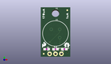
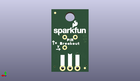
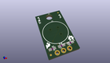

Contents
========

* [PROJ-SPAR-17372-STAN-01>SparkFun PIR Breakout](#proj-spar-17372-stan-01sparkfun-pir-breakout)
	* [Images](#images)
	* [Interactive BOM](#interactive-bom)
	* [OOMP Parts](#oomp-parts)
	* [Tags](#tags)
  
![][im]
# PROJ-SPAR-17372-STAN-01>SparkFun PIR Breakout

- ID: PROJ-SPAR-17372-STAN-01
- Hex ID: PRS17372
- Name: SparkFun PIR Breakout
- Description: 

## Images
  
  

|eagleImage|kicadPcb3dFront|kicadPcb3dBack|kicadPcb3d|
| :---: | :---: | :---: | :---: |
|||||

## Interactive BOM

- Interactive BOM page: [ibom.html](kicad/bom/ibom.html)

## OOMP Parts
  

|OOMP Parts|
| :---: |
|CAPE-0603-X-NF100-01, C1, 6.35, 3.302, 180,C1, 0.1uF, 0603, SparkFun-Capacitors, (0.25, 0.13), R180|
|UNMATCHED-0603-X-UNMATCHED-01, D1, 10.16, 3.302, 180,D1, 24V, 0603, SparkFun-DiscreteSemi, (0.4, 0.13), R180|
|UNMATCHED-UNMATCHED-X-UNMATCHED-01, J1, 3.8099999999999996, 1.27, 0,J1, 1X03_NO_SILK, SparkFun-Connectors, (0.15, 0.05), R0|
|UNMATCHED-UNMATCHED-X-UNMATCHED-01, JP2, 11.43, 20.32, M0,JP2, FIDUCIALUFIDUCIAL, MICRO-FIDUCIAL, SparkFun, (0.45, 0.8), MR0|
|UNMATCHED-UNMATCHED-X-UNMATCHED-01, JP6, 1.27, 1.27, M0,JP6, FIDUCIALUFIDUCIAL, MICRO-FIDUCIAL, SparkFun, (0.05, 0.05), MR0|
|UNMATCHED-UNMATCHED-X-UNMATCHED-01, JP8, 1.27, 1.27, 0,JP8, FIDUCIALUFIDUCIAL, MICRO-FIDUCIAL, SparkFun, (0.05, 0.05), R0|
|UNMATCHED-UNMATCHED-X-UNMATCHED-01, JP9, 11.43, 20.32, 0,JP9, FIDUCIALUFIDUCIAL, MICRO-FIDUCIAL, SparkFun, (0.45, 0.8), R0|
|<table><tr><td></td><td> R5</td><td>[RESE-0603-X-O473-01 SMD (0603) 47k Ohm Resistor](https://github.com/oomlout/oomlout_OOMP_parts/tree/main/RESE-0603-X-O473-01/)</td><td>[R6473](https://github.com/oomlout/oomlout_OOMP_parts/tree/main/RESE-0603-X-O473-01/)</td></tr></table>|
|UNMATCHED-UNMATCHED-X-UNMATCHED-01, U1, 6.35, 10.16, 0,U1, EKMC4607112k, TO-3, SparkFun-Sensors, (0.25, 0.4), R0|

## Tags

- hexID: PRS17372
- oompType: PROJ
- oompSize: SPAR
- oompColor: 17372
- oompDesc: STAN
- oompIndex: 01
- oompName: SparkFun PIR Breakout
- sources: All source files from https://github.com/sparkfun/SparkFun_PIR_Breakout (source licence details in srcLicense.md)
- linkBuyPage: https://www.sparkfun.com/products/17372
- oompPart: CAPE-0603-X-NF100-01, C1, 6.35, 3.302, 180
- oompPart: UNMATCHED-0603-X-UNMATCHED-01, D1, 10.16, 3.302, 180
- oompPart: UNMATCHED-UNMATCHED-X-UNMATCHED-01, J1, 3.8099999999999996, 1.27, 0
- oompPart: UNMATCHED-UNMATCHED-X-UNMATCHED-01, JP2, 11.43, 20.32, M0
- oompPart: UNMATCHED-UNMATCHED-X-UNMATCHED-01, JP6, 1.27, 1.27, M0
- oompPart: UNMATCHED-UNMATCHED-X-UNMATCHED-01, JP8, 1.27, 1.27, 0
- oompPart: UNMATCHED-UNMATCHED-X-UNMATCHED-01, JP9, 11.43, 20.32, 0
- oompPart: RESE-0603-X-O473-01, R5, 2.54, 3.302, 0
- oompPart: UNMATCHED-UNMATCHED-X-UNMATCHED-01, U1, 6.35, 10.16, 0
- rawPart: C1, 0.1uF, 0603, SparkFun-Capacitors, (0.25, 0.13), R180
- rawPart: D1, 24V, 0603, SparkFun-DiscreteSemi, (0.4, 0.13), R180
- rawPart: J1, 1X03_NO_SILK, SparkFun-Connectors, (0.15, 0.05), R0
- rawPart: JP2, FIDUCIALUFIDUCIAL, MICRO-FIDUCIAL, SparkFun, (0.45, 0.8), MR0
- rawPart: JP6, FIDUCIALUFIDUCIAL, MICRO-FIDUCIAL, SparkFun, (0.05, 0.05), MR0
- rawPart: JP8, FIDUCIALUFIDUCIAL, MICRO-FIDUCIAL, SparkFun, (0.05, 0.05), R0
- rawPart: JP9, FIDUCIALUFIDUCIAL, MICRO-FIDUCIAL, SparkFun, (0.45, 0.8), R0
- rawPart: R5, 47k, 0603, SparkFun-Resistors, (0.1, 0.13), R0
- rawPart: U1, EKMC4607112k, TO-3, SparkFun-Sensors, (0.25, 0.4), R0

[im]: kicadPcb3d_450.png
