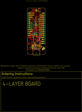

Contents
========

* [PROJ-SPAR-17506-STAN-01>SparkFun LoRa Thing Plus expLoRaBLE](#proj-spar-17506-stan-01sparkfun-lora-thing-plus-explorable)
	* [Images](#images)
	* [OOMP Parts](#oomp-parts)
	* [Tags](#tags)
  
![][im]
# PROJ-SPAR-17506-STAN-01>SparkFun LoRa Thing Plus expLoRaBLE

- ID: PROJ-SPAR-17506-STAN-01
- Hex ID: PRS17506
- Name: SparkFun LoRa Thing Plus expLoRaBLE
- Description: 

## Images
  
  

|eagleImage|kicadPcb3dFront|kicadPcb3dBack|kicadPcb3d|
| :---: | :---: | :---: | :---: |
|||||

## OOMP Parts
  

|OOMP Parts|
| :---: |
|CAPE-0603-X-NF100-01, C1, 15.631159491999998, 23.8887, 0,C1, 0.1uF, 0603, SparkFun-Capacitors, (0.61539998, 0.9405), R0|
|CAPE-0603-X-UNMATCHED-01, C2, 4.9657, 26.2763, 90,C2, 4.7uF, 0603, SparkFun-Capacitors, (0.1955, 1.0345), R90|
|CAPE-0603-X-UNMATCHED-01, C3, 6.858, 30.607, 90,C3, 4.7uF, 0603, SparkFun-Capacitors, (0.27, 1.205), R90|
|CAPE-0603-X-UNMATCHED-01, C4, 15.341599999999998, 19.8374, 0,C4, 1.0uF, 0603, SparkFun-Capacitors, (0.604, 0.781), R0|
|CAPE-0603-X-UNMATCHED-01, C5, 13.812099883999998, 27.472640507999998, 0,C5, 1.0uF, 0603, SparkFun-Capacitors, (0.54378346, 1.08160002), R0|
|CAPE-0603-X-UNMATCHED-01, C6, 18.1745001, 50.871300086, 270,C6, 15pF, 0603, SparkFun-Capacitors, (0.7155315, 2.00280709), R270|
|CAPE-0603-X-UNMATCHED-01, C7, 18.183999954, 43.650099898, 90,C7, 15pF, 0603, SparkFun-Capacitors, (0.71590551, 1.71850787), R90|
|CAPE-0603-X-UNMATCHED-01, C8, 15.542399954, 38.765299913999996, 270,C8, 10uF, 0603, SparkFun-Capacitors, (0.61190551, 1.52619291), R270|
|CAPE-0603-X-UNMATCHED-01, C9, 18.029100086, 39.684300107999995, 0,C9, 1.0uF, 0603, SparkFun-Capacitors, (0.70980709, 1.56237402), R0|
|CAPE-0603-X-NF100-01, C10, 18.029100086, 38.171399908, 0,C10, 0.1uF, 0603, SparkFun-Capacitors, (0.70980709, 1.50281102), R0|
|CAPE-0603-X-NF100-01, C11, 19.215800024, 35.81889991399999, 90,C11, 0.1uF, 0603, SparkFun-Capacitors, (0.75652756, 1.41019291), R90|
|CAPE-0603-X-UNMATCHED-01, C12, 17.704500023999998, 35.81889991399999, 90,C12, 10nF, 0603, SparkFun-Capacitors, (0.69702756, 1.41019291), R90|
|CAPE-0603-X-NF100-01, C13, 15.62861873, 25.593037459999998, 0,C13, 0.1uF, 0603, SparkFun-Capacitors, (0.61529995, 1.0075999), R0|
|CAPE-0603-X-UNMATCHED-01, C15, 16.002, 17.0815, 180,C15, 1nF, 0603, SparkFun-Capacitors, (0.63, 0.6725), R180|
|CAPE-0603-X-UNMATCHED-01, C16, 7.844600008, 56.910400022, 0,C16, 47pF, 0603, SparkFun-Capacitors, (0.30884252, 2.24056693), R0|
|CAPE-0603-X-UNMATCHED-01, C17, 7.844600008, 55.418399957999995, 0,C17, 10pF, 0603, SparkFun-Capacitors, (0.30884252, 2.18182677), R0|
|UNMATCHED-0603-X-UNMATCHED-01, D1, 9.906, 33.909, 270,D1, Yellow, LED-0603, SparkFun-LED, (0.39, 1.335), R270|
|UNMATCHED-UNMATCHED-X-UNMATCHED-01, D2, 12.4714, 18.1229, 180,D2, 3A/10V/280mV, SOD-323, SparkFun-DiscreteSemi, (0.491, 0.7135), R180|
|UNMATCHED-UNMATCHED-X-UNMATCHED-01, D3, 12.446, 16.5354, 180,D3, 3A/10V/280mV, SOD-323, SparkFun-DiscreteSemi, (0.49, 0.651), R180|
|UNMATCHED-0603-X-UNMATCHED-01, D4, 11.43, 33.909, 90,D4, RED, LED-0603, SparkFun-LED, (0.45, 1.335), R90|
|UNMATCHED-0603-X-UNMATCHED-01, D5, 14.401799999999998, 33.909, 90,D5, GREEN, LED-0603, SparkFun-LED, (0.567, 1.335), R90|
|UNMATCHED-0603-X-UNMATCHED-01, D6, 12.953999999999999, 33.909, 90,D6, Yellow, LED-0603, SparkFun-LED, (0.51, 1.335), R90|
|UNMATCHED-0603-X-UNMATCHED-01, D7, 8.382, 33.909, 90,D7, BLUE, LED-0603, SparkFun-LED, (0.33, 1.335), R90|
|UNMATCHED-UNMATCHED-X-UNMATCHED-01, FD1, 17.653, 57.785, M0,FD1, FIDUCIALUFIDUCIAL, FIDUCIAL-MICRO, SparkFun-Aesthetics, (0.695, 2.275), MR0|
|UNMATCHED-UNMATCHED-X-UNMATCHED-01, FD2, 17.653, 57.785, 0,FD2, FIDUCIALUFIDUCIAL, FIDUCIAL-MICRO, SparkFun-Aesthetics, (0.695, 2.275), R0|
|UNMATCHED-UNMATCHED-X-UNMATCHED-01, FD3, 5.206999999999999, 0.635, M0,FD3, FIDUCIALUFIDUCIAL, FIDUCIAL-MICRO, SparkFun-Aesthetics, (0.205, 0.025), MR0|
|UNMATCHED-UNMATCHED-X-UNMATCHED-01, FD4, 5.206999999999999, 0.635, 0,FD4, FIDUCIALUFIDUCIAL, FIDUCIAL-MICRO, SparkFun-Aesthetics, (0.205, 0.025), R0|
|UNMATCHED-UNMATCHED-X-UNMATCHED-01, ISO, 8.889999999999999, 26.8732, M90,ISO, JUMPER-SMT_2_NC_TRACE_SILK, SMT-JUMPER_2_NC_TRACE_SILK, SparkFun-Jumpers, (0.35, 1.058), MR90|
|UNMATCHED-UNMATCHED-X-UNMATCHED-01, J1, 3.4798, 17.779999999999998, 90,J1, JST-2-SMD, SparkFun-Connectors, (0.137, 0.7), R90|
|UNMATCHED-UNMATCHED-X-UNMATCHED-01, J2, 5.497599876, 36.621500036, 270,J2, CORTEX_DEBUG, 2X5-PTH-1.27MM-NO_SILK, SparkFun-Connectors, (0.21644094, 1.44179134), R270|
|UNMATCHED-UNMATCHED-X-UNMATCHED-01, J3, 1.27, 24.13, 90,J3, 1X12_SM_SQ_NOSILK, SparkFun-Connectors, (0.05, 0.95), R90|
|UNMATCHED-UNMATCHED-X-UNMATCHED-01, J4, 21.59, 13.97, 90,J4, 1X16_SM_SQ_NOSILK, SparkFun-Connectors, (0.85, 0.55), R90|
|ERROR, J5 USB Female, 0, 0, 0,J5, USB, Female, Type, C, Connector, USB-C-16P-4LAYER-ISOLATED, SparkFun-Connectors, (0.45, 0.25), R0|
|UNMATCHED-UNMATCHED-X-UNMATCHED-01, J6, 5.08, 9.398, 270,J6, QWIIC_RA, JST04_1MM_RA, SparkFun-Connectors, (0.2, 0.37), R270|
|UNMATCHED-UNMATCHED-X-UNMATCHED-01, J8, 15.284600113999998, 56.096000075999996, 180,J8, U.FL, U.FL, SparkFun-Connectors, (0.60175591, 2.20850394), R180|
|UNMATCHED-UNMATCHED-X-UNMATCHED-01, LED, 11.379199999999999, 26.847799999999996, M270,LED, JUMPER-SMT_2_NC_TRACE_SILK, SMT-JUMPER_2_NC_TRACE_SILK, SparkFun-Jumpers, (0.448, 1.057), MR270|
|RESE-0603-X-UNMATCHED-01, R1, 9.906, 30.607, 90,R1, 1k, 0603, SparkFun-Resistors, (0.39, 1.205), R90|
|RESE-0603-X-UNMATCHED-01, R2, 8.128, 22.605999999999998, 0,R2, 2.0k, 0603, SparkFun-Resistors, (0.32, 0.89), R0|
|<table><tr><td></td><td> R3</td><td>[RESE-0603-X-O103-01 SMD (0603) 10k Ohm Resistor](https://github.com/oomlout/oomlout_OOMP_parts/tree/main/RESE-0603-X-O103-01/)</td><td>[R6103](https://github.com/oomlout/oomlout_OOMP_parts/tree/main/RESE-0603-X-O103-01/)</td></tr></table>|
|RESE-0603-X-UNMATCHED-01, R4, 11.43, 30.607, 270,R4, 1k, 0603, SparkFun-Resistors, (0.45, 1.205), R270|
|RESE-0603-X-UNMATCHED-01, R5, 13.462, 10.413999999999998, 270,R5, 5.1k, 0603, SparkFun-Resistors, (0.53, 0.41), R270|
|RESE-0603-X-UNMATCHED-01, R6, 11.9126, 10.388599999999999, 270,R6, 5.1k, 0603, SparkFun-Resistors, (0.469, 0.409), R270|
|RESE-0603-X-UNMATCHED-01, R7, 14.477999999999998, 30.607, 270,R7, 1k, 0603, SparkFun-Resistors, (0.57, 1.205), R270|
|RESE-0603-X-UNMATCHED-01, R8, 12.953999999999999, 30.607, 270,R8, 1k, 0603, SparkFun-Resistors, (0.51, 1.205), R270|
|<table><tr><td></td><td> R10</td><td>[RESE-0603-X-O224-01 SMD (0603) 220k Ohm Resistor](https://github.com/oomlout/oomlout_OOMP_parts/tree/main/RESE-0603-X-O224-01/)</td><td>[R6224](https://github.com/oomlout/oomlout_OOMP_parts/tree/main/RESE-0603-X-O224-01/)</td></tr></table>|
|<table><tr><td></td><td> R11</td><td>[RESE-0603-X-O104-01 SMD (0603) 100k Ohm Resistor](https://github.com/oomlout/oomlout_OOMP_parts/tree/main/RESE-0603-X-O104-01/)</td><td>[R6104](https://github.com/oomlout/oomlout_OOMP_parts/tree/main/RESE-0603-X-O104-01/)</td></tr></table>|
|RESE-0603-X-UNMATCHED-01, R12, 8.382, 30.607, 270,R12, 1k, 0603, SparkFun-Resistors, (0.33, 1.205), R270|
|UNMATCHED-UNMATCHED-X-UNMATCHED-01, RTS, 15.239999999999998, 21.59, M270,RTS, JUMPER-SMT_2_NC_TRACE_SILK, SMT-JUMPER_2_NC_TRACE_SILK, SparkFun-Jumpers, (0.6, 0.85), MR270|
|UNMATCHED-UNMATCHED-X-UNMATCHED-01, S1, 16.002, 10.413999999999998, 270,S1, RESET, TACTILE_SWITCH_SMD_4.6X2.8MM, SparkFun-Switches, (0.63, 0.41), R270|
|UNMATCHED-UNMATCHED-X-UNMATCHED-01, S2, 9.347199999999999, 10.4394, 270,S2, USER, TACTILE_SWITCH_SMD_4.6X2.8MM, SparkFun-Switches, (0.368, 0.411), R270|
|UNMATCHED-UNMATCHED-X-UNMATCHED-01, TP1, 5.08, 40.64, 0,TP1, TEST-POINTTP_15TH_THRU, TP_15TH, SparkFun-Connectors, (0.2, 1.6), R0|
|UNMATCHED-UNMATCHED-X-UNMATCHED-01, TP2, 12.7, 36.83, 0,TP2, TEST-POINTTP_15TH_THRU, TP_15TH, SparkFun-Connectors, (0.5, 1.45), R0|
|UNMATCHED-UNMATCHED-X-UNMATCHED-01, TP3, 15.239999999999998, 35.559999999999995, 0,TP3, TEST-POINTTP_15TH_THRU, TP_15TH, SparkFun-Connectors, (0.6, 1.4), R0|
|UNMATCHED-UNMATCHED-X-UNMATCHED-01, TP4, 3.8099999999999996, 7.619999999999999, 0,TP4, TEST-POINTTP_15TH_THRU, TP_15TH, SparkFun-Connectors, (0.15, 0.3), R0|
|UNMATCHED-UNMATCHED-X-UNMATCHED-01, TP5, 2.54, 8.889999999999999, 0,TP5, TEST-POINTTP_15TH_THRU, TP_15TH, SparkFun-Connectors, (0.1, 0.35), R0|
|UNMATCHED-UNMATCHED-X-UNMATCHED-01, TP6, 7.619999999999999, 38.099999999999994, 0,TP6, TEST-POINTTP_15TH_THRU, TP_15TH, SparkFun-Connectors, (0.3, 1.5), R0|
|UNMATCHED-UNMATCHED-X-UNMATCHED-01, U1, 8.001, 25.273, 180,U1, MCP73831, SOT23-5, SparkFun-IC-Power, (0.315, 0.995), R180|
|UNMATCHED-UNMATCHED-X-UNMATCHED-01, U2, 12.039599999999998, 23.952199999999998, 0,U2, 3.3V, SOT23-5, SparkFun-IC-Power, (0.474, 0.943), R0|
|UNMATCHED-UNMATCHED-X-UNMATCHED-01, U3, 10.197299899999999, 47.206899998, 0,U3, NM180100, LGA81, JTD_Consulting, (0.4014685, 1.85853937), R0|
|UNMATCHED-UNMATCHED-X-UNMATCHED-01, U4, 17.018, 31.3182, 90,U4, CH340E_MSOP10, MSOP10, SparkFun-IC-Comms, (0.67, 1.233), R90|
|UNMATCHED-UNMATCHED-X-UNMATCHED-01, U6, 11.340800026, 56.080600056, 90,U6, DPX202700DT-4162A1, RF_4060A1_TDK, DPX202700DT, (0.44648819, 2.20789764), R90|
|UNMATCHED-UNMATCHED-X-UNMATCHED-01, Y1, 18.544999994, 47.2685999, 270,Y1, 32.768kHz, CRYSTAL-SMD-3.2X1.5MM, SparkFun-Clocks, (0.73011811, 1.8609685), R270|

## Tags

- hexID: PRS17506
- oompType: PROJ
- oompSize: SPAR
- oompColor: 17506
- oompDesc: STAN
- oompIndex: 01
- oompName: SparkFun LoRa Thing Plus expLoRaBLE
- sources: All source files from https://github.com/sparkfun/SparkFun_LoRa_Thing_Plus_expLoRaBLE (source licence details in srcLicense.md)
- linkBuyPage: https://www.sparkfun.com/products/17506
- oompPart: CAPE-0603-X-NF100-01, C1, 15.631159491999998, 23.8887, 0
- oompPart: CAPE-0603-X-UNMATCHED-01, C2, 4.9657, 26.2763, 90
- oompPart: CAPE-0603-X-UNMATCHED-01, C3, 6.858, 30.607, 90
- oompPart: CAPE-0603-X-UNMATCHED-01, C4, 15.341599999999998, 19.8374, 0
- oompPart: CAPE-0603-X-UNMATCHED-01, C5, 13.812099883999998, 27.472640507999998, 0
- oompPart: CAPE-0603-X-UNMATCHED-01, C6, 18.1745001, 50.871300086, 270
- oompPart: CAPE-0603-X-UNMATCHED-01, C7, 18.183999954, 43.650099898, 90
- oompPart: CAPE-0603-X-UNMATCHED-01, C8, 15.542399954, 38.765299913999996, 270
- oompPart: CAPE-0603-X-UNMATCHED-01, C9, 18.029100086, 39.684300107999995, 0
- oompPart: CAPE-0603-X-NF100-01, C10, 18.029100086, 38.171399908, 0
- oompPart: CAPE-0603-X-NF100-01, C11, 19.215800024, 35.81889991399999, 90
- oompPart: CAPE-0603-X-UNMATCHED-01, C12, 17.704500023999998, 35.81889991399999, 90
- oompPart: CAPE-0603-X-NF100-01, C13, 15.62861873, 25.593037459999998, 0
- oompPart: CAPE-0603-X-UNMATCHED-01, C15, 16.002, 17.0815, 180
- oompPart: CAPE-0603-X-UNMATCHED-01, C16, 7.844600008, 56.910400022, 0
- oompPart: CAPE-0603-X-UNMATCHED-01, C17, 7.844600008, 55.418399957999995, 0
- oompPart: UNMATCHED-0603-X-UNMATCHED-01, D1, 9.906, 33.909, 270
- oompPart: UNMATCHED-UNMATCHED-X-UNMATCHED-01, D2, 12.4714, 18.1229, 180
- oompPart: UNMATCHED-UNMATCHED-X-UNMATCHED-01, D3, 12.446, 16.5354, 180
- oompPart: UNMATCHED-0603-X-UNMATCHED-01, D4, 11.43, 33.909, 90
- oompPart: UNMATCHED-0603-X-UNMATCHED-01, D5, 14.401799999999998, 33.909, 90
- oompPart: UNMATCHED-0603-X-UNMATCHED-01, D6, 12.953999999999999, 33.909, 90
- oompPart: UNMATCHED-0603-X-UNMATCHED-01, D7, 8.382, 33.909, 90
- oompPart: UNMATCHED-UNMATCHED-X-UNMATCHED-01, FD1, 17.653, 57.785, M0
- oompPart: UNMATCHED-UNMATCHED-X-UNMATCHED-01, FD2, 17.653, 57.785, 0
- oompPart: UNMATCHED-UNMATCHED-X-UNMATCHED-01, FD3, 5.206999999999999, 0.635, M0
- oompPart: UNMATCHED-UNMATCHED-X-UNMATCHED-01, FD4, 5.206999999999999, 0.635, 0
- oompPart: UNMATCHED-UNMATCHED-X-UNMATCHED-01, ISO, 8.889999999999999, 26.8732, M90
- oompPart: UNMATCHED-UNMATCHED-X-UNMATCHED-01, J1, 3.4798, 17.779999999999998, 90
- oompPart: UNMATCHED-UNMATCHED-X-UNMATCHED-01, J2, 5.497599876, 36.621500036, 270
- oompPart: UNMATCHED-UNMATCHED-X-UNMATCHED-01, J3, 1.27, 24.13, 90
- oompPart: UNMATCHED-UNMATCHED-X-UNMATCHED-01, J4, 21.59, 13.97, 90
- oompPart: ERROR, J5 USB Female, 0, 0, 0
- oompPart: UNMATCHED-UNMATCHED-X-UNMATCHED-01, J6, 5.08, 9.398, 270
- oompPart: UNMATCHED-UNMATCHED-X-UNMATCHED-01, J8, 15.284600113999998, 56.096000075999996, 180
- oompPart: UNMATCHED-UNMATCHED-X-UNMATCHED-01, LED, 11.379199999999999, 26.847799999999996, M270
- oompPart: RESE-0603-X-UNMATCHED-01, R1, 9.906, 30.607, 90
- oompPart: RESE-0603-X-UNMATCHED-01, R2, 8.128, 22.605999999999998, 0
- oompPart: RESE-0603-X-O103-01, R3, 15.3543, 21.4122, 180
- oompPart: RESE-0603-X-UNMATCHED-01, R4, 11.43, 30.607, 270
- oompPart: RESE-0603-X-UNMATCHED-01, R5, 13.462, 10.413999999999998, 270
- oompPart: RESE-0603-X-UNMATCHED-01, R6, 11.9126, 10.388599999999999, 270
- oompPart: RESE-0603-X-UNMATCHED-01, R7, 14.477999999999998, 30.607, 270
- oompPart: RESE-0603-X-UNMATCHED-01, R8, 12.953999999999999, 30.607, 270
- oompPart: RESE-0603-X-O224-01, R10, 18.82901873, 24.709118729999997, 90
- oompPart: RESE-0603-X-O104-01, R11, 16.002, 15.557500000000001, 180
- oompPart: RESE-0603-X-UNMATCHED-01, R12, 8.382, 30.607, 270
- oompPart: UNMATCHED-UNMATCHED-X-UNMATCHED-01, RTS, 15.239999999999998, 21.59, M270
- oompPart: UNMATCHED-UNMATCHED-X-UNMATCHED-01, S1, 16.002, 10.413999999999998, 270
- oompPart: UNMATCHED-UNMATCHED-X-UNMATCHED-01, S2, 9.347199999999999, 10.4394, 270
- oompPart: UNMATCHED-UNMATCHED-X-UNMATCHED-01, TP1, 5.08, 40.64, 0
- oompPart: UNMATCHED-UNMATCHED-X-UNMATCHED-01, TP2, 12.7, 36.83, 0
- oompPart: UNMATCHED-UNMATCHED-X-UNMATCHED-01, TP3, 15.239999999999998, 35.559999999999995, 0
- oompPart: UNMATCHED-UNMATCHED-X-UNMATCHED-01, TP4, 3.8099999999999996, 7.619999999999999, 0
- oompPart: UNMATCHED-UNMATCHED-X-UNMATCHED-01, TP5, 2.54, 8.889999999999999, 0
- oompPart: UNMATCHED-UNMATCHED-X-UNMATCHED-01, TP6, 7.619999999999999, 38.099999999999994, 0
- oompPart: UNMATCHED-UNMATCHED-X-UNMATCHED-01, U1, 8.001, 25.273, 180
- oompPart: UNMATCHED-UNMATCHED-X-UNMATCHED-01, U2, 12.039599999999998, 23.952199999999998, 0
- oompPart: UNMATCHED-UNMATCHED-X-UNMATCHED-01, U3, 10.197299899999999, 47.206899998, 0
- oompPart: UNMATCHED-UNMATCHED-X-UNMATCHED-01, U4, 17.018, 31.3182, 90
- oompPart: UNMATCHED-UNMATCHED-X-UNMATCHED-01, U6, 11.340800026, 56.080600056, 90
- oompPart: UNMATCHED-UNMATCHED-X-UNMATCHED-01, Y1, 18.544999994, 47.2685999, 270
- rawPart: C1, 0.1uF, 0603, SparkFun-Capacitors, (0.61539998, 0.9405), R0
- rawPart: C2, 4.7uF, 0603, SparkFun-Capacitors, (0.1955, 1.0345), R90
- rawPart: C3, 4.7uF, 0603, SparkFun-Capacitors, (0.27, 1.205), R90
- rawPart: C4, 1.0uF, 0603, SparkFun-Capacitors, (0.604, 0.781), R0
- rawPart: C5, 1.0uF, 0603, SparkFun-Capacitors, (0.54378346, 1.08160002), R0
- rawPart: C6, 15pF, 0603, SparkFun-Capacitors, (0.7155315, 2.00280709), R270
- rawPart: C7, 15pF, 0603, SparkFun-Capacitors, (0.71590551, 1.71850787), R90
- rawPart: C8, 10uF, 0603, SparkFun-Capacitors, (0.61190551, 1.52619291), R270
- rawPart: C9, 1.0uF, 0603, SparkFun-Capacitors, (0.70980709, 1.56237402), R0
- rawPart: C10, 0.1uF, 0603, SparkFun-Capacitors, (0.70980709, 1.50281102), R0
- rawPart: C11, 0.1uF, 0603, SparkFun-Capacitors, (0.75652756, 1.41019291), R90
- rawPart: C12, 10nF, 0603, SparkFun-Capacitors, (0.69702756, 1.41019291), R90
- rawPart: C13, 0.1uF, 0603, SparkFun-Capacitors, (0.61529995, 1.0075999), R0
- rawPart: C15, 1nF, 0603, SparkFun-Capacitors, (0.63, 0.6725), R180
- rawPart: C16, 47pF, 0603, SparkFun-Capacitors, (0.30884252, 2.24056693), R0
- rawPart: C17, 10pF, 0603, SparkFun-Capacitors, (0.30884252, 2.18182677), R0
- rawPart: D1, Yellow, LED-0603, SparkFun-LED, (0.39, 1.335), R270
- rawPart: D2, 3A/10V/280mV, SOD-323, SparkFun-DiscreteSemi, (0.491, 0.7135), R180
- rawPart: D3, 3A/10V/280mV, SOD-323, SparkFun-DiscreteSemi, (0.49, 0.651), R180
- rawPart: D4, RED, LED-0603, SparkFun-LED, (0.45, 1.335), R90
- rawPart: D5, GREEN, LED-0603, SparkFun-LED, (0.567, 1.335), R90
- rawPart: D6, Yellow, LED-0603, SparkFun-LED, (0.51, 1.335), R90
- rawPart: D7, BLUE, LED-0603, SparkFun-LED, (0.33, 1.335), R90
- rawPart: FD1, FIDUCIALUFIDUCIAL, FIDUCIAL-MICRO, SparkFun-Aesthetics, (0.695, 2.275), MR0
- rawPart: FD2, FIDUCIALUFIDUCIAL, FIDUCIAL-MICRO, SparkFun-Aesthetics, (0.695, 2.275), R0
- rawPart: FD3, FIDUCIALUFIDUCIAL, FIDUCIAL-MICRO, SparkFun-Aesthetics, (0.205, 0.025), MR0
- rawPart: FD4, FIDUCIALUFIDUCIAL, FIDUCIAL-MICRO, SparkFun-Aesthetics, (0.205, 0.025), R0
- rawPart: ISO, JUMPER-SMT_2_NC_TRACE_SILK, SMT-JUMPER_2_NC_TRACE_SILK, SparkFun-Jumpers, (0.35, 1.058), MR90
- rawPart: J1, JST-2-SMD, SparkFun-Connectors, (0.137, 0.7), R90
- rawPart: J2, CORTEX_DEBUG, 2X5-PTH-1.27MM-NO_SILK, SparkFun-Connectors, (0.21644094, 1.44179134), R270
- rawPart: J3, 1X12_SM_SQ_NOSILK, SparkFun-Connectors, (0.05, 0.95), R90
- rawPart: J4, 1X16_SM_SQ_NOSILK, SparkFun-Connectors, (0.85, 0.55), R90
- rawPart: J5, USB, Female, Type, C, Connector, USB-C-16P-4LAYER-ISOLATED, SparkFun-Connectors, (0.45, 0.25), R0
- rawPart: J6, QWIIC_RA, JST04_1MM_RA, SparkFun-Connectors, (0.2, 0.37), R270
- rawPart: J8, U.FL, U.FL, SparkFun-Connectors, (0.60175591, 2.20850394), R180
- rawPart: LED, JUMPER-SMT_2_NC_TRACE_SILK, SMT-JUMPER_2_NC_TRACE_SILK, SparkFun-Jumpers, (0.448, 1.057), MR270
- rawPart: R1, 1k, 0603, SparkFun-Resistors, (0.39, 1.205), R90
- rawPart: R2, 2.0k, 0603, SparkFun-Resistors, (0.32, 0.89), R0
- rawPart: R3, 10k, 0603, SparkFun-Resistors, (0.6045, 0.843), R180
- rawPart: R4, 1k, 0603, SparkFun-Resistors, (0.45, 1.205), R270
- rawPart: R5, 5.1k, 0603, SparkFun-Resistors, (0.53, 0.41), R270
- rawPart: R6, 5.1k, 0603, SparkFun-Resistors, (0.469, 0.409), R270
- rawPart: R7, 1k, 0603, SparkFun-Resistors, (0.57, 1.205), R270
- rawPart: R8, 1k, 0603, SparkFun-Resistors, (0.51, 1.205), R270
- rawPart: R10, 220k, 0603, SparkFun-Resistors, (0.74129995, 0.97279995), R90
- rawPart: R11, 100k, 0603, SparkFun-Resistors, (0.63, 0.6125), R180
- rawPart: R12, 1k, 0603, SparkFun-Resistors, (0.33, 1.205), R270
- rawPart: RTS, JUMPER-SMT_2_NC_TRACE_SILK, SMT-JUMPER_2_NC_TRACE_SILK, SparkFun-Jumpers, (0.6, 0.85), MR270
- rawPart: S1, RESET, TACTILE_SWITCH_SMD_4.6X2.8MM, SparkFun-Switches, (0.63, 0.41), R270
- rawPart: S2, USER, TACTILE_SWITCH_SMD_4.6X2.8MM, SparkFun-Switches, (0.368, 0.411), R270
- rawPart: TP1, TEST-POINTTP_15TH_THRU, TP_15TH, SparkFun-Connectors, (0.2, 1.6), R0
- rawPart: TP2, TEST-POINTTP_15TH_THRU, TP_15TH, SparkFun-Connectors, (0.5, 1.45), R0
- rawPart: TP3, TEST-POINTTP_15TH_THRU, TP_15TH, SparkFun-Connectors, (0.6, 1.4), R0
- rawPart: TP4, TEST-POINTTP_15TH_THRU, TP_15TH, SparkFun-Connectors, (0.15, 0.3), R0
- rawPart: TP5, TEST-POINTTP_15TH_THRU, TP_15TH, SparkFun-Connectors, (0.1, 0.35), R0
- rawPart: TP6, TEST-POINTTP_15TH_THRU, TP_15TH, SparkFun-Connectors, (0.3, 1.5), R0
- rawPart: U1, MCP73831, SOT23-5, SparkFun-IC-Power, (0.315, 0.995), R180
- rawPart: U2, 3.3V, SOT23-5, SparkFun-IC-Power, (0.474, 0.943), R0
- rawPart: U3, NM180100, LGA81, JTD_Consulting, (0.4014685, 1.85853937), R0
- rawPart: U4, CH340E_MSOP10, MSOP10, SparkFun-IC-Comms, (0.67, 1.233), R90
- rawPart: U6, DPX202700DT-4162A1, RF_4060A1_TDK, DPX202700DT, (0.44648819, 2.20789764), R90
- rawPart: Y1, 32.768kHz, CRYSTAL-SMD-3.2X1.5MM, SparkFun-Clocks, (0.73011811, 1.8609685), R270

[im]: kicadPcb3d_450.png
