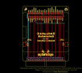
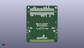
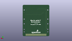
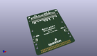

Contents
========

* [PROJ-SPAR-17512-STAN-01>SparkFun Qwiic pHAT Extension](#proj-spar-17512-stan-01sparkfun-qwiic-phat-extension)
	* [Images](#images)
	* [Interactive BOM](#interactive-bom)
	* [OOMP Parts](#oomp-parts)
	* [Tags](#tags)
  
![][im]
# PROJ-SPAR-17512-STAN-01>SparkFun Qwiic pHAT Extension

- ID: PROJ-SPAR-17512-STAN-01
- Hex ID: PRS17512
- Name: SparkFun Qwiic pHAT Extension
- Description: 

## Images
  
  

|eagleImage|kicadPcb3dFront|kicadPcb3dBack|kicadPcb3d|
| :---: | :---: | :---: | :---: |
|||||

## Interactive BOM

- Interactive BOM page: [ibom.html](kicad/bom/ibom.html)

## OOMP Parts
  

|OOMP Parts|
| :---: |
|UNMATCHED-UNMATCHED-X-UNMATCHED-01, FD1, 5.544600035999999, 19.498799965999996, 0,FD1, FIDUCIALUFIDUCIAL, FIDUCIAL-MICRO, SparkFun-Aesthetics, (0.21829134, 0.76766929), R0|
|UNMATCHED-UNMATCHED-X-UNMATCHED-01, FD2, 61.659799971999995, 59.99899989, 0,FD2, FIDUCIALUFIDUCIAL, FIDUCIAL-MICRO, SparkFun-Aesthetics, (2.42755118, 2.36216535), R0|
|UNMATCHED-UNMATCHED-X-UNMATCHED-01, FD3, 61.659799971999995, 59.98899991, M0,FD3, FIDUCIALUFIDUCIAL, FIDUCIAL-MICRO, SparkFun-Aesthetics, (2.42755118, 2.36177165), MR0|
|UNMATCHED-UNMATCHED-X-UNMATCHED-01, FD4, 5.544600035999999, 19.498799965999996, M0,FD4, FIDUCIALUFIDUCIAL, FIDUCIAL-MICRO, SparkFun-Aesthetics, (0.21829134, 0.76766929), MR0|
|UNMATCHED-UNMATCHED-X-UNMATCHED-01, J1, 8.360000044, 64.4660001, 0,J1, RASPBERRYPI-40-PIN-GPIO_SMD_MALE, RASPBERRY_PI_HAT_40_PIN_SMD_MALE, SparkFun-Connectors, (0.32913386, 2.5380315), R0|
|UNMATCHED-UNMATCHED-X-UNMATCHED-01, J2, 32.490000044, 3.51600008, 0,J2, RASPBERRYPI-40-PIN-GPIO_RIGHT_ANGLE, 2X20_RIGHT_ANGLE, SparkFun-Connectors, (1.27913386, 0.1384252), R0|
|UNMATCHED-UNMATCHED-X-UNMATCHED-01, J3, 59.76000011399999, 23.94800011, 90,J3, QWIIC_RIGHT_ANGLE, JST04_1MM_RA, SparkFun-Connectors, (2.35275591, 0.94283465), R90|
|UNMATCHED-UNMATCHED-X-UNMATCHED-01, J5, 5.132600098, 23.94800011, 270,J5, QWIIC_RIGHT_ANGLE, JST04_1MM_RA, SparkFun-Connectors, (0.20207087, 0.94283465), R270|

## Tags

- hexID: PRS17512
- oompType: PROJ
- oompSize: SPAR
- oompColor: 17512
- oompDesc: STAN
- oompIndex: 01
- oompName: SparkFun Qwiic pHAT Extension
- sources: All source files from https://github.com/sparkfun/SparkFun_Qwiic_pHAT_Extension (source licence details in srcLicense.md)
- linkBuyPage: https://www.sparkfun.com/products/17512
- oompPart: UNMATCHED-UNMATCHED-X-UNMATCHED-01, FD1, 5.544600035999999, 19.498799965999996, 0
- oompPart: UNMATCHED-UNMATCHED-X-UNMATCHED-01, FD2, 61.659799971999995, 59.99899989, 0
- oompPart: UNMATCHED-UNMATCHED-X-UNMATCHED-01, FD3, 61.659799971999995, 59.98899991, M0
- oompPart: UNMATCHED-UNMATCHED-X-UNMATCHED-01, FD4, 5.544600035999999, 19.498799965999996, M0
- oompPart: UNMATCHED-UNMATCHED-X-UNMATCHED-01, J1, 8.360000044, 64.4660001, 0
- oompPart: UNMATCHED-UNMATCHED-X-UNMATCHED-01, J2, 32.490000044, 3.51600008, 0
- oompPart: UNMATCHED-UNMATCHED-X-UNMATCHED-01, J3, 59.76000011399999, 23.94800011, 90
- oompPart: UNMATCHED-UNMATCHED-X-UNMATCHED-01, J5, 5.132600098, 23.94800011, 270
- rawPart: FD1, FIDUCIALUFIDUCIAL, FIDUCIAL-MICRO, SparkFun-Aesthetics, (0.21829134, 0.76766929), R0
- rawPart: FD2, FIDUCIALUFIDUCIAL, FIDUCIAL-MICRO, SparkFun-Aesthetics, (2.42755118, 2.36216535), R0
- rawPart: FD3, FIDUCIALUFIDUCIAL, FIDUCIAL-MICRO, SparkFun-Aesthetics, (2.42755118, 2.36177165), MR0
- rawPart: FD4, FIDUCIALUFIDUCIAL, FIDUCIAL-MICRO, SparkFun-Aesthetics, (0.21829134, 0.76766929), MR0
- rawPart: J1, RASPBERRYPI-40-PIN-GPIO_SMD_MALE, RASPBERRY_PI_HAT_40_PIN_SMD_MALE, SparkFun-Connectors, (0.32913386, 2.5380315), R0
- rawPart: J2, RASPBERRYPI-40-PIN-GPIO_RIGHT_ANGLE, 2X20_RIGHT_ANGLE, SparkFun-Connectors, (1.27913386, 0.1384252), R0
- rawPart: J3, QWIIC_RIGHT_ANGLE, JST04_1MM_RA, SparkFun-Connectors, (2.35275591, 0.94283465), R90
- rawPart: J5, QWIIC_RIGHT_ANGLE, JST04_1MM_RA, SparkFun-Connectors, (0.20207087, 0.94283465), R270

[im]: kicadPcb3d_450.png
