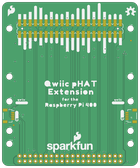

Contents
========

* [PRS17512 > SparkFun Qwiic pHAT Extension](#prs17512--sparkfun-qwiic-phat-extension)
	* [Schematic](#schematic)
	* [PCB](#pcb)
	* [Interactive BOM](#interactive-bom)
	* [OOMP Parts](#oomp-parts)
	* [Images](#images)
	* [Tags](#tags)
  
![][im]
# PRS17512 > SparkFun Qwiic pHAT Extension

- ID: PROJ-SPAR-17512-STAN-01
- Hex ID: PRS17512
- Name: Sparkfun
- Description: Sparkfun
- Long Link: [http://oom.lt/PROJ-SPAR-17512-STAN-01](http://oom.lt/PROJ-SPAR-17512-STAN-01)
- Short Link: [http://oom.lt/PRS17512](http://oom.lt/PRS17512)

## Schematic
  

## PCB
  

## Interactive BOM

- Interactive BOM page: [ibom.html](https://htmlpreview.github.io/?https://github.com/oomlout/oomlout_OOMP_projects/blob/main/PROJ-SPAR-17512-STAN-01/kicad/bom/ibom.html)

## OOMP Parts
  

|OOMP ID|Name|Identifier|
| :---: | :---: | :---: |
|HEAD-I01-X-UNMATCHED-01||J1|
|HEAD-I01-X-PI2X20-01||J2|
|[HEAD-JSTSH-X-PI04-RS](https://github.com/oomlout/oomlout_OOMP_parts/tree/main/HEAD-JSTSH-X-PI04-RS/)|[JST XH (1 mm) 4 Pin Header Right Angle (SMD)](https://github.com/oomlout/oomlout_OOMP_parts/tree/main/HEAD-JSTSH-X-PI04-RS/)|[J3, J5, LOGO1](https://github.com/oomlout/oomlout_OOMP_parts/tree/main/HEAD-JSTSH-X-PI04-RS/)|

## Images
  
  

|bominteractivefront|bominteractiveback|kicadPcb3d|kicadPcb3dFront|kicadPcb3dBack|kicadSchem|eagleImage|eagleSchemImage|pcbdraw|pcbdrawback|
| :---: | :---: | :---: | :---: | :---: | :---: | :---: | :---: | :---: | :---: |
|||||||||||

## Tags

- hexID: PRS17512
- oompType: PROJ
- oompSize: SPAR
- oompColor: 17512
- oompDesc: STAN
- oompIndex: 01
- oompName: SparkFun Qwiic pHAT Extension
- sources: All source files from https://github.com/sparkfun/SparkFun_Qwiic_pHAT_Extension (source licence details in srcLicense.md)
- linkBuyPage: https://www.sparkfun.com/products/17512
- oompID: PROJ-SPAR-17512-STAN-01
- oompParts: J1,HEAD-I01-X-UNMATCHED-01
- oompParts: J2,HEAD-I01-X-PI2X20-01
- oompParts: J3,HEAD-JSTSH-X-PI04-RS
- oompParts: J5,HEAD-JSTSH-X-PI04-RS
- oompParts: LOGO1,HEAD-JSTSH-X-PI04-RS
- rawParts: FD1,FIDUCIALUFIDUCIAL,FIDUCIALUFIDUCIAL,FIDUCIAL-MICRO,Fiducial Alignment Points,,,,,
- rawParts: FD2,FIDUCIALUFIDUCIAL,FIDUCIALUFIDUCIAL,FIDUCIAL-MICRO,Fiducial Alignment Points,,,,,
- rawParts: FD3,FIDUCIALUFIDUCIAL,FIDUCIALUFIDUCIAL,FIDUCIAL-MICRO,Fiducial Alignment Points,,,,,
- rawParts: FD4,FIDUCIALUFIDUCIAL,FIDUCIALUFIDUCIAL,FIDUCIAL-MICRO,Fiducial Alignment Points,,,,,
- rawParts: FRAME1,FRAME-LETTER,FRAME-LETTER,CREATIVE_COMMONS,Schematic Frame - Letter,,,,,
- rawParts: H1,STAND-OFFTIGHT,STAND-OFFTIGHT,STAND-OFF-TIGHT,Stand Off,,,,,
- rawParts: H2,STAND-OFFTIGHT,STAND-OFFTIGHT,STAND-OFF-TIGHT,Stand Off,,,,,
- rawParts: H3,STAND-OFFTIGHT,STAND-OFFTIGHT,STAND-OFF-TIGHT,Stand Off,,,,,
- rawParts: H4,STAND-OFFTIGHT,STAND-OFFTIGHT,STAND-OFF-TIGHT,Stand Off,,,,,
- rawParts: J1,RASPBERRYPI-40-PIN-GPIO_SMD_MALE,RASPBERRYPI-40-PIN-GPIO_SMD_MALE,RASPBERRY_PI_HAT_40_PIN_SMD_MALE,Raspberry Pi GPIO Header,,CONN-14915,,,
- rawParts: J2,RASPBERRYPI-40-PIN-GPIO_RIGHT_ANGLE,RASPBERRYPI-40-PIN-GPIO_RIGHT_ANGLE,2X20_RIGHT_ANGLE,Raspberry Pi GPIO Header,,,,,
- rawParts: J3,QWIIC_RIGHT_ANGLE,QWIIC_CONNECTORJS-1MM,JST04_1MM_RA,SparkFun I2C Standard Qwiic Connector,,CONN-13694,,QWIIC_RIGHT_ANGLE,
- rawParts: J5,QWIIC_RIGHT_ANGLE,QWIIC_CONNECTORJS-1MM,JST04_1MM_RA,SparkFun I2C Standard Qwiic Connector,,CONN-13694,,QWIIC_RIGHT_ANGLE,
- rawParts: LOGO1,QWIIC_LOGO_5MM,QWIIC_LOGO_5MM,QWIIC_5MM,Qwiic Logos for placement on schematic and PCB. The 5.5mm silk logo is best for placing next to Qwiic connector.,,,,,
- rawParts: LOGO2,SFE_LOGO_NAME_FLAME.2_INCH,SFE_LOGO_NAME_FLAME.2_INCH,SFE_LOGO_NAME_FLAME_.2,SparkFun Font Logo w/ Flame,,,,,
- rawParts: LOGO3,OSHW-LOGOM,OSHW-LOGOM,OSHW-LOGO-M,Open-Source Hardware (OSHW) Logo,,,,,

[im]: kicadPcb3d_450.png
