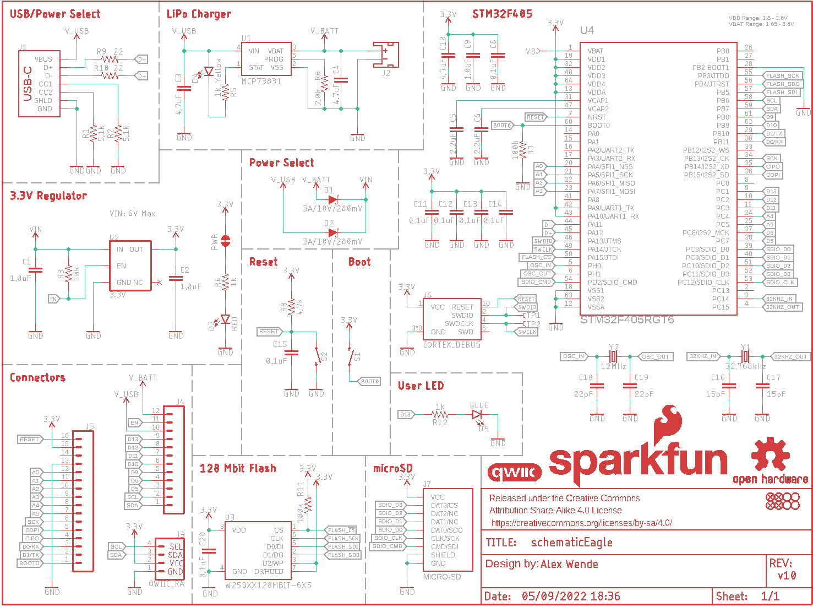
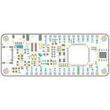
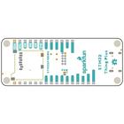
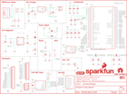
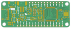
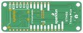

Contents
========

* [PRS17712 > STM32 Thing Plus](#prs17712--stm32-thing-plus)
	* [Schematic](#schematic)
	* [PCB](#pcb)
	* [Interactive BOM](#interactive-bom)
	* [Images](#images)
	* [Tags](#tags)
  
![][im]
# PRS17712 > STM32 Thing Plus

- ID: PROJ-SPAR-17712-STAN-01
- Hex ID: PRS17712
- Name: Sparkfun
- Description: Sparkfun
- Long Link: [http://oom.lt/PROJ-SPAR-17712-STAN-01](http://oom.lt/PROJ-SPAR-17712-STAN-01)
- Short Link: [http://oom.lt/PRS17712](http://oom.lt/PRS17712)

## Schematic
  

## PCB
  

## Interactive BOM

- Interactive BOM page: [ibom.html](https://htmlpreview.github.io/?https://github.com/oomlout/oomlout_OOMP_projects/blob/main/PROJ-SPAR-17712-STAN-01/kicad/bom/ibom.html)

## Images
  
  

|bominteractivefront|bominteractiveback|kicadPcb3d|kicadPcb3dFront|kicadPcb3dBack|eagleImage|eagleSchemImage|pcbdraw|pcbdrawback|
| :---: | :---: | :---: | :---: | :---: | :---: | :---: | :---: | :---: |
||||||||||

## Tags

- hexID: PRS17712
- oompType: PROJ
- oompSize: SPAR
- oompColor: 17712
- oompDesc: STAN
- oompIndex: 01
- oompName: STM32 Thing Plus
- sources: All source files from https://github.com/sparkfun/STM32_Thing_Plus (source licence details in srcLicense.md)
- linkBuyPage: https://www.sparkfun.com/products/17712
- oompID: PROJ-SPAR-17712-STAN-01
- rawParts: C1,1.0uF,1.0UF-0402T-16V-10%,0402-TIGHT,1µF ceramic capacitors,,CAP-12417,,,1.0uF,
- rawParts: C2,1.0uF,1.0UF-0402T-16V-10%,0402-TIGHT,1µF ceramic capacitors,,CAP-12417,,,1.0uF,
- rawParts: C3,4.7uF,4.7UF-0402_TIGHT-6.3V-20%-X5R,0402-TIGHT,4.7µF ceramic capacitors,,CAP-14240,,,4.7uF,
- rawParts: C4,4.7uF,4.7UF-0402_TIGHT-6.3V-20%-X5R,0402-TIGHT,4.7µF ceramic capacitors,,CAP-14240,,,4.7uF,
- rawParts: C5,2.2uF,2.2UF-0402_TIGHT-10V-10%-X5R,0402-TIGHT,2.2µF ceramic capacitors,,CAP-14232,,,2.2uF,
- rawParts: C6,2.2uF,2.2UF-0402_TIGHT-10V-10%-X5R,0402-TIGHT,2.2µF ceramic capacitors,,CAP-14232,,,2.2uF,
- rawParts: C8,0.1uF,0.1UF-0402T-10V-10%-X7R,0402-TIGHT,0.1µF ceramic capacitors,,CAP-15083,,,0.1uF,
- rawParts: C9,1.0uF,1.0UF-0402T-16V-10%,0402-TIGHT,1µF ceramic capacitors,,CAP-12417,,,1.0uF,
- rawParts: C10,4.7uF,4.7UF-0402_TIGHT-6.3V-20%-X5R,0402-TIGHT,4.7µF ceramic capacitors,,CAP-14240,,,4.7uF,
- rawParts: C11,0.1uF,0.1UF-0402T-10V-10%-X7R,0402-TIGHT,0.1µF ceramic capacitors,,CAP-15083,,,0.1uF,
- rawParts: C12,0.1uF,0.1UF-0402T-10V-10%-X7R,0402-TIGHT,0.1µF ceramic capacitors,,CAP-15083,,,0.1uF,
- rawParts: C13,0.1uF,0.1UF-0402T-10V-10%-X7R,0402-TIGHT,0.1µF ceramic capacitors,,CAP-15083,,,0.1uF,
- rawParts: C14,0.1uF,0.1UF-0402T-10V-10%-X7R,0402-TIGHT,0.1µF ceramic capacitors,,CAP-15083,,,0.1uF,
- rawParts: C15,0.1uF,0.1UF-0402T-10V-10%-X7R,0402-TIGHT,0.1µF ceramic capacitors,,CAP-15083,,,0.1uF,
- rawParts: C16,15pF,15PF-0402T-50V-5%,0402-TIGHT,15pF ceramic capacitors,,CAP-13063,,,15pF,
- rawParts: C17,15pF,15PF-0402T-50V-5%,0402-TIGHT,15pF ceramic capacitors,,CAP-13063,,,15pF,
- rawParts: C18,22pF,22PF-0402T-16V-10%,0402-TIGHT,22pF ceramic capacitors,,CAP-14674,,,22pF,
- rawParts: C19,22pF,22PF-0402T-16V-10%,0402-TIGHT,22pF ceramic capacitors,,CAP-14674,,,22pF,
- rawParts: C20,0.1uF,0.1UF-0402T-10V-10%-X7R,0402-TIGHT,0.1µF ceramic capacitors,,CAP-15083,,,0.1uF,
- rawParts: D1,3A/10V/280mV,DIODE-SCHOTTKY-BAT60A,SOD-323,Schottky diode,,DIO-14072,,,3A/10V/280mV,
- rawParts: D2,3A/10V/280mV,DIODE-SCHOTTKY-BAT60A,SOD-323,Schottky diode,,DIO-14072,,,3A/10V/280mV,
- rawParts: D3,RED,LED-RED0603,LED-0603,Red SMD LED,,DIO-00819,,,RED,
- rawParts: D4,Yellow,LED-YELLOW0603,LED-0603,Yellow SMD LED,,DIO-09003,,,Yellow,
- rawParts: D5,BLUE,LED-BLUE0603,LED-0603,Blue SMD LED,,DIO-08575,,,BLUE,
- rawParts: FD1,FIDUCIALUFIDUCIAL,FIDUCIALUFIDUCIAL,FIDUCIAL-MICRO,Fiducial Alignment Points,,,,,,
- rawParts: FD2,FIDUCIALUFIDUCIAL,FIDUCIALUFIDUCIAL,FIDUCIAL-MICRO,Fiducial Alignment Points,,,,,,
- rawParts: FD3,FIDUCIALUFIDUCIAL,FIDUCIALUFIDUCIAL,FIDUCIAL-MICRO,Fiducial Alignment Points,,,,,,
- rawParts: FD4,FIDUCIALUFIDUCIAL,FIDUCIALUFIDUCIAL,FIDUCIAL-MICRO,Fiducial Alignment Points,,,,,,
- rawParts: FRAME1,FRAME-LETTER,FRAME-LETTER,CREATIVE_COMMONS,Schematic Frame - Letter,,,,,,
- rawParts: H1,STAND-OFFTIGHT,STAND-OFFTIGHT,STAND-OFF-TIGHT,Stand Off,,,,,,
- rawParts: H2,STAND-OFFTIGHT,STAND-OFFTIGHT,STAND-OFF-TIGHT,Stand Off,,,,,,
- rawParts: H3,STAND-OFFTIGHT,STAND-OFFTIGHT,STAND-OFF-TIGHT,Stand Off,,,,,,
- rawParts: H4,STAND-OFFTIGHT,STAND-OFFTIGHT,STAND-OFF-TIGHT,Stand Off,,,,,,
- rawParts: J1,,USB_C_2-LAYER_PADS,USB-C-16P-2LAYER-PADS,USB Type C 16Pin Connector,,CONN-14122,,,,
- rawParts: J2,,JST_2MM_MALE,JST-2-SMD,JST 2MM MALE RA CONNECTOR,,CONN-11443,,PRT-08612,,
- rawParts: J3,QWIIC_RA,QWIIC_CONNECTORJS-1MM,JST04_1MM_RA,SparkFun I2C Standard Qwiic Connector,,CONN-13694,,,QWIIC_RIGHT_ANGLE,
- rawParts: J4,,CONN_12SM_SQ_NO_SILK,1X12_SM_SQ_NOSILK,Multi connection point. Often used as Generic Header-pin footprint for 0.1 inch spaced/style header connections,,,,,,
- rawParts: J5,,CONN_161X16_SM_SQ_NOSILK,1X16_SM_SQ_NOSILK,Multi connection point. Often used as Generic Header-pin footprint for 0.1 inch spaced/style header connections,,,,,,
- rawParts: J6,CORTEX_DEBUG,CORTEX_JTAG_DEBUG_MINIMUM_PTH_NS,2X5-PTH-1.27MM-NO_SILK,Cortex Debug Connector - 10 pin,,,,,,
- rawParts: J7,MICRO-SD,MICRO-SD-SDIOPUSH-PUSH,MICRO-SD-SOCKET,microSD Socket for Transflash,,CONN-07820,,,,
- rawParts: LOGO1,QWIIC_LOGO_5MM,QWIIC_LOGO_5MM,QWIIC_5MM,Qwiic Logos for placement on schematic and PCB. The 5.5mm silk logo is best for placing next to Qwiic connector.,,,,,,
- rawParts: LOGO2,SFE_LOGO_NAME_FLAME.1_INCH,SFE_LOGO_NAME_FLAME.1_INCH,SFE_LOGO_NAME_FLAME_.1,SparkFun Font Logo w/ Flame,,,,,,
- rawParts: LOGO3,OSHW-LOGOS,OSHW-LOGOS,OSHW-LOGO-S,Open-Source Hardware (OSHW) Logo,,,,,,
- rawParts: PWR,,JUMPER-SMT_2_NC_TRACE_NO-SILK,SMT-JUMPER_2_NC_TRACE_NO-SILK,Normally closed trace jumper,,,,,,
- rawParts: R1,5.1k,5.1KOHM5.1KOHM-0603-1/10W-1%,0603,,,RES-12083,,,5.1k,
- rawParts: R2,5.1k,5.1KOHM5.1KOHM-0603-1/10W-1%,0603,,,RES-12083,,,5.1k,
- rawParts: R3,10k,10KOHM-0603-1/10W-1%,0603,10kΩ resistor,,RES-00824,,,10k,
- rawParts: R4,1k,1KOHM-0402T-1/16W-1%,0402-TIGHT,1kΩ resistor,,RES-14342,,,1k,
- rawParts: R5,1k,1KOHM-0402T-1/16W-1%,0402-TIGHT,1kΩ resistor,,RES-14342,,,1k,
- rawParts: R6,2.0k,2.0KOHM-0603-1/10W-5%,0603,2kΩ resistor,,RES-08296,,,2.0k,
- rawParts: R7,100k,100KOHM-0402T-1/16W-1%,0402-TIGHT,100kΩ resistor,,RES-13495,,,100k,
- rawParts: R8,4.7k,4.7KOHM-0603-1/10W-1%,0603,4.7kΩ resistor,,RES-07857,,,4.7k,
- rawParts: R9,22,22OHM-0603-1/10W-1%,0603,22Ω resistor,,RES-08698,,,22,
- rawParts: R10,22,22OHM-0603-1/10W-1%,0603,22Ω resistor,,RES-08698,,,22,
- rawParts: R11,100k,100KOHM-0402T-1/16W-1%,0402-TIGHT,100kΩ resistor,,RES-13495,,,100k,
- rawParts: R12,1k,1KOHM-0402T-1/16W-1%,0402-TIGHT,1kΩ resistor,,RES-14342,,,1k,
- rawParts: S1,,MOMENTARY-SWITCH-SPST-SMD-4.6X2.8MM,TACTILE_SWITCH_SMD_4.6X2.8MM,Momentary Switch (Pushbutton) - SPST,,SWCH-15606,,,,
- rawParts: S2,,MOMENTARY-SWITCH-SPST-SMD-4.6X2.8MM,TACTILE_SWITCH_SMD_4.6X2.8MM,Momentary Switch (Pushbutton) - SPST,,SWCH-15606,,,,
- rawParts: TP1,,TEST-POINT3,PAD.03X.03,SparkFun Test Points,,,,,,
- rawParts: TP2,,TEST-POINT3,PAD.03X.03,SparkFun Test Points,,,,,,
- rawParts: U1,MCP73831,MCP73831,SOT23-5,MCP73831T Li-Ion, Li-Pol Controller,,IC-09995,,,,
- rawParts: U2,3.3V,V_REG_AP2112K-3.3V,SOT23-5,AP2112 - 600mA CMOS LDO Regulator w/ Enable,,VREG-12457,,,3.3V,
- rawParts: U3,W25QXX128MBIT-6X5,W25QXX128MBIT-6X5,WSON-8-6X5,,,IC-15107,,,,
- rawParts: U4,STM32F405RGT6,STM32F405RG,TQFP64,STM32F405RGT6,,IC-11709,,,STM32F405RGT6,
- rawParts: VB,,TEST-POINT3,PAD.03X.03,SparkFun Test Points,,,,,,
- rawParts: Y1,32.768kHz,CRYSTAL-32.768KHZSMD-3.2X1.5,CRYSTAL-SMD-3.2X1.5MM,32.768kHz Crystal,,XTAL-13062,,,32.768kHz,
- rawParts: Y2,12MHz,CRYSTAL-12MHZ,CRYSTAL-SMD-5X3.2-4PAD,12.0MHz Crystal,,XTAL-08297,,,12MHz,

[im]: kicadPcb3d_450.png
