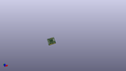

Contents
========

* [PROJ-SPAR-17713-STAN-01>MicroMod STM32 Processor](#proj-spar-17713-stan-01micromod-stm32-processor)
	* [Images](#images)
	* [Interactive BOM](#interactive-bom)
	* [OOMP Parts](#oomp-parts)
	* [Tags](#tags)
  
![][im]
# PROJ-SPAR-17713-STAN-01>MicroMod STM32 Processor

- ID: PROJ-SPAR-17713-STAN-01
- Hex ID: PRS17713
- Name: MicroMod STM32 Processor
- Description: 

## Images
  
  

|eagleImage|kicadPcb3dFront|kicadPcb3dBack|kicadPcb3d|
| :---: | :---: | :---: | :---: |
|||||

## Interactive BOM

- Interactive BOM page: [ibom.html](kicad/bom/ibom.html)

## OOMP Parts
  

|OOMP Parts|
| :---: |
|CAPE-0402-X-UNMATCHED-01, C1, 2.000000064, 15.220000039999999, 180,C1, 22pF, 0402-TIGHT, SparkFun-Capacitors, (0.07874016, 0.5992126), R180|
|CAPE-0402-X-UNMATCHED-01, C2, 1.140000006, 7.5700001, 270,C2, 22pF, 0402-TIGHT, SparkFun-Capacitors, (0.04488189, 0.2980315), R270|
|CAPE-0402-X-UNMATCHED-01, C3, 1.990000084, 16.230000051999998, 180,C3, 15pF, 0402-TIGHT, SparkFun-Capacitors, (0.07834646, 0.63897638), R180|
|CAPE-0402-X-UNMATCHED-01, C4, 1.990000084, 19.954999968, 180,C4, 15pF, 0402-TIGHT, SparkFun-Capacitors, (0.07834646, 0.78562992), R180|
|CAPE-0402-X-UF22D-01, C5, 17.969999874, 4.869999912, 0,C5, 2.2uF, 0402-TIGHT, SparkFun-Capacitors, (0.70748031, 0.19173228), R0|
|CAPE-0402-X-UF22D-01, C6, 19.999999877999997, 15.330000074, 0,C6, 2.2uF, 0402-TIGHT, SparkFun-Capacitors, (0.78740157, 0.60354331), R0|
|CAPE-0402-X-NF100-01, C8, 1.140000006, 5.560000056, 270,C8, 0.1uF, 0402-TIGHT, SparkFun-Capacitors, (0.04488189, 0.21889764), R270|
|CAPE-0402-X-UNMATCHED-01, C9, 2.1400000379999997, 5.560000056, 270,C9, 1.0uF, 0402-TIGHT, SparkFun-Capacitors, (0.08425197, 0.21889764), R270|
|CAPE-0402-X-UNMATCHED-01, C10, 3.1400000699999997, 5.550000076, 270,C10, 4.7uF, 0402-TIGHT, SparkFun-Capacitors, (0.12362205, 0.21850394), R270|
|CAPE-0402-X-NF100-01, C11, 7.7499999939999995, 19.650000069999997, 0,C11, 0.1uF, 0402-TIGHT, SparkFun-Capacitors, (0.30511811, 0.77362205), R0|
|CAPE-0402-X-NF100-01, C12, 17.969999874, 5.800000084, 0,C12, 0.1uF, 0402-TIGHT, SparkFun-Capacitors, (0.70748031, 0.22834646), R0|
|CAPE-0402-X-NF100-01, C13, 19.999999877999997, 16.250000011999997, 0,C13, 0.1uF, 0402-TIGHT, SparkFun-Capacitors, (0.78740157, 0.63976378), R0|
|CAPE-0402-X-NF100-01, C14, 7.7499999939999995, 20.589999967999997, 0,C14, 0.1uF, 0402-TIGHT, SparkFun-Capacitors, (0.30511811, 0.81062992), R0|
|CAPE-0402-X-NF100-01, C15, 2.1400000379999997, 7.56000012, 270,C15, 0.1uF, 0402-TIGHT, SparkFun-Capacitors, (0.08425197, 0.2976378), R270|
|CAPE-0402-X-NF100-01, C20, 16.90599997, 11.933000009999999, M90,C20, 0.1uF, 0402-TIGHT, SparkFun-Capacitors, (0.66559055, 0.46980315), MR90|
|UNMATCHED-0603-X-UNMATCHED-01, D5, 19.68000001, 20.810000035999998, 0,D5, BLUE, LED-0603, SparkFun-LED, (0.77480315, 0.81929134), R0|
|UNMATCHED-UNMATCHED-X-UNMATCHED-01, FD1, 20.825000006, 7.0770000699999995, 0,FD1, FIDUCIALUFIDUCIAL, FIDUCIAL-MICRO, SparkFun-Aesthetics, (0.81988189, 0.27862205), R0|
|UNMATCHED-UNMATCHED-X-UNMATCHED-01, FD2, 5.200000014, 21.040000084, M0,FD2, FIDUCIALUFIDUCIAL, FIDUCIAL-MICRO, SparkFun-Aesthetics, (0.20472441, 0.82834646), MR0|
|UNMATCHED-UNMATCHED-X-UNMATCHED-01, FD3, 21.180000057999997, 6.97000003, M0,FD3, FIDUCIALUFIDUCIAL, FIDUCIAL-MICRO, SparkFun-Aesthetics, (0.83385827, 0.27440945), MR0|
|UNMATCHED-UNMATCHED-X-UNMATCHED-01, FD4, 5.200000014, 21.040000084, 0,FD4, FIDUCIALUFIDUCIAL, FIDUCIAL-MICRO, SparkFun-Aesthetics, (0.20472441, 0.82834646), R0|
|UNMATCHED-UNMATCHED-X-UNMATCHED-01, J1, 11.000000098, 0.0, 0,J1, MICROMOD-2222, M.2-CARD-E-22, SparkFun-MicroMod, (0.43307087, 0), R0|
|UNMATCHED-UNMATCHED-X-UNMATCHED-01, Q1, 18.400000029999998, 14.529999895999998, M180,Q1, SOT23-3, SparkFun-DiscreteSemi, (0.72440945, 0.57204724), MR180|
|<table><tr><td></td><td> R1</td><td>[RESE-0402-X-O104-01 SMD (0402) 100k Ohm Resistor](https://github.com/oomlout/oomlout_OOMP_parts/tree/main/RESE-0402-X-O104-01/)</td><td>[R42104](https://github.com/oomlout/oomlout_OOMP_parts/tree/main/RESE-0402-X-O104-01/)</td></tr></table>|
|RESE-0402-X-UNMATCHED-01, R2, 19.999999877999997, 13.489999944, 180,R2, 22, 0402-TIGHT, SparkFun-Resistors, (0.78740157, 0.53110236), R180|
|RESE-0402-X-UNMATCHED-01, R3, 19.999999877999997, 14.409999881999997, 180,R3, 22, 0402-TIGHT, SparkFun-Resistors, (0.78740157, 0.56732283), R180|
|RESE-0402-X-UNMATCHED-01, R4, 3.13000009, 7.549999886, 270,R4, 5.1k, 0402-TIGHT, SparkFun-Resistors, (0.12322835, 0.29724409), R270|
|<table><tr><td></td><td> R5</td><td>[RESE-0402-X-O104-01 SMD (0402) 100k Ohm Resistor](https://github.com/oomlout/oomlout_OOMP_parts/tree/main/RESE-0402-X-O104-01/)</td><td>[R42104](https://github.com/oomlout/oomlout_OOMP_parts/tree/main/RESE-0402-X-O104-01/)</td></tr></table>|
|<table><tr><td></td><td> R11</td><td>[RESE-0402-X-O104-01 SMD (0402) 100k Ohm Resistor](https://github.com/oomlout/oomlout_OOMP_parts/tree/main/RESE-0402-X-O104-01/)</td><td>[R42104](https://github.com/oomlout/oomlout_OOMP_parts/tree/main/RESE-0402-X-O104-01/)</td></tr></table>|
|RESE-0402-X-UNMATCHED-01, R12, 19.68000001, 18.250000076, 180,R12, 1k, 0402-TIGHT, SparkFun-Resistors, (0.77480315, 0.71850394), R180|
|UNMATCHED-UNMATCHED-X-UNMATCHED-01, U1, 11.079999938, 12.07999997, 270,U1, STM32F405RGT6, TQFP64, STM32_Temp, (0.43622047, 0.47559055), R270|
|UNMATCHED-UNMATCHED-X-UNMATCHED-01, U3, 10.19999992, 12.999999908, M180,U3, W25QXX128MBIT-6X5, WSON-8-6X5, SparkFun-MicroMod, (0.4015748, 0.51181102), MR180|
|UNMATCHED-UNMATCHED-X-UNMATCHED-01, Y1, 2.020000024, 11.660000047999999, 270,Y1, 12MHz, CRYSTAL-SMD-5X3.2-4PAD, SparkFun-Clocks, (0.07952756, 0.45905512), R270|
|UNMATCHED-UNMATCHED-X-UNMATCHED-01, Y2, 2.150000018, 18.069999927999998, 0,Y2, 32.768kHz, CRYSTAL-SMD-3.2X1.5MM, SparkFun-Clocks, (0.08464567, 0.71141732), R0|

## Tags

- hexID: PRS17713
- oompType: PROJ
- oompSize: SPAR
- oompColor: 17713
- oompDesc: STAN
- oompIndex: 01
- oompName: MicroMod STM32 Processor
- sources: All source files from https://github.com/sparkfun/MicroMod_STM32_Processor (source licence details in srcLicense.md)
- linkBuyPage: https://www.sparkfun.com/products/17713
- oompPart: CAPE-0402-X-UNMATCHED-01, C1, 2.000000064, 15.220000039999999, 180
- oompPart: CAPE-0402-X-UNMATCHED-01, C2, 1.140000006, 7.5700001, 270
- oompPart: CAPE-0402-X-UNMATCHED-01, C3, 1.990000084, 16.230000051999998, 180
- oompPart: CAPE-0402-X-UNMATCHED-01, C4, 1.990000084, 19.954999968, 180
- oompPart: CAPE-0402-X-UF22D-01, C5, 17.969999874, 4.869999912, 0
- oompPart: CAPE-0402-X-UF22D-01, C6, 19.999999877999997, 15.330000074, 0
- oompPart: CAPE-0402-X-NF100-01, C8, 1.140000006, 5.560000056, 270
- oompPart: CAPE-0402-X-UNMATCHED-01, C9, 2.1400000379999997, 5.560000056, 270
- oompPart: CAPE-0402-X-UNMATCHED-01, C10, 3.1400000699999997, 5.550000076, 270
- oompPart: CAPE-0402-X-NF100-01, C11, 7.7499999939999995, 19.650000069999997, 0
- oompPart: CAPE-0402-X-NF100-01, C12, 17.969999874, 5.800000084, 0
- oompPart: CAPE-0402-X-NF100-01, C13, 19.999999877999997, 16.250000011999997, 0
- oompPart: CAPE-0402-X-NF100-01, C14, 7.7499999939999995, 20.589999967999997, 0
- oompPart: CAPE-0402-X-NF100-01, C15, 2.1400000379999997, 7.56000012, 270
- oompPart: CAPE-0402-X-NF100-01, C20, 16.90599997, 11.933000009999999, M90
- oompPart: UNMATCHED-0603-X-UNMATCHED-01, D5, 19.68000001, 20.810000035999998, 0
- oompPart: UNMATCHED-UNMATCHED-X-UNMATCHED-01, FD1, 20.825000006, 7.0770000699999995, 0
- oompPart: UNMATCHED-UNMATCHED-X-UNMATCHED-01, FD2, 5.200000014, 21.040000084, M0
- oompPart: UNMATCHED-UNMATCHED-X-UNMATCHED-01, FD3, 21.180000057999997, 6.97000003, M0
- oompPart: UNMATCHED-UNMATCHED-X-UNMATCHED-01, FD4, 5.200000014, 21.040000084, 0
- oompPart: UNMATCHED-UNMATCHED-X-UNMATCHED-01, J1, 11.000000098, 0.0, 0
- oompPart: UNMATCHED-UNMATCHED-X-UNMATCHED-01, Q1, 18.400000029999998, 14.529999895999998, M180
- oompPart: RESE-0402-X-O104-01, R1, 18.400000029999998, 17.720000119999998, M0
- oompPart: RESE-0402-X-UNMATCHED-01, R2, 19.999999877999997, 13.489999944, 180
- oompPart: RESE-0402-X-UNMATCHED-01, R3, 19.999999877999997, 14.409999881999997, 180
- oompPart: RESE-0402-X-UNMATCHED-01, R4, 3.13000009, 7.549999886, 270
- oompPart: RESE-0402-X-O104-01, R5, 18.400000029999998, 16.730000068, M180
- oompPart: RESE-0402-X-O104-01, R11, 7.820000108, 8.399999964, M180
- oompPart: RESE-0402-X-UNMATCHED-01, R12, 19.68000001, 18.250000076, 180
- oompPart: UNMATCHED-UNMATCHED-X-UNMATCHED-01, U1, 11.079999938, 12.07999997, 270
- oompPart: UNMATCHED-UNMATCHED-X-UNMATCHED-01, U3, 10.19999992, 12.999999908, M180
- oompPart: UNMATCHED-UNMATCHED-X-UNMATCHED-01, Y1, 2.020000024, 11.660000047999999, 270
- oompPart: UNMATCHED-UNMATCHED-X-UNMATCHED-01, Y2, 2.150000018, 18.069999927999998, 0
- rawPart: C1, 22pF, 0402-TIGHT, SparkFun-Capacitors, (0.07874016, 0.5992126), R180
- rawPart: C2, 22pF, 0402-TIGHT, SparkFun-Capacitors, (0.04488189, 0.2980315), R270
- rawPart: C3, 15pF, 0402-TIGHT, SparkFun-Capacitors, (0.07834646, 0.63897638), R180
- rawPart: C4, 15pF, 0402-TIGHT, SparkFun-Capacitors, (0.07834646, 0.78562992), R180
- rawPart: C5, 2.2uF, 0402-TIGHT, SparkFun-Capacitors, (0.70748031, 0.19173228), R0
- rawPart: C6, 2.2uF, 0402-TIGHT, SparkFun-Capacitors, (0.78740157, 0.60354331), R0
- rawPart: C8, 0.1uF, 0402-TIGHT, SparkFun-Capacitors, (0.04488189, 0.21889764), R270
- rawPart: C9, 1.0uF, 0402-TIGHT, SparkFun-Capacitors, (0.08425197, 0.21889764), R270
- rawPart: C10, 4.7uF, 0402-TIGHT, SparkFun-Capacitors, (0.12362205, 0.21850394), R270
- rawPart: C11, 0.1uF, 0402-TIGHT, SparkFun-Capacitors, (0.30511811, 0.77362205), R0
- rawPart: C12, 0.1uF, 0402-TIGHT, SparkFun-Capacitors, (0.70748031, 0.22834646), R0
- rawPart: C13, 0.1uF, 0402-TIGHT, SparkFun-Capacitors, (0.78740157, 0.63976378), R0
- rawPart: C14, 0.1uF, 0402-TIGHT, SparkFun-Capacitors, (0.30511811, 0.81062992), R0
- rawPart: C15, 0.1uF, 0402-TIGHT, SparkFun-Capacitors, (0.08425197, 0.2976378), R270
- rawPart: C20, 0.1uF, 0402-TIGHT, SparkFun-Capacitors, (0.66559055, 0.46980315), MR90
- rawPart: D5, BLUE, LED-0603, SparkFun-LED, (0.77480315, 0.81929134), R0
- rawPart: FD1, FIDUCIALUFIDUCIAL, FIDUCIAL-MICRO, SparkFun-Aesthetics, (0.81988189, 0.27862205), R0
- rawPart: FD2, FIDUCIALUFIDUCIAL, FIDUCIAL-MICRO, SparkFun-Aesthetics, (0.20472441, 0.82834646), MR0
- rawPart: FD3, FIDUCIALUFIDUCIAL, FIDUCIAL-MICRO, SparkFun-Aesthetics, (0.83385827, 0.27440945), MR0
- rawPart: FD4, FIDUCIALUFIDUCIAL, FIDUCIAL-MICRO, SparkFun-Aesthetics, (0.20472441, 0.82834646), R0
- rawPart: J1, MICROMOD-2222, M.2-CARD-E-22, SparkFun-MicroMod, (0.43307087, 0), R0
- rawPart: Q1, SOT23-3, SparkFun-DiscreteSemi, (0.72440945, 0.57204724), MR180
- rawPart: R1, 100k, 0402-TIGHT, SparkFun-Resistors, (0.72440945, 0.6976378), MR0
- rawPart: R2, 22, 0402-TIGHT, SparkFun-Resistors, (0.78740157, 0.53110236), R180
- rawPart: R3, 22, 0402-TIGHT, SparkFun-Resistors, (0.78740157, 0.56732283), R180
- rawPart: R4, 5.1k, 0402-TIGHT, SparkFun-Resistors, (0.12322835, 0.29724409), R270
- rawPart: R5, 100k, 0402-TIGHT, SparkFun-Resistors, (0.72440945, 0.65866142), MR180
- rawPart: R11, 100k, 0402-TIGHT, SparkFun-Resistors, (0.30787402, 0.33070866), MR180
- rawPart: R12, 1k, 0402-TIGHT, SparkFun-Resistors, (0.77480315, 0.71850394), R180
- rawPart: U1, STM32F405RGT6, TQFP64, STM32_Temp, (0.43622047, 0.47559055), R270
- rawPart: U3, W25QXX128MBIT-6X5, WSON-8-6X5, SparkFun-MicroMod, (0.4015748, 0.51181102), MR180
- rawPart: Y1, 12MHz, CRYSTAL-SMD-5X3.2-4PAD, SparkFun-Clocks, (0.07952756, 0.45905512), R270
- rawPart: Y2, 32.768kHz, CRYSTAL-SMD-3.2X1.5MM, SparkFun-Clocks, (0.08464567, 0.71141732), R0

[im]: kicadPcb3d_450.png
