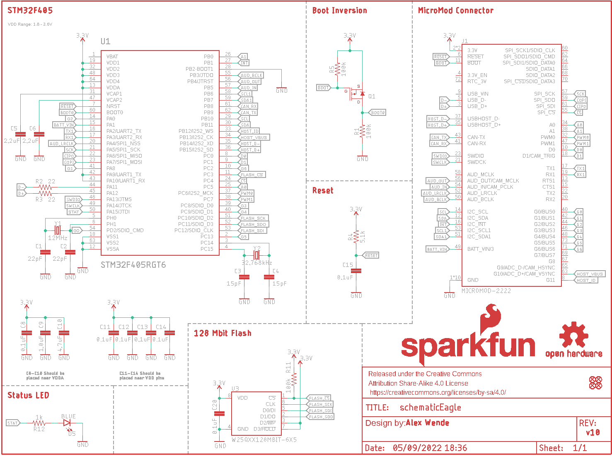
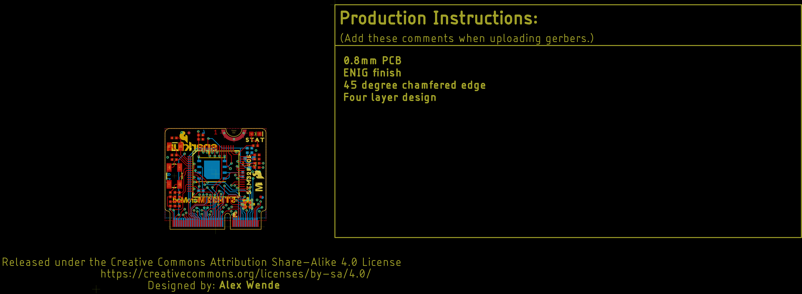
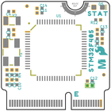
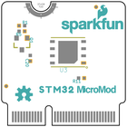
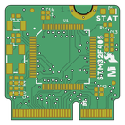
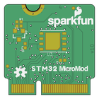

Contents
========

* [PRS17713 > MicroMod STM32 Processor](#prs17713--micromod-stm32-processor)
	* [Schematic](#schematic)
	* [PCB](#pcb)
	* [Interactive BOM](#interactive-bom)
	* [Images](#images)
	* [Tags](#tags)
  
![][im]
# PRS17713 > MicroMod STM32 Processor

- ID: PROJ-SPAR-17713-STAN-01
- Hex ID: PRS17713
- Name: Sparkfun
- Description: Sparkfun
- Long Link: [http://oom.lt/PROJ-SPAR-17713-STAN-01](http://oom.lt/PROJ-SPAR-17713-STAN-01)
- Short Link: [http://oom.lt/PRS17713](http://oom.lt/PRS17713)

## Schematic
  

## PCB
  

## Interactive BOM

- Interactive BOM page: [ibom.html](https://htmlpreview.github.io/?https://github.com/oomlout/oomlout_OOMP_projects/blob/main/PROJ-SPAR-17713-STAN-01/kicad/bom/ibom.html)

## Images
  
  

|bominteractivefront|bominteractiveback|kicadPcb3d|kicadPcb3dFront|kicadPcb3dBack|eagleImage|eagleSchemImage|pcbdraw|pcbdrawback|
| :---: | :---: | :---: | :---: | :---: | :---: | :---: | :---: | :---: |
||||||||||

## Tags

- hexID: PRS17713
- oompType: PROJ
- oompSize: SPAR
- oompColor: 17713
- oompDesc: STAN
- oompIndex: 01
- oompName: MicroMod STM32 Processor
- sources: All source files from https://github.com/sparkfun/MicroMod_STM32_Processor (source licence details in srcLicense.md)
- linkBuyPage: https://www.sparkfun.com/products/17713
- oompID: PROJ-SPAR-17713-STAN-01
- rawParts: C1,22pF,22PF-0402T-16V-10%,0402-TIGHT,22pF ceramic capacitors,,CAP-14674,,,22pF,
- rawParts: C2,22pF,22PF-0402T-16V-10%,0402-TIGHT,22pF ceramic capacitors,,CAP-14674,,,22pF,
- rawParts: C3,15pF,15PF-0402T-50V-5%,0402-TIGHT,15pF ceramic capacitors,,CAP-13063,,,15pF,
- rawParts: C4,15pF,15PF-0402T-50V-5%,0402-TIGHT,15pF ceramic capacitors,,CAP-13063,,,15pF,
- rawParts: C5,2.2uF,2.2UF-0402_TIGHT-10V-10%-X5R,0402-TIGHT,2.2µF ceramic capacitors,,CAP-14232,,,2.2uF,
- rawParts: C6,2.2uF,2.2UF-0402_TIGHT-10V-10%-X5R,0402-TIGHT,2.2µF ceramic capacitors,,CAP-14232,,,2.2uF,
- rawParts: C8,0.1uF,0.1UF-0402T-10V-10%-X7R,0402-TIGHT,0.1µF ceramic capacitors,,CAP-15083,,C,0.1uF,
- rawParts: C9,1.0uF,1.0UF-0402T-16V-10%,0402-TIGHT,1µF ceramic capacitors,,CAP-12417,,C,1.0uF,
- rawParts: C10,4.7uF,4.7UF-0402_TIGHT-6.3V-20%-X5R,0402-TIGHT,4.7µF ceramic capacitors,,CAP-14240,,C,4.7uF,
- rawParts: C11,0.1uF,0.1UF-0402T-10V-10%-X7R,0402-TIGHT,0.1µF ceramic capacitors,,CAP-15083,,,0.1uF,
- rawParts: C12,0.1uF,0.1UF-0402T-10V-10%-X7R,0402-TIGHT,0.1µF ceramic capacitors,,CAP-15083,,,0.1uF,
- rawParts: C13,0.1uF,0.1UF-0402T-10V-10%-X7R,0402-TIGHT,0.1µF ceramic capacitors,,CAP-15083,,,0.1uF,
- rawParts: C14,0.1uF,0.1UF-0402T-10V-10%-X7R,0402-TIGHT,0.1µF ceramic capacitors,,CAP-15083,,,0.1uF,
- rawParts: C15,0.1uF,0.1UF-0402T-10V-10%-X7R,0402-TIGHT,0.1µF ceramic capacitors,,CAP-15083,,,0.1uF,
- rawParts: C20,0.1uF,0.1UF-0402T-10V-10%-X7R,0402-TIGHT,0.1µF ceramic capacitors,,CAP-15083,,,0.1uF,
- rawParts: D5,BLUE,LED-BLUE0603,LED-0603,Blue SMD LED,,DIO-08575,,,BLUE,
- rawParts: FD1,FIDUCIALUFIDUCIAL,FIDUCIALUFIDUCIAL,FIDUCIAL-MICRO,Fiducial Alignment Points,,,,,,
- rawParts: FD2,FIDUCIALUFIDUCIAL,FIDUCIALUFIDUCIAL,FIDUCIAL-MICRO,Fiducial Alignment Points,,,,,,
- rawParts: FD3,FIDUCIALUFIDUCIAL,FIDUCIALUFIDUCIAL,FIDUCIAL-MICRO,Fiducial Alignment Points,,,,,,
- rawParts: FD4,FIDUCIALUFIDUCIAL,FIDUCIALUFIDUCIAL,FIDUCIAL-MICRO,Fiducial Alignment Points,,,,,,
- rawParts: FRAME1,FRAME-LETTER,FRAME-LETTER,CREATIVE_COMMONS,Schematic Frame - Letter,,,,,,
- rawParts: J1,MICROMOD-2222,MICROMOD-2222,M.2-CARD-E-22,MicroMod Connector,,,,,,
- rawParts: LOGO2,OSHW-LOGOS,OSHW-LOGOS,OSHW-LOGO-S,Open-Source Hardware (OSHW) Logo,,,,,,
- rawParts: LOGO3,SFE_LOGO_NAME_FLAME.1_INCH,SFE_LOGO_NAME_FLAME.1_INCH,SFE_LOGO_NAME_FLAME_.1,SparkFun Font Logo w/ Flame,,,,,,
- rawParts: Q1,,MOSFET_PCH-DMG2305UX-7,SOT23-3,P-channel MOSFETs,,TRAN-14388,,,20V/4.2A/52mΩ/1.4W,
- rawParts: R1,100k,100KOHM-0402T-1/16W-1%,0402-TIGHT,100kΩ resistor,,RES-13495,,,100k,
- rawParts: R2,22,22OHM-0402T-1/16W-1%,0402-TIGHT,22Ω resistor,,RES-12427,,,,
- rawParts: R3,22,22OHM-0402T-1/16W-1%,0402-TIGHT,22Ω resistor,,RES-12427,,,,
- rawParts: R4,5.1k,5.1KOHM-0402T-1/16W-1%,0402-TIGHT,,,RES-14340,,,5.1k,
- rawParts: R5,100k,100KOHM-0402T-1/16W-1%,0402-TIGHT,100kΩ resistor,,RES-13495,,,100k,
- rawParts: R11,100k,100KOHM-0402T-1/16W-1%,0402-TIGHT,100kΩ resistor,,RES-13495,,,100k,
- rawParts: R12,1k,1KOHM-0402T-1/16W-1%,0402-TIGHT,1kΩ resistor,,RES-14342,,,1k,
- rawParts: U1,STM32F405RGT6,STM32F405RG,TQFP64,STM32F405RGT6,,IC-11709,,,STM32F405RGT6,
- rawParts: U3,W25QXX128MBIT-6X5,W25QXX128MBIT-6X5,WSON-8-6X5,,,IC-15107,,,,
- rawParts: Y1,12MHz,CRYSTAL-12MHZ,CRYSTAL-SMD-5X3.2-4PAD,12.0MHz Crystal,,XTAL-08297,,,12MHz,
- rawParts: Y2,32.768kHz,CRYSTAL-32.768KHZSMD-3.2X1.5,CRYSTAL-SMD-3.2X1.5MM,32.768kHz Crystal,,XTAL-13062,,,32.768kHz,

[im]: kicadPcb3d_450.png
