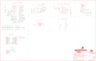

Contents
========

* [PRS17717 > SparkFun Pro Micro-RP2040](#prs17717--sparkfun-pro-micro-rp2040)
	* [Schematic](#schematic)
	* [PCB](#pcb)
	* [Interactive BOM](#interactive-bom)
	* [Images](#images)
	* [Tags](#tags)
  
![][im]
# PRS17717 > SparkFun Pro Micro-RP2040

- ID: PROJ-SPAR-17717-STAN-01
- Hex ID: PRS17717
- Name: Sparkfun
- Description: Sparkfun
- Long Link: [http://oom.lt/PROJ-SPAR-17717-STAN-01](http://oom.lt/PROJ-SPAR-17717-STAN-01)
- Short Link: [http://oom.lt/PRS17717](http://oom.lt/PRS17717)

## Schematic
  

## PCB
  

## Interactive BOM

- Interactive BOM page: [ibom.html](https://htmlpreview.github.io/?https://github.com/oomlout/oomlout_OOMP_projects/blob/main/PROJ-SPAR-17717-STAN-01/kicad/bom/ibom.html)

## Images
  
  

|bominteractivefront|bominteractiveback|kicadPcb3d|kicadPcb3dFront|kicadPcb3dBack|eagleImage|eagleSchemImage|pcbdraw|pcbdrawback|
| :---: | :---: | :---: | :---: | :---: | :---: | :---: | :---: | :---: |
||||||||||

## Tags

- hexID: PRS17717
- oompType: PROJ
- oompSize: SPAR
- oompColor: 17717
- oompDesc: STAN
- oompIndex: 01
- oompName: SparkFun Pro Micro-RP2040
- sources: All source files from https://github.com/sparkfun/SparkFun_Pro_Micro-RP2040 (source licence details in srcLicense.md)
- linkBuyPage: https://www.sparkfun.com/products/17717
- oompID: PROJ-SPAR-17717-STAN-01
- rawParts: C6,1.0uF,1.0UF-0402T-16V-10%,0402-TIGHT,1µF ceramic capacitors,,CAP-12417,,1.0uF,
- rawParts: C7,10uF,10UF-0402T-6.3V-20%,0402-TIGHT,10.0µF ceramic capacitors,,CAP-14848,,10uF,
- rawParts: C8,10uF,10UF-0402T-6.3V-20%,0402-TIGHT,10.0µF ceramic capacitors,,CAP-14848,,10uF,
- rawParts: C9,0.1uF,0.1UF-0402T-6.3V-10%-X7R,0402-TIGHT,0.1µF ceramic capacitors,,CAP-14993,,0.1uF,
- rawParts: C11,15pF,15PF-0402T-50V-5%,0402-TIGHT,15pF ceramic capacitors,,CAP-13063,,15pF,
- rawParts: C12,0.1uF,0.1UF-0402T-6.3V-10%-X7R,0402-TIGHT,0.1µF ceramic capacitors,,CAP-14993,,0.1uF,
- rawParts: C13,15pF,15PF-0402T-50V-5%,0402-TIGHT,15pF ceramic capacitors,,CAP-13063,,15pF,
- rawParts: C14,0.1uF,0.1UF-0402T-6.3V-10%-X7R,0402-TIGHT,0.1µF ceramic capacitors,,CAP-14993,,0.1uF,
- rawParts: C15,0.1uF,0.1UF-0402T-6.3V-10%-X7R,0402-TIGHT,0.1µF ceramic capacitors,,CAP-14993,,0.1uF,
- rawParts: C16,0.1uF,0.1UF-0402T-6.3V-10%-X7R,0402-TIGHT,0.1µF ceramic capacitors,,CAP-14993,,0.1uF,
- rawParts: C17,0.1uF,0.1UF-0402T-6.3V-10%-X7R,0402-TIGHT,0.1µF ceramic capacitors,,CAP-14993,,0.1uF,
- rawParts: C18,0.1uF,0.1UF-0402T-6.3V-10%-X7R,0402-TIGHT,0.1µF ceramic capacitors,,CAP-14993,,0.1uF,
- rawParts: C19,0.1uF,0.1UF-0402T-6.3V-10%-X7R,0402-TIGHT,0.1µF ceramic capacitors,,CAP-14993,,0.1uF,
- rawParts: C20,2.2uF,2.2UF-0402_TIGHT-10V-10%-X5R,0402-TIGHT,2.2µF ceramic capacitors,,CAP-14232,,2.2uF,
- rawParts: C21,2.2uF,2.2UF-0402_TIGHT-10V-10%-X5R,0402-TIGHT,2.2µF ceramic capacitors,,CAP-14232,,2.2uF,
- rawParts: C22,2.2uF,2.2UF-0402_TIGHT-10V-10%-X5R,0402-TIGHT,2.2µF ceramic capacitors,,CAP-14232,,2.2uF,
- rawParts: C23,2.2uF,2.2UF-0402_TIGHT-10V-10%-X5R,0402-TIGHT,2.2µF ceramic capacitors,,CAP-14232,,2.2uF,
- rawParts: C29,0.1uF,0.1UF-0402T-6.3V-10%-X7R,0402-TIGHT,0.1µF ceramic capacitors,,CAP-14993,,0.1uF,
- rawParts: D2,3A/10V/280mV,DIODE-SCHOTTKY-BAT60A,SOD-323,Schottky diode,,DIO-14072,,3A/10V/280mV,
- rawParts: F1,6V 0.5A,PPTC_6V500MA,0805,Resettable Fuse PPTC,,RES-13945,,6V 0.5A,
- rawParts: FRAME2,FRAME-LEDGER,FRAME-LEDGER,CREATIVE_COMMONS,Schematic Frame - Ledger,,,,,
- rawParts: J2,Qwiic,QWIIC_CONNECTORJS-1MM,JST04_1MM_RA,SparkFun I2C Standard Qwiic Connector,,CONN-13694,,QWIIC_RIGHT_ANGLE,
- rawParts: J3,,CONN_12CASTLE,1X12_CASTELLATED,Multi connection point. Often used as Generic Header-pin footprint for 0.1 inch spaced/style header connections,,,,,
- rawParts: J4,,CONN_12CASTLE,1X12_CASTELLATED,Multi connection point. Often used as Generic Header-pin footprint for 0.1 inch spaced/style header connections,,,,,
- rawParts: J5,USB Female Type C Connector,USB_C_4-LAYER_PADS,USB-C-16P_4LAYER-PADS,USB Type C 16Pin Connector,,CONN-14122,,,
- rawParts: JP1,FIDUCIAL1X2,FIDUCIAL1X2,FIDUCIAL-1X2,Fiducial Alignment Points,,,,,
- rawParts: JP2,FIDUCIAL1X2,FIDUCIAL1X2,FIDUCIAL-1X2,Fiducial Alignment Points,,,,,
- rawParts: JP14,USB_SOLDER_PADS,USB_SOLDER_PADS,USB-SOLDER-PADS,Solder pad access to USB pins. Helpful to expose on PCBs so user can attach external USB connector if necessary.,,,,,
- rawParts: LED1,RED,LED-RED0603,LED-0603,Red SMD LED,,DIO-00819,,RED,
- rawParts: LOGO1,SFE_LOGO_NAME_FLAME.1_INCH,SFE_LOGO_NAME_FLAME.1_INCH,SFE_LOGO_NAME_FLAME_.1,SparkFun Font Logo w/ Flame,,,,,
- rawParts: LOGO3,QWIIC_LOGO_6MM,QWIIC_LOGO_6MM,QWIIC_6MM,Qwiic Logos for placement on schematic and PCB. The 5.5mm silk logo is best for placing next to Qwiic connector.,,,,,
- rawParts: LOGO4,SFE_LOGO_FLAME.1_INCH,SFE_LOGO_FLAME.1_INCH,SFE_LOGO_FLAME_.1,SparkFun Flame Logo,,,,,
- rawParts: LOGO5,SPECIAL_INSTRUCTIONS-ORDERING,SPECIAL_INSTRUCTIONS-ORDERING,ORDERING_INSTRUCTIONS,Special Ordering/Production Instructions Alert,,,,,
- rawParts: R1,5.1k,5.1KOHM-0402T-1/16W-1%,0402-TIGHT,,,RES-14340,,5.1k,
- rawParts: R2,10k,10KOHM-0402T-1/16W-1%,0402-TIGHT,10kΩ resistor,,RES-14241,,10k,
- rawParts: R3,5.1k,5.1KOHM-0402T-1/16W-1%,0402-TIGHT,,,RES-14340,,5.1k,
- rawParts: R5,2.2k,2.2KOHM-0402T-1/16W-1%,0402-TIGHT,2.2kΩ resistor,,RES-14341,,2.2k,
- rawParts: R7,2.2k,2.2KOHM-0402T-1/16W-1%,0402-TIGHT,2.2kΩ resistor,,RES-14341,,2.2k,
- rawParts: R10,1k,1KOHM-0402T-1/16W-1%,0402-TIGHT,1kΩ resistor,,RES-14342,,1k,
- rawParts: R11,1k,1KOHM-0402T-1/16W-1%,0402-TIGHT,1kΩ resistor,,RES-14342,,1k,
- rawParts: R12,27,27OHM,0402-TIGHT,27Ω resistor,,RES-15238,,,
- rawParts: R13,27,27OHM,0402-TIGHT,27Ω resistor,,RES-15238,,,
- rawParts: R14,200,200OHM-0402T-1/16W-1%,0402-TIGHT,200Ω resistor,,RES-15550,,,
- rawParts: R15,1k,1KOHM-0402T-1/16W-1%,0402-TIGHT,1kΩ resistor,,RES-14342,,1k,
- rawParts: R16,10k,10KOHM-0402T-1/16W-1%,0402-TIGHT,10kΩ resistor,,RES-14241,,10k,
- rawParts: S1,Reset,MOMENTARY-SWITCH-SPST-SMD-4.6X2.8MM,TACTILE_SWITCH_SMD_4.6X2.8MM,Momentary Switch (Pushbutton) - SPST,,SWCH-15606,,,
- rawParts: S2,Boot,MOMENTARY-SWITCH-SPST-SMD-4.6X2.8MM,TACTILE_SWITCH_SMD_4.6X2.8MM,Momentary Switch (Pushbutton) - SPST,,SWCH-15606,,,
- rawParts: TP1,,TEST-POINT3X5,PAD.03X.05,SparkFun Test Points,,,,,
- rawParts: TP2,,TEST-POINT3X5,PAD.03X.05,SparkFun Test Points,,,,,
- rawParts: TP3,,TEST-POINT3X5,PAD.03X.05,SparkFun Test Points,,,,,
- rawParts: U$3,OSHW-LOGOMINI,OSHW-LOGOMINI,OSHW-LOGO-MINI,Open-Source Hardware (OSHW) Logo,,,,,
- rawParts: U1,3.3V,V_REG_AP2112K-3.3V,SOT23-5,AP2112 - 600mA CMOS LDO Regulator w/ Enable,,VREG-12457,,3.3V,
- rawParts: U2,RP2040,RP2040,QFN-56,Raspberry Pi RP2040 MCU,,IC-15502,,,
- rawParts: U3,WS2812-2020,WS2812-2020,WS2812-2020,,,DIO-15591,,,
- rawParts: U4,W25QXX128MBIT,W25QXX128MBIT-6X5-SKINNY_CENTER,WSON-8-6X5-SKINNY_CENTERPAD,,,IC-15107,,,
- rawParts: Y1,12MHz,CRYSTAL-12MHZ,CRYSTAL-SMD-2X2.5MM,12.0MHz Crystal,,XTAL-15540,,,

[im]: kicadPcb3d_450.png
