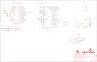

Contents
========

* [PRS17720 > MicroMod Processor-RP2040](#prs17720--micromod-processor-rp2040)
	* [Schematic](#schematic)
	* [PCB](#pcb)
	* [Interactive BOM](#interactive-bom)
	* [OOMP Parts](#oomp-parts)
	* [Images](#images)
	* [Tags](#tags)
  
![][im]
# PRS17720 > MicroMod Processor-RP2040

- ID: PROJ-SPAR-17720-STAN-01
- Hex ID: PRS17720
- Name: Sparkfun
- Description: Sparkfun
- Long Link: [http://oom.lt/PROJ-SPAR-17720-STAN-01](http://oom.lt/PROJ-SPAR-17720-STAN-01)
- Short Link: [http://oom.lt/PRS17720](http://oom.lt/PRS17720)

## Schematic
  

## PCB
  

## Interactive BOM

- Interactive BOM page: [ibom.html](https://htmlpreview.github.io/?https://github.com/oomlout/oomlout_OOMP_projects/blob/main/PROJ-SPAR-17720-STAN-01/kicad/bom/ibom.html)

## OOMP Parts
  

|OOMP ID|Name|Identifier|
| :---: | :---: | :---: |
|CAPC-0402-X-UF22D-01||C1, C3, C4, C15|
|[CAPC-0402-X-NF100-V10](https://github.com/oomlout/oomlout_OOMP_parts/tree/main/CAPC-0402-X-NF100-V10/)|[SMD (0402) 100 nF Capacitor (Ceramic) 10v](https://github.com/oomlout/oomlout_OOMP_parts/tree/main/CAPC-0402-X-NF100-V10/)|[C2, C5, C6, C7, C8, C9, C10, C12, C14, C29](https://github.com/oomlout/oomlout_OOMP_parts/tree/main/CAPC-0402-X-NF100-V10/)|
|[CAPC-0402-X-PF15-V50](https://github.com/oomlout/oomlout_OOMP_parts/tree/main/CAPC-0402-X-PF15-V50/)|[SMD (0402) 15 pF Capacitor (Ceramic) 50v](https://github.com/oomlout/oomlout_OOMP_parts/tree/main/CAPC-0402-X-PF15-V50/)|[C11, C13](https://github.com/oomlout/oomlout_OOMP_parts/tree/main/CAPC-0402-X-PF15-V50/)|
|[LEDS-0603-L-STAN-01](https://github.com/oomlout/oomlout_OOMP_parts/tree/main/LEDS-0603-L-STAN-01/)|[SMD (0603) Blue LED](https://github.com/oomlout/oomlout_OOMP_parts/tree/main/LEDS-0603-L-STAN-01/)|[D2](https://github.com/oomlout/oomlout_OOMP_parts/tree/main/LEDS-0603-L-STAN-01/)|
|UNMATCHED-UNMATCHED-X-UNMATCHED-01||J1, LOGO4, U1, U2, U3, Y1|
|[RESE-0402-X-O102-01](https://github.com/oomlout/oomlout_OOMP_parts/tree/main/RESE-0402-X-O102-01/)|[SMD (0402) 1k Ohm Resistor](https://github.com/oomlout/oomlout_OOMP_parts/tree/main/RESE-0402-X-O102-01/)|[R1, R8, R9, R18](https://github.com/oomlout/oomlout_OOMP_parts/tree/main/RESE-0402-X-O102-01/)|
|RESE-0402-X-UNMATCHED-01||R2|
|[RESE-0402-X-O103-01](https://github.com/oomlout/oomlout_OOMP_parts/tree/main/RESE-0402-X-O103-01/)|[SMD (0402) 10k Ohm Resistor](https://github.com/oomlout/oomlout_OOMP_parts/tree/main/RESE-0402-X-O103-01/)|[R4, R5](https://github.com/oomlout/oomlout_OOMP_parts/tree/main/RESE-0402-X-O103-01/)|
|RESE-0402-X-O270-01||R10, R11|

## Images
  
  

|bominteractivefront|bominteractiveback|kicadPcb3d|kicadPcb3dFront|kicadPcb3dBack|eagleImage|eagleSchemImage|pcbdraw|pcbdrawback|
| :---: | :---: | :---: | :---: | :---: | :---: | :---: | :---: | :---: |
||||||||||

## Tags

- hexID: PRS17720
- oompType: PROJ
- oompSize: SPAR
- oompColor: 17720
- oompDesc: STAN
- oompIndex: 01
- oompName: MicroMod Processor-RP2040
- sources: All source files from https://github.com/sparkfun/MicroMod_Processor-RP2040 (source licence details in srcLicense.md)
- linkBuyPage: https://www.sparkfun.com/products/17720
- oompID: PROJ-SPAR-17720-STAN-01
- oompParts: C1,CAPC-0402-X-UF22D-01
- oompParts: C2,CAPC-0402-X-NF100-V10
- oompParts: C3,CAPC-0402-X-UF22D-01
- oompParts: C4,CAPC-0402-X-UF22D-01
- oompParts: C5,CAPC-0402-X-NF100-V10
- oompParts: C6,CAPC-0402-X-NF100-V10
- oompParts: C7,CAPC-0402-X-NF100-V10
- oompParts: C8,CAPC-0402-X-NF100-V10
- oompParts: C9,CAPC-0402-X-NF100-V10
- oompParts: C10,CAPC-0402-X-NF100-V10
- oompParts: C11,CAPC-0402-X-PF15-V50
- oompParts: C12,CAPC-0402-X-NF100-V10
- oompParts: C13,CAPC-0402-X-PF15-V50
- oompParts: C14,CAPC-0402-X-NF100-V10
- oompParts: C15,CAPC-0402-X-UF22D-01
- oompParts: C29,CAPC-0402-X-NF100-V10
- oompParts: D2,LEDS-0603-L-STAN-01
- oompParts: J1,UNMATCHED-UNMATCHED-X-UNMATCHED-01
- oompParts: LOGO4,UNMATCHED-UNMATCHED-X-UNMATCHED-01
- oompParts: R1,RESE-0402-X-O102-01
- oompParts: R2,RESE-0402-X-UNMATCHED-01
- oompParts: R4,RESE-0402-X-O103-01
- oompParts: R5,RESE-0402-X-O103-01
- oompParts: R8,RESE-0402-X-O102-01
- oompParts: R9,RESE-0402-X-O102-01
- oompParts: R10,RESE-0402-X-O270-01
- oompParts: R11,RESE-0402-X-O270-01
- oompParts: R18,RESE-0402-X-O102-01
- oompParts: U1,UNMATCHED-UNMATCHED-X-UNMATCHED-01
- oompParts: U2,UNMATCHED-UNMATCHED-X-UNMATCHED-01
- oompParts: U3,UNMATCHED-UNMATCHED-X-UNMATCHED-01
- oompParts: Y1,UNMATCHED-UNMATCHED-X-UNMATCHED-01
- rawParts: C1,2.2uF,2.2UF-0402_TIGHT-10V-10%-X5R,0402-TIGHT,2.2µF ceramic capacitors,,CAP-14232,,2.2uF,
- rawParts: C2,0.1uF,0.1UF-0402T-6.3V-10%-X7R,0402-TIGHT,0.1µF ceramic capacitors,,CAP-14993,,0.1uF,
- rawParts: C3,2.2uF,2.2UF-0402_TIGHT-10V-10%-X5R,0402-TIGHT,2.2µF ceramic capacitors,,CAP-14232,,2.2uF,
- rawParts: C4,2.2uF,2.2UF-0402_TIGHT-10V-10%-X5R,0402-TIGHT,2.2µF ceramic capacitors,,CAP-14232,,2.2uF,
- rawParts: C5,0.1uF,0.1UF-0402T-6.3V-10%-X7R,0402-TIGHT,0.1µF ceramic capacitors,,CAP-14993,,0.1uF,
- rawParts: C6,0.1uF,0.1UF-0402T-6.3V-10%-X7R,0402-TIGHT,0.1µF ceramic capacitors,,CAP-14993,,0.1uF,
- rawParts: C7,0.1uF,0.1UF-0402T-6.3V-10%-X7R,0402-TIGHT,0.1µF ceramic capacitors,,CAP-14993,,0.1uF,
- rawParts: C8,0.1uF,0.1UF-0402T-6.3V-10%-X7R,0402-TIGHT,0.1µF ceramic capacitors,,CAP-14993,,0.1uF,
- rawParts: C9,0.1uF,0.1UF-0402T-6.3V-10%-X7R,0402-TIGHT,0.1µF ceramic capacitors,,CAP-14993,,0.1uF,
- rawParts: C10,0.1uF,0.1UF-0402T-6.3V-10%-X7R,0402-TIGHT,0.1µF ceramic capacitors,,CAP-14993,,0.1uF,
- rawParts: C11,15pF,15PF-0402T-50V-5%,0402-TIGHT,15pF ceramic capacitors,,CAP-13063,,15pF,
- rawParts: C12,0.1uF,0.1UF-0402T-6.3V-10%-X7R,0402-TIGHT,0.1µF ceramic capacitors,,CAP-14993,,0.1uF,
- rawParts: C13,15pF,15PF-0402T-50V-5%,0402-TIGHT,15pF ceramic capacitors,,CAP-13063,,15pF,
- rawParts: C14,0.1uF,0.1UF-0402T-6.3V-10%-X7R,0402-TIGHT,0.1µF ceramic capacitors,,CAP-14993,,0.1uF,
- rawParts: C15,2.2uF,2.2UF-0402_TIGHT-10V-10%-X5R,0402-TIGHT,2.2µF ceramic capacitors,,CAP-14232,,2.2uF,
- rawParts: C29,0.1uF,0.1UF-0402T-6.3V-10%-X7R,0402-TIGHT,0.1µF ceramic capacitors,,CAP-14993,,0.1uF,
- rawParts: D2,BLUE,LED-BLUE0603,LED-0603,Blue SMD LED,,DIO-08575,,BLUE,
- rawParts: FD1,FIDUCIALUFIDUCIAL,FIDUCIALUFIDUCIAL,FIDUCIAL-MICRO,Fiducial Alignment Points,,,,,
- rawParts: FD2,FIDUCIALUFIDUCIAL,FIDUCIALUFIDUCIAL,FIDUCIAL-MICRO,Fiducial Alignment Points,,,,,
- rawParts: FD3,FIDUCIALUFIDUCIAL,FIDUCIALUFIDUCIAL,FIDUCIAL-MICRO,Fiducial Alignment Points,,,,,
- rawParts: FD4,FIDUCIALUFIDUCIAL,FIDUCIALUFIDUCIAL,FIDUCIAL-MICRO,Fiducial Alignment Points,,,,,
- rawParts: FRAME1,FRAME-LEDGER,FRAME-LEDGER,CREATIVE_COMMONS,Schematic Frame - Ledger,,,,,
- rawParts: J1,MICROMOD-2222,MICROMOD-2222,M.2-CARD-E-22,MicroMod Connector,,,,,
- rawParts: LOGO1,SFE_LOGO_NAME_FLAME.1_INCH,SFE_LOGO_NAME_FLAME.1_INCH,SFE_LOGO_NAME_FLAME_.1,SparkFun Font Logo w/ Flame,,,,,
- rawParts: LOGO2,SFE_LOGO_FLAME.1_INCH,SFE_LOGO_FLAME.1_INCH,SFE_LOGO_FLAME_.1,SparkFun Flame Logo,,,,,
- rawParts: LOGO3,OSHW-LOGOMINI,OSHW-LOGOMINI,OSHW-LOGO-MINI,Open-Source Hardware (OSHW) Logo,,,,,
- rawParts: LOGO4,SPECIAL_INSTRUCTIONS-ORDERING,SPECIAL_INSTRUCTIONS-ORDERING,ORDERING_INSTRUCTIONS,Special Ordering/Production Instructions Alert,,,,,
- rawParts: R1,1k,1KOHM-0402T-1/16W-1%,0402-TIGHT,1kΩ resistor,,RES-14342,,1k,
- rawParts: R2,200OHM-0402T-1/16W-1%,200OHM-0402T-1/16W-1%,0402-TIGHT,200Ω resistor,,RES-15550,,,
- rawParts: R4,10k,10KOHM-0402T-1/16W-1%,0402-TIGHT,10kΩ resistor,,RES-14241,,10k,
- rawParts: R5,10k,10KOHM-0402T-1/16W-1%,0402-TIGHT,10kΩ resistor,,RES-14241,,10k,
- rawParts: R8,1k,1KOHM-0402T-1/16W-1%,0402-TIGHT,1kΩ resistor,,RES-14342,,1k,
- rawParts: R9,1k,1KOHM-0402T-1/16W-1%,0402-TIGHT,1kΩ resistor,,RES-14342,,1k,
- rawParts: R10,27,27OHM,0402-TIGHT,27Ω resistor,,RES-15238,,,
- rawParts: R11,27,27OHM,0402-TIGHT,27Ω resistor,,RES-15238,,,
- rawParts: R18,1k,1KOHM-0402T-1/16W-1%,0402-TIGHT,1kΩ resistor,,RES-14342,,1k,
- rawParts: U1,W25QXX128MBIT,W25QXX128MBIT-6X5-SKINNY_CENTER,WSON-8-6X5-SKINNY_CENTERPAD,,,IC-15107,,,
- rawParts: U2,FSUSB30MUX_MSOP10,FSUSB30MUX_MSOP10,MSOP10,,,IC-15569,,,
- rawParts: U3,RP2040,RP2040,QFN-56,Raspberry Pi RP2040 MCU,,IC-15502,,,
- rawParts: Y1,12MHz,CRYSTAL-12MHZ,CRYSTAL-SMD-2X2.5MM,12.0MHz Crystal,,XTAL-15540,,,

[im]: kicadPcb3d_450.png
