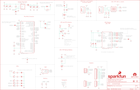

Contents
========

* [PRS17722 > MicroMod GNSS F9P Carrier Board](#prs17722--micromod-gnss-f9p-carrier-board)
	* [Schematic](#schematic)
	* [PCB](#pcb)
	* [Interactive BOM](#interactive-bom)
	* [OOMP Parts](#oomp-parts)
	* [Images](#images)
	* [Tags](#tags)
  
![][im]
# PRS17722 > MicroMod GNSS F9P Carrier Board

- ID: PROJ-SPAR-17722-STAN-01
- Hex ID: PRS17722
- Name: Sparkfun
- Description: Sparkfun
- Long Link: [http://oom.lt/PROJ-SPAR-17722-STAN-01](http://oom.lt/PROJ-SPAR-17722-STAN-01)
- Short Link: [http://oom.lt/PRS17722](http://oom.lt/PRS17722)

## Schematic
  

## PCB
  

## Interactive BOM

- Interactive BOM page: [ibom.html](https://htmlpreview.github.io/?https://github.com/oomlout/oomlout_OOMP_projects/blob/main/PROJ-SPAR-17722-STAN-01/kicad/bom/ibom.html)

## OOMP Parts
  

|OOMP ID|Name|Identifier|
| :---: | :---: | :---: |
|UNMATCHED-UNMATCHED-X-UNMATCHED-01||BT1, BT2, E1, F2, J1, J3, J4, J5, J6, J8, MEAS, S1, S2, U1, U5|
|[CAPC-0603-X-NF100-V50](https://github.com/oomlout/oomlout_OOMP_parts/tree/main/CAPC-0603-X-NF100-V50/)|[SMD (0603) 100 nF Capacitor (Ceramic) 50v](https://github.com/oomlout/oomlout_OOMP_parts/tree/main/CAPC-0603-X-NF100-V50/)|[C1, C3, C4, C6](https://github.com/oomlout/oomlout_OOMP_parts/tree/main/CAPC-0603-X-NF100-V50/)|
|CAPT-3216-X-UF10-01||C2|
|CAPC-0603-X-UNMATCHED-01||C5|
|[CAPC-0603-X-NF220-V25](https://github.com/oomlout/oomlout_OOMP_parts/tree/main/CAPC-0603-X-NF220-V25/)|[SMD (0603) 220 nF Capacitor (Ceramic) 25v](https://github.com/oomlout/oomlout_OOMP_parts/tree/main/CAPC-0603-X-NF220-V25/)|[C7, C13](https://github.com/oomlout/oomlout_OOMP_parts/tree/main/CAPC-0603-X-NF220-V25/)|
|CAPC-0603-X-PF47-01||C8|
|DIOD-S323-X-UNMATCHED-01||D1, D5, D6, D7, D11, D12|
|[LEDS-0603-R-STAN-01](https://github.com/oomlout/oomlout_OOMP_parts/tree/main/LEDS-0603-R-STAN-01/)|[SMD (0603) Red LED](https://github.com/oomlout/oomlout_OOMP_parts/tree/main/LEDS-0603-R-STAN-01/)|[D2, D3](https://github.com/oomlout/oomlout_OOMP_parts/tree/main/LEDS-0603-R-STAN-01/)|
|DIOD-UNMATCHED-X-UNMATCHED-01||D4|
|[LEDS-0603-L-STAN-01](https://github.com/oomlout/oomlout_OOMP_parts/tree/main/LEDS-0603-L-STAN-01/)|[SMD (0603) Blue LED](https://github.com/oomlout/oomlout_OOMP_parts/tree/main/LEDS-0603-L-STAN-01/)|[D8, D9, D10](https://github.com/oomlout/oomlout_OOMP_parts/tree/main/LEDS-0603-L-STAN-01/)|
|DIOD-0402-X-UNMATCHED-01||D13|
|FERB-0402-X-UNMATCHED-01||FB1|
|[HEAD-I01-X-PI06-01](https://github.com/oomlout/oomlout_OOMP_parts/tree/main/HEAD-I01-X-PI06-01/)|[2.54 mm 6 Pin Header](https://github.com/oomlout/oomlout_OOMP_parts/tree/main/HEAD-I01-X-PI06-01/)|[J7, J9](https://github.com/oomlout/oomlout_OOMP_parts/tree/main/HEAD-I01-X-PI06-01/)|
|[HEAD-I01-X-PI12-01](https://github.com/oomlout/oomlout_OOMP_parts/tree/main/HEAD-I01-X-PI12-01/)|[2.54 mm 12 Pin Header](https://github.com/oomlout/oomlout_OOMP_parts/tree/main/HEAD-I01-X-PI12-01/)|[J10](https://github.com/oomlout/oomlout_OOMP_parts/tree/main/HEAD-I01-X-PI12-01/)|
|[RESE-0603-X-O102-01](https://github.com/oomlout/oomlout_OOMP_parts/tree/main/RESE-0603-X-O102-01/)|[SMD (0603) 1k Ohm Resistor](https://github.com/oomlout/oomlout_OOMP_parts/tree/main/RESE-0603-X-O102-01/)|[R1, R4, R8, R19, R20, R21](https://github.com/oomlout/oomlout_OOMP_parts/tree/main/RESE-0603-X-O102-01/)|
|[RESE-0603-X-O472-01](https://github.com/oomlout/oomlout_OOMP_parts/tree/main/RESE-0603-X-O472-01/)|[SMD (0603) 4.7k Ohm Resistor](https://github.com/oomlout/oomlout_OOMP_parts/tree/main/RESE-0603-X-O472-01/)|[R2, R3, R6, R7](https://github.com/oomlout/oomlout_OOMP_parts/tree/main/RESE-0603-X-O472-01/)|
|RESE-0603-X-O1003-01||R5, R22|
|[RESE-0603-X-O103-01](https://github.com/oomlout/oomlout_OOMP_parts/tree/main/RESE-0603-X-O103-01/)|[SMD (0603) 10k Ohm Resistor](https://github.com/oomlout/oomlout_OOMP_parts/tree/main/RESE-0603-X-O103-01/)|[R9](https://github.com/oomlout/oomlout_OOMP_parts/tree/main/RESE-0603-X-O103-01/)|
|[RESE-0603-X-O203-01](https://github.com/oomlout/oomlout_OOMP_parts/tree/main/RESE-0603-X-O203-01/)|[SMD (0603) 20k Ohm Resistor](https://github.com/oomlout/oomlout_OOMP_parts/tree/main/RESE-0603-X-O203-01/)|[R10](https://github.com/oomlout/oomlout_OOMP_parts/tree/main/RESE-0603-X-O203-01/)|
|RESE-1206-X-O330-01||R11, R12, R13|
|RESE-0402-X-UNMATCHED-01||R15, R16|
|[RESE-0603-X-O330-01](https://github.com/oomlout/oomlout_OOMP_parts/tree/main/RESE-0603-X-O330-01/)|[SMD (0603) 33 Ohm Resistor](https://github.com/oomlout/oomlout_OOMP_parts/tree/main/RESE-0603-X-O330-01/)|[R17](https://github.com/oomlout/oomlout_OOMP_parts/tree/main/RESE-0603-X-O330-01/)|
|RESE-0603-X-UNMATCHED-01||R24|

## Images
  
  

|bominteractivefront|bominteractiveback|kicadPcb3d|kicadPcb3dFront|kicadPcb3dBack|eagleImage|eagleSchemImage|pcbdraw|pcbdrawback|
| :---: | :---: | :---: | :---: | :---: | :---: | :---: | :---: | :---: |
||||||||||

## Tags

- hexID: PRS17722
- oompType: PROJ
- oompSize: SPAR
- oompColor: 17722
- oompDesc: STAN
- oompIndex: 01
- oompName: MicroMod GNSS F9P Carrier Board
- sources: All source files from https://github.com/sparkfun/MicroMod_GNSS_F9P_Carrier_Board (source licence details in srcLicense.md)
- linkBuyPage: https://www.sparkfun.com/products/17722
- oompID: PROJ-SPAR-17722-STAN-01
- oompParts: BT1,UNMATCHED-UNMATCHED-X-UNMATCHED-01
- oompParts: BT2,UNMATCHED-UNMATCHED-X-UNMATCHED-01
- oompParts: C1,CAPC-0603-X-NF100-V50
- oompParts: C2,CAPT-3216-X-UF10-01
- oompParts: C3,CAPC-0603-X-NF100-V50
- oompParts: C4,CAPC-0603-X-NF100-V50
- oompParts: C5,CAPC-0603-X-UNMATCHED-01
- oompParts: C6,CAPC-0603-X-NF100-V50
- oompParts: C7,CAPC-0603-X-NF220-V25
- oompParts: C8,CAPC-0603-X-PF47-01
- oompParts: C13,CAPC-0603-X-NF220-V25
- oompParts: D1,DIOD-S323-X-UNMATCHED-01
- oompParts: D2,LEDS-0603-R-STAN-01
- oompParts: D3,LEDS-0603-R-STAN-01
- oompParts: D4,DIOD-UNMATCHED-X-UNMATCHED-01
- oompParts: D5,DIOD-S323-X-UNMATCHED-01
- oompParts: D6,DIOD-S323-X-UNMATCHED-01
- oompParts: D7,DIOD-S323-X-UNMATCHED-01
- oompParts: D8,LEDS-0603-L-STAN-01
- oompParts: D9,LEDS-0603-L-STAN-01
- oompParts: D10,LEDS-0603-L-STAN-01
- oompParts: D11,DIOD-S323-X-UNMATCHED-01
- oompParts: D12,DIOD-S323-X-UNMATCHED-01
- oompParts: D13,DIOD-0402-X-UNMATCHED-01
- oompParts: E1,UNMATCHED-UNMATCHED-X-UNMATCHED-01
- oompParts: F2,UNMATCHED-UNMATCHED-X-UNMATCHED-01
- oompParts: FB1,FERB-0402-X-UNMATCHED-01
- oompParts: J1,UNMATCHED-UNMATCHED-X-UNMATCHED-01
- oompParts: J3,UNMATCHED-UNMATCHED-X-UNMATCHED-01
- oompParts: J4,UNMATCHED-UNMATCHED-X-UNMATCHED-01
- oompParts: J5,UNMATCHED-UNMATCHED-X-UNMATCHED-01
- oompParts: J6,UNMATCHED-UNMATCHED-X-UNMATCHED-01
- oompParts: J7,HEAD-I01-X-PI06-01
- oompParts: J8,UNMATCHED-UNMATCHED-X-UNMATCHED-01
- oompParts: J9,HEAD-I01-X-PI06-01
- oompParts: J10,HEAD-I01-X-PI12-01
- oompParts: MEAS,UNMATCHED-UNMATCHED-X-UNMATCHED-01
- oompParts: R1,RESE-0603-X-O102-01
- oompParts: R2,RESE-0603-X-O472-01
- oompParts: R3,RESE-0603-X-O472-01
- oompParts: R4,RESE-0603-X-O102-01
- oompParts: R5,RESE-0603-X-O1003-01
- oompParts: R6,RESE-0603-X-O472-01
- oompParts: R7,RESE-0603-X-O472-01
- oompParts: R8,RESE-0603-X-O102-01
- oompParts: R9,RESE-0603-X-O103-01
- oompParts: R10,RESE-0603-X-O203-01
- oompParts: R11,RESE-1206-X-O330-01
- oompParts: R12,RESE-1206-X-O330-01
- oompParts: R13,RESE-1206-X-O330-01
- oompParts: R15,RESE-0402-X-UNMATCHED-01
- oompParts: R16,RESE-0402-X-UNMATCHED-01
- oompParts: R17,RESE-0603-X-O330-01
- oompParts: R19,RESE-0603-X-O102-01
- oompParts: R20,RESE-0603-X-O102-01
- oompParts: R21,RESE-0603-X-O102-01
- oompParts: R22,RESE-0603-X-O1003-01
- oompParts: R24,RESE-0603-X-UNMATCHED-01
- oompParts: S1,UNMATCHED-UNMATCHED-X-UNMATCHED-01
- oompParts: S2,UNMATCHED-UNMATCHED-X-UNMATCHED-01
- oompParts: U1,UNMATCHED-UNMATCHED-X-UNMATCHED-01
- oompParts: U5,UNMATCHED-UNMATCHED-X-UNMATCHED-01
- rawParts: 3V3,JUMPER-SMT_2_NC_TRACE_SILK,JUMPER-SMT_2_NC_TRACE_SILK,SMT-JUMPER_2_NC_TRACE_SILK,Normally closed trace jumper,,,,,,,
- rawParts: BT1,ML414H,ML414H_IV01E_BATTERY,ML414H_IV01E,SEIKO ML414H-IV01E Reflowable Lithium Battery,,,,BATT-14267,,,
- rawParts: BT2,ML414H_IV01E_BATTERY,ML414H_IV01E_BATTERY,ML414H_IV01E,SEIKO ML414H-IV01E Reflowable Lithium Battery,,,,BATT-14267,,,
- rawParts: BYP,JUMPER-SMT_2_NO_SILK,JUMPER-SMT_2_NO_SILK,SMT-JUMPER_2_NO_SILK,Normally open jumper,,,,,,,
- rawParts: C1,0.1uF,0.1UF-0603-25V-(+80/-20%),0603,0.1µF ceramic capacitors,,,,CAP-00810,,0.1uF,
- rawParts: C2,10uF,10UF-POLAR-EIA3216-16V-10%(TANT),EIA3216,10.0µF polarized capacitors,,,,CAP-00811,,10uF,
- rawParts: C3,0.1uF,0.1UF-0603-25V-5%,0603,0.1µF ceramic capacitors,,,,CAP-08604,,0.1uF,
- rawParts: C4,0.1uF,0.1UF-0603-25V-5%,0603,0.1µF ceramic capacitors,,,,CAP-08604,,0.1uF,
- rawParts: C5,1.0uF,1.0UF-0603-16V-10%,0603,1µF ceramic capacitors,,,,CAP-00868,,1.0uF,
- rawParts: C6,0.1uF,0.1UF-0603-25V-(+80/-20%),0603,0.1µF ceramic capacitors,,,,CAP-00810,,0.1uF,
- rawParts: C7,0.22uF,0.22UF-0603-25V-10%,0603,0.22µF ceramic capacitors,,,,CAP-07822,,0.22uF,
- rawParts: C8,47pF,47PF-0603-50V-5%,0603,47pF ceramic capacitors,,,,CAP-08913,,47pF,
- rawParts: C13,0.22uF,0.22UF-0603-25V-10%,0603,0.22µF ceramic capacitors,,,,CAP-07822,,0.22uF,
- rawParts: D1,3.3V,DIODE-ZENER-MM3Z3V3T1G,SOD-323,Zener Diode,,,,DIO-11284,,3.3V,
- rawParts: D2,RED,LED-RED0603,LED-0603,Red SMD LED,,,,DIO-00819,,RED,
- rawParts: D3,RED,LED-RED0603,LED-0603,Red SMD LED,,,,DIO-00819,,RED,
- rawParts: D4,PRTR5V0U2F,PRTR5V0U2F,SOT886,A small ESD protection device. Most commonly used on USB D+/D- signals to protect large, expensive, or especially sensitive USB enabled devices.,,,,DIO-14084,,,
- rawParts: D5,3A/10V/280mV,DIODE-SCHOTTKY-BAT60A,SOD-323,Schottky diode,,,,DIO-14072,,3A/10V/280mV,
- rawParts: D6,3A/10V/280mV,DIODE-SCHOTTKY-BAT60A,SOD-323,Schottky diode,,,,DIO-14072,,3A/10V/280mV,
- rawParts: D7,1A/23V/620mV,DIODE-SCHOTTKY-BAT20J,SOD-323,Schottky diode,,,,DIO-11623,,1A/23V/620mV,
- rawParts: D8,BLUE,LED-BLUE0603,LED-0603,Blue SMD LED,,,,DIO-08575,,BLUE,
- rawParts: D9,BLUE,LED-BLUE0603,LED-0603,Blue SMD LED,,,,DIO-08575,,BLUE,
- rawParts: D10,BLUE,LED-BLUE0603,LED-0603,Blue SMD LED,,,,DIO-08575,,BLUE,
- rawParts: D11,0.5A/40V/420mV,DIODE-SCHOTTKY-PMEG4005EJ,SOD-323,Schottky diode,,,,DIO-10955,,0.5A/40V/420mV,
- rawParts: D12,3A/10V/280mV,DIODE-SCHOTTKY-BAT60A,SOD-323,Schottky diode,,,,DIO-14072,,3A/10V/280mV,
- rawParts: D13,PESD0402,PESD0402,0402,ESD protection diode,,PESD0402-140CT-ND,650-PESD0402-140,DIO-15359,,,
- rawParts: E1,ANTENNA-SMA-GROUNDEDEDGE_SMA,ANTENNA-SMA-GROUNDEDEDGE_SMA,SMA-EDGE,SMA Antenna Connector w/ Ground,,,,CONN-08289,,,
- rawParts: EN,JUMPER-SMT_2_NO_SILK,JUMPER-SMT_2_NO_SILK,SMT-JUMPER_2_NO_SILK,Normally open jumper,,,,,,,
- rawParts: F2,6V/2A,PPTC_6V2A,1210,Resettable Fuse PPTC,,,,RES-14313,,6V/2A,
- rawParts: FB1,FERRITE_BEAD-120_OHM-0402T,FERRITE_BEAD-120_OHM-0402T,0402-TIGHT,Ferrite Bead (blocks, cores, rings, chokes, etc.),,,,NDUC-14206,,,
- rawParts: FD1,FIDUCIALUFIDUCIAL,FIDUCIALUFIDUCIAL,FIDUCIAL-MICRO,Fiducial Alignment Points,,,,,,,
- rawParts: FD2,FIDUCIALUFIDUCIAL,FIDUCIALUFIDUCIAL,FIDUCIAL-MICRO,Fiducial Alignment Points,,,,,,,
- rawParts: FD3,FIDUCIALUFIDUCIAL,FIDUCIALUFIDUCIAL,FIDUCIAL-MICRO,Fiducial Alignment Points,,,,,,,
- rawParts: FD4,FIDUCIALUFIDUCIAL,FIDUCIALUFIDUCIAL,FIDUCIAL-MICRO,Fiducial Alignment Points,,,,,,,
- rawParts: FRAME1,FRAME-LEDGER,FRAME-LEDGER,CREATIVE_COMMONS,Schematic Frame - Ledger,,,,,,,
- rawParts: GEOF,JUMPER-SMT_2_NC_TRACE_SILK,JUMPER-SMT_2_NC_TRACE_SILK,SMT-JUMPER_2_NC_TRACE_SILK,Normally closed trace jumper,,,,,,,
- rawParts: H1,STAND-OFFTIGHT,STAND-OFFTIGHT,STAND-OFF-TIGHT,Stand Off,,,,,,,
- rawParts: H2,STAND-OFFTIGHT,STAND-OFFTIGHT,STAND-OFF-TIGHT,Stand Off,,,,,,,
- rawParts: H3,STAND-OFFTIGHT,STAND-OFFTIGHT,STAND-OFF-TIGHT,Stand Off,,,,,,,
- rawParts: H4,STAND-OFFTIGHT,STAND-OFFTIGHT,STAND-OFF-TIGHT,Stand Off,,,,,,,
- rawParts: H5,STAND-OFF-REFLOW-M2.5_2.5MM_TALL,STAND-OFF-REFLOW-M2.5_2.5MM_TALL,STAND-OFF-REFLOW-M2.5,Stand Off Reflow Compatible,,,,HW-14899,,,
- rawParts: J1,,USB_C_2-LAYER_PADS,USB-C-16P-2LAYER-PADS,USB Type C 16Pin Connector,,,,CONN-14122,,,
- rawParts: J3,,USB_C_2-LAYER_PADS,USB-C-16P-2LAYER-PADS,USB Type C 16Pin Connector,,,,CONN-14122,,,
- rawParts: J4,U.FL,ANTENNA-SMA-GROUNDEDEDGE_SMA,SMA-EDGE,SMA Antenna Connector w/ Ground,,,,CONN-08289,,,
- rawParts: J5,QWIIC_RIGHT_ANGLE,QWIIC_CONNECTORJS-1MM,JST04_1MM_RA,SparkFun I2C Standard Qwiic Connector,,,,CONN-13694,,QWIIC_RIGHT_ANGLE,
- rawParts: J6,MICROMOD-2222-C,MICROMOD-2222-C,M.2-CONNECTOR-E,MicroMod Connector,,,,CONN-14877,,,
- rawParts: J7,,CONN_06NO_SILK_NO_POP,1X06_NO_SILK,Multi connection point. Often used as Generic Header-pin footprint for 0.1 inch spaced/style header connections,,,,,,,
- rawParts: J8,JTAG,CORTEX_JTAG_DEBUG_MINIMUM_PTH,2X5-PTH-1.27MM,Cortex Debug Connector - 10 pin,,,,,,,
- rawParts: J9,,CONN_06NO_SILK_NO_POP,1X06_NO_SILK,Multi connection point. Often used as Generic Header-pin footprint for 0.1 inch spaced/style header connections,,,,,,,
- rawParts: J10,,CONN_12NO_SILK,1X12_NO_SILK,Multi connection point. Often used as Generic Header-pin footprint for 0.1 inch spaced/style header connections,,,,,,,
- rawParts: LOGO1,SFE_LOGO_NAME_FLAME.3_INCH,SFE_LOGO_NAME_FLAME.3_INCH,SFE_LOGO_NAME_FLAME_.3,SparkFun Font Logo w/ Flame,,,,,,,
- rawParts: LOGO3,OSHW-LOGOMINI,OSHW-LOGOMINI,OSHW-LOGO-MINI,Open-Source Hardware (OSHW) Logo,,,,,,,
- rawParts: MEAS,JUMPER-COMBO_2_NC_TRACE,JUMPER-COMBO_2_NC_TRACE,COMBO-JUMPER_2_NC_TRACE,,,,,,,,
- rawParts: PPS,JUMPER-SMT_2_NC_TRACE_SILK,JUMPER-SMT_2_NC_TRACE_SILK,SMT-JUMPER_2_NC_TRACE_SILK,Normally closed trace jumper,,,,,,,
- rawParts: R1,1k,1KOHM-0603-1/10W-1%,0603,1kΩ resistor,,,,RES-07856,,1k,
- rawParts: R2,5.1k,5.1KOHM5.1KOHM-0603-1/10W-1%,0603,,,,,RES-12083,,5.1k,
- rawParts: R3,5.1k,5.1KOHM5.1KOHM-0603-1/10W-1%,0603,,,,,RES-12083,,5.1k,
- rawParts: R4,1k,1KOHM-0603-1/10W-1%,0603,1kΩ resistor,,,,RES-07856,,1k,
- rawParts: R5,100k,100KOHM-0603-1/10W-1%,0603,100kΩ resistor,,,,RES-07828,,100k,
- rawParts: R6,5.1k,5.1KOHM5.1KOHM-0603-1/10W-1%,0603,,,,,RES-12083,,5.1k,
- rawParts: R7,5.1k,5.1KOHM5.1KOHM-0603-1/10W-1%,0603,,,,,RES-12083,,5.1k,
- rawParts: R8,1k,1KOHM-0603-1/10W-1%,0603,1kΩ resistor,,,,RES-07856,,1k,
- rawParts: R9,10k,10KOHM-0603-1/10W-1%,0603,10kΩ resistor,,,,RES-00824,,10k,
- rawParts: R10,20k,20KOHM-0603-1/10W-1%,0603,20kΩ resistor,,,,RES-09383,,20k,
- rawParts: R11,33,33OHM_RA-1206-1/16W-5%,1206_RA,EXB-38V330JV,,,,RES-15081,,33,
- rawParts: R12,33,33OHM_RA-1206-1/16W-5%,1206_RA,EXB-38V330JV,,,,RES-15081,,33,
- rawParts: R13,33,33OHM_RA-1206-1/16W-5%,1206_RA,EXB-38V330JV,,,,RES-15081,,33,
- rawParts: R15,27OHM,27OHM,0402-TIGHT,27Ω resistor,,,,RES-15238,,,
- rawParts: R16,27OHM,27OHM,0402-TIGHT,27Ω resistor,,,,RES-15238,,,
- rawParts: R17,33,33OHM-0603-1/10W-1%,0603,33Ω resistor,,,,RES-08270,,33,
- rawParts: R19,1k,1KOHM-0603-1/10W-1%,0603,1kΩ resistor,,,,RES-07856,,1k,
- rawParts: R20,1k,1KOHM-0603-1/10W-1%,0603,1kΩ resistor,,,,RES-07856,,1k,
- rawParts: R21,1k,1KOHM-0603-1/10W-1%,0603,1kΩ resistor,,,,RES-07856,,1k,
- rawParts: R22,100k,100KOHM-0603-1/10W-1%,0603,100kΩ resistor,,,,RES-07828,,100k,
- rawParts: R24,3.3k,3.3KOHM-0603-1/10W-1%,0603,3.3kΩ resistor,,,,RES-07851,,3.3k,
- rawParts: RTK,JUMPER-SMT_2_NC_TRACE_SILK,JUMPER-SMT_2_NC_TRACE_SILK,SMT-JUMPER_2_NC_TRACE_SILK,Normally closed trace jumper,,,,,,,
- rawParts: S1,Reset,MOMENTARY-SWITCH-SPST-SMD-5.2-TALL-REDUNDANT,TACTILE_SWITCH_SMD_5.2MM,Momentary Switch (Pushbutton) - SPST,,,,SWCH-14139,,,
- rawParts: S2,BOOT,MOMENTARY-SWITCH-SPST-SMD-5.2-TALL-REDUNDANT,TACTILE_SWITCH_SMD_5.2MM,Momentary Switch (Pushbutton) - SPST,,,,SWCH-14139,,,
- rawParts: SPI,JUMPER-SMT_2_NO_SILK,JUMPER-SMT_2_NO_SILK,SMT-JUMPER_2_NO_SILK,Normally open jumper,,,,,,,
- rawParts: TP1,TEST-POINT3X5,TEST-POINT3X5,PAD.03X.05,SparkFun Test Points,,,,,,,
- rawParts: TP2,TEST-POINT3X5,TEST-POINT3X5,PAD.03X.05,SparkFun Test Points,,,,,,,
- rawParts: TP3,TEST-POINT3X5,TEST-POINT3X5,PAD.03X.05,SparkFun Test Points,,,,,,,
- rawParts: U1,U-BLOX_ZED-F9P,U-BLOX_ZED-F9P,ZED-F9P,,,,,IC-14209,,,
- rawParts: U5,AP7361C-33,AP7361C-33FGEUDFN-8,UDFN-8,AP7361C 3.3V LDO Regulator,,,,VREG-14094,,,
- rawParts: VIN,JUMPER-SMT_2_NC_TRACE_SILK,JUMPER-SMT_2_NC_TRACE_SILK,SMT-JUMPER_2_NC_TRACE_SILK,Normally closed trace jumper,,,,,,,

[im]: kicadPcb3d_450.png
