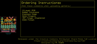
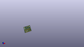

Contents
========

* [PROJ-SPAR-17725-STAN-01>MicroMod Asset Tracker Update Tool](#proj-spar-17725-stan-01micromod-asset-tracker-update-tool)
	* [Images](#images)
	* [Interactive BOM](#interactive-bom)
	* [OOMP Parts](#oomp-parts)
	* [Tags](#tags)
  
![][im]
# PROJ-SPAR-17725-STAN-01>MicroMod Asset Tracker Update Tool

- ID: PROJ-SPAR-17725-STAN-01
- Hex ID: PRS17725
- Name: MicroMod Asset Tracker Update Tool
- Description: 

## Images
  
  

|eagleImage|kicadPcb3dFront|kicadPcb3dBack|kicadPcb3d|
| :---: | :---: | :---: | :---: |
|||||

## Interactive BOM

- Interactive BOM page: [ibom.html](kicad/bom/ibom.html)

## OOMP Parts
  

|OOMP Parts|
| :---: |
|<table><tr><td></td><td> C3</td><td>[CAPC-0603-X-NF100-V50 SMD (0603) 100 nF Capacitor (Ceramic) 50v](https://github.com/oomlout/oomlout_OOMP_parts/tree/main/CAPC-0603-X-NF100-V50/)</td><td>[C6N100](https://github.com/oomlout/oomlout_OOMP_parts/tree/main/CAPC-0603-X-NF100-V50/)</td></tr></table>|
|UNMATCHED-UNMATCHED-X-UNMATCHED-01, CTS, 2.2225, 8.1975, M270,CTS, JUMPER-COMBO_2_NC_TRACE, COMBO-JUMPER_2_NC_TRACE, SparkFun-Jumpers, (2.2225, 8.1975), MR270|
|UNMATCHED-0603-X-UNMATCHED-01, D1, 20.5, 17.5, 90,D1, BLUE, LED-0603, SparkFun-LED, (20.5, 17.5), R90|
|UNMATCHED-UNMATCHED-X-UNMATCHED-01, DCD, 9.8425, 8.1975, M270,DCD, JUMPER-COMBO_2_NC_TRACE, COMBO-JUMPER_2_NC_TRACE, SparkFun-Jumpers, (9.8425, 8.1975), MR270|
|UNMATCHED-UNMATCHED-X-UNMATCHED-01, DSR, 4.7625, 8.1975, M270,DSR, JUMPER-COMBO_2_NC_TRACE, COMBO-JUMPER_2_NC_TRACE, SparkFun-Jumpers, (4.7625, 8.1975), MR270|
|UNMATCHED-UNMATCHED-X-UNMATCHED-01, DTR, 12.3825, 8.1975, M270,DTR, JUMPER-COMBO_2_NC_TRACE, COMBO-JUMPER_2_NC_TRACE, SparkFun-Jumpers, (12.3825, 8.1975), MR270|
|UNMATCHED-UNMATCHED-X-UNMATCHED-01, J1, 2.54, 20.32, 270,J1, 1X01_NO_SILK, SparkFun-Connectors, (2.54, 20.32), R270|
|UNMATCHED-UNMATCHED-X-UNMATCHED-01, J2, 2.54, 16.51, 270,J2, 1X01_NO_SILK, SparkFun-Connectors, (2.54, 16.51), R270|
|UNMATCHED-UNMATCHED-X-UNMATCHED-01, J5, 11.02, -0.01, 0,J5, MICROMOD-2222, M.2-CARD-E-22, SparkFun-MicroMod, (11.02, -0.01), R0|
|HEAD-I01-X-PI2-01, JP3, 1.905, 5.08, 0,JP3, FIDUCIAL1X2, FIDUCIAL-1X2, SparkFun-Aesthetics, (1.905, 5.08), R0|
|HEAD-I01-X-PI2-01, JP4, 20.32, 20.32, 0,JP4, FIDUCIAL1X2, FIDUCIAL-1X2, SparkFun-Aesthetics, (20.32, 20.32), R0|
|HEAD-I01-X-PI2-01, JP5, 20.32, 20.32, M0,JP5, FIDUCIAL1X2, FIDUCIAL-1X2, SparkFun-Aesthetics, (20.32, 20.32), MR0|
|HEAD-I01-X-PI2-01, JP6, 1.905, 5.08, M0,JP6, FIDUCIAL1X2, FIDUCIAL-1X2, SparkFun-Aesthetics, (1.905, 5.08), MR0|
|RESE-0603-X-UNMATCHED-01, R1, 20.5, 13.5, 270,R1, 1k, 0603, SparkFun-Resistors, (20.5, 13.5), R270|
|UNMATCHED-UNMATCHED-X-UNMATCHED-01, RI, 7.3025, 8.1975, M270,RI, JUMPER-COMBO_2_NC_TRACE, COMBO-JUMPER_2_NC_TRACE, SparkFun-Jumpers, (7.3025, 8.1975), MR270|
|UNMATCHED-UNMATCHED-X-UNMATCHED-01, RTS, 14.9225, 8.1975, M270,RTS, JUMPER-COMBO_2_NC_TRACE, COMBO-JUMPER_2_NC_TRACE, SparkFun-Jumpers, (14.9225, 8.1975), MR270|
|UNMATCHED-UNMATCHED-X-UNMATCHED-01, RXI, 17.4625, 8.1975, M270,RXI, JUMPER-COMBO_2_NC_TRACE, COMBO-JUMPER_2_NC_TRACE, SparkFun-Jumpers, (17.4625, 8.1975), MR270|
|UNMATCHED-UNMATCHED-X-UNMATCHED-01, TXO, 20.0025, 8.1975, M270,TXO, JUMPER-COMBO_2_NC_TRACE, COMBO-JUMPER_2_NC_TRACE, SparkFun-Jumpers, (20.0025, 8.1975), MR270|
|UNMATCHED-UNMATCHED-X-UNMATCHED-01, U2, 10.9982, 15.0, 180,U2, CH340C, SO016, SparkFun-IC-Comms, (10.9982, 15), R180|

## Tags

- hexID: PRS17725
- oompType: PROJ
- oompSize: SPAR
- oompColor: 17725
- oompDesc: STAN
- oompIndex: 01
- oompName: MicroMod Asset Tracker Update Tool
- sources: All source files from https://github.com/sparkfun/MicroMod_Asset_Tracker_Update_Tool (source licence details in srcLicense.md)
- linkBuyPage: https://www.sparkfun.com/products/17725
- oompID: PROJ-SPAR-17725-STAN-01
- oompPart: CAPC-0603-X-NF100-V50, C3, 9.5555, 20.3175, 180
- oompPart: UNMATCHED-UNMATCHED-X-UNMATCHED-01, CTS, 2.2225, 8.1975, M270
- oompPart: UNMATCHED-0603-X-UNMATCHED-01, D1, 20.5, 17.5, 90
- oompPart: UNMATCHED-UNMATCHED-X-UNMATCHED-01, DCD, 9.8425, 8.1975, M270
- oompPart: UNMATCHED-UNMATCHED-X-UNMATCHED-01, DSR, 4.7625, 8.1975, M270
- oompPart: UNMATCHED-UNMATCHED-X-UNMATCHED-01, DTR, 12.3825, 8.1975, M270
- oompPart: UNMATCHED-UNMATCHED-X-UNMATCHED-01, J1, 2.54, 20.32, 270
- oompPart: UNMATCHED-UNMATCHED-X-UNMATCHED-01, J2, 2.54, 16.51, 270
- oompPart: UNMATCHED-UNMATCHED-X-UNMATCHED-01, J5, 11.02, -0.01, 0
- oompPart: HEAD-I01-X-PI2-01, JP3, 1.905, 5.08, 0
- oompPart: HEAD-I01-X-PI2-01, JP4, 20.32, 20.32, 0
- oompPart: HEAD-I01-X-PI2-01, JP5, 20.32, 20.32, M0
- oompPart: HEAD-I01-X-PI2-01, JP6, 1.905, 5.08, M0
- oompPart: RESE-0603-X-UNMATCHED-01, R1, 20.5, 13.5, 270
- oompPart: UNMATCHED-UNMATCHED-X-UNMATCHED-01, RI, 7.3025, 8.1975, M270
- oompPart: UNMATCHED-UNMATCHED-X-UNMATCHED-01, RTS, 14.9225, 8.1975, M270
- oompPart: UNMATCHED-UNMATCHED-X-UNMATCHED-01, RXI, 17.4625, 8.1975, M270
- oompPart: UNMATCHED-UNMATCHED-X-UNMATCHED-01, TXO, 20.0025, 8.1975, M270
- oompPart: UNMATCHED-UNMATCHED-X-UNMATCHED-01, U2, 10.9982, 15.0, 180
- rawPart: C3, 0.1uF, 0603, SparkFun-Capacitors, (9.5555, 20.3175), R180
- rawPart: CTS, JUMPER-COMBO_2_NC_TRACE, COMBO-JUMPER_2_NC_TRACE, SparkFun-Jumpers, (2.2225, 8.1975), MR270
- rawPart: D1, BLUE, LED-0603, SparkFun-LED, (20.5, 17.5), R90
- rawPart: DCD, JUMPER-COMBO_2_NC_TRACE, COMBO-JUMPER_2_NC_TRACE, SparkFun-Jumpers, (9.8425, 8.1975), MR270
- rawPart: DSR, JUMPER-COMBO_2_NC_TRACE, COMBO-JUMPER_2_NC_TRACE, SparkFun-Jumpers, (4.7625, 8.1975), MR270
- rawPart: DTR, JUMPER-COMBO_2_NC_TRACE, COMBO-JUMPER_2_NC_TRACE, SparkFun-Jumpers, (12.3825, 8.1975), MR270
- rawPart: J1, 1X01_NO_SILK, SparkFun-Connectors, (2.54, 20.32), R270
- rawPart: J2, 1X01_NO_SILK, SparkFun-Connectors, (2.54, 16.51), R270
- rawPart: J5, MICROMOD-2222, M.2-CARD-E-22, SparkFun-MicroMod, (11.02, -0.01), R0
- rawPart: JP3, FIDUCIAL1X2, FIDUCIAL-1X2, SparkFun-Aesthetics, (1.905, 5.08), R0
- rawPart: JP4, FIDUCIAL1X2, FIDUCIAL-1X2, SparkFun-Aesthetics, (20.32, 20.32), R0
- rawPart: JP5, FIDUCIAL1X2, FIDUCIAL-1X2, SparkFun-Aesthetics, (20.32, 20.32), MR0
- rawPart: JP6, FIDUCIAL1X2, FIDUCIAL-1X2, SparkFun-Aesthetics, (1.905, 5.08), MR0
- rawPart: R1, 1k, 0603, SparkFun-Resistors, (20.5, 13.5), R270
- rawPart: RI, JUMPER-COMBO_2_NC_TRACE, COMBO-JUMPER_2_NC_TRACE, SparkFun-Jumpers, (7.3025, 8.1975), MR270
- rawPart: RTS, JUMPER-COMBO_2_NC_TRACE, COMBO-JUMPER_2_NC_TRACE, SparkFun-Jumpers, (14.9225, 8.1975), MR270
- rawPart: RXI, JUMPER-COMBO_2_NC_TRACE, COMBO-JUMPER_2_NC_TRACE, SparkFun-Jumpers, (17.4625, 8.1975), MR270
- rawPart: TXO, JUMPER-COMBO_2_NC_TRACE, COMBO-JUMPER_2_NC_TRACE, SparkFun-Jumpers, (20.0025, 8.1975), MR270
- rawPart: U2, CH340C, SO016, SparkFun-IC-Comms, (10.9982, 15), R180

[im]: kicadPcb3d_450.png
