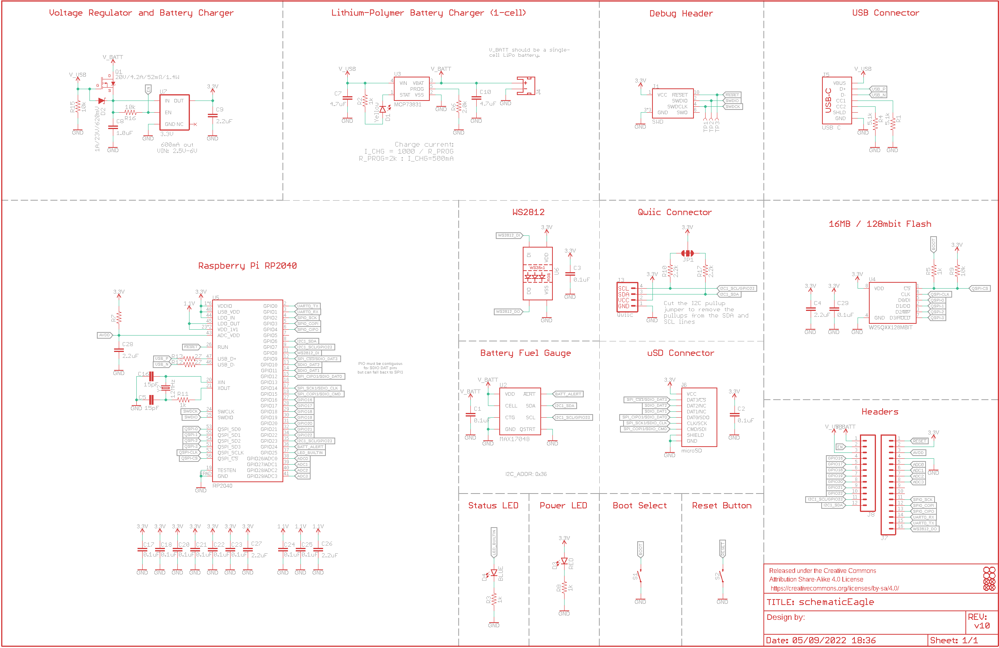
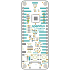
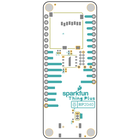
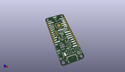
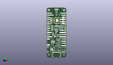
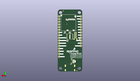
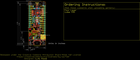
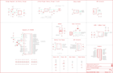
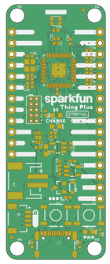
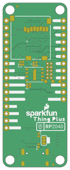

Contents
========

* [PRS17745 > SparkFun Thing Plus-RP2040](#prs17745--sparkfun-thing-plus-rp2040)
	* [Schematic](#schematic)
	* [PCB](#pcb)
	* [Interactive BOM](#interactive-bom)
	* [OOMP Parts](#oomp-parts)
	* [Images](#images)
	* [Tags](#tags)
  
![][im]
# PRS17745 > SparkFun Thing Plus-RP2040

- ID: PROJ-SPAR-17745-STAN-01
- Hex ID: PRS17745
- Name: Sparkfun
- Description: Sparkfun
- Long Link: [http://oom.lt/PROJ-SPAR-17745-STAN-01](http://oom.lt/PROJ-SPAR-17745-STAN-01)
- Short Link: [http://oom.lt/PRS17745](http://oom.lt/PRS17745)

## Schematic
  

## PCB
  

## Interactive BOM

- Interactive BOM page: [ibom.html](https://htmlpreview.github.io/?https://github.com/oomlout/oomlout_OOMP_projects/blob/main/PROJ-SPAR-17745-STAN-01/kicad/bom/ibom.html)

## OOMP Parts
  

|OOMP ID|Name|Identifier|
| :---: | :---: | :---: |
|[CAPC-0402-X-NF100-V10](https://github.com/oomlout/oomlout_OOMP_parts/tree/main/CAPC-0402-X-NF100-V10/)|[SMD (0402) 100 nF Capacitor (Ceramic) 10v](https://github.com/oomlout/oomlout_OOMP_parts/tree/main/CAPC-0402-X-NF100-V10/)|[C1, C2, C3, C17, C18, C20, C21, C22, C23, C24, C25, C29](https://github.com/oomlout/oomlout_OOMP_parts/tree/main/CAPC-0402-X-NF100-V10/)|
|CAPC-0402-X-UF22D-01||C4, C9, C26, C27, C28|
|[CAPC-0402-X-PF15-V50](https://github.com/oomlout/oomlout_OOMP_parts/tree/main/CAPC-0402-X-PF15-V50/)|[SMD (0402) 15 pF Capacitor (Ceramic) 50v](https://github.com/oomlout/oomlout_OOMP_parts/tree/main/CAPC-0402-X-PF15-V50/)|[C5, C16](https://github.com/oomlout/oomlout_OOMP_parts/tree/main/CAPC-0402-X-PF15-V50/)|
|[CAPC-0402-X-UF47D-V63D](https://github.com/oomlout/oomlout_OOMP_parts/tree/main/CAPC-0402-X-UF47D-V63D/)|[SMD (0402) 4.7 uF Capacitor (Ceramic) 6.3v](https://github.com/oomlout/oomlout_OOMP_parts/tree/main/CAPC-0402-X-UF47D-V63D/)|[C7, C10](https://github.com/oomlout/oomlout_OOMP_parts/tree/main/CAPC-0402-X-UF47D-V63D/)|
|CAPC-0402-X-UNMATCHED-01||C8|
|[LEDS-0603-Y-STAN-01](https://github.com/oomlout/oomlout_OOMP_parts/tree/main/LEDS-0603-Y-STAN-01/)|[SMD (0603) Yellow LED](https://github.com/oomlout/oomlout_OOMP_parts/tree/main/LEDS-0603-Y-STAN-01/)|[D1](https://github.com/oomlout/oomlout_OOMP_parts/tree/main/LEDS-0603-Y-STAN-01/)|
|DIOD-S323-X-UNMATCHED-01||D2|
|[LEDS-0603-R-STAN-01](https://github.com/oomlout/oomlout_OOMP_parts/tree/main/LEDS-0603-R-STAN-01/)|[SMD (0603) Red LED](https://github.com/oomlout/oomlout_OOMP_parts/tree/main/LEDS-0603-R-STAN-01/)|[D3](https://github.com/oomlout/oomlout_OOMP_parts/tree/main/LEDS-0603-R-STAN-01/)|
|[LEDS-0603-L-STAN-01](https://github.com/oomlout/oomlout_OOMP_parts/tree/main/LEDS-0603-L-STAN-01/)|[SMD (0603) Blue LED](https://github.com/oomlout/oomlout_OOMP_parts/tree/main/LEDS-0603-L-STAN-01/)|[D4](https://github.com/oomlout/oomlout_OOMP_parts/tree/main/LEDS-0603-L-STAN-01/)|
|UNMATCHED-UNMATCHED-X-UNMATCHED-01||J1, J3, J4, J5, J6, S1, S2, TP1, TP2, TP3, U2, U4, U5, Y2|
|[HEAD-I01-X-PI16-01](https://github.com/oomlout/oomlout_OOMP_parts/tree/main/HEAD-I01-X-PI16-01/)|[2.54 mm 16 Pin Header](https://github.com/oomlout/oomlout_OOMP_parts/tree/main/HEAD-I01-X-PI16-01/)|[J7](https://github.com/oomlout/oomlout_OOMP_parts/tree/main/HEAD-I01-X-PI16-01/)|
|[HEAD-I01-X-PI12-01](https://github.com/oomlout/oomlout_OOMP_parts/tree/main/HEAD-I01-X-PI12-01/)|[2.54 mm 12 Pin Header](https://github.com/oomlout/oomlout_OOMP_parts/tree/main/HEAD-I01-X-PI12-01/)|[J8](https://github.com/oomlout/oomlout_OOMP_parts/tree/main/HEAD-I01-X-PI12-01/)|
|MOSP-SO23-X-UNMATCHED-01||Q1|
|[RESE-0402-X-O472-01](https://github.com/oomlout/oomlout_OOMP_parts/tree/main/RESE-0402-X-O472-01/)|[SMD (0402) 4.7k Ohm Resistor](https://github.com/oomlout/oomlout_OOMP_parts/tree/main/RESE-0402-X-O472-01/)|[R1, R4](https://github.com/oomlout/oomlout_OOMP_parts/tree/main/RESE-0402-X-O472-01/)|
|[RESE-0402-X-O102-01](https://github.com/oomlout/oomlout_OOMP_parts/tree/main/RESE-0402-X-O102-01/)|[SMD (0402) 1k Ohm Resistor](https://github.com/oomlout/oomlout_OOMP_parts/tree/main/RESE-0402-X-O102-01/)|[R2, R3, R5, R8, R11](https://github.com/oomlout/oomlout_OOMP_parts/tree/main/RESE-0402-X-O102-01/)|
|RESE-0603-X-UNMATCHED-01||R6|
|RESE-0402-X-UNMATCHED-01||R7|
|[RESE-0402-X-O103-01](https://github.com/oomlout/oomlout_OOMP_parts/tree/main/RESE-0402-X-O103-01/)|[SMD (0402) 10k Ohm Resistor](https://github.com/oomlout/oomlout_OOMP_parts/tree/main/RESE-0402-X-O103-01/)|[R9, R15, R16](https://github.com/oomlout/oomlout_OOMP_parts/tree/main/RESE-0402-X-O103-01/)|
|[RESE-0402-X-O222-01](https://github.com/oomlout/oomlout_OOMP_parts/tree/main/RESE-0402-X-O222-01/)|[SMD (0402) 2.2k Ohm Resistor](https://github.com/oomlout/oomlout_OOMP_parts/tree/main/RESE-0402-X-O222-01/)|[R10, R17](https://github.com/oomlout/oomlout_OOMP_parts/tree/main/RESE-0402-X-O222-01/)|
|RESE-0402-X-O270-01||R12, R13|
|UNMATCHED-SO235-X-UNMATCHED-01||U3|
|UNMATCHED-2020-X-K2812-01||U6|
|[VREG-SO235-X-KAP2112K-V33D](https://github.com/oomlout/oomlout_OOMP_parts/tree/main/VREG-SO235-X-KAP2112K-V33D/)|[SMD (SOT-23-5) AP2112K Voltage Regulator 3.3v](https://github.com/oomlout/oomlout_OOMP_parts/tree/main/VREG-SO235-X-KAP2112K-V33D/)|[U7](https://github.com/oomlout/oomlout_OOMP_parts/tree/main/VREG-SO235-X-KAP2112K-V33D/)|

## Images
  
  

|bominteractivefront|bominteractiveback|kicadPcb3d|kicadPcb3dFront|kicadPcb3dBack|eagleImage|eagleSchemImage|pcbdraw|pcbdrawback|
| :---: | :---: | :---: | :---: | :---: | :---: | :---: | :---: | :---: |
||||||||||

## Tags

- hexID: PRS17745
- oompType: PROJ
- oompSize: SPAR
- oompColor: 17745
- oompDesc: STAN
- oompIndex: 01
- oompName: SparkFun Thing Plus-RP2040
- sources: All source files from https://github.com/sparkfun/SparkFun_Thing_Plus-RP2040 (source licence details in srcLicense.md)
- linkBuyPage: https://www.sparkfun.com/products/17745
- oompID: PROJ-SPAR-17745-STAN-01
- oompParts: C1,CAPC-0402-X-NF100-V10
- oompParts: C2,CAPC-0402-X-NF100-V10
- oompParts: C3,CAPC-0402-X-NF100-V10
- oompParts: C4,CAPC-0402-X-UF22D-01
- oompParts: C5,CAPC-0402-X-PF15-V50
- oompParts: C7,CAPC-0402-X-UF47D-V63D
- oompParts: C8,CAPC-0402-X-UNMATCHED-01
- oompParts: C9,CAPC-0402-X-UF22D-01
- oompParts: C10,CAPC-0402-X-UF47D-V63D
- oompParts: C16,CAPC-0402-X-PF15-V50
- oompParts: C17,CAPC-0402-X-NF100-V10
- oompParts: C18,CAPC-0402-X-NF100-V10
- oompParts: C20,CAPC-0402-X-NF100-V10
- oompParts: C21,CAPC-0402-X-NF100-V10
- oompParts: C22,CAPC-0402-X-NF100-V10
- oompParts: C23,CAPC-0402-X-NF100-V10
- oompParts: C24,CAPC-0402-X-NF100-V10
- oompParts: C25,CAPC-0402-X-NF100-V10
- oompParts: C26,CAPC-0402-X-UF22D-01
- oompParts: C27,CAPC-0402-X-UF22D-01
- oompParts: C28,CAPC-0402-X-UF22D-01
- oompParts: C29,CAPC-0402-X-NF100-V10
- oompParts: D1,LEDS-0603-Y-STAN-01
- oompParts: D2,DIOD-S323-X-UNMATCHED-01
- oompParts: D3,LEDS-0603-R-STAN-01
- oompParts: D4,LEDS-0603-L-STAN-01
- oompParts: J1,UNMATCHED-UNMATCHED-X-UNMATCHED-01
- oompParts: J3,UNMATCHED-UNMATCHED-X-UNMATCHED-01
- oompParts: J4,UNMATCHED-UNMATCHED-X-UNMATCHED-01
- oompParts: J5,UNMATCHED-UNMATCHED-X-UNMATCHED-01
- oompParts: J6,UNMATCHED-UNMATCHED-X-UNMATCHED-01
- oompParts: J7,HEAD-I01-X-PI16-01
- oompParts: J8,HEAD-I01-X-PI12-01
- oompParts: Q1,MOSP-SO23-X-UNMATCHED-01
- oompParts: R1,RESE-0402-X-O472-01
- oompParts: R2,RESE-0402-X-O102-01
- oompParts: R3,RESE-0402-X-O102-01
- oompParts: R4,RESE-0402-X-O472-01
- oompParts: R5,RESE-0402-X-O102-01
- oompParts: R6,RESE-0603-X-UNMATCHED-01
- oompParts: R7,RESE-0402-X-UNMATCHED-01
- oompParts: R8,RESE-0402-X-O102-01
- oompParts: R9,RESE-0402-X-O103-01
- oompParts: R10,RESE-0402-X-O222-01
- oompParts: R11,RESE-0402-X-O102-01
- oompParts: R12,RESE-0402-X-O270-01
- oompParts: R13,RESE-0402-X-O270-01
- oompParts: R15,RESE-0402-X-O103-01
- oompParts: R16,RESE-0402-X-O103-01
- oompParts: R17,RESE-0402-X-O222-01
- oompParts: S1,UNMATCHED-UNMATCHED-X-UNMATCHED-01
- oompParts: S2,UNMATCHED-UNMATCHED-X-UNMATCHED-01
- oompParts: TP1,UNMATCHED-UNMATCHED-X-UNMATCHED-01
- oompParts: TP2,UNMATCHED-UNMATCHED-X-UNMATCHED-01
- oompParts: TP3,UNMATCHED-UNMATCHED-X-UNMATCHED-01
- oompParts: U2,UNMATCHED-UNMATCHED-X-UNMATCHED-01
- oompParts: U3,UNMATCHED-SO235-X-UNMATCHED-01
- oompParts: U4,UNMATCHED-UNMATCHED-X-UNMATCHED-01
- oompParts: U5,UNMATCHED-UNMATCHED-X-UNMATCHED-01
- oompParts: U6,UNMATCHED-2020-X-K2812-01
- oompParts: U7,VREG-SO235-X-KAP2112K-V33D
- oompParts: Y2,UNMATCHED-UNMATCHED-X-UNMATCHED-01
- rawParts: C1,0.1uF,0.1UF-0402T-6.3V-10%-X7R,0402-TIGHT,0.1µF ceramic capacitors,,CAP-14993,,,0.1uF,
- rawParts: C2,0.1uF,0.1UF-0402T-6.3V-10%-X7R,0402-TIGHT,0.1µF ceramic capacitors,,CAP-14993,,,0.1uF,
- rawParts: C3,0.1uF,0.1UF-0402T-6.3V-10%-X7R,0402-TIGHT,0.1µF ceramic capacitors,,CAP-14993,,,0.1uF,
- rawParts: C4,2.2uF,2.2UF-0402_TIGHT-10V-10%-X5R,0402-TIGHT,2.2µF ceramic capacitors,,CAP-14232,,,2.2uF,
- rawParts: C5,15pF,15PF-0402T-50V-5%,0402-TIGHT,15pF ceramic capacitors,,CAP-13063,,,15pF,
- rawParts: C7,4.7uF,4.7UF-0402_TIGHT-6.3V-20%-X5R,0402-TIGHT,4.7µF ceramic capacitors,,CAP-14240,,,4.7uF,
- rawParts: C8,1.0uF,1.0UF-0402T-16V-10%,0402-TIGHT,1µF ceramic capacitors,,CAP-12417,,,1.0uF,
- rawParts: C9,2.2uF,2.2UF-0402_TIGHT-10V-10%-X5R,0402-TIGHT,2.2µF ceramic capacitors,,CAP-14232,,,2.2uF,
- rawParts: C10,4.7uF,4.7UF-0402_TIGHT-6.3V-20%-X5R,0402-TIGHT,4.7µF ceramic capacitors,,CAP-14240,,,4.7uF,
- rawParts: C16,15pF,15PF-0402T-50V-5%,0402-TIGHT,15pF ceramic capacitors,,CAP-13063,,,15pF,
- rawParts: C17,0.1uF,0.1UF-0402T-6.3V-10%-X7R,0402-TIGHT,0.1µF ceramic capacitors,,CAP-14993,,,0.1uF,
- rawParts: C18,0.1uF,0.1UF-0402T-6.3V-10%-X7R,0402-TIGHT,0.1µF ceramic capacitors,,CAP-14993,,,0.1uF,
- rawParts: C20,0.1uF,0.1UF-0402T-6.3V-10%-X7R,0402-TIGHT,0.1µF ceramic capacitors,,CAP-14993,,,0.1uF,
- rawParts: C21,0.1uF,0.1UF-0402T-6.3V-10%-X7R,0402-TIGHT,0.1µF ceramic capacitors,,CAP-14993,,,0.1uF,
- rawParts: C22,0.1uF,0.1UF-0402T-6.3V-10%-X7R,0402-TIGHT,0.1µF ceramic capacitors,,CAP-14993,,,0.1uF,
- rawParts: C23,0.1uF,0.1UF-0402T-6.3V-10%-X7R,0402-TIGHT,0.1µF ceramic capacitors,,CAP-14993,,,0.1uF,
- rawParts: C24,0.1uF,0.1UF-0402T-6.3V-10%-X7R,0402-TIGHT,0.1µF ceramic capacitors,,CAP-14993,,,0.1uF,
- rawParts: C25,0.1uF,0.1UF-0402T-6.3V-10%-X7R,0402-TIGHT,0.1µF ceramic capacitors,,CAP-14993,,,0.1uF,
- rawParts: C26,2.2uF,2.2UF-0402_TIGHT-10V-10%-X5R,0402-TIGHT,2.2µF ceramic capacitors,,CAP-14232,,,2.2uF,
- rawParts: C27,2.2uF,2.2UF-0402_TIGHT-10V-10%-X5R,0402-TIGHT,2.2µF ceramic capacitors,,CAP-14232,,,2.2uF,
- rawParts: C28,2.2uF,2.2UF-0402_TIGHT-10V-10%-X5R,0402-TIGHT,2.2µF ceramic capacitors,,CAP-14232,,,2.2uF,
- rawParts: C29,0.1uF,0.1UF-0402T-6.3V-10%-X7R,0402-TIGHT,0.1µF ceramic capacitors,,CAP-14993,,,0.1uF,
- rawParts: D1,Yellow,LED-YELLOW0603,LED-0603,Yellow SMD LED,,DIO-09003,,,Yellow,
- rawParts: D2,1A/23V/620mV,DIODE-SCHOTTKY-BAT20J,SOD-323,Schottky diode,,DIO-11623,,,1A/23V/620mV,
- rawParts: D3,RED,LED-RED0603,LED-0603,Red SMD LED,,DIO-00819,,,RED,
- rawParts: D4,BLUE,LED-BLUE0603,LED-0603,Blue SMD LED,,DIO-08575,,,BLUE,
- rawParts: FD1,FIDUCIALUFIDUCIAL,FIDUCIALUFIDUCIAL,FIDUCIAL-MICRO,Fiducial Alignment Points,,,,,,
- rawParts: FD2,FIDUCIALUFIDUCIAL,FIDUCIALUFIDUCIAL,FIDUCIAL-MICRO,Fiducial Alignment Points,,,,,,
- rawParts: FD3,FIDUCIALUFIDUCIAL,FIDUCIALUFIDUCIAL,FIDUCIAL-MICRO,Fiducial Alignment Points,,,,,,
- rawParts: FD4,FIDUCIALUFIDUCIAL,FIDUCIALUFIDUCIAL,FIDUCIAL-MICRO,Fiducial Alignment Points,,,,,,
- rawParts: FRAME1,FRAME-LEDGER,FRAME-LEDGER,CREATIVE_COMMONS,Schematic Frame - Ledger,,,,,,
- rawParts: H1,STAND-OFF,STAND-OFF,STAND-OFF,Stand Off,,,,,,
- rawParts: H2,STAND-OFF,STAND-OFF,STAND-OFF,Stand Off,,,,,,
- rawParts: H3,STAND-OFF,STAND-OFF,STAND-OFF,Stand Off,,,,,,
- rawParts: H4,STAND-OFF,STAND-OFF,STAND-OFF,Stand Off,,,,,,
- rawParts: J1,SWD,CORTEX_JTAG_DEBUG_MINIMUM_PTH,2X5-PTH-1.27MM,Cortex Debug Connector - 10 pin,,,,,,
- rawParts: J3,Qwiic,QWIIC_CONNECTORJS-1MM,JST04_1MM_RA,SparkFun I2C Standard Qwiic Connector,,CONN-13694,,,QWIIC_RIGHT_ANGLE,
- rawParts: J4,,JST_2MM_MALE,JST-2-SMD,JST 2MM MALE RA CONNECTOR,,CONN-11443,,PRT-08612,,
- rawParts: J5,USB C,USB_C_4-LAYER-ISOLATED,USB-C-16P-4LAYER-ISOLATED,USB Type C 16Pin Connector,,CONN-14122,,,USB Female Type C Connector,
- rawParts: J6,microSD,MICRO-SD-SDIOPUSH-PUSH,MICRO-SD-SOCKET,microSD Socket for Transflash,,CONN-07820,,,,
- rawParts: J7,,CONN_161X16_NO_SILK,1X16_NO_SILK,Multi connection point. Often used as Generic Header-pin footprint for 0.1 inch spaced/style header connections,,,,,,
- rawParts: J8,,CONN_12NO_SILK,1X12_NO_SILK,Multi connection point. Often used as Generic Header-pin footprint for 0.1 inch spaced/style header connections,,,,,,
- rawParts: JP1,JUMPER-SMT_3_2-NC_TRACE_SILK,JUMPER-SMT_3_2-NC_TRACE_SILK,SMT-JUMPER_3_2-NC_TRACE_SILK,Normally closed trace jumper (2 of 2 connections),,,,,,
- rawParts: Q1,20V/4.2A/52mΩ/1.4W,MOSFET_PCH-DMG2305UX-7,SOT23-3,P-channel MOSFETs,,TRAN-14388,,,20V/4.2A/52mΩ/1.4W,
- rawParts: R1,5.1k,5.1KOHM-0402T-1/16W-1%,0402-TIGHT,,,RES-14340,,,5.1k,
- rawParts: R2,1k,1KOHM-0402T-1/16W-1%,0402-TIGHT,1kΩ resistor,,RES-14342,,,1k,
- rawParts: R3,1k,1KOHM-0402T-1/16W-1%,0402-TIGHT,1kΩ resistor,,RES-14342,,,1k,
- rawParts: R4,5.1k,5.1KOHM-0402T-1/16W-1%,0402-TIGHT,,,RES-14340,,,5.1k,
- rawParts: R5,1k,1KOHM-0402T-1/16W-1%,0402-TIGHT,1kΩ resistor,,RES-14342,,,1k,
- rawParts: R6,2.0k,2.0KOHM-0603-1/10W-5%,0603,2kΩ resistor,,RES-08296,,,2.0k,
- rawParts: R7,200OHM-0402T-1/16W-1%,200OHM-0402T-1/16W-1%,0402-TIGHT,200Ω resistor,,RES-15550,,,,
- rawParts: R8,1k,1KOHM-0402T-1/16W-1%,0402-TIGHT,1kΩ resistor,,RES-14342,,,1k,
- rawParts: R9,10k,10KOHM-0402T-1/16W-1%,0402-TIGHT,10kΩ resistor,,RES-14241,,,10k,
- rawParts: R10,2.2k,2.2KOHM-0402T-1/16W-1%,0402-TIGHT,2.2kΩ resistor,,RES-14341,,,2.2k,
- rawParts: R11,1k,1KOHM-0402T-1/16W-1%,0402-TIGHT,1kΩ resistor,,RES-14342,,,1k,
- rawParts: R12,27,27OHM,0402-TIGHT,27Ω resistor,,RES-15238,,,,
- rawParts: R13,27,27OHM,0402-TIGHT,27Ω resistor,,RES-15238,,,,
- rawParts: R15,10k,10KOHM-0402T-1/16W-1%,0402-TIGHT,10kΩ resistor,,RES-14241,,,10k,
- rawParts: R16,10k,10KOHM-0402T-1/16W-1%,0402-TIGHT,10kΩ resistor,,RES-14241,,,10k,
- rawParts: R17,2.2k,2.2KOHM-0402T-1/16W-1%,0402-TIGHT,2.2kΩ resistor,,RES-14341,,,2.2k,
- rawParts: S1,MOMENTARY-SWITCH-SPST-SMD-5.2MM-TALL,MOMENTARY-SWITCH-SPST-SMD-5.2MM-TALL,TACTILE_SWITCH_SMD_5.2MM,Momentary Switch (Pushbutton) - SPST,,SWCH-14139,,,,
- rawParts: S2,MOMENTARY-SWITCH-SPST-SMD-5.2MM-TALL,MOMENTARY-SWITCH-SPST-SMD-5.2MM-TALL,TACTILE_SWITCH_SMD_5.2MM,Momentary Switch (Pushbutton) - SPST,,SWCH-14139,,,,
- rawParts: TP1,,TEST-POINT3X4,PAD.03X.04,SparkFun Test Points,,,,,,
- rawParts: TP2,,TEST-POINT3X4,PAD.03X.04,SparkFun Test Points,,,,,,
- rawParts: TP3,,TEST-POINT3X4,PAD.03X.04,SparkFun Test Points,,,,,,
- rawParts: U2,MAX17048,MAX17048DFN8,DFN-8,Micropower 1-Cell Li+ ModelGauge,,IC-12551,,,MAX17048,
- rawParts: U3,MCP73831,MCP73831,SOT23-5,MCP73831T Li-Ion, Li-Pol Controller,,IC-09995,,,,
- rawParts: U4,W25QXX128MBIT,W25QXX128MBIT-6X5-SKINNY_CENTER,WSON-8-6X5-SKINNY_CENTERPAD,,,IC-15107,,,,
- rawParts: U5,RP2040,RP2040,QFN-56,Raspberry Pi RP2040 MCU,,IC-15502,,,,
- rawParts: U6,WS2812-2020,WS2812-2020,WS2812-2020,,,,,,,
- rawParts: U7,3.3V,V_REG_AP2112K-3.3V,SOT23-5,AP2112 - 600mA CMOS LDO Regulator w/ Enable,,VREG-12457,,,3.3V,
- rawParts: Y2,12MHz,CRYSTAL-12MHZ,CRYSTAL-SMD-2X2.5MM,12.0MHz Crystal,,XTAL-15540,,,,

[im]: kicadPcb3d_450.png
