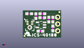
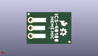
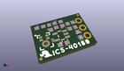

Contents
========

* [PROJ-SPAR-18011-STAN-01>SparkFun Analog MEMS Microphone Breakout ICS-40180](#proj-spar-18011-stan-01sparkfun-analog-mems-microphone-breakout-ics-40180)
	* [Images](#images)
	* [Interactive BOM](#interactive-bom)
	* [Tags](#tags)
  
![][im]
# PROJ-SPAR-18011-STAN-01>SparkFun Analog MEMS Microphone Breakout ICS-40180

- ID: PROJ-SPAR-18011-STAN-01
- Hex ID: PRS18011
- Name: SparkFun Analog MEMS Microphone Breakout ICS-40180
- Description: 

## Images
  
  

|eagleImage|kicadPcb3dFront|kicadPcb3dBack|kicadPcb3d|
| :---: | :---: | :---: | :---: |
|||||

## Interactive BOM

- Interactive BOM page: [ibom.html](kicad/bom/ibom.html)

## Tags

- hexID: PRS18011
- oompType: PROJ
- oompSize: SPAR
- oompColor: 18011
- oompDesc: STAN
- oompIndex: 01
- oompName: SparkFun Analog MEMS Microphone Breakout ICS-40180
- sources: All source files from https://github.com/sparkfun/SparkFun_Analog_MEMS_Microphone_Breakout_ICS-40180 (source licence details in srcLicense.md)
- linkBuyPage: https://www.sparkfun.com/products/18011
- oompID: PROJ-SPAR-18011-STAN-01

[im]: kicadPcb3d_450.png
