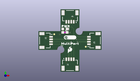
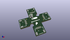

Contents
========

* [PROJ-SPAR-18012-STAN-01>Qwiic MultiPort](#proj-spar-18012-stan-01qwiic-multiport)
	* [Images](#images)
	* [Interactive BOM](#interactive-bom)
	* [OOMP Parts](#oomp-parts)
	* [Tags](#tags)
  
![][im]
# PROJ-SPAR-18012-STAN-01>Qwiic MultiPort

- ID: PROJ-SPAR-18012-STAN-01
- Hex ID: PRS18012
- Name: Qwiic MultiPort
- Description: 

## Images
  
  

|eagleImage|kicadPcb3dFront|kicadPcb3dBack|kicadPcb3d|
| :---: | :---: | :---: | :---: |
|||||

## Interactive BOM

- Interactive BOM page: [ibom.html](kicad/bom/ibom.html)

## OOMP Parts
  

|OOMP Parts|
| :---: |
|UNMATCHED-0603-X-UNMATCHED-01, D1, 10.668, 17.399, 0,D1, RED, LED-0603, SparkFun-LED, (0.42, 0.685), R0|
|UNMATCHED-UNMATCHED-X-UNMATCHED-01, FD1, 6.35, 15.239999999999998, M0,FD1, FIDUCIALUFIDUCIAL, FIDUCIAL-MICRO, SparkFun-Aesthetics, (0.25, 0.6), MR0|
|UNMATCHED-UNMATCHED-X-UNMATCHED-01, FD2, 6.35, 15.239999999999998, 0,FD2, FIDUCIALUFIDUCIAL, FIDUCIAL-MICRO, SparkFun-Aesthetics, (0.25, 0.6), R0|
|UNMATCHED-UNMATCHED-X-UNMATCHED-01, FD3, 19.049999999999997, 10.16, 0,FD3, FIDUCIALUFIDUCIAL, FIDUCIAL-MICRO, SparkFun-Aesthetics, (0.75, 0.4), R0|
|UNMATCHED-UNMATCHED-X-UNMATCHED-01, FD4, 19.049999999999997, 10.16, M0,FD4, FIDUCIALUFIDUCIAL, FIDUCIAL-MICRO, SparkFun-Aesthetics, (0.75, 0.4), MR0|
|UNMATCHED-UNMATCHED-X-UNMATCHED-01, J1, 12.7, 5.08, 0,J1, QWIIC_RIGHT_ANGLE, JST04_1MM_RA, SparkFun-Connectors, (0.5, 0.2), R0|
|UNMATCHED-UNMATCHED-X-UNMATCHED-01, J2, 5.08, 12.7, 270,J2, QWIIC_RIGHT_ANGLE, JST04_1MM_RA, SparkFun-Connectors, (0.2, 0.5), R270|
|UNMATCHED-UNMATCHED-X-UNMATCHED-01, J3, 20.32, 12.7, 90,J3, QWIIC_RIGHT_ANGLE, JST04_1MM_RA, SparkFun-Connectors, (0.8, 0.5), R90|
|UNMATCHED-UNMATCHED-X-UNMATCHED-01, J4, 12.7, 20.32, 180,J4, QWIIC_RIGHT_ANGLE, JST04_1MM_RA, SparkFun-Connectors, (0.5, 0.8), R180|
|UNMATCHED-UNMATCHED-X-UNMATCHED-01, JP1, 10.668, 18.923, M0,JP1, PWR_LED, SMT-JUMPER_2_NC_TRACE_SILK, SparkFun-Jumpers, (0.42, 0.745), MR0|
|RESE-0603-X-UNMATCHED-01, R1, 10.668, 16.002, 0,R1, 1k, 0603, SparkFun-Resistors, (0.42, 0.63), R0|

## Tags

- hexID: PRS18012
- oompType: PROJ
- oompSize: SPAR
- oompColor: 18012
- oompDesc: STAN
- oompIndex: 01
- oompName: Qwiic MultiPort
- sources: All source files from https://github.com/sparkfun/Qwiic_MultiPort (source licence details in srcLicense.md)
- linkBuyPage: https://www.sparkfun.com/products/18012
- oompPart: UNMATCHED-0603-X-UNMATCHED-01, D1, 10.668, 17.399, 0
- oompPart: UNMATCHED-UNMATCHED-X-UNMATCHED-01, FD1, 6.35, 15.239999999999998, M0
- oompPart: UNMATCHED-UNMATCHED-X-UNMATCHED-01, FD2, 6.35, 15.239999999999998, 0
- oompPart: UNMATCHED-UNMATCHED-X-UNMATCHED-01, FD3, 19.049999999999997, 10.16, 0
- oompPart: UNMATCHED-UNMATCHED-X-UNMATCHED-01, FD4, 19.049999999999997, 10.16, M0
- oompPart: UNMATCHED-UNMATCHED-X-UNMATCHED-01, J1, 12.7, 5.08, 0
- oompPart: UNMATCHED-UNMATCHED-X-UNMATCHED-01, J2, 5.08, 12.7, 270
- oompPart: UNMATCHED-UNMATCHED-X-UNMATCHED-01, J3, 20.32, 12.7, 90
- oompPart: UNMATCHED-UNMATCHED-X-UNMATCHED-01, J4, 12.7, 20.32, 180
- oompPart: UNMATCHED-UNMATCHED-X-UNMATCHED-01, JP1, 10.668, 18.923, M0
- oompPart: RESE-0603-X-UNMATCHED-01, R1, 10.668, 16.002, 0
- rawPart: D1, RED, LED-0603, SparkFun-LED, (0.42, 0.685), R0
- rawPart: FD1, FIDUCIALUFIDUCIAL, FIDUCIAL-MICRO, SparkFun-Aesthetics, (0.25, 0.6), MR0
- rawPart: FD2, FIDUCIALUFIDUCIAL, FIDUCIAL-MICRO, SparkFun-Aesthetics, (0.25, 0.6), R0
- rawPart: FD3, FIDUCIALUFIDUCIAL, FIDUCIAL-MICRO, SparkFun-Aesthetics, (0.75, 0.4), R0
- rawPart: FD4, FIDUCIALUFIDUCIAL, FIDUCIAL-MICRO, SparkFun-Aesthetics, (0.75, 0.4), MR0
- rawPart: J1, QWIIC_RIGHT_ANGLE, JST04_1MM_RA, SparkFun-Connectors, (0.5, 0.2), R0
- rawPart: J2, QWIIC_RIGHT_ANGLE, JST04_1MM_RA, SparkFun-Connectors, (0.2, 0.5), R270
- rawPart: J3, QWIIC_RIGHT_ANGLE, JST04_1MM_RA, SparkFun-Connectors, (0.8, 0.5), R90
- rawPart: J4, QWIIC_RIGHT_ANGLE, JST04_1MM_RA, SparkFun-Connectors, (0.5, 0.8), R180
- rawPart: JP1, PWR_LED, SMT-JUMPER_2_NC_TRACE_SILK, SparkFun-Jumpers, (0.42, 0.745), MR0
- rawPart: R1, 1k, 0603, SparkFun-Resistors, (0.42, 0.63), R0

[im]: kicadPcb3d_450.png
