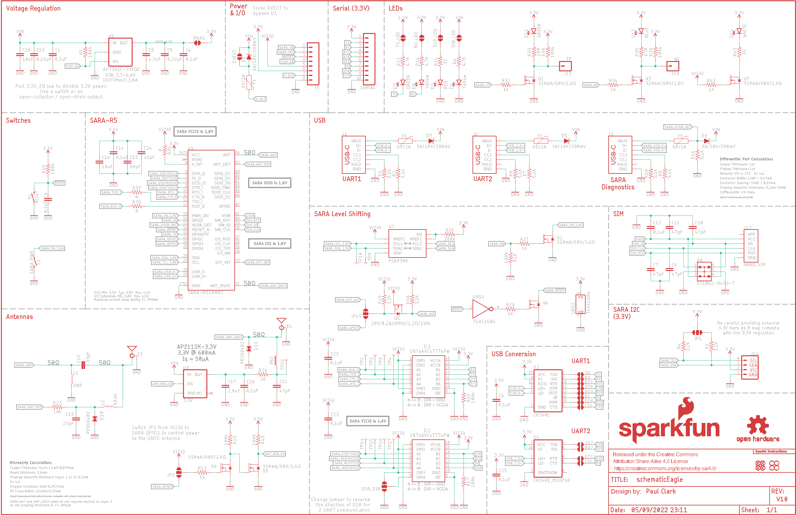
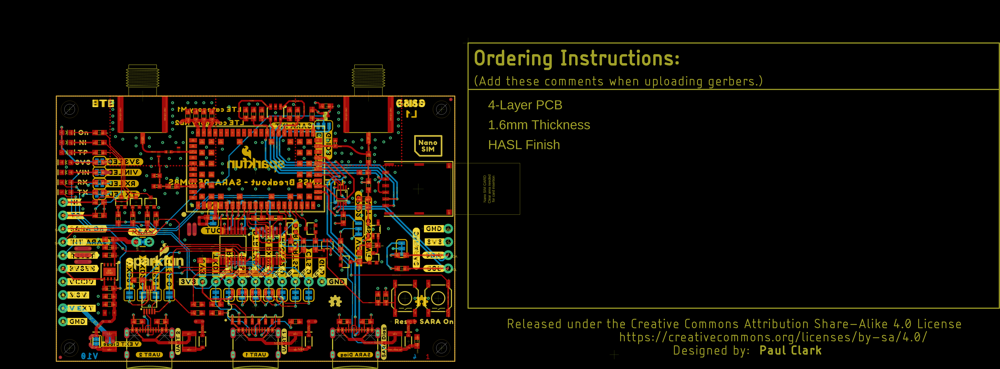
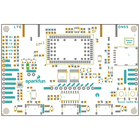
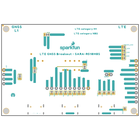
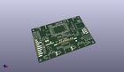
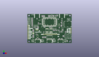
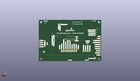
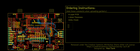
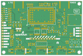
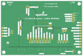

Contents
========

* [PRS18031 > SparkFun LTE GNSS Breakout SARA-R510M8S](#prs18031--sparkfun-lte-gnss-breakout-sara-r510m8s)
	* [Schematic](#schematic)
	* [PCB](#pcb)
	* [Interactive BOM](#interactive-bom)
	* [OOMP Parts](#oomp-parts)
	* [Images](#images)
	* [Tags](#tags)
  
![][im]
# PRS18031 > SparkFun LTE GNSS Breakout SARA-R510M8S

- ID: PROJ-SPAR-18031-STAN-01
- Hex ID: PRS18031
- Name: Sparkfun
- Description: Sparkfun
- Long Link: [http://oom.lt/PROJ-SPAR-18031-STAN-01](http://oom.lt/PROJ-SPAR-18031-STAN-01)
- Short Link: [http://oom.lt/PRS18031](http://oom.lt/PRS18031)

## Schematic
  

## PCB
  

## Interactive BOM

- Interactive BOM page: [ibom.html](https://htmlpreview.github.io/?https://github.com/oomlout/oomlout_OOMP_projects/blob/main/PROJ-SPAR-18031-STAN-01/kicad/bom/ibom.html)

## OOMP Parts
  

|OOMP ID|Name|Identifier|
| :---: | :---: | :---: |
|UNMATCHED-UNMATCHED-X-UNMATCHED-01||3V3_LED, E3, E4, F1, F2, F3, F4, IC1, IC2, J1, J2, J3, J17, JP1, LOGO5, MEAS, RX_LED, S1, S3, TX_LED, U1, U2, U4, U5, U7, U8, VIN_LED|
|[CAPC-0603-X-NF100-V50](https://github.com/oomlout/oomlout_OOMP_parts/tree/main/CAPC-0603-X-NF100-V50/)|[SMD (0603) 100 nF Capacitor (Ceramic) 50v](https://github.com/oomlout/oomlout_OOMP_parts/tree/main/CAPC-0603-X-NF100-V50/)|[C1, C4, C6, C9, C12, C14, C20, C22, C23, C25](https://github.com/oomlout/oomlout_OOMP_parts/tree/main/CAPC-0603-X-NF100-V50/)|
|[CAPC-0603-X-UF47D-V10](https://github.com/oomlout/oomlout_OOMP_parts/tree/main/CAPC-0603-X-UF47D-V10/)|[SMD (0603) 4.7 uF Capacitor (Ceramic) 10v](https://github.com/oomlout/oomlout_OOMP_parts/tree/main/CAPC-0603-X-UF47D-V10/)|[C3](https://github.com/oomlout/oomlout_OOMP_parts/tree/main/CAPC-0603-X-UF47D-V10/)|
|[CAPC-0603-X-NF220-V25](https://github.com/oomlout/oomlout_OOMP_parts/tree/main/CAPC-0603-X-NF220-V25/)|[SMD (0603) 220 nF Capacitor (Ceramic) 25v](https://github.com/oomlout/oomlout_OOMP_parts/tree/main/CAPC-0603-X-NF220-V25/)|[C5, C13](https://github.com/oomlout/oomlout_OOMP_parts/tree/main/CAPC-0603-X-NF220-V25/)|
|CAPC-0603-X-PF47-01||C7, C8, C10, C11, C21|
|CAPC-0603-X-PF68-01||C15|
|[CAPC-0603-X-UF10-V63D](https://github.com/oomlout/oomlout_OOMP_parts/tree/main/CAPC-0603-X-UF10-V63D/)|[SMD (0603) 10 uF Capacitor (Ceramic) 6.3v](https://github.com/oomlout/oomlout_OOMP_parts/tree/main/CAPC-0603-X-UF10-V63D/)|[C16](https://github.com/oomlout/oomlout_OOMP_parts/tree/main/CAPC-0603-X-UF10-V63D/)|
|CAPC-0603-X-UNMATCHED-01||C17|
|[CAPC-0402-X-PF33-V50](https://github.com/oomlout/oomlout_OOMP_parts/tree/main/CAPC-0402-X-PF33-V50/)|[SMD (0402) 33 pF Capacitor (Ceramic) 50v](https://github.com/oomlout/oomlout_OOMP_parts/tree/main/CAPC-0402-X-PF33-V50/)|[C18](https://github.com/oomlout/oomlout_OOMP_parts/tree/main/CAPC-0402-X-PF33-V50/)|
|[CAPC-0402-X-PF27-V50](https://github.com/oomlout/oomlout_OOMP_parts/tree/main/CAPC-0402-X-PF27-V50/)|[SMD (0402) 27 pF Capacitor (Ceramic) 50v](https://github.com/oomlout/oomlout_OOMP_parts/tree/main/CAPC-0402-X-PF27-V50/)|[C19](https://github.com/oomlout/oomlout_OOMP_parts/tree/main/CAPC-0402-X-PF27-V50/)|
|[CAPC-0603-X-PF15-V50](https://github.com/oomlout/oomlout_OOMP_parts/tree/main/CAPC-0603-X-PF15-V50/)|[SMD (0603) 15 pF Capacitor (Ceramic) 50v](https://github.com/oomlout/oomlout_OOMP_parts/tree/main/CAPC-0603-X-PF15-V50/)|[C24](https://github.com/oomlout/oomlout_OOMP_parts/tree/main/CAPC-0603-X-PF15-V50/)|
|[CAPC-0805-X-UF10-V10](https://github.com/oomlout/oomlout_OOMP_parts/tree/main/CAPC-0805-X-UF10-V10/)|[SMD (0805) 10 uF Capacitor (Ceramic) 10v](https://github.com/oomlout/oomlout_OOMP_parts/tree/main/CAPC-0805-X-UF10-V10/)|[C26](https://github.com/oomlout/oomlout_OOMP_parts/tree/main/CAPC-0805-X-UF10-V10/)|
|DIOD-S323-X-UNMATCHED-01||D1, D3, D5, D6|
|[LEDS-0603-R-STAN-01](https://github.com/oomlout/oomlout_OOMP_parts/tree/main/LEDS-0603-R-STAN-01/)|[SMD (0603) Red LED](https://github.com/oomlout/oomlout_OOMP_parts/tree/main/LEDS-0603-R-STAN-01/)|[D2](https://github.com/oomlout/oomlout_OOMP_parts/tree/main/LEDS-0603-R-STAN-01/)|
|[LEDS-0603-Y-STAN-01](https://github.com/oomlout/oomlout_OOMP_parts/tree/main/LEDS-0603-Y-STAN-01/)|[SMD (0603) Yellow LED](https://github.com/oomlout/oomlout_OOMP_parts/tree/main/LEDS-0603-Y-STAN-01/)|[D4, D9](https://github.com/oomlout/oomlout_OOMP_parts/tree/main/LEDS-0603-Y-STAN-01/)|
|[LEDS-0603-G-STAN-01](https://github.com/oomlout/oomlout_OOMP_parts/tree/main/LEDS-0603-G-STAN-01/)|[SMD (0603) Green LED](https://github.com/oomlout/oomlout_OOMP_parts/tree/main/LEDS-0603-G-STAN-01/)|[D7, D12, D14](https://github.com/oomlout/oomlout_OOMP_parts/tree/main/LEDS-0603-G-STAN-01/)|
|DIOD-SO23-X-UNMATCHED-01||D8|
|DIOD-0402-X-UNMATCHED-01||D10, D11|
|[LEDS-0603-L-STAN-01](https://github.com/oomlout/oomlout_OOMP_parts/tree/main/LEDS-0603-L-STAN-01/)|[SMD (0603) Blue LED](https://github.com/oomlout/oomlout_OOMP_parts/tree/main/LEDS-0603-L-STAN-01/)|[D13](https://github.com/oomlout/oomlout_OOMP_parts/tree/main/LEDS-0603-L-STAN-01/)|
|FERB-0603-X-UNMATCHED-01||FB1|
|[HEAD-I01-X-PI08-01](https://github.com/oomlout/oomlout_OOMP_parts/tree/main/HEAD-I01-X-PI08-01/)|[2.54 mm 8 Pin Header](https://github.com/oomlout/oomlout_OOMP_parts/tree/main/HEAD-I01-X-PI08-01/)|[J5](https://github.com/oomlout/oomlout_OOMP_parts/tree/main/HEAD-I01-X-PI08-01/)|
|HEAD-I01-X-PI01-01||J13, J19|
|[HEAD-I01-X-PI04-01](https://github.com/oomlout/oomlout_OOMP_parts/tree/main/HEAD-I01-X-PI04-01/)|[2.54 mm 4 Pin Header](https://github.com/oomlout/oomlout_OOMP_parts/tree/main/HEAD-I01-X-PI04-01/)|[J14](https://github.com/oomlout/oomlout_OOMP_parts/tree/main/HEAD-I01-X-PI04-01/)|
|UNMATCHED-0402-X-UNMATCHED-01||L2|
|MOSN-UNMATCHED-X-UNMATCHED-01||Q1, Q2, Q3, Q4, Q5, Q7, Q8, Q9|
|[RESE-0603-X-O222-01](https://github.com/oomlout/oomlout_OOMP_parts/tree/main/RESE-0603-X-O222-01/)|[SMD (0603) 2.2k Ohm Resistor](https://github.com/oomlout/oomlout_OOMP_parts/tree/main/RESE-0603-X-O222-01/)|[R1, R4, R29, R30](https://github.com/oomlout/oomlout_OOMP_parts/tree/main/RESE-0603-X-O222-01/)|
|[RESE-0603-X-O472-01](https://github.com/oomlout/oomlout_OOMP_parts/tree/main/RESE-0603-X-O472-01/)|[SMD (0603) 4.7k Ohm Resistor](https://github.com/oomlout/oomlout_OOMP_parts/tree/main/RESE-0603-X-O472-01/)|[R2, R3, R6, R7, R8, R9, R10, R12, R14, R16](https://github.com/oomlout/oomlout_OOMP_parts/tree/main/RESE-0603-X-O472-01/)|
|RESE-0603-X-O1003-01||R5, R15, R17, R18, R19, R25, R38, R39, R45|
|[RESE-0603-X-O102-01](https://github.com/oomlout/oomlout_OOMP_parts/tree/main/RESE-0603-X-O102-01/)|[SMD (0603) 1k Ohm Resistor](https://github.com/oomlout/oomlout_OOMP_parts/tree/main/RESE-0603-X-O102-01/)|[R11, R13, R27, R28, R32, R34, R42, R43](https://github.com/oomlout/oomlout_OOMP_parts/tree/main/RESE-0603-X-O102-01/)|
|[RESE-0603-X-O103-01](https://github.com/oomlout/oomlout_OOMP_parts/tree/main/RESE-0603-X-O103-01/)|[SMD (0603) 10k Ohm Resistor](https://github.com/oomlout/oomlout_OOMP_parts/tree/main/RESE-0603-X-O103-01/)|[R23](https://github.com/oomlout/oomlout_OOMP_parts/tree/main/RESE-0603-X-O103-01/)|
|[RESE-0603-X-O100-01](https://github.com/oomlout/oomlout_OOMP_parts/tree/main/RESE-0603-X-O100-01/)|[SMD (0603) 10 Ohm Resistor](https://github.com/oomlout/oomlout_OOMP_parts/tree/main/RESE-0603-X-O100-01/)|[R24](https://github.com/oomlout/oomlout_OOMP_parts/tree/main/RESE-0603-X-O100-01/)|
|RESE-0603-X-O2003-01||R26|
|RESE-0603-X-UNMATCHED-01||R31, R36, R37|
|[RESE-0603-X-O101-01](https://github.com/oomlout/oomlout_OOMP_parts/tree/main/RESE-0603-X-O101-01/)|[SMD (0603) 100 Ohm Resistor](https://github.com/oomlout/oomlout_OOMP_parts/tree/main/RESE-0603-X-O101-01/)|[R33](https://github.com/oomlout/oomlout_OOMP_parts/tree/main/RESE-0603-X-O101-01/)|
|[RESE-0603-X-O471-01](https://github.com/oomlout/oomlout_OOMP_parts/tree/main/RESE-0603-X-O471-01/)|[SMD (0603) 470 Ohm Resistor](https://github.com/oomlout/oomlout_OOMP_parts/tree/main/RESE-0603-X-O471-01/)|[R35](https://github.com/oomlout/oomlout_OOMP_parts/tree/main/RESE-0603-X-O471-01/)|
|[HEAD-I01-X-PI10-01](https://github.com/oomlout/oomlout_OOMP_parts/tree/main/HEAD-I01-X-PI10-01/)|[2.54 mm 10 Pin Header](https://github.com/oomlout/oomlout_OOMP_parts/tree/main/HEAD-I01-X-PI10-01/)|[SERIAL](https://github.com/oomlout/oomlout_OOMP_parts/tree/main/HEAD-I01-X-PI10-01/)|
|[VREG-SO235-X-KAP2112K-V33D](https://github.com/oomlout/oomlout_OOMP_parts/tree/main/VREG-SO235-X-KAP2112K-V33D/)|[SMD (SOT-23-5) AP2112K Voltage Regulator 3.3v](https://github.com/oomlout/oomlout_OOMP_parts/tree/main/VREG-SO235-X-KAP2112K-V33D/)|[U3](https://github.com/oomlout/oomlout_OOMP_parts/tree/main/VREG-SO235-X-KAP2112K-V33D/)|

## Images
  
  

|bominteractivefront|bominteractiveback|kicadPcb3d|kicadPcb3dFront|kicadPcb3dBack|eagleImage|eagleSchemImage|pcbdraw|pcbdrawback|
| :---: | :---: | :---: | :---: | :---: | :---: | :---: | :---: | :---: |
||||||||||

## Tags

- hexID: PRS18031
- oompType: PROJ
- oompSize: SPAR
- oompColor: 18031
- oompDesc: STAN
- oompIndex: 01
- oompName: SparkFun LTE GNSS Breakout SARA-R510M8S
- sources: All source files from https://github.com/sparkfun/SparkFun_LTE_GNSS_Breakout_SARA-R510M8S (source licence details in srcLicense.md)
- linkBuyPage: https://www.sparkfun.com/products/18031
- oompID: PROJ-SPAR-18031-STAN-01
- oompParts: 3V3_LED,UNMATCHED-UNMATCHED-X-UNMATCHED-01
- oompParts: C1,CAPC-0603-X-NF100-V50
- oompParts: C3,CAPC-0603-X-UF47D-V10
- oompParts: C4,CAPC-0603-X-NF100-V50
- oompParts: C5,CAPC-0603-X-NF220-V25
- oompParts: C6,CAPC-0603-X-NF100-V50
- oompParts: C7,CAPC-0603-X-PF47-01
- oompParts: C8,CAPC-0603-X-PF47-01
- oompParts: C9,CAPC-0603-X-NF100-V50
- oompParts: C10,CAPC-0603-X-PF47-01
- oompParts: C11,CAPC-0603-X-PF47-01
- oompParts: C12,CAPC-0603-X-NF100-V50
- oompParts: C13,CAPC-0603-X-NF220-V25
- oompParts: C14,CAPC-0603-X-NF100-V50
- oompParts: C15,CAPC-0603-X-PF68-01
- oompParts: C16,CAPC-0603-X-UF10-V63D
- oompParts: C17,CAPC-0603-X-UNMATCHED-01
- oompParts: C18,CAPC-0402-X-PF33-V50
- oompParts: C19,CAPC-0402-X-PF27-V50
- oompParts: C20,CAPC-0603-X-NF100-V50
- oompParts: C21,CAPC-0603-X-PF47-01
- oompParts: C22,CAPC-0603-X-NF100-V50
- oompParts: C23,CAPC-0603-X-NF100-V50
- oompParts: C24,CAPC-0603-X-PF15-V50
- oompParts: C25,CAPC-0603-X-NF100-V50
- oompParts: C26,CAPC-0805-X-UF10-V10
- oompParts: D1,DIOD-S323-X-UNMATCHED-01
- oompParts: D2,LEDS-0603-R-STAN-01
- oompParts: D3,DIOD-S323-X-UNMATCHED-01
- oompParts: D4,LEDS-0603-Y-STAN-01
- oompParts: D5,DIOD-S323-X-UNMATCHED-01
- oompParts: D6,DIOD-S323-X-UNMATCHED-01
- oompParts: D7,LEDS-0603-G-STAN-01
- oompParts: D8,DIOD-SO23-X-UNMATCHED-01
- oompParts: D9,LEDS-0603-Y-STAN-01
- oompParts: D10,DIOD-0402-X-UNMATCHED-01
- oompParts: D11,DIOD-0402-X-UNMATCHED-01
- oompParts: D12,LEDS-0603-G-STAN-01
- oompParts: D13,LEDS-0603-L-STAN-01
- oompParts: D14,LEDS-0603-G-STAN-01
- oompParts: E3,UNMATCHED-UNMATCHED-X-UNMATCHED-01
- oompParts: E4,UNMATCHED-UNMATCHED-X-UNMATCHED-01
- oompParts: F1,UNMATCHED-UNMATCHED-X-UNMATCHED-01
- oompParts: F2,UNMATCHED-UNMATCHED-X-UNMATCHED-01
- oompParts: F3,UNMATCHED-UNMATCHED-X-UNMATCHED-01
- oompParts: F4,UNMATCHED-UNMATCHED-X-UNMATCHED-01
- oompParts: FB1,FERB-0603-X-UNMATCHED-01
- oompParts: IC1,UNMATCHED-UNMATCHED-X-UNMATCHED-01
- oompParts: IC2,UNMATCHED-UNMATCHED-X-UNMATCHED-01
- oompParts: J1,UNMATCHED-UNMATCHED-X-UNMATCHED-01
- oompParts: J2,UNMATCHED-UNMATCHED-X-UNMATCHED-01
- oompParts: J3,UNMATCHED-UNMATCHED-X-UNMATCHED-01
- oompParts: J5,HEAD-I01-X-PI08-01
- oompParts: J13,HEAD-I01-X-PI01-01
- oompParts: J14,HEAD-I01-X-PI04-01
- oompParts: J17,UNMATCHED-UNMATCHED-X-UNMATCHED-01
- oompParts: J19,HEAD-I01-X-PI01-01
- oompParts: JP1,UNMATCHED-UNMATCHED-X-UNMATCHED-01
- oompParts: L2,UNMATCHED-0402-X-UNMATCHED-01
- oompParts: LOGO5,UNMATCHED-UNMATCHED-X-UNMATCHED-01
- oompParts: MEAS,UNMATCHED-UNMATCHED-X-UNMATCHED-01
- oompParts: Q1,MOSN-UNMATCHED-X-UNMATCHED-01
- oompParts: Q2,MOSN-UNMATCHED-X-UNMATCHED-01
- oompParts: Q3,MOSN-UNMATCHED-X-UNMATCHED-01
- oompParts: Q4,MOSN-UNMATCHED-X-UNMATCHED-01
- oompParts: Q5,MOSN-UNMATCHED-X-UNMATCHED-01
- oompParts: Q7,MOSN-UNMATCHED-X-UNMATCHED-01
- oompParts: Q8,MOSN-UNMATCHED-X-UNMATCHED-01
- oompParts: Q9,MOSN-UNMATCHED-X-UNMATCHED-01
- oompParts: R1,RESE-0603-X-O222-01
- oompParts: R2,RESE-0603-X-O472-01
- oompParts: R3,RESE-0603-X-O472-01
- oompParts: R4,RESE-0603-X-O222-01
- oompParts: R5,RESE-0603-X-O1003-01
- oompParts: R6,RESE-0603-X-O472-01
- oompParts: R7,RESE-0603-X-O472-01
- oompParts: R8,RESE-0603-X-O472-01
- oompParts: R9,RESE-0603-X-O472-01
- oompParts: R10,RESE-0603-X-O472-01
- oompParts: R11,RESE-0603-X-O102-01
- oompParts: R12,RESE-0603-X-O472-01
- oompParts: R13,RESE-0603-X-O102-01
- oompParts: R14,RESE-0603-X-O472-01
- oompParts: R15,RESE-0603-X-O1003-01
- oompParts: R16,RESE-0603-X-O472-01
- oompParts: R17,RESE-0603-X-O1003-01
- oompParts: R18,RESE-0603-X-O1003-01
- oompParts: R19,RESE-0603-X-O1003-01
- oompParts: R23,RESE-0603-X-O103-01
- oompParts: R24,RESE-0603-X-O100-01
- oompParts: R25,RESE-0603-X-O1003-01
- oompParts: R26,RESE-0603-X-O2003-01
- oompParts: R27,RESE-0603-X-O102-01
- oompParts: R28,RESE-0603-X-O102-01
- oompParts: R29,RESE-0603-X-O222-01
- oompParts: R30,RESE-0603-X-O222-01
- oompParts: R31,RESE-0603-X-UNMATCHED-01
- oompParts: R32,RESE-0603-X-O102-01
- oompParts: R33,RESE-0603-X-O101-01
- oompParts: R34,RESE-0603-X-O102-01
- oompParts: R35,RESE-0603-X-O471-01
- oompParts: R36,RESE-0603-X-UNMATCHED-01
- oompParts: R37,RESE-0603-X-UNMATCHED-01
- oompParts: R38,RESE-0603-X-O1003-01
- oompParts: R39,RESE-0603-X-O1003-01
- oompParts: R42,RESE-0603-X-O102-01
- oompParts: R43,RESE-0603-X-O102-01
- oompParts: R45,RESE-0603-X-O1003-01
- oompParts: RX_LED,UNMATCHED-UNMATCHED-X-UNMATCHED-01
- oompParts: S1,UNMATCHED-UNMATCHED-X-UNMATCHED-01
- oompParts: S3,UNMATCHED-UNMATCHED-X-UNMATCHED-01
- oompParts: SERIAL,HEAD-I01-X-PI10-01
- oompParts: TX_LED,UNMATCHED-UNMATCHED-X-UNMATCHED-01
- oompParts: U1,UNMATCHED-UNMATCHED-X-UNMATCHED-01
- oompParts: U2,UNMATCHED-UNMATCHED-X-UNMATCHED-01
- oompParts: U3,VREG-SO235-X-KAP2112K-V33D
- oompParts: U4,UNMATCHED-UNMATCHED-X-UNMATCHED-01
- oompParts: U5,UNMATCHED-UNMATCHED-X-UNMATCHED-01
- oompParts: U7,UNMATCHED-UNMATCHED-X-UNMATCHED-01
- oompParts: U8,UNMATCHED-UNMATCHED-X-UNMATCHED-01
- oompParts: VIN_LED,UNMATCHED-UNMATCHED-X-UNMATCHED-01
- rawParts: 3V3_LED,,JUMPER-SMT_2_NC_TRACE_SILK,SMT-JUMPER_2_NC_TRACE_SILK,Normally closed trace jumper,,,,,,,,
- rawParts: C1,0.1uF,0.1UF-0603-25V-5%,0603,0.1µF ceramic capacitors,,,,,CAP-08604,,0.1uF,
- rawParts: C3,4.7uF,4.7UF-0603-6.3V-(10%),0603,4.7µF ceramic capacitors,,,,,CAP-08280,,4.7uF,
- rawParts: C4,0.1uF,0.1UF-0603-25V-5%,0603,0.1µF ceramic capacitors,,,,,CAP-08604,,0.1uF,
- rawParts: C5,0.22uF,0.22UF-0603-25V-10%,0603,0.22µF ceramic capacitors,,,,,CAP-07822,,0.22uF,
- rawParts: C6,0.1uF,0.1UF-0603-25V-5%,0603,0.1µF ceramic capacitors,,,,,CAP-08604,,0.1uF,
- rawParts: C7,47pF,47PF-0603-50V-5%,0603,47pF ceramic capacitors,,,,,CAP-08913,,47pF,
- rawParts: C8,47pF,47PF-0603-50V-5%,0603,47pF ceramic capacitors,,,,,CAP-08913,,47pF,
- rawParts: C9,0.1uF,0.1UF-0603-25V-5%,0603,0.1µF ceramic capacitors,,,,,CAP-08604,,0.1uF,
- rawParts: C10,47pF,47PF-0603-50V-5%,0603,47pF ceramic capacitors,,,,,CAP-08913,,47pF,
- rawParts: C11,47pF,47PF-0603-50V-5%,0603,47pF ceramic capacitors,,,,,CAP-08913,,47pF,
- rawParts: C12,0.1uF,0.1UF-0603-25V-5%,0603,0.1µF ceramic capacitors,,,,,CAP-08604,,0.1uF,
- rawParts: C13,0.22uF,0.22UF-0603-25V-10%,0603,0.22µF ceramic capacitors,,,,,CAP-07822,,0.22uF,
- rawParts: C14,0.1uF,0.1UF-0603-25V-5%,0603,0.1µF ceramic capacitors,,,,,CAP-08604,,0.1uF,
- rawParts: C15,68pF,68PF-0603-50V-5%,0603,68pF ceramic capacitors,,,,,CAP-14092,,68pF,
- rawParts: C16,10uF,10UF-0603-6.3V-20%,0603,10.0µF ceramic capacitors,,,,,CAP-11015,,10uF,
- rawParts: C17,1.0uF,1.0UF-0603-16V-10%,0603,1µF ceramic capacitors,,,,,CAP-00868,,1.0uF,
- rawParts: C18,33pF,33PF-0402T-50V-5%,0402-TIGHT,33pF ceramic capacitors,,,,,CAP-15358,,33pF,
- rawParts: C19,27pF,27PF-0402-50V-5%,0402,27pF ceramic capacitors,,,,,CAP-15357,,27pF,
- rawParts: C20,0.1uF,0.1UF-0603-25V-5%,0603,0.1µF ceramic capacitors,,,,,CAP-08604,,0.1uF,
- rawParts: C21,47pF,47PF-0603-50V-5%,0603,47pF ceramic capacitors,,,,,CAP-08913,,47pF,
- rawParts: C22,0.1uF,0.1UF-0603-25V-5%,0603,0.1µF ceramic capacitors,,,,,CAP-08604,,0.1uF,
- rawParts: C23,0.1uF,0.1UF-0603-25V-5%,0603,0.1µF ceramic capacitors,,,,,CAP-08604,,0.1uF,
- rawParts: C24,15pF,15PF-0603-50V-5%,0603,15pF ceramic capacitors,,,,,CAP-07881,,15pF,
- rawParts: C25,0.1uF,0.1UF-0603-25V-5%,0603,0.1µF ceramic capacitors,,,,,CAP-08604,,0.1uF,
- rawParts: C26,10uF,10UF-0805-25V-10%,0805,10.0µF ceramic capacitors,,,,,CAP-14259,,10uF,
- rawParts: CTS,JUMPER-SMT_2_NC_TRACE_SILK,JUMPER-SMT_2_NC_TRACE_SILK,SMT-JUMPER_2_NC_TRACE_SILK,Normally closed trace jumper,,,,,,,,
- rawParts: CTS2,JUMPER-SMT_2_NO_SILK,JUMPER-SMT_2_NO_SILK,SMT-JUMPER_2_NO_SILK,Normally open jumper,,,,,,,,
- rawParts: D1,3A/10V/280mV,DIODE-SCHOTTKY-BAT60A,SOD-323,Schottky diode,,,,,DIO-14072,,3A/10V/280mV,
- rawParts: D2,RED,LED-RED0603,LED-0603,Red SMD LED,,,,,DIO-00819,,RED,
- rawParts: D3,3A/10V/280mV,DIODE-SCHOTTKY-BAT60A,SOD-323,Schottky diode,,,,,DIO-14072,,3A/10V/280mV,
- rawParts: D4,Yellow,LED-YELLOW0603,LED-0603,Yellow SMD LED,,,,,DIO-09003,,Yellow,
- rawParts: D5,3A/10V/280mV,DIODE-SCHOTTKY-BAT60A,SOD-323,Schottky diode,,,,,DIO-14072,,3A/10V/280mV,
- rawParts: D6,3A/10V/280mV,DIODE-SCHOTTKY-BAT60A,SOD-323,Schottky diode,,,,,DIO-14072,,3A/10V/280mV,
- rawParts: D7,GREEN,LED-GREEN0603,LED-0603,Green SMD LED,,,,,DIO-00821,,GREEN,
- rawParts: D8,DT1042-04SO-7,TVS_DIODE_ARRAY_4DT1042-04SO-7,SOT23-6L,,,,,,DIO-14095,,,
- rawParts: D9,Yellow,LED-YELLOW0603,LED-0603,Yellow SMD LED,,,,,DIO-09003,,Yellow,
- rawParts: D10,PESD0402,PESD0402,0402,ESD protection diode,,PESD0402-140CT-ND,,650-PESD0402-140,DIO-15359,,,
- rawParts: D11,PESD0402,PESD0402,0402,ESD protection diode,,PESD0402-140CT-ND,,650-PESD0402-140,DIO-15359,,,
- rawParts: D12,GREEN,LED-GREEN0603,LED-0603,Green SMD LED,,,,,DIO-00821,,GREEN,
- rawParts: D13,BLUE,LED-BLUE0603,LED-0603,Blue SMD LED,,,,,DIO-08575,,BLUE,
- rawParts: D14,WHITE,LED-WHITE0603,LED-0603,White SMD LED,,,,,DIO-09004,,WHITE,
- rawParts: DCD,JUMPER-SMT_2_NC_TRACE_SILK,JUMPER-SMT_2_NC_TRACE_SILK,SMT-JUMPER_2_NC_TRACE_SILK,Normally closed trace jumper,,,,,,,,
- rawParts: DSR,JUMPER-SMT_2_NC_TRACE_SILK,JUMPER-SMT_2_NC_TRACE_SILK,SMT-JUMPER_2_NC_TRACE_SILK,Normally closed trace jumper,,,,,,,,
- rawParts: DSR_DIR,JUMPER-SMT_3_1-NC_TRACE_SILK,JUMPER-SMT_3_1-NC_TRACE_SILK,SMT-JUMPER_3_1-NC_TRACE_SILK,Normally closed trace jumper (1 of 2 connections),,,,,,,,
- rawParts: DTR,JUMPER-SMT_2_NC_TRACE_SILK,JUMPER-SMT_2_NC_TRACE_SILK,SMT-JUMPER_2_NC_TRACE_SILK,Normally closed trace jumper,,,,,,,,
- rawParts: DVEXT,JUMPER-SMT_2_NO_SILK,JUMPER-SMT_2_NO_SILK,SMT-JUMPER_2_NO_SILK,Normally open jumper,,,,,,,,
- rawParts: E3,ANTENNA-SMA-GROUNDEDEDGE_SMA_SMD,ANTENNA-SMA-GROUNDEDEDGE_SMA_SMD,SMA-EDGE-SMD,SMA Antenna Connector w/ Ground,,,,,CONN-15100,,,
- rawParts: E4,ANTENNA-SMA-GROUNDEDEDGE_SMA_SMD,ANTENNA-SMA-GROUNDEDEDGE_SMA_SMD,SMA-EDGE-SMD,SMA Antenna Connector w/ Ground,,,,,CONN-15100,,,
- rawParts: F1,6V/2A,PPTC_6V2A,1210,Resettable Fuse PPTC,,,,,RES-14313,,6V/2A,
- rawParts: F2,6V/2A,PPTC_6V2A,1210,Resettable Fuse PPTC,,,,,RES-14313,,6V/2A,
- rawParts: F3,6V/2A,PPTC_6V2A,1210,Resettable Fuse PPTC,,,,,RES-14313,,6V/2A,
- rawParts: F4,6V/2A,PPTC_6V2A,1210,Resettable Fuse PPTC,,,,,RES-14313,,6V/2A,
- rawParts: FB1,30Ω/1.8A,FERRITE_BEAD-0603,0603,Ferrite Bead (blocks, cores, rings, chokes, etc.),,,,,NDUC-13805,,30Ω/1.8A,
- rawParts: FD1,FIDUCIALUFIDUCIAL,FIDUCIALUFIDUCIAL,FIDUCIAL-MICRO,Fiducial Alignment Points,,,,,,,,
- rawParts: FD2,FIDUCIALUFIDUCIAL,FIDUCIALUFIDUCIAL,FIDUCIAL-MICRO,Fiducial Alignment Points,,,,,,,,
- rawParts: FD3,FIDUCIALUFIDUCIAL,FIDUCIALUFIDUCIAL,FIDUCIAL-MICRO,Fiducial Alignment Points,,,,,,,,
- rawParts: FD4,FIDUCIALUFIDUCIAL,FIDUCIALUFIDUCIAL,FIDUCIAL-MICRO,Fiducial Alignment Points,,,,,,,,
- rawParts: FRAME1,FRAME-LEDGER,FRAME-LEDGER,CREATIVE_COMMONS,Schematic Frame - Ledger,,,,,,,,
- rawParts: H1,STAND-OFF,STAND-OFF,STAND-OFF,Stand Off,,,,,,,,
- rawParts: H2,STAND-OFF,STAND-OFF,STAND-OFF,Stand Off,,,,,,,,
- rawParts: H3,STAND-OFF,STAND-OFF,STAND-OFF,Stand Off,,,,,,,,
- rawParts: H4,STAND-OFF,STAND-OFF,STAND-OFF,Stand Off,,,,,,,,
- rawParts: IC1,SN74AVC4T774PW,SN74AVC4T774PW,SOP65P640X120-16N,Texas Instruments,SN74AVC4T774PW,IC, Texas Instruments SN74AVC4T774PW, Dual, Bus Transceiver, 4-Bit Non-Inverting 3-State, 1.2  3.6 V, 16-Pin TSSOP,,,,,IC-15360,,SN74AVC4T774PW,
- rawParts: IC2,SN74AVC4T774PW,SN74AVC4T774PW,SOP65P640X120-16N,Texas Instruments,SN74AVC4T774PW,IC, Texas Instruments SN74AVC4T774PW, Dual, Bus Transceiver, 4-Bit Non-Inverting 3-State, 1.2  3.6 V, 16-Pin TSSOP,,,,,IC-15360,,SN74AVC4T774PW,
- rawParts: J1,,USB_C_4-LAYER_PADS,USB-C-16P_4LAYER-PADS,USB Type C 16Pin Connector,,,,,CONN-14122,,,
- rawParts: J2,,USB_C_4-LAYER_PADS,USB-C-16P_4LAYER-PADS,USB Type C 16Pin Connector,,,,,CONN-14122,,,
- rawParts: J3,,USB_C_4-LAYER_PADS,USB-C-16P_4LAYER-PADS,USB Type C 16Pin Connector,,,,,CONN-14122,,,
- rawParts: J5,,CONN_08NO_SILK_DNP,1X08_NO_SILK,Multi connection point. Often used as Generic Header-pin footprint for 0.1 inch spaced/style header connections,,,,,,,,
- rawParts: J13,TP,CONN_01PTH_NO_SILK_YES_STOP,1X01_NO_SILK,Single connection point. Often used as Generic Header-pin footprint for 0.1 inch spaced/style header connections,,,,,,,,
- rawParts: J14,,I2C_STANDARD_NO_SILK,1X04_NO_SILK,SparkFun I2C Standard Pinout Header,,,,,,,,
- rawParts: J17,NANO_SIM,SIMHOLDERNANOSIM,NANO_SIM_WURTH_693043020611,SIM Cellular Card Socket,,,,,CONN-14097,,,
- rawParts: J19,NI,CONN_01PTH_NO_SILK_YES_STOP,1X01_NO_SILK,Single connection point. Often used as Generic Header-pin footprint for 0.1 inch spaced/style header connections,,,,,,,,
- rawParts: JP1,,JUMPER-SMT_3_2-NC_TRACE_SILK,SMT-JUMPER_3_2-NC_TRACE_SILK,Normally closed trace jumper (2 of 2 connections),,,,,,,,
- rawParts: JP2,JUMPER-SMT_3_1-NC_TRACE_SILK,JUMPER-SMT_3_1-NC_TRACE_SILK,SMT-JUMPER_3_1-NC_TRACE_SILK,Normally closed trace jumper (1 of 2 connections),,,,,,,,
- rawParts: JP19,JUMPER-SMT_3_1-NC_TRACE_SILK,JUMPER-SMT_3_1-NC_TRACE_SILK,SMT-JUMPER_3_1-NC_TRACE_SILK,Normally closed trace jumper (1 of 2 connections),,,,,,,,
- rawParts: L1,DNP,INDUCTORDNP-0402-COILCRAFT,0402_COILCRAFT,Inductors,,,,,,,,
- rawParts: L2,68nH,68NH-0402,0402_COILCRAFT,,,490-2633-1-ND,81-LQG15HS68NJ02D,,NDUC-15356,,68nH,
- rawParts: LOGO1,SFE_LOGO_NAME_FLAME.1_INCH,SFE_LOGO_NAME_FLAME.1_INCH,SFE_LOGO_NAME_FLAME_.1,SparkFun Font Logo w/ Flame,,,,,,,,
- rawParts: LOGO3,OSHW-LOGOMINI,OSHW-LOGOMINI,OSHW-LOGO-MINI,Open-Source Hardware (OSHW) Logo,,,,,,,,
- rawParts: LOGO5,SPECIAL_INSTRUCTIONS-ORDERING,SPECIAL_INSTRUCTIONS-ORDERING,ORDERING_INSTRUCTIONS,Special Ordering/Production Instructions Alert,,,,,,,,
- rawParts: MEAS,,JUMPER-COMBO_2_NC_TRACE,COMBO-JUMPER_2_NC_TRACE,,,,,,,,,
- rawParts: Q1,310mA/60V/1.6Ω,MOSFET-NCH-2N7002PW,SOT323,N-channel MOSFETs,,,,,TRANS-11151,,310mA/60V/1.6Ω,
- rawParts: Q2,310mA/60V/1.6Ω,MOSFET-NCH-2N7002PW,SOT323,N-channel MOSFETs,,,,,TRANS-11151,,310mA/60V/1.6Ω,
- rawParts: Q3,310mA/60V/1.6Ω,MOSFET-NCH-2N7002PW,SOT323,N-channel MOSFETs,,,,,TRANS-11151,,310mA/60V/1.6Ω,
- rawParts: Q4,310mA/60V/1.6Ω,MOSFET-NCH-2N7002PW,SOT323,N-channel MOSFETs,,,,,TRANS-11151,,310mA/60V/1.6Ω,
- rawParts: Q5,20V/0.2A/8MHz/1.2Ω/1Vth,MOSFET-NCH-RE1C00UNTL,SOT-416FL,N-channel MOSFETs,,,,,TRANS-14399,,20V/0.2A/8MHz/1.2Ω/1Vth,
- rawParts: Q7,310mA/60V/1.6Ω,MOSFET-NCH-2N7002PW,SOT323,N-channel MOSFETs,,,,,TRANS-11151,,310mA/60V/1.6Ω,
- rawParts: Q8,310mA/60V/1.6Ω,MOSFET-NCH-2N7002PW,SOT323,N-channel MOSFETs,,,,,TRANS-11151,,310mA/60V/1.6Ω,
- rawParts: Q9,310mA/60V/1.6Ω,MOSFET-NCH-2N7002PW,SOT323,N-channel MOSFETs,,,,,TRANS-11151,,310mA/60V/1.6Ω,
- rawParts: R1,2.2k,2.2KOHM-0603-1/10W-1%,0603,2.2kΩ resistor,,,,,RES-08272,,2.2k,
- rawParts: R2,5.1k,5.1KOHM5.1KOHM-0603-1/10W-1%,0603,,,,,,RES-12083,,5.1k,
- rawParts: R3,5.1k,5.1KOHM5.1KOHM-0603-1/10W-1%,0603,,,,,,RES-12083,,5.1k,
- rawParts: R4,2.2k,2.2KOHM-0603-1/10W-1%,0603,2.2kΩ resistor,,,,,RES-08272,,2.2k,
- rawParts: R5,100k,100KOHM-0603-1/10W-1%,0603,100kΩ resistor,,,,,RES-07828,,100k,
- rawParts: R6,4.7k,4.7KOHM-0603-1/10W-1%,0603,4.7kΩ resistor,,,,,RES-07857,,4.7k,
- rawParts: R7,5.1k,5.1KOHM5.1KOHM-0603-1/10W-1%,0603,,,,,,RES-12083,,5.1k,
- rawParts: R8,5.1k,5.1KOHM5.1KOHM-0603-1/10W-1%,0603,,,,,,RES-12083,,5.1k,
- rawParts: R9,5.1k,5.1KOHM5.1KOHM-0603-1/10W-1%,0603,,,,,,RES-12083,,5.1k,
- rawParts: R10,5.1k,5.1KOHM5.1KOHM-0603-1/10W-1%,0603,,,,,,RES-12083,,5.1k,
- rawParts: R11,1k,1KOHM-0603-1/10W-1%,0603,1kΩ resistor,,,,,RES-07856,,1k,
- rawParts: R12,4.7k,4.7KOHM-0603-1/10W-1%,0603,4.7kΩ resistor,,,,,RES-07857,,4.7k,
- rawParts: R13,1k,1KOHM-0603-1/10W-1%,0603,1kΩ resistor,,,,,RES-07856,,1k,
- rawParts: R14,4.7k,4.7KOHM-0603-1/10W-1%,0603,4.7kΩ resistor,,,,,RES-07857,,4.7k,
- rawParts: R15,100k,100KOHM-0603-1/10W-1%,0603,100kΩ resistor,,,,,RES-07828,,100k,
- rawParts: R16,5.1k,5.1KOHM5.1KOHM-0603-1/10W-1%,0603,,,,,,RES-12083,,5.1k,
- rawParts: R17,100k,100KOHM-0603-1/10W-1%,0603,100kΩ resistor,,,,,RES-07828,,100k,
- rawParts: R18,100k,100KOHM-0603-1/10W-1%,0603,100kΩ resistor,,,,,RES-07828,,100k,
- rawParts: R19,100k,100KOHM-0603-1/10W-1%,0603,100kΩ resistor,,,,,RES-07828,,100k,
- rawParts: R23,10k,10KOHM-0603-1/10W-1%,0603,10kΩ resistor,,,,,RES-00824,,10k,
- rawParts: R24,10,10OHM-0603-1/10W-1%,0603,10Ω resistor,,,,,RES-12581,,10,
- rawParts: R25,100k,100KOHM-0603-1/10W-1%,0603,100kΩ resistor,,,,,RES-07828,,100k,
- rawParts: R26,200k,200KOHM-0603-1/10W-1%,0603,200kΩ resistor,,,,,RES-09385,,200k,
- rawParts: R27,1k,1KOHM-0603-1/10W-1%,0603,1kΩ resistor,,,,,RES-07856,,1k,
- rawParts: R28,1k,1KOHM-0603-1/10W-1%,0603,1kΩ resistor,,,,,RES-07856,,1k,
- rawParts: R29,2.2k,2.2KOHM-0603-1/10W-1%,0603,2.2kΩ resistor,,,,,RES-08272,,2.2k,
- rawParts: R30,2.2k,2.2KOHM-0603-1/10W-1%,0603,2.2kΩ resistor,,,,,RES-08272,,2.2k,
- rawParts: R31,0,0OHM-0603-1/10W,0603,0Ω resistor,,,,,RES-08609,,0,
- rawParts: R32,1k,1KOHM-0603-1/10W-1%,0603,1kΩ resistor,,,,,RES-07856,,1k,
- rawParts: R33,100,100OHM-0603-1/10W-1%,0603,100Ω resistor,,,,,RES-07863,,100,
- rawParts: R34,1k,1KOHM-0603-1/10W-1%,0603,1kΩ resistor,,,,,RES-07856,,1k,
- rawParts: R35,470,470OHM-0603-1/10W-1%,0603,470Ω resistor,,,,,RES-07869,,470,
- rawParts: R36,0,0OHM-0603-1/10W,0603,0Ω resistor,,,,,RES-08609,,0,
- rawParts: R37,0,0OHM-0603-1/10W,0603,0Ω resistor,,,,,RES-08609,,0,
- rawParts: R38,100k,100KOHM-0603-1/10W-1%,0603,100kΩ resistor,,,,,RES-07828,,100k,
- rawParts: R39,100k,100KOHM-0603-1/10W-1%,0603,100kΩ resistor,,,,,RES-07828,,100k,
- rawParts: R42,1k,1KOHM-0603-1/10W-1%,0603,1kΩ resistor,,,,,RES-07856,,1k,
- rawParts: R43,1k,1KOHM-0603-1/10W-1%,0603,1kΩ resistor,,,,,RES-07856,,1k,
- rawParts: R45,100k,100KOHM-0603-1/10W-1%,0603,100kΩ resistor,,,,,RES-07828,,100k,
- rawParts: RI,JUMPER-SMT_2_NC_TRACE_SILK,JUMPER-SMT_2_NC_TRACE_SILK,SMT-JUMPER_2_NC_TRACE_SILK,Normally closed trace jumper,,,,,,,,
- rawParts: RTS,JUMPER-SMT_2_NC_TRACE_SILK,JUMPER-SMT_2_NC_TRACE_SILK,SMT-JUMPER_2_NC_TRACE_SILK,Normally closed trace jumper,,,,,,,,
- rawParts: RTS2,JUMPER-SMT_2_NO_SILK,JUMPER-SMT_2_NO_SILK,SMT-JUMPER_2_NO_SILK,Normally open jumper,,,,,,,,
- rawParts: RX,JUMPER-SMT_2_NC_TRACE_SILK,JUMPER-SMT_2_NC_TRACE_SILK,SMT-JUMPER_2_NC_TRACE_SILK,Normally closed trace jumper,,,,,,,,
- rawParts: RX2,JUMPER-SMT_2_NO_SILK,JUMPER-SMT_2_NO_SILK,SMT-JUMPER_2_NO_SILK,Normally open jumper,,,,,,,,
- rawParts: RX_LED,,JUMPER-SMT_2_NC_TRACE_SILK,SMT-JUMPER_2_NC_TRACE_SILK,Normally closed trace jumper,,,,,,,,
- rawParts: S1,RESET,MOMENTARY-SWITCH-SPST-SMD-5.2-TALL-REDUNDANT,TACTILE_SWITCH_SMD_5.2MM,Momentary Switch (Pushbutton) - SPST,,,,,SWCH-14139,,,
- rawParts: S3,SARA_PWR,MOMENTARY-SWITCH-SPST-SMD-5.2-TALL-REDUNDANT,TACTILE_SWITCH_SMD_5.2MM,Momentary Switch (Pushbutton) - SPST,,,,,SWCH-14139,,,
- rawParts: SERIAL,,CONN_10NO_SILK_PTH_FEMALE,1X10_NO_SILK,Multi connection point. Often used as Generic Header-pin footprint for 0.1 inch spaced/style header connections,,,,,,,,
- rawParts: TP1,TEST-POINT3,TEST-POINT3,PAD.03X.03,SparkFun Test Points,,,,,,,,
- rawParts: TP2,TEST-POINT3,TEST-POINT3,PAD.03X.03,SparkFun Test Points,,,,,,,,
- rawParts: TP3,TEST-POINT3,TEST-POINT3,PAD.03X.03,SparkFun Test Points,,,,,,,,
- rawParts: TP4,TEST-POINT3,TEST-POINT3,PAD.03X.03,SparkFun Test Points,,,,,,,,
- rawParts: TP9,TEST-POINT3,TEST-POINT3,PAD.03X.03,SparkFun Test Points,,,,,,,,
- rawParts: TP10,TEST-POINT3,TEST-POINT3,PAD.03X.03,SparkFun Test Points,,,,,,,,
- rawParts: TP14,TEST-POINT3,TEST-POINT3,PAD.03X.03,SparkFun Test Points,,,,,,,,
- rawParts: TP15,TEST-POINT3,TEST-POINT3,PAD.03X.03,SparkFun Test Points,,,,,,,,
- rawParts: TP16,TEST-POINT3,TEST-POINT3,PAD.03X.03,SparkFun Test Points,,,,,,,,
- rawParts: TP17,TEST-POINT3,TEST-POINT3,PAD.03X.03,SparkFun Test Points,,,,,,,,
- rawParts: TP22,TEST-POINT3,TEST-POINT3,PAD.03X.03,SparkFun Test Points,,,,,,,,
- rawParts: TX,JUMPER-SMT_2_NC_TRACE_SILK,JUMPER-SMT_2_NC_TRACE_SILK,SMT-JUMPER_2_NC_TRACE_SILK,Normally closed trace jumper,,,,,,,,
- rawParts: TX2,JUMPER-SMT_2_NO_SILK,JUMPER-SMT_2_NO_SILK,SMT-JUMPER_2_NO_SILK,Normally open jumper,,,,,,,,
- rawParts: TX_LED,,JUMPER-SMT_2_NC_TRACE_SILK,SMT-JUMPER_2_NC_TRACE_SILK,Normally closed trace jumper,,,,,,,,
- rawParts: U1,SARA-R510M8S,SARA-R510M8S,SARA-LGA,,,,,,IC-15573,,SARA-R510M8S,
- rawParts: U2,CH340C,CH340C,SO016,,,,,,IC-14038,,,
- rawParts: U3,3.3V,V_REG_AP2112K-3.3V,SOT23-5,AP2112 - 600mA CMOS LDO Regulator w/ Enable,,,,,VREG-12457,,3.3V,
- rawParts: U4,CH340E_MSOP10,CH340E_MSOP10,MSOP10,,,,,,IC-14135,,,
- rawParts: U5,AP7361C-33FGE,AP7361C-33FGEUDFN-8,UDFN-8,AP7361C 3.3V LDO Regulator,,,,,VREG-14094,,,
- rawParts: U7,PCA9306,PCA9306VSSOP_8PIN,VSSOP_8PIN,Bidirectional I2C level shifter,,,,,IC-14450,,,
- rawParts: U8,74HC1G04,74HC1G04,SOT353,Single Inverter,,,,,COMP-08268,,74HC1G04,
- rawParts: VIN_LED,,JUMPER-SMT_2_NC_TRACE_SILK,SMT-JUMPER_2_NC_TRACE_SILK,Normally closed trace jumper,,,,,,,,

[im]: kicadPcb3d_450.png
