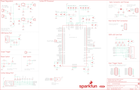

Contents
========

* [PRS18159 > Sparkfun](#prs18159--sparkfun)
	* [Images](#images)
	* [Tags](#tags)
  
![][im]
# PRS18159 > Sparkfun

- ID: PROJ-SPAR-18159-STAN-01
- Hex ID: PRS18159
- Name: Sparkfun
- Description: Sparkfun

## Images
  
  

|kicadPcb3d|kicadPcb3dFront|kicadPcb3dBack|eagleImage|eagleSchemImage|
| :---: | :---: | :---: | :---: | :---: |
||||||

## Tags

- hexID: PRS18159
- oompType: PROJ
- oompSize: SPAR
- oompColor: 18159
- oompDesc: STAN
- oompIndex: 01
- oompName: SparkFun Tsunami Super WAV Trigger Qwiic
- sources: All source files from https://github.com/sparkfun/SparkFun_Tsunami_Super_WAV_Trigger_Qwiic (source licence details in srcLicense.md)
- linkBuyPage: https://www.sparkfun.com/products/18159
- oompID: PROJ-SPAR-18159-STAN-01

[im]: kicadPcb3d_450.png
