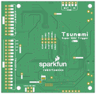

Contents
========

* [PRS18159 > SparkFun Tsunami Super WAV Trigger Qwiic](#prs18159--sparkfun-tsunami-super-wav-trigger-qwiic)
	* [Schematic](#schematic)
	* [PCB](#pcb)
	* [Interactive BOM](#interactive-bom)
	* [OOMP Parts](#oomp-parts)
	* [Images](#images)
	* [Tags](#tags)
  
![][im]
# PRS18159 > SparkFun Tsunami Super WAV Trigger Qwiic

- ID: PROJ-SPAR-18159-STAN-01
- Hex ID: PRS18159
- Name: Sparkfun
- Description: Sparkfun
- Long Link: [http://oom.lt/PROJ-SPAR-18159-STAN-01](http://oom.lt/PROJ-SPAR-18159-STAN-01)
- Short Link: [http://oom.lt/PRS18159](http://oom.lt/PRS18159)

## Schematic
  

## PCB
  

## Interactive BOM

- Interactive BOM page: [ibom.html](https://htmlpreview.github.io/?https://github.com/oomlout/oomlout_OOMP_projects/blob/main/PROJ-SPAR-18159-STAN-01/kicad/bom/ibom.html)

## OOMP Parts
  

|OOMP ID|Name|Identifier|
| :---: | :---: | :---: |
|[HEAD-JSTSH-X-PI04-RS](https://github.com/oomlout/oomlout_OOMP_parts/tree/main/HEAD-JSTSH-X-PI04-RS/)|[JST XH (1 mm) 4 Pin Header Right Angle (SMD)](https://github.com/oomlout/oomlout_OOMP_parts/tree/main/HEAD-JSTSH-X-PI04-RS/)|[3V3_QWIIC, J4, LOGO3](https://github.com/oomlout/oomlout_OOMP_parts/tree/main/HEAD-JSTSH-X-PI04-RS/)|
|[CAPC-0402-X-NF10-V50](https://github.com/oomlout/oomlout_OOMP_parts/tree/main/CAPC-0402-X-NF10-V50/)|[SMD (0402) 10 nF Capacitor (Ceramic) 50v](https://github.com/oomlout/oomlout_OOMP_parts/tree/main/CAPC-0402-X-NF10-V50/)|[C1](https://github.com/oomlout/oomlout_OOMP_parts/tree/main/CAPC-0402-X-NF10-V50/)|
|[CAPC-0402-X-UF10-V63D](https://github.com/oomlout/oomlout_OOMP_parts/tree/main/CAPC-0402-X-UF10-V63D/)|[SMD (0402) 10 uF Capacitor (Ceramic) 6.3v](https://github.com/oomlout/oomlout_OOMP_parts/tree/main/CAPC-0402-X-UF10-V63D/)|[C2, C5, C6, C11, C27](https://github.com/oomlout/oomlout_OOMP_parts/tree/main/CAPC-0402-X-UF10-V63D/)|
|[CAPC-0402-X-NF100-V10](https://github.com/oomlout/oomlout_OOMP_parts/tree/main/CAPC-0402-X-NF100-V10/)|[SMD (0402) 100 nF Capacitor (Ceramic) 10v](https://github.com/oomlout/oomlout_OOMP_parts/tree/main/CAPC-0402-X-NF100-V10/)|[C3, C4, C8, C10, C12, C13, C15, C16, C17, C18, C19, C21, C22, C23, C24, C26, C28, C29, C31, C36, C37, C47, C48, C49, C50, C51, C52, C53, C54, C55, C56, C57, C59, C73, C74, C75, C76, C77, C78, C79, C80](https://github.com/oomlout/oomlout_OOMP_parts/tree/main/CAPC-0402-X-NF100-V10/)|
|[CAPC-0402-X-PF12-V50](https://github.com/oomlout/oomlout_OOMP_parts/tree/main/CAPC-0402-X-PF12-V50/)|[SMD (0402) 12 pF Capacitor (Ceramic) 50v](https://github.com/oomlout/oomlout_OOMP_parts/tree/main/CAPC-0402-X-PF12-V50/)|[C7, C9](https://github.com/oomlout/oomlout_OOMP_parts/tree/main/CAPC-0402-X-PF12-V50/)|
|[CAPC-0402-X-UF47D-V63D](https://github.com/oomlout/oomlout_OOMP_parts/tree/main/CAPC-0402-X-UF47D-V63D/)|[SMD (0402) 4.7 uF Capacitor (Ceramic) 6.3v](https://github.com/oomlout/oomlout_OOMP_parts/tree/main/CAPC-0402-X-UF47D-V63D/)|[C14](https://github.com/oomlout/oomlout_OOMP_parts/tree/main/CAPC-0402-X-UF47D-V63D/)|
|[CAPC-0603-X-PF10-V50](https://github.com/oomlout/oomlout_OOMP_parts/tree/main/CAPC-0603-X-PF10-V50/)|[SMD (0603) 10 pF Capacitor (Ceramic) 50v](https://github.com/oomlout/oomlout_OOMP_parts/tree/main/CAPC-0603-X-PF10-V50/)|[C20](https://github.com/oomlout/oomlout_OOMP_parts/tree/main/CAPC-0603-X-PF10-V50/)|
|[CAPC-0603-X-UF22D-V10](https://github.com/oomlout/oomlout_OOMP_parts/tree/main/CAPC-0603-X-UF22D-V10/)|[SMD (0603) 2.2 uF Capacitor (Ceramic) 10v](https://github.com/oomlout/oomlout_OOMP_parts/tree/main/CAPC-0603-X-UF22D-V10/)|[C25](https://github.com/oomlout/oomlout_OOMP_parts/tree/main/CAPC-0603-X-UF22D-V10/)|
|CAPC-0402-X-UNMATCHED-01||C30, C32, C38, C58, C60, C62, C63, C66, C69, C70, C71, C72|
|[CAPC-0402-X-PF100-V50](https://github.com/oomlout/oomlout_OOMP_parts/tree/main/CAPC-0402-X-PF100-V50/)|[SMD (0402) 100 pF Capacitor (Ceramic) 50v](https://github.com/oomlout/oomlout_OOMP_parts/tree/main/CAPC-0402-X-PF100-V50/)|[C33, C61, C67, C68](https://github.com/oomlout/oomlout_OOMP_parts/tree/main/CAPC-0402-X-PF100-V50/)|
|CAPC-0603-X-PF56D-01||C34|
|CAPC-0603-X-NF390-01||C35|
|[CAPC-0805-X-UF22-V63D](https://github.com/oomlout/oomlout_OOMP_parts/tree/main/CAPC-0805-X-UF22-V63D/)|[SMD (0805) 22 uF Capacitor (Ceramic) 6.3v](https://github.com/oomlout/oomlout_OOMP_parts/tree/main/CAPC-0805-X-UF22-V63D/)|[C39, C40, C41, C42, C43, C44, C45, C46](https://github.com/oomlout/oomlout_OOMP_parts/tree/main/CAPC-0805-X-UF22-V63D/)|
|DIOD-UNMATCHED-X-UNMATCHED-01||D1, D3|
|LEDS-UNMATCHED-RGB-STAN-01||D4|
|FERB-0603-X-UNMATCHED-01||FB1, FB2, FB3|
|FERB-0805-X-UNMATCHED-01||FB4, FB5|
|UNMATCHED-UNMATCHED-X-UNMATCHED-01||I2C, J9, J16, JP7, S1, S3, TP1, TP2, TP4, TP5, TP6, TP7, TP8, TP9, U1, U3, U4, U5, U6, U7, Y1|
|[HEAD-I01-X-PI02-01](https://github.com/oomlout/oomlout_OOMP_parts/tree/main/HEAD-I01-X-PI02-01/)|[2.54 mm 2 Pin Header](https://github.com/oomlout/oomlout_OOMP_parts/tree/main/HEAD-I01-X-PI02-01/)|[J1, J2](https://github.com/oomlout/oomlout_OOMP_parts/tree/main/HEAD-I01-X-PI02-01/)|
|HEAD-I01-X-PI01-01||J3, J6, J7, J8, J17|
|HEAD-I01-X-UNMATCHED-01||J10, J11, J13, J18|
|[HEAD-I01-X-PI2X10-01](https://github.com/oomlout/oomlout_OOMP_parts/tree/main/HEAD-I01-X-PI2X10-01/)|[2.54 mm 20 Pin (2x10) Header](https://github.com/oomlout/oomlout_OOMP_parts/tree/main/HEAD-I01-X-PI2X10-01/)|[J14](https://github.com/oomlout/oomlout_OOMP_parts/tree/main/HEAD-I01-X-PI2X10-01/)|
|[HEAD-I01-X-PI05-01](https://github.com/oomlout/oomlout_OOMP_parts/tree/main/HEAD-I01-X-PI05-01/)|[2.54 mm 5 Pin Header](https://github.com/oomlout/oomlout_OOMP_parts/tree/main/HEAD-I01-X-PI05-01/)|[J15](https://github.com/oomlout/oomlout_OOMP_parts/tree/main/HEAD-I01-X-PI05-01/)|
|UNMATCHED-0805-X-UNMATCHED-01||L1|
|MOSP-SO23-X-UNMATCHED-01||Q1|
|[RESE-0603-X-O330-01](https://github.com/oomlout/oomlout_OOMP_parts/tree/main/RESE-0603-X-O330-01/)|[SMD (0603) 33 Ohm Resistor](https://github.com/oomlout/oomlout_OOMP_parts/tree/main/RESE-0603-X-O330-01/)|[R1](https://github.com/oomlout/oomlout_OOMP_parts/tree/main/RESE-0603-X-O330-01/)|
|[RESE-0603-X-O105-01](https://github.com/oomlout/oomlout_OOMP_parts/tree/main/RESE-0603-X-O105-01/)|[SMD (0603) 1M Ohm Resistor](https://github.com/oomlout/oomlout_OOMP_parts/tree/main/RESE-0603-X-O105-01/)|[R2](https://github.com/oomlout/oomlout_OOMP_parts/tree/main/RESE-0603-X-O105-01/)|
|[RESE-0402-X-O103-01](https://github.com/oomlout/oomlout_OOMP_parts/tree/main/RESE-0402-X-O103-01/)|[SMD (0402) 10k Ohm Resistor](https://github.com/oomlout/oomlout_OOMP_parts/tree/main/RESE-0402-X-O103-01/)|[R3, R4, R18, R23](https://github.com/oomlout/oomlout_OOMP_parts/tree/main/RESE-0402-X-O103-01/)|
|RESE-0402-X-UNMATCHED-01||R5, R25, R26, R27, R28, R37, R38, R39, R40, R41, R42, R43, R44, R56, R57, R58, R65|
|RESE-0402-X-O1003-01||R6, R9, R10, R19, R20, R21, R22|
|[RESE-0603-X-O391-01](https://github.com/oomlout/oomlout_OOMP_parts/tree/main/RESE-0603-X-O391-01/)|[SMD (0603) 390 Ohm Resistor](https://github.com/oomlout/oomlout_OOMP_parts/tree/main/RESE-0603-X-O391-01/)|[R7, R8](https://github.com/oomlout/oomlout_OOMP_parts/tree/main/RESE-0603-X-O391-01/)|
|[RESE-0603-X-O241-01](https://github.com/oomlout/oomlout_OOMP_parts/tree/main/RESE-0603-X-O241-01/)|[SMD (0603) 240 Ohm Resistor](https://github.com/oomlout/oomlout_OOMP_parts/tree/main/RESE-0603-X-O241-01/)|[R11, R12](https://github.com/oomlout/oomlout_OOMP_parts/tree/main/RESE-0603-X-O241-01/)|
|[RESE-0402-X-O333-01](https://github.com/oomlout/oomlout_OOMP_parts/tree/main/RESE-0402-X-O333-01/)|[SMD (0402) 33k Ohm Resistor](https://github.com/oomlout/oomlout_OOMP_parts/tree/main/RESE-0402-X-O333-01/)|[R14, R15, R59, R60, R61, R62, R63, R64](https://github.com/oomlout/oomlout_OOMP_parts/tree/main/RESE-0402-X-O333-01/)|
|RESE-0603-X-UNMATCHED-01||R16, R17|
|[RESE-0603-X-O221-01](https://github.com/oomlout/oomlout_OOMP_parts/tree/main/RESE-0603-X-O221-01/)|[SMD (0603) 220 Ohm Resistor](https://github.com/oomlout/oomlout_OOMP_parts/tree/main/RESE-0603-X-O221-01/)|[R45, R46, R47, R48, R55](https://github.com/oomlout/oomlout_OOMP_parts/tree/main/RESE-0603-X-O221-01/)|
|[RESE-0402-X-O472-01](https://github.com/oomlout/oomlout_OOMP_parts/tree/main/RESE-0402-X-O472-01/)|[SMD (0402) 4.7k Ohm Resistor](https://github.com/oomlout/oomlout_OOMP_parts/tree/main/RESE-0402-X-O472-01/)|[R49, R50](https://github.com/oomlout/oomlout_OOMP_parts/tree/main/RESE-0402-X-O472-01/)|
|[RESE-0402-X-O222-01](https://github.com/oomlout/oomlout_OOMP_parts/tree/main/RESE-0402-X-O222-01/)|[SMD (0402) 2.2k Ohm Resistor](https://github.com/oomlout/oomlout_OOMP_parts/tree/main/RESE-0402-X-O222-01/)|[R51, R52](https://github.com/oomlout/oomlout_OOMP_parts/tree/main/RESE-0402-X-O222-01/)|
|[RESE-0603-X-O101-01](https://github.com/oomlout/oomlout_OOMP_parts/tree/main/RESE-0603-X-O101-01/)|[SMD (0603) 100 Ohm Resistor](https://github.com/oomlout/oomlout_OOMP_parts/tree/main/RESE-0603-X-O101-01/)|[R53, R54](https://github.com/oomlout/oomlout_OOMP_parts/tree/main/RESE-0603-X-O101-01/)|
|UNMATCHED-SO235-X-UNMATCHED-01||U8|

## Images
  
  

|bominteractivefront|bominteractiveback|kicadPcb3d|kicadPcb3dFront|kicadPcb3dBack|kicadSchem|eagleImage|eagleSchemImage|pcbdraw|pcbdrawback|
| :---: | :---: | :---: | :---: | :---: | :---: | :---: | :---: | :---: | :---: |
|||||||||||

## Tags

- hexID: PRS18159
- oompType: PROJ
- oompSize: SPAR
- oompColor: 18159
- oompDesc: STAN
- oompIndex: 01
- oompName: SparkFun Tsunami Super WAV Trigger Qwiic
- sources: All source files from https://github.com/sparkfun/SparkFun_Tsunami_Super_WAV_Trigger_Qwiic (source licence details in srcLicense.md)
- linkBuyPage: https://www.sparkfun.com/products/18159
- oompID: PROJ-SPAR-18159-STAN-01
- oompParts: 3V3_QWIIC,HEAD-JSTSH-X-PI04-RS
- oompParts: C1,CAPC-0402-X-NF10-V50
- oompParts: C2,CAPC-0402-X-UF10-V63D
- oompParts: C3,CAPC-0402-X-NF100-V10
- oompParts: C4,CAPC-0402-X-NF100-V10
- oompParts: C5,CAPC-0402-X-UF10-V63D
- oompParts: C6,CAPC-0402-X-UF10-V63D
- oompParts: C7,CAPC-0402-X-PF12-V50
- oompParts: C8,CAPC-0402-X-NF100-V10
- oompParts: C9,CAPC-0402-X-PF12-V50
- oompParts: C10,CAPC-0402-X-NF100-V10
- oompParts: C11,CAPC-0402-X-UF10-V63D
- oompParts: C12,CAPC-0402-X-NF100-V10
- oompParts: C13,CAPC-0402-X-NF100-V10
- oompParts: C14,CAPC-0402-X-UF47D-V63D
- oompParts: C15,CAPC-0402-X-NF100-V10
- oompParts: C16,CAPC-0402-X-NF100-V10
- oompParts: C17,CAPC-0402-X-NF100-V10
- oompParts: C18,CAPC-0402-X-NF100-V10
- oompParts: C19,CAPC-0402-X-NF100-V10
- oompParts: C20,CAPC-0603-X-PF10-V50
- oompParts: C21,CAPC-0402-X-NF100-V10
- oompParts: C22,CAPC-0402-X-NF100-V10
- oompParts: C23,CAPC-0402-X-NF100-V10
- oompParts: C24,CAPC-0402-X-NF100-V10
- oompParts: C25,CAPC-0603-X-UF22D-V10
- oompParts: C26,CAPC-0402-X-NF100-V10
- oompParts: C27,CAPC-0402-X-UF10-V63D
- oompParts: C28,CAPC-0402-X-NF100-V10
- oompParts: C29,CAPC-0402-X-NF100-V10
- oompParts: C30,CAPC-0402-X-UNMATCHED-01
- oompParts: C31,CAPC-0402-X-NF100-V10
- oompParts: C32,CAPC-0402-X-UNMATCHED-01
- oompParts: C33,CAPC-0402-X-PF100-V50
- oompParts: C34,CAPC-0603-X-PF56D-01
- oompParts: C35,CAPC-0603-X-NF390-01
- oompParts: C36,CAPC-0402-X-NF100-V10
- oompParts: C37,CAPC-0402-X-NF100-V10
- oompParts: C38,CAPC-0402-X-UNMATCHED-01
- oompParts: C39,CAPC-0805-X-UF22-V63D
- oompParts: C40,CAPC-0805-X-UF22-V63D
- oompParts: C41,CAPC-0805-X-UF22-V63D
- oompParts: C42,CAPC-0805-X-UF22-V63D
- oompParts: C43,CAPC-0805-X-UF22-V63D
- oompParts: C44,CAPC-0805-X-UF22-V63D
- oompParts: C45,CAPC-0805-X-UF22-V63D
- oompParts: C46,CAPC-0805-X-UF22-V63D
- oompParts: C47,CAPC-0402-X-NF100-V10
- oompParts: C48,CAPC-0402-X-NF100-V10
- oompParts: C49,CAPC-0402-X-NF100-V10
- oompParts: C50,CAPC-0402-X-NF100-V10
- oompParts: C51,CAPC-0402-X-NF100-V10
- oompParts: C52,CAPC-0402-X-NF100-V10
- oompParts: C53,CAPC-0402-X-NF100-V10
- oompParts: C54,CAPC-0402-X-NF100-V10
- oompParts: C55,CAPC-0402-X-NF100-V10
- oompParts: C56,CAPC-0402-X-NF100-V10
- oompParts: C57,CAPC-0402-X-NF100-V10
- oompParts: C58,CAPC-0402-X-UNMATCHED-01
- oompParts: C59,CAPC-0402-X-NF100-V10
- oompParts: C60,CAPC-0402-X-UNMATCHED-01
- oompParts: C61,CAPC-0402-X-PF100-V50
- oompParts: C62,CAPC-0402-X-UNMATCHED-01
- oompParts: C63,CAPC-0402-X-UNMATCHED-01
- oompParts: C66,CAPC-0402-X-UNMATCHED-01
- oompParts: C67,CAPC-0402-X-PF100-V50
- oompParts: C68,CAPC-0402-X-PF100-V50
- oompParts: C69,CAPC-0402-X-UNMATCHED-01
- oompParts: C70,CAPC-0402-X-UNMATCHED-01
- oompParts: C71,CAPC-0402-X-UNMATCHED-01
- oompParts: C72,CAPC-0402-X-UNMATCHED-01
- oompParts: C73,CAPC-0402-X-NF100-V10
- oompParts: C74,CAPC-0402-X-NF100-V10
- oompParts: C75,CAPC-0402-X-NF100-V10
- oompParts: C76,CAPC-0402-X-NF100-V10
- oompParts: C77,CAPC-0402-X-NF100-V10
- oompParts: C78,CAPC-0402-X-NF100-V10
- oompParts: C79,CAPC-0402-X-NF100-V10
- oompParts: C80,CAPC-0402-X-NF100-V10
- oompParts: D1,DIOD-UNMATCHED-X-UNMATCHED-01
- oompParts: D3,DIOD-UNMATCHED-X-UNMATCHED-01
- oompParts: D4,LEDS-UNMATCHED-RGB-STAN-01
- oompParts: FB1,FERB-0603-X-UNMATCHED-01
- oompParts: FB2,FERB-0603-X-UNMATCHED-01
- oompParts: FB3,FERB-0603-X-UNMATCHED-01
- oompParts: FB4,FERB-0805-X-UNMATCHED-01
- oompParts: FB5,FERB-0805-X-UNMATCHED-01
- oompParts: I2C,UNMATCHED-UNMATCHED-X-UNMATCHED-01
- oompParts: J1,HEAD-I01-X-PI02-01
- oompParts: J2,HEAD-I01-X-PI02-01
- oompParts: J3,HEAD-I01-X-PI01-01
- oompParts: J4,HEAD-JSTSH-X-PI04-RS
- oompParts: J6,HEAD-I01-X-PI01-01
- oompParts: J7,HEAD-I01-X-PI01-01
- oompParts: J8,HEAD-I01-X-PI01-01
- oompParts: J9,UNMATCHED-UNMATCHED-X-UNMATCHED-01
- oompParts: J10,HEAD-I01-X-UNMATCHED-01
- oompParts: J11,HEAD-I01-X-UNMATCHED-01
- oompParts: J13,HEAD-I01-X-UNMATCHED-01
- oompParts: J14,HEAD-I01-X-PI2X10-01
- oompParts: J15,HEAD-I01-X-PI05-01
- oompParts: J16,UNMATCHED-UNMATCHED-X-UNMATCHED-01
- oompParts: J17,HEAD-I01-X-PI01-01
- oompParts: J18,HEAD-I01-X-UNMATCHED-01
- oompParts: JP7,UNMATCHED-UNMATCHED-X-UNMATCHED-01
- oompParts: L1,UNMATCHED-0805-X-UNMATCHED-01
- oompParts: LOGO3,HEAD-JSTSH-X-PI04-RS
- oompParts: Q1,MOSP-SO23-X-UNMATCHED-01
- oompParts: R1,RESE-0603-X-O330-01
- oompParts: R2,RESE-0603-X-O105-01
- oompParts: R3,RESE-0402-X-O103-01
- oompParts: R4,RESE-0402-X-O103-01
- oompParts: R5,RESE-0402-X-UNMATCHED-01
- oompParts: R6,RESE-0402-X-O1003-01
- oompParts: R7,RESE-0603-X-O391-01
- oompParts: R8,RESE-0603-X-O391-01
- oompParts: R9,RESE-0402-X-O1003-01
- oompParts: R10,RESE-0402-X-O1003-01
- oompParts: R11,RESE-0603-X-O241-01
- oompParts: R12,RESE-0603-X-O241-01
- oompParts: R14,RESE-0402-X-O333-01
- oompParts: R15,RESE-0402-X-O333-01
- oompParts: R16,RESE-0603-X-UNMATCHED-01
- oompParts: R17,RESE-0603-X-UNMATCHED-01
- oompParts: R18,RESE-0402-X-O103-01
- oompParts: R19,RESE-0402-X-O1003-01
- oompParts: R20,RESE-0402-X-O1003-01
- oompParts: R21,RESE-0402-X-O1003-01
- oompParts: R22,RESE-0402-X-O1003-01
- oompParts: R23,RESE-0402-X-O103-01
- oompParts: R25,RESE-0402-X-UNMATCHED-01
- oompParts: R26,RESE-0402-X-UNMATCHED-01
- oompParts: R27,RESE-0402-X-UNMATCHED-01
- oompParts: R28,RESE-0402-X-UNMATCHED-01
- oompParts: R37,RESE-0402-X-UNMATCHED-01
- oompParts: R38,RESE-0402-X-UNMATCHED-01
- oompParts: R39,RESE-0402-X-UNMATCHED-01
- oompParts: R40,RESE-0402-X-UNMATCHED-01
- oompParts: R41,RESE-0402-X-UNMATCHED-01
- oompParts: R42,RESE-0402-X-UNMATCHED-01
- oompParts: R43,RESE-0402-X-UNMATCHED-01
- oompParts: R44,RESE-0402-X-UNMATCHED-01
- oompParts: R45,RESE-0603-X-O221-01
- oompParts: R46,RESE-0603-X-O221-01
- oompParts: R47,RESE-0603-X-O221-01
- oompParts: R48,RESE-0603-X-O221-01
- oompParts: R49,RESE-0402-X-O472-01
- oompParts: R50,RESE-0402-X-O472-01
- oompParts: R51,RESE-0402-X-O222-01
- oompParts: R52,RESE-0402-X-O222-01
- oompParts: R53,RESE-0603-X-O101-01
- oompParts: R54,RESE-0603-X-O101-01
- oompParts: R55,RESE-0603-X-O221-01
- oompParts: R56,RESE-0402-X-UNMATCHED-01
- oompParts: R57,RESE-0402-X-UNMATCHED-01
- oompParts: R58,RESE-0402-X-UNMATCHED-01
- oompParts: R59,RESE-0402-X-O333-01
- oompParts: R60,RESE-0402-X-O333-01
- oompParts: R61,RESE-0402-X-O333-01
- oompParts: R62,RESE-0402-X-O333-01
- oompParts: R63,RESE-0402-X-O333-01
- oompParts: R64,RESE-0402-X-O333-01
- oompParts: R65,RESE-0402-X-UNMATCHED-01
- oompParts: S1,UNMATCHED-UNMATCHED-X-UNMATCHED-01
- oompParts: S3,UNMATCHED-UNMATCHED-X-UNMATCHED-01
- oompParts: TP1,UNMATCHED-UNMATCHED-X-UNMATCHED-01
- oompParts: TP2,UNMATCHED-UNMATCHED-X-UNMATCHED-01
- oompParts: TP4,UNMATCHED-UNMATCHED-X-UNMATCHED-01
- oompParts: TP5,UNMATCHED-UNMATCHED-X-UNMATCHED-01
- oompParts: TP6,UNMATCHED-UNMATCHED-X-UNMATCHED-01
- oompParts: TP7,UNMATCHED-UNMATCHED-X-UNMATCHED-01
- oompParts: TP8,UNMATCHED-UNMATCHED-X-UNMATCHED-01
- oompParts: TP9,UNMATCHED-UNMATCHED-X-UNMATCHED-01
- oompParts: U1,UNMATCHED-UNMATCHED-X-UNMATCHED-01
- oompParts: U3,UNMATCHED-UNMATCHED-X-UNMATCHED-01
- oompParts: U4,UNMATCHED-UNMATCHED-X-UNMATCHED-01
- oompParts: U5,UNMATCHED-UNMATCHED-X-UNMATCHED-01
- oompParts: U6,UNMATCHED-UNMATCHED-X-UNMATCHED-01
- oompParts: U7,UNMATCHED-UNMATCHED-X-UNMATCHED-01
- oompParts: U8,UNMATCHED-SO235-X-UNMATCHED-01
- oompParts: Y1,UNMATCHED-UNMATCHED-X-UNMATCHED-01
- rawParts: 3V3_QWIIC,,JUMPER-SMT_2_NO_SILK,SMT-JUMPER_2_NO_SILK,Normally open jumper,,,,,,,,,
- rawParts: C1,10nF,10NF-0402T-25V-10%,0402-TIGHT,0.01uF/10nF/10,000pF ceramic capacitors,,,,,CAP-14847,,,10nF,
- rawParts: C2,10uF,10UF-0402T-6.3V-20%,0402-TIGHT,10.0µF ceramic capacitors,,,,,CAP-14848,,,10uF,
- rawParts: C3,0.1uF,0.1UF-0402T-16V-10%,0402-TIGHT,0.1µF ceramic capacitors,,,,,CAP-12416,,,0.1uF,
- rawParts: C4,0.1uF,0.1UF-0402T-16V-10%,0402-TIGHT,0.1µF ceramic capacitors,,,,,CAP-12416,,,0.1uF,
- rawParts: C5,10uF,10UF-0402T-6.3V-20%,0402-TIGHT,10.0µF ceramic capacitors,,,,,CAP-14848,,,10uF,
- rawParts: C6,10uF,10UF-0402T-6.3V-20%,0402-TIGHT,10.0µF ceramic capacitors,,,,,CAP-14848,,,10uF,
- rawParts: C7,12pF,12PF-0402T-50V-5%,0402-TIGHT,12pF ceramic capacitors,,,,,CAP-14665,,,12pF,
- rawParts: C8,0.1uF,0.1UF-0402T-16V-10%,0402-TIGHT,0.1µF ceramic capacitors,,,,,CAP-12416,,,0.1uF,
- rawParts: C9,12pF,12PF-0402T-50V-5%,0402-TIGHT,12pF ceramic capacitors,,,,,CAP-14665,,,12pF,
- rawParts: C10,0.1uF,0.1UF-0402T-16V-10%,0402-TIGHT,0.1µF ceramic capacitors,,,,,CAP-12416,,,0.1uF,
- rawParts: C11,10uF,10UF-0402T-6.3V-20%,0402-TIGHT,10.0µF ceramic capacitors,,,,,CAP-14848,,,10uF,
- rawParts: C12,0.1uF,0.1UF-0402T-16V-10%,0402-TIGHT,0.1µF ceramic capacitors,,,,,CAP-12416,,,0.1uF,
- rawParts: C13,0.1uF,0.1UF-0402T-16V-10%,0402-TIGHT,0.1µF ceramic capacitors,,,,,CAP-12416,,,0.1uF,
- rawParts: C14,4.7uF,4.7UF-0402_TIGHT-6.3V-20%-X5R,0402-TIGHT,4.7µF ceramic capacitors,,,,,CAP-14240,,,4.7uF,
- rawParts: C15,0.1uF,0.1UF-0402T-16V-10%,0402-TIGHT,0.1µF ceramic capacitors,,,,,CAP-12416,,,0.1uF,
- rawParts: C16,0.1uF,0.1UF-0402T-16V-10%,0402-TIGHT,0.1µF ceramic capacitors,,,,,CAP-12416,,,0.1uF,
- rawParts: C17,0.1uF,0.1UF-0402T-16V-10%,0402-TIGHT,0.1µF ceramic capacitors,,,,,CAP-12416,,,0.1uF,
- rawParts: C18,0.1uF,0.1UF-0402T-16V-10%,0402-TIGHT,0.1µF ceramic capacitors,,,,,CAP-12416,,,0.1uF,
- rawParts: C19,0.1uF,0.1UF-0402T-16V-10%,0402-TIGHT,0.1µF ceramic capacitors,,,,,CAP-12416,,,0.1uF,
- rawParts: C20,10pF,10PF-0603-50V-5%,0603,10pF ceramic capacitors,,,,,CAP-11812,,,10pF,
- rawParts: C21,0.1uF,0.1UF-0402T-16V-10%,0402-TIGHT,0.1µF ceramic capacitors,,,,,CAP-12416,,,0.1uF,
- rawParts: C22,0.1uF,0.1UF-0402T-16V-10%,0402-TIGHT,0.1µF ceramic capacitors,,,,,CAP-12416,,,0.1uF,
- rawParts: C23,0.1uF,0.1UF-0402T-16V-10%,0402-TIGHT,0.1µF ceramic capacitors,,,,,CAP-12416,,,0.1uF,
- rawParts: C24,0.1uF,0.1UF-0402T-16V-10%,0402-TIGHT,0.1µF ceramic capacitors,,,,,CAP-12416,,,0.1uF,
- rawParts: C25,2.2uF,2.2UF-0603-10V-20%,0603,2.2µF ceramic capacitors,,,,,CAP-07888,,,2.2uF,
- rawParts: C26,0.1uF,0.1UF-0402T-16V-10%,0402-TIGHT,0.1µF ceramic capacitors,,,,,CAP-12416,,,0.1uF,
- rawParts: C27,10uF,10UF-0402T-6.3V-20%,0402-TIGHT,10.0µF ceramic capacitors,,,,,CAP-14848,,,10uF,
- rawParts: C28,0.1uF,0.1UF-0402T-16V-10%,0402-TIGHT,0.1µF ceramic capacitors,,,,,CAP-12416,,,0.1uF,
- rawParts: C29,0.1uF,0.1UF-0402T-16V-10%,0402-TIGHT,0.1µF ceramic capacitors,,,,,CAP-12416,,,0.1uF,
- rawParts: C30,1.0uF,1.0UF-0402T-16V-10%,0402-TIGHT,1µF ceramic capacitors,,,,,CAP-12417,,,1.0uF,
- rawParts: C31,0.1uF,0.1UF-0402T-16V-10%,0402-TIGHT,0.1µF ceramic capacitors,,,,,CAP-12416,,,0.1uF,
- rawParts: C32,1.0uF,1.0UF-0402T-16V-10%,0402-TIGHT,1µF ceramic capacitors,,,,,CAP-12417,,,1.0uF,
- rawParts: C33,100pF,100PF-0402T-50V-5%,0402-TIGHT,100pF/0.1nF ceramic capacitors,,,,,CAP-13458,,,100pF,
- rawParts: C34,5.6nF,5.6NF/5600PF_0603_50V_5%,0603,5.6nF/5600pF ceramic capacitors,,,,,CAP-16058,,,5.6nF,
- rawParts: C35,390nF,390NF-0603-10V-10%,0603,0.39uF/390nF ceramic capacitors,,,,,CAP-10986,,,390nF,
- rawParts: C36,0.1uF,0.1UF-0402T-16V-10%,0402-TIGHT,0.1µF ceramic capacitors,,,,,CAP-12416,,,0.1uF,
- rawParts: C37,0.1uF,0.1UF-0402T-16V-10%,0402-TIGHT,0.1µF ceramic capacitors,,,,,CAP-12416,,,0.1uF,
- rawParts: C38,1.0uF,1.0UF-0402T-16V-10%,0402-TIGHT,1µF ceramic capacitors,,,,,CAP-12417,,,1.0uF,
- rawParts: C39,22uF,22UF-0805-16V-20%,0805,22µF ceramic capacitors,,,,,CAP-14260,,,22uF,
- rawParts: C40,22uF,22UF-0805-16V-20%,0805,22µF ceramic capacitors,,,,,CAP-14260,,,22uF,
- rawParts: C41,22uF,22UF-0805-16V-20%,0805,22µF ceramic capacitors,,,,,CAP-14260,,,22uF,
- rawParts: C42,22uF,22UF-0805-16V-20%,0805,22µF ceramic capacitors,,,,,CAP-14260,,,22uF,
- rawParts: C43,22uF,22UF-0805-16V-20%,0805,22µF ceramic capacitors,,,,,CAP-14260,,,22uF,
- rawParts: C44,22uF,22UF-0805-16V-20%,0805,22µF ceramic capacitors,,,,,CAP-14260,,,22uF,
- rawParts: C45,22uF,22UF-0805-16V-20%,0805,22µF ceramic capacitors,,,,,CAP-14260,,,22uF,
- rawParts: C46,22uF,22UF-0805-16V-20%,0805,22µF ceramic capacitors,,,,,CAP-14260,,,22uF,
- rawParts: C47,0.1uF,0.1UF-0402T-16V-10%,0402-TIGHT,0.1µF ceramic capacitors,,,,,CAP-12416,,,0.1uF,
- rawParts: C48,0.1uF,0.1UF-0402T-16V-10%,0402-TIGHT,0.1µF ceramic capacitors,,,,,CAP-12416,,,0.1uF,
- rawParts: C49,0.1uF,0.1UF-0402T-16V-10%,0402-TIGHT,0.1µF ceramic capacitors,,,,,CAP-12416,,,0.1uF,
- rawParts: C50,0.1uF,0.1UF-0402T-16V-10%,0402-TIGHT,0.1µF ceramic capacitors,,,,,CAP-12416,,,0.1uF,
- rawParts: C51,0.1uF,0.1UF-0402T-16V-10%,0402-TIGHT,0.1µF ceramic capacitors,,,,,CAP-12416,,,0.1uF,
- rawParts: C52,0.1uF,0.1UF-0402T-16V-10%,0402-TIGHT,0.1µF ceramic capacitors,,,,,CAP-12416,,,0.1uF,
- rawParts: C53,0.1uF,0.1UF-0402T-16V-10%,0402-TIGHT,0.1µF ceramic capacitors,,,,,CAP-12416,,,0.1uF,
- rawParts: C54,0.1uF,0.1UF-0402T-16V-10%,0402-TIGHT,0.1µF ceramic capacitors,,,,,CAP-12416,,,0.1uF,
- rawParts: C55,0.1uF,0.1UF-0402T-16V-10%,0402-TIGHT,0.1µF ceramic capacitors,,,,,CAP-12416,,,0.1uF,
- rawParts: C56,0.1uF,0.1UF-0402T-16V-10%,0402-TIGHT,0.1µF ceramic capacitors,,,,,CAP-12416,,,0.1uF,
- rawParts: C57,0.1uF,0.1UF-0402T-16V-10%,0402-TIGHT,0.1µF ceramic capacitors,,,,,CAP-12416,,,0.1uF,
- rawParts: C58,1.0uF,1.0UF-0402T-16V-10%,0402-TIGHT,1µF ceramic capacitors,,,,,CAP-12417,,,1.0uF,
- rawParts: C59,0.1uF,0.1UF-0402T-16V-10%,0402-TIGHT,0.1µF ceramic capacitors,,,,,CAP-12416,,,0.1uF,
- rawParts: C60,1.0uF,1.0UF-0402T-16V-10%,0402-TIGHT,1µF ceramic capacitors,,,,,CAP-12417,,,1.0uF,
- rawParts: C61,100pF,100PF-0402T-50V-5%,0402-TIGHT,100pF/0.1nF ceramic capacitors,,,,,CAP-13458,,,100pF,
- rawParts: C62,1.0uF,1.0UF-0402T-16V-10%,0402-TIGHT,1µF ceramic capacitors,,,,,CAP-12417,,,1.0uF,
- rawParts: C63,1.0uF,1.0UF-0402T-16V-10%,0402-TIGHT,1µF ceramic capacitors,,,,,CAP-12417,,,1.0uF,
- rawParts: C66,1.0uF,1.0UF-0402T-16V-10%,0402-TIGHT,1µF ceramic capacitors,,,,,CAP-12417,,,1.0uF,
- rawParts: C67,100pF,100PF-0402T-50V-5%,0402-TIGHT,100pF/0.1nF ceramic capacitors,,,,,CAP-13458,,,100pF,
- rawParts: C68,100pF,100PF-0402T-50V-5%,0402-TIGHT,100pF/0.1nF ceramic capacitors,,,,,CAP-13458,,,100pF,
- rawParts: C69,1.0uF,1.0UF-0402T-16V-10%,0402-TIGHT,1µF ceramic capacitors,,,,,CAP-12417,,,1.0uF,
- rawParts: C70,1.0uF,1.0UF-0402T-16V-10%,0402-TIGHT,1µF ceramic capacitors,,,,,CAP-12417,,,1.0uF,
- rawParts: C71,1.0uF,1.0UF-0402T-16V-10%,0402-TIGHT,1µF ceramic capacitors,,,,,CAP-12417,,,1.0uF,
- rawParts: C72,1.0uF,1.0UF-0402T-16V-10%,0402-TIGHT,1µF ceramic capacitors,,,,,CAP-12417,,,1.0uF,
- rawParts: C73,0.1uF,0.1UF-0402T-16V-10%,0402-TIGHT,0.1µF ceramic capacitors,,,,,CAP-12416,,,0.1uF,
- rawParts: C74,0.1uF,0.1UF-0402T-16V-10%,0402-TIGHT,0.1µF ceramic capacitors,,,,,CAP-12416,,,0.1uF,
- rawParts: C75,0.1uF,0.1UF-0402T-16V-10%,0402-TIGHT,0.1µF ceramic capacitors,,,,,CAP-12416,,,0.1uF,
- rawParts: C76,0.1uF,0.1UF-0402T-16V-10%,0402-TIGHT,0.1µF ceramic capacitors,,,,,CAP-12416,,,0.1uF,
- rawParts: C77,0.1uF,0.1UF-0402T-16V-10%,0402-TIGHT,0.1µF ceramic capacitors,,,,,CAP-12416,,,0.1uF,
- rawParts: C78,0.1uF,0.1UF-0402T-16V-10%,0402-TIGHT,0.1µF ceramic capacitors,,,,,CAP-12416,,,0.1uF,
- rawParts: C79,0.1uF,0.1UF-0402T-16V-10%,0402-TIGHT,0.1µF ceramic capacitors,,,,,CAP-12416,,,0.1uF,
- rawParts: C80,0.1uF,0.1UF-0402T-16V-10%,0402-TIGHT,0.1µF ceramic capacitors,,,,,CAP-12416,,,0.1uF,
- rawParts: D1,1A/40V/500mV,DIODE-SCHOTTKY-SS14,SMA-DIODE,Schottky diode,,,,,DIO-08053,,,1A/40V/500mV,
- rawParts: D3,1A/40V/500mV,DIODE-SCHOTTKY-SS14,SMA-DIODE,Schottky diode,,,,,DIO-08053,,,1A/40V/500mV,
- rawParts: D4,RGB,LED-RGB-CAPLCC,P-LCC-4-3,LED-RGB Diffused Common Anode,,,,,DIO-12986,,,RGB,
- rawParts: FB1,470Ω,FERRITE_BEAD-0603-470Ω-100MHZ-1A-200MILIΩ,0603,Ferrite Bead (blocks, cores, rings, chokes, etc.),,,,,NDUC-12579,,,470Ω,
- rawParts: FB2,470Ω,FERRITE_BEAD-0603-470Ω-100MHZ-1A-200MILIΩ,0603,Ferrite Bead (blocks, cores, rings, chokes, etc.),,,,,NDUC-12579,,,470Ω,
- rawParts: FB3,470Ω,FERRITE_BEAD-0603-470Ω-100MHZ-1A-200MILIΩ,0603,Ferrite Bead (blocks, cores, rings, chokes, etc.),,,,,NDUC-12579,,,470Ω,
- rawParts: FB4,600Ω,FERRITE_BEAD-0805-600Ω-100MHZ,0805,Ferrite Bead (blocks, cores, rings, chokes, etc.),,,,,NDUC-14988,,,600Ω,
- rawParts: FB5,600Ω,FERRITE_BEAD-0805-600Ω-100MHZ,0805,Ferrite Bead (blocks, cores, rings, chokes, etc.),,,,,NDUC-14988,,,600Ω,
- rawParts: FD1,FIDUCIALUFIDUCIAL,FIDUCIALUFIDUCIAL,FIDUCIAL-MICRO,Fiducial Alignment Points,,,,,,,,,
- rawParts: FD2,FIDUCIALUFIDUCIAL,FIDUCIALUFIDUCIAL,FIDUCIAL-MICRO,Fiducial Alignment Points,,,,,,,,,
- rawParts: FD3,FIDUCIALUFIDUCIAL,FIDUCIALUFIDUCIAL,FIDUCIAL-MICRO,Fiducial Alignment Points,,,,,,,,,
- rawParts: FD4,FIDUCIALUFIDUCIAL,FIDUCIALUFIDUCIAL,FIDUCIAL-MICRO,Fiducial Alignment Points,,,,,,,,,
- rawParts: FRAME1,FRAME-LEDGER,FRAME-LEDGER,CREATIVE_COMMONS,Schematic Frame - Ledger,,,,,,,,,
- rawParts: FRAME2,FRAME-LEDGER,FRAME-LEDGER,CREATIVE_COMMONS,Schematic Frame - Ledger,,,,,,,,,
- rawParts: H1,STAND-OFF,STAND-OFF,STAND-OFF,Stand Off,,,,,,,,,
- rawParts: H2,STAND-OFF,STAND-OFF,STAND-OFF,Stand Off,,,,,,,,,
- rawParts: H3,STAND-OFF,STAND-OFF,STAND-OFF,Stand Off,,,,,,,,,
- rawParts: H4,STAND-OFF,STAND-OFF,STAND-OFF,Stand Off,,,,,,,,,
- rawParts: I2C,,JUMPER-SMT_3_2-NC_TRACE_SILK,SMT-JUMPER_3_2-NC_TRACE_SILK,Normally closed trace jumper (2 of 2 connections),,,,,,,,,
- rawParts: J1,VDC-IN,CONN_021X02_NO_SILK,1X02_NO_SILK,Multi connection point. Often used as Generic Header-pin footprint for 0.1 inch spaced/style header connections,,,,,,,,,
- rawParts: J2,GND-IN,CONN_021X02_NO_SILK,1X02_NO_SILK,Multi connection point. Often used as Generic Header-pin footprint for 0.1 inch spaced/style header connections,,,,,,,,,
- rawParts: J3,DEBUG,CONN_01PTH_NO_SILK_YES_STOP,1X01_NO_SILK,Single connection point. Often used as Generic Header-pin footprint for 0.1 inch spaced/style header connections,,,,,,,,,
- rawParts: J4,QWIIC,I2C_STANDARDQWIIC,JST04_1MM_RA,SparkFun I2C Standard Pinout Header,,,,,CONN-13694,,,Qwiic Right Angle,
- rawParts: J6,3.3VA,CONN_01PTH_NO_SILK_YES_STOP,1X01_NO_SILK,Single connection point. Often used as Generic Header-pin footprint for 0.1 inch spaced/style header connections,,,,,,,,,
- rawParts: J7,3.3V,CONN_01PTH_NO_SILK_YES_STOP,1X01_NO_SILK,Single connection point. Often used as Generic Header-pin footprint for 0.1 inch spaced/style header connections,,,,,,,,,
- rawParts: J8,PLAYING,CONN_01PTH_NO_SILK_YES_STOP,1X01_NO_SILK,Single connection point. Often used as Generic Header-pin footprint for 0.1 inch spaced/style header connections,,,,,,,,,
- rawParts: J9,CORTEX_JTAG_DEBUG_PTH_NS,CORTEX_JTAG_DEBUG_PTH_NS,2X5-PTH-1.27MM-NO_SILK,Cortex Debug Connector - 10 pin,,,,,,,,,
- rawParts: J10,TRIG2,CONN_08X2_NOSILK,2X8_NOSILK,Multi connection point. Often used as Generic Header-pin footprint for 0.1 inch spaced/style header connections,,,,,,,,,
- rawParts: J11,TRIG1,CONN_08X2_NOSILK,2X8_NOSILK,Multi connection point. Often used as Generic Header-pin footprint for 0.1 inch spaced/style header connections,,,,,,,,,
- rawParts: J13,,CONN_05X2NO_SILK,2X5_NOSILK,Multi connection point. Often used as Generic Header-pin footprint for 0.1 inch spaced/style header connections,,,,,,,,,
- rawParts: J14,AUDIO I/O,CONN_10X2NOSILK,2X10_NOSILK,Multi connection point. Often used as Generic Header-pin footprint for 0.1 inch spaced/style header connections,,,,,,,,,
- rawParts: J15,MIDI,CONN_05NO_SILK,1X05_NO_SILK,Multi connection point. Often used as Generic Header-pin footprint for 0.1 inch spaced/style header connections,,,,,,,,,
- rawParts: J16,USB-C,USB_C_4-LAYER-ISOLATED,USB-C-16P-4LAYER-ISOLATED,USB Type C 16Pin Connector,,,,,CONN-14122,,,USB Female Type C Connector,
- rawParts: J17,AGND,CONN_01PTH_NO_SILK_YES_STOP,1X01_NO_SILK,Single connection point. Often used as Generic Header-pin footprint for 0.1 inch spaced/style header connections,,,,,,,,,
- rawParts: J18,,6_PIN_SERIAL_TARGETSILK,6_PIN_SERIAL_TARGET_SIDE_W_SILK,6-pin header connection for use with the FTDI BASIC pinout - TARGET SIDE.,,,,,,,,,
- rawParts: JP7,USD-SOCKETNEW,USD-SOCKETNEW,MICRO-SD-SOCKET-PP,microSD Socket,,,,,CONN-07820,,,,
- rawParts: L1,10μH,10μH_SHIELDED_INDUCTOR0805,0805,Murata 10uH Inductor,,,,,NDUC-13231,,,10μH,
- rawParts: LOGO2,SFE_LOGO_NAME_FLAME.2_INCH,SFE_LOGO_NAME_FLAME.2_INCH,SFE_LOGO_NAME_FLAME_.2,SparkFun Font Logo w/ Flame,,,,,,,,,
- rawParts: LOGO3,QWIIC_LOGO_4MM,QWIIC_LOGO_4MM,QWIIC_4MM,Qwiic Logos for placement on schematic and PCB. The 5.5mm silk logo is best for placing next to Qwiic connector.,,,,,,,,,
- rawParts: Q1,3.1A/30V/105mΩ,MOSFET_PCH-DMG2307L,SOT23-3,P-channel MOSFETs,,,,,TRANS-11308,,,3.1A/30V/105mΩ,
- rawParts: R1,33,33OHM-0603-1/10W-1%,0603,33Ω resistor,,,,,RES-08270,,,33,
- rawParts: R2,1M,1MOHM-0603-1/4W-5%,0603,1MΩ resistor,,,,,RES-07868,,,1M,
- rawParts: R3,10k,10KOHM-0402T-1/16W-1%,0402-TIGHT,10kΩ resistor,,,,,RES-14241,,,10k,
- rawParts: R4,10k,10KOHM-0402T-1/16W-1%,0402-TIGHT,10kΩ resistor,,,,,RES-14241,,,10k,
- rawParts: R5,560Ω,560OHM_0402_TIGHT,0402-TIGHT,,,,,,RES-13766,,,560Ω,
- rawParts: R6,100k,100KOHM-0402T-1/16W-1%,0402-TIGHT,100kΩ resistor,,,,,RES-13495,,,100k,
- rawParts: R7,390,390OHM-0603-1/10W-1%,0603,390Ω resistor,,,,,RES-07864,,,390,
- rawParts: R8,390,390OHM-0603-1/10W-1%,0603,390Ω resistor,,,,,RES-07864,,,390,
- rawParts: R9,100k,100KOHM-0402T-1/16W-1%,0402-TIGHT,100kΩ resistor,,,,,RES-13495,,,100k,
- rawParts: R10,100k,100KOHM-0402T-1/16W-1%,0402-TIGHT,100kΩ resistor,,,,,RES-13495,,,100k,
- rawParts: R11,240,240OHM-0603-1/10W-1%,0603,240Ω resistor,,,,,RES-07849,,,240,
- rawParts: R12,240,240OHM-0603-1/10W-1%,0603,240Ω resistor,,,,,RES-07849,,,240,
- rawParts: R14,33k,33KOHM-0402T-1/16W-1%,0402-TIGHT,33kΩ resistor,,,,,RES-15128,,,33k,
- rawParts: R15,33k,33KOHM-0402T-1/16W-1%,0402-TIGHT,33kΩ resistor,,,,,RES-15128,,,33k,
- rawParts: R16,2.2,2.2OHM-0603-1/10W-5%,0603,2.2Ω resistor,,,,,RES-07823,,,2.2,
- rawParts: R17,5.62k,5.62KOHM-0603-1/10W-1%,0603,5.62kΩ resistor,,,,,RES-09823,,,5.62k,
- rawParts: R18,10k,10KOHM-0402T-1/16W-1%,0402-TIGHT,10kΩ resistor,,,,,RES-14241,,,10k,
- rawParts: R19,100k,100KOHM-0402T-1/16W-1%,0402-TIGHT,100kΩ resistor,,,,,RES-13495,,,100k,
- rawParts: R20,100k,100KOHM-0402T-1/16W-1%,0402-TIGHT,100kΩ resistor,,,,,RES-13495,,,100k,
- rawParts: R21,100k,100KOHM-0402T-1/16W-1%,0402-TIGHT,100kΩ resistor,,,,,RES-13495,,,100k,
- rawParts: R22,100k,100KOHM-0402T-1/16W-1%,0402-TIGHT,100kΩ resistor,,,,,RES-13495,,,100k,
- rawParts: R23,10k,10KOHM-0402T-1/16W-1%,0402-TIGHT,10kΩ resistor,,,,,RES-14241,,,10k,
- rawParts: R25,10Ω,10OHM-0402-1/16W-5%,0402-TIGHT,10Ω resistor,,,,,RES-16072,,,10Ω,
- rawParts: R26,10Ω,10OHM-0402-1/16W-5%,0402-TIGHT,10Ω resistor,,,,,RES-16072,,,10Ω,
- rawParts: R27,10Ω,10OHM-0402-1/16W-5%,0402-TIGHT,10Ω resistor,,,,,RES-16072,,,10Ω,
- rawParts: R28,10Ω,10OHM-0402-1/16W-5%,0402-TIGHT,10Ω resistor,,,,,RES-16072,,,10Ω,
- rawParts: R37,10Ω,10OHM-0402-1/16W-5%,0402-TIGHT,10Ω resistor,,,,,RES-16072,,,10Ω,
- rawParts: R38,10Ω,10OHM-0402-1/16W-5%,0402-TIGHT,10Ω resistor,,,,,RES-16072,,,10Ω,
- rawParts: R39,10Ω,10OHM-0402-1/16W-5%,0402-TIGHT,10Ω resistor,,,,,RES-16072,,,10Ω,
- rawParts: R40,10Ω,10OHM-0402-1/16W-5%,0402-TIGHT,10Ω resistor,,,,,RES-16072,,,10Ω,
- rawParts: R41,10Ω,10OHM-0402-1/16W-5%,0402-TIGHT,10Ω resistor,,,,,RES-16072,,,10Ω,
- rawParts: R42,10Ω,10OHM-0402-1/16W-5%,0402-TIGHT,10Ω resistor,,,,,RES-16072,,,10Ω,
- rawParts: R43,10Ω,10OHM-0402-1/16W-5%,0402-TIGHT,10Ω resistor,,,,,RES-16072,,,10Ω,
- rawParts: R44,10Ω,10OHM-0402-1/16W-5%,0402-TIGHT,10Ω resistor,,,,,RES-16072,,,10Ω,
- rawParts: R45,220,220OHM-0603-1/10W-1%,0603,220Ω resistor,,,,,RES-07861,,,220,
- rawParts: R46,220,220OHM-0603-1/10W-1%,0603,220Ω resistor,,,,,RES-07861,,,220,
- rawParts: R47,220,220OHM-0603-1/10W-1%,0603,220Ω resistor,,,,,RES-07861,,,220,
- rawParts: R48,220,220OHM-0603-1/10W-1%,0603,220Ω resistor,,,,,RES-07861,,,220,
- rawParts: R49,5.1k,5.1KOHM-0402T-1/16W-1%,0402-TIGHT,,,,,,RES-14340,,,5.1k,
- rawParts: R50,5.1k,5.1KOHM-0402T-1/16W-1%,0402-TIGHT,,,,,,RES-14340,,,5.1k,
- rawParts: R51,2.2k,2.2KOHM-0402T-1/16W-1%,0402-TIGHT,2.2kΩ resistor,,,,,RES-14341,,,2.2k,
- rawParts: R52,2.2k,2.2KOHM-0402T-1/16W-1%,0402-TIGHT,2.2kΩ resistor,,,,,RES-14341,,,2.2k,
- rawParts: R53,100,100OHM-0603-1/10W-1%,0603,100Ω resistor,,,,,RES-07863,,,100,
- rawParts: R54,100,100OHM-0603-1/10W-1%,0603,100Ω resistor,,,,,RES-07863,,,100,
- rawParts: R55,220,220OHM-0603-1/10W-1%,0603,220Ω resistor,,,,,RES-07861,,,220,
- rawParts: R56,10Ω,10OHM-0402-1/16W-5%,0402-TIGHT,10Ω resistor,,,,,RES-16072,,,10Ω,
- rawParts: R57,10Ω,10OHM-0402-1/16W-5%,0402-TIGHT,10Ω resistor,,,,,RES-16072,,,10Ω,
- rawParts: R58,10Ω,10OHM-0402-1/16W-5%,0402-TIGHT,10Ω resistor,,,,,RES-16072,,,10Ω,
- rawParts: R59,33k,33KOHM-0402T-1/16W-1%,0402-TIGHT,33kΩ resistor,,,,,RES-15128,,,33k,
- rawParts: R60,33k,33KOHM-0402T-1/16W-1%,0402-TIGHT,33kΩ resistor,,,,,RES-15128,,,33k,
- rawParts: R61,33k,33KOHM-0402T-1/16W-1%,0402-TIGHT,33kΩ resistor,,,,,RES-15128,,,33k,
- rawParts: R62,33k,33KOHM-0402T-1/16W-1%,0402-TIGHT,33kΩ resistor,,,,,RES-15128,,,33k,
- rawParts: R63,33k,33KOHM-0402T-1/16W-1%,0402-TIGHT,33kΩ resistor,,,,,RES-15128,,,33k,
- rawParts: R64,33k,33KOHM-0402T-1/16W-1%,0402-TIGHT,33kΩ resistor,,,,,RES-15128,,,33k,
- rawParts: R65,10Ω,10OHM-0402-1/16W-5%,0402-TIGHT,10Ω resistor,,,,,RES-16072,,,10Ω,
- rawParts: S1,Reset,MOMENTARY-SWITCH-SPST-SMD-5.2MM-TALL,TACTILE_SWITCH_SMD_5.2MM,Momentary Switch (Pushbutton) - SPST,,,,,SWCH-14139,,,,
- rawParts: S2,DNP,MOMENTARY-SWITCH-SPST-PTH-RIGHT-ANGLE,TACTILE_SWITCH_PTH_RIGHT_ANGLE,Momentary Switch (Pushbutton) - SPST,,,,,CONN-10672,,COM-10791,,
- rawParts: S3,User,MOMENTARY-SWITCH-SPST-SMD-5.2MM-TALL,TACTILE_SWITCH_SMD_5.2MM,Momentary Switch (Pushbutton) - SPST,,,,,SWCH-14139,,,,
- rawParts: S4,DNP,MOMENTARY-SWITCH-SPST-PTH-RIGHT-ANGLE,TACTILE_SWITCH_PTH_RIGHT_ANGLE,Momentary Switch (Pushbutton) - SPST,,,,,CONN-10672,,COM-10791,,
- rawParts: TP1,I2C_SCK,TEST-POINTTP_15TH_THRU,TP_15TH,SparkFun Test Points,,,,,,,,,
- rawParts: TP2,I2C_SDA,TEST-POINTTP_15TH_THRU,TP_15TH,SparkFun Test Points,,,,,,,,,
- rawParts: TP4,MCLK,TEST-POINTTP_15TH_THRU,TP_15TH,SparkFun Test Points,,,,,,,,,
- rawParts: TP5,SWDIO/TMS,TEST-POINTTP_15TH_THRU,TP_15TH,SparkFun Test Points,,,,,,,,,
- rawParts: TP6,SWCK/TCK,TEST-POINTTP_15TH_THRU,TP_15TH,SparkFun Test Points,,,,,,,,,
- rawParts: TP7,TDO,TEST-POINTTP_15TH_THRU,TP_15TH,SparkFun Test Points,,,,,,,,,
- rawParts: TP8,TDI,TEST-POINTTP_15TH_THRU,TP_15TH,SparkFun Test Points,,,,,,,,,
- rawParts: TP9,NRESET,TEST-POINTTP_15TH_THRU,TP_15TH,SparkFun Test Points,,,,,,,,,
- rawParts: U1,LM1117,V_REG_LM1117SOT223,SOT223,Voltage Regulator LM1117,,,,,VREG-08170,,,,
- rawParts: U3,ATSAMS70N20A-AN,ATSAMS70NXXA-AN,LQFP100,Atmel SAMS70N20A-AN ARM-Based Microcontroller,,,,,IC-13238,,,,
- rawParts: U4,LMV324,LMV324,SO14,IC LMV324 Quad Op Amp,,,,,IC-08227,,,LMV324,
- rawParts: U5,LM1117,V_REG_LM1117SOT223,SOT223,Voltage Regulator LM1117,,,,,VREG-08170,,,,
- rawParts: U6,6N138M,OPTO_DARL_6N138S,8-SMD,Optoisolator, darlington pair output,,,,,IC-09482,,,6N138M,
- rawParts: U7,ADAU1328,ADAU1328,LQFP-48,,,,,,IC-16007,,,,
- rawParts: U8,74AHC1G125W5-7,741G12574AHC1G125W5-7,SOT23-5,Single buffer,,,,,IC-16588,,,74AHC1G125W5-7,
- rawParts: Y1,11.2896 MHz,CRYSTAL-11.2896,CRYSTAL-OSC-SMD-5X3,SparkFun Products,,887-2353-1-ND,txc,7B-11.2896MAAE-T,XTAL-13463,,,11.2896 MHz,

[im]: kicadPcb3d_450.png
