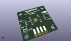
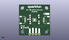
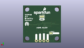
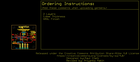
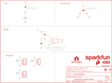

Contents
========

* [PRS18345 > Qwiic Air Quality Sensor SGP40](#prs18345--qwiic-air-quality-sensor-sgp40)
	* [Schematic](#schematic)
	* [PCB](#pcb)
	* [Interactive BOM](#interactive-bom)
	* [Images](#images)
	* [Tags](#tags)
  
![][im]
# PRS18345 > Qwiic Air Quality Sensor SGP40

- ID: PROJ-SPAR-18345-STAN-01
- Hex ID: PRS18345
- Name: Sparkfun
- Description: Sparkfun
- Long Link: [http://oom.lt/PROJ-SPAR-18345-STAN-01](http://oom.lt/PROJ-SPAR-18345-STAN-01)
- Short Link: [http://oom.lt/PRS18345](http://oom.lt/PRS18345)

## Schematic
  

## PCB
  

## Interactive BOM

- Interactive BOM page: [ibom.html](https://htmlpreview.github.io/?https://github.com/oomlout/oomlout_OOMP_projects/blob/main/PROJ-SPAR-18345-STAN-01/kicad/bom/ibom.html)

## Images
  
  

|kicadPcb3d|kicadPcb3dFront|kicadPcb3dBack|eagleImage|eagleSchemImage|
| :---: | :---: | :---: | :---: | :---: |
||||||

## Tags

- hexID: PRS18345
- oompType: PROJ
- oompSize: SPAR
- oompColor: 18345
- oompDesc: STAN
- oompIndex: 01
- oompName: Qwiic Air Quality Sensor SGP40
- sources: All source files from https://github.com/sparkfun/Qwiic_Air_Quality_Sensor_SGP40 (source licence details in srcLicense.md)
- linkBuyPage: https://www.sparkfun.com/products/18345
- oompID: PROJ-SPAR-18345-STAN-01

[im]: kicadPcb3d_450.png
