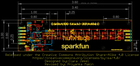
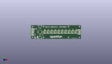
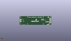
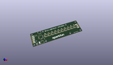

Contents
========

* [PROJ-SPAR-18354-STAN-01>SparkFun Qwiic LED Stick](#proj-spar-18354-stan-01sparkfun-qwiic-led-stick)
	* [Images](#images)
	* [Interactive BOM](#interactive-bom)
	* [OOMP Parts](#oomp-parts)
	* [Tags](#tags)
  
![][im]
# PROJ-SPAR-18354-STAN-01>SparkFun Qwiic LED Stick

- ID: PROJ-SPAR-18354-STAN-01
- Hex ID: PRS18354
- Name: SparkFun Qwiic LED Stick
- Description: 

## Images
  
  

|eagleImage|kicadPcb3dFront|kicadPcb3dBack|kicadPcb3d|
| :---: | :---: | :---: | :---: |
|||||

## Interactive BOM

- Interactive BOM page: [ibom.html](kicad/bom/ibom.html)

## OOMP Parts
  

|OOMP Parts|
| :---: |
|UNMATCHED-UNMATCHED-X-UNMATCHED-01, ADDR, 22.86, 16.509999999999998, M0,ADDR, JUMPER-SMT_2_NO_SILK, SMT-JUMPER_2_NO_SILK, SparkFun-Jumpers, (0.9, 0.65), MR0|
|CAPC-0603-X-UNMATCHED-01, C1, 7.619999999999999, 8.001, 270,C1, 4.7uF, 0603, SparkFun-Capacitors, (0.3, 0.315), R270|
|<table><tr><td></td><td> C4</td><td>[CAPC-0603-X-NF100-V50 SMD (0603) 100 nF Capacitor (Ceramic) 50v](https://github.com/oomlout/oomlout_OOMP_parts/tree/main/CAPC-0603-X-NF100-V50/)</td><td>[C6N100](https://github.com/oomlout/oomlout_OOMP_parts/tree/main/CAPC-0603-X-NF100-V50/)</td></tr></table>|
|UNMATCHED-UNMATCHED-X-UNMATCHED-01, D0, 25.4, 12.7, 0,D0, APA102-5050, APA102-5050, SparkFun-LED, (1, 0.5), R0|
|UNMATCHED-UNMATCHED-X-UNMATCHED-01, D1, 31.75, 12.7, 0,D1, APA102-5050, APA102-5050, SparkFun-LED, (1.25, 0.5), R0|
|UNMATCHED-UNMATCHED-X-UNMATCHED-01, D2, 38.099999999999994, 12.7, 0,D2, APA102-5050, APA102-5050, SparkFun-LED, (1.5, 0.5), R0|
|UNMATCHED-UNMATCHED-X-UNMATCHED-01, D3, 44.449999999999996, 12.7, 0,D3, APA102-5050, APA102-5050, SparkFun-LED, (1.75, 0.5), R0|
|UNMATCHED-UNMATCHED-X-UNMATCHED-01, D4, 50.8, 12.7, 0,D4, APA102-5050, APA102-5050, SparkFun-LED, (2, 0.5), R0|
|UNMATCHED-UNMATCHED-X-UNMATCHED-01, D5, 57.15, 12.7, 0,D5, APA102-5050, APA102-5050, SparkFun-LED, (2.25, 0.5), R0|
|UNMATCHED-UNMATCHED-X-UNMATCHED-01, D6, 63.5, 12.7, 0,D6, APA102-5050, APA102-5050, SparkFun-LED, (2.5, 0.5), R0|
|UNMATCHED-UNMATCHED-X-UNMATCHED-01, D7, 69.85, 12.7, 0,D7, APA102-5050, APA102-5050, SparkFun-LED, (2.75, 0.5), R0|
|UNMATCHED-UNMATCHED-X-UNMATCHED-01, D8, 76.19999999999999, 12.7, 0,D8, APA102-5050, APA102-5050, SparkFun-LED, (3, 0.5), R0|
|UNMATCHED-UNMATCHED-X-UNMATCHED-01, D9, 82.55, 12.7, 0,D9, APA102-5050, APA102-5050, SparkFun-LED, (3.25, 0.5), R0|
|UNMATCHED-0603-X-UNMATCHED-01, D10, 7.619999999999999, 2.54, 180,D10, RED, LED-0603, SparkFun-LED, (0.3, 0.1), R180|
|UNMATCHED-UNMATCHED-X-UNMATCHED-01, I2C, 8.889999999999999, 22.86, M0,I2C, JUMPER-SMT_3_2-NC_TRACE_SILK, SMT-JUMPER_3_2-NC_TRACE_SILK, SparkFun-Jumpers, (0.35, 0.9), MR0|
|UNMATCHED-UNMATCHED-X-UNMATCHED-01, J1, 1.27, 8.889999999999999, 270,J1, 1X02_NO_SILK, SparkFun-Connectors, (0.05, 0.35), R270|
|UNMATCHED-UNMATCHED-X-UNMATCHED-01, J2, 16.509999999999998, 5.08, 0,J2, QWIIC_RA, JST04_1MM_RA, SparkFun-Connectors, (0.65, 0.2), R0|
|UNMATCHED-UNMATCHED-X-UNMATCHED-01, J4, 16.509999999999998, 20.32, 180,J4, QWIIC_RA, JST04_1MM_RA, SparkFun-Connectors, (0.65, 0.8), R180|
|UNMATCHED-UNMATCHED-X-UNMATCHED-01, J5, 90.16999999999999, 16.509999999999998, M270,J5, 1X04_NO_SILK, SparkFun-Connectors, (3.55, 0.65), MR270|
|UNMATCHED-UNMATCHED-X-UNMATCHED-01, J7, 1.27, 11.43, 90,J7, 1X04_NO_SILK, SparkFun-Connectors, (0.05, 0.45), R90|
|LEDS-UNMATCHED-G-UNMATCHED-01, LED, 7.619999999999999, 1.016, M180,LED, JUMPER-SMT_2_NC_TRACE_SILK, SMT-JUMPER_2_NC_TRACE_SILK, SparkFun-Jumpers, (0.3, 0.04), MR180|
|RESE-0603-X-UNMATCHED-01, R1, 21.59, 7.619999999999999, 270,R1, 4.7k, 0603, SparkFun-Resistors, (0.85, 0.3), R270|
|RESE-0603-X-UNMATCHED-01, R2, 7.619999999999999, 18.287999999999997, 90,R2, 4.7k, 0603, SparkFun-Resistors, (0.3, 0.72), R90|
|RESE-0603-X-UNMATCHED-01, R3, 7.619999999999999, 1.016, 180,R3, 1k, 0603, SparkFun-Resistors, (0.3, 0.04), R180|
|RESE-0603-X-UNMATCHED-01, R6, 10.16, 18.415, 90,R6, 4.7k, 0603, SparkFun-Resistors, (0.4, 0.725), R90|
|UNMATCHED-UNMATCHED-X-UNMATCHED-01, U2, 16.509999999999998, 12.7, 180,U2, ATTINY85, ATTINY85, SparkFun-IC-Microcontroller, (0.65, 0.5), R180|
|UNMATCHED-UNMATCHED-X-UNMATCHED-01, VLED, 10.795, 8.636000000000001, M180,VLED, JUMPER-SMT_3_1-NC_TRACE_SILK, SMT-JUMPER_3_1-NC_TRACE_SILK, SparkFun-Jumpers, (0.425, 0.34), MR180|

## Tags

- hexID: PRS18354
- oompType: PROJ
- oompSize: SPAR
- oompColor: 18354
- oompDesc: STAN
- oompIndex: 01
- oompName: SparkFun Qwiic LED Stick
- sources: All source files from https://github.com/sparkfun/SparkFun_Qwiic_LED_Stick (source licence details in srcLicense.md)
- linkBuyPage: https://www.sparkfun.com/products/18354
- oompID: PROJ-SPAR-18354-STAN-01
- oompPart: UNMATCHED-UNMATCHED-X-UNMATCHED-01, ADDR, 22.86, 16.509999999999998, M0
- oompPart: CAPC-0603-X-UNMATCHED-01, C1, 7.619999999999999, 8.001, 270
- oompPart: CAPC-0603-X-NF100-V50, C4, 16.509999999999998, 8.636000000000001, 0
- oompPart: UNMATCHED-UNMATCHED-X-UNMATCHED-01, D0, 25.4, 12.7, 0
- oompPart: UNMATCHED-UNMATCHED-X-UNMATCHED-01, D1, 31.75, 12.7, 0
- oompPart: UNMATCHED-UNMATCHED-X-UNMATCHED-01, D2, 38.099999999999994, 12.7, 0
- oompPart: UNMATCHED-UNMATCHED-X-UNMATCHED-01, D3, 44.449999999999996, 12.7, 0
- oompPart: UNMATCHED-UNMATCHED-X-UNMATCHED-01, D4, 50.8, 12.7, 0
- oompPart: UNMATCHED-UNMATCHED-X-UNMATCHED-01, D5, 57.15, 12.7, 0
- oompPart: UNMATCHED-UNMATCHED-X-UNMATCHED-01, D6, 63.5, 12.7, 0
- oompPart: UNMATCHED-UNMATCHED-X-UNMATCHED-01, D7, 69.85, 12.7, 0
- oompPart: UNMATCHED-UNMATCHED-X-UNMATCHED-01, D8, 76.19999999999999, 12.7, 0
- oompPart: UNMATCHED-UNMATCHED-X-UNMATCHED-01, D9, 82.55, 12.7, 0
- oompPart: UNMATCHED-0603-X-UNMATCHED-01, D10, 7.619999999999999, 2.54, 180
- oompPart: UNMATCHED-UNMATCHED-X-UNMATCHED-01, I2C, 8.889999999999999, 22.86, M0
- oompPart: UNMATCHED-UNMATCHED-X-UNMATCHED-01, J1, 1.27, 8.889999999999999, 270
- oompPart: UNMATCHED-UNMATCHED-X-UNMATCHED-01, J2, 16.509999999999998, 5.08, 0
- oompPart: UNMATCHED-UNMATCHED-X-UNMATCHED-01, J4, 16.509999999999998, 20.32, 180
- oompPart: UNMATCHED-UNMATCHED-X-UNMATCHED-01, J5, 90.16999999999999, 16.509999999999998, M270
- oompPart: SKIP-UNMATCHED-X-UNMATCHED-01, J6, 16.509999999999998, 12.7, M270
- oompPart: UNMATCHED-UNMATCHED-X-UNMATCHED-01, J7, 1.27, 11.43, 90
- oompPart: SKIP-UNMATCHED-X-UNMATCHED-01, JP1, 0.7619999999999999, 0.7619999999999999, M270
- oompPart: SKIP-UNMATCHED-X-UNMATCHED-01, JP2, 90.55099999999999, 24.511, 90
- oompPart: SKIP-UNMATCHED-X-UNMATCHED-01, JP5, 90.55099999999999, 24.511, M270
- oompPart: SKIP-UNMATCHED-X-UNMATCHED-01, JP6, 0.7619999999999999, 0.7619999999999999, 90
- oompPart: LEDS-UNMATCHED-G-UNMATCHED-01, LED, 7.619999999999999, 1.016, M180
- oompPart: RESE-0603-X-UNMATCHED-01, R1, 21.59, 7.619999999999999, 270
- oompPart: RESE-0603-X-UNMATCHED-01, R2, 7.619999999999999, 18.287999999999997, 90
- oompPart: RESE-0603-X-UNMATCHED-01, R3, 7.619999999999999, 1.016, 180
- oompPart: RESE-0603-X-UNMATCHED-01, R6, 10.16, 18.415, 90
- oompPart: UNMATCHED-UNMATCHED-X-UNMATCHED-01, U2, 16.509999999999998, 12.7, 180
- oompPart: UNMATCHED-UNMATCHED-X-UNMATCHED-01, VLED, 10.795, 8.636000000000001, M180
- rawPart: ADDR, JUMPER-SMT_2_NO_SILK, SMT-JUMPER_2_NO_SILK, SparkFun-Jumpers, (0.9, 0.65), MR0
- rawPart: C1, 4.7uF, 0603, SparkFun-Capacitors, (0.3, 0.315), R270
- rawPart: C4, 0.1uF, 0603, SparkFun-Capacitors, (0.65, 0.34), R0
- rawPart: D0, APA102-5050, APA102-5050, SparkFun-LED, (1, 0.5), R0
- rawPart: D1, APA102-5050, APA102-5050, SparkFun-LED, (1.25, 0.5), R0
- rawPart: D2, APA102-5050, APA102-5050, SparkFun-LED, (1.5, 0.5), R0
- rawPart: D3, APA102-5050, APA102-5050, SparkFun-LED, (1.75, 0.5), R0
- rawPart: D4, APA102-5050, APA102-5050, SparkFun-LED, (2, 0.5), R0
- rawPart: D5, APA102-5050, APA102-5050, SparkFun-LED, (2.25, 0.5), R0
- rawPart: D6, APA102-5050, APA102-5050, SparkFun-LED, (2.5, 0.5), R0
- rawPart: D7, APA102-5050, APA102-5050, SparkFun-LED, (2.75, 0.5), R0
- rawPart: D8, APA102-5050, APA102-5050, SparkFun-LED, (3, 0.5), R0
- rawPart: D9, APA102-5050, APA102-5050, SparkFun-LED, (3.25, 0.5), R0
- rawPart: D10, RED, LED-0603, SparkFun-LED, (0.3, 0.1), R180
- rawPart: I2C, JUMPER-SMT_3_2-NC_TRACE_SILK, SMT-JUMPER_3_2-NC_TRACE_SILK, SparkFun-Jumpers, (0.35, 0.9), MR0
- rawPart: J1, 1X02_NO_SILK, SparkFun-Connectors, (0.05, 0.35), R270
- rawPart: J2, QWIIC_RA, JST04_1MM_RA, SparkFun-Connectors, (0.65, 0.2), R0
- rawPart: J4, QWIIC_RA, JST04_1MM_RA, SparkFun-Connectors, (0.65, 0.8), R180
- rawPart: J5, 1X04_NO_SILK, SparkFun-Connectors, (3.55, 0.65), MR270
- rawPart: J6, AVR_SPI_PROG_3X2TESTPOINTS, 2X3_TEST_POINTS, SparkFun-Connectors, (0.65, 0.5), MR270
- rawPart: J7, 1X04_NO_SILK, SparkFun-Connectors, (0.05, 0.45), R90
- rawPart: JP1, FIDUCIALUFIDUCIAL, FIDUCIAL-MICRO, SparkFun-Aesthetics, (0.03, 0.03), MR270
- rawPart: JP2, FIDUCIALUFIDUCIAL, FIDUCIAL-MICRO, SparkFun-Aesthetics, (3.565, 0.965), R90
- rawPart: JP5, FIDUCIALUFIDUCIAL, FIDUCIAL-MICRO, SparkFun-Aesthetics, (3.565, 0.965), MR270
- rawPart: JP6, FIDUCIALUFIDUCIAL, FIDUCIAL-MICRO, SparkFun-Aesthetics, (0.03, 0.03), R90
- rawPart: LED, JUMPER-SMT_2_NC_TRACE_SILK, SMT-JUMPER_2_NC_TRACE_SILK, SparkFun-Jumpers, (0.3, 0.04), MR180
- rawPart: R1, 4.7k, 0603, SparkFun-Resistors, (0.85, 0.3), R270
- rawPart: R2, 4.7k, 0603, SparkFun-Resistors, (0.3, 0.72), R90
- rawPart: R3, 1k, 0603, SparkFun-Resistors, (0.3, 0.04), R180
- rawPart: R6, 4.7k, 0603, SparkFun-Resistors, (0.4, 0.725), R90
- rawPart: U2, ATTINY85, ATTINY85, SparkFun-IC-Microcontroller, (0.65, 0.5), R180
- rawPart: VLED, JUMPER-SMT_3_1-NC_TRACE_SILK, SMT-JUMPER_3_1-NC_TRACE_SILK, SparkFun-Jumpers, (0.425, 0.34), MR180

[im]: kicadPcb3d_450.png
