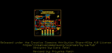
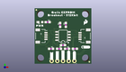
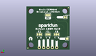
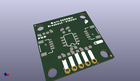

Contents
========

* [PROJ-SPAR-18355-STAN-01>Qwiic EEPROM Breakout](#proj-spar-18355-stan-01qwiic-eeprom-breakout)
	* [Images](#images)
	* [Interactive BOM](#interactive-bom)
	* [OOMP Parts](#oomp-parts)
	* [Tags](#tags)
  
![][im]
# PROJ-SPAR-18355-STAN-01>Qwiic EEPROM Breakout

- ID: PROJ-SPAR-18355-STAN-01
- Hex ID: PRS18355
- Name: Qwiic EEPROM Breakout
- Description: 

## Images
  
  

|eagleImage|kicadPcb3dFront|kicadPcb3dBack|kicadPcb3d|
| :---: | :---: | :---: | :---: |
|||||

## Interactive BOM

- Interactive BOM page: [ibom.html](kicad/bom/ibom.html)

## OOMP Parts
  

|OOMP Parts|
| :---: |
|<table><tr><td></td><td> C4</td><td>[CAPC-0603-X-NF100-V50 SMD (0603) 100 nF Capacitor (Ceramic) 50v](https://github.com/oomlout/oomlout_OOMP_parts/tree/main/CAPC-0603-X-NF100-V50/)</td><td>[C6N100](https://github.com/oomlout/oomlout_OOMP_parts/tree/main/CAPC-0603-X-NF100-V50/)</td></tr></table>|
|UNMATCHED-0603-X-UNMATCHED-01, D1, 2.54, 19.049999999999997, 180,D1, RED, LED-0603, SparkFun-LED, (0.1, 0.75), R180|
|UNMATCHED-UNMATCHED-X-UNMATCHED-01, E0, 7.619999999999999, 8.889999999999999, M0,E0, JUMPER-SMT_3_1-NC_TRACE_SILK, SMT-JUMPER_3_1-NC_TRACE_SILK, SparkFun-Jumpers, (0.3, 0.35), MR0|
|UNMATCHED-UNMATCHED-X-UNMATCHED-01, E1, 12.7, 8.889999999999999, M0,E1, JUMPER-SMT_3_1-NC_TRACE_SILK, SMT-JUMPER_3_1-NC_TRACE_SILK, SparkFun-Jumpers, (0.5, 0.35), MR0|
|UNMATCHED-UNMATCHED-X-UNMATCHED-01, E2, 17.779999999999998, 8.889999999999999, M0,E2, JUMPER-SMT_3_1-NC_TRACE_SILK, SMT-JUMPER_3_1-NC_TRACE_SILK, SparkFun-Jumpers, (0.7, 0.35), MR0|
|UNMATCHED-UNMATCHED-X-UNMATCHED-01, I2C, 12.7, 20.32, M0,I2C, JUMPER-SMT_3_2-NC_TRACE_SILK, SMT-JUMPER_3_2-NC_TRACE_SILK, SparkFun-Jumpers, (0.5, 0.8), MR0|
|UNMATCHED-UNMATCHED-X-UNMATCHED-01, J1, 7.619999999999999, 1.27, 0,J1, 1X01_NO_SILK, SparkFun-Connectors, (0.3, 0.05), R0|
|UNMATCHED-UNMATCHED-X-UNMATCHED-01, J2, 5.08, 12.7, 270,J2, QWIIC_RA, JST04_1MM_RA, SparkFun-Connectors, (0.2, 0.5), R270|
|UNMATCHED-UNMATCHED-X-UNMATCHED-01, J4, 20.32, 12.7, 90,J4, QWIIC_RA, JST04_1MM_RA, SparkFun-Connectors, (0.8, 0.5), R90|
|UNMATCHED-UNMATCHED-X-UNMATCHED-01, J5, 17.779999999999998, 1.27, 180,J5, 1X04_NO_SILK, SparkFun-Connectors, (0.7, 0.05), R180|
|UNMATCHED-UNMATCHED-X-UNMATCHED-01, POWER, 2.54, 19.049999999999997, M0,POWER, JUMPER-SMT_2_NC_TRACE_SILK, SMT-JUMPER_2_NC_TRACE_SILK, SparkFun-Jumpers, (0.1, 0.75), MR0|
|<table><tr><td></td><td> R1</td><td>[RESE-0603-X-O104-01 SMD (0603) 100k Ohm Resistor](https://github.com/oomlout/oomlout_OOMP_parts/tree/main/RESE-0603-X-O104-01/)</td><td>[R6104](https://github.com/oomlout/oomlout_OOMP_parts/tree/main/RESE-0603-X-O104-01/)</td></tr></table>|
|<table><tr><td></td><td> R2</td><td>[RESE-0603-X-O104-01 SMD (0603) 100k Ohm Resistor](https://github.com/oomlout/oomlout_OOMP_parts/tree/main/RESE-0603-X-O104-01/)</td><td>[R6104](https://github.com/oomlout/oomlout_OOMP_parts/tree/main/RESE-0603-X-O104-01/)</td></tr></table>|
|RESE-0603-X-UNMATCHED-01, R3, 5.842, 19.049999999999997, 0,R3, 1k, 0603, SparkFun-Resistors, (0.23, 0.75), R0|
|RESE-0603-X-UNMATCHED-01, R4, 11.43, 17.779999999999998, 90,R4, 4.7k, 0603, SparkFun-Resistors, (0.45, 0.7), R90|
|RESE-0603-X-UNMATCHED-01, R5, 13.97, 17.779999999999998, 90,R5, 4.7k, 0603, SparkFun-Resistors, (0.55, 0.7), R90|
|<table><tr><td></td><td> R6</td><td>[RESE-0603-X-O104-01 SMD (0603) 100k Ohm Resistor](https://github.com/oomlout/oomlout_OOMP_parts/tree/main/RESE-0603-X-O104-01/)</td><td>[R6104](https://github.com/oomlout/oomlout_OOMP_parts/tree/main/RESE-0603-X-O104-01/)</td></tr></table>|
|<table><tr><td></td><td> R7</td><td>[RESE-0603-X-O104-01 SMD (0603) 100k Ohm Resistor](https://github.com/oomlout/oomlout_OOMP_parts/tree/main/RESE-0603-X-O104-01/)</td><td>[R6104](https://github.com/oomlout/oomlout_OOMP_parts/tree/main/RESE-0603-X-O104-01/)</td></tr></table>|
|UNMATCHED-UNMATCHED-X-UNMATCHED-01, U1, 12.7, 12.7, 90,U1, CAT24C51, SO08, SparkFun-IC-Memory, (0.5, 0.5), R90|
|UNMATCHED-UNMATCHED-X-UNMATCHED-01, WP, 1.5239999999999998, 6.35, M0,WP, JUMPER-SMT_2_NO_SILK, SMT-JUMPER_2_NO_SILK, SparkFun-Jumpers, (0.06, 0.25), MR0|

## Tags

- hexID: PRS18355
- oompType: PROJ
- oompSize: SPAR
- oompColor: 18355
- oompDesc: STAN
- oompIndex: 01
- oompName: Qwiic EEPROM Breakout
- sources: All source files from https://github.com/sparkfun/Qwiic_EEPROM_Breakout (source licence details in srcLicense.md)
- linkBuyPage: https://www.sparkfun.com/products/18355
- oompID: PROJ-SPAR-18355-STAN-01
- oompPart: CAPC-0603-X-NF100-V50, C4, 12.7, 8.509, 0
- oompPart: UNMATCHED-0603-X-UNMATCHED-01, D1, 2.54, 19.049999999999997, 180
- oompPart: UNMATCHED-UNMATCHED-X-UNMATCHED-01, E0, 7.619999999999999, 8.889999999999999, M0
- oompPart: UNMATCHED-UNMATCHED-X-UNMATCHED-01, E1, 12.7, 8.889999999999999, M0
- oompPart: UNMATCHED-UNMATCHED-X-UNMATCHED-01, E2, 17.779999999999998, 8.889999999999999, M0
- oompPart: UNMATCHED-UNMATCHED-X-UNMATCHED-01, I2C, 12.7, 20.32, M0
- oompPart: UNMATCHED-UNMATCHED-X-UNMATCHED-01, J1, 7.619999999999999, 1.27, 0
- oompPart: UNMATCHED-UNMATCHED-X-UNMATCHED-01, J2, 5.08, 12.7, 270
- oompPart: UNMATCHED-UNMATCHED-X-UNMATCHED-01, J4, 20.32, 12.7, 90
- oompPart: UNMATCHED-UNMATCHED-X-UNMATCHED-01, J5, 17.779999999999998, 1.27, 180
- oompPart: SKIP-UNMATCHED-X-UNMATCHED-01, JP1, 0.7619999999999999, 24.637999999999998, M0
- oompPart: SKIP-UNMATCHED-X-UNMATCHED-01, JP2, 24.511, 0.889, 0
- oompPart: SKIP-UNMATCHED-X-UNMATCHED-01, JP5, 24.511, 0.889, M0
- oompPart: SKIP-UNMATCHED-X-UNMATCHED-01, JP6, 0.7619999999999999, 24.637999999999998, 0
- oompPart: UNMATCHED-UNMATCHED-X-UNMATCHED-01, POWER, 2.54, 19.049999999999997, M0
- oompPart: RESE-0603-X-O104-01, R1, 7.365999999999999, 6.858, 0
- oompPart: RESE-0603-X-O104-01, R2, 10.921999999999999, 6.858, 0
- oompPart: RESE-0603-X-UNMATCHED-01, R3, 5.842, 19.049999999999997, 0
- oompPart: RESE-0603-X-UNMATCHED-01, R4, 11.43, 17.779999999999998, 90
- oompPart: RESE-0603-X-UNMATCHED-01, R5, 13.97, 17.779999999999998, 90
- oompPart: RESE-0603-X-O104-01, R6, 14.477999999999998, 6.858, 0
- oompPart: RESE-0603-X-O104-01, R7, 18.034, 6.858, 180
- oompPart: UNMATCHED-UNMATCHED-X-UNMATCHED-01, U1, 12.7, 12.7, 90
- oompPart: UNMATCHED-UNMATCHED-X-UNMATCHED-01, WP, 1.5239999999999998, 6.35, M0
- rawPart: C4, 0.1uF, 0603, SparkFun-Capacitors, (0.5, 0.335), R0
- rawPart: D1, RED, LED-0603, SparkFun-LED, (0.1, 0.75), R180
- rawPart: E0, JUMPER-SMT_3_1-NC_TRACE_SILK, SMT-JUMPER_3_1-NC_TRACE_SILK, SparkFun-Jumpers, (0.3, 0.35), MR0
- rawPart: E1, JUMPER-SMT_3_1-NC_TRACE_SILK, SMT-JUMPER_3_1-NC_TRACE_SILK, SparkFun-Jumpers, (0.5, 0.35), MR0
- rawPart: E2, JUMPER-SMT_3_1-NC_TRACE_SILK, SMT-JUMPER_3_1-NC_TRACE_SILK, SparkFun-Jumpers, (0.7, 0.35), MR0
- rawPart: I2C, JUMPER-SMT_3_2-NC_TRACE_SILK, SMT-JUMPER_3_2-NC_TRACE_SILK, SparkFun-Jumpers, (0.5, 0.8), MR0
- rawPart: J1, 1X01_NO_SILK, SparkFun-Connectors, (0.3, 0.05), R0
- rawPart: J2, QWIIC_RA, JST04_1MM_RA, SparkFun-Connectors, (0.2, 0.5), R270
- rawPart: J4, QWIIC_RA, JST04_1MM_RA, SparkFun-Connectors, (0.8, 0.5), R90
- rawPart: J5, 1X04_NO_SILK, SparkFun-Connectors, (0.7, 0.05), R180
- rawPart: JP1, FIDUCIALUFIDUCIAL, FIDUCIAL-MICRO, SparkFun-Aesthetics, (0.03, 0.97), MR0
- rawPart: JP2, FIDUCIALUFIDUCIAL, FIDUCIAL-MICRO, SparkFun-Aesthetics, (0.965, 0.035), R0
- rawPart: JP5, FIDUCIALUFIDUCIAL, FIDUCIAL-MICRO, SparkFun-Aesthetics, (0.965, 0.035), MR0
- rawPart: JP6, FIDUCIALUFIDUCIAL, FIDUCIAL-MICRO, SparkFun-Aesthetics, (0.03, 0.97), R0
- rawPart: POWER, JUMPER-SMT_2_NC_TRACE_SILK, SMT-JUMPER_2_NC_TRACE_SILK, SparkFun-Jumpers, (0.1, 0.75), MR0
- rawPart: R1, 100k, 0603, SparkFun-Resistors, (0.29, 0.27), R0
- rawPart: R2, 100k, 0603, SparkFun-Resistors, (0.43, 0.27), R0
- rawPart: R3, 1k, 0603, SparkFun-Resistors, (0.23, 0.75), R0
- rawPart: R4, 4.7k, 0603, SparkFun-Resistors, (0.45, 0.7), R90
- rawPart: R5, 4.7k, 0603, SparkFun-Resistors, (0.55, 0.7), R90
- rawPart: R6, 100k, 0603, SparkFun-Resistors, (0.57, 0.27), R0
- rawPart: R7, 100k, 0603, SparkFun-Resistors, (0.71, 0.27), R180
- rawPart: U1, CAT24C51, SO08, SparkFun-IC-Memory, (0.5, 0.5), R90
- rawPart: WP, JUMPER-SMT_2_NO_SILK, SMT-JUMPER_2_NO_SILK, SparkFun-Jumpers, (0.06, 0.25), MR0

[im]: kicadPcb3d_450.png
