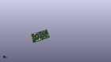

Contents
========

* [PROJ-SPAR-18430-STAN-01>SparkFun WiFi Function Board ESP32](#proj-spar-18430-stan-01sparkfun-wifi-function-board-esp32)
	* [Images](#images)
	* [Interactive BOM](#interactive-bom)
	* [OOMP Parts](#oomp-parts)
	* [Tags](#tags)
  
![][im]
# PROJ-SPAR-18430-STAN-01>SparkFun WiFi Function Board ESP32

- ID: PROJ-SPAR-18430-STAN-01
- Hex ID: PRS18430
- Name: SparkFun WiFi Function Board ESP32
- Description: 

## Images
  
  

|eagleImage|kicadPcb3dFront|kicadPcb3dBack|kicadPcb3d|
| :---: | :---: | :---: | :---: |
|||||

## Interactive BOM

- Interactive BOM page: [ibom.html](kicad/bom/ibom.html)

## OOMP Parts
  

|OOMP Parts|
| :---: |
|CAPE-0603-X-NF100-01, C1, 55.9308, 35.0012, 0,C1, 0.1uF, 0603, SparkFun-Capacitors, (2.202, 1.378), R0|
|CAPE-0603-X-UNMATCHED-01, C4, 15.112999999999998, 28.2575, 270,C4, 1.0uF, 0603, SparkFun-Capacitors, (0.595, 1.1125), R270|
|CAPE-0603-X-UNMATCHED-01, C6, 11.6205, 30.733999999999998, 0,C6, 1.0uF, 0603, SparkFun-Capacitors, (0.4575, 1.21), R0|
|UNMATCHED-0603-X-UNMATCHED-01, D1, 63.2968, 13.589, 270,D1, RED, LED-0603, SparkFun-LED, (2.492, 0.535), R270|
|UNMATCHED-UNMATCHED-X-UNMATCHED-01, FD1, 5.842, 35.81399999999999, M0,FD1, FIDUCIAL1X2, FIDUCIAL-1X2, SparkFun-Aesthetics, (0.23, 1.41), MR0|
|UNMATCHED-UNMATCHED-X-UNMATCHED-01, FD2, 39.34459999999999, 1.1176, M0,FD2, FIDUCIAL1X2, FIDUCIAL-1X2, SparkFun-Aesthetics, (1.549, 0.044), MR0|
|UNMATCHED-UNMATCHED-X-UNMATCHED-01, FD3, 5.842, 35.81399999999999, 0,FD3, FIDUCIAL1X2, FIDUCIAL-1X2, SparkFun-Aesthetics, (0.23, 1.41), R0|
|UNMATCHED-UNMATCHED-X-UNMATCHED-01, FD4, 39.34459999999999, 1.1176, 0,FD4, FIDUCIAL1X2, FIDUCIAL-1X2, SparkFun-Aesthetics, (1.549, 0.044), R0|
|UNMATCHED-UNMATCHED-X-UNMATCHED-01, J1, -0.011800077999999999, 19.016000068, 270,J1, MICROMOD_FUNCTION_STANDARD, M.2-CARD-E-22_FUNCTION_STANDARD, SparkFun-MicroMod, (-0.00046457, 0.74866142), R270|
|UNMATCHED-UNMATCHED-X-UNMATCHED-01, J3, 58.547000000000004, 5.334, 90,J3, USB-C-16P-2LAYER-PADS, SparkFun-Connectors, (2.305, 0.21), R90|
|UNMATCHED-UNMATCHED-X-UNMATCHED-01, JP1, 63.373, 13.6906, M270,JP1, JUMPER-SMT_2_NC_TRACE_SILK, SMT-JUMPER_2_NC_TRACE_SILK, SparkFun-Jumpers, (2.495, 0.539), MR270|
|UNMATCHED-UNMATCHED-X-UNMATCHED-01, JP2, 19.685, 20.955, 180,JP2, JUMPER-SMT_3_2-NC_TRACE_SILK, SMT-JUMPER_3_2-NC_TRACE_SILK, SparkFun-Jumpers, (0.775, 0.825), R180|
|UNMATCHED-UNMATCHED-X-UNMATCHED-01, Q2, 40.2844, 7.868299985999999, 0,Q2, MBT3904DW1T1, SC70-6, SparkFun-DiscreteSemi, (1.586, 0.30977559), R0|
|<table><tr><td></td><td> R1</td><td>[RESE-0603-X-O103-01 SMD (0603) 10k Ohm Resistor](https://github.com/oomlout/oomlout_OOMP_parts/tree/main/RESE-0603-X-O103-01/)</td><td>[R6103](https://github.com/oomlout/oomlout_OOMP_parts/tree/main/RESE-0603-X-O103-01/)</td></tr></table>|
|<table><tr><td></td><td> R2</td><td>[RESE-0603-X-O103-01 SMD (0603) 10k Ohm Resistor](https://github.com/oomlout/oomlout_OOMP_parts/tree/main/RESE-0603-X-O103-01/)</td><td>[R6103](https://github.com/oomlout/oomlout_OOMP_parts/tree/main/RESE-0603-X-O103-01/)</td></tr></table>|
|RESE-0603-X-UNMATCHED-01, R3, 55.44819999999999, 2.8956, 0,R3, 5.1k, 0603, SparkFun-Resistors, (2.183, 0.114), R0|
|RESE-0603-X-UNMATCHED-01, R4, 57.15, 7.823199999999999, 270,R4, 5.1k, 0603, SparkFun-Resistors, (2.25, 0.308), R270|
|<table><tr><td></td><td> R5</td><td>[RESE-0603-X-O223-01 SMD (0603) 22k Ohm Resistor](https://github.com/oomlout/oomlout_OOMP_parts/tree/main/RESE-0603-X-O223-01/)</td><td>[R6223](https://github.com/oomlout/oomlout_OOMP_parts/tree/main/RESE-0603-X-O223-01/)</td></tr></table>|
|RESE-0603-X-O333-01, R6, 50.2412, 2.1082, 90,R6, 33k, 0603, SparkFun-Resistors, (1.978, 0.083), R90|
|RESE-0603-X-UNMATCHED-01, R7, 61.214, 13.4874, 270,R7, 1k, 0603, SparkFun-Resistors, (2.41, 0.531), R270|
|RESE-0603-X-UNMATCHED-01, R8, 18.541999999999998, 17.399, 90,R8, 4.7k, 0603, SparkFun-Resistors, (0.73, 0.685), R90|
|RESE-0603-X-UNMATCHED-01, R9, 20.827999999999996, 17.399, 90,R9, 4.7k, 0603, SparkFun-Resistors, (0.82, 0.685), R90|
|<table><tr><td></td><td> R12</td><td>[RESE-0603-X-O104-01 SMD (0603) 100k Ohm Resistor](https://github.com/oomlout/oomlout_OOMP_parts/tree/main/RESE-0603-X-O104-01/)</td><td>[R6104](https://github.com/oomlout/oomlout_OOMP_parts/tree/main/RESE-0603-X-O104-01/)</td></tr></table>|
|<table><tr><td></td><td> R17</td><td>[RESE-0603-X-O103-01 SMD (0603) 10k Ohm Resistor](https://github.com/oomlout/oomlout_OOMP_parts/tree/main/RESE-0603-X-O103-01/)</td><td>[R6103](https://github.com/oomlout/oomlout_OOMP_parts/tree/main/RESE-0603-X-O103-01/)</td></tr></table>|
|<table><tr><td></td><td> R18</td><td>[RESE-0603-X-O103-01 SMD (0603) 10k Ohm Resistor](https://github.com/oomlout/oomlout_OOMP_parts/tree/main/RESE-0603-X-O103-01/)</td><td>[R6103](https://github.com/oomlout/oomlout_OOMP_parts/tree/main/RESE-0603-X-O103-01/)</td></tr></table>|
|UNMATCHED-UNMATCHED-X-UNMATCHED-01, S1, 29.870399999999997, 19.049999999999997, 270,S1, MOMENTARY-SWITCH-SPST-SMD-5.2MM-TALL, TACTILE_SWITCH_SMD_5.2MM, SparkFun-Switches, (1.176, 0.75), R270|
|UNMATCHED-UNMATCHED-X-UNMATCHED-01, S2, 29.870399999999997, 28.041600000000003, 90,S2, MOMENTARY-SWITCH-SPST-SMD-5.2MM-TALL, TACTILE_SWITCH_SMD_5.2MM, SparkFun-Switches, (1.176, 1.104), R90|
|UNMATCHED-UNMATCHED-X-UNMATCHED-01, TP2, 39.624, 10.363199999999999, 0,TP2, TEST-POINTTP_15TH_THRU, TP_15TH, SparkFun-Connectors, (1.56, 0.408), R0|
|UNMATCHED-UNMATCHED-X-UNMATCHED-01, U1, 8.636000000000001, 18.034, 270,U1, EEPROM, SO08, SparkFun-IC-Memory, (0.34, 0.71), R270|
|UNMATCHED-UNMATCHED-X-UNMATCHED-01, U2, 50.1904, 24.892, 0,U2, ESP-WROOM-3232D-NARROW, ESP-WROOM-32D-NARROW, SparkFun-RF, (1.976, 0.98), R0|
|UNMATCHED-UNMATCHED-X-UNMATCHED-01, U3, 11.43, 28.132000124, 270,U3, 3.3V, SOT23-5, SparkFun-IC-Power, (0.45, 1.10755906), R270|
|UNMATCHED-UNMATCHED-X-UNMATCHED-01, U4, 47.744599963999995, 7.576600036, 90,U4, CP210X, QFN24, SparkFun-IC-Comms, (1.87970866, 0.29829134), R90|

## Tags

- hexID: PRS18430
- oompType: PROJ
- oompSize: SPAR
- oompColor: 18430
- oompDesc: STAN
- oompIndex: 01
- oompName: SparkFun WiFi Function Board ESP32
- sources: All source files from https://github.com/sparkfun/SparkFun_WiFi_Function_Board_ESP32 (source licence details in srcLicense.md)
- linkBuyPage: https://www.sparkfun.com/products/18430
- oompPart: CAPE-0603-X-NF100-01, C1, 55.9308, 35.0012, 0
- oompPart: CAPE-0603-X-UNMATCHED-01, C4, 15.112999999999998, 28.2575, 270
- oompPart: CAPE-0603-X-UNMATCHED-01, C6, 11.6205, 30.733999999999998, 0
- oompPart: UNMATCHED-0603-X-UNMATCHED-01, D1, 63.2968, 13.589, 270
- oompPart: UNMATCHED-UNMATCHED-X-UNMATCHED-01, FD1, 5.842, 35.81399999999999, M0
- oompPart: UNMATCHED-UNMATCHED-X-UNMATCHED-01, FD2, 39.34459999999999, 1.1176, M0
- oompPart: UNMATCHED-UNMATCHED-X-UNMATCHED-01, FD3, 5.842, 35.81399999999999, 0
- oompPart: UNMATCHED-UNMATCHED-X-UNMATCHED-01, FD4, 39.34459999999999, 1.1176, 0
- oompPart: UNMATCHED-UNMATCHED-X-UNMATCHED-01, J1, -0.011800077999999999, 19.016000068, 270
- oompPart: UNMATCHED-UNMATCHED-X-UNMATCHED-01, J3, 58.547000000000004, 5.334, 90
- oompPart: UNMATCHED-UNMATCHED-X-UNMATCHED-01, JP1, 63.373, 13.6906, M270
- oompPart: UNMATCHED-UNMATCHED-X-UNMATCHED-01, JP2, 19.685, 20.955, 180
- oompPart: UNMATCHED-UNMATCHED-X-UNMATCHED-01, Q2, 40.2844, 7.868299985999999, 0
- oompPart: RESE-0603-X-O103-01, R1, 53.467, 6.9088, 270
- oompPart: RESE-0603-X-O103-01, R2, 55.9054, 36.5252, 180
- oompPart: RESE-0603-X-UNMATCHED-01, R3, 55.44819999999999, 2.8956, 0
- oompPart: RESE-0603-X-UNMATCHED-01, R4, 57.15, 7.823199999999999, 270
- oompPart: RESE-0603-X-O223-01, R5, 52.120799999999996, 2.1082, 90
- oompPart: RESE-0603-X-O333-01, R6, 50.2412, 2.1082, 90
- oompPart: RESE-0603-X-UNMATCHED-01, R7, 61.214, 13.4874, 270
- oompPart: RESE-0603-X-UNMATCHED-01, R8, 18.541999999999998, 17.399, 90
- oompPart: RESE-0603-X-UNMATCHED-01, R9, 20.827999999999996, 17.399, 90
- oompPart: RESE-0603-X-O104-01, R12, 8.509, 27.94, 90
- oompPart: RESE-0603-X-O103-01, R17, 38.0238, 7.807500006, 90
- oompPart: RESE-0603-X-O103-01, R18, 42.545, 7.832900005999999, 270
- oompPart: UNMATCHED-UNMATCHED-X-UNMATCHED-01, S1, 29.870399999999997, 19.049999999999997, 270
- oompPart: UNMATCHED-UNMATCHED-X-UNMATCHED-01, S2, 29.870399999999997, 28.041600000000003, 90
- oompPart: UNMATCHED-UNMATCHED-X-UNMATCHED-01, TP2, 39.624, 10.363199999999999, 0
- oompPart: UNMATCHED-UNMATCHED-X-UNMATCHED-01, U1, 8.636000000000001, 18.034, 270
- oompPart: UNMATCHED-UNMATCHED-X-UNMATCHED-01, U2, 50.1904, 24.892, 0
- oompPart: UNMATCHED-UNMATCHED-X-UNMATCHED-01, U3, 11.43, 28.132000124, 270
- oompPart: UNMATCHED-UNMATCHED-X-UNMATCHED-01, U4, 47.744599963999995, 7.576600036, 90
- rawPart: C1, 0.1uF, 0603, SparkFun-Capacitors, (2.202, 1.378), R0
- rawPart: C4, 1.0uF, 0603, SparkFun-Capacitors, (0.595, 1.1125), R270
- rawPart: C6, 1.0uF, 0603, SparkFun-Capacitors, (0.4575, 1.21), R0
- rawPart: D1, RED, LED-0603, SparkFun-LED, (2.492, 0.535), R270
- rawPart: FD1, FIDUCIAL1X2, FIDUCIAL-1X2, SparkFun-Aesthetics, (0.23, 1.41), MR0
- rawPart: FD2, FIDUCIAL1X2, FIDUCIAL-1X2, SparkFun-Aesthetics, (1.549, 0.044), MR0
- rawPart: FD3, FIDUCIAL1X2, FIDUCIAL-1X2, SparkFun-Aesthetics, (0.23, 1.41), R0
- rawPart: FD4, FIDUCIAL1X2, FIDUCIAL-1X2, SparkFun-Aesthetics, (1.549, 0.044), R0
- rawPart: J1, MICROMOD_FUNCTION_STANDARD, M.2-CARD-E-22_FUNCTION_STANDARD, SparkFun-MicroMod, (-0.00046457, 0.74866142), R270
- rawPart: J3, USB-C-16P-2LAYER-PADS, SparkFun-Connectors, (2.305, 0.21), R90
- rawPart: JP1, JUMPER-SMT_2_NC_TRACE_SILK, SMT-JUMPER_2_NC_TRACE_SILK, SparkFun-Jumpers, (2.495, 0.539), MR270
- rawPart: JP2, JUMPER-SMT_3_2-NC_TRACE_SILK, SMT-JUMPER_3_2-NC_TRACE_SILK, SparkFun-Jumpers, (0.775, 0.825), R180
- rawPart: Q2, MBT3904DW1T1, SC70-6, SparkFun-DiscreteSemi, (1.586, 0.30977559), R0
- rawPart: R1, 10k, 0603, SparkFun-Resistors, (2.105, 0.272), R270
- rawPart: R2, 10k, 0603, SparkFun-Resistors, (2.201, 1.438), R180
- rawPart: R3, 5.1k, 0603, SparkFun-Resistors, (2.183, 0.114), R0
- rawPart: R4, 5.1k, 0603, SparkFun-Resistors, (2.25, 0.308), R270
- rawPart: R5, 22k, 0603, SparkFun-Resistors, (2.052, 0.083), R90
- rawPart: R6, 33k, 0603, SparkFun-Resistors, (1.978, 0.083), R90
- rawPart: R7, 1k, 0603, SparkFun-Resistors, (2.41, 0.531), R270
- rawPart: R8, 4.7k, 0603, SparkFun-Resistors, (0.73, 0.685), R90
- rawPart: R9, 4.7k, 0603, SparkFun-Resistors, (0.82, 0.685), R90
- rawPart: R12, 100k, 0603, SparkFun-Resistors, (0.335, 1.1), R90
- rawPart: R17, 10k, 0603, SparkFun-Resistors, (1.497, 0.30738189), R90
- rawPart: R18, 10k, 0603, SparkFun-Resistors, (1.675, 0.30838189), R270
- rawPart: S1, MOMENTARY-SWITCH-SPST-SMD-5.2MM-TALL, TACTILE_SWITCH_SMD_5.2MM, SparkFun-Switches, (1.176, 0.75), R270
- rawPart: S2, MOMENTARY-SWITCH-SPST-SMD-5.2MM-TALL, TACTILE_SWITCH_SMD_5.2MM, SparkFun-Switches, (1.176, 1.104), R90
- rawPart: TP2, TEST-POINTTP_15TH_THRU, TP_15TH, SparkFun-Connectors, (1.56, 0.408), R0
- rawPart: U1, EEPROM, SO08, SparkFun-IC-Memory, (0.34, 0.71), R270
- rawPart: U2, ESP-WROOM-3232D-NARROW, ESP-WROOM-32D-NARROW, SparkFun-RF, (1.976, 0.98), R0
- rawPart: U3, 3.3V, SOT23-5, SparkFun-IC-Power, (0.45, 1.10755906), R270
- rawPart: U4, CP210X, QFN24, SparkFun-IC-Comms, (1.87970866, 0.29829134), R90

[im]: kicadPcb3d_450.png
