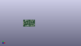

Contents
========

* [PROJ-SPAR-18430-STAN-01>SparkFun WiFi Function Board ESP32](#proj-spar-18430-stan-01sparkfun-wifi-function-board-esp32)
	* [Images](#images)
	* [Interactive BOM](#interactive-bom)
	* [Tags](#tags)
  
![][im]
# PROJ-SPAR-18430-STAN-01>SparkFun WiFi Function Board ESP32

- ID: PROJ-SPAR-18430-STAN-01
- Hex ID: PRS18430
- Name: SparkFun WiFi Function Board ESP32
- Description: 

## Images
  
  

|eagleImage|kicadPcb3dFront|kicadPcb3dBack|kicadPcb3d|
| :---: | :---: | :---: | :---: |
|||||

## Interactive BOM

- Interactive BOM page: [ibom.html](kicad/bom/ibom.html)

## Tags

- hexID: PRS18430
- oompType: PROJ
- oompSize: SPAR
- oompColor: 18430
- oompDesc: STAN
- oompIndex: 01
- oompName: SparkFun WiFi Function Board ESP32
- sources: All source files from https://github.com/sparkfun/SparkFun_WiFi_Function_Board_ESP32 (source licence details in srcLicense.md)
- linkBuyPage: https://www.sparkfun.com/products/18430
- oompID: PROJ-SPAR-18430-STAN-01

[im]: kicadPcb3d_450.png
