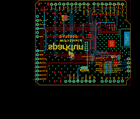
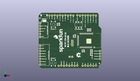
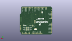
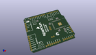

Contents
========

* [PROJ-SPAR-18567-STAN-01>WiFi Shield-DA16200](#proj-spar-18567-stan-01wifi-shield-da16200)
	* [Images](#images)
	* [Interactive BOM](#interactive-bom)
	* [OOMP Parts](#oomp-parts)
	* [Tags](#tags)
  
![][im]
# PROJ-SPAR-18567-STAN-01>WiFi Shield-DA16200

- ID: PROJ-SPAR-18567-STAN-01
- Hex ID: PRS18567
- Name: WiFi Shield-DA16200
- Description: 

## Images
  
  

|eagleImage|kicadPcb3dFront|kicadPcb3dBack|kicadPcb3d|
| :---: | :---: | :---: | :---: |
|||||

## Interactive BOM

- Interactive BOM page: [ibom.html](kicad/bom/ibom.html)

## OOMP Parts
  

|OOMP Parts|
| :---: |
|UNMATCHED-UNMATCHED-X-UNMATCHED-01, B1, 30.479999999999997, 26.669999999999998, 270,B1, ARDUINO_UNO_R3_SHIELD, UNO_R3_SHIELD_NOLABELS_LOCK, SparkFun-Boards, (1.2, 1.05), R270|
|UNMATCHED-0603-X-UNMATCHED-01, C1, 48.00599999999999, 36.83, 90,C1, DNP, 0603, SparkFun-Capacitors, (1.89, 1.45), R90|
|CAPC-0603-X-UNMATCHED-01, C2, 34.036, 30.099, 180,C2, 1uF, 0603, SparkFun-Capacitors, (1.34, 1.185), R180|
|CAPC-0603-X-UNMATCHED-01, C3, 49.5173, 16.637, 270,C3, 1uF, 0603, SparkFun-Capacitors, (1.9495, 0.655), R270|
|CAPC-0603-X-UNMATCHED-01, C4, 50.99049999999999, 16.700499999999998, 270,C4, 10uF, 0603, SparkFun-Capacitors, (2.0075, 0.6575), R270|
|UNMATCHED-0603-X-UNMATCHED-01, D1, 50.99049999999999, 13.398499999999999, 270,D1, RED, LED-0603, SparkFun-LED, (2.0075, 0.5275), R270|
|UNMATCHED-UNMATCHED-X-UNMATCHED-01, I2C, 18.9865, 42.2275, M270,I2C, SMT-JUMPER_3_2-NC_TRACE_SILK, SparkFun-Jumpers, (0.7475, 1.6625), MR270|
|UNMATCHED-UNMATCHED-X-UNMATCHED-01, J1, 32.004, 24.3205, 90,J1, CORTEX_JTAG_DEBUG, 2X5-PTH-1.27MM-NO_SILK, SparkFun-Connectors, (1.26, 0.9575), R90|
|UNMATCHED-UNMATCHED-X-UNMATCHED-01, J2, 1.27, 43.18, 270,J2, 1X06_NO_SILK, SparkFun-Connectors, (0.05, 1.7), R270|
|UNMATCHED-UNMATCHED-X-UNMATCHED-01, J3, 5.1435, 47.3075, 180,J3, QWIIC_RA, JST04_1MM_RA, SparkFun-Connectors, (0.2025, 1.8625), R180|
|UNMATCHED-UNMATCHED-X-UNMATCHED-01, J4, 1.27, 3.8099999999999996, 90,J4, 1X08_NO_SILK, SparkFun-Connectors, (0.05, 0.15), R90|
|UNMATCHED-UNMATCHED-X-UNMATCHED-01, J5, 58.419999999999995, 16.509999999999998, 270,J5, 1X04_NO_SILK, SparkFun-Connectors, (2.3, 0.65), R270|
|UNMATCHED-UNMATCHED-X-UNMATCHED-01, JP1, 52.43829999999999, 17.653, M90,JP1, SMT-JUMPER_2_NC_TRACE_SILK, SparkFun-Jumpers, (2.0645, 0.695), MR90|
|UNMATCHED-UNMATCHED-X-UNMATCHED-01, JP2, 46.99, 9.2075, M270,JP2, SMT-JUMPER_3_1-NC_TRACE_SILK, SparkFun-Jumpers, (1.85, 0.3625), MR270|
|UNMATCHED-UNMATCHED-X-UNMATCHED-01, JP3, 44.449999999999996, 9.2075, M270,JP3, SMT-JUMPER_3_1-NC_TRACE_SILK, SparkFun-Jumpers, (1.75, 0.3625), MR270|
|UNMATCHED-UNMATCHED-X-UNMATCHED-01, JP4, 46.99, 13.017499999999998, M270,JP4, SMT-JUMPER_3_1-NC_TRACE_SILK, SparkFun-Jumpers, (1.85, 0.5125), MR270|
|UNMATCHED-UNMATCHED-X-UNMATCHED-01, JP5, 44.449999999999996, 13.017499999999998, M270,JP5, SMT-JUMPER_3_1-NC_TRACE_SILK, SparkFun-Jumpers, (1.75, 0.5125), MR270|
|UNMATCHED-UNMATCHED-X-UNMATCHED-01, JP6, 35.81399999999999, 16.891, M270,JP6, SMT-JUMPER_3_1-NC_TRACE_SILK, SparkFun-Jumpers, (1.41, 0.665), MR270|
|UNMATCHED-UNMATCHED-X-UNMATCHED-01, MEAS, 30.733999999999998, 10.9728, M0,MEAS, COMBO-JUMPER_2_NC_TRACE, SparkFun-Jumpers, (1.21, 0.432), MR0|
|RESE-0603-X-UNMATCHED-01, R1, 49.529999999999994, 36.83, 90,R1, DNP, 0603, SparkFun-Resistors, (1.95, 1.45), R90|
|RESE-0603-X-UNMATCHED-01, R2, 46.5074, 36.83, 270,R2, 4.7k, 0603, SparkFun-Resistors, (1.831, 1.45), R270|
|RESE-0603-X-UNMATCHED-01, R3, 34.036, 31.623, 0,R3, 4.7k, 0603, SparkFun-Resistors, (1.34, 1.245), R0|
|RESE-0603-X-UNMATCHED-01, R4, 42.468799999999995, 17.272000000000002, 0,R4, 4.7k, 0603, SparkFun-Resistors, (1.672, 0.68), R0|
|RESE-0603-X-UNMATCHED-01, R5, 42.468799999999995, 15.773399999999999, 0,R5, 4.7k, 0603, SparkFun-Resistors, (1.672, 0.621), R0|
|RESE-0603-X-UNMATCHED-01, R6, 49.5173, 13.334999999999999, 90,R6, 200, 0603, SparkFun-Resistors, (1.9495, 0.525), R90|
|RESE-0603-X-UNMATCHED-01, R7, 18.923, 41.4655, 0,R7, 4.7k, 0603, SparkFun-Resistors, (0.745, 1.6325), R0|
|RESE-0603-X-UNMATCHED-01, R8, 18.923, 42.98949999999999, 0,R8, 4.7k, 0603, SparkFun-Resistors, (0.745, 1.6925), R0|
|UNMATCHED-UNMATCHED-X-UNMATCHED-01, S1, 38.099999999999994, 41.7195, 180,S1, DPDT, SWITCH_DPDT_SMD_AYZ0202, SparkFun-Switches, (1.5, 1.6425), R180|
|UNMATCHED-UNMATCHED-X-UNMATCHED-01, S2, 13.97, 5.08, 90,S2, Reset, TACTILE_SWITCH_SMD_5.2MM, SparkFun-Switches, (0.55, 0.2), R90|
|UNMATCHED-UNMATCHED-X-UNMATCHED-01, S3, 13.97, 42.1894, 90,S3, TACTILE_SWITCH_SMD_5.2MM, SparkFun-Switches, (0.55, 1.661), R90|
|UNMATCHED-UNMATCHED-X-UNMATCHED-01, U1, 48.26, 26.669999999999998, 270,U1, DA16200MOD, XCVR_DA16200MOD-AAC4WA32, DA16200MOD, (1.9, 1.05), R270|

## Tags

- hexID: PRS18567
- oompType: PROJ
- oompSize: SPAR
- oompColor: 18567
- oompDesc: STAN
- oompIndex: 01
- oompName: WiFi Shield-DA16200
- sources: All source files from https://github.com/sparkfun/WiFi_Shield-DA16200 (source licence details in srcLicense.md)
- linkBuyPage: https://www.sparkfun.com/products/18567
- oompID: PROJ-SPAR-18567-STAN-01
- oompPart: UNMATCHED-UNMATCHED-X-UNMATCHED-01, B1, 30.479999999999997, 26.669999999999998, 270
- oompPart: UNMATCHED-0603-X-UNMATCHED-01, C1, 48.00599999999999, 36.83, 90
- oompPart: CAPC-0603-X-UNMATCHED-01, C2, 34.036, 30.099, 180
- oompPart: CAPC-0603-X-UNMATCHED-01, C3, 49.5173, 16.637, 270
- oompPart: CAPC-0603-X-UNMATCHED-01, C4, 50.99049999999999, 16.700499999999998, 270
- oompPart: UNMATCHED-0603-X-UNMATCHED-01, D1, 50.99049999999999, 13.398499999999999, 270
- oompPart: SKIP-UNMATCHED-X-UNMATCHED-01, FD1, 0.9524999999999999, 48.19649999999999, 0
- oompPart: SKIP-UNMATCHED-X-UNMATCHED-01, FD2, 0.9524999999999999, 48.19649999999999, M0
- oompPart: SKIP-UNMATCHED-X-UNMATCHED-01, FD3, 57.785, 4.762499999999999, 0
- oompPart: SKIP-UNMATCHED-X-UNMATCHED-01, FD4, 57.785, 4.762499999999999, M0
- oompPart: UNMATCHED-UNMATCHED-X-UNMATCHED-01, I2C, 18.9865, 42.2275, M270
- oompPart: UNMATCHED-UNMATCHED-X-UNMATCHED-01, J1, 32.004, 24.3205, 90
- oompPart: UNMATCHED-UNMATCHED-X-UNMATCHED-01, J2, 1.27, 43.18, 270
- oompPart: UNMATCHED-UNMATCHED-X-UNMATCHED-01, J3, 5.1435, 47.3075, 180
- oompPart: UNMATCHED-UNMATCHED-X-UNMATCHED-01, J4, 1.27, 3.8099999999999996, 90
- oompPart: UNMATCHED-UNMATCHED-X-UNMATCHED-01, J5, 58.419999999999995, 16.509999999999998, 270
- oompPart: UNMATCHED-UNMATCHED-X-UNMATCHED-01, JP1, 52.43829999999999, 17.653, M90
- oompPart: UNMATCHED-UNMATCHED-X-UNMATCHED-01, JP2, 46.99, 9.2075, M270
- oompPart: UNMATCHED-UNMATCHED-X-UNMATCHED-01, JP3, 44.449999999999996, 9.2075, M270
- oompPart: UNMATCHED-UNMATCHED-X-UNMATCHED-01, JP4, 46.99, 13.017499999999998, M270
- oompPart: UNMATCHED-UNMATCHED-X-UNMATCHED-01, JP5, 44.449999999999996, 13.017499999999998, M270
- oompPart: UNMATCHED-UNMATCHED-X-UNMATCHED-01, JP6, 35.81399999999999, 16.891, M270
- oompPart: UNMATCHED-UNMATCHED-X-UNMATCHED-01, MEAS, 30.733999999999998, 10.9728, M0
- oompPart: RESE-0603-X-UNMATCHED-01, R1, 49.529999999999994, 36.83, 90
- oompPart: RESE-0603-X-UNMATCHED-01, R2, 46.5074, 36.83, 270
- oompPart: RESE-0603-X-UNMATCHED-01, R3, 34.036, 31.623, 0
- oompPart: RESE-0603-X-UNMATCHED-01, R4, 42.468799999999995, 17.272000000000002, 0
- oompPart: RESE-0603-X-UNMATCHED-01, R5, 42.468799999999995, 15.773399999999999, 0
- oompPart: RESE-0603-X-UNMATCHED-01, R6, 49.5173, 13.334999999999999, 90
- oompPart: RESE-0603-X-UNMATCHED-01, R7, 18.923, 41.4655, 0
- oompPart: RESE-0603-X-UNMATCHED-01, R8, 18.923, 42.98949999999999, 0
- oompPart: UNMATCHED-UNMATCHED-X-UNMATCHED-01, S1, 38.099999999999994, 41.7195, 180
- oompPart: UNMATCHED-UNMATCHED-X-UNMATCHED-01, S2, 13.97, 5.08, 90
- oompPart: UNMATCHED-UNMATCHED-X-UNMATCHED-01, S3, 13.97, 42.1894, 90
- oompPart: SKIP-UNMATCHED-X-UNMATCHED-01, TP1, 30.162499999999998, 38.4175, M0
- oompPart: UNMATCHED-UNMATCHED-X-UNMATCHED-01, U1, 48.26, 26.669999999999998, 270
- rawPart: B1, ARDUINO_UNO_R3_SHIELD, UNO_R3_SHIELD_NOLABELS_LOCK, SparkFun-Boards, (1.2, 1.05), R270
- rawPart: C1, DNP, 0603, SparkFun-Capacitors, (1.89, 1.45), R90
- rawPart: C2, 1uF, 0603, SparkFun-Capacitors, (1.34, 1.185), R180
- rawPart: C3, 1uF, 0603, SparkFun-Capacitors, (1.9495, 0.655), R270
- rawPart: C4, 10uF, 0603, SparkFun-Capacitors, (2.0075, 0.6575), R270
- rawPart: D1, RED, LED-0603, SparkFun-LED, (2.0075, 0.5275), R270
- rawPart: FD1, FIDUCIAL1X2, FIDUCIAL-1X2, SparkFun-Aesthetics, (0.0375, 1.8975), R0
- rawPart: FD2, FIDUCIAL1X2, FIDUCIAL-1X2, SparkFun-Aesthetics, (0.0375, 1.8975), MR0
- rawPart: FD3, FIDUCIAL1X2, FIDUCIAL-1X2, SparkFun-Aesthetics, (2.275, 0.1875), R0
- rawPart: FD4, FIDUCIAL1X2, FIDUCIAL-1X2, SparkFun-Aesthetics, (2.275, 0.1875), MR0
- rawPart: I2C, SMT-JUMPER_3_2-NC_TRACE_SILK, SparkFun-Jumpers, (0.7475, 1.6625), MR270
- rawPart: J1, CORTEX_JTAG_DEBUG, 2X5-PTH-1.27MM-NO_SILK, SparkFun-Connectors, (1.26, 0.9575), R90
- rawPart: J2, 1X06_NO_SILK, SparkFun-Connectors, (0.05, 1.7), R270
- rawPart: J3, QWIIC_RA, JST04_1MM_RA, SparkFun-Connectors, (0.2025, 1.8625), R180
- rawPart: J4, 1X08_NO_SILK, SparkFun-Connectors, (0.05, 0.15), R90
- rawPart: J5, 1X04_NO_SILK, SparkFun-Connectors, (2.3, 0.65), R270
- rawPart: JP1, SMT-JUMPER_2_NC_TRACE_SILK, SparkFun-Jumpers, (2.0645, 0.695), MR90
- rawPart: JP2, SMT-JUMPER_3_1-NC_TRACE_SILK, SparkFun-Jumpers, (1.85, 0.3625), MR270
- rawPart: JP3, SMT-JUMPER_3_1-NC_TRACE_SILK, SparkFun-Jumpers, (1.75, 0.3625), MR270
- rawPart: JP4, SMT-JUMPER_3_1-NC_TRACE_SILK, SparkFun-Jumpers, (1.85, 0.5125), MR270
- rawPart: JP5, SMT-JUMPER_3_1-NC_TRACE_SILK, SparkFun-Jumpers, (1.75, 0.5125), MR270
- rawPart: JP6, SMT-JUMPER_3_1-NC_TRACE_SILK, SparkFun-Jumpers, (1.41, 0.665), MR270
- rawPart: MEAS, COMBO-JUMPER_2_NC_TRACE, SparkFun-Jumpers, (1.21, 0.432), MR0
- rawPart: R1, DNP, 0603, SparkFun-Resistors, (1.95, 1.45), R90
- rawPart: R2, 4.7k, 0603, SparkFun-Resistors, (1.831, 1.45), R270
- rawPart: R3, 4.7k, 0603, SparkFun-Resistors, (1.34, 1.245), R0
- rawPart: R4, 4.7k, 0603, SparkFun-Resistors, (1.672, 0.68), R0
- rawPart: R5, 4.7k, 0603, SparkFun-Resistors, (1.672, 0.621), R0
- rawPart: R6, 200, 0603, SparkFun-Resistors, (1.9495, 0.525), R90
- rawPart: R7, 4.7k, 0603, SparkFun-Resistors, (0.745, 1.6325), R0
- rawPart: R8, 4.7k, 0603, SparkFun-Resistors, (0.745, 1.6925), R0
- rawPart: S1, DPDT, SWITCH_DPDT_SMD_AYZ0202, SparkFun-Switches, (1.5, 1.6425), R180
- rawPart: S2, Reset, TACTILE_SWITCH_SMD_5.2MM, SparkFun-Switches, (0.55, 0.2), R90
- rawPart: S3, TACTILE_SWITCH_SMD_5.2MM, SparkFun-Switches, (0.55, 1.661), R90
- rawPart: TP1, PAD.03X.03, SparkFun-Connectors, (1.1875, 1.5125), MR0
- rawPart: U1, DA16200MOD, XCVR_DA16200MOD-AAC4WA32, DA16200MOD, (1.9, 1.05), R270

[im]: kicadPcb3d_450.png
