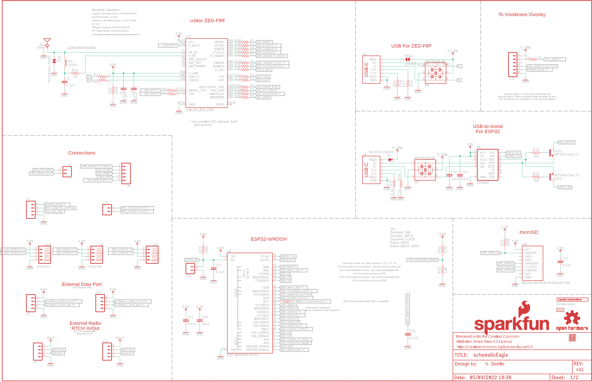
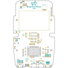
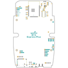
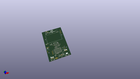
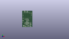
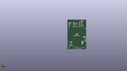
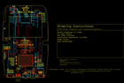
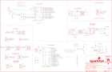
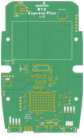
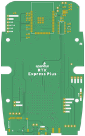

Contents
========

* [PRS18590 > SparkFun RTK Express Plus](#prs18590--sparkfun-rtk-express-plus)
	* [Schematic](#schematic)
	* [PCB](#pcb)
	* [Interactive BOM](#interactive-bom)
	* [OOMP Parts](#oomp-parts)
	* [Images](#images)
	* [Tags](#tags)
  
![][im]
# PRS18590 > SparkFun RTK Express Plus

- ID: PROJ-SPAR-18590-STAN-01
- Hex ID: PRS18590
- Name: Sparkfun
- Description: Sparkfun
- Long Link: [http://oom.lt/PROJ-SPAR-18590-STAN-01](http://oom.lt/PROJ-SPAR-18590-STAN-01)
- Short Link: [http://oom.lt/PRS18590](http://oom.lt/PRS18590)

## Schematic
  

## PCB
  

## Interactive BOM

- Interactive BOM page: [ibom.html](https://htmlpreview.github.io/?https://github.com/oomlout/oomlout_OOMP_projects/blob/main/PROJ-SPAR-18590-STAN-01/kicad/bom/ibom.html)

## OOMP Parts
  

|OOMP ID|Name|Identifier|
| :---: | :---: | :---: |
|UNMATCHED-UNMATCHED-X-UNMATCHED-01||BT1, E1, J3, J5, J8, J16, MEAS, MEAS1, Q1, Q2, U$2, U1, U5, U6, U7, U8, U9, U10, U11, U13|
|[CAPC-0402-X-PF47-V50](https://github.com/oomlout/oomlout_OOMP_parts/tree/main/CAPC-0402-X-PF47-V50/)|[SMD (0402) 47 pF Capacitor (Ceramic) 50v](https://github.com/oomlout/oomlout_OOMP_parts/tree/main/CAPC-0402-X-PF47-V50/)|[C1](https://github.com/oomlout/oomlout_OOMP_parts/tree/main/CAPC-0402-X-PF47-V50/)|
|CAPC-0603-X-UNMATCHED-01||C2, C4, C6, C17, C18|
|[CAPC-0603-X-NF100-V50](https://github.com/oomlout/oomlout_OOMP_parts/tree/main/CAPC-0603-X-NF100-V50/)|[SMD (0603) 100 nF Capacitor (Ceramic) 50v](https://github.com/oomlout/oomlout_OOMP_parts/tree/main/CAPC-0603-X-NF100-V50/)|[C3, C5, C7, C11, C12, C13, C15, C16, C21, C22, C23, C27, C28, C29](https://github.com/oomlout/oomlout_OOMP_parts/tree/main/CAPC-0603-X-NF100-V50/)|
|[CAPC-0603-X-UF47D-V10](https://github.com/oomlout/oomlout_OOMP_parts/tree/main/CAPC-0603-X-UF47D-V10/)|[SMD (0603) 4.7 uF Capacitor (Ceramic) 10v](https://github.com/oomlout/oomlout_OOMP_parts/tree/main/CAPC-0603-X-UF47D-V10/)|[C8, C9](https://github.com/oomlout/oomlout_OOMP_parts/tree/main/CAPC-0603-X-UF47D-V10/)|
|[CAPC-0603-X-UF10-V63D](https://github.com/oomlout/oomlout_OOMP_parts/tree/main/CAPC-0603-X-UF10-V63D/)|[SMD (0603) 10 uF Capacitor (Ceramic) 6.3v](https://github.com/oomlout/oomlout_OOMP_parts/tree/main/CAPC-0603-X-UF10-V63D/)|[C10, C14, C19, C20](https://github.com/oomlout/oomlout_OOMP_parts/tree/main/CAPC-0603-X-UF10-V63D/)|
|DIOD-S323-X-UNMATCHED-01||D1, D3, D7, D9|
|DIOD-UNMATCHED-X-UNMATCHED-01||D2, D6|
|DIOD-0402-X-UNMATCHED-01||D10|
|FERB-0402-X-UNMATCHED-01||FB1|
|[HEAD-I01-X-PI02-01](https://github.com/oomlout/oomlout_OOMP_parts/tree/main/HEAD-I01-X-PI02-01/)|[2.54 mm 2 Pin Header](https://github.com/oomlout/oomlout_OOMP_parts/tree/main/HEAD-I01-X-PI02-01/)|[J1, J10, J14, J15](https://github.com/oomlout/oomlout_OOMP_parts/tree/main/HEAD-I01-X-PI02-01/)|
|HEAD-UNMATCHED-X-UNMATCHED-01||J2, J9, J19|
|[HEAD-JSTSH-X-PI04-RS](https://github.com/oomlout/oomlout_OOMP_parts/tree/main/HEAD-JSTSH-X-PI04-RS/)|[JST XH (1 mm) 4 Pin Header Right Angle (SMD)](https://github.com/oomlout/oomlout_OOMP_parts/tree/main/HEAD-JSTSH-X-PI04-RS/)|[J4, J13](https://github.com/oomlout/oomlout_OOMP_parts/tree/main/HEAD-JSTSH-X-PI04-RS/)|
|[HEAD-I01-X-PI05-01](https://github.com/oomlout/oomlout_OOMP_parts/tree/main/HEAD-I01-X-PI05-01/)|[2.54 mm 5 Pin Header](https://github.com/oomlout/oomlout_OOMP_parts/tree/main/HEAD-I01-X-PI05-01/)|[J6](https://github.com/oomlout/oomlout_OOMP_parts/tree/main/HEAD-I01-X-PI05-01/)|
|[HEAD-I01-X-PI04-01](https://github.com/oomlout/oomlout_OOMP_parts/tree/main/HEAD-I01-X-PI04-01/)|[2.54 mm 4 Pin Header](https://github.com/oomlout/oomlout_OOMP_parts/tree/main/HEAD-I01-X-PI04-01/)|[J7, J11, J12, J17](https://github.com/oomlout/oomlout_OOMP_parts/tree/main/HEAD-I01-X-PI04-01/)|
|HEAD-I01-X-PI01-01||J18|
|[RESE-0603-X-O471-01](https://github.com/oomlout/oomlout_OOMP_parts/tree/main/RESE-0603-X-O471-01/)|[SMD (0603) 470 Ohm Resistor](https://github.com/oomlout/oomlout_OOMP_parts/tree/main/RESE-0603-X-O471-01/)|[R1](https://github.com/oomlout/oomlout_OOMP_parts/tree/main/RESE-0603-X-O471-01/)|
|RESE-1206-X-O330-01||R2, R3, R4, R9, R25|
|RESE-0603-X-UNMATCHED-01||R5, R34|
|[RESE-0603-X-O103-01](https://github.com/oomlout/oomlout_OOMP_parts/tree/main/RESE-0603-X-O103-01/)|[SMD (0603) 10k Ohm Resistor](https://github.com/oomlout/oomlout_OOMP_parts/tree/main/RESE-0603-X-O103-01/)|[R6, R8, R18, R23, R29, R31, R33](https://github.com/oomlout/oomlout_OOMP_parts/tree/main/RESE-0603-X-O103-01/)|
|[RESE-0603-X-O102-01](https://github.com/oomlout/oomlout_OOMP_parts/tree/main/RESE-0603-X-O102-01/)|[SMD (0603) 1k Ohm Resistor](https://github.com/oomlout/oomlout_OOMP_parts/tree/main/RESE-0603-X-O102-01/)|[R7, R19](https://github.com/oomlout/oomlout_OOMP_parts/tree/main/RESE-0603-X-O102-01/)|
|RESE-0603-X-O1003-01||R13, R15, R20, R22, R26|
|[RESE-0603-X-O100-01](https://github.com/oomlout/oomlout_OOMP_parts/tree/main/RESE-0603-X-O100-01/)|[SMD (0603) 10 Ohm Resistor](https://github.com/oomlout/oomlout_OOMP_parts/tree/main/RESE-0603-X-O100-01/)|[R14](https://github.com/oomlout/oomlout_OOMP_parts/tree/main/RESE-0603-X-O100-01/)|
|[RESE-0603-X-O472-01](https://github.com/oomlout/oomlout_OOMP_parts/tree/main/RESE-0603-X-O472-01/)|[SMD (0603) 4.7k Ohm Resistor](https://github.com/oomlout/oomlout_OOMP_parts/tree/main/RESE-0603-X-O472-01/)|[R16, R17, R37, R38](https://github.com/oomlout/oomlout_OOMP_parts/tree/main/RESE-0603-X-O472-01/)|
|RESE-0603-X-O3003-01||R24|
|RESE-0603-X-O270-01||R27, R28|
|RESE-0603-X-O1503-01||R30|
|[VREG-SO235-X-KAP2112K-V33D](https://github.com/oomlout/oomlout_OOMP_parts/tree/main/VREG-SO235-X-KAP2112K-V33D/)|[SMD (SOT-23-5) AP2112K Voltage Regulator 3.3v](https://github.com/oomlout/oomlout_OOMP_parts/tree/main/VREG-SO235-X-KAP2112K-V33D/)|[U2](https://github.com/oomlout/oomlout_OOMP_parts/tree/main/VREG-SO235-X-KAP2112K-V33D/)|
|UNMATCHED-SO235-X-UNMATCHED-01||U4|

## Images
  
  

|bominteractivefront|bominteractiveback|kicadPcb3d|kicadPcb3dFront|kicadPcb3dBack|eagleImage|eagleSchemImage|pcbdraw|pcbdrawback|
| :---: | :---: | :---: | :---: | :---: | :---: | :---: | :---: | :---: |
||||||||||

## Tags

- hexID: PRS18590
- oompType: PROJ
- oompSize: SPAR
- oompColor: 18590
- oompDesc: STAN
- oompIndex: 01
- oompName: SparkFun RTK Express Plus
- sources: All source files from https://github.com/sparkfun/SparkFun_RTK_Express_Plus (source licence details in srcLicense.md)
- linkBuyPage: https://www.sparkfun.com/products/18590
- oompID: PROJ-SPAR-18590-STAN-01
- oompParts: BT1,UNMATCHED-UNMATCHED-X-UNMATCHED-01
- oompParts: C1,CAPC-0402-X-PF47-V50
- oompParts: C2,CAPC-0603-X-UNMATCHED-01
- oompParts: C3,CAPC-0603-X-NF100-V50
- oompParts: C4,CAPC-0603-X-UNMATCHED-01
- oompParts: C5,CAPC-0603-X-NF100-V50
- oompParts: C6,CAPC-0603-X-UNMATCHED-01
- oompParts: C7,CAPC-0603-X-NF100-V50
- oompParts: C8,CAPC-0603-X-UF47D-V10
- oompParts: C9,CAPC-0603-X-UF47D-V10
- oompParts: C10,CAPC-0603-X-UF10-V63D
- oompParts: C11,CAPC-0603-X-NF100-V50
- oompParts: C12,CAPC-0603-X-NF100-V50
- oompParts: C13,CAPC-0603-X-NF100-V50
- oompParts: C14,CAPC-0603-X-UF10-V63D
- oompParts: C15,CAPC-0603-X-NF100-V50
- oompParts: C16,CAPC-0603-X-NF100-V50
- oompParts: C17,CAPC-0603-X-UNMATCHED-01
- oompParts: C18,CAPC-0603-X-UNMATCHED-01
- oompParts: C19,CAPC-0603-X-UF10-V63D
- oompParts: C20,CAPC-0603-X-UF10-V63D
- oompParts: C21,CAPC-0603-X-NF100-V50
- oompParts: C22,CAPC-0603-X-NF100-V50
- oompParts: C23,CAPC-0603-X-NF100-V50
- oompParts: C27,CAPC-0603-X-NF100-V50
- oompParts: C28,CAPC-0603-X-NF100-V50
- oompParts: C29,CAPC-0603-X-NF100-V50
- oompParts: D1,DIOD-S323-X-UNMATCHED-01
- oompParts: D2,DIOD-UNMATCHED-X-UNMATCHED-01
- oompParts: D3,DIOD-S323-X-UNMATCHED-01
- oompParts: D6,DIOD-UNMATCHED-X-UNMATCHED-01
- oompParts: D7,DIOD-S323-X-UNMATCHED-01
- oompParts: D9,DIOD-S323-X-UNMATCHED-01
- oompParts: D10,DIOD-0402-X-UNMATCHED-01
- oompParts: E1,UNMATCHED-UNMATCHED-X-UNMATCHED-01
- oompParts: FB1,FERB-0402-X-UNMATCHED-01
- oompParts: J1,HEAD-I01-X-PI02-01
- oompParts: J2,HEAD-UNMATCHED-X-UNMATCHED-01
- oompParts: J3,UNMATCHED-UNMATCHED-X-UNMATCHED-01
- oompParts: J4,HEAD-JSTSH-X-PI04-RS
- oompParts: J5,UNMATCHED-UNMATCHED-X-UNMATCHED-01
- oompParts: J6,HEAD-I01-X-PI05-01
- oompParts: J7,HEAD-I01-X-PI04-01
- oompParts: J8,UNMATCHED-UNMATCHED-X-UNMATCHED-01
- oompParts: J9,HEAD-UNMATCHED-X-UNMATCHED-01
- oompParts: J10,HEAD-I01-X-PI02-01
- oompParts: J11,HEAD-I01-X-PI04-01
- oompParts: J12,HEAD-I01-X-PI04-01
- oompParts: J13,HEAD-JSTSH-X-PI04-RS
- oompParts: J14,HEAD-I01-X-PI02-01
- oompParts: J15,HEAD-I01-X-PI02-01
- oompParts: J16,UNMATCHED-UNMATCHED-X-UNMATCHED-01
- oompParts: J17,HEAD-I01-X-PI04-01
- oompParts: J18,HEAD-I01-X-PI01-01
- oompParts: J19,HEAD-UNMATCHED-X-UNMATCHED-01
- oompParts: MEAS,UNMATCHED-UNMATCHED-X-UNMATCHED-01
- oompParts: MEAS1,UNMATCHED-UNMATCHED-X-UNMATCHED-01
- oompParts: Q1,UNMATCHED-UNMATCHED-X-UNMATCHED-01
- oompParts: Q2,UNMATCHED-UNMATCHED-X-UNMATCHED-01
- oompParts: R1,RESE-0603-X-O471-01
- oompParts: R2,RESE-1206-X-O330-01
- oompParts: R3,RESE-1206-X-O330-01
- oompParts: R4,RESE-1206-X-O330-01
- oompParts: R5,RESE-0603-X-UNMATCHED-01
- oompParts: R6,RESE-0603-X-O103-01
- oompParts: R7,RESE-0603-X-O102-01
- oompParts: R8,RESE-0603-X-O103-01
- oompParts: R9,RESE-1206-X-O330-01
- oompParts: R13,RESE-0603-X-O1003-01
- oompParts: R14,RESE-0603-X-O100-01
- oompParts: R15,RESE-0603-X-O1003-01
- oompParts: R16,RESE-0603-X-O472-01
- oompParts: R17,RESE-0603-X-O472-01
- oompParts: R18,RESE-0603-X-O103-01
- oompParts: R19,RESE-0603-X-O102-01
- oompParts: R20,RESE-0603-X-O1003-01
- oompParts: R22,RESE-0603-X-O1003-01
- oompParts: R23,RESE-0603-X-O103-01
- oompParts: R24,RESE-0603-X-O3003-01
- oompParts: R25,RESE-1206-X-O330-01
- oompParts: R26,RESE-0603-X-O1003-01
- oompParts: R27,RESE-0603-X-O270-01
- oompParts: R28,RESE-0603-X-O270-01
- oompParts: R29,RESE-0603-X-O103-01
- oompParts: R30,RESE-0603-X-O1503-01
- oompParts: R31,RESE-0603-X-O103-01
- oompParts: R33,RESE-0603-X-O103-01
- oompParts: R34,RESE-0603-X-UNMATCHED-01
- oompParts: R37,RESE-0603-X-O472-01
- oompParts: R38,RESE-0603-X-O472-01
- oompParts: U$2,UNMATCHED-UNMATCHED-X-UNMATCHED-01
- oompParts: U1,UNMATCHED-UNMATCHED-X-UNMATCHED-01
- oompParts: U2,VREG-SO235-X-KAP2112K-V33D
- oompParts: U4,UNMATCHED-SO235-X-UNMATCHED-01
- oompParts: U5,UNMATCHED-UNMATCHED-X-UNMATCHED-01
- oompParts: U6,UNMATCHED-UNMATCHED-X-UNMATCHED-01
- oompParts: U7,UNMATCHED-UNMATCHED-X-UNMATCHED-01
- oompParts: U8,UNMATCHED-UNMATCHED-X-UNMATCHED-01
- oompParts: U9,UNMATCHED-UNMATCHED-X-UNMATCHED-01
- oompParts: U10,UNMATCHED-UNMATCHED-X-UNMATCHED-01
- oompParts: U11,UNMATCHED-UNMATCHED-X-UNMATCHED-01
- oompParts: U13,UNMATCHED-UNMATCHED-X-UNMATCHED-01
- rawParts: BT1,LIPO-OUTLINE1000,LIPO-OUTLINE1000,LIPO-1000,LiPo Battery Outlines,,,,,BATT-13243,,,PRT-13813,,
- rawParts: C1,47pF,47PF-0402-25V-5%-X7R,0402,47pF ceramic capacitors,,,,,CAP-15063,,,,47pF,
- rawParts: C2,1.0uF,1.0UF-0603-16V-10%-X7R,0603,1µF ceramic capacitors,,,,,CAP-13930,,,,1.0uF,
- rawParts: C3,0.1uF,0.1UF-0603-25V-(+80/-20%),0603,0.1µF ceramic capacitors,,,,,CAP-00810,,,,0.1uF,
- rawParts: C4,1.0uF,1.0UF-0603-16V-10%-X7R,0603,1µF ceramic capacitors,,,,,CAP-13930,,,,1.0uF,
- rawParts: C5,0.1uF,0.1UF-0603-25V-5%,0603,0.1µF ceramic capacitors,,,,,CAP-08604,,,,0.1uF,
- rawParts: C6,1.0uF,1.0UF-0603-16V-10%-X7R,0603,1µF ceramic capacitors,,,,,CAP-13930,,,,1.0uF,
- rawParts: C7,0.1uF,0.1UF-0603-25V-5%,0603,0.1µF ceramic capacitors,,,,,CAP-08604,,,,0.1uF,
- rawParts: C8,4.7uF,4.7UF-0603-35V-(20%),0603,4.7µF ceramic capacitors,,,,,CAP-14106,,,,4.7uF,
- rawParts: C9,4.7uF,4.7UF-0603-35V-(20%),0603,4.7µF ceramic capacitors,,,,,CAP-14106,,,,4.7uF,
- rawParts: C10,10uF,10UF-0603-6.3V-20%,0603,10.0µF ceramic capacitors,,,,,CAP-11015,,,,10uF,
- rawParts: C11,0.1uF,0.1UF-0603-25V-(+80/-20%),0603,0.1µF ceramic capacitors,,,,,CAP-00810,,,,0.1uF,
- rawParts: C12,0.1uF,0.1UF-0603-25V-(+80/-20%),0603,0.1µF ceramic capacitors,,,,,CAP-00810,,,,0.1uF,
- rawParts: C13,0.1uF,0.1UF-0603-25V-(+80/-20%),0603,0.1µF ceramic capacitors,,,,,CAP-00810,,,,0.1uF,
- rawParts: C14,10uF,10UF-0603-6.3V-20%,0603,10.0µF ceramic capacitors,,,,,CAP-11015,,,,10uF,
- rawParts: C15,0.1uF,0.1UF-0603-25V-(+80/-20%),0603,0.1µF ceramic capacitors,,,,,CAP-00810,,,,0.1uF,
- rawParts: C16,0.1uF,0.1UF-0603-25V-(+80/-20%),0603,0.1µF ceramic capacitors,,,,,CAP-00810,,,,0.1uF,
- rawParts: C17,1.0uF,1.0UF-0603-16V-10%-X7R,0603,1µF ceramic capacitors,,,,,CAP-13930,,,,1.0uF,
- rawParts: C18,1.0uF,1.0UF-0603-16V-10%-X7R,0603,1µF ceramic capacitors,,,,,CAP-13930,,,,1.0uF,
- rawParts: C19,10uF,10UF-0603-6.3V-20%,0603,10.0µF ceramic capacitors,,,,,CAP-11015,,,,10uF,
- rawParts: C20,10uF,10UF-0603-6.3V-20%,0603,10.0µF ceramic capacitors,,,,,CAP-11015,,,,10uF,
- rawParts: C21,0.1uF,0.1UF-0603-25V-(+80/-20%),0603,0.1µF ceramic capacitors,,,,,CAP-00810,,,,0.1uF,
- rawParts: C22,0.1uF,0.1UF-0603-25V-5%,0603,0.1µF ceramic capacitors,,,,,CAP-08604,,,,0.1uF,
- rawParts: C23,0.1uF,0.1UF-0603-25V-5%,0603,0.1µF ceramic capacitors,,,,,CAP-08604,,,,0.1uF,
- rawParts: C27,0.1uF,0.1UF-0603-25V-(+80/-20%),0603,0.1µF ceramic capacitors,,,,,CAP-00810,,,,0.1uF,
- rawParts: C28,0.1uF,0.1UF-0603-25V-(+80/-20%),0603,0.1µF ceramic capacitors,,,,,CAP-00810,,,,0.1uF,
- rawParts: C29,0.1uF,0.1UF-0603-25V-(+80/-20%),0603,0.1µF ceramic capacitors,,,,,CAP-00810,,,,0.1uF,
- rawParts: D1,250mA/100V,DIODE-BAS16J,SOD-323,Diode,,,,,DIO-09646,,,,250mA/100V,
- rawParts: D2,PRTR5V0U2F,PRTR5V0U2F,SOT886,A small ESD protection device. Most commonly used on USB D+/D- signals to protect large, expensive, or especially sensitive USB enabled devices.,,,,,DIO-14084,,,,,
- rawParts: D3,3A/10V/280mV,DIODE-SCHOTTKY-BAT60A,SOD-323,Schottky diode,,,,,DIO-14072,,,,3A/10V/280mV,
- rawParts: D6,PRTR5V0U2F,PRTR5V0U2F,SOT886,A small ESD protection device. Most commonly used on USB D+/D- signals to protect large, expensive, or especially sensitive USB enabled devices.,,,,,DIO-14084,,,,,
- rawParts: D7,3A/10V/280mV,DIODE-SCHOTTKY-BAT60A,SOD-323,Schottky diode,,,,,DIO-14072,,,,3A/10V/280mV,
- rawParts: D9,3A/10V/280mV,DIODE-SCHOTTKY-BAT60A,SOD-323,Schottky diode,,,,,DIO-14072,,,,3A/10V/280mV,
- rawParts: D10,PESD0402-0402,PESD0402-0402,0402,ESD protection diode,,,PESD0402-140CT-ND,650-PESD0402-140,DIO-15359,,,,,
- rawParts: E1,SMA,ANTENNA-SMA-GROUNDEDEDGE_SMA,SMA-EDGE,SMA Antenna Connector w/ Ground,,,,,CONN-08289,,,,,
- rawParts: FB1,2.66Ω,FERRITE_BEAD-0402-2.66Ω-1GHZ,0402-TIGHT,Ferrite Bead (blocks, cores, rings, chokes, etc.),,,,,NDUC-15072,,,,2.66Ω,
- rawParts: FRAME2,FRAME-LEDGER,FRAME-LEDGER,CREATIVE_COMMONS,Schematic Frame - Ledger,,,,,,,,,,
- rawParts: FRAME3,FRAME-LEDGERNO_FOOTPRINT,FRAME-LEDGERNO_FOOTPRINT,DUMMY,Schematic Frame - Ledger,N. Seidle,,,,,v10,,,,
- rawParts: J1,,CONN_021X02_NO_SILK,1X02_NO_SILK,Multi connection point. Often used as Generic Header-pin footprint for 0.1 inch spaced/style header connections,,,,,,,,,,
- rawParts: J2,,CONN_04JST-SMD-LOCKING,JST-4-SMD-1.25MM-LOCKING,Multi connection point. Often used as Generic Header-pin footprint for 0.1 inch spaced/style header connections,,,,,CONN-15303,,,,,
- rawParts: J3,USB Female Type C Connector,USB_C_4-LAYER_PADS,USB-C-16P_4LAYER-PADS,USB Type C 16Pin Connector,,,,,CONN-14122,,,,,
- rawParts: J4,External,I2C_STANDARDQWIIC,JST04_1MM_RA,SparkFun I2C Standard Pinout Header,,,,,CONN-13694,,,,Qwiic Right Angle,
- rawParts: J5,USB Female Type C Connector,USB_C_4-LAYER_PADS,USB-C-16P_4LAYER-PADS,USB Type C 16Pin Connector,,,,,CONN-14122,,,,,
- rawParts: J6,,CONN_05NO_SILK,1X05_NO_SILK,Multi connection point. Often used as Generic Header-pin footprint for 0.1 inch spaced/style header connections,,,,,,,,,,
- rawParts: J7,,CONN_041X04_NO_SILK_NO_POP,1X04_NO_SILK,Multi connection point. Often used as Generic Header-pin footprint for 0.1 inch spaced/style header connections,,,,,,,,,,
- rawParts: J8,,JST_2MM_MALE,JST-2-SMD,JST 2MM MALE RA CONNECTOR,,,,,CONN-11443,,PRT-08612,,,
- rawParts: J9,,CONN_04JST-SMD-LOCKING,JST-4-SMD-1.25MM-LOCKING,Multi connection point. Often used as Generic Header-pin footprint for 0.1 inch spaced/style header connections,,,,,CONN-15303,,,,,
- rawParts: J10,,CONN_021X02_NO_SILK,1X02_NO_SILK,Multi connection point. Often used as Generic Header-pin footprint for 0.1 inch spaced/style header connections,,,,,,,,,,
- rawParts: J11,,CONN_041X04_NO_SILK_NO_POP,1X04_NO_SILK,Multi connection point. Often used as Generic Header-pin footprint for 0.1 inch spaced/style header connections,,,,,,,,,,
- rawParts: J12,,CONN_041X04_NO_SILK_NO_POP,1X04_NO_SILK,Multi connection point. Often used as Generic Header-pin footprint for 0.1 inch spaced/style header connections,,,,,,,,,,
- rawParts: J13,Internal,I2C_STANDARDQWIIC,JST04_1MM_RA,SparkFun I2C Standard Pinout Header,,,,,CONN-13694,,,,Qwiic Right Angle,
- rawParts: J14,,CONN_021X02_NO_SILK,1X02_NO_SILK,Multi connection point. Often used as Generic Header-pin footprint for 0.1 inch spaced/style header connections,,,,,,,,,,
- rawParts: J15,,CONN_021X02_NO_SILK,1X02_NO_SILK,Multi connection point. Often used as Generic Header-pin footprint for 0.1 inch spaced/style header connections,,,,,,,,,,
- rawParts: J16,MICRO-SD-PUSH-PUSH-EXT-PIN,MICRO-SD-PUSH-PUSH-EXT-PIN,MICROSD-EXTERNALPIN,microSD Socket for Transflash,,,,,CONN-16110,,,,,
- rawParts: J17,Qwiic Right Angle,I2C_STANDARD_NO_SILK,1X04_NO_SILK,SparkFun I2C Standard Pinout Header,,,,,,,,,,
- rawParts: J18,,CONN_01PTH_NO_SILK_YES_STOP,1X01_NO_SILK,Single connection point. Often used as Generic Header-pin footprint for 0.1 inch spaced/style header connections,,,,,,,,,,
- rawParts: J19,,CONN_061MM-LIF,FPC_6_1MM-LIF,Multi connection point. Often used as Generic Header-pin footprint for 0.1 inch spaced/style header connections,,,,,CONN-16692,,,,,
- rawParts: JP1,JUMPER-SMT_2_NO_SILK,JUMPER-SMT_2_NO_SILK,SMT-JUMPER_2_NO_SILK,Normally open jumper,,,,,,,,,,
- rawParts: JP21,FIDUCIALUFIDUCIAL,FIDUCIALUFIDUCIAL,FIDUCIAL-MICRO,Fiducial Alignment Points,,,,,,,,,,
- rawParts: JP61,FIDUCIALUFIDUCIAL,FIDUCIALUFIDUCIAL,FIDUCIAL-MICRO,Fiducial Alignment Points,,,,,,,,,,
- rawParts: JP71,FIDUCIALUFIDUCIAL,FIDUCIALUFIDUCIAL,FIDUCIAL-MICRO,Fiducial Alignment Points,,,,,,,,,,
- rawParts: JP81,FIDUCIALUFIDUCIAL,FIDUCIALUFIDUCIAL,FIDUCIAL-MICRO,Fiducial Alignment Points,,,,,,,,,,
- rawParts: LOGO1,OSHW-LOGOMINI,OSHW-LOGOMINI,OSHW-LOGO-MINI,Open-Source Hardware (OSHW) Logo,,,,,,,,,,
- rawParts: LOGO2,SFE_LOGO_NAME_FLAME.1_INCH,SFE_LOGO_NAME_FLAME.1_INCH,SFE_LOGO_NAME_FLAME_.1,SparkFun Font Logo w/ Flame,,,,,,,,,,
- rawParts: MEAS,JUMPER-COMBO_2_NC_TRACE,JUMPER-COMBO_2_NC_TRACE,COMBO-JUMPER_2_NC_TRACE,,,,,,,,,,,
- rawParts: MEAS1,JUMPER-COMBO_2_NC_TRACE,JUMPER-COMBO_2_NC_TRACE,COMBO-JUMPER_2_NC_TRACE,,,,,,,,,,,
- rawParts: Q1,SIL2308-TP,MOSFET_COMPLIMENTARY_PAIR-SIL2308,SOT26,Complementary pair enhancement mode MOSFET 1A and 4A,,,,,TRANS-15717,,,,,
- rawParts: Q2,MBT3904DW1T1,TRANS_NPN_DUAL-MBT3904DW1T1,SC70-6,Dual NPN Transistors in Single Package,,,,,TRANS-13337,,,,,
- rawParts: R1,470,470OHM-0603-1/10W-1%,0603,470Ω resistor,,,,,RES-07869,,,,470,
- rawParts: R2,33,33OHM_RA-1206-1/16W-5%,1206_RA,EXB-38V330JV,,,,,RES-15081,,,,33,
- rawParts: R3,33,33OHM_RA-1206-1/16W-5%,1206_RA,EXB-38V330JV,,,,,RES-15081,,,,33,
- rawParts: R4,33,33OHM_RA-1206-1/16W-5%,1206_RA,EXB-38V330JV,,,,,RES-15081,,,,33,
- rawParts: R5,0,0OHM-0603-1/10W,0603,0Ω resistor,,,,,RES-08609,,,,0,
- rawParts: R6,10k,10KOHM-0603-1/10W-1%,0603,10kΩ resistor,,,,,RES-00824,,,,10k,
- rawParts: R7,1k,1KOHM-0603-1/10W-1%,0603,1kΩ resistor,,,,,RES-07856,,,,1k,
- rawParts: R8,10k,10KOHM-0603-1/10W-1%,0603,10kΩ resistor,,,,,RES-00824,,,,10k,
- rawParts: R9,33,33OHM_RA-1206-1/16W-5%,1206_RA,EXB-38V330JV,,,,,RES-15081,,,,33,
- rawParts: R13,100k,100KOHM-0603-1/10W-1%,0603,100kΩ resistor,,,,,RES-07828,,,,100k,
- rawParts: R14,10,10OHM-0603-1/10W-1%,0603,10Ω resistor,,,,,RES-12581,,,,10,
- rawParts: R15,100k,100KOHM-0603-1/10W-1%,0603,100kΩ resistor,,,,,RES-07828,,,,100k,
- rawParts: R16,5.1k,5.1KOHM5.1KOHM-0603-1/10W-1%,0603,,,,,,RES-12083,,,,5.1k,
- rawParts: R17,5.1k,5.1KOHM5.1KOHM-0603-1/10W-1%,0603,,,,,,RES-12083,,,,5.1k,
- rawParts: R18,10k,NTC-THERMISTOR-0603,0603,NTC Thermistor,,,,,RES-13608,,,,10k,
- rawParts: R19,1k,1KOHM-0603-1/10W-1%,0603,1kΩ resistor,,,,,RES-07856,,,,1k,
- rawParts: R20,100k,100KOHM-0603-1/10W-1%,0603,100kΩ resistor,,,,,RES-07828,,,,100k,
- rawParts: R22,100k,100KOHM-0603-1/10W-1%,0603,100kΩ resistor,,,,,RES-07828,,,,100k,
- rawParts: R23,10k,10KOHM-0603-1/10W-1%,0603,10kΩ resistor,,,,,RES-00824,,,,10k,
- rawParts: R24,300k,300KOHM-0603-1/10W-1%,0603,300kΩ resistor,,,,,RES-10809,,,,300k,
- rawParts: R25,33,33OHM_RA-1206-1/16W-5%,1206_RA,EXB-38V330JV,,,,,RES-15081,,,,33,
- rawParts: R26,100k,100KOHM-0603-1/10W-1%,0603,100kΩ resistor,,,,,RES-07828,,,,100k,
- rawParts: R27,27,27OHM-0603-1/10W-1%,0603,27Ω resistor,,,,,RES-09334,,,,27,
- rawParts: R28,27,27OHM-0603-1/10W-1%,0603,27Ω resistor,,,,,RES-09334,,,,27,
- rawParts: R29,10k,10KOHM-0603-1/10W-1%,0603,10kΩ resistor,,,,,RES-00824,,,,10k,
- rawParts: R30,150k,150KOHM-0603-1/10W-1%,0603,150kΩ resistor,,,,,RES-09117,,,,150k,
- rawParts: R31,10k,10KOHM-0603-1/10W-1%,0603,10kΩ resistor,,,,,RES-00824,,,,10k,
- rawParts: R33,10k,10KOHM-0603-1/10W-1%,0603,10kΩ resistor,,,,,RES-00824,,,,10k,
- rawParts: R34,3.3k,3.3KOHM-0603-1/10W-1%,0603,3.3kΩ resistor,,,,,RES-07851,,,,3.3k,
- rawParts: R37,5.1k,5.1KOHM5.1KOHM-0603-1/10W-1%,0603,,,,,,RES-12083,,,,5.1k,
- rawParts: R38,5.1k,5.1KOHM5.1KOHM-0603-1/10W-1%,0603,,,,,,RES-12083,,,,5.1k,
- rawParts: U$2,SPECIAL_INSTRUCTIONS-ORDERING,SPECIAL_INSTRUCTIONS-ORDERING,ORDERING_INSTRUCTIONS,Special Ordering/Production Instructions Alert,,,,,,,,,,
- rawParts: U1,74HC4052D,74HC4052D,SO16,Dual 4:1 Analog Mux,,,,,IC-13103,,,,74HC4052D,
- rawParts: U2,AP2112K-3.3,V_REG_AP2112K-3.3V,SOT23-5,AP2112 - 600mA CMOS LDO Regulator w/ Enable,,,,,VREG-12457,,,,3.3V,
- rawParts: U4,STLQ015-3.3V,STLQ015-3.3V,SOT23-5,STLQ015 - 150mA CMOS LDO Regulator w/ Enable,,,,,IC-15779,,,,,
- rawParts: U5,ESP-WROOM-3232D,ESP-WROOM-3232D,ESP-WROOM-32D,ESP-WROOM-32D - trace antenna (includes keepout),,,,,IC-15676,,,,,
- rawParts: U6,CH340C,CH340C,SO016,,,,,,IC-14038,,,,,
- rawParts: U7,MAX17048,MAX17048DFN8,DFN-8,Micropower 1-Cell Li+ ModelGauge,,,,,IC-12551,,,,MAX17048,
- rawParts: U8,NC7SZ14-D,UHS_INVERTER_SCHMITT_TRIGGERSIP6,SIP6,NC7SZ14,,,,,IC-15068,,,,,
- rawParts: U9,NC7SZ14-D,UHS_INVERTER_SCHMITT_TRIGGERSIP6,SIP6,NC7SZ14,,,,,IC-15068,,,,,
- rawParts: U10,MCP73833,MCP73833,DFN-10,,,,,,IC-14369,,,,MCP73833,
- rawParts: U11,U-BLOX_ZED_F9R,U-BLOX_ZED_F9R,UBLOX_ZED_F9R,u-blox ZED-F9K ADR,,,,,IC-14716,,,,,
- rawParts: U13,LIS2DH12,LIS2DH12,LGA-12-LISDH12,,,497-14851-2-ND,,,IC-14229,,,,,

[im]: kicadPcb3d_450.png
