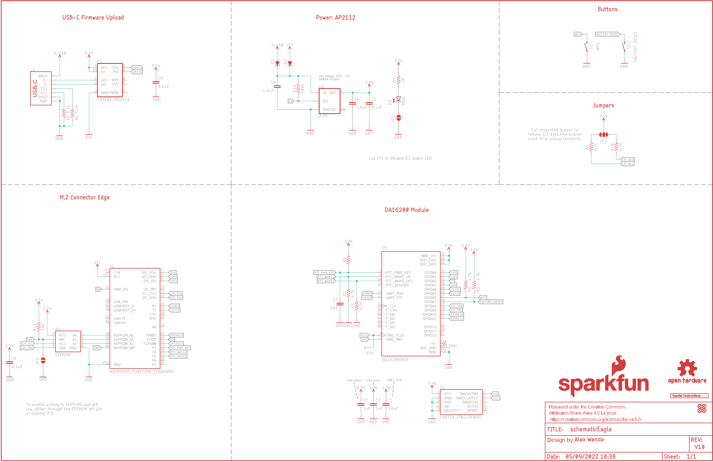
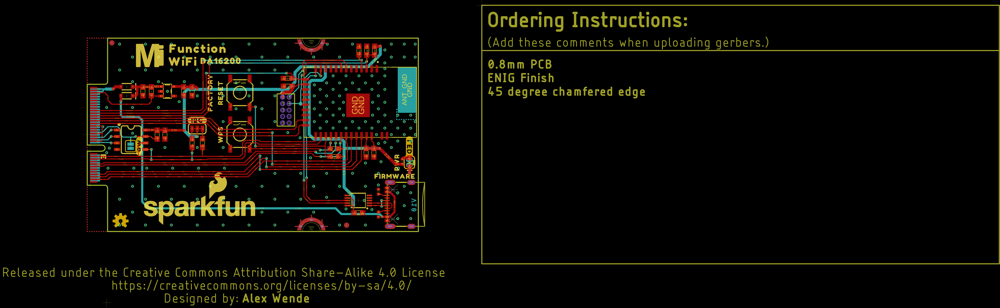
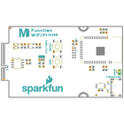
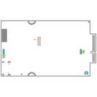
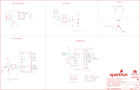

Contents
========

* [PRS18594 > MicroMod DA16200 Function](#prs18594--micromod-da16200-function)
	* [Schematic](#schematic)
	* [PCB](#pcb)
	* [Interactive BOM](#interactive-bom)
	* [Images](#images)
	* [Tags](#tags)
  
![][im]
# PRS18594 > MicroMod DA16200 Function

- ID: PROJ-SPAR-18594-STAN-01
- Hex ID: PRS18594
- Name: Sparkfun
- Description: Sparkfun
- Long Link: [http://oom.lt/PROJ-SPAR-18594-STAN-01](http://oom.lt/PROJ-SPAR-18594-STAN-01)
- Short Link: [http://oom.lt/PRS18594](http://oom.lt/PRS18594)

## Schematic
  

## PCB
  

## Interactive BOM

- Interactive BOM page: [ibom.html](https://htmlpreview.github.io/?https://github.com/oomlout/oomlout_OOMP_projects/blob/main/PROJ-SPAR-18594-STAN-01/kicad/bom/ibom.html)

## Images
  
  

|bominteractivefront|bominteractiveback|kicadPcb3d|kicadPcb3dFront|kicadPcb3dBack|eagleImage|eagleSchemImage|
| :---: | :---: | :---: | :---: | :---: | :---: | :---: |
||||||||

## Tags

- hexID: PRS18594
- oompType: PROJ
- oompSize: SPAR
- oompColor: 18594
- oompDesc: STAN
- oompIndex: 01
- oompName: MicroMod DA16200 Function
- sources: All source files from https://github.com/sparkfun/MicroMod_DA16200_Function (source licence details in srcLicense.md)
- linkBuyPage: https://www.sparkfun.com/products/18594
- oompID: PROJ-SPAR-18594-STAN-01

[im]: kicadPcb3d_450.png
