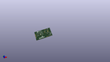

Contents
========

* [PROJ-SPAR-18594-STAN-01>MicroMod DA16200 Function](#proj-spar-18594-stan-01micromod-da16200-function)
	* [Images](#images)
	* [Interactive BOM](#interactive-bom)
	* [OOMP Parts](#oomp-parts)
	* [Tags](#tags)
  
![][im]
# PROJ-SPAR-18594-STAN-01>MicroMod DA16200 Function

- ID: PROJ-SPAR-18594-STAN-01
- Hex ID: PRS18594
- Name: MicroMod DA16200 Function
- Description: 

## Images
  
  

|eagleImage|kicadPcb3dFront|kicadPcb3dBack|kicadPcb3d|
| :---: | :---: | :---: | :---: |
|||||

## Interactive BOM

- Interactive BOM page: [ibom.html](kicad/bom/ibom.html)

## OOMP Parts
  

|OOMP Parts|
| :---: |
|CAPC-0603-X-UNMATCHED-01, C1, 56.260999999999996, 15.493999999999998, 270,C1, 10uF, 0603, SparkFun-Capacitors, (2.215, 0.61), R270|
|CAPC-0603-X-UNMATCHED-01, C2, 39.37, 28.575, 180,C2, 1uF, 0603, SparkFun-Capacitors, (1.55, 1.125), R180|
|CAPC-0603-X-UNMATCHED-01, C3, 54.736999999999995, 15.493999999999998, 270,C3, 1uF, 0603, SparkFun-Capacitors, (2.155, 0.61), R270|
|CAPC-0603-X-UNMATCHED-01, C4, 18.923, 27.558999999999997, 270,C4, 1.0uF, 0603, SparkFun-Capacitors, (0.745, 1.085), R270|
|<table><tr><td></td><td> C5</td><td>[CAPC-0603-X-NF100-V50 SMD (0603) 100 nF Capacitor (Ceramic) 50v](https://github.com/oomlout/oomlout_OOMP_parts/tree/main/CAPC-0603-X-NF100-V50/)</td><td>[C6N100](https://github.com/oomlout/oomlout_OOMP_parts/tree/main/CAPC-0603-X-NF100-V50/)</td></tr></table>|
|CAPC-0603-X-UNMATCHED-01, C6, 10.921999999999999, 27.558999999999997, 270,C6, 1.0uF, 0603, SparkFun-Capacitors, (0.43, 1.085), R270|
|UNMATCHED-0603-X-UNMATCHED-01, C7, 54.864, 35.559999999999995, 90,C7, DNP, 0603, SparkFun-Capacitors, (2.16, 1.4), R90|
|<table><tr><td></td><td> C8</td><td>[CAPC-0603-X-NF100-V50 SMD (0603) 100 nF Capacitor (Ceramic) 50v](https://github.com/oomlout/oomlout_OOMP_parts/tree/main/CAPC-0603-X-NF100-V50/)</td><td>[C6N100](https://github.com/oomlout/oomlout_OOMP_parts/tree/main/CAPC-0603-X-NF100-V50/)</td></tr></table>|
|<table><tr><td></td><td> C9</td><td>[CAPC-0603-X-NF100-V50 SMD (0603) 100 nF Capacitor (Ceramic) 50v](https://github.com/oomlout/oomlout_OOMP_parts/tree/main/CAPC-0603-X-NF100-V50/)</td><td>[C6N100](https://github.com/oomlout/oomlout_OOMP_parts/tree/main/CAPC-0603-X-NF100-V50/)</td></tr></table>|
|UNMATCHED-UNMATCHED-X-UNMATCHED-01, D1, 7.746999999999999, 26.669999999999998, 180,D1, SOD-323, SparkFun-DiscreteSemi, (0.305, 1.05), R180|
|UNMATCHED-UNMATCHED-X-UNMATCHED-01, D2, 7.746999999999999, 28.448, 180,D2, SOD-323, SparkFun-DiscreteSemi, (0.305, 1.12), R180|
|UNMATCHED-0603-X-UNMATCHED-01, D3, 63.2968, 13.589, 270,D3, RED, LED-0603, SparkFun-MicroMod-Function, (2.492, 0.535), R270|
|UNMATCHED-UNMATCHED-X-UNMATCHED-01, J1, 0.0, 19.000000099999998, 270,J1, MICROMOD_FUNCTION_STANDARD, M.2-CARD-E-22_FUNCTION_STANDARD, SparkFun-MicroMod, (0, 0.7480315), R270|
|UNMATCHED-UNMATCHED-X-UNMATCHED-01, J2, 38.989, 23.875999999999998, 270,J2, CORTEX_JTAG_DEBUG, 2X5-PTH-1.27MM-NO_SILK, SparkFun-Connectors, (1.535, 0.94), R270|
|UNMATCHED-UNMATCHED-X-UNMATCHED-01, J3, 58.547000000000004, 5.334, 90,J3, USB-C-16P-2LAYER-PADS, SparkFun-Connectors, (2.305, 0.21), R90|
|UNMATCHED-UNMATCHED-X-UNMATCHED-01, JP1, 63.246, 13.589, M270,JP1, JUMPER-SMT_2_NC_TRACE_SILK, SMT-JUMPER_2_NC_TRACE_SILK, SparkFun-Jumpers, (2.49, 0.535), MR270|
|UNMATCHED-UNMATCHED-X-UNMATCHED-01, JP2, 21.59, 20.193, 0,JP2, JUMPER-SMT_3_2-NC_TRACE_SILK, SMT-JUMPER_3_2-NC_TRACE_SILK, SparkFun-Jumpers, (0.85, 0.795), R0|
|UNMATCHED-UNMATCHED-X-UNMATCHED-01, JP3, 8.509, 16.764, M90,JP3, JUMPER-SMT_2_NO_SILK, SMT-JUMPER_2_NO_SILK, SparkFun-Jumpers, (0.335, 0.66), MR90|
|RESE-0603-X-UNMATCHED-01, R1, 56.388000000000005, 35.559999999999995, 90,R1, 0603, SparkFun-Resistors, (2.22, 1.4), R90|
|RESE-0603-X-UNMATCHED-01, R2, 53.339999999999996, 35.559999999999995, 270,R2, 4.7k, 0603, SparkFun-Resistors, (2.1, 1.4), R270|
|RESE-0603-X-UNMATCHED-01, R3, 39.37, 30.099, 0,R3, 4.7k, 0603, SparkFun-Resistors, (1.55, 1.185), R0|
|RESE-0603-X-UNMATCHED-01, R4, 48.513999999999996, 16.256, 0,R4, 4.7k, 0603, SparkFun-Resistors, (1.91, 0.64), R0|
|RESE-0603-X-UNMATCHED-01, R5, 48.513999999999996, 14.731999999999998, 0,R5, 4.7k, 0603, SparkFun-Resistors, (1.91, 0.58), R0|
|RESE-0603-X-UNMATCHED-01, R6, 22.605999999999998, 17.399, 90,R6, 4.7k, 0603, SparkFun-Resistors, (0.89, 0.685), R90|
|RESE-0402-X-UNMATCHED-01, R7, 61.849, 13.7414, 270,R7, 1k, 0402-TIGHT, SparkFun-Resistors, (2.435, 0.541), R270|
|RESE-0402-X-UNMATCHED-01, R8, 57.15, 3.3448000159999998, 90,R8, 5.1k, 0402-TIGHT, SparkFun-Resistors, (2.25, 0.13168504), R90|
|RESE-0402-X-UNMATCHED-01, R9, 57.15, 7.823199999999999, 270,R9, 5.1k, 0402-TIGHT, SparkFun-Resistors, (2.25, 0.308), R270|
|RESE-0603-X-UNMATCHED-01, R10, 20.574, 17.399, 90,R10, 4.7k, 0603, SparkFun-Resistors, (0.81, 0.685), R90|
|<table><tr><td></td><td> R11</td><td>[RESE-0603-X-O103-01 SMD (0603) 10k Ohm Resistor](https://github.com/oomlout/oomlout_OOMP_parts/tree/main/RESE-0603-X-O103-01/)</td><td>[R6103](https://github.com/oomlout/oomlout_OOMP_parts/tree/main/RESE-0603-X-O103-01/)</td></tr></table>|
|<table><tr><td></td><td> R12</td><td>[RESE-0603-X-O104-01 SMD (0603) 100k Ohm Resistor](https://github.com/oomlout/oomlout_OOMP_parts/tree/main/RESE-0603-X-O104-01/)</td><td>[R6104](https://github.com/oomlout/oomlout_OOMP_parts/tree/main/RESE-0603-X-O104-01/)</td></tr></table>|
|UNMATCHED-UNMATCHED-X-UNMATCHED-01, S1, 29.971999999999998, 19.049999999999997, 90,S1, WPS, TACTILE_SWITCH_SMD_5.2MM, SparkFun-Switches, (1.18, 0.75), R90|
|UNMATCHED-UNMATCHED-X-UNMATCHED-01, S2, 29.971999999999998, 27.2796, 90,S2, FACTORY_RESET, TACTILE_SWITCH_SMD_5.2MM, SparkFun-Switches, (1.18, 1.074), R90|
|UNMATCHED-UNMATCHED-X-UNMATCHED-01, U1, 53.593999999999994, 25.4, 270,U1, DA16200MOD, XCVR_DA16200MOD-AAC4WA32, DA16200MOD, (2.11, 1), R270|
|UNMATCHED-UNMATCHED-X-UNMATCHED-01, U2, 53.213, 6.095999999999999, 180,U2, CH340E_MSOP10, MSOP10, SparkFun-IC-Comms, (2.095, 0.24), R180|
|UNMATCHED-UNMATCHED-X-UNMATCHED-01, U3, 15.748, 27.558999999999997, 270,U3, 3.3V, SOT23-5, SparkFun-IC-Power, (0.62, 1.085), R270|
|UNMATCHED-UNMATCHED-X-UNMATCHED-01, U4, 8.636000000000001, 18.034, 270,U4, EEPROM, SO08, SparkFun-IC-Memory, (0.34, 0.71), R270|

## Tags

- hexID: PRS18594
- oompType: PROJ
- oompSize: SPAR
- oompColor: 18594
- oompDesc: STAN
- oompIndex: 01
- oompName: MicroMod DA16200 Function
- sources: All source files from https://github.com/sparkfun/MicroMod_DA16200_Function (source licence details in srcLicense.md)
- linkBuyPage: https://www.sparkfun.com/products/18594
- oompID: PROJ-SPAR-18594-STAN-01
- oompPart: CAPC-0603-X-UNMATCHED-01, C1, 56.260999999999996, 15.493999999999998, 270
- oompPart: CAPC-0603-X-UNMATCHED-01, C2, 39.37, 28.575, 180
- oompPart: CAPC-0603-X-UNMATCHED-01, C3, 54.736999999999995, 15.493999999999998, 270
- oompPart: CAPC-0603-X-UNMATCHED-01, C4, 18.923, 27.558999999999997, 270
- oompPart: CAPC-0603-X-NF100-V50, C5, 20.574, 27.558999999999997, 270
- oompPart: CAPC-0603-X-UNMATCHED-01, C6, 10.921999999999999, 27.558999999999997, 270
- oompPart: UNMATCHED-0603-X-UNMATCHED-01, C7, 54.864, 35.559999999999995, 90
- oompPart: CAPC-0603-X-NF100-V50, C8, 53.213, 3.6829999999999994, 0
- oompPart: CAPC-0603-X-NF100-V50, C9, 15.239999999999998, 19.049999999999997, 270
- oompPart: UNMATCHED-UNMATCHED-X-UNMATCHED-01, D1, 7.746999999999999, 26.669999999999998, 180
- oompPart: UNMATCHED-UNMATCHED-X-UNMATCHED-01, D2, 7.746999999999999, 28.448, 180
- oompPart: UNMATCHED-0603-X-UNMATCHED-01, D3, 63.2968, 13.589, 270
- oompPart: SKIP-UNMATCHED-X-UNMATCHED-01, FD1, 4.826, 37.083999999999996, 0
- oompPart: SKIP-UNMATCHED-X-UNMATCHED-01, FD2, 4.826, 37.083999999999996, M0
- oompPart: SKIP-UNMATCHED-X-UNMATCHED-01, FD3, 50.901599999999995, 1.2446, 0
- oompPart: SKIP-UNMATCHED-X-UNMATCHED-01, FD4, 50.901599999999995, 1.2446, M0
- oompPart: UNMATCHED-UNMATCHED-X-UNMATCHED-01, J1, 0.0, 19.000000099999998, 270
- oompPart: UNMATCHED-UNMATCHED-X-UNMATCHED-01, J2, 38.989, 23.875999999999998, 270
- oompPart: UNMATCHED-UNMATCHED-X-UNMATCHED-01, J3, 58.547000000000004, 5.334, 90
- oompPart: UNMATCHED-UNMATCHED-X-UNMATCHED-01, JP1, 63.246, 13.589, M270
- oompPart: UNMATCHED-UNMATCHED-X-UNMATCHED-01, JP2, 21.59, 20.193, 0
- oompPart: UNMATCHED-UNMATCHED-X-UNMATCHED-01, JP3, 8.509, 16.764, M90
- oompPart: RESE-0603-X-UNMATCHED-01, R1, 56.388000000000005, 35.559999999999995, 90
- oompPart: RESE-0603-X-UNMATCHED-01, R2, 53.339999999999996, 35.559999999999995, 270
- oompPart: RESE-0603-X-UNMATCHED-01, R3, 39.37, 30.099, 0
- oompPart: RESE-0603-X-UNMATCHED-01, R4, 48.513999999999996, 16.256, 0
- oompPart: RESE-0603-X-UNMATCHED-01, R5, 48.513999999999996, 14.731999999999998, 0
- oompPart: RESE-0603-X-UNMATCHED-01, R6, 22.605999999999998, 17.399, 90
- oompPart: RESE-0402-X-UNMATCHED-01, R7, 61.849, 13.7414, 270
- oompPart: RESE-0402-X-UNMATCHED-01, R8, 57.15, 3.3448000159999998, 90
- oompPart: RESE-0402-X-UNMATCHED-01, R9, 57.15, 7.823199999999999, 270
- oompPart: RESE-0603-X-UNMATCHED-01, R10, 20.574, 17.399, 90
- oompPart: RESE-0603-X-O103-01, R11, 13.716, 19.049999999999997, 90
- oompPart: RESE-0603-X-O104-01, R12, 12.572999999999999, 27.558999999999997, 270
- oompPart: UNMATCHED-UNMATCHED-X-UNMATCHED-01, S1, 29.971999999999998, 19.049999999999997, 90
- oompPart: UNMATCHED-UNMATCHED-X-UNMATCHED-01, S2, 29.971999999999998, 27.2796, 90
- oompPart: SKIP-UNMATCHED-X-UNMATCHED-01, TP1, 41.91, 25.145999999999997, M0
- oompPart: UNMATCHED-UNMATCHED-X-UNMATCHED-01, U1, 53.593999999999994, 25.4, 270
- oompPart: UNMATCHED-UNMATCHED-X-UNMATCHED-01, U2, 53.213, 6.095999999999999, 180
- oompPart: UNMATCHED-UNMATCHED-X-UNMATCHED-01, U3, 15.748, 27.558999999999997, 270
- oompPart: UNMATCHED-UNMATCHED-X-UNMATCHED-01, U4, 8.636000000000001, 18.034, 270
- rawPart: C1, 10uF, 0603, SparkFun-Capacitors, (2.215, 0.61), R270
- rawPart: C2, 1uF, 0603, SparkFun-Capacitors, (1.55, 1.125), R180
- rawPart: C3, 1uF, 0603, SparkFun-Capacitors, (2.155, 0.61), R270
- rawPart: C4, 1.0uF, 0603, SparkFun-Capacitors, (0.745, 1.085), R270
- rawPart: C5, 0.1uF, 0603, SparkFun-Capacitors, (0.81, 1.085), R270
- rawPart: C6, 1.0uF, 0603, SparkFun-Capacitors, (0.43, 1.085), R270
- rawPart: C7, DNP, 0603, SparkFun-Capacitors, (2.16, 1.4), R90
- rawPart: C8, 0.1uF, 0603, SparkFun-Capacitors, (2.095, 0.145), R0
- rawPart: C9, 0.1uF, 0603, SparkFun-Capacitors, (0.6, 0.75), R270
- rawPart: D1, SOD-323, SparkFun-DiscreteSemi, (0.305, 1.05), R180
- rawPart: D2, SOD-323, SparkFun-DiscreteSemi, (0.305, 1.12), R180
- rawPart: D3, RED, LED-0603, SparkFun-MicroMod-Function, (2.492, 0.535), R270
- rawPart: FD1, FIDUCIAL1X2, FIDUCIAL-1X2, SparkFun-Aesthetics, (0.19, 1.46), R0
- rawPart: FD2, FIDUCIAL1X2, FIDUCIAL-1X2, SparkFun-Aesthetics, (0.19, 1.46), MR0
- rawPart: FD3, FIDUCIAL1X2, FIDUCIAL-1X2, SparkFun-Aesthetics, (2.004, 0.049), R0
- rawPart: FD4, FIDUCIAL1X2, FIDUCIAL-1X2, SparkFun-Aesthetics, (2.004, 0.049), MR0
- rawPart: J1, MICROMOD_FUNCTION_STANDARD, M.2-CARD-E-22_FUNCTION_STANDARD, SparkFun-MicroMod, (0, 0.7480315), R270
- rawPart: J2, CORTEX_JTAG_DEBUG, 2X5-PTH-1.27MM-NO_SILK, SparkFun-Connectors, (1.535, 0.94), R270
- rawPart: J3, USB-C-16P-2LAYER-PADS, SparkFun-Connectors, (2.305, 0.21), R90
- rawPart: JP1, JUMPER-SMT_2_NC_TRACE_SILK, SMT-JUMPER_2_NC_TRACE_SILK, SparkFun-Jumpers, (2.49, 0.535), MR270
- rawPart: JP2, JUMPER-SMT_3_2-NC_TRACE_SILK, SMT-JUMPER_3_2-NC_TRACE_SILK, SparkFun-Jumpers, (0.85, 0.795), R0
- rawPart: JP3, JUMPER-SMT_2_NO_SILK, SMT-JUMPER_2_NO_SILK, SparkFun-Jumpers, (0.335, 0.66), MR90
- rawPart: R1, 0603, SparkFun-Resistors, (2.22, 1.4), R90
- rawPart: R2, 4.7k, 0603, SparkFun-Resistors, (2.1, 1.4), R270
- rawPart: R3, 4.7k, 0603, SparkFun-Resistors, (1.55, 1.185), R0
- rawPart: R4, 4.7k, 0603, SparkFun-Resistors, (1.91, 0.64), R0
- rawPart: R5, 4.7k, 0603, SparkFun-Resistors, (1.91, 0.58), R0
- rawPart: R6, 4.7k, 0603, SparkFun-Resistors, (0.89, 0.685), R90
- rawPart: R7, 1k, 0402-TIGHT, SparkFun-Resistors, (2.435, 0.541), R270
- rawPart: R8, 5.1k, 0402-TIGHT, SparkFun-Resistors, (2.25, 0.13168504), R90
- rawPart: R9, 5.1k, 0402-TIGHT, SparkFun-Resistors, (2.25, 0.308), R270
- rawPart: R10, 4.7k, 0603, SparkFun-Resistors, (0.81, 0.685), R90
- rawPart: R11, 10k, 0603, SparkFun-Resistors, (0.54, 0.75), R90
- rawPart: R12, 100k, 0603, SparkFun-Resistors, (0.495, 1.085), R270
- rawPart: S1, WPS, TACTILE_SWITCH_SMD_5.2MM, SparkFun-Switches, (1.18, 0.75), R90
- rawPart: S2, FACTORY_RESET, TACTILE_SWITCH_SMD_5.2MM, SparkFun-Switches, (1.18, 1.074), R90
- rawPart: TP1, PAD.03X.03, SparkFun-Connectors, (1.65, 0.99), MR0
- rawPart: U1, DA16200MOD, XCVR_DA16200MOD-AAC4WA32, DA16200MOD, (2.11, 1), R270
- rawPart: U2, CH340E_MSOP10, MSOP10, SparkFun-IC-Comms, (2.095, 0.24), R180
- rawPart: U3, 3.3V, SOT23-5, SparkFun-IC-Power, (0.62, 1.085), R270
- rawPart: U4, EEPROM, SO08, SparkFun-IC-Memory, (0.34, 0.71), R270

[im]: kicadPcb3d_450.png
