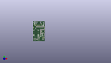
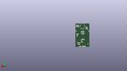

Contents
========

* [PROJ-SPAR-18708-STAN-01>MicroMod Function Ethernet-W5500](#proj-spar-18708-stan-01micromod-function-ethernet-w5500)
	* [Images](#images)
	* [Interactive BOM](#interactive-bom)
	* [OOMP Parts](#oomp-parts)
	* [Tags](#tags)
  
![][im]
# PROJ-SPAR-18708-STAN-01>MicroMod Function Ethernet-W5500

- ID: PROJ-SPAR-18708-STAN-01
- Hex ID: PRS18708
- Name: MicroMod Function Ethernet-W5500
- Description: 

## Images
  
  

|eagleImage|kicadPcb3dFront|kicadPcb3dBack|kicadPcb3d|
| :---: | :---: | :---: | :---: |
|||||

## Interactive BOM

- Interactive BOM page: [ibom.html](kicad/bom/ibom.html)

## OOMP Parts
  

|OOMP Parts|
| :---: |
|CAPE-0603-X-NF100-01, C1, 36.0, 20.0, 0,C1, 0.1uF, 0603, SparkFun-Capacitors, (36, 20), R0|
|CAPE-0603-X-NF100-01, C2, 25.0, 36.0, 180,C2, 0.1uF, 0603, SparkFun-Capacitors, (25, 36), R180|
|CAPE-0603-X-NF100-01, C3, 36.0, 12.0, 0,C3, 0.1uF, 0603, SparkFun-Capacitors, (36, 12), R0|
|CAPE-0603-X-NF100-01, C4, 17.0, 11.0, 180,C4, 0.1uF, 0603, SparkFun-Capacitors, (17, 11), R180|
|CAPE-0603-X-UNMATCHED-01, C5, 32.3, 25.0, 270,C5, 10pF, 0603, SparkFun-Capacitors, (32.3, 25), R270|
|CAPE-0603-X-UNMATCHED-01, C6, 27.5, 25.0, 270,C6, 10pF, 0603, SparkFun-Capacitors, (27.5, 25), R270|
|CAPE-0805-X-UNMATCHED-01, C7, 21.2, 17.0, 270,C7, 10uF, 0805, SparkFun-Capacitors, (21.2, 17), R270|
|CAPE-UNMATCHED-X-UNMATCHED-01, C8, 30.0, 17.0, 90,C8, 100uF, PANASONIC_D, SparkFun-Capacitors, (30, 17), R90|
|CAPE-0603-X-UNMATCHED-01, C9, 36.0, 18.0, 0,C9, 10uF, 0603, SparkFun-Capacitors, (36, 18), R0|
|CAPE-0603-X-NF100-01, C10, 31.0, 39.0, 90,C10, 0.1uF, 0603, SparkFun-Capacitors, (31, 39), R90|
|CAPE-0603-X-NF100-01, C11, 25.0, 30.0, 180,C11, 0.1uF, 0603, SparkFun-Capacitors, (25, 30), R180|
|CAPE-0603-X-NF100-01, C12, 27.0, 39.0, 90,C12, 0.1uF, 0603, SparkFun-Capacitors, (27, 39), R90|
|CAPE-0603-X-UNMATCHED-01, C13, 36.0, 10.0, 0,C13, 1.0uF, 0603, SparkFun-Capacitors, (36, 10), R0|
|CAPE-0603-X-NF100-01, C14, 25.0, 39.0, 90,C14, 0.1uF, 0603, SparkFun-Capacitors, (25, 39), R90|
|CAPE-0603-X-NF100-01, C15, 25.0, 34.0, 180,C15, 0.1uF, 0603, SparkFun-Capacitors, (25, 34), R180|
|CAPE-0603-X-UNMATCHED-01, C16, 25.0, 24.0, 180,C16, 10uF, 0603, SparkFun-Capacitors, (25, 24), R180|
|CAPE-0603-X-UNMATCHED-01, C17, 25.0, 28.0, 180,C17, 10nF, 0603, SparkFun-Capacitors, (25, 28), R180|
|CAPE-0603-X-UNMATCHED-01, C18, 25.0, 32.0, 180,C18, 4.7uF, 0603, SparkFun-Capacitors, (25, 32), R180|
|CAPE-UNMATCHED-X-UNMATCHED-01, C19, 9.0, 42.0, 0,C19, 1nF, 1206, SparkFun-Capacitors, (9, 42), R0|
|CAPE-0603-X-UNMATCHED-01, C20, 22.0, 46.0, 270,C20, 10nF, 0603, SparkFun-Capacitors, (22, 46), R270|
|CAPE-0603-X-UNMATCHED-01, C21, 18.0, 46.0, 90,C21, 6.8nF, 0603, SparkFun-Capacitors, (18, 46), R90|
|CAPE-0603-X-UNMATCHED-01, C22, 14.0, 46.0, 90,C22, 6.8nF, 0603, SparkFun-Capacitors, (14, 46), R90|
|CAPE-0603-X-UNMATCHED-01, C23, 24.0, 46.0, 270,C23, 22nF, 0603, SparkFun-Capacitors, (24, 46), R270|
|CAPE-0603-X-UNMATCHED-01, C24, 35.99, 22.05, 0,C24, 1.0uF, 0603, SparkFun-Capacitors, (35.99, 22.05), R0|
|CAPE-0805-X-UNMATCHED-01, C25, 23.0, 17.0, 270,C25, 10uF, 0805, SparkFun-Capacitors, (23, 17), R270|
|CAPE-0805-X-UNMATCHED-01, C26, 29.0, 22.0, 0,C26, 10uF, 0805, SparkFun-Capacitors, (29, 22), R0|
|UNMATCHED-UNMATCHED-X-UNMATCHED-01, D1, 25.0, 20.0, 0,D1, 3A/10V/280mV, SOD-323, SparkFun-DiscreteSemi, (25, 20), R0|
|UNMATCHED-0603-X-UNMATCHED-01, D2, 31.0, 6.0, 0,D2, RED, LED-0603, SparkFun-LED, (31, 6), R0|
|UNMATCHED-0603-X-UNMATCHED-01, D5, 34.0, 56.0, 90,D5, Yellow, LED-0603, SparkFun-LED, (34, 56), R90|
|UNMATCHED-UNMATCHED-X-UNMATCHED-01, D7, 29.0, 51.0, 180,D7, DT1042-04SO, SOT-23-6, SparkFun-DiscreteSemi, (29, 51), R180|
|UNMATCHED-0603-X-UNMATCHED-01, FB2, 25.0, 22.0, 0,FB2, 470?, 0603, SparkFun-Coils, (25, 22), R0|
|UNMATCHED-UNMATCHED-X-UNMATCHED-01, FD1, 1.05, 5.0, 90,FD1, FIDUCIALUFIDUCIAL, FIDUCIAL-MICRO, SparkFun-Aesthetics, (1.05, 5), R90|
|UNMATCHED-UNMATCHED-X-UNMATCHED-01, FD2, 37.05, 64.0, 90,FD2, FIDUCIALUFIDUCIAL, FIDUCIAL-MICRO, SparkFun-Aesthetics, (37.05, 64), R90|
|UNMATCHED-UNMATCHED-X-UNMATCHED-01, FD3, 37.05, 5.0, M270,FD3, FIDUCIALUFIDUCIAL, FIDUCIAL-MICRO, SparkFun-Aesthetics, (37.05, 5), MR270|
|UNMATCHED-UNMATCHED-X-UNMATCHED-01, FD4, 1.05, 64.0, M270,FD4, FIDUCIALUFIDUCIAL, FIDUCIAL-MICRO, SparkFun-Aesthetics, (1.05, 64), MR270|
|UNMATCHED-UNMATCHED-X-UNMATCHED-01, ISO1, 7.0, 50.0, M0,ISO1, JUMPER-COMBO_2_NC_TRACE, COMBO-JUMPER_2_NC_TRACE, SparkFun-Jumpers, (7, 50), MR0|
|UNMATCHED-UNMATCHED-X-UNMATCHED-01, ISO2, 7.0, 53.0, M0,ISO2, JUMPER-COMBO_2_NC_TRACE, COMBO-JUMPER_2_NC_TRACE, SparkFun-Jumpers, (7, 53), MR0|
|UNMATCHED-UNMATCHED-X-UNMATCHED-01, J1, 19.0, 59.0, 180,J1, MAGJACK-POE, MAGJACK-SYM_LED, SparkFun-Connectors, (19, 59), R180|
|UNMATCHED-UNMATCHED-X-UNMATCHED-01, J11, 19.05, 0.0, 0,J11, MICROMOD_STANDARD, M.2-CARD-E-22_FUNCTION_STANDARD, SparkFun-MicroMod-Function, (19.05, 0), R0|
|UNMATCHED-UNMATCHED-X-UNMATCHED-01, JP1, 34.0, 34.0, M180,JP1, JUMPER-SMT_2_NO_SILK, SMT-JUMPER_2_NO_SILK, SparkFun-Jumpers, (34, 34), MR180|
|UNMATCHED-UNMATCHED-X-UNMATCHED-01, JP2, 34.0, 32.0, M180,JP2, JUMPER-SMT_2_NO_SILK, SMT-JUMPER_2_NO_SILK, SparkFun-Jumpers, (34, 32), MR180|
|UNMATCHED-UNMATCHED-X-UNMATCHED-01, JP3, 34.0, 30.0, M180,JP3, JUMPER-SMT_2_NO_SILK, SMT-JUMPER_2_NO_SILK, SparkFun-Jumpers, (34, 30), MR180|
|UNMATCHED-UNMATCHED-X-UNMATCHED-01, JP5, 22.0, 13.0, M0,JP5, JUMPER-SMT_2_NO_SILK, SMT-JUMPER_2_NO_SILK, SparkFun-Jumpers, (22, 13), MR0|
|UNMATCHED-0805-X-UNMATCHED-01, L1, 25.0, 17.0, 270,L1, 2.2uH, 0805-WIDE, SparkFun-Coils, (25, 17), R270|
|UNMATCHED-UNMATCHED-X-UNMATCHED-01, LED1, 30.0, 60.0, M270,LED1, JUMPER-SMT_2_NC_TRACE_SILK, SMT-JUMPER_2_NC_TRACE_SILK, SparkFun-Jumpers, (30, 60), MR270|
|UNMATCHED-UNMATCHED-X-UNMATCHED-01, LED2, 33.0, 60.0, M270,LED2, JUMPER-SMT_2_NC_TRACE_SILK, SMT-JUMPER_2_NC_TRACE_SILK, SparkFun-Jumpers, (33, 60), MR270|
|UNMATCHED-UNMATCHED-X-UNMATCHED-01, LOAD, 22.0, 16.0, M180,LOAD, JUMPER-SMT_2_NC_TRACE_SILK, SMT-JUMPER_2_NC_TRACE_SILK, SparkFun-Jumpers, (22, 16), MR180|
|UNMATCHED-UNMATCHED-X-UNMATCHED-01, MEAS, 32.0, 11.0, M180,MEAS, JUMPER-COMBO_2_NC_TRACE, COMBO-JUMPER_2_NC_TRACE, SparkFun-Jumpers, (32, 11), MR180|
|UNMATCHED-UNMATCHED-X-UNMATCHED-01, POE, 18.0, 22.0, M0,POE, SMT-JUMPER_2_NC_TRACE_SILK, SparkFun-Jumpers, (18, 22), MR0|
|UNMATCHED-UNMATCHED-X-UNMATCHED-01, POE_LED, 36.0, 60.0, M270,POE_LED, JUMPER-SMT_2_NC_TRACE_SILK, SMT-JUMPER_2_NC_TRACE_SILK, SparkFun-Jumpers, (36, 60), MR270|
|UNMATCHED-UNMATCHED-X-UNMATCHED-01, PWR_LED, 31.0, 7.0, M0,PWR_LED, JUMPER-SMT_2_NC_TRACE_SILK, SMT-JUMPER_2_NC_TRACE_SILK, SparkFun-Jumpers, (31, 7), MR0|
|UNMATCHED-UNMATCHED-X-UNMATCHED-01, Q1, 8.0, 6.0, 90,Q1, 220mA/50V/3.5?, SOT23-3, SparkFun-DiscreteSemi, (8, 6), R90|
|UNMATCHED-UNMATCHED-X-UNMATCHED-01, Q5, 4.0, 6.0, 90,Q5, 20V/4.2A/52m?/1.4W, SOT23-3, SparkFun-DiscreteSemi, (4, 6), R90|
|RESE-0603-X-UNMATCHED-01, R1, 29.9, 26.0, 180,R1, 1M, 0603, SparkFun-Resistors, (29.9, 26), R180|
|ERROR, R2 49.9 1/2W, 0, 0, 0,R2, 49.9, 1/2W, 1206, SparkFun-Resistors, (17, 15), R0|
|RESE-0603-X-UNMATCHED-01, R3, 34.0, 61.0, 270,R3, 1k, 0603, SparkFun-Resistors, (34, 61), R270|
|<table><tr><td></td><td> R4</td><td>[RESE-0603-X-O103-01 SMD (0603) 10k Ohm Resistor](https://github.com/oomlout/oomlout_OOMP_parts/tree/main/RESE-0603-X-O103-01/)</td><td>[R6103](https://github.com/oomlout/oomlout_OOMP_parts/tree/main/RESE-0603-X-O103-01/)</td></tr></table>|
|RESE-0603-X-UNMATCHED-01, R5, 36.0, 61.0, 270,R5, 1k, 0603, SparkFun-Resistors, (36, 61), R270|
|<table><tr><td></td><td> R6</td><td>[RESE-0603-X-O103-01 SMD (0603) 10k Ohm Resistor](https://github.com/oomlout/oomlout_OOMP_parts/tree/main/RESE-0603-X-O103-01/)</td><td>[R6103](https://github.com/oomlout/oomlout_OOMP_parts/tree/main/RESE-0603-X-O103-01/)</td></tr></table>|
|<table><tr><td></td><td> R7</td><td>[RESE-0603-X-O103-01 SMD (0603) 10k Ohm Resistor](https://github.com/oomlout/oomlout_OOMP_parts/tree/main/RESE-0603-X-O103-01/)</td><td>[R6103](https://github.com/oomlout/oomlout_OOMP_parts/tree/main/RESE-0603-X-O103-01/)</td></tr></table>|
|RESE-0603-X-UNMATCHED-01, R8, 29.0, 39.0, 270,R8, 12.4k, 0603, SparkFun-Resistors, (29, 39), R270|
|<table><tr><td></td><td> R9</td><td>[RESE-0603-X-O103-01 SMD (0603) 10k Ohm Resistor](https://github.com/oomlout/oomlout_OOMP_parts/tree/main/RESE-0603-X-O103-01/)</td><td>[R6103](https://github.com/oomlout/oomlout_OOMP_parts/tree/main/RESE-0603-X-O103-01/)</td></tr></table>|
|<table><tr><td></td><td> R10</td><td>[RESE-0603-X-O103-01 SMD (0603) 10k Ohm Resistor](https://github.com/oomlout/oomlout_OOMP_parts/tree/main/RESE-0603-X-O103-01/)</td><td>[R6103](https://github.com/oomlout/oomlout_OOMP_parts/tree/main/RESE-0603-X-O103-01/)</td></tr></table>|
|RESE-0603-X-UNMATCHED-01, R11, 36.0, 56.0, 90,R11, 1k, 0603, SparkFun-Resistors, (36, 56), R90|
|<table><tr><td></td><td> R12</td><td>[RESE-0603-X-O103-01 SMD (0603) 10k Ohm Resistor](https://github.com/oomlout/oomlout_OOMP_parts/tree/main/RESE-0603-X-O103-01/)</td><td>[R6103](https://github.com/oomlout/oomlout_OOMP_parts/tree/main/RESE-0603-X-O103-01/)</td></tr></table>|
|RESE-0603-X-UNMATCHED-01, R13, 16.0, 46.0, 90,R13, 49.9, 0603, SparkFun-Resistors, (16, 46), R90|
|RESE-0603-X-UNMATCHED-01, R14, 32.0, 46.0, 90,R14, 33, 0603, SparkFun-Resistors, (32, 46), R90|
|RESE-0603-X-UNMATCHED-01, R15, 34.0, 46.0, 90,R15, 33, 0603, SparkFun-Resistors, (34, 46), R90|
|RESE-0603-X-UNMATCHED-01, R16, 10.0, 46.0, 90,R16, 33, 0603, SparkFun-Resistors, (10, 46), R90|
|RESE-0603-X-UNMATCHED-01, R17, 12.0, 46.0, 90,R17, 33, 0603, SparkFun-Resistors, (12, 46), R90|
|RESE-0603-X-UNMATCHED-01, R18, 20.0, 46.0, 270,R18, 49.9, 0603, SparkFun-Resistors, (20, 46), R270|
|RESE-0603-X-UNMATCHED-01, R19, 30.0, 46.0, 270,R19, 49.9, 0603, SparkFun-Resistors, (30, 46), R270|
|RESE-0603-X-UNMATCHED-01, R20, 28.0, 46.0, 270,R20, 49.9, 0603, SparkFun-Resistors, (28, 46), R270|
|RESE-0603-X-UNMATCHED-01, R21, 26.0, 46.0, 270,R21, 10, 0603, SparkFun-Resistors, (26, 46), R270|
|<table><tr><td></td><td> R22</td><td>[RESE-0603-X-O103-01 SMD (0603) 10k Ohm Resistor](https://github.com/oomlout/oomlout_OOMP_parts/tree/main/RESE-0603-X-O103-01/)</td><td>[R6103](https://github.com/oomlout/oomlout_OOMP_parts/tree/main/RESE-0603-X-O103-01/)</td></tr></table>|
|<table><tr><td></td><td> R23</td><td>[RESE-0603-X-O103-01 SMD (0603) 10k Ohm Resistor](https://github.com/oomlout/oomlout_OOMP_parts/tree/main/RESE-0603-X-O103-01/)</td><td>[R6103](https://github.com/oomlout/oomlout_OOMP_parts/tree/main/RESE-0603-X-O103-01/)</td></tr></table>|
|<table><tr><td></td><td> R24</td><td>[RESE-0603-X-O103-01 SMD (0603) 10k Ohm Resistor](https://github.com/oomlout/oomlout_OOMP_parts/tree/main/RESE-0603-X-O103-01/)</td><td>[R6103](https://github.com/oomlout/oomlout_OOMP_parts/tree/main/RESE-0603-X-O103-01/)</td></tr></table>|
|RESE-0603-X-UNMATCHED-01, R25, 31.0, 8.0, 0,R25, 1k, 0603, SparkFun-Resistors, (31, 8), R0|
|<table><tr><td></td><td> R30</td><td>[RESE-0603-X-O103-01 SMD (0603) 10k Ohm Resistor](https://github.com/oomlout/oomlout_OOMP_parts/tree/main/RESE-0603-X-O103-01/)</td><td>[R6103](https://github.com/oomlout/oomlout_OOMP_parts/tree/main/RESE-0603-X-O103-01/)</td></tr></table>|
|UNMATCHED-UNMATCHED-X-UNMATCHED-01, TP1, 33.0, 15.0, M0,TP1, TEST-POINT3X4, PAD.03X.04, SparkFun-Connectors, (33, 15), MR0|
|UNMATCHED-UNMATCHED-X-UNMATCHED-01, U1, 19.0, 7.0, 270,U1, EEPROM, SO08, SparkFun-IC-Memory, (19, 7), R270|
|UNMATCHED-UNMATCHED-X-UNMATCHED-01, U3, 32.0, 32.0, 180,U3, W5500, LQFP-48, SparkFun-IC-Comms, (32, 32), R180|
|UNMATCHED-UNMATCHED-X-UNMATCHED-01, U4, 36.0, 15.0, 0,U4, 3.3V, SOT23-5, SparkFun-IC-Power, (36, 15), R0|
|UNMATCHED-UNMATCHED-X-UNMATCHED-01, U5, 10.0, 28.0, 90,U5, POE_PSU-DP990X, DP990X, SparkFun-IC-Power, (10, 28), R90|
|UNMATCHED-UNMATCHED-X-UNMATCHED-01, Y1, 29.9, 24.0, 180,Y1, 25MHz, CRYSTAL-SMD-2.0X1.6MM, SparkFun-Clocks, (29.9, 24), R180|

## Tags

- hexID: PRS18708
- oompType: PROJ
- oompSize: SPAR
- oompColor: 18708
- oompDesc: STAN
- oompIndex: 01
- oompName: MicroMod Function Ethernet-W5500
- sources: All source files from https://github.com/sparkfun/MicroMod_Function_Ethernet-W5500 (source licence details in srcLicense.md)
- linkBuyPage: https://www.sparkfun.com/products/18708
- oompPart: CAPE-0603-X-NF100-01, C1, 36.0, 20.0, 0
- oompPart: CAPE-0603-X-NF100-01, C2, 25.0, 36.0, 180
- oompPart: CAPE-0603-X-NF100-01, C3, 36.0, 12.0, 0
- oompPart: CAPE-0603-X-NF100-01, C4, 17.0, 11.0, 180
- oompPart: CAPE-0603-X-UNMATCHED-01, C5, 32.3, 25.0, 270
- oompPart: CAPE-0603-X-UNMATCHED-01, C6, 27.5, 25.0, 270
- oompPart: CAPE-0805-X-UNMATCHED-01, C7, 21.2, 17.0, 270
- oompPart: CAPE-UNMATCHED-X-UNMATCHED-01, C8, 30.0, 17.0, 90
- oompPart: CAPE-0603-X-UNMATCHED-01, C9, 36.0, 18.0, 0
- oompPart: CAPE-0603-X-NF100-01, C10, 31.0, 39.0, 90
- oompPart: CAPE-0603-X-NF100-01, C11, 25.0, 30.0, 180
- oompPart: CAPE-0603-X-NF100-01, C12, 27.0, 39.0, 90
- oompPart: CAPE-0603-X-UNMATCHED-01, C13, 36.0, 10.0, 0
- oompPart: CAPE-0603-X-NF100-01, C14, 25.0, 39.0, 90
- oompPart: CAPE-0603-X-NF100-01, C15, 25.0, 34.0, 180
- oompPart: CAPE-0603-X-UNMATCHED-01, C16, 25.0, 24.0, 180
- oompPart: CAPE-0603-X-UNMATCHED-01, C17, 25.0, 28.0, 180
- oompPart: CAPE-0603-X-UNMATCHED-01, C18, 25.0, 32.0, 180
- oompPart: CAPE-UNMATCHED-X-UNMATCHED-01, C19, 9.0, 42.0, 0
- oompPart: CAPE-0603-X-UNMATCHED-01, C20, 22.0, 46.0, 270
- oompPart: CAPE-0603-X-UNMATCHED-01, C21, 18.0, 46.0, 90
- oompPart: CAPE-0603-X-UNMATCHED-01, C22, 14.0, 46.0, 90
- oompPart: CAPE-0603-X-UNMATCHED-01, C23, 24.0, 46.0, 270
- oompPart: CAPE-0603-X-UNMATCHED-01, C24, 35.99, 22.05, 0
- oompPart: CAPE-0805-X-UNMATCHED-01, C25, 23.0, 17.0, 270
- oompPart: CAPE-0805-X-UNMATCHED-01, C26, 29.0, 22.0, 0
- oompPart: UNMATCHED-UNMATCHED-X-UNMATCHED-01, D1, 25.0, 20.0, 0
- oompPart: UNMATCHED-0603-X-UNMATCHED-01, D2, 31.0, 6.0, 0
- oompPart: UNMATCHED-0603-X-UNMATCHED-01, D5, 34.0, 56.0, 90
- oompPart: UNMATCHED-UNMATCHED-X-UNMATCHED-01, D7, 29.0, 51.0, 180
- oompPart: UNMATCHED-0603-X-UNMATCHED-01, FB2, 25.0, 22.0, 0
- oompPart: UNMATCHED-UNMATCHED-X-UNMATCHED-01, FD1, 1.05, 5.0, 90
- oompPart: UNMATCHED-UNMATCHED-X-UNMATCHED-01, FD2, 37.05, 64.0, 90
- oompPart: UNMATCHED-UNMATCHED-X-UNMATCHED-01, FD3, 37.05, 5.0, M270
- oompPart: UNMATCHED-UNMATCHED-X-UNMATCHED-01, FD4, 1.05, 64.0, M270
- oompPart: UNMATCHED-UNMATCHED-X-UNMATCHED-01, ISO1, 7.0, 50.0, M0
- oompPart: UNMATCHED-UNMATCHED-X-UNMATCHED-01, ISO2, 7.0, 53.0, M0
- oompPart: UNMATCHED-UNMATCHED-X-UNMATCHED-01, J1, 19.0, 59.0, 180
- oompPart: UNMATCHED-UNMATCHED-X-UNMATCHED-01, J11, 19.05, 0.0, 0
- oompPart: UNMATCHED-UNMATCHED-X-UNMATCHED-01, JP1, 34.0, 34.0, M180
- oompPart: UNMATCHED-UNMATCHED-X-UNMATCHED-01, JP2, 34.0, 32.0, M180
- oompPart: UNMATCHED-UNMATCHED-X-UNMATCHED-01, JP3, 34.0, 30.0, M180
- oompPart: UNMATCHED-UNMATCHED-X-UNMATCHED-01, JP5, 22.0, 13.0, M0
- oompPart: UNMATCHED-0805-X-UNMATCHED-01, L1, 25.0, 17.0, 270
- oompPart: UNMATCHED-UNMATCHED-X-UNMATCHED-01, LED1, 30.0, 60.0, M270
- oompPart: UNMATCHED-UNMATCHED-X-UNMATCHED-01, LED2, 33.0, 60.0, M270
- oompPart: UNMATCHED-UNMATCHED-X-UNMATCHED-01, LOAD, 22.0, 16.0, M180
- oompPart: UNMATCHED-UNMATCHED-X-UNMATCHED-01, MEAS, 32.0, 11.0, M180
- oompPart: UNMATCHED-UNMATCHED-X-UNMATCHED-01, POE, 18.0, 22.0, M0
- oompPart: UNMATCHED-UNMATCHED-X-UNMATCHED-01, POE_LED, 36.0, 60.0, M270
- oompPart: UNMATCHED-UNMATCHED-X-UNMATCHED-01, PWR_LED, 31.0, 7.0, M0
- oompPart: UNMATCHED-UNMATCHED-X-UNMATCHED-01, Q1, 8.0, 6.0, 90
- oompPart: UNMATCHED-UNMATCHED-X-UNMATCHED-01, Q5, 4.0, 6.0, 90
- oompPart: RESE-0603-X-UNMATCHED-01, R1, 29.9, 26.0, 180
- oompPart: ERROR, R2 49.9 1/2W, 0, 0, 0
- oompPart: RESE-0603-X-UNMATCHED-01, R3, 34.0, 61.0, 270
- oompPart: RESE-0603-X-O103-01, R4, 12.0, 7.0, 90
- oompPart: RESE-0603-X-UNMATCHED-01, R5, 36.0, 61.0, 270
- oompPart: RESE-0603-X-O103-01, R6, 8.0, 9.0, 0
- oompPart: RESE-0603-X-O103-01, R7, 4.0, 9.0, 0
- oompPart: RESE-0603-X-UNMATCHED-01, R8, 29.0, 39.0, 270
- oompPart: RESE-0603-X-O103-01, R9, 33.0, 39.0, 90
- oompPart: RESE-0603-X-O103-01, R10, 35.0, 39.0, 90
- oompPart: RESE-0603-X-UNMATCHED-01, R11, 36.0, 56.0, 90
- oompPart: RESE-0603-X-O103-01, R12, 37.0, 39.0, 90
- oompPart: RESE-0603-X-UNMATCHED-01, R13, 16.0, 46.0, 90
- oompPart: RESE-0603-X-UNMATCHED-01, R14, 32.0, 46.0, 90
- oompPart: RESE-0603-X-UNMATCHED-01, R15, 34.0, 46.0, 90
- oompPart: RESE-0603-X-UNMATCHED-01, R16, 10.0, 46.0, 90
- oompPart: RESE-0603-X-UNMATCHED-01, R17, 12.0, 46.0, 90
- oompPart: RESE-0603-X-UNMATCHED-01, R18, 20.0, 46.0, 270
- oompPart: RESE-0603-X-UNMATCHED-01, R19, 30.0, 46.0, 270
- oompPart: RESE-0603-X-UNMATCHED-01, R20, 28.0, 46.0, 270
- oompPart: RESE-0603-X-UNMATCHED-01, R21, 26.0, 46.0, 270
- oompPart: RESE-0603-X-O103-01, R22, 21.0, 11.0, 0
- oompPart: RESE-0603-X-O103-01, R23, 14.0, 7.0, 90
- oompPart: RESE-0603-X-O103-01, R24, 36.0, 24.0, 180
- oompPart: RESE-0603-X-UNMATCHED-01, R25, 31.0, 8.0, 0
- oompPart: RESE-0603-X-O103-01, R30, 25.0, 26.0, 0
- oompPart: UNMATCHED-UNMATCHED-X-UNMATCHED-01, TP1, 33.0, 15.0, M0
- oompPart: UNMATCHED-UNMATCHED-X-UNMATCHED-01, U1, 19.0, 7.0, 270
- oompPart: UNMATCHED-UNMATCHED-X-UNMATCHED-01, U3, 32.0, 32.0, 180
- oompPart: UNMATCHED-UNMATCHED-X-UNMATCHED-01, U4, 36.0, 15.0, 0
- oompPart: UNMATCHED-UNMATCHED-X-UNMATCHED-01, U5, 10.0, 28.0, 90
- oompPart: UNMATCHED-UNMATCHED-X-UNMATCHED-01, Y1, 29.9, 24.0, 180
- rawPart: C1, 0.1uF, 0603, SparkFun-Capacitors, (36, 20), R0
- rawPart: C2, 0.1uF, 0603, SparkFun-Capacitors, (25, 36), R180
- rawPart: C3, 0.1uF, 0603, SparkFun-Capacitors, (36, 12), R0
- rawPart: C4, 0.1uF, 0603, SparkFun-Capacitors, (17, 11), R180
- rawPart: C5, 10pF, 0603, SparkFun-Capacitors, (32.3, 25), R270
- rawPart: C6, 10pF, 0603, SparkFun-Capacitors, (27.5, 25), R270
- rawPart: C7, 10uF, 0805, SparkFun-Capacitors, (21.2, 17), R270
- rawPart: C8, 100uF, PANASONIC_D, SparkFun-Capacitors, (30, 17), R90
- rawPart: C9, 10uF, 0603, SparkFun-Capacitors, (36, 18), R0
- rawPart: C10, 0.1uF, 0603, SparkFun-Capacitors, (31, 39), R90
- rawPart: C11, 0.1uF, 0603, SparkFun-Capacitors, (25, 30), R180
- rawPart: C12, 0.1uF, 0603, SparkFun-Capacitors, (27, 39), R90
- rawPart: C13, 1.0uF, 0603, SparkFun-Capacitors, (36, 10), R0
- rawPart: C14, 0.1uF, 0603, SparkFun-Capacitors, (25, 39), R90
- rawPart: C15, 0.1uF, 0603, SparkFun-Capacitors, (25, 34), R180
- rawPart: C16, 10uF, 0603, SparkFun-Capacitors, (25, 24), R180
- rawPart: C17, 10nF, 0603, SparkFun-Capacitors, (25, 28), R180
- rawPart: C18, 4.7uF, 0603, SparkFun-Capacitors, (25, 32), R180
- rawPart: C19, 1nF, 1206, SparkFun-Capacitors, (9, 42), R0
- rawPart: C20, 10nF, 0603, SparkFun-Capacitors, (22, 46), R270
- rawPart: C21, 6.8nF, 0603, SparkFun-Capacitors, (18, 46), R90
- rawPart: C22, 6.8nF, 0603, SparkFun-Capacitors, (14, 46), R90
- rawPart: C23, 22nF, 0603, SparkFun-Capacitors, (24, 46), R270
- rawPart: C24, 1.0uF, 0603, SparkFun-Capacitors, (35.99, 22.05), R0
- rawPart: C25, 10uF, 0805, SparkFun-Capacitors, (23, 17), R270
- rawPart: C26, 10uF, 0805, SparkFun-Capacitors, (29, 22), R0
- rawPart: D1, 3A/10V/280mV, SOD-323, SparkFun-DiscreteSemi, (25, 20), R0
- rawPart: D2, RED, LED-0603, SparkFun-LED, (31, 6), R0
- rawPart: D5, Yellow, LED-0603, SparkFun-LED, (34, 56), R90
- rawPart: D7, DT1042-04SO, SOT-23-6, SparkFun-DiscreteSemi, (29, 51), R180
- rawPart: FB2, 470?, 0603, SparkFun-Coils, (25, 22), R0
- rawPart: FD1, FIDUCIALUFIDUCIAL, FIDUCIAL-MICRO, SparkFun-Aesthetics, (1.05, 5), R90
- rawPart: FD2, FIDUCIALUFIDUCIAL, FIDUCIAL-MICRO, SparkFun-Aesthetics, (37.05, 64), R90
- rawPart: FD3, FIDUCIALUFIDUCIAL, FIDUCIAL-MICRO, SparkFun-Aesthetics, (37.05, 5), MR270
- rawPart: FD4, FIDUCIALUFIDUCIAL, FIDUCIAL-MICRO, SparkFun-Aesthetics, (1.05, 64), MR270
- rawPart: ISO1, JUMPER-COMBO_2_NC_TRACE, COMBO-JUMPER_2_NC_TRACE, SparkFun-Jumpers, (7, 50), MR0
- rawPart: ISO2, JUMPER-COMBO_2_NC_TRACE, COMBO-JUMPER_2_NC_TRACE, SparkFun-Jumpers, (7, 53), MR0
- rawPart: J1, MAGJACK-POE, MAGJACK-SYM_LED, SparkFun-Connectors, (19, 59), R180
- rawPart: J11, MICROMOD_STANDARD, M.2-CARD-E-22_FUNCTION_STANDARD, SparkFun-MicroMod-Function, (19.05, 0), R0
- rawPart: JP1, JUMPER-SMT_2_NO_SILK, SMT-JUMPER_2_NO_SILK, SparkFun-Jumpers, (34, 34), MR180
- rawPart: JP2, JUMPER-SMT_2_NO_SILK, SMT-JUMPER_2_NO_SILK, SparkFun-Jumpers, (34, 32), MR180
- rawPart: JP3, JUMPER-SMT_2_NO_SILK, SMT-JUMPER_2_NO_SILK, SparkFun-Jumpers, (34, 30), MR180
- rawPart: JP5, JUMPER-SMT_2_NO_SILK, SMT-JUMPER_2_NO_SILK, SparkFun-Jumpers, (22, 13), MR0
- rawPart: L1, 2.2uH, 0805-WIDE, SparkFun-Coils, (25, 17), R270
- rawPart: LED1, JUMPER-SMT_2_NC_TRACE_SILK, SMT-JUMPER_2_NC_TRACE_SILK, SparkFun-Jumpers, (30, 60), MR270
- rawPart: LED2, JUMPER-SMT_2_NC_TRACE_SILK, SMT-JUMPER_2_NC_TRACE_SILK, SparkFun-Jumpers, (33, 60), MR270
- rawPart: LOAD, JUMPER-SMT_2_NC_TRACE_SILK, SMT-JUMPER_2_NC_TRACE_SILK, SparkFun-Jumpers, (22, 16), MR180
- rawPart: MEAS, JUMPER-COMBO_2_NC_TRACE, COMBO-JUMPER_2_NC_TRACE, SparkFun-Jumpers, (32, 11), MR180
- rawPart: POE, SMT-JUMPER_2_NC_TRACE_SILK, SparkFun-Jumpers, (18, 22), MR0
- rawPart: POE_LED, JUMPER-SMT_2_NC_TRACE_SILK, SMT-JUMPER_2_NC_TRACE_SILK, SparkFun-Jumpers, (36, 60), MR270
- rawPart: PWR_LED, JUMPER-SMT_2_NC_TRACE_SILK, SMT-JUMPER_2_NC_TRACE_SILK, SparkFun-Jumpers, (31, 7), MR0
- rawPart: Q1, 220mA/50V/3.5?, SOT23-3, SparkFun-DiscreteSemi, (8, 6), R90
- rawPart: Q5, 20V/4.2A/52m?/1.4W, SOT23-3, SparkFun-DiscreteSemi, (4, 6), R90
- rawPart: R1, 1M, 0603, SparkFun-Resistors, (29.9, 26), R180
- rawPart: R2, 49.9, 1/2W, 1206, SparkFun-Resistors, (17, 15), R0
- rawPart: R3, 1k, 0603, SparkFun-Resistors, (34, 61), R270
- rawPart: R4, 10k, 0603, SparkFun-Resistors, (12, 7), R90
- rawPart: R5, 1k, 0603, SparkFun-Resistors, (36, 61), R270
- rawPart: R6, 10k, 0603, SparkFun-Resistors, (8, 9), R0
- rawPart: R7, 10k, 0603, SparkFun-Resistors, (4, 9), R0
- rawPart: R8, 12.4k, 0603, SparkFun-Resistors, (29, 39), R270
- rawPart: R9, 10k, 0603, SparkFun-Resistors, (33, 39), R90
- rawPart: R10, 10k, 0603, SparkFun-Resistors, (35, 39), R90
- rawPart: R11, 1k, 0603, SparkFun-Resistors, (36, 56), R90
- rawPart: R12, 10k, 0603, SparkFun-Resistors, (37, 39), R90
- rawPart: R13, 49.9, 0603, SparkFun-Resistors, (16, 46), R90
- rawPart: R14, 33, 0603, SparkFun-Resistors, (32, 46), R90
- rawPart: R15, 33, 0603, SparkFun-Resistors, (34, 46), R90
- rawPart: R16, 33, 0603, SparkFun-Resistors, (10, 46), R90
- rawPart: R17, 33, 0603, SparkFun-Resistors, (12, 46), R90
- rawPart: R18, 49.9, 0603, SparkFun-Resistors, (20, 46), R270
- rawPart: R19, 49.9, 0603, SparkFun-Resistors, (30, 46), R270
- rawPart: R20, 49.9, 0603, SparkFun-Resistors, (28, 46), R270
- rawPart: R21, 10, 0603, SparkFun-Resistors, (26, 46), R270
- rawPart: R22, 10k, 0603, SparkFun-Resistors, (21, 11), R0
- rawPart: R23, 10k, 0603, SparkFun-Resistors, (14, 7), R90
- rawPart: R24, 10k, 0603, SparkFun-Resistors, (36, 24), R180
- rawPart: R25, 1k, 0603, SparkFun-Resistors, (31, 8), R0
- rawPart: R30, 10k, 0603, SparkFun-Resistors, (25, 26), R0
- rawPart: TP1, TEST-POINT3X4, PAD.03X.04, SparkFun-Connectors, (33, 15), MR0
- rawPart: U1, EEPROM, SO08, SparkFun-IC-Memory, (19, 7), R270
- rawPart: U3, W5500, LQFP-48, SparkFun-IC-Comms, (32, 32), R180
- rawPart: U4, 3.3V, SOT23-5, SparkFun-IC-Power, (36, 15), R0
- rawPart: U5, POE_PSU-DP990X, DP990X, SparkFun-IC-Power, (10, 28), R90
- rawPart: Y1, 25MHz, CRYSTAL-SMD-2.0X1.6MM, SparkFun-Clocks, (29.9, 24), R180

[im]: kicadPcb3d_450.png
