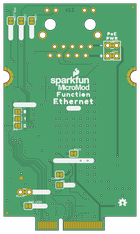

Contents
========

* [PRS18708 > MicroMod Function Ethernet-W5500](#prs18708--micromod-function-ethernet-w5500)
	* [Schematic](#schematic)
	* [PCB](#pcb)
	* [Interactive BOM](#interactive-bom)
	* [Images](#images)
	* [Tags](#tags)
  
![][im]
# PRS18708 > MicroMod Function Ethernet-W5500

- ID: PROJ-SPAR-18708-STAN-01
- Hex ID: PRS18708
- Name: Sparkfun
- Description: Sparkfun
- Long Link: [http://oom.lt/PROJ-SPAR-18708-STAN-01](http://oom.lt/PROJ-SPAR-18708-STAN-01)
- Short Link: [http://oom.lt/PRS18708](http://oom.lt/PRS18708)

## Schematic
  

## PCB
  

## Interactive BOM

- Interactive BOM page: [ibom.html](https://htmlpreview.github.io/?https://github.com/oomlout/oomlout_OOMP_projects/blob/main/PROJ-SPAR-18708-STAN-01/kicad/bom/ibom.html)

## Images
  
  

|bominteractivefront|bominteractiveback|kicadPcb3d|kicadPcb3dFront|kicadPcb3dBack|eagleImage|eagleSchemImage|pcbdraw|pcbdrawback|
| :---: | :---: | :---: | :---: | :---: | :---: | :---: | :---: | :---: |
||||||||||

## Tags

- hexID: PRS18708
- oompType: PROJ
- oompSize: SPAR
- oompColor: 18708
- oompDesc: STAN
- oompIndex: 01
- oompName: MicroMod Function Ethernet-W5500
- sources: All source files from https://github.com/sparkfun/MicroMod_Function_Ethernet-W5500 (source licence details in srcLicense.md)
- linkBuyPage: https://www.sparkfun.com/products/18708
- oompID: PROJ-SPAR-18708-STAN-01
- rawParts: C1,0.1uF,0.1UF-0603-25V-(+80/-20%),0603,0.1µF ceramic capacitors,,CAP-00810,,0.1uF,
- rawParts: C2,0.1uF,0.1UF-0603-25V-5%,0603,0.1µF ceramic capacitors,,CAP-08604,,0.1uF,
- rawParts: C3,0.1uF,0.1UF-0603-25V-(+80/-20%),0603,0.1µF ceramic capacitors,,CAP-00810,,0.1uF,
- rawParts: C4,0.1uF,0.1UF-0603-25V-(+80/-20%),0603,0.1µF ceramic capacitors,,CAP-00810,,0.1uF,
- rawParts: C5,10pF,10PF-0603-50V-5%,0603,10pF ceramic capacitors,,CAP-11812,,10pF,
- rawParts: C6,10pF,10PF-0603-50V-5%,0603,10pF ceramic capacitors,,CAP-11812,,10pF,
- rawParts: C7,10uF,10UF-0805-25V-10%,0805,10.0µF ceramic capacitors,,CAP-14259,,10uF,
- rawParts: C8,100uF,100UF-POLAR-25V-20%(ELEC),PANASONIC_D,100µF polarized capacitors,,CAP-12547,,100uF,
- rawParts: C9,10uF,10UF-0603-6.3V-20%,0603,10.0µF ceramic capacitors,,CAP-11015,,10uF,
- rawParts: C10,0.1uF,0.1UF-0603-25V-5%,0603,0.1µF ceramic capacitors,,CAP-08604,,0.1uF,
- rawParts: C11,0.1uF,0.1UF-0603-25V-5%,0603,0.1µF ceramic capacitors,,CAP-08604,,0.1uF,
- rawParts: C12,0.1uF,0.1UF-0603-25V-5%,0603,0.1µF ceramic capacitors,,CAP-08604,,0.1uF,
- rawParts: C13,1.0uF,1.0UF-0603-16V-10%,0603,1µF ceramic capacitors,,CAP-00868,,1.0uF,
- rawParts: C14,0.1uF,0.1UF-0603-25V-5%,0603,0.1µF ceramic capacitors,,CAP-08604,,0.1uF,
- rawParts: C15,0.1uF,0.1UF-0603-25V-5%,0603,0.1µF ceramic capacitors,,CAP-08604,,0.1uF,
- rawParts: C16,10uF,10UF-0603-6.3V-20%,0603,10.0µF ceramic capacitors,,CAP-11015,,10uF,
- rawParts: C17,10nF,10NF-0603-50V-10%,0603,0.01uF/10nF/10,000pF ceramic capacitors,,CAP-00867,,10nF,
- rawParts: C18,4.7uF,4.7UF-0603-6.3V-(10%),0603,4.7µF ceramic capacitors,,CAP-08280,,4.7uF,
- rawParts: C19,1nF,1.0NF/1000PF-1206-2KV-10%,1206,1nF/1,000pF ceramic capacitors,,CAP-16238,,1nF,
- rawParts: C20,10nF,10NF-0603-50V-10%,0603,0.01uF/10nF/10,000pF ceramic capacitors,,CAP-00867,,10nF,
- rawParts: C21,6.8nF,6.8NF/6800PF-0603-50V-5%,0603,5.6nF/5600pF ceramic capacitors,,CAP-16239,,6.8nF,
- rawParts: C22,6.8nF,6.8NF/6800PF-0603-50V-5%,0603,5.6nF/5600pF ceramic capacitors,,CAP-16239,,6.8nF,
- rawParts: C23,22nF,22NF/22,000PF-0603-50V-10%,0603,0.022uF/22nF/22,000pF ceramic capacitors,,CAP-07885,,22nF,
- rawParts: C24,1.0uF,1.0UF-0603-16V-10%-X7R,0603,1µF ceramic capacitors,,CAP-13930,,1.0uF,
- rawParts: C25,10uF,10UF-0805-25V-10%,0805,10.0µF ceramic capacitors,,CAP-14259,,10uF,
- rawParts: C26,10uF,10UF-0805-25V-10%,0805,10.0µF ceramic capacitors,,CAP-14259,,10uF,
- rawParts: D1,3A/10V/280mV,DIODE-SCHOTTKY-BAT60A,SOD-323,Schottky diode,,DIO-14072,,3A/10V/280mV,
- rawParts: D2,RED,LED-RED0603,LED-0603,Red SMD LED,,DIO-00819,,RED,
- rawParts: D5,Yellow,LED-YELLOW0603,LED-0603,Yellow SMD LED,,DIO-09003,,Yellow,
- rawParts: D7,DT1042-04SO,TVS_DIODE_ARRAYSMD,SOT-23-6,,,IC-13538,,ESD Diode,
- rawParts: FB2,470Ω,FERRITE_BEAD-0603-470Ω-100MHZ-1A-200MILIΩ,0603,Ferrite Bead (blocks, cores, rings, chokes, etc.),,NDUC-12579,,470Ω,
- rawParts: FD1,FIDUCIALUFIDUCIAL,FIDUCIALUFIDUCIAL,FIDUCIAL-MICRO,Fiducial Alignment Points,,,,,
- rawParts: FD2,FIDUCIALUFIDUCIAL,FIDUCIALUFIDUCIAL,FIDUCIAL-MICRO,Fiducial Alignment Points,,,,,
- rawParts: FD3,FIDUCIALUFIDUCIAL,FIDUCIALUFIDUCIAL,FIDUCIAL-MICRO,Fiducial Alignment Points,,,,,
- rawParts: FD4,FIDUCIALUFIDUCIAL,FIDUCIALUFIDUCIAL,FIDUCIAL-MICRO,Fiducial Alignment Points,,,,,
- rawParts: FRAME1,FRAME-LEDGER,FRAME-LEDGER,CREATIVE_COMMONS,Schematic Frame - Ledger,,,,,
- rawParts: ISO1,JUMPER-COMBO_2_NC_TRACE,JUMPER-COMBO_2_NC_TRACE,COMBO-JUMPER_2_NC_TRACE,,,,,,
- rawParts: ISO2,JUMPER-COMBO_2_NC_TRACE,JUMPER-COMBO_2_NC_TRACE,COMBO-JUMPER_2_NC_TRACE,,,,,,
- rawParts: J1,MAGJACK-POE,MAGJACK-POE,MAGJACK-SYM_LED,MAGJACK: RJ-45 with POE and LEDs,,CONN-16253,,,
- rawParts: J11,MICROMOD_STANDARD,MICROMOD_STANDARD,M.2-CARD-E-22_FUNCTION_STANDARD,MicroMod Connector,,,,,
- rawParts: JP1,JUMPER-SMT_2_NO_SILK,JUMPER-SMT_2_NO_SILK,SMT-JUMPER_2_NO_SILK,Normally open jumper,,,,,
- rawParts: JP2,JUMPER-SMT_2_NO_SILK,JUMPER-SMT_2_NO_SILK,SMT-JUMPER_2_NO_SILK,Normally open jumper,,,,,
- rawParts: JP3,JUMPER-SMT_2_NO_SILK,JUMPER-SMT_2_NO_SILK,SMT-JUMPER_2_NO_SILK,Normally open jumper,,,,,
- rawParts: JP5,JUMPER-SMT_2_NO_SILK,JUMPER-SMT_2_NO_SILK,SMT-JUMPER_2_NO_SILK,Normally open jumper,,,,,
- rawParts: L1,2.2uH,INDUCTOR-0805_WIDE-2.2UH,0805-WIDE,Inductors,,NDUC-14234,,2.2uH,
- rawParts: LED1,JUMPER-SMT_2_NC_TRACE_SILK,JUMPER-SMT_2_NC_TRACE_SILK,SMT-JUMPER_2_NC_TRACE_SILK,Normally closed trace jumper,,,,,
- rawParts: LED2,JUMPER-SMT_2_NC_TRACE_SILK,JUMPER-SMT_2_NC_TRACE_SILK,SMT-JUMPER_2_NC_TRACE_SILK,Normally closed trace jumper,,,,,
- rawParts: LOAD,JUMPER-SMT_2_NC_TRACE_SILK,JUMPER-SMT_2_NC_TRACE_SILK,SMT-JUMPER_2_NC_TRACE_SILK,Normally closed trace jumper,,,,,
- rawParts: LOGO1,SFE_LOGO_NAME_FLAME.1_INCH,SFE_LOGO_NAME_FLAME.1_INCH,SFE_LOGO_NAME_FLAME_.1,SparkFun Font Logo w/ Flame,,,,,
- rawParts: LOGO2,SPECIAL_INSTRUCTIONS-ORDERING,SPECIAL_INSTRUCTIONS-ORDERING,ORDERING_INSTRUCTIONS,Special Ordering/Production Instructions Alert,,,,,
- rawParts: LOGO3,OSHW-LOGOMINI,OSHW-LOGOMINI,OSHW-LOGO-MINI,Open-Source Hardware (OSHW) Logo,,,,,
- rawParts: MEAS,JUMPER-COMBO_2_NC_TRACE,JUMPER-COMBO_2_NC_TRACE,COMBO-JUMPER_2_NC_TRACE,,,,,,
- rawParts: POE,,JUMPER-SMT_2_NC_TRACE_SILK,SMT-JUMPER_2_NC_TRACE_SILK,Normally closed trace jumper,,,,,
- rawParts: POE_LED,JUMPER-SMT_2_NC_TRACE_SILK,JUMPER-SMT_2_NC_TRACE_SILK,SMT-JUMPER_2_NC_TRACE_SILK,Normally closed trace jumper,,,,,
- rawParts: PWR_LED,JUMPER-SMT_2_NC_TRACE_SILK,JUMPER-SMT_2_NC_TRACE_SILK,SMT-JUMPER_2_NC_TRACE_SILK,Normally closed trace jumper,,,,,
- rawParts: Q1,220mA/50V/3.5Ω,MOSFET-NCH-BSS138,SOT23-3,N-channel MOSFETs,,TRANS-00830,,220mA/50V/3.5Ω,
- rawParts: Q5,20V/4.2A/52mΩ/1.4W,MOSFET_PCH-DMG2305UX-7,SOT23-3,P-channel MOSFETs,,TRANS-14388,,20V/4.2A/52mΩ/1.4W,
- rawParts: R1,1M,1MOHM-0603-1/4W-5%,0603,1MΩ resistor,,RES-07868,,1M,
- rawParts: R2,49.9 1/2W,49.9OHM-1206-1/2W-1%,1206,49.9Ω resistor,,RES-16252,,,
- rawParts: R3,1k,1KOHM-0603-1/10W-1%,0603,1kΩ resistor,,RES-07856,,1k,
- rawParts: R4,10k,10KOHM-0603-1/10W-1%,0603,10kΩ resistor,,RES-00824,,10k,
- rawParts: R5,1k,1KOHM-0603-1/10W-1%,0603,1kΩ resistor,,RES-07856,,1k,
- rawParts: R6,10k,10KOHM-0603-1/10W-1%,0603,10kΩ resistor,,RES-00824,,10k,
- rawParts: R7,10k,10KOHM-0603-1/10W-1%,0603,10kΩ resistor,,RES-00824,,10k,
- rawParts: R8,12.4k,12.4KOHM-0603-1/10W-1%,0603,12.4kΩ resistor,,RES-16236,,12.4k,
- rawParts: R9,10k,10KOHM-0603-1/10W-1%,0603,10kΩ resistor,,RES-00824,,10k,
- rawParts: R10,10k,10KOHM-0603-1/10W-1%,0603,10kΩ resistor,,RES-00824,,10k,
- rawParts: R11,1k,1KOHM-0603-1/10W-1%,0603,1kΩ resistor,,RES-07856,,1k,
- rawParts: R12,10k,10KOHM-0603-1/10W-1%,0603,10kΩ resistor,,RES-00824,,10k,
- rawParts: R13,49.9,49.9OHM-0603-1/10W-1%,0603,49.9Ω resistor,,RES-16237,,49.9,
- rawParts: R14,33,33OHM-0603-1/10W-1%,0603,33Ω resistor,,RES-08270,,33,
- rawParts: R15,33,33OHM-0603-1/10W-1%,0603,33Ω resistor,,RES-08270,,33,
- rawParts: R16,33,33OHM-0603-1/10W-1%,0603,33Ω resistor,,RES-08270,,33,
- rawParts: R17,33,33OHM-0603-1/10W-1%,0603,33Ω resistor,,RES-08270,,33,
- rawParts: R18,49.9,49.9OHM-0603-1/10W-1%,0603,49.9Ω resistor,,RES-16237,,49.9,
- rawParts: R19,49.9,49.9OHM-0603-1/10W-1%,0603,49.9Ω resistor,,RES-16237,,49.9,
- rawParts: R20,49.9,49.9OHM-0603-1/10W-1%,0603,49.9Ω resistor,,RES-16237,,49.9,
- rawParts: R21,10,10OHM-0603-1/10W-1%,0603,10Ω resistor,,RES-12581,,10,
- rawParts: R22,10k,10KOHM-0603-1/10W-1%,0603,10kΩ resistor,,RES-00824,,10k,
- rawParts: R23,10k,10KOHM-0603-1/10W-1%,0603,10kΩ resistor,,RES-00824,,10k,
- rawParts: R24,10k,10KOHM-0603-1/10W-1%,0603,10kΩ resistor,,RES-00824,,10k,
- rawParts: R25,1k,1KOHM-0603-1/10W-1%,0603,1kΩ resistor,,RES-07856,,1k,
- rawParts: R30,10k,10KOHM-0603-1/10W-1%,0603,10kΩ resistor,,RES-00824,,10k,
- rawParts: TP1,TEST-POINT3X4,TEST-POINT3X4,PAD.03X.04,SparkFun Test Points,,,,,
- rawParts: U1,EEPROM,EEPROM-I2C512K,SO08,I2C EEPROMs, 24LC256 and others,,IC-14645,,,
- rawParts: U3,W5500,W5500,LQFP-48,,,IC-16240,,,
- rawParts: U4,3.3V,V_REG_AP2112K-3.3V,SOT23-5,AP2112 - 600mA CMOS LDO Regulator w/ Enable,,VREG-12457,,3.3V,
- rawParts: U5,POE_PSU-DP990X,POE_PSU-DP990X,DP990X,A special function Power Over Ethernet module with 5V or 12V output. Comes in an SMD package.,,IC-16251,,,
- rawParts: Y1,25MHz,CRYSTAL-25MHZ-SMD-2.0X1.6MM,CRYSTAL-SMD-2.0X1.6MM,25MHz Crystal,,XTAL-16235,,25MHz,

[im]: kicadPcb3d_450.png
