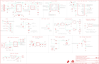

Contents
========

* [PRS18712 > SparkFun Artemis Global Tracker](#prs18712--sparkfun-artemis-global-tracker)
	* [Schematic](#schematic)
	* [PCB](#pcb)
	* [Interactive BOM](#interactive-bom)
	* [OOMP Parts](#oomp-parts)
	* [Images](#images)
	* [Tags](#tags)
  
![][im]
# PRS18712 > SparkFun Artemis Global Tracker

- ID: PROJ-SPAR-18712-STAN-01
- Hex ID: PRS18712
- Name: Sparkfun
- Description: Sparkfun
- Long Link: [http://oom.lt/PROJ-SPAR-18712-STAN-01](http://oom.lt/PROJ-SPAR-18712-STAN-01)
- Short Link: [http://oom.lt/PRS18712](http://oom.lt/PRS18712)

## Schematic
  

## PCB
  

## Interactive BOM

- Interactive BOM page: [ibom.html](https://htmlpreview.github.io/?https://github.com/oomlout/oomlout_OOMP_projects/blob/main/PROJ-SPAR-18712-STAN-01/kicad/bom/ibom.html)

## OOMP Parts
  

|OOMP ID|Name|Identifier|
| :---: | :---: | :---: |
|HEAD-I01-X-PI01-01||!RESET, EN, GND, J13, SC1+, SC1-, SC2+, SC2-|
|UNMATCHED-UNMATCHED-X-UNMATCHED-01||3V3SW, B1, DEBUG, J1, J2, J3, J5, J6, J7, L1, S1, U1, U2, U3, U4, U5, U6, U7, U11, X1, X2|
|[CAPC-0603-X-NF10-V50](https://github.com/oomlout/oomlout_OOMP_parts/tree/main/CAPC-0603-X-NF10-V50/)|[SMD (0603) 10 nF Capacitor (Ceramic) 50v](https://github.com/oomlout/oomlout_OOMP_parts/tree/main/CAPC-0603-X-NF10-V50/)|[C1, C9](https://github.com/oomlout/oomlout_OOMP_parts/tree/main/CAPC-0603-X-NF10-V50/)|
|[CAPC-0603-X-UF22D-V10](https://github.com/oomlout/oomlout_OOMP_parts/tree/main/CAPC-0603-X-UF22D-V10/)|[SMD (0603) 2.2 uF Capacitor (Ceramic) 10v](https://github.com/oomlout/oomlout_OOMP_parts/tree/main/CAPC-0603-X-UF22D-V10/)|[C2](https://github.com/oomlout/oomlout_OOMP_parts/tree/main/CAPC-0603-X-UF22D-V10/)|
|CAPC-0603-X-UNMATCHED-01||C3, C10, C23, C24, C27|
|[CAPC-0603-X-NF220-V25](https://github.com/oomlout/oomlout_OOMP_parts/tree/main/CAPC-0603-X-NF220-V25/)|[SMD (0603) 220 nF Capacitor (Ceramic) 25v](https://github.com/oomlout/oomlout_OOMP_parts/tree/main/CAPC-0603-X-NF220-V25/)|[C4, C12](https://github.com/oomlout/oomlout_OOMP_parts/tree/main/CAPC-0603-X-NF220-V25/)|
|CAPX-UNMATCHED-X-UNMATCHED-01||C5, C6|
|[CAPC-0603-X-NF100-V50](https://github.com/oomlout/oomlout_OOMP_parts/tree/main/CAPC-0603-X-NF100-V50/)|[SMD (0603) 100 nF Capacitor (Ceramic) 50v](https://github.com/oomlout/oomlout_OOMP_parts/tree/main/CAPC-0603-X-NF100-V50/)|[C7, C13, C20, C28, C30, C31](https://github.com/oomlout/oomlout_OOMP_parts/tree/main/CAPC-0603-X-NF100-V50/)|
|[CAPC-0603-X-UF47D-V10](https://github.com/oomlout/oomlout_OOMP_parts/tree/main/CAPC-0603-X-UF47D-V10/)|[SMD (0603) 4.7 uF Capacitor (Ceramic) 10v](https://github.com/oomlout/oomlout_OOMP_parts/tree/main/CAPC-0603-X-UF47D-V10/)|[C8, C11, C17](https://github.com/oomlout/oomlout_OOMP_parts/tree/main/CAPC-0603-X-UF47D-V10/)|
|[CAPC-0603-X-PF100-V50](https://github.com/oomlout/oomlout_OOMP_parts/tree/main/CAPC-0603-X-PF100-V50/)|[SMD (0603) 100 pF Capacitor (Ceramic) 50v](https://github.com/oomlout/oomlout_OOMP_parts/tree/main/CAPC-0603-X-PF100-V50/)|[C14, C15, C16](https://github.com/oomlout/oomlout_OOMP_parts/tree/main/CAPC-0603-X-PF100-V50/)|
|[CAPC-0603-X-PF15-V50](https://github.com/oomlout/oomlout_OOMP_parts/tree/main/CAPC-0603-X-PF15-V50/)|[SMD (0603) 15 pF Capacitor (Ceramic) 50v](https://github.com/oomlout/oomlout_OOMP_parts/tree/main/CAPC-0603-X-PF15-V50/)|[C18, C19](https://github.com/oomlout/oomlout_OOMP_parts/tree/main/CAPC-0603-X-PF15-V50/)|
|[CAPC-0805-X-UF22-V63D](https://github.com/oomlout/oomlout_OOMP_parts/tree/main/CAPC-0805-X-UF22-V63D/)|[SMD (0805) 22 uF Capacitor (Ceramic) 6.3v](https://github.com/oomlout/oomlout_OOMP_parts/tree/main/CAPC-0805-X-UF22-V63D/)|[C21, C25](https://github.com/oomlout/oomlout_OOMP_parts/tree/main/CAPC-0805-X-UF22-V63D/)|
|[CAPC-0603-X-UF10-V63D](https://github.com/oomlout/oomlout_OOMP_parts/tree/main/CAPC-0603-X-UF10-V63D/)|[SMD (0603) 10 uF Capacitor (Ceramic) 6.3v](https://github.com/oomlout/oomlout_OOMP_parts/tree/main/CAPC-0603-X-UF10-V63D/)|[C22](https://github.com/oomlout/oomlout_OOMP_parts/tree/main/CAPC-0603-X-UF10-V63D/)|
|[CAPC-0603-X-NF1-V50](https://github.com/oomlout/oomlout_OOMP_parts/tree/main/CAPC-0603-X-NF1-V50/)|[SMD (0603) 1 nF Capacitor (Ceramic) 50v](https://github.com/oomlout/oomlout_OOMP_parts/tree/main/CAPC-0603-X-NF1-V50/)|[C29](https://github.com/oomlout/oomlout_OOMP_parts/tree/main/CAPC-0603-X-NF1-V50/)|
|[LEDS-0603-G-STAN-01](https://github.com/oomlout/oomlout_OOMP_parts/tree/main/LEDS-0603-G-STAN-01/)|[SMD (0603) Green LED](https://github.com/oomlout/oomlout_OOMP_parts/tree/main/LEDS-0603-G-STAN-01/)|[D1, D6, D7](https://github.com/oomlout/oomlout_OOMP_parts/tree/main/LEDS-0603-G-STAN-01/)|
|[LEDS-0603-Y-STAN-01](https://github.com/oomlout/oomlout_OOMP_parts/tree/main/LEDS-0603-Y-STAN-01/)|[SMD (0603) Yellow LED](https://github.com/oomlout/oomlout_OOMP_parts/tree/main/LEDS-0603-Y-STAN-01/)|[D2, D9, D13](https://github.com/oomlout/oomlout_OOMP_parts/tree/main/LEDS-0603-Y-STAN-01/)|
|[LEDS-0603-R-STAN-01](https://github.com/oomlout/oomlout_OOMP_parts/tree/main/LEDS-0603-R-STAN-01/)|[SMD (0603) Red LED](https://github.com/oomlout/oomlout_OOMP_parts/tree/main/LEDS-0603-R-STAN-01/)|[D3](https://github.com/oomlout/oomlout_OOMP_parts/tree/main/LEDS-0603-R-STAN-01/)|
|[LEDS-0603-L-STAN-01](https://github.com/oomlout/oomlout_OOMP_parts/tree/main/LEDS-0603-L-STAN-01/)|[SMD (0603) Blue LED](https://github.com/oomlout/oomlout_OOMP_parts/tree/main/LEDS-0603-L-STAN-01/)|[D4](https://github.com/oomlout/oomlout_OOMP_parts/tree/main/LEDS-0603-L-STAN-01/)|
|DIOD-S323-X-UNMATCHED-01||D5, D8, D10, D11, D12, D14|
|DIOD-UNMATCHED-X-UNMATCHED-01||D17, D41|
|[HEAD-I01-X-PI04-01](https://github.com/oomlout/oomlout_OOMP_parts/tree/main/HEAD-I01-X-PI04-01/)|[2.54 mm 4 Pin Header](https://github.com/oomlout/oomlout_OOMP_parts/tree/main/HEAD-I01-X-PI04-01/)|[I2C, J10, J11](https://github.com/oomlout/oomlout_OOMP_parts/tree/main/HEAD-I01-X-PI04-01/)|
|[HEAD-I01-X-PI02-01](https://github.com/oomlout/oomlout_OOMP_parts/tree/main/HEAD-I01-X-PI02-01/)|[2.54 mm 2 Pin Header](https://github.com/oomlout/oomlout_OOMP_parts/tree/main/HEAD-I01-X-PI02-01/)|[J4](https://github.com/oomlout/oomlout_OOMP_parts/tree/main/HEAD-I01-X-PI02-01/)|
|MOSN-SO23-X-UNMATCHED-01||Q1|
|MOSP-SO23-X-UNMATCHED-01||Q2, Q3, Q6|
|UNMATCHED-SO23-X-UNMATCHED-01||Q4, U8|
|[HEAD-JSTSH-X-PI04-RS](https://github.com/oomlout/oomlout_OOMP_parts/tree/main/HEAD-JSTSH-X-PI04-RS/)|[JST XH (1 mm) 4 Pin Header Right Angle (SMD)](https://github.com/oomlout/oomlout_OOMP_parts/tree/main/HEAD-JSTSH-X-PI04-RS/)|[QWIIC](https://github.com/oomlout/oomlout_OOMP_parts/tree/main/HEAD-JSTSH-X-PI04-RS/)|
|[RESE-0402-X-O331-01](https://github.com/oomlout/oomlout_OOMP_parts/tree/main/RESE-0402-X-O331-01/)|[SMD (0402) 330 Ohm Resistor](https://github.com/oomlout/oomlout_OOMP_parts/tree/main/RESE-0402-X-O331-01/)|[R1](https://github.com/oomlout/oomlout_OOMP_parts/tree/main/RESE-0402-X-O331-01/)|
|[RESE-0402-X-O102-01](https://github.com/oomlout/oomlout_OOMP_parts/tree/main/RESE-0402-X-O102-01/)|[SMD (0402) 1k Ohm Resistor](https://github.com/oomlout/oomlout_OOMP_parts/tree/main/RESE-0402-X-O102-01/)|[R2, R3, R12, R16, R21, R25, R29](https://github.com/oomlout/oomlout_OOMP_parts/tree/main/RESE-0402-X-O102-01/)|
|[RESE-0402-X-O472-01](https://github.com/oomlout/oomlout_OOMP_parts/tree/main/RESE-0402-X-O472-01/)|[SMD (0402) 4.7k Ohm Resistor](https://github.com/oomlout/oomlout_OOMP_parts/tree/main/RESE-0402-X-O472-01/)|[R4, R20](https://github.com/oomlout/oomlout_OOMP_parts/tree/main/RESE-0402-X-O472-01/)|
|[RESE-0402-X-O103-01](https://github.com/oomlout/oomlout_OOMP_parts/tree/main/RESE-0402-X-O103-01/)|[SMD (0402) 10k Ohm Resistor](https://github.com/oomlout/oomlout_OOMP_parts/tree/main/RESE-0402-X-O103-01/)|[R5, R14, R17, R19, R22, R23, R30](https://github.com/oomlout/oomlout_OOMP_parts/tree/main/RESE-0402-X-O103-01/)|
|[RESE-0603-X-O123-01](https://github.com/oomlout/oomlout_OOMP_parts/tree/main/RESE-0603-X-O123-01/)|[SMD (0603) 12k Ohm Resistor](https://github.com/oomlout/oomlout_OOMP_parts/tree/main/RESE-0603-X-O123-01/)|[R6](https://github.com/oomlout/oomlout_OOMP_parts/tree/main/RESE-0603-X-O123-01/)|
|RESE-0603-X-UNMATCHED-01||R7, R9|
|RESE-0603-X-O1003-01||R8, R26|
|[RESE-0402-X-O101-01](https://github.com/oomlout/oomlout_OOMP_parts/tree/main/RESE-0402-X-O101-01/)|[SMD (0402) 100 Ohm Resistor](https://github.com/oomlout/oomlout_OOMP_parts/tree/main/RESE-0402-X-O101-01/)|[R10, R11](https://github.com/oomlout/oomlout_OOMP_parts/tree/main/RESE-0402-X-O101-01/)|
|RESE-0402-X-UNMATCHED-01||R13, R15, R28|
|[RESE-0603-X-O203-01](https://github.com/oomlout/oomlout_OOMP_parts/tree/main/RESE-0603-X-O203-01/)|[SMD (0603) 20k Ohm Resistor](https://github.com/oomlout/oomlout_OOMP_parts/tree/main/RESE-0603-X-O203-01/)|[R24](https://github.com/oomlout/oomlout_OOMP_parts/tree/main/RESE-0603-X-O203-01/)|
|RESE-0603-X-O2203-01||R27|
|[RESE-0402-X-O203-01](https://github.com/oomlout/oomlout_OOMP_parts/tree/main/RESE-0402-X-O203-01/)|[SMD (0402) 20k Ohm Resistor](https://github.com/oomlout/oomlout_OOMP_parts/tree/main/RESE-0402-X-O203-01/)|[R31](https://github.com/oomlout/oomlout_OOMP_parts/tree/main/RESE-0402-X-O203-01/)|
|[HEAD-I01-X-PI07-01](https://github.com/oomlout/oomlout_OOMP_parts/tree/main/HEAD-I01-X-PI07-01/)|[2.54 mm 7 Pin Header](https://github.com/oomlout/oomlout_OOMP_parts/tree/main/HEAD-I01-X-PI07-01/)|[SPI](https://github.com/oomlout/oomlout_OOMP_parts/tree/main/HEAD-I01-X-PI07-01/)|
|UNMATCHED-SO235-X-UNMATCHED-01||U9, U12|
|[VREG-SO235-X-KAP2112K-V33D](https://github.com/oomlout/oomlout_OOMP_parts/tree/main/VREG-SO235-X-KAP2112K-V33D/)|[SMD (SOT-23-5) AP2112K Voltage Regulator 3.3v](https://github.com/oomlout/oomlout_OOMP_parts/tree/main/VREG-SO235-X-KAP2112K-V33D/)|[U10](https://github.com/oomlout/oomlout_OOMP_parts/tree/main/VREG-SO235-X-KAP2112K-V33D/)|

## Images
  
  

|bominteractivefront|bominteractiveback|kicadPcb3d|kicadPcb3dFront|kicadPcb3dBack|kicadSchem|eagleImage|eagleSchemImage|pcbdraw|pcbdrawback|
| :---: | :---: | :---: | :---: | :---: | :---: | :---: | :---: | :---: | :---: |
|||||||||||

## Tags

- hexID: PRS18712
- oompType: PROJ
- oompSize: SPAR
- oompColor: 18712
- oompDesc: STAN
- oompIndex: 01
- oompName: SparkFun Artemis Global Tracker
- sources: All source files from https://github.com/sparkfun/SparkFun_Artemis_Global_Tracker (source licence details in srcLicense.md)
- linkBuyPage: https://www.sparkfun.com/products/18712
- oompID: PROJ-SPAR-18712-STAN-01
- oompParts: !RESET,HEAD-I01-X-PI01-01
- oompParts: 3V3SW,UNMATCHED-UNMATCHED-X-UNMATCHED-01
- oompParts: B1,UNMATCHED-UNMATCHED-X-UNMATCHED-01
- oompParts: C1,CAPC-0603-X-NF10-V50
- oompParts: C2,CAPC-0603-X-UF22D-V10
- oompParts: C3,CAPC-0603-X-UNMATCHED-01
- oompParts: C4,CAPC-0603-X-NF220-V25
- oompParts: C5,CAPX-UNMATCHED-X-UNMATCHED-01
- oompParts: C6,CAPX-UNMATCHED-X-UNMATCHED-01
- oompParts: C7,CAPC-0603-X-NF100-V50
- oompParts: C8,CAPC-0603-X-UF47D-V10
- oompParts: C9,CAPC-0603-X-NF10-V50
- oompParts: C10,CAPC-0603-X-UNMATCHED-01
- oompParts: C11,CAPC-0603-X-UF47D-V10
- oompParts: C12,CAPC-0603-X-NF220-V25
- oompParts: C13,CAPC-0603-X-NF100-V50
- oompParts: C14,CAPC-0603-X-PF100-V50
- oompParts: C15,CAPC-0603-X-PF100-V50
- oompParts: C16,CAPC-0603-X-PF100-V50
- oompParts: C17,CAPC-0603-X-UF47D-V10
- oompParts: C18,CAPC-0603-X-PF15-V50
- oompParts: C19,CAPC-0603-X-PF15-V50
- oompParts: C20,CAPC-0603-X-NF100-V50
- oompParts: C21,CAPC-0805-X-UF22-V63D
- oompParts: C22,CAPC-0603-X-UF10-V63D
- oompParts: C23,CAPC-0603-X-UNMATCHED-01
- oompParts: C24,CAPC-0603-X-UNMATCHED-01
- oompParts: C25,CAPC-0805-X-UF22-V63D
- oompParts: C27,CAPC-0603-X-UNMATCHED-01
- oompParts: C28,CAPC-0603-X-NF100-V50
- oompParts: C29,CAPC-0603-X-NF1-V50
- oompParts: C30,CAPC-0603-X-NF100-V50
- oompParts: C31,CAPC-0603-X-NF100-V50
- oompParts: D1,LEDS-0603-G-STAN-01
- oompParts: D2,LEDS-0603-Y-STAN-01
- oompParts: D3,LEDS-0603-R-STAN-01
- oompParts: D4,LEDS-0603-L-STAN-01
- oompParts: D5,DIOD-S323-X-UNMATCHED-01
- oompParts: D6,LEDS-0603-G-STAN-01
- oompParts: D7,LEDS-0603-G-STAN-01
- oompParts: D8,DIOD-S323-X-UNMATCHED-01
- oompParts: D9,LEDS-0603-Y-STAN-01
- oompParts: D10,DIOD-S323-X-UNMATCHED-01
- oompParts: D11,DIOD-S323-X-UNMATCHED-01
- oompParts: D12,DIOD-S323-X-UNMATCHED-01
- oompParts: D13,LEDS-0603-Y-STAN-01
- oompParts: D14,DIOD-S323-X-UNMATCHED-01
- oompParts: D17,DIOD-UNMATCHED-X-UNMATCHED-01
- oompParts: D41,DIOD-UNMATCHED-X-UNMATCHED-01
- oompParts: DEBUG,UNMATCHED-UNMATCHED-X-UNMATCHED-01
- oompParts: EN,HEAD-I01-X-PI01-01
- oompParts: GND,HEAD-I01-X-PI01-01
- oompParts: I2C,HEAD-I01-X-PI04-01
- oompParts: J1,UNMATCHED-UNMATCHED-X-UNMATCHED-01
- oompParts: J2,UNMATCHED-UNMATCHED-X-UNMATCHED-01
- oompParts: J3,UNMATCHED-UNMATCHED-X-UNMATCHED-01
- oompParts: J4,HEAD-I01-X-PI02-01
- oompParts: J5,UNMATCHED-UNMATCHED-X-UNMATCHED-01
- oompParts: J6,UNMATCHED-UNMATCHED-X-UNMATCHED-01
- oompParts: J7,UNMATCHED-UNMATCHED-X-UNMATCHED-01
- oompParts: J10,HEAD-I01-X-PI04-01
- oompParts: J11,HEAD-I01-X-PI04-01
- oompParts: J13,HEAD-I01-X-PI01-01
- oompParts: L1,UNMATCHED-UNMATCHED-X-UNMATCHED-01
- oompParts: Q1,MOSN-SO23-X-UNMATCHED-01
- oompParts: Q2,MOSP-SO23-X-UNMATCHED-01
- oompParts: Q3,MOSP-SO23-X-UNMATCHED-01
- oompParts: Q4,UNMATCHED-SO23-X-UNMATCHED-01
- oompParts: Q6,MOSP-SO23-X-UNMATCHED-01
- oompParts: QWIIC,HEAD-JSTSH-X-PI04-RS
- oompParts: R1,RESE-0402-X-O331-01
- oompParts: R2,RESE-0402-X-O102-01
- oompParts: R3,RESE-0402-X-O102-01
- oompParts: R4,RESE-0402-X-O472-01
- oompParts: R5,RESE-0402-X-O103-01
- oompParts: R6,RESE-0603-X-O123-01
- oompParts: R7,RESE-0603-X-UNMATCHED-01
- oompParts: R8,RESE-0603-X-O1003-01
- oompParts: R9,RESE-0603-X-UNMATCHED-01
- oompParts: R10,RESE-0402-X-O101-01
- oompParts: R11,RESE-0402-X-O101-01
- oompParts: R12,RESE-0402-X-O102-01
- oompParts: R13,RESE-0402-X-UNMATCHED-01
- oompParts: R14,RESE-0402-X-O103-01
- oompParts: R15,RESE-0402-X-UNMATCHED-01
- oompParts: R16,RESE-0402-X-O102-01
- oompParts: R17,RESE-0402-X-O103-01
- oompParts: R19,RESE-0402-X-O103-01
- oompParts: R20,RESE-0402-X-O472-01
- oompParts: R21,RESE-0402-X-O102-01
- oompParts: R22,RESE-0402-X-O103-01
- oompParts: R23,RESE-0402-X-O103-01
- oompParts: R24,RESE-0603-X-O203-01
- oompParts: R25,RESE-0402-X-O102-01
- oompParts: R26,RESE-0603-X-O1003-01
- oompParts: R27,RESE-0603-X-O2203-01
- oompParts: R28,RESE-0402-X-UNMATCHED-01
- oompParts: R29,RESE-0402-X-O102-01
- oompParts: R30,RESE-0402-X-O103-01
- oompParts: R31,RESE-0402-X-O203-01
- oompParts: S1,UNMATCHED-UNMATCHED-X-UNMATCHED-01
- oompParts: SC1+,HEAD-I01-X-PI01-01
- oompParts: SC1-,HEAD-I01-X-PI01-01
- oompParts: SC2+,HEAD-I01-X-PI01-01
- oompParts: SC2-,HEAD-I01-X-PI01-01
- oompParts: SPI,HEAD-I01-X-PI07-01
- oompParts: U1,UNMATCHED-UNMATCHED-X-UNMATCHED-01
- oompParts: U2,UNMATCHED-UNMATCHED-X-UNMATCHED-01
- oompParts: U3,UNMATCHED-UNMATCHED-X-UNMATCHED-01
- oompParts: U4,UNMATCHED-UNMATCHED-X-UNMATCHED-01
- oompParts: U5,UNMATCHED-UNMATCHED-X-UNMATCHED-01
- oompParts: U6,UNMATCHED-UNMATCHED-X-UNMATCHED-01
- oompParts: U7,UNMATCHED-UNMATCHED-X-UNMATCHED-01
- oompParts: U8,UNMATCHED-SO23-X-UNMATCHED-01
- oompParts: U9,UNMATCHED-SO235-X-UNMATCHED-01
- oompParts: U10,VREG-SO235-X-KAP2112K-V33D
- oompParts: U11,UNMATCHED-UNMATCHED-X-UNMATCHED-01
- oompParts: U12,UNMATCHED-SO235-X-UNMATCHED-01
- oompParts: X1,UNMATCHED-UNMATCHED-X-UNMATCHED-01
- oompParts: X2,UNMATCHED-UNMATCHED-X-UNMATCHED-01
- rawParts: !RESET,,CONN_01PTH_NO_SILK_YES_STOP,1X01_NO_SILK,Single connection point. Often used as Generic Header-pin footprint for 0.1 inch spaced/style header connections,,,,,,,,
- rawParts: 3V3EN,JUMPER-SMT_2_NC_TRACE_SILK,JUMPER-SMT_2_NC_TRACE_SILK,SMT-JUMPER_2_NC_TRACE_SILK,Normally closed trace jumper,,,,,,,,
- rawParts: 3V3SW,,TEST-POINT3X5,PAD.03X.05,SparkFun Test Points,,,,,,,,
- rawParts: 5V3,TEST-POINT3X5,TEST-POINT3X5,PAD.03X.05,SparkFun Test Points,,,,,,,,
- rawParts: B1,ML414H_IV01E_BATTERY,ML414H_IV01E_BATTERY,ML414H_IV01E,SEIKO ML414H-IV01E Reflowable Lithium Battery,,BATT-14267,,,,,,
- rawParts: C1,10nF,10NF-0603-50V-10%,0603,0.01uF/10nF/10,000pF ceramic capacitors,,CAP-00867,,,10nF,,,
- rawParts: C2,2.2uF,2.2UF-0603-10V-20%,0603,2.2µF ceramic capacitors,,CAP-07888,,,2.2uF,,,
- rawParts: C3,1.0uF,1.0UF-0603-16V-10%-X7R,0603,1µF ceramic capacitors,,CAP-13930,,,1.0uF,,,
- rawParts: C4,0.22uF,0.22UF-0603-25V-10%,0603,0.22µF ceramic capacitors,,CAP-07822,,,0.22uF,,,
- rawParts: C5,1F 2.7V,1F-2.7V(PTH)CPOL-RADIAL-1H-2.7V,CPOL-RADIAL-1F-2.7V,1F 2.7V SuperCapacitor CAP-14696,,CAP-14696,,,,,,
- rawParts: C6,1F 2.7V,1F-2.7V(PTH)CPOL-RADIAL-1H-2.7V,CPOL-RADIAL-1F-2.7V,1F 2.7V SuperCapacitor CAP-14696,,CAP-14696,,,,,,
- rawParts: C7,0.1uF,0.1UF-0603-25V-5%,0603,0.1µF ceramic capacitors,,CAP-08604,,,0.1uF,,,
- rawParts: C8,4.7uF,4.7UF-0603-6.3V-(10%),0603,4.7µF ceramic capacitors,,CAP-08280,,,4.7uF,,,
- rawParts: C9,10nF,10NF-0603-50V-10%,0603,0.01uF/10nF/10,000pF ceramic capacitors,,CAP-00867,,,10nF,,,
- rawParts: C10,1.0uF,1.0UF-0603-16V-10%-X7R,0603,1µF ceramic capacitors,,CAP-13930,,,1.0uF,,,
- rawParts: C11,4.7uF,4.7UF-0603-6.3V-(10%),0603,4.7µF ceramic capacitors,,CAP-08280,,,4.7uF,,,
- rawParts: C12,0.22uF,0.22UF-0603-25V-10%,0603,0.22µF ceramic capacitors,,CAP-07822,,,0.22uF,,,
- rawParts: C13,0.1uF,0.1UF-0603-25V-5%,0603,0.1µF ceramic capacitors,,CAP-08604,,,0.1uF,,,
- rawParts: C14,100pF,100PF-0603-50V-5%,0603,100pF/0.1nF ceramic capacitors,,CAP-07883,,,100pF,,,
- rawParts: C15,100pF,100PF-0603-50V-5%,0603,100pF/0.1nF ceramic capacitors,,CAP-07883,,,100pF,,,
- rawParts: C16,100pF,100PF-0603-50V-5%,0603,100pF/0.1nF ceramic capacitors,,CAP-07883,,,100pF,,,
- rawParts: C17,4.7uF,4.7UF-0603-6.3V-(10%),0603,4.7µF ceramic capacitors,,CAP-08280,,,4.7uF,,,
- rawParts: C18,15pF,15PF-0603-50V-5%,0603,15pF ceramic capacitors,,CAP-07881,,,15pF,,,
- rawParts: C19,15pF,15PF-0603-50V-5%,0603,15pF ceramic capacitors,,CAP-07881,,,15pF,,,
- rawParts: C20,0.1uF,0.1UF-0603-25V-5%,0603,0.1µF ceramic capacitors,,CAP-08604,,,0.1uF,,,
- rawParts: C21,22uF,22UF-0805-16V-20%,0805,22µF ceramic capacitors,,CAP-14260,,,22uF,,,
- rawParts: C22,10uF,10UF-0603-6.3V-20%,0603,10.0µF ceramic capacitors,,CAP-11015,,,10uF,,,
- rawParts: C23,1.0uF,1.0UF-0603-16V-10%-X7R,0603,1µF ceramic capacitors,,CAP-13930,,,1.0uF,,,
- rawParts: C24,1.0uF,1.0UF-0603-16V-10%-X7R,0603,1µF ceramic capacitors,,CAP-13930,,,1.0uF,,,
- rawParts: C25,22uF,22UF-0805-16V-20%,0805,22µF ceramic capacitors,,CAP-14260,,,22uF,,,
- rawParts: C27,1.0uF,1.0UF-0603-16V-10%-X7R,0603,1µF ceramic capacitors,,CAP-13930,,,1.0uF,,,
- rawParts: C28,0.1uF,0.1UF-0603-25V-5%,0603,0.1µF ceramic capacitors,,CAP-08604,,,0.1uF,,,
- rawParts: C29,1nF,1.0NF/1000PF-0603-50V-10%,0603,1nF/1,000pF ceramic capacitors,,CAP-07886,,,1nF,,,
- rawParts: C30,0.1uF,0.1UF-0603-25V-5%,0603,0.1µF ceramic capacitors,,CAP-08604,,,0.1uF,,,
- rawParts: C31,0.1uF,0.1UF-0603-25V-5%,0603,0.1µF ceramic capacitors,,CAP-08604,,,0.1uF,,,
- rawParts: D1,GREEN,LED-GREEN0603,LED-0603,Green SMD LED,,DIO-00821,,,GREEN,,,
- rawParts: D2,Yellow,LED-YELLOW0603,LED-0603,Yellow SMD LED,,DIO-09003,,,Yellow,,,
- rawParts: D3,RED,LED-RED0603,LED-0603,Red SMD LED,,DIO-00819,,,RED,,,
- rawParts: D4,BLUE,LED-BLUE0603,LED-0603,Blue SMD LED,,DIO-08575,,,BLUE,,,
- rawParts: D5,0.5A/40V/420mV,DIODE-SCHOTTKY-PMEG4005EJ,SOD-323,Schottky diode,,DIO-10955,,,0.5A/40V/420mV,,,
- rawParts: D6,WHITE,LED-WHITE0603,LED-0603,White SMD LED,,DIO-09004,,,WHITE,,,
- rawParts: D7,GREEN,LED-GREEN0603,LED-0603,Green SMD LED,,DIO-00821,,,GREEN,,,
- rawParts: D8,0.5A/40V/420mV,DIODE-SCHOTTKY-PMEG4005EJ,SOD-323,Schottky diode,,DIO-10955,,,0.5A/40V/420mV,,,
- rawParts: D9,Yellow,LED-YELLOW0603,LED-0603,Yellow SMD LED,,DIO-09003,,,Yellow,,,
- rawParts: D10,0.5A/40V/420mV,DIODE-SCHOTTKY-PMEG4005EJ,SOD-323,Schottky diode,,DIO-10955,,,0.5A/40V/420mV,,,
- rawParts: D11,0.5A/40V/420mV,DIODE-SCHOTTKY-PMEG4005EJ,SOD-323,Schottky diode,,DIO-10955,,,0.5A/40V/420mV,,,
- rawParts: D12,0.5A/40V/420mV,DIODE-SCHOTTKY-PMEG4005EJ,SOD-323,Schottky diode,,DIO-10955,,,0.5A/40V/420mV,,,
- rawParts: D13,Yellow,LED-YELLOW0603,LED-0603,Yellow SMD LED,,DIO-09003,,,Yellow,,,
- rawParts: D14,0.5A/40V/420mV,DIODE-SCHOTTKY-PMEG4005EJ,SOD-323,Schottky diode,,DIO-10955,,,0.5A/40V/420mV,,,
- rawParts: D17,,TEST-POINT3X5,PAD.03X.05,SparkFun Test Points,,,,,,,,
- rawParts: D41,,TEST-POINT3X5,PAD.03X.05,SparkFun Test Points,,,,,,,,
- rawParts: DEBUG,CORTEX_DEBUG,CORTEX_JTAG_DEBUG_MINIMUM_PTH_NS,2X5-PTH-1.27MM-NO_SILK,Cortex Debug Connector - 10 pin,,,,,,,,
- rawParts: EN,,CONN_01PTH_NO_SILK_YES_STOP,1X01_NO_SILK,Single connection point. Often used as Generic Header-pin footprint for 0.1 inch spaced/style header connections,,,,,,,,
- rawParts: FRAME3,FRAME-LETTERNO_PACKAGE,FRAME-LETTERNO_PACKAGE,DUMMY,Schematic Frame - Letter,Nobody,,v10,,,v10,,
- rawParts: FRAME5,FRAME-LEDGER,FRAME-LEDGER,CREATIVE_COMMONS,Schematic Frame - Ledger,,,v10,,,,,
- rawParts: GND,,CONN_01PTH_NO_SILK_YES_STOP,1X01_NO_SILK,Single connection point. Often used as Generic Header-pin footprint for 0.1 inch spaced/style header connections,,,,,,,,
- rawParts: GPS_RX,TEST-POINT3X5,TEST-POINT3X5,PAD.03X.05,SparkFun Test Points,,,,,,,,
- rawParts: GPS_TX,TEST-POINT3X5,TEST-POINT3X5,PAD.03X.05,SparkFun Test Points,,,,,,,,
- rawParts: I2C,PTH,I2C_STANDARD_NO_SILK,1X04_NO_SILK,SparkFun I2C Standard Pinout Header,,,,,,,,
- rawParts: J1,IRIDIUM_9603N,IRIDIUM_9603N,IRIDIUM_9603N,Iridium 9603N Modem,,CONN-14689,,,IRIDIUM_9603N,,,
- rawParts: J2,USB-C,USB_C_2-LAYER_PADS,USB-C-16P-2LAYER-PADS,USB Type C 16Pin Connector,,CONN-14122,,,,,,
- rawParts: J3,,JST_2MM_MALE,JST-2-SMD,JST 2MM MALE RA CONNECTOR,,CONN-11443,,PRT-08612,,,,
- rawParts: J4,,CONN_021X02_NO_SILK,1X02_NO_SILK,Multi connection point. Often used as Generic Header-pin footprint for 0.1 inch spaced/style header connections,,,,,,,,
- rawParts: J5,,JST_2MM_MALE,JST-2-SMD,JST 2MM MALE RA CONNECTOR,,CONN-11443,,PRT-08612,,,,
- rawParts: J6,U.FL,U.FL2PIN,U.FL,SMD Antenna Connector - U.FL,,CONN-09193,,WRL-09144,U.FL,,,
- rawParts: J7,ANTENNA-GROUNDEDEDGE_SMA,ANTENNA-GROUNDEDEDGE_SMA,SMA-EDGE,Antenna w/ Ground Connection,,CONN-08289,,,,,,
- rawParts: J8,STAND-OFF-REFLOW-M2.0_6.0MM_TALL,STAND-OFF-REFLOW-M2.0_6.0MM_TALL,STAND-OFF-REFLOW-M2.0,Stand Off Reflow Compatible,,HW-14879,,,,,,
- rawParts: J9,STAND-OFF-REFLOW-M2.0_6.0MM_TALL,STAND-OFF-REFLOW-M2.0_6.0MM_TALL,STAND-OFF-REFLOW-M2.0,Stand Off Reflow Compatible,,HW-14879,,,,,,
- rawParts: J10,,CONN_041X04_NO_SILK_NO_POP,1X04_NO_SILK,Multi connection point. Often used as Generic Header-pin footprint for 0.1 inch spaced/style header connections,,,,,,,,
- rawParts: J11,,CONN_041X04_NO_SILK_NO_POP,1X04_NO_SILK,Multi connection point. Often used as Generic Header-pin footprint for 0.1 inch spaced/style header connections,,,,,,,,
- rawParts: J13,,CONN_01PTH_NO_SILK_YES_STOP,1X01_NO_SILK,Single connection point. Often used as Generic Header-pin footprint for 0.1 inch spaced/style header connections,,,,,,,,
- rawParts: JP1,JUMPER-SMT_3_1-NC_TRACE_SILK,JUMPER-SMT_3_1-NC_TRACE_SILK,SMT-JUMPER_3_1-NC_TRACE_SILK,Normally closed trace jumper (1 of 2 connections),,,,,,,,
- rawParts: JP2,JUMPER-SMT_2_NC_TRACE_SILK,JUMPER-SMT_2_NC_TRACE_SILK,SMT-JUMPER_2_NC_TRACE_SILK,Normally closed trace jumper,,,,,,,,
- rawParts: JP7,FIDUCIAL1X2,FIDUCIAL1X2,FIDUCIAL-1X2,Fiducial Alignment Points,,,,,,,,
- rawParts: JP8,FIDUCIAL1X2,FIDUCIAL1X2,FIDUCIAL-1X2,Fiducial Alignment Points,,,,,,,,
- rawParts: JP9,STAND-OFF,STAND-OFF,STAND-OFF,Stand Off,,,,,,,,
- rawParts: JP10,STAND-OFF,STAND-OFF,STAND-OFF,Stand Off,,,,,,,,
- rawParts: JP11,STAND-OFF,STAND-OFF,STAND-OFF,Stand Off,,,,,,,,
- rawParts: JP12,STAND-OFF,STAND-OFF,STAND-OFF,Stand Off,,,,,,,,
- rawParts: JP13,FIDUCIAL1X2,FIDUCIAL1X2,FIDUCIAL-1X2,Fiducial Alignment Points,,,,,,,,
- rawParts: JP14,FIDUCIAL1X2,FIDUCIAL1X2,FIDUCIAL-1X2,Fiducial Alignment Points,,,,,,,,
- rawParts: L1,2.2uH,2.2μH_SHIELDED_INDUCTOR,0806,Murata 2.2uH Inductor,,NDUC-14257,,,,,,
- rawParts: LOGO1,SFE_LOGO_NAME.1_INCH,SFE_LOGO_NAME.1_INCH,SFE_LOGO_NAME_.1,SparkFun Font Logo,,,,,,,,
- rawParts: LOGO2,SFE_LOGO_FLAME.3_INCH,SFE_LOGO_FLAME.3_INCH,SFE_LOGO_FLAME_.3,SparkFun Flame Logo,,,,,,,,
- rawParts: LOGO4,OSHW-LOGOMINI,OSHW-LOGOMINI,OSHW-LOGO-MINI,Open-Source Hardware (OSHW) Logo,,,,,,,,
- rawParts: MEAS,JUMPER-SMT_2_NC_TRACE_SILK,JUMPER-SMT_2_NC_TRACE_SILK,SMT-JUMPER_2_NC_TRACE_SILK,Normally closed trace jumper,,,,,,,,
- rawParts: Q1,5.8A/30V/35mΩ,MOSFET-NCH-AO3404A,SOT23-3,N-channel MOSFETs,,TRANS-12988,,,5.8A/30V/35mΩ,,,
- rawParts: Q2,20V/4.2A/52mΩ/1.4W,MOSFET_PCH-DMG2305UX-7,SOT23-3,P-channel MOSFETs,,TRANS-14388,,,20V/4.2A/52mΩ/1.4W,,,
- rawParts: Q3,20V/4.2A/52mΩ/1.4W,MOSFET_PCH-DMG2305UX-7,SOT23-3,P-channel MOSFETs,,TRANS-14388,,,20V/4.2A/52mΩ/1.4W,,,
- rawParts: Q4,600mA/40V,TRANS_NPN-MMBT2222AL,SOT23-3,NPN transistor,,TRANS-08049,,,600mA/40V,,,
- rawParts: Q6,20V/4.2A/52mΩ/1.4W,MOSFET_PCH-DMG2305UX-7,SOT23-3,P-channel MOSFETs,,TRANS-14388,,,20V/4.2A/52mΩ/1.4W,,,
- rawParts: QWIIC,QWIIC_RA,QWIIC_CONNECTORJS-1MM,JST04_1MM_RA,SparkFun I2C Standard Qwiic Connector,,CONN-13694,,,QWIIC_RIGHT_ANGLE,,,
- rawParts: R1,330,330OHM-0402T-1/16W-5%,0402-TIGHT,330Ω resistor,,RES-15407,,,330,,,
- rawParts: R2,1k,1KOHM-0402T-1/16W-1%,0402-TIGHT,1kΩ resistor,,RES-14342,,,1k,,,
- rawParts: R3,1k,1KOHM-0402T-1/16W-1%,0402-TIGHT,1kΩ resistor,,RES-14342,,,1k,,,
- rawParts: R4,5.1k,5.1KOHM-0402T-1/16W-1%,0402-TIGHT,,,RES-14340,,,5.1k,,,
- rawParts: R5,10K,10KOHM-0402-1/10W-0.1%,0402-TIGHT,10kΩ resistor,,RES-16147,,,10K,,,
- rawParts: R6,12k,12KOHM-0603-1/10W-1%,0603,12kΩ resistor,,RES-10327,,,12k,,,
- rawParts: R7,30.1k,30.1KOHM-0603-1/10W-1%,0603,30.1kΩ resistor,,RES-14690,,,30.1k,,,
- rawParts: R8,100k,100KOHM-0603-1/10W-1%,0603,100kΩ resistor,,RES-07828,,,100k,,,
- rawParts: R9,0.015ohm,0.015OHM_1%_1/3W_0603,0603,0.015Ω resistor (aka 15mOhms),,RES-16305,,,0.015ohm,,,
- rawParts: R10,100,100OHM-0402-TIGHT-1/16W-1%,0402-TIGHT,100Ω resistor,,RES-14962,,,100,,,
- rawParts: R11,100,100OHM-0402-TIGHT-1/16W-1%,0402-TIGHT,100Ω resistor,,RES-14962,,,100,,,
- rawParts: R12,1k,1KOHM-0402T-1/16W-1%,0402-TIGHT,1kΩ resistor,,RES-14342,,,1k,,,
- rawParts: R13,2.0K,2.0KOHM-0402T-1/16W-1%,0402-TIGHT,2kΩ resistor,,RES-15406,,,2.0K,,,
- rawParts: R14,10K,10KOHM-0402-1/10W-0.1%,0402-TIGHT,10kΩ resistor,,RES-16147,,,10K,,,
- rawParts: R15,3.3K,3.3KOHM-0402T-1/16W-1%,0402-TIGHT,3.3kΩ resistor,,RES-15923,,,,,,
- rawParts: R16,1k,1KOHM-0402T-1/16W-1%,0402-TIGHT,1kΩ resistor,,RES-14342,,,1k,,,
- rawParts: R17,10K,10KOHM-0402-1/10W-0.1%,0402-TIGHT,10kΩ resistor,,RES-16147,,,10K,,,
- rawParts: R19,10K,10KOHM-0402-1/10W-0.1%,0402-TIGHT,10kΩ resistor,,RES-16147,,,10K,,,
- rawParts: R20,5.1k,5.1KOHM-0402T-1/16W-1%,0402-TIGHT,,,RES-14340,,,5.1k,,,
- rawParts: R21,1k,1KOHM-0402T-1/16W-1%,0402-TIGHT,1kΩ resistor,,RES-14342,,,1k,,,
- rawParts: R22,10K,10KOHM-0402-1/10W-0.1%,0402-TIGHT,10kΩ resistor,,RES-16147,,,10K,,,
- rawParts: R23,10K,10KOHM-0402-1/10W-0.1%,0402-TIGHT,10kΩ resistor,,RES-16147,,,10K,,,
- rawParts: R24,20k,20KOHM-0603-1/10W-1%,0603,20kΩ resistor,,RES-09383,,,20k,,,
- rawParts: R25,1k,1KOHM-0402T-1/16W-1%,0402-TIGHT,1kΩ resistor,,RES-14342,,,1k,,,
- rawParts: R26,100k,100KOHM-0603-1/10W-1%,0603,100kΩ resistor,,RES-07828,,,100k,,,
- rawParts: R27,220k,220KOHM-0603-1/10W-1%,0603,220kΩ resistor,,RES-08969,,,220k,,,
- rawParts: R28,2.0K,2.0KOHM-0402T-1/16W-1%,0402-TIGHT,2kΩ resistor,,RES-15406,,,2.0K,,,
- rawParts: R29,1k,1KOHM-0402T-1/16W-1%,0402-TIGHT,1kΩ resistor,,RES-14342,,,1k,,,
- rawParts: R30,10K,10KOHM-0402-1/10W-0.1%,0402-TIGHT,10kΩ resistor,,RES-16147,,,10K,,,
- rawParts: R31,20k,20KOHM-0402T-1/16W-1%,0402-TIGHT,20kΩ resistor,,RES-14972,,,20k,,,
- rawParts: RX0,TEST-POINT3X5,TEST-POINT3X5,PAD.03X.05,SparkFun Test Points,,,,,,,,
- rawParts: RX1,TEST-POINT3X5,TEST-POINT3X5,PAD.03X.05,SparkFun Test Points,,,,,,,,
- rawParts: S1,RESET,MOMENTARY-SWITCH-SPST-2-SMD-5.2MM-TALL,TACTILE_SWITCH_SMD_5.2MM,Momentary Switch (Pushbutton) - SPST - Two Circuits,,SWCH-14139,,,,,,
- rawParts: SAFEBOOT,TEST-POINT3X5,TEST-POINT3X5,PAD.03X.05,SparkFun Test Points,,,,,,,,
- rawParts: SC1+,,CONN_01PTH_NO_SILK_YES_STOP,1X01_NO_SILK,Single connection point. Often used as Generic Header-pin footprint for 0.1 inch spaced/style header connections,,,,,,,,
- rawParts: SC1-,,CONN_01PTH_NO_SILK_YES_STOP,1X01_NO_SILK,Single connection point. Often used as Generic Header-pin footprint for 0.1 inch spaced/style header connections,,,,,,,,
- rawParts: SC2+,,CONN_01PTH_NO_SILK_YES_STOP,1X01_NO_SILK,Single connection point. Often used as Generic Header-pin footprint for 0.1 inch spaced/style header connections,,,,,,,,
- rawParts: SC2-,,CONN_01PTH_NO_SILK_YES_STOP,1X01_NO_SILK,Single connection point. Often used as Generic Header-pin footprint for 0.1 inch spaced/style header connections,,,,,,,,
- rawParts: SPI,,CONN_07NO_SILK,1X07_NO_SILK,Multi connection point. Often used as Generic Header-pin footprint for 0.1 inch spaced/style header connections,,,,,,,,
- rawParts: TX0,TEST-POINT3X5,TEST-POINT3X5,PAD.03X.05,SparkFun Test Points,,,,,,,,
- rawParts: TX1,TEST-POINT3X5,TEST-POINT3X5,PAD.03X.05,SparkFun Test Points,,,,,,,,
- rawParts: U1,CH340E_MSOP10,CH340E_MSOP10,MSOP10,,,IC-14135,,,,,,
- rawParts: U2,LTC3225EDDB,LTC3225EDDBDFN300X200-10L,DFN300X200-10L,150mA Supercapacitor Charger,,IC-14693,,,LTC3225EDDB,,,
- rawParts: U3,ADM4210_1TSOT6,ADM4210_1TSOT6,TSOT6,Hot Swap Controller,,IC-14694,,,,,,
- rawParts: U4,u-blox_ZOE_M8Q-0-10,U-BLOX_ZOE_M8Q-0-10,UBLOX_ZOE_M8-0-10,UBLOX ZOE-M8Q-0-10,,IC-14251,,,,,,
- rawParts: U5,AS179-92LF,AS179-92LF,SOT65P220X100-6N,SKYWORKS SOLUTIONS - AS179-92LF - IC, SWITCH, RF, SPDT, 0.02-3.0GHZ,,IC-15047,,,,,,
- rawParts: U6,MS8607-02BA01,MS8607-02BA01,MS8607-02BA01,PHT Combination Sensor,,IC-15048,,,,,,
- rawParts: U7,ARTEMIS_MODULESMD,ARTEMIS_MODULESMD,ARTEMIS_FP,Description: The Artemis Module from SparkFun is a Cortex-M4F with BLE 5.0 running up to 96MHz and with as low power as 6uA per MHz (less than 5mW). This is the worlds first module to bridge the market between hobbyists and consumer products. Weve packaged all the power of a modern microcontroller into a module that is both extremely easy to use but is mass-market ready.,,SUB-14402,,,,,,
- rawParts: U8,V_SUPERVISOR_BD48K24G_2.4V,V_SUPERVISOR_BD48K24G_2.4V,SOT23-3,BD48xxx - Voltage Detector IC,,IC-15065,,,,,2.4,
- rawParts: U9,MCP73831,MCP73831,SOT23-5,MCP73831T Li-Ion, Li-Pol Controller,,IC-09995,,,,,,
- rawParts: U10,3.3V,V_REG_AP2112K-3.3V,SOT23-5,AP2112 - 600mA CMOS LDO Regulator w/ Enable,,VREG-12457,,,3.3V,,,
- rawParts: U11,74LVC1G04SE,74LVC1G04SE,SOT353,Single Inverter,,IC-10843,,,74LVC1G04SE,,,
- rawParts: U12,74LVC1G08W5-7,74LVC08_W5-7,SOT23-5,Single AND gate,,IC-16359,,,74LVC1G08W5-7,,,
- rawParts: VIN/3,TEST-POINT3X5,TEST-POINT3X5,PAD.03X.05,SparkFun Test Points,,,,,,,,
- rawParts: X1,32.768kHz,CRYSTAL-32.768KHZSMD-3.2X1.5,CRYSTAL-SMD-3.2X1.5MM,32.768kHz Crystal,,XTAL-13062,,,32.768kHz,,,
- rawParts: X2,32.768kHz,CRYSTAL-32.768KHZSMD-3.2X1.5,CRYSTAL-SMD-3.2X1.5MM,32.768kHz Crystal,,XTAL-13062,,,32.768kHz,,,

[im]: kicadPcb3d_450.png
