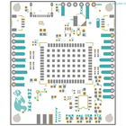
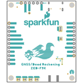
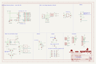
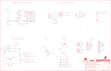
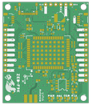
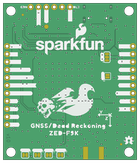

Contents
========

* [PRS18719 > SparkFun GNSS Dead Reckoning ZED-F9K](#prs18719--sparkfun-gnss-dead-reckoning-zed-f9k)
	* [Schematic](#schematic)
	* [PCB](#pcb)
	* [Interactive BOM](#interactive-bom)
	* [OOMP Parts](#oomp-parts)
	* [Images](#images)
	* [Tags](#tags)
  
![][im]
# PRS18719 > SparkFun GNSS Dead Reckoning ZED-F9K

- ID: PROJ-SPAR-18719-STAN-01
- Hex ID: PRS18719
- Name: Sparkfun
- Description: Sparkfun
- Long Link: [http://oom.lt/PROJ-SPAR-18719-STAN-01](http://oom.lt/PROJ-SPAR-18719-STAN-01)
- Short Link: [http://oom.lt/PRS18719](http://oom.lt/PRS18719)

## Schematic
  

## PCB
  

## Interactive BOM

- Interactive BOM page: [ibom.html](https://htmlpreview.github.io/?https://github.com/oomlout/oomlout_OOMP_projects/blob/main/PROJ-SPAR-18719-STAN-01/kicad/bom/ibom.html)

## OOMP Parts
  

|OOMP ID|Name|Identifier|
| :---: | :---: | :---: |
|UNMATCHED-UNMATCHED-X-UNMATCHED-01||BT1, E1, J2, U1, U2, U3, U4|
|[CAPC-0402-X-NF100-V10](https://github.com/oomlout/oomlout_OOMP_parts/tree/main/CAPC-0402-X-NF100-V10/)|[SMD (0402) 100 nF Capacitor (Ceramic) 10v](https://github.com/oomlout/oomlout_OOMP_parts/tree/main/CAPC-0402-X-NF100-V10/)|[C1, C5, C6, C7](https://github.com/oomlout/oomlout_OOMP_parts/tree/main/CAPC-0402-X-NF100-V10/)|
|CAPC-0402-X-UNMATCHED-01||C2, C9, C10|
|[CAPC-0402-X-NF1-V50](https://github.com/oomlout/oomlout_OOMP_parts/tree/main/CAPC-0402-X-NF1-V50/)|[SMD (0402) 1 nF Capacitor (Ceramic) 50v](https://github.com/oomlout/oomlout_OOMP_parts/tree/main/CAPC-0402-X-NF1-V50/)|[C3, C4](https://github.com/oomlout/oomlout_OOMP_parts/tree/main/CAPC-0402-X-NF1-V50/)|
|[CAPC-0402-X-PF47-V50](https://github.com/oomlout/oomlout_OOMP_parts/tree/main/CAPC-0402-X-PF47-V50/)|[SMD (0402) 47 pF Capacitor (Ceramic) 50v](https://github.com/oomlout/oomlout_OOMP_parts/tree/main/CAPC-0402-X-PF47-V50/)|[C8](https://github.com/oomlout/oomlout_OOMP_parts/tree/main/CAPC-0402-X-PF47-V50/)|
|DIOD-SO23-X-UNMATCHED-01||D1, D2|
|DIOD-UNMATCHED-X-UNMATCHED-01||D3|
|[LEDS-0603-R-STAN-01](https://github.com/oomlout/oomlout_OOMP_parts/tree/main/LEDS-0603-R-STAN-01/)|[SMD (0603) Red LED](https://github.com/oomlout/oomlout_OOMP_parts/tree/main/LEDS-0603-R-STAN-01/)|[D4](https://github.com/oomlout/oomlout_OOMP_parts/tree/main/LEDS-0603-R-STAN-01/)|
|[LEDS-0603-L-STAN-01](https://github.com/oomlout/oomlout_OOMP_parts/tree/main/LEDS-0603-L-STAN-01/)|[SMD (0603) Blue LED](https://github.com/oomlout/oomlout_OOMP_parts/tree/main/LEDS-0603-L-STAN-01/)|[D5, D6, D7](https://github.com/oomlout/oomlout_OOMP_parts/tree/main/LEDS-0603-L-STAN-01/)|
|DIOD-S323-X-UNMATCHED-01||D8|
|DIOD-0402-X-UNMATCHED-01||D9|
|FERB-0402-X-UNMATCHED-01||FB1|
|[HEAD-JSTSH-X-PI04-RS](https://github.com/oomlout/oomlout_OOMP_parts/tree/main/HEAD-JSTSH-X-PI04-RS/)|[JST XH (1 mm) 4 Pin Header Right Angle (SMD)](https://github.com/oomlout/oomlout_OOMP_parts/tree/main/HEAD-JSTSH-X-PI04-RS/)|[J3, J4, LOGO2](https://github.com/oomlout/oomlout_OOMP_parts/tree/main/HEAD-JSTSH-X-PI04-RS/)|
|HEAD-I01-X-PI11-01||J5|
|[HEAD-I01-X-PI09-01](https://github.com/oomlout/oomlout_OOMP_parts/tree/main/HEAD-I01-X-PI09-01/)|[2.54 mm 9 Pin Header](https://github.com/oomlout/oomlout_OOMP_parts/tree/main/HEAD-I01-X-PI09-01/)|[J6](https://github.com/oomlout/oomlout_OOMP_parts/tree/main/HEAD-I01-X-PI09-01/)|
|[HEAD-I01-X-PI06-01](https://github.com/oomlout/oomlout_OOMP_parts/tree/main/HEAD-I01-X-PI06-01/)|[2.54 mm 6 Pin Header](https://github.com/oomlout/oomlout_OOMP_parts/tree/main/HEAD-I01-X-PI06-01/)|[J7](https://github.com/oomlout/oomlout_OOMP_parts/tree/main/HEAD-I01-X-PI06-01/)|
|RESE-0603-X-UNMATCHED-01||R1, R2, R24|
|RESE-0402-X-O1003-01||R3|
|RESE-0603-X-O911-01||R4, R7|
|[RESE-0603-X-O471-01](https://github.com/oomlout/oomlout_OOMP_parts/tree/main/RESE-0603-X-O471-01/)|[SMD (0603) 470 Ohm Resistor](https://github.com/oomlout/oomlout_OOMP_parts/tree/main/RESE-0603-X-O471-01/)|[R5, R6](https://github.com/oomlout/oomlout_OOMP_parts/tree/main/RESE-0603-X-O471-01/)|
|RESE-1206-X-O330-01||R8, R9, R10, R11|
|[RESE-0603-X-O330-01](https://github.com/oomlout/oomlout_OOMP_parts/tree/main/RESE-0603-X-O330-01/)|[SMD (0603) 33 Ohm Resistor](https://github.com/oomlout/oomlout_OOMP_parts/tree/main/RESE-0603-X-O330-01/)|[R12, R13](https://github.com/oomlout/oomlout_OOMP_parts/tree/main/RESE-0603-X-O330-01/)|
|[RESE-0402-X-O472-01](https://github.com/oomlout/oomlout_OOMP_parts/tree/main/RESE-0402-X-O472-01/)|[SMD (0402) 4.7k Ohm Resistor](https://github.com/oomlout/oomlout_OOMP_parts/tree/main/RESE-0402-X-O472-01/)|[R14, R15, R16, R23](https://github.com/oomlout/oomlout_OOMP_parts/tree/main/RESE-0402-X-O472-01/)|
|RESE-0402-X-UNMATCHED-01||R17, R18, R19, R20|
|[RESE-0603-X-O270-01](https://github.com/oomlout/oomlout_OOMP_parts/tree/main/RESE-0603-X-O270-01/)|[SMD (0603) 27 Ohm Resistor](https://github.com/oomlout/oomlout_OOMP_parts/tree/main/RESE-0603-X-O270-01/)|[R21, R22](https://github.com/oomlout/oomlout_OOMP_parts/tree/main/RESE-0603-X-O270-01/)|
|[VREG-SO235-X-KAP2112K-V33D](https://github.com/oomlout/oomlout_OOMP_parts/tree/main/VREG-SO235-X-KAP2112K-V33D/)|[SMD (SOT-23-5) AP2112K Voltage Regulator 3.3v](https://github.com/oomlout/oomlout_OOMP_parts/tree/main/VREG-SO235-X-KAP2112K-V33D/)|[U5](https://github.com/oomlout/oomlout_OOMP_parts/tree/main/VREG-SO235-X-KAP2112K-V33D/)|

## Images
  
  

|bominteractivefront|bominteractiveback|kicadPcb3d|kicadPcb3dFront|kicadPcb3dBack|kicadSchem|eagleImage|eagleSchemImage|pcbdraw|pcbdrawback|
| :---: | :---: | :---: | :---: | :---: | :---: | :---: | :---: | :---: | :---: |
|||||||||||

## Tags

- hexID: PRS18719
- oompType: PROJ
- oompSize: SPAR
- oompColor: 18719
- oompDesc: STAN
- oompIndex: 01
- oompName: SparkFun GNSS Dead Reckoning ZED-F9K
- sources: All source files from https://github.com/sparkfun/SparkFun_GNSS_Dead_Reckoning_ZED-F9K (source licence details in srcLicense.md)
- linkBuyPage: https://www.sparkfun.com/products/18719
- oompID: PROJ-SPAR-18719-STAN-01
- oompParts: BT1,UNMATCHED-UNMATCHED-X-UNMATCHED-01
- oompParts: C1,CAPC-0402-X-NF100-V10
- oompParts: C2,CAPC-0402-X-UNMATCHED-01
- oompParts: C3,CAPC-0402-X-NF1-V50
- oompParts: C4,CAPC-0402-X-NF1-V50
- oompParts: C5,CAPC-0402-X-NF100-V10
- oompParts: C6,CAPC-0402-X-NF100-V10
- oompParts: C7,CAPC-0402-X-NF100-V10
- oompParts: C8,CAPC-0402-X-PF47-V50
- oompParts: C9,CAPC-0402-X-UNMATCHED-01
- oompParts: C10,CAPC-0402-X-UNMATCHED-01
- oompParts: D1,DIOD-SO23-X-UNMATCHED-01
- oompParts: D2,DIOD-SO23-X-UNMATCHED-01
- oompParts: D3,DIOD-UNMATCHED-X-UNMATCHED-01
- oompParts: D4,LEDS-0603-R-STAN-01
- oompParts: D5,LEDS-0603-L-STAN-01
- oompParts: D6,LEDS-0603-L-STAN-01
- oompParts: D7,LEDS-0603-L-STAN-01
- oompParts: D8,DIOD-S323-X-UNMATCHED-01
- oompParts: D9,DIOD-0402-X-UNMATCHED-01
- oompParts: E1,UNMATCHED-UNMATCHED-X-UNMATCHED-01
- oompParts: FB1,FERB-0402-X-UNMATCHED-01
- oompParts: J2,UNMATCHED-UNMATCHED-X-UNMATCHED-01
- oompParts: J3,HEAD-JSTSH-X-PI04-RS
- oompParts: J4,HEAD-JSTSH-X-PI04-RS
- oompParts: J5,HEAD-I01-X-PI11-01
- oompParts: J6,HEAD-I01-X-PI09-01
- oompParts: J7,HEAD-I01-X-PI06-01
- oompParts: LOGO2,HEAD-JSTSH-X-PI04-RS
- oompParts: R1,RESE-0603-X-UNMATCHED-01
- oompParts: R2,RESE-0603-X-UNMATCHED-01
- oompParts: R3,RESE-0402-X-O1003-01
- oompParts: R4,RESE-0603-X-O911-01
- oompParts: R5,RESE-0603-X-O471-01
- oompParts: R6,RESE-0603-X-O471-01
- oompParts: R7,RESE-0603-X-O911-01
- oompParts: R8,RESE-1206-X-O330-01
- oompParts: R9,RESE-1206-X-O330-01
- oompParts: R10,RESE-1206-X-O330-01
- oompParts: R11,RESE-1206-X-O330-01
- oompParts: R12,RESE-0603-X-O330-01
- oompParts: R13,RESE-0603-X-O330-01
- oompParts: R14,RESE-0402-X-O472-01
- oompParts: R15,RESE-0402-X-O472-01
- oompParts: R16,RESE-0402-X-O472-01
- oompParts: R17,RESE-0402-X-UNMATCHED-01
- oompParts: R18,RESE-0402-X-UNMATCHED-01
- oompParts: R19,RESE-0402-X-UNMATCHED-01
- oompParts: R20,RESE-0402-X-UNMATCHED-01
- oompParts: R21,RESE-0603-X-O270-01
- oompParts: R22,RESE-0603-X-O270-01
- oompParts: R23,RESE-0402-X-O472-01
- oompParts: R24,RESE-0603-X-UNMATCHED-01
- oompParts: U1,UNMATCHED-UNMATCHED-X-UNMATCHED-01
- oompParts: U2,UNMATCHED-UNMATCHED-X-UNMATCHED-01
- oompParts: U3,UNMATCHED-UNMATCHED-X-UNMATCHED-01
- oompParts: U4,UNMATCHED-UNMATCHED-X-UNMATCHED-01
- oompParts: U5,VREG-SO235-X-KAP2112K-V33D
- rawParts: $1_25_$_2020-03-30_22-52-05,STAND-OFFTIGHT,STAND-OFFTIGHT,STAND-OFF-TIGHT,Stand Off,,,,,,,,
- rawParts: BT1,ML414H_IV01E_BATTERY,ML414H_IV01E_BATTERY,ML414H_IV01E,SEIKO ML414H-IV01E Reflowable Lithium Battery,,,,,BATT-14267,,,
- rawParts: C1,0.1uF,0.1UF-0402T-6.3V-10%-X7R,0402-TIGHT,0.1µF ceramic capacitors,,,,,CAP-14993,,0.1uF,
- rawParts: C2,1.0uF,1.0UF-0402T-16V-10%,0402-TIGHT,1µF ceramic capacitors,,,,,CAP-12417,,1.0uF,
- rawParts: C3,1nF,1.0NF/1000PF-0402-25V-10%-X7R,0402,1nF/1,000pF ceramic capacitors,,,,,CAP-15061,,1nF,
- rawParts: C4,1nF,1.0NF/1000PF-0402-25V-10%-X7R,0402,1nF/1,000pF ceramic capacitors,,,,,CAP-15061,,1nF,
- rawParts: C5,0.1uF,0.1UF-0402T-6.3V-10%-X7R,0402-TIGHT,0.1µF ceramic capacitors,,,,,CAP-14993,,0.1uF,
- rawParts: C6,0.1uF,0.1UF-0402T-6.3V-10%-X7R,0402-TIGHT,0.1µF ceramic capacitors,,,,,CAP-14993,,0.1uF,
- rawParts: C7,0.1uF,0.1UF-0402T-6.3V-10%-X7R,0402-TIGHT,0.1µF ceramic capacitors,,,,,CAP-14993,,0.1uF,
- rawParts: C8,47pF,47PF-0402-25V-5%-X7R,0402,47pF ceramic capacitors,,,,,CAP-15063,,47pF,
- rawParts: C9,1.0uF,1.0UF-0402T-16V-10%,0402-TIGHT,1µF ceramic capacitors,,,,,CAP-12417,,1.0uF,
- rawParts: C10,1.0uF,1.0UF-0402T-16V-10%,0402-TIGHT,1µF ceramic capacitors,,,,,CAP-12417,,1.0uF,
- rawParts: D1,15V,DIODE-ZENER-BZX84C15LT3G,SOT23-3,Zener Diode,,,,,DIO-15071,,15V,
- rawParts: D2,15V,DIODE-ZENER-BZX84C15LT3G,SOT23-3,Zener Diode,,,,,DIO-15071,,15V,
- rawParts: D3,PRTR5V0U2F,PRTR5V0U2F,SOT886,A small ESD protection device. Most commonly used on USB D+/D- signals to protect large, expensive, or especially sensitive USB enabled devices.,,,,,DIO-14084,,,
- rawParts: D4,RED,LED-RED0603,LED-0603,Red SMD LED,,,,,DIO-00819,,RED,
- rawParts: D5,BLUE,LED-BLUE0603,LED-0603,Blue SMD LED,,,,,DIO-08575,,BLUE,
- rawParts: D6,BLUE,LED-BLUE0603,LED-0603,Blue SMD LED,,,,,DIO-08575,,BLUE,
- rawParts: D7,BLUE,LED-BLUE0603,LED-0603,Blue SMD LED,,,,,DIO-08575,,BLUE,
- rawParts: D8,0.5A/40V/420mV,DIODE-SCHOTTKY-PMEG4005EJ,SOD-323,Schottky diode,,,,,DIO-10955,,0.5A/40V/420mV,
- rawParts: D9,PESD0402-0402,PESD0402-0402,0402,ESD protection diode,,PESD0402-140CT-ND,,650-PESD0402-140,DIO-15359,,,
- rawParts: E1,ANTENNA-SMA-GROUNDEDEDGE_SMA,ANTENNA-SMA-GROUNDEDEDGE_SMA,SMA-EDGE,SMA Antenna Connector w/ Ground,,,,,CONN-08289,,,
- rawParts: FB1,120Ω,FERRITE_BEAD-120_OHM-0402,0402,Ferrite Bead (blocks, cores, rings, chokes, etc.),,,BLM15HB121SN1D,,NDUC-14206,,120Ω,
- rawParts: FD1,FIDUCIALUFIDUCIAL,FIDUCIALUFIDUCIAL,FIDUCIAL-MICRO,Fiducial Alignment Points,,,,,,,,
- rawParts: FD2,FIDUCIALUFIDUCIAL,FIDUCIALUFIDUCIAL,FIDUCIAL-MICRO,Fiducial Alignment Points,,,,,,,,
- rawParts: FD3,FIDUCIALUFIDUCIAL,FIDUCIALUFIDUCIAL,FIDUCIAL-MICRO,Fiducial Alignment Points,,,,,,,,
- rawParts: FD4,FIDUCIALUFIDUCIAL,FIDUCIALUFIDUCIAL,FIDUCIAL-MICRO,Fiducial Alignment Points,,,,,,,,
- rawParts: FRAME1,FRAME-LEDGER,FRAME-LEDGER,CREATIVE_COMMONS,Schematic Frame - Ledger,,,,,,,,
- rawParts: GEO,JUMPER-SMT_2_NC_TRACE_SILK,JUMPER-SMT_2_NC_TRACE_SILK,SMT-JUMPER_2_NC_TRACE_SILK,Normally closed trace jumper,,,,,,,,
- rawParts: H2,STAND-OFFTIGHT,STAND-OFFTIGHT,STAND-OFF-TIGHT,Stand Off,,,,,,,,
- rawParts: I2C,JUMPER-SMT_3_2-NC_TRACE_SILK,JUMPER-SMT_3_2-NC_TRACE_SILK,SMT-JUMPER_3_2-NC_TRACE_SILK,Normally closed trace jumper (2 of 2 connections),,,,,,,,
- rawParts: J2,,USB_C_2-LAYER_PADS,USB-C-16P-2LAYER-PADS,USB Type C 16Pin Connector,,,,,CONN-14122,,,
- rawParts: J3,QWIIC_RIGHT_ANGLE,QWIIC_CONNECTORJS-1MM,JST04_1MM_RA,SparkFun I2C Standard Qwiic Connector,,,,,CONN-13694,,QWIIC_RIGHT_ANGLE,
- rawParts: J4,QWIIC_RIGHT_ANGLE,QWIIC_CONNECTORJS-1MM,JST04_1MM_RA,SparkFun I2C Standard Qwiic Connector,,,,,CONN-13694,,QWIIC_RIGHT_ANGLE,
- rawParts: J5,,CONN_111X11_NO_SILK,1X11_NO_SILK,Multi connection point. Often used as Generic Header-pin footprint for 0.1 inch spaced/style header connections,,,,,,,,
- rawParts: J6,,CONN_09NO_SILK,1X09_NO_SILK,Multi connection point. Often used as Generic Header-pin footprint for 0.1 inch spaced/style header connections,,,,,,,,
- rawParts: J7,,CONN_06NO_SILK_NO_POP,1X06_NO_SILK,Multi connection point. Often used as Generic Header-pin footprint for 0.1 inch spaced/style header connections,,,,,,,,
- rawParts: LOGO1,OSHW-LOGOS,OSHW-LOGOS,OSHW-LOGO-S,Open-Source Hardware (OSHW) Logo,,,,,,,,
- rawParts: LOGO2,QWIIC_LOGO_4MM,QWIIC_LOGO_4MM,QWIIC_4MM,Qwiic Logos for placement on schematic and PCB. The 5.5mm silk logo is best for placing next to Qwiic connector.,,,,,,,,
- rawParts: LOGO3,SFE_LOGO_NAME_FLAME.2_INCH,SFE_LOGO_NAME_FLAME.2_INCH,SFE_LOGO_NAME_FLAME_.2,SparkFun Font Logo w/ Flame,,,,,,,,
- rawParts: PPS,JUMPER-SMT_2_NC_TRACE_SILK,JUMPER-SMT_2_NC_TRACE_SILK,SMT-JUMPER_2_NC_TRACE_SILK,Normally closed trace jumper,,,,,,,,
- rawParts: PWR,JUMPER-SMT_2_NC_TRACE_SILK,JUMPER-SMT_2_NC_TRACE_SILK,SMT-JUMPER_2_NC_TRACE_SILK,Normally closed trace jumper,,,,,,,,
- rawParts: R1,3.3k,3.3KOHM-0603-1/10W-1%,0603,3.3kΩ resistor,,,,,RES-07851,,3.3k,
- rawParts: R2,3.3k,3.3KOHM-0603-1/10W-1%,0603,3.3kΩ resistor,,,,,RES-07851,,3.3k,
- rawParts: R3,100K,100KOHM-0402-1/16W-1%,0402,100kΩ resistor,,,,,RES-13495,,100K,
- rawParts: R4,910,910OHM-0603-1/10W-5%,0603,910 Ohm Resistor,,,,,RES-13860,,910,
- rawParts: R5,470,470OHM-0603-1/10W-1%,0603,470Ω resistor,,,,,RES-07869,,470,
- rawParts: R6,470,470OHM-0603-1/10W-1%,0603,470Ω resistor,,,,,RES-07869,,470,
- rawParts: R7,910,910OHM-0603-1/10W-5%,0603,910 Ohm Resistor,,,,,RES-13860,,910,
- rawParts: R8,33,33OHM_RA-1206-1/16W-5%,1206_RA,EXB-38V330JV,,,,,RES-15081,,33,
- rawParts: R9,33,33OHM_RA-1206-1/16W-5%,1206_RA,EXB-38V330JV,,,,,RES-15081,,33,
- rawParts: R10,33,33OHM_RA-1206-1/16W-5%,1206_RA,EXB-38V330JV,,,,,RES-15081,,33,
- rawParts: R11,33,33OHM_RA-1206-1/16W-5%,1206_RA,EXB-38V330JV,,,,,RES-15081,,33,
- rawParts: R12,33,33OHM-0603-1/10W-1%,0603,33Ω resistor,,,,,RES-08270,,33,
- rawParts: R13,33,33OHM-0603-1/10W-1%,0603,33Ω resistor,,,,,RES-08270,,33,
- rawParts: R14,5.1k,5.1KOHM-0402-1/16W-1%,0402,,,,,,RES-14340,,5.1k,
- rawParts: R15,5.1k,5.1KOHM-0402-1/16W-1%,0402,,,,,,RES-14340,,5.1k,
- rawParts: R16,4.7k,4.7KOHM-0402T-1/16W-1%,0402-TIGHT,4.7kΩ resistor,,,,,RES-15343,,4.7k,
- rawParts: R17,1KOHM-0402-1/16W-1%,1KOHM-0402-1/16W-1%,0402,1kΩ resistor,,,,,RES-14342,,,
- rawParts: R18,1KOHM-0402-1/16W-1%,1KOHM-0402-1/16W-1%,0402,1kΩ resistor,,,,,RES-14342,,,
- rawParts: R19,1KOHM-0402-1/16W-1%,1KOHM-0402-1/16W-1%,0402,1kΩ resistor,,,,,RES-14342,,,
- rawParts: R20,1KOHM-0402-1/16W-1%,1KOHM-0402-1/16W-1%,0402,1kΩ resistor,,,,,RES-14342,,,
- rawParts: R21,27,27OHM-0603-1/10W-1%,0603,27Ω resistor,,,,,RES-09334,,27,
- rawParts: R22,27,27OHM-0603-1/10W-1%,0603,27Ω resistor,,,,,RES-09334,,27,
- rawParts: R23,4.7k,4.7KOHM-0402T-1/16W-1%,0402-TIGHT,4.7kΩ resistor,,,,,RES-15343,,4.7k,
- rawParts: R24,3.3k,3.3KOHM-0603-1/10W-1%,0603,3.3kΩ resistor,,,,,RES-07851,,3.3k,
- rawParts: RTK,JUMPER-SMT_2_NC_TRACE_SILK,JUMPER-SMT_2_NC_TRACE_SILK,SMT-JUMPER_2_NC_TRACE_SILK,Normally closed trace jumper,,,,,,,,
- rawParts: SPI,JUMPER-SMT_2_NO_SILK,JUMPER-SMT_2_NO_SILK,SMT-JUMPER_2_NO_SILK,Normally open jumper,,,,,,,,
- rawParts: TP1,TEST-POINT3X5,TEST-POINT3X5,PAD.03X.05,SparkFun Test Points,,,,,,,,
- rawParts: U1,DUAL-OPTO_HCPL-073LSOIC-8,DUAL-OPTO_HCPL-073LSOIC-8,SO08,HCPL-073L,,,,,IC-15070,,,
- rawParts: U2,U-BLOX_ZED_F9K,U-BLOX_ZED_F9K,UBLOX_ZED_F9K,u-blox ZED-F9K ADR,,,,,IC-14475,,,
- rawParts: U3,UHS_INVERTER_SCHMITT_TRIGGERSIP6,UHS_INVERTER_SCHMITT_TRIGGERSIP6,SIP6,NC7SZ14,,,,,IC-15068,,,
- rawParts: U4,UHS_INVERTER_SCHMITT_TRIGGERSIP6,UHS_INVERTER_SCHMITT_TRIGGERSIP6,SIP6,NC7SZ14,,,,,IC-15068,,,
- rawParts: U5,3.3V,V_REG_AP2112K-3.3V,SOT23-5,AP2112 - 600mA CMOS LDO Regulator w/ Enable,,,,,VREG-12457,,3.3V,

[im]: kicadPcb3d_450.png
