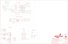

Contents
========

* [PRS18774 > SparkFun GNSS Timing-ZED-F9T](#prs18774--sparkfun-gnss-timing-zed-f9t)
	* [Schematic](#schematic)
	* [PCB](#pcb)
	* [Interactive BOM](#interactive-bom)
	* [Images](#images)
	* [Tags](#tags)
  
![][im]
# PRS18774 > SparkFun GNSS Timing-ZED-F9T

- ID: PROJ-SPAR-18774-STAN-01
- Hex ID: PRS18774
- Name: Sparkfun
- Description: Sparkfun
- Long Link: [http://oom.lt/PROJ-SPAR-18774-STAN-01](http://oom.lt/PROJ-SPAR-18774-STAN-01)
- Short Link: [http://oom.lt/PRS18774](http://oom.lt/PRS18774)

## Schematic
  

## PCB
  

## Interactive BOM

- Interactive BOM page: [ibom.html](https://htmlpreview.github.io/?https://github.com/oomlout/oomlout_OOMP_projects/blob/main/PROJ-SPAR-18774-STAN-01/kicad/bom/ibom.html)

## Images
  
  

|bominteractivefront|bominteractiveback|kicadPcb3d|kicadPcb3dFront|kicadPcb3dBack|eagleImage|eagleSchemImage|pcbdraw|pcbdrawback|
| :---: | :---: | :---: | :---: | :---: | :---: | :---: | :---: | :---: |
||||||||||

## Tags

- hexID: PRS18774
- oompType: PROJ
- oompSize: SPAR
- oompColor: 18774
- oompDesc: STAN
- oompIndex: 01
- oompName: SparkFun GNSS Timing-ZED-F9T
- sources: All source files from https://github.com/sparkfun/SparkFun_GNSS_Timing-ZED-F9T (source licence details in srcLicense.md)
- linkBuyPage: https://www.sparkfun.com/products/18774
- oompID: PROJ-SPAR-18774-STAN-01
- rawParts: B1,6.8MM_COIN_CELL,ML414H_IV01E_BATTERY,ML414H_IV01E,SEIKO ML414H-IV01E Reflowable Lithium Battery,,BATT-14267,,,
- rawParts: C1,47pF,47PF-0402_TIGHT-25V-5%-X7R,0402-TIGHT,47pF ceramic capacitors,,CAP-15063,,47pF,
- rawParts: C2,1.0uF,1.0UF-0402T-16V-10%,0402-TIGHT,1µF ceramic capacitors,,CAP-12417,,1.0uF,
- rawParts: C7,0.1uF,0.1UF-0402T-16V-10%,0402-TIGHT,0.1µF ceramic capacitors,,CAP-12416,,0.1uF,
- rawParts: C10,1.0uF,1.0UF-0402T-16V-10%,0402-TIGHT,1µF ceramic capacitors,,CAP-12417,,1.0uF,
- rawParts: C11,1.0uF,1.0UF-0402T-16V-10%,0402-TIGHT,1µF ceramic capacitors,,CAP-12417,,1.0uF,
- rawParts: C12,0.1uF,0.1UF-0402T-6.3V-10%-X7R,0402-TIGHT,0.1µF ceramic capacitors,,CAP-14993,,0.1uF,
- rawParts: C13,1.0uF,1.0UF-0402T-16V-10%,0402-TIGHT,1µF ceramic capacitors,,CAP-12417,,1.0uF,
- rawParts: D2,0.5A/40V/420mV,DIODE-SCHOTTKY-PMEG4005EJ,SOD-323,Schottky diode,,DIO-10955,,0.5A/40V/420mV,
- rawParts: D4,YEL,LED-YELLOW0603,LED-0603,Yellow SMD LED,,DIO-09003,,Yellow,
- rawParts: D5,GRN,LED-GREEN0603,LED-0603,Green SMD LED,,DIO-00821,,GREEN,
- rawParts: D6,PRTR5V0U2F,PRTR5V0U2F,SOT886,A small ESD protection device. Most commonly used on USB D+/D- signals to protect large, expensive, or especially sensitive USB enabled devices.,,DIO-14084,,,
- rawParts: D7,RED,LED-RED0603,LED-0603,Red SMD LED,,DIO-00819,,RED,
- rawParts: D8,BLU,LED-BLUE0603,LED-0603,Blue SMD LED,,DIO-08575,,BLUE,
- rawParts: D10,PESD0402-0402T,PESD0402-0402T,0402-TIGHT,ESD protection diode,,DIO-15359,,,
- rawParts: E1,SMA,ANTENNA-SMA-GROUNDEDEDGE_SMA,SMA-EDGE,SMA Antenna Connector w/ Ground,,CONN-08289,,,
- rawParts: E2,SMA,ANTENNA-SMA-GROUNDEDEDGE_SMA,SMA-EDGE,SMA Antenna Connector w/ Ground,,CONN-08289,,,
- rawParts: E3,SMA,ANTENNA-SMA-GROUNDEDEDGE_SMA,SMA-EDGE,SMA Antenna Connector w/ Ground,,CONN-08289,,,
- rawParts: FB1,2.66Ω,FERRITE_BEAD-0402-2.66Ω-1GHZ,0402-TIGHT,Ferrite Bead (blocks, cores, rings, chokes, etc.),,NDUC-15072,,2.66Ω,
- rawParts: FENCE,JUMPER-SMT_2_NC_TRACE_SILK,JUMPER-SMT_2_NC_TRACE_SILK,SMT-JUMPER_2_NC_TRACE_SILK,Normally closed trace jumper,,,,,
- rawParts: FRAME2,FRAME-LEDGER,FRAME-LEDGER,CREATIVE_COMMONS,Schematic Frame - Ledger,,,,,
- rawParts: H1,STAND-OFF,STAND-OFF,STAND-OFF,Stand Off,,,,,
- rawParts: H2,STAND-OFF,STAND-OFF,STAND-OFF,Stand Off,,,,,
- rawParts: H3,STAND-OFF,STAND-OFF,STAND-OFF,Stand Off,,,,,
- rawParts: H4,STAND-OFF,STAND-OFF,STAND-OFF,Stand Off,,,,,
- rawParts: J1,Radio,6_PIN_SERIAL_TARGET_NO_SILK,1X06_NO_SILK,6-pin header connection for use with the FTDI BASIC pinout - TARGET SIDE.,,,,,
- rawParts: J2,Qwiic Right Angle,I2C_STANDARDQWIIC,JST04_1MM_RA,SparkFun I2C Standard Pinout Header,,CONN-13694,,Qwiic Right Angle,
- rawParts: J3,PTH,I2C_STANDARD_NO_SILK,1X04_NO_SILK,SparkFun I2C Standard Pinout Header,,,,,
- rawParts: J4,Qwiic Right Angle,I2C_STANDARDQWIIC,JST04_1MM_RA,SparkFun I2C Standard Pinout Header,,CONN-13694,,Qwiic Right Angle,
- rawParts: J5,USB Female Type C Connector,USB_C_4-LAYER_PADS,USB-C-16P_4LAYER-PADS,USB Type C 16Pin Connector,,CONN-14122,,,
- rawParts: J6,,CONN_06NO_SILK_FEMALE_PTH,1X06_NO_SILK,Multi connection point. Often used as Generic Header-pin footprint for 0.1 inch spaced/style header connections,,CONN-08437,,,
- rawParts: J7,,CONN_09NO_SILK,1X09_NO_SILK,Multi connection point. Often used as Generic Header-pin footprint for 0.1 inch spaced/style header connections,,,,,
- rawParts: J8,,CONN_021X02_NO_SILK,1X02_NO_SILK,Multi connection point. Often used as Generic Header-pin footprint for 0.1 inch spaced/style header connections,,,,,
- rawParts: JP5,JUMPER-SMT_3_NO_SILK,JUMPER-SMT_3_NO_SILK,SMT-JUMPER_3_NO_SILK,Normally open jumper,,,,,
- rawParts: JP21,FIDUCIALUFIDUCIAL,FIDUCIALUFIDUCIAL,FIDUCIAL-MICRO,Fiducial Alignment Points,,,,,
- rawParts: JP61,FIDUCIALUFIDUCIAL,FIDUCIALUFIDUCIAL,FIDUCIAL-MICRO,Fiducial Alignment Points,,,,,
- rawParts: JP71,FIDUCIALUFIDUCIAL,FIDUCIALUFIDUCIAL,FIDUCIAL-MICRO,Fiducial Alignment Points,,,,,
- rawParts: JP81,FIDUCIALUFIDUCIAL,FIDUCIALUFIDUCIAL,FIDUCIAL-MICRO,Fiducial Alignment Points,,,,,
- rawParts: LOGO1,OSHW-LOGOMINI,OSHW-LOGOMINI,OSHW-LOGO-MINI,Open-Source Hardware (OSHW) Logo,,,,,
- rawParts: LOGO2,SFE_LOGO_NAME_FLAME.1_INCH,SFE_LOGO_NAME_FLAME.1_INCH,SFE_LOGO_NAME_FLAME_.1,SparkFun Font Logo w/ Flame,,,,,
- rawParts: LOGO4,QWIIC_LOGO_4MM,QWIIC_LOGO_4MM,QWIIC_4MM,Qwiic Logos for placement on schematic and PCB. The 5.5mm silk logo is best for placing next to Qwiic connector.,,,,,
- rawParts: LOGO5,SFE_LOGO_NAME.1_INCH,SFE_LOGO_NAME.1_INCH,SFE_LOGO_NAME_.1,SparkFun Font Logo,,,,,
- rawParts: MEAS,JUMPER-COMBO_2_NC_TRACE,JUMPER-COMBO_2_NC_TRACE,COMBO-JUMPER_2_NC_TRACE,,,,,,
- rawParts: PPS1,JUMPER-SMT_2_NC_TRACE_SILK,JUMPER-SMT_2_NC_TRACE_SILK,SMT-JUMPER_2_NC_TRACE_SILK,Normally closed trace jumper,,,,,
- rawParts: PPS2,JUMPER-SMT_2_NC_TRACE_SILK,JUMPER-SMT_2_NC_TRACE_SILK,SMT-JUMPER_2_NC_TRACE_SILK,Normally closed trace jumper,,,,,
- rawParts: PWR,JUMPER-SMT_2_NC_TRACE_SILK,JUMPER-SMT_2_NC_TRACE_SILK,SMT-JUMPER_2_NC_TRACE_SILK,Normally closed trace jumper,,,,,
- rawParts: R1,3.3K,3.3KOHM-0402T-1/16W-1%,0402-TIGHT,3.3kΩ resistor,,RES-15923,,,
- rawParts: R2,33,33OHM_RA-1206-1/16W-5%,1206_RA,EXB-38V330JV,,RES-15081,,33,
- rawParts: R3,33,33OHM_RA-1206-1/16W-5%,1206_RA,EXB-38V330JV,,RES-15081,,33,
- rawParts: R4,33,33OHM_RA-1206-1/16W-5%,1206_RA,EXB-38V330JV,,RES-15081,,33,
- rawParts: R9,33,33OHM_RA-1206-1/16W-5%,1206_RA,EXB-38V330JV,,RES-15081,,33,
- rawParts: R10,1k,1KOHM-0402T-1/16W-1%,0402-TIGHT,1kΩ resistor,,RES-14342,,1k,
- rawParts: R11,1k,1KOHM-0402T-1/16W-1%,0402-TIGHT,1kΩ resistor,,RES-14342,,1k,
- rawParts: R12,1k,1KOHM-0402T-1/16W-1%,0402-TIGHT,1kΩ resistor,,RES-14342,,1k,
- rawParts: R13,1k,1KOHM-0402T-1/16W-1%,0402-TIGHT,1kΩ resistor,,RES-14342,,1k,
- rawParts: R14,10Ω,10OHM-0402-1/16W-5%,0402-TIGHT,10Ω resistor,,RES-16072,,10Ω,
- rawParts: R15,100k,100KOHM-0402T-1/16W-1%,0402-TIGHT,100kΩ resistor,,RES-13495,,100k,
- rawParts: R16,5.1k,5.1KOHM-0402T-1/16W-1%,0402-TIGHT,,,RES-14340,,5.1k,
- rawParts: R17,5.1k,5.1KOHM-0402T-1/16W-1%,0402-TIGHT,,,RES-14340,,5.1k,
- rawParts: R19,2.2k,2.2KOHM-0402T-1/16W-1%,0402-TIGHT,2.2kΩ resistor,,RES-14341,,2.2k,
- rawParts: R20,2.2k,2.2KOHM-0402T-1/16W-1%,0402-TIGHT,2.2kΩ resistor,,RES-14341,,2.2k,
- rawParts: R27,27OHM,27OHM,0402-TIGHT,27Ω resistor,,RES-15238,,,
- rawParts: R28,27OHM,27OHM,0402-TIGHT,27Ω resistor,,RES-15238,,,
- rawParts: TP1,JUMPER-SMT_2_NC_TRACE_SILK,JUMPER-SMT_2_NC_TRACE_SILK,SMT-JUMPER_2_NC_TRACE_SILK,Normally closed trace jumper,,,,,
- rawParts: TP2,JUMPER-SMT_2_NC_TRACE_SILK,JUMPER-SMT_2_NC_TRACE_SILK,SMT-JUMPER_2_NC_TRACE_SILK,Normally closed trace jumper,,,,,
- rawParts: U$2,SPECIAL_INSTRUCTIONS-ORDERING,SPECIAL_INSTRUCTIONS-ORDERING,ORDERING_INSTRUCTIONS,Special Ordering/Production Instructions Alert,,,,,
- rawParts: U3,U-BLOX_ZED_F9T,U-BLOX_ZED_F9RT,ZED-F9X,u-blox ZED-F9T,,IC-16292,,,
- rawParts: U5,AP2112K-3.3V,V_REG_AP2112K-3.3V,SOT23-5,AP2112 - 600mA CMOS LDO Regulator w/ Enable,,VREG-12457,,3.3V,

[im]: kicadPcb3d_450.png
