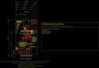
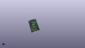

Contents
========

* [PROJ-SPAR-19038-STAN-01>SparkFun MicroMod Single Pair Ethernet Function Board ADIN1110](#proj-spar-19038-stan-01sparkfun-micromod-single-pair-ethernet-function-board-adin1110)
	* [Images](#images)
	* [Interactive BOM](#interactive-bom)
	* [OOMP Parts](#oomp-parts)
	* [Tags](#tags)
  
![][im]
# PROJ-SPAR-19038-STAN-01>SparkFun MicroMod Single Pair Ethernet Function Board ADIN1110

- ID: PROJ-SPAR-19038-STAN-01
- Hex ID: PRS19038
- Name: SparkFun MicroMod Single Pair Ethernet Function Board ADIN1110
- Description: 

## Images
  
  

|eagleImage|kicadPcb3dFront|kicadPcb3dBack|kicadPcb3d|
| :---: | :---: | :---: | :---: |
|||||

## Interactive BOM

- Interactive BOM page: [ibom.html](kicad/bom/ibom.html)

## OOMP Parts
  

|OOMP Parts|
| :---: |
|CAPC-0603-X-NF220-V50, C1, 21.861778221999998, 45.35678127, 90,C1, 0.22uF, 0603, SparkFun-Capacitors, (0.86069993, 1.78570005), R90|
|CAPC-0603-X-NF220-V50, C2, 20.403818729999998, 45.35678127, 90,C2, 0.22uF, 0603, SparkFun-Capacitors, (0.80329995, 1.78570005), R90|
|<table><tr><td></td><td> C3</td><td>[CAPC-0603-X-NF100-V50 SMD (0603) 100 nF Capacitor (Ceramic) 50v](https://github.com/oomlout/oomlout_OOMP_parts/tree/main/CAPC-0603-X-NF100-V50/)</td><td>[C6N100](https://github.com/oomlout/oomlout_OOMP_parts/tree/main/CAPC-0603-X-NF100-V50/)</td></tr></table>|
|<table><tr><td></td><td> C4</td><td>[CAPC-0603-X-NF100-V50 SMD (0603) 100 nF Capacitor (Ceramic) 50v](https://github.com/oomlout/oomlout_OOMP_parts/tree/main/CAPC-0603-X-NF100-V50/)</td><td>[C6N100](https://github.com/oomlout/oomlout_OOMP_parts/tree/main/CAPC-0603-X-NF100-V50/)</td></tr></table>|
|CAPC-0603-X-UNMATCHED-01, C5, 24.875400084, 36.028578184, 90,C5, 10pF, 0603, SparkFun-Capacitors, (0.97934646, 1.41844796), R90|
|CAPC-0603-X-UNMATCHED-01, C6, 23.406681152, 36.716921993999996, 90,C6, 10pF, 0603, SparkFun-Capacitors, (0.92152288, 1.44554811), R90|
|CAPC-0603-X-UNMATCHED-01, C7, 6.999999969999999, 52.99999991799999, 270,C7, 3.3nF, 0603, SparkFun-Capacitors, (0.27559055, 2.08661417), R270|
|CAPC-0603-X-UNMATCHED-01, C8, 5.301000065999999, 13.530000118, 270,C8, 1.0uF, 0603, SparkFun-Capacitors, (0.20870079, 0.53267717), R270|
|CAPC-0603-X-UNMATCHED-01, C9, 13.668000095999998, 13.540000097999998, 270,C9, 1.0uF, 0603, SparkFun-Capacitors, (0.53811024, 0.53307087), R270|
|CAPC-0402-X-NF100-V50, C10, 13.832840507999999, 36.347781254, 90,C10, 0.1uF, 0402-TIGHT, SparkFun-Capacitors, (0.54460002, 1.43101501), R90|
|CAPC-0603-X-NF680-V50, C11, 13.286743809999999, 33.67023746, 180,C11, 0.68uF, 0603, SparkFun-Capacitors, (0.52310015, 1.3255999), R180|
|CAPC-0402-X-UNMATCHED-01, C12, 14.848840507999999, 36.339781269999996, 90,C12, 10nF, 0402-TIGHT, SparkFun-Capacitors, (0.58460002, 1.43070005), R90|
|CAPC-0402-X-NF100-V50, C13, 18.160999999999998, 38.98646254, 180,C13, 0.1uF, 0402-TIGHT, SparkFun-Capacitors, (0.715, 1.5349001), R180|
|CAPC-0402-X-UNMATCHED-01, C14, 18.171159492, 38.028878222, 180,C14, 10nF, 0402-TIGHT, SparkFun-Capacitors, (0.71539998, 1.49719993), R180|
|CAPC-0402-X-NF100-V50, C15, 13.629640507999998, 34.874199999999995, 180,C15, 0.1uF, 0402-TIGHT, SparkFun-Capacitors, (0.53660002, 1.373), R180|
|CAPC-0402-X-NF100-V50, C16, 18.293084318, 28.529284318, 180,C16, 0.1uF, 0402-TIGHT, SparkFun-Capacitors, (0.72020017, 1.12320017), R180|
|CAPC-0402-X-UNMATCHED-01, C17, 18.308315682, 29.486859491999997, 180,C17, 10nF, 0402-TIGHT, SparkFun-Capacitors, (0.72079983, 1.16089998), R180|
|CAPC-0402-X-NF100-V50, C18, 15.821662539999998, 39.347140507999995, 90,C18, 0.1uF, 0402-TIGHT, SparkFun-Capacitors, (0.6229001, 1.54910002), R90|
|CAPC-0402-X-UNMATCHED-01, C19, 14.67866254, 39.37, 90,C19, 1.0uF, 0402-TIGHT, SparkFun-Capacitors, (0.5779001, 1.55), R90|
|UNMATCHED-UNMATCHED-X-UNMATCHED-01, C20, 15.130778221999998, 51.361343809999994, 180,C20, 1.0nF/2kV, 1206, SparkFun-Capacitors, (0.59569993, 2.02210015), R180|
|UNMATCHED-0603-X-NF100-01, C21, 23.789637459999998, 51.821078222, 0,C21, 0.1uF/50V, 0603, SparkFun-Capacitors, (0.9365999, 2.04019993), R0|
|UNMATCHED-0805-X-UNMATCHED-01, C22, 17.421859492, 46.10354381, 180,C22, 470nF/100V, 0805, SparkFun-Capacitors, (0.68589998, 1.81510015), R180|
|CAPC-0402-X-NF100-V50, C23, 26.669999999999998, 41.91, 270,C23, 0.1uF, 0402-TIGHT, SparkFun-Capacitors, (1.05, 1.65), R270|
|UNMATCHED-UNMATCHED-X-UNMATCHED-01, EWP, 24.539999941999998, 14.269999908, M0,EWP, JUMPER-SMT_2_NO_SILK, SMT-JUMPER_2_NO_SILK, SparkFun-Jumpers, (0.96614173, 0.56181102), MR0|
|UNMATCHED-UNMATCHED-X-UNMATCHED-01, J1, 19.000000099999998, 65.00000004799999, 180,J1, IP20(RJ50), T1_INDUSTRIAL_JACK_AH_IP20, ADIN1110, (0.7480315, 2.55905512), R180|
|UNMATCHED-UNMATCHED-X-UNMATCHED-01, J2, 19.000000099999998, 0.0, 0,J2, MICROMOD_FUNCTION_STANDARD, M.2-CARD-E-22_FUNCTION_STANDARD, SparkFun-MicroMod, (0.7480315, 0), R0|
|UNMATCHED-UNMATCHED-X-UNMATCHED-01, LED-0, 30.479999999999997, 29.209999999999997, M0,LED-0, JUMPER-SMT_2_NC_TRACE_SILK, SMT-JUMPER_2_NC_TRACE_SILK, SparkFun-Jumpers, (1.2, 1.15), MR0|
|UNMATCHED-UNMATCHED-X-UNMATCHED-01, LED-1, 30.479999999999997, 34.29, M0,LED-1, JUMPER-SMT_2_NC_TRACE_SILK, SMT-JUMPER_2_NC_TRACE_SILK, SparkFun-Jumpers, (1.2, 1.35), MR0|
|UNMATCHED-UNMATCHED-X-UNMATCHED-01, LED-LINK, 30.479999999999997, 31.75, M0,LED-LINK, JUMPER-SMT_2_NC_TRACE_SILK, SMT-JUMPER_2_NC_TRACE_SILK, SparkFun-Jumpers, (1.2, 1.25), MR0|
|UNMATCHED-UNMATCHED-X-UNMATCHED-01, LED-PWR, 30.479999999999997, 26.669999999999998, M0,LED-PWR, JUMPER-SMT_2_NC_TRACE_SILK, SMT-JUMPER_2_NC_TRACE_SILK, SparkFun-Jumpers, (1.2, 1.05), MR0|
|UNMATCHED-0603-X-UNMATCHED-01, LED_0, 33.02004064, 63.076399882, 90,LED_0, Green, LED-0603, SparkFun-LED, (1.3000016, 2.48332283), R90|
|UNMATCHED-0603-X-UNMATCHED-01, LED_1, 30.48004064, 63.076399882, 90,LED_1, Yellow, LED-0603, SparkFun-LED, (1.2000016, 2.48332283), R90|
|UNMATCHED-0603-X-UNMATCHED-01, LINK_ST, 27.940040639999996, 63.076399882, 90,LINK_ST, Blue, LED-0603, SparkFun-LED, (1.1000016, 2.48332283), R90|
|UNMATCHED-UNMATCHED-X-UNMATCHED-01, MEAS, 2.969999902, 14.220000008, M90,MEAS, JUMPER-COMBO_2_NC_TRACE, COMBO-JUMPER_2_NC_TRACE, SparkFun-Jumpers, (0.11692913, 0.55984252), MR90|
|UNMATCHED-UNMATCHED-X-UNMATCHED-01, MS_SEL, 7.619999999999999, 20.32, M0,MS_SEL, SMT-JUMPER_2_NO_SILK, SparkFun-Jumpers, (0.3, 0.8), MR0|
|UNMATCHED-0603-X-UNMATCHED-01, PWR, 35.56004064, 63.076399882, 90,PWR, Red, LED-0603, SparkFun-LED, (1.4000016, 2.48332283), R90|
|UNMATCHED-UNMATCHED-X-UNMATCHED-01, Q1, 12.46532178, 8.19709689, 90,Q1, 220mA/50V/3.5?, SOT23-3, SparkFun-DiscreteSemi, (0.4907607, 0.32272035), R90|
|UNMATCHED-UNMATCHED-X-UNMATCHED-01, Q2, 7.211562412, 8.122400061999999, 270,Q2, 20V/4.2A/52m?/1.4W, SOT23-3, SparkFun-DiscreteSemi, (0.28391978, 0.31977953), R270|
|RESE-0603-X-UNMATCHED-01, R1, 18.206721778, 41.60012508, 270,R1, 49.9, 0603, SparkFun-Resistors, (0.71680007, 1.6378002), R270|
|RESE-0603-X-UNMATCHED-01, R2, 23.434040508, 39.283634412, 180,R2, 49.9, 0603, SparkFun-Resistors, (0.92260002, 1.54659978), R180|
|RESE-0402-X-UNMATCHED-01, R3, 19.573240508, 41.59758127, 90,R3, 5.1k, 0402-TIGHT, SparkFun-Resistors, (0.77060002, 1.63770005), R90|
|RESE-0402-X-UNMATCHED-01, R4, 23.500078222, 40.464734412, 180,R4, 5.1k, 0402-TIGHT, SparkFun-Resistors, (0.92519993, 1.59309978), R180|
|RESE-0402-X-UNMATCHED-01, R5, 20.812759491999998, 39.3065, 0,R5, 10.2k, 0402-TIGHT, SparkFun-Resistors, (0.81939998, 1.5475), R0|
|RESE-0402-X-UNMATCHED-01, R6, 20.289521777999997, 38.387018729999994, 0,R6, 10.2k, 0402-TIGHT, SparkFun-Resistors, (0.79880007, 1.51129995), R0|
|<table><tr><td></td><td> R7</td><td>[RESE-0603-X-O103-01 SMD (0603) 10k Ohm Resistor](https://github.com/oomlout/oomlout_OOMP_parts/tree/main/RESE-0603-X-O103-01/)</td><td>[R6103](https://github.com/oomlout/oomlout_OOMP_parts/tree/main/RESE-0603-X-O103-01/)</td></tr></table>|
|<table><tr><td></td><td> R8</td><td>[RESE-0603-X-O103-01 SMD (0603) 10k Ohm Resistor](https://github.com/oomlout/oomlout_OOMP_parts/tree/main/RESE-0603-X-O103-01/)</td><td>[R6103](https://github.com/oomlout/oomlout_OOMP_parts/tree/main/RESE-0603-X-O103-01/)</td></tr></table>|
|RESE-0402-X-UNMATCHED-01, R9, 33.019999999999996, 26.669999999999998, 180,R9, 1k, 0402-TIGHT, SparkFun-Resistors, (1.3, 1.05), R180|
|RESE-0603-X-UNMATCHED-01, R10, 12.7762, 32.20466254, 180,R10, 1.5k, 0603, SparkFun-Resistors, (0.503, 1.2679001), R180|
|RESE-0402-X-UNMATCHED-01, R11, 33.019999999999996, 50.8, 90,R11, 1k, 0402-TIGHT, SparkFun-Resistors, (1.3, 2), R90|
|RESE-0402-X-UNMATCHED-01, R12, 3.8099999999999996, 25.4, 180,R12, 4.7k, 0402-TIGHT, SparkFun-Resistors, (0.15, 1), R180|
|RESE-0402-X-UNMATCHED-01, R13, 3.8099999999999996, 24.13, 180,R13, 4.7k, 0402-TIGHT, SparkFun-Resistors, (0.15, 0.95), R180|
|RESE-0402-X-UNMATCHED-01, R14, 3.8099999999999996, 22.86, 180,R14, 4.7k, 0402-TIGHT, SparkFun-Resistors, (0.15, 0.9), R180|
|RESE-0402-X-UNMATCHED-01, R15, 3.8099999999999996, 21.59, 180,R15, 4.7k, 0402-TIGHT, SparkFun-Resistors, (0.15, 0.85), R180|
|RESE-0402-X-UNMATCHED-01, R16, 24.13, 17.779999999999998, 180,R16, 4.7k, 0402-TIGHT, SparkFun-Resistors, (0.95, 0.7), R180|
|RESE-0402-X-UNMATCHED-01, R17, 33.019999999999996, 29.209999999999997, 0,R17, 4.7k, 0402-TIGHT, SparkFun-Resistors, (1.3, 1.15), R0|
|RESE-0402-X-UNMATCHED-01, R18, 33.019999999999996, 34.29, 0,R18, 4.7k, 0402-TIGHT, SparkFun-Resistors, (1.3, 1.35), R0|
|RESE-0402-X-UNMATCHED-01, R19, 33.019999999999996, 31.75, 0,R19, 4.7k, 0402-TIGHT, SparkFun-Resistors, (1.3, 1.25), R0|
|RESE-0402-X-UNMATCHED-01, R20, 30.479999999999997, 50.8, 90,R20, 1k, 0402-TIGHT, SparkFun-Resistors, (1.2, 2), R90|
|RESE-0402-X-UNMATCHED-01, R21, 29.209999999999997, 50.8, 90,R21, 1k, 0402-TIGHT, SparkFun-Resistors, (1.15, 2), R90|
|<table><tr><td></td><td> R22</td><td>[RESE-0603-X-O103-01 SMD (0603) 10k Ohm Resistor](https://github.com/oomlout/oomlout_OOMP_parts/tree/main/RESE-0603-X-O103-01/)</td><td>[R6103](https://github.com/oomlout/oomlout_OOMP_parts/tree/main/RESE-0603-X-O103-01/)</td></tr></table>|
|RESE-0603-X-UNMATCHED-01, R23, 16.522696952, 48.595278222, 90,R23, 100?, 0603, SparkFun-Resistors, (0.65049988, 1.91319993), R90|
|RESE-0603-X-UNMATCHED-01, R24, 7.619999999999999, 34.29, 180,R24, 1.5k, 0603, SparkFun-Resistors, (0.3, 1.35), R180|
|RESE-0402-X-UNMATCHED-01, R25, 12.191999999999998, 30.861, 180,R25, 4.7k, 0402-TIGHT, SparkFun-Resistors, (0.48, 1.215), R180|
|RESE-0603-X-UNMATCHED-01, R26, 9.652, 8.128, 270,R26, 100, 0603, SparkFun-Resistors, (0.38, 0.32), R270|
|RESE-0603-X-UNMATCHED-01, R27, 26.669999999999998, 45.72, 90,R27, 4.7k, 0603, SparkFun-Resistors, (1.05, 1.8), R90|
|<table><tr><td></td><td> R28</td><td>[RESE-0402-X-O104-01 SMD (0402) 100k Ohm Resistor](https://github.com/oomlout/oomlout_OOMP_parts/tree/main/RESE-0402-X-O104-01/)</td><td>[R42104](https://github.com/oomlout/oomlout_OOMP_parts/tree/main/RESE-0402-X-O104-01/)</td></tr></table>|
|RESE-0603-X-UNMATCHED-01, R29, 15.692118729999999, 6.040121778, 90,R29, 100?, 0603, SparkFun-Resistors, (0.61779995, 0.23780007), R90|
|UNMATCHED-UNMATCHED-X-UNMATCHED-01, S1, 31.876999999999995, 43.942, 270,S1, RESET, TACTILE_SWITCH_SMD_5.2MM, SparkFun-Switches, (1.255, 1.73), R270|
|UNMATCHED-UNMATCHED-X-UNMATCHED-01, SHLD, 3.5000001119999995, 53.499999933999995, M90,SHLD, SMT-JUMPER_3_1-NC_TRACE_SILK, SparkFun-Jumpers, (0.13779528, 2.10629921), MR90|
|UNMATCHED-UNMATCHED-X-UNMATCHED-01, SPI_CFG0, 26.162, 17.525999999999996, M0,SPI_CFG0, SMT-JUMPER_2_NO_SILK, SparkFun-Jumpers, (1.03, 0.69), MR0|
|UNMATCHED-UNMATCHED-X-UNMATCHED-01, SPI_CFG1, 7.619999999999999, 17.779999999999998, M0,SPI_CFG1, SMT-JUMPER_2_NO_SILK, SparkFun-Jumpers, (0.3, 0.7), MR0|
|UNMATCHED-UNMATCHED-X-UNMATCHED-01, SWPD, 7.619999999999999, 22.86, M0,SWPD, SMT-JUMPER_2_NO_SILK, SparkFun-Jumpers, (0.3, 0.9), MR0|
|UNMATCHED-UNMATCHED-X-UNMATCHED-01, T1, 20.099018729999997, 49.837340508, 90,T1, WE-STST, WE_STST_TRANSFORMER_1:1_SMD_3.2X4.7MM_74930030, ADIN1110, (0.79129995, 1.96210002), R90|
|UNMATCHED-UNMATCHED-X-UNMATCHED-01, TX2P4, 7.619999999999999, 25.4, M0,TX2P4, SMT-JUMPER_2_NO_SILK, SparkFun-Jumpers, (0.3, 1), MR0|
|UNMATCHED-UNMATCHED-X-UNMATCHED-01, U1, 19.049999999999997, 33.782, 180,U1, ADIN1110, LFCSP-40, ADIN1110, (0.75, 1.33), R180|
|UNMATCHED-UNMATCHED-X-UNMATCHED-01, U2, 21.5400001, 8.269999969999999, 270,U2, EEPROM, SO08, SparkFun-IC-Memory, (0.8480315, 0.32559055), R270|
|UNMATCHED-UNMATCHED-X-UNMATCHED-01, U3, 10.554999972, 13.530000118, 270,U3, 3.3V, SOT23-5, SparkFun-IC-Power, (0.41555118, 0.53267717), R270|
|UNMATCHED-UNMATCHED-X-UNMATCHED-01, U4, 21.30298127, 42.374812379999995, 0,U4, WE-TVS, WE_TVS_1.0X1.2MM, ADIN1110, (0.83870005, 1.6682997), R0|
|UNMATCHED-UNMATCHED-X-UNMATCHED-01, Y1, 26.540000006, 35.63200011, 90,Y1, 25MHz, CRYSTAL-SMD-2.0X1.6MM-WE, SparkFun-Clocks, (1.04488189, 1.40283465), R90|

## Tags

- hexID: PRS19038
- oompType: PROJ
- oompSize: SPAR
- oompColor: 19038
- oompDesc: STAN
- oompIndex: 01
- oompName: SparkFun MicroMod Single Pair Ethernet Function Board ADIN1110
- sources: All source files from https://github.com/sparkfun/SparkFun_MicroMod_Single_Pair_Ethernet_Function_Board_ADIN1110 (source licence details in srcLicense.md)
- linkBuyPage: https://www.sparkfun.com/products/19038
- oompPart: CAPC-0603-X-NF220-V50, C1, 21.861778221999998, 45.35678127, 90
- oompPart: CAPC-0603-X-NF220-V50, C2, 20.403818729999998, 45.35678127, 90
- oompPart: CAPC-0603-X-NF100-V50, C3, 7.300999875999999, 13.530000118, 270
- oompPart: CAPC-0603-X-NF100-V50, C4, 19.540000036, 12.270000097999999, 180
- oompPart: CAPC-0603-X-UNMATCHED-01, C5, 24.875400084, 36.028578184, 90
- oompPart: CAPC-0603-X-UNMATCHED-01, C6, 23.406681152, 36.716921993999996, 90
- oompPart: CAPC-0603-X-UNMATCHED-01, C7, 6.999999969999999, 52.99999991799999, 270
- oompPart: CAPC-0603-X-UNMATCHED-01, C8, 5.301000065999999, 13.530000118, 270
- oompPart: CAPC-0603-X-UNMATCHED-01, C9, 13.668000095999998, 13.540000097999998, 270
- oompPart: CAPC-0402-X-NF100-V50, C10, 13.832840507999999, 36.347781254, 90
- oompPart: CAPC-0603-X-NF680-V50, C11, 13.286743809999999, 33.67023746, 180
- oompPart: CAPC-0402-X-UNMATCHED-01, C12, 14.848840507999999, 36.339781269999996, 90
- oompPart: CAPC-0402-X-NF100-V50, C13, 18.160999999999998, 38.98646254, 180
- oompPart: CAPC-0402-X-UNMATCHED-01, C14, 18.171159492, 38.028878222, 180
- oompPart: CAPC-0402-X-NF100-V50, C15, 13.629640507999998, 34.874199999999995, 180
- oompPart: CAPC-0402-X-NF100-V50, C16, 18.293084318, 28.529284318, 180
- oompPart: CAPC-0402-X-UNMATCHED-01, C17, 18.308315682, 29.486859491999997, 180
- oompPart: CAPC-0402-X-NF100-V50, C18, 15.821662539999998, 39.347140507999995, 90
- oompPart: CAPC-0402-X-UNMATCHED-01, C19, 14.67866254, 39.37, 90
- oompPart: UNMATCHED-UNMATCHED-X-UNMATCHED-01, C20, 15.130778221999998, 51.361343809999994, 180
- oompPart: UNMATCHED-0603-X-NF100-01, C21, 23.789637459999998, 51.821078222, 0
- oompPart: UNMATCHED-0805-X-UNMATCHED-01, C22, 17.421859492, 46.10354381, 180
- oompPart: CAPC-0402-X-NF100-V50, C23, 26.669999999999998, 41.91, 270
- oompPart: SKIP-UNMATCHED-X-UNMATCHED-01, CIPO, 26.59633746, 31.892240507999997, 0
- oompPart: SKIP-UNMATCHED-X-UNMATCHED-01, COPI, 27.437081269999997, 30.7594, 0
- oompPart: SKIP-UNMATCHED-X-UNMATCHED-01, CS, 13.657578222, 30.83051873, 0
- oompPart: UNMATCHED-UNMATCHED-X-UNMATCHED-01, EWP, 24.539999941999998, 14.269999908, M0
- oompPart: SKIP-UNMATCHED-X-UNMATCHED-01, FD1, 1.049999932, 4.999999905999999, 90
- oompPart: SKIP-UNMATCHED-X-UNMATCHED-01, FD2, 37.050000068, 64.000000016, 90
- oompPart: SKIP-UNMATCHED-X-UNMATCHED-01, FD3, 37.050000068, 4.999999905999999, M270
- oompPart: SKIP-UNMATCHED-X-UNMATCHED-01, FD4, 1.049999932, 64.000000016, M270
- oompPart: SKIP-UNMATCHED-X-UNMATCHED-01, INT, 10.655299999999999, 33.698178221999996, 0
- oompPart: UNMATCHED-UNMATCHED-X-UNMATCHED-01, J1, 19.000000099999998, 65.00000004799999, 180
- oompPart: UNMATCHED-UNMATCHED-X-UNMATCHED-01, J2, 19.000000099999998, 0.0, 0
- oompPart: UNMATCHED-UNMATCHED-X-UNMATCHED-01, LED-0, 30.479999999999997, 29.209999999999997, M0
- oompPart: UNMATCHED-UNMATCHED-X-UNMATCHED-01, LED-1, 30.479999999999997, 34.29, M0
- oompPart: UNMATCHED-UNMATCHED-X-UNMATCHED-01, LED-LINK, 30.479999999999997, 31.75, M0
- oompPart: UNMATCHED-UNMATCHED-X-UNMATCHED-01, LED-PWR, 30.479999999999997, 26.669999999999998, M0
- oompPart: UNMATCHED-0603-X-UNMATCHED-01, LED_0, 33.02004064, 63.076399882, 90
- oompPart: UNMATCHED-0603-X-UNMATCHED-01, LED_1, 30.48004064, 63.076399882, 90
- oompPart: UNMATCHED-0603-X-UNMATCHED-01, LINK_ST, 27.940040639999996, 63.076399882, 90
- oompPart: UNMATCHED-UNMATCHED-X-UNMATCHED-01, MEAS, 2.969999902, 14.220000008, M90
- oompPart: UNMATCHED-UNMATCHED-X-UNMATCHED-01, MS_SEL, 7.619999999999999, 20.32, M0
- oompPart: UNMATCHED-0603-X-UNMATCHED-01, PWR, 35.56004064, 63.076399882, 90
- oompPart: UNMATCHED-UNMATCHED-X-UNMATCHED-01, Q1, 12.46532178, 8.19709689, 90
- oompPart: UNMATCHED-UNMATCHED-X-UNMATCHED-01, Q2, 7.211562412, 8.122400061999999, 270
- oompPart: RESE-0603-X-UNMATCHED-01, R1, 18.206721778, 41.60012508, 270
- oompPart: RESE-0603-X-UNMATCHED-01, R2, 23.434040508, 39.283634412, 180
- oompPart: RESE-0402-X-UNMATCHED-01, R3, 19.573240508, 41.59758127, 90
- oompPart: RESE-0402-X-UNMATCHED-01, R4, 23.500078222, 40.464734412, 180
- oompPart: RESE-0402-X-UNMATCHED-01, R5, 20.812759491999998, 39.3065, 0
- oompPart: RESE-0402-X-UNMATCHED-01, R6, 20.289521777999997, 38.387018729999994, 0
- oompPart: RESE-0603-X-O103-01, R7, 4.082559271999999, 8.065000126, 270
- oompPart: RESE-0603-X-O103-01, R8, 23.53999991, 12.270000097999999, 0
- oompPart: RESE-0402-X-UNMATCHED-01, R9, 33.019999999999996, 26.669999999999998, 180
- oompPart: RESE-0603-X-UNMATCHED-01, R10, 12.7762, 32.20466254, 180
- oompPart: RESE-0402-X-UNMATCHED-01, R11, 33.019999999999996, 50.8, 90
- oompPart: RESE-0402-X-UNMATCHED-01, R12, 3.8099999999999996, 25.4, 180
- oompPart: RESE-0402-X-UNMATCHED-01, R13, 3.8099999999999996, 24.13, 180
- oompPart: RESE-0402-X-UNMATCHED-01, R14, 3.8099999999999996, 22.86, 180
- oompPart: RESE-0402-X-UNMATCHED-01, R15, 3.8099999999999996, 21.59, 180
- oompPart: RESE-0402-X-UNMATCHED-01, R16, 24.13, 17.779999999999998, 180
- oompPart: RESE-0402-X-UNMATCHED-01, R17, 33.019999999999996, 29.209999999999997, 0
- oompPart: RESE-0402-X-UNMATCHED-01, R18, 33.019999999999996, 34.29, 0
- oompPart: RESE-0402-X-UNMATCHED-01, R19, 33.019999999999996, 31.75, 0
- oompPart: RESE-0402-X-UNMATCHED-01, R20, 30.479999999999997, 50.8, 90
- oompPart: RESE-0402-X-UNMATCHED-01, R21, 29.209999999999997, 50.8, 90
- oompPart: RESE-0603-X-O103-01, R22, 12.460237461999998, 5.395740542, 0
- oompPart: RESE-0603-X-UNMATCHED-01, R23, 16.522696952, 48.595278222, 90
- oompPart: RESE-0603-X-UNMATCHED-01, R24, 7.619999999999999, 34.29, 180
- oompPart: RESE-0402-X-UNMATCHED-01, R25, 12.191999999999998, 30.861, 180
- oompPart: RESE-0603-X-UNMATCHED-01, R26, 9.652, 8.128, 270
- oompPart: RESE-0603-X-UNMATCHED-01, R27, 26.669999999999998, 45.72, 90
- oompPart: RESE-0402-X-O104-01, R28, 25.4, 45.72, 270
- oompPart: RESE-0603-X-UNMATCHED-01, R29, 15.692118729999999, 6.040121778, 90
- oompPart: UNMATCHED-UNMATCHED-X-UNMATCHED-01, S1, 31.876999999999995, 43.942, 270
- oompPart: UNMATCHED-UNMATCHED-X-UNMATCHED-01, SHLD, 3.5000001119999995, 53.499999933999995, M90
- oompPart: SKIP-UNMATCHED-X-UNMATCHED-01, SPI, 28.026359492, 27.919684317999998, 0
- oompPart: UNMATCHED-UNMATCHED-X-UNMATCHED-01, SPI_CFG0, 26.162, 17.525999999999996, M0
- oompPart: UNMATCHED-UNMATCHED-X-UNMATCHED-01, SPI_CFG1, 7.619999999999999, 17.779999999999998, M0
- oompPart: UNMATCHED-UNMATCHED-X-UNMATCHED-01, SWPD, 7.619999999999999, 22.86, M0
- oompPart: UNMATCHED-UNMATCHED-X-UNMATCHED-01, T1, 20.099018729999997, 49.837340508, 90
- oompPart: SKIP-UNMATCHED-X-UNMATCHED-01, TP1, 33.000000039999996, 14.999999971999998, M0
- oompPart: UNMATCHED-UNMATCHED-X-UNMATCHED-01, TX2P4, 7.619999999999999, 25.4, M0
- oompPart: UNMATCHED-UNMATCHED-X-UNMATCHED-01, U1, 19.049999999999997, 33.782, 180
- oompPart: UNMATCHED-UNMATCHED-X-UNMATCHED-01, U2, 21.5400001, 8.269999969999999, 270
- oompPart: UNMATCHED-UNMATCHED-X-UNMATCHED-01, U3, 10.554999972, 13.530000118, 270
- oompPart: UNMATCHED-UNMATCHED-X-UNMATCHED-01, U4, 21.30298127, 42.374812379999995, 0
- oompPart: UNMATCHED-UNMATCHED-X-UNMATCHED-01, Y1, 26.540000006, 35.63200011, 90
- rawPart: C1, 0.22uF, 0603, SparkFun-Capacitors, (0.86069993, 1.78570005), R90
- rawPart: C2, 0.22uF, 0603, SparkFun-Capacitors, (0.80329995, 1.78570005), R90
- rawPart: C3, 0.1uF, 0603, SparkFun-Capacitors, (0.28744094, 0.53267717), R270
- rawPart: C4, 0.1uF, 0603, SparkFun-Capacitors, (0.76929134, 0.48307087), R180
- rawPart: C5, 10pF, 0603, SparkFun-Capacitors, (0.97934646, 1.41844796), R90
- rawPart: C6, 10pF, 0603, SparkFun-Capacitors, (0.92152288, 1.44554811), R90
- rawPart: C7, 3.3nF, 0603, SparkFun-Capacitors, (0.27559055, 2.08661417), R270
- rawPart: C8, 1.0uF, 0603, SparkFun-Capacitors, (0.20870079, 0.53267717), R270
- rawPart: C9, 1.0uF, 0603, SparkFun-Capacitors, (0.53811024, 0.53307087), R270
- rawPart: C10, 0.1uF, 0402-TIGHT, SparkFun-Capacitors, (0.54460002, 1.43101501), R90
- rawPart: C11, 0.68uF, 0603, SparkFun-Capacitors, (0.52310015, 1.3255999), R180
- rawPart: C12, 10nF, 0402-TIGHT, SparkFun-Capacitors, (0.58460002, 1.43070005), R90
- rawPart: C13, 0.1uF, 0402-TIGHT, SparkFun-Capacitors, (0.715, 1.5349001), R180
- rawPart: C14, 10nF, 0402-TIGHT, SparkFun-Capacitors, (0.71539998, 1.49719993), R180
- rawPart: C15, 0.1uF, 0402-TIGHT, SparkFun-Capacitors, (0.53660002, 1.373), R180
- rawPart: C16, 0.1uF, 0402-TIGHT, SparkFun-Capacitors, (0.72020017, 1.12320017), R180
- rawPart: C17, 10nF, 0402-TIGHT, SparkFun-Capacitors, (0.72079983, 1.16089998), R180
- rawPart: C18, 0.1uF, 0402-TIGHT, SparkFun-Capacitors, (0.6229001, 1.54910002), R90
- rawPart: C19, 1.0uF, 0402-TIGHT, SparkFun-Capacitors, (0.5779001, 1.55), R90
- rawPart: C20, 1.0nF/2kV, 1206, SparkFun-Capacitors, (0.59569993, 2.02210015), R180
- rawPart: C21, 0.1uF/50V, 0603, SparkFun-Capacitors, (0.9365999, 2.04019993), R0
- rawPart: C22, 470nF/100V, 0805, SparkFun-Capacitors, (0.68589998, 1.81510015), R180
- rawPart: C23, 0.1uF, 0402-TIGHT, SparkFun-Capacitors, (1.05, 1.65), R270
- rawPart: CIPO, TP_15TH, SparkFun-Connectors, (1.0470999, 1.25560002), R0
- rawPart: COPI, TP_15TH, SparkFun-Connectors, (1.08020005, 1.211), R0
- rawPart: CS, TP_15TH, SparkFun-Connectors, (0.53769993, 1.21379995), R0
- rawPart: EWP, JUMPER-SMT_2_NO_SILK, SMT-JUMPER_2_NO_SILK, SparkFun-Jumpers, (0.96614173, 0.56181102), MR0
- rawPart: FD1, FIDUCIALUFIDUCIAL, FIDUCIAL-MICRO, SparkFun-Aesthetics, (0.04133858, 0.19685039), R90
- rawPart: FD2, FIDUCIALUFIDUCIAL, FIDUCIAL-MICRO, SparkFun-Aesthetics, (1.45866142, 2.51968504), R90
- rawPart: FD3, FIDUCIALUFIDUCIAL, FIDUCIAL-MICRO, SparkFun-Aesthetics, (1.45866142, 0.19685039), MR270
- rawPart: FD4, FIDUCIALUFIDUCIAL, FIDUCIAL-MICRO, SparkFun-Aesthetics, (0.04133858, 2.51968504), MR270
- rawPart: INT, TP_15TH, SparkFun-Connectors, (0.4195, 1.32669993), R0
- rawPart: J1, IP20(RJ50), T1_INDUSTRIAL_JACK_AH_IP20, ADIN1110, (0.7480315, 2.55905512), R180
- rawPart: J2, MICROMOD_FUNCTION_STANDARD, M.2-CARD-E-22_FUNCTION_STANDARD, SparkFun-MicroMod, (0.7480315, 0), R0
- rawPart: LED-0, JUMPER-SMT_2_NC_TRACE_SILK, SMT-JUMPER_2_NC_TRACE_SILK, SparkFun-Jumpers, (1.2, 1.15), MR0
- rawPart: LED-1, JUMPER-SMT_2_NC_TRACE_SILK, SMT-JUMPER_2_NC_TRACE_SILK, SparkFun-Jumpers, (1.2, 1.35), MR0
- rawPart: LED-LINK, JUMPER-SMT_2_NC_TRACE_SILK, SMT-JUMPER_2_NC_TRACE_SILK, SparkFun-Jumpers, (1.2, 1.25), MR0
- rawPart: LED-PWR, JUMPER-SMT_2_NC_TRACE_SILK, SMT-JUMPER_2_NC_TRACE_SILK, SparkFun-Jumpers, (1.2, 1.05), MR0
- rawPart: LED_0, Green, LED-0603, SparkFun-LED, (1.3000016, 2.48332283), R90
- rawPart: LED_1, Yellow, LED-0603, SparkFun-LED, (1.2000016, 2.48332283), R90
- rawPart: LINK_ST, Blue, LED-0603, SparkFun-LED, (1.1000016, 2.48332283), R90
- rawPart: MEAS, JUMPER-COMBO_2_NC_TRACE, COMBO-JUMPER_2_NC_TRACE, SparkFun-Jumpers, (0.11692913, 0.55984252), MR90
- rawPart: MS_SEL, SMT-JUMPER_2_NO_SILK, SparkFun-Jumpers, (0.3, 0.8), MR0
- rawPart: PWR, Red, LED-0603, SparkFun-LED, (1.4000016, 2.48332283), R90
- rawPart: Q1, 220mA/50V/3.5?, SOT23-3, SparkFun-DiscreteSemi, (0.4907607, 0.32272035), R90
- rawPart: Q2, 20V/4.2A/52m?/1.4W, SOT23-3, SparkFun-DiscreteSemi, (0.28391978, 0.31977953), R270
- rawPart: R1, 49.9, 0603, SparkFun-Resistors, (0.71680007, 1.6378002), R270
- rawPart: R2, 49.9, 0603, SparkFun-Resistors, (0.92260002, 1.54659978), R180
- rawPart: R3, 5.1k, 0402-TIGHT, SparkFun-Resistors, (0.77060002, 1.63770005), R90
- rawPart: R4, 5.1k, 0402-TIGHT, SparkFun-Resistors, (0.92519993, 1.59309978), R180
- rawPart: R5, 10.2k, 0402-TIGHT, SparkFun-Resistors, (0.81939998, 1.5475), R0
- rawPart: R6, 10.2k, 0402-TIGHT, SparkFun-Resistors, (0.79880007, 1.51129995), R0
- rawPart: R7, 10k, 0603, SparkFun-Resistors, (0.16073068, 0.31751969), R270
- rawPart: R8, 10k, 0603, SparkFun-Resistors, (0.92677165, 0.48307087), R0
- rawPart: R9, 1k, 0402-TIGHT, SparkFun-Resistors, (1.3, 1.05), R180
- rawPart: R10, 1.5k, 0603, SparkFun-Resistors, (0.503, 1.2679001), R180
- rawPart: R11, 1k, 0402-TIGHT, SparkFun-Resistors, (1.3, 2), R90
- rawPart: R12, 4.7k, 0402-TIGHT, SparkFun-Resistors, (0.15, 1), R180
- rawPart: R13, 4.7k, 0402-TIGHT, SparkFun-Resistors, (0.15, 0.95), R180
- rawPart: R14, 4.7k, 0402-TIGHT, SparkFun-Resistors, (0.15, 0.9), R180
- rawPart: R15, 4.7k, 0402-TIGHT, SparkFun-Resistors, (0.15, 0.85), R180
- rawPart: R16, 4.7k, 0402-TIGHT, SparkFun-Resistors, (0.95, 0.7), R180
- rawPart: R17, 4.7k, 0402-TIGHT, SparkFun-Resistors, (1.3, 1.15), R0
- rawPart: R18, 4.7k, 0402-TIGHT, SparkFun-Resistors, (1.3, 1.35), R0
- rawPart: R19, 4.7k, 0402-TIGHT, SparkFun-Resistors, (1.3, 1.25), R0
- rawPart: R20, 1k, 0402-TIGHT, SparkFun-Resistors, (1.2, 2), R90
- rawPart: R21, 1k, 0402-TIGHT, SparkFun-Resistors, (1.15, 2), R90
- rawPart: R22, 10k, 0603, SparkFun-Resistors, (0.49056053, 0.21243073), R0
- rawPart: R23, 100?, 0603, SparkFun-Resistors, (0.65049988, 1.91319993), R90
- rawPart: R24, 1.5k, 0603, SparkFun-Resistors, (0.3, 1.35), R180
- rawPart: R25, 4.7k, 0402-TIGHT, SparkFun-Resistors, (0.48, 1.215), R180
- rawPart: R26, 100, 0603, SparkFun-Resistors, (0.38, 0.32), R270
- rawPart: R27, 4.7k, 0603, SparkFun-Resistors, (1.05, 1.8), R90
- rawPart: R28, 100k, 0402-TIGHT, SparkFun-Resistors, (1, 1.8), R270
- rawPart: R29, 100?, 0603, SparkFun-Resistors, (0.61779995, 0.23780007), R90
- rawPart: S1, RESET, TACTILE_SWITCH_SMD_5.2MM, SparkFun-Switches, (1.255, 1.73), R270
- rawPart: SHLD, SMT-JUMPER_3_1-NC_TRACE_SILK, SparkFun-Jumpers, (0.13779528, 2.10629921), MR90
- rawPart: SPI, TP_15TH, SparkFun-Connectors, (1.10339998, 1.09920017), R0
- rawPart: SPI_CFG0, SMT-JUMPER_2_NO_SILK, SparkFun-Jumpers, (1.03, 0.69), MR0
- rawPart: SPI_CFG1, SMT-JUMPER_2_NO_SILK, SparkFun-Jumpers, (0.3, 0.7), MR0
- rawPart: SWPD, SMT-JUMPER_2_NO_SILK, SparkFun-Jumpers, (0.3, 0.9), MR0
- rawPart: T1, WE-STST, WE_STST_TRANSFORMER_1:1_SMD_3.2X4.7MM_74930030, ADIN1110, (0.79129995, 1.96210002), R90
- rawPart: TP1, TEST-POINT3X4, PAD.03X.04, SparkFun-Connectors, (1.2992126, 0.59055118), MR0
- rawPart: TX2P4, SMT-JUMPER_2_NO_SILK, SparkFun-Jumpers, (0.3, 1), MR0
- rawPart: U1, ADIN1110, LFCSP-40, ADIN1110, (0.75, 1.33), R180
- rawPart: U2, EEPROM, SO08, SparkFun-IC-Memory, (0.8480315, 0.32559055), R270
- rawPart: U3, 3.3V, SOT23-5, SparkFun-IC-Power, (0.41555118, 0.53267717), R270
- rawPart: U4, WE-TVS, WE_TVS_1.0X1.2MM, ADIN1110, (0.83870005, 1.6682997), R0
- rawPart: Y1, 25MHz, CRYSTAL-SMD-2.0X1.6MM-WE, SparkFun-Clocks, (1.04488189, 1.40283465), R90
- oompID: PROJ-SPAR-19038-STAN-01

[im]: kicadPcb3d_450.png
