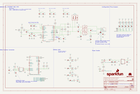

Contents
========

* [PRS19038 > SparkFun MicroMod Single Pair Ethernet Function Board ADIN1110](#prs19038--sparkfun-micromod-single-pair-ethernet-function-board-adin1110)
	* [Schematic](#schematic)
	* [PCB](#pcb)
	* [Interactive BOM](#interactive-bom)
	* [OOMP Parts](#oomp-parts)
	* [Images](#images)
	* [Tags](#tags)
  
![][im]
# PRS19038 > SparkFun MicroMod Single Pair Ethernet Function Board ADIN1110

- ID: PROJ-SPAR-19038-STAN-01
- Hex ID: PRS19038
- Name: Sparkfun
- Description: Sparkfun
- Long Link: [http://oom.lt/PROJ-SPAR-19038-STAN-01](http://oom.lt/PROJ-SPAR-19038-STAN-01)
- Short Link: [http://oom.lt/PRS19038](http://oom.lt/PRS19038)

## Schematic
  

## PCB
  

## Interactive BOM

- Interactive BOM page: [ibom.html](https://htmlpreview.github.io/?https://github.com/oomlout/oomlout_OOMP_projects/blob/main/PROJ-SPAR-19038-STAN-01/kicad/bom/ibom.html)

## OOMP Parts
  

|OOMP ID|Name|Identifier|
| :---: | :---: | :---: |
|[CAPC-0603-X-NF220-V25](https://github.com/oomlout/oomlout_OOMP_parts/tree/main/CAPC-0603-X-NF220-V25/)|[SMD (0603) 220 nF Capacitor (Ceramic) 25v](https://github.com/oomlout/oomlout_OOMP_parts/tree/main/CAPC-0603-X-NF220-V25/)|[C1, C2](https://github.com/oomlout/oomlout_OOMP_parts/tree/main/CAPC-0603-X-NF220-V25/)|
|[CAPC-0603-X-NF100-V50](https://github.com/oomlout/oomlout_OOMP_parts/tree/main/CAPC-0603-X-NF100-V50/)|[SMD (0603) 100 nF Capacitor (Ceramic) 50v](https://github.com/oomlout/oomlout_OOMP_parts/tree/main/CAPC-0603-X-NF100-V50/)|[C3, C4, C21](https://github.com/oomlout/oomlout_OOMP_parts/tree/main/CAPC-0603-X-NF100-V50/)|
|[CAPC-0603-X-PF10-V50](https://github.com/oomlout/oomlout_OOMP_parts/tree/main/CAPC-0603-X-PF10-V50/)|[SMD (0603) 10 pF Capacitor (Ceramic) 50v](https://github.com/oomlout/oomlout_OOMP_parts/tree/main/CAPC-0603-X-PF10-V50/)|[C5, C6](https://github.com/oomlout/oomlout_OOMP_parts/tree/main/CAPC-0603-X-PF10-V50/)|
|CAPC-0603-X-PF33D-01||C7|
|CAPC-0603-X-UNMATCHED-01||C8, C9|
|[CAPC-0402-X-NF100-V10](https://github.com/oomlout/oomlout_OOMP_parts/tree/main/CAPC-0402-X-NF100-V10/)|[SMD (0402) 100 nF Capacitor (Ceramic) 10v](https://github.com/oomlout/oomlout_OOMP_parts/tree/main/CAPC-0402-X-NF100-V10/)|[C10, C13, C15, C16, C18, C23](https://github.com/oomlout/oomlout_OOMP_parts/tree/main/CAPC-0402-X-NF100-V10/)|
|CAPC-0603-X-NF680-01||C11|
|[CAPC-0402-X-NF10-V50](https://github.com/oomlout/oomlout_OOMP_parts/tree/main/CAPC-0402-X-NF10-V50/)|[SMD (0402) 10 nF Capacitor (Ceramic) 50v](https://github.com/oomlout/oomlout_OOMP_parts/tree/main/CAPC-0402-X-NF10-V50/)|[C12, C14, C17](https://github.com/oomlout/oomlout_OOMP_parts/tree/main/CAPC-0402-X-NF10-V50/)|
|CAPC-0402-X-UNMATCHED-01||C19|
|CAPC-1206-X-UNMATCHED-01||C20|
|CAPC-0805-X-UNMATCHED-01||C22|
|UNMATCHED-UNMATCHED-X-UNMATCHED-01||CIPO, COPI, CS, INT, J1, J2, LOGO2, MEAS, MS_SEL, S1, SHLD, SPI, SPI_CFG0, SPI_CFG1, SWPD, T1, TX2P4, U1, U2, U4, Y1|
|[LEDS-0603-G-STAN-01](https://github.com/oomlout/oomlout_OOMP_parts/tree/main/LEDS-0603-G-STAN-01/)|[SMD (0603) Green LED](https://github.com/oomlout/oomlout_OOMP_parts/tree/main/LEDS-0603-G-STAN-01/)|[LED_0](https://github.com/oomlout/oomlout_OOMP_parts/tree/main/LEDS-0603-G-STAN-01/)|
|[LEDS-0603-Y-STAN-01](https://github.com/oomlout/oomlout_OOMP_parts/tree/main/LEDS-0603-Y-STAN-01/)|[SMD (0603) Yellow LED](https://github.com/oomlout/oomlout_OOMP_parts/tree/main/LEDS-0603-Y-STAN-01/)|[LED_1](https://github.com/oomlout/oomlout_OOMP_parts/tree/main/LEDS-0603-Y-STAN-01/)|
|[LEDS-0603-L-STAN-01](https://github.com/oomlout/oomlout_OOMP_parts/tree/main/LEDS-0603-L-STAN-01/)|[SMD (0603) Blue LED](https://github.com/oomlout/oomlout_OOMP_parts/tree/main/LEDS-0603-L-STAN-01/)|[LINK_ST](https://github.com/oomlout/oomlout_OOMP_parts/tree/main/LEDS-0603-L-STAN-01/)|
|[LEDS-0603-R-STAN-01](https://github.com/oomlout/oomlout_OOMP_parts/tree/main/LEDS-0603-R-STAN-01/)|[SMD (0603) Red LED](https://github.com/oomlout/oomlout_OOMP_parts/tree/main/LEDS-0603-R-STAN-01/)|[PWR](https://github.com/oomlout/oomlout_OOMP_parts/tree/main/LEDS-0603-R-STAN-01/)|
|MOSN-SO23-X-UNMATCHED-01||Q1|
|MOSP-SO23-X-UNMATCHED-01||Q2|
|RESE-0603-X-UNMATCHED-01||R1, R2, R10, R23, R24, R29|
|[RESE-0402-X-O472-01](https://github.com/oomlout/oomlout_OOMP_parts/tree/main/RESE-0402-X-O472-01/)|[SMD (0402) 4.7k Ohm Resistor](https://github.com/oomlout/oomlout_OOMP_parts/tree/main/RESE-0402-X-O472-01/)|[R3, R4, R12, R13, R14, R15, R16, R17, R18, R19, R25](https://github.com/oomlout/oomlout_OOMP_parts/tree/main/RESE-0402-X-O472-01/)|
|RESE-0402-X-UNMATCHED-01||R5, R6|
|[RESE-0603-X-O103-01](https://github.com/oomlout/oomlout_OOMP_parts/tree/main/RESE-0603-X-O103-01/)|[SMD (0603) 10k Ohm Resistor](https://github.com/oomlout/oomlout_OOMP_parts/tree/main/RESE-0603-X-O103-01/)|[R7, R8, R22](https://github.com/oomlout/oomlout_OOMP_parts/tree/main/RESE-0603-X-O103-01/)|
|[RESE-0402-X-O102-01](https://github.com/oomlout/oomlout_OOMP_parts/tree/main/RESE-0402-X-O102-01/)|[SMD (0402) 1k Ohm Resistor](https://github.com/oomlout/oomlout_OOMP_parts/tree/main/RESE-0402-X-O102-01/)|[R9, R11, R20, R21](https://github.com/oomlout/oomlout_OOMP_parts/tree/main/RESE-0402-X-O102-01/)|
|[RESE-0603-X-O101-01](https://github.com/oomlout/oomlout_OOMP_parts/tree/main/RESE-0603-X-O101-01/)|[SMD (0603) 100 Ohm Resistor](https://github.com/oomlout/oomlout_OOMP_parts/tree/main/RESE-0603-X-O101-01/)|[R26](https://github.com/oomlout/oomlout_OOMP_parts/tree/main/RESE-0603-X-O101-01/)|
|[RESE-0603-X-O472-01](https://github.com/oomlout/oomlout_OOMP_parts/tree/main/RESE-0603-X-O472-01/)|[SMD (0603) 4.7k Ohm Resistor](https://github.com/oomlout/oomlout_OOMP_parts/tree/main/RESE-0603-X-O472-01/)|[R27](https://github.com/oomlout/oomlout_OOMP_parts/tree/main/RESE-0603-X-O472-01/)|
|RESE-0402-X-O1003-01||R28|
|[VREG-SO235-X-KAP2112K-V33D](https://github.com/oomlout/oomlout_OOMP_parts/tree/main/VREG-SO235-X-KAP2112K-V33D/)|[SMD (SOT-23-5) AP2112K Voltage Regulator 3.3v](https://github.com/oomlout/oomlout_OOMP_parts/tree/main/VREG-SO235-X-KAP2112K-V33D/)|[U3](https://github.com/oomlout/oomlout_OOMP_parts/tree/main/VREG-SO235-X-KAP2112K-V33D/)|

## Images
  
  

|bominteractivefront|bominteractiveback|kicadPcb3d|kicadPcb3dFront|kicadPcb3dBack|kicadSchem|eagleImage|eagleSchemImage|pcbdraw|pcbdrawback|
| :---: | :---: | :---: | :---: | :---: | :---: | :---: | :---: | :---: | :---: |
|||||||||||

## Tags

- hexID: PRS19038
- oompType: PROJ
- oompSize: SPAR
- oompColor: 19038
- oompDesc: STAN
- oompIndex: 01
- oompName: SparkFun MicroMod Single Pair Ethernet Function Board ADIN1110
- sources: All source files from https://github.com/sparkfun/SparkFun_MicroMod_Single_Pair_Ethernet_Function_Board_ADIN1110 (source licence details in srcLicense.md)
- linkBuyPage: https://www.sparkfun.com/products/19038
- oompID: PROJ-SPAR-19038-STAN-01
- oompParts: C1,CAPC-0603-X-NF220-V25
- oompParts: C2,CAPC-0603-X-NF220-V25
- oompParts: C3,CAPC-0603-X-NF100-V50
- oompParts: C4,CAPC-0603-X-NF100-V50
- oompParts: C5,CAPC-0603-X-PF10-V50
- oompParts: C6,CAPC-0603-X-PF10-V50
- oompParts: C7,CAPC-0603-X-PF33D-01
- oompParts: C8,CAPC-0603-X-UNMATCHED-01
- oompParts: C9,CAPC-0603-X-UNMATCHED-01
- oompParts: C10,CAPC-0402-X-NF100-V10
- oompParts: C11,CAPC-0603-X-NF680-01
- oompParts: C12,CAPC-0402-X-NF10-V50
- oompParts: C13,CAPC-0402-X-NF100-V10
- oompParts: C14,CAPC-0402-X-NF10-V50
- oompParts: C15,CAPC-0402-X-NF100-V10
- oompParts: C16,CAPC-0402-X-NF100-V10
- oompParts: C17,CAPC-0402-X-NF10-V50
- oompParts: C18,CAPC-0402-X-NF100-V10
- oompParts: C19,CAPC-0402-X-UNMATCHED-01
- oompParts: C20,CAPC-1206-X-UNMATCHED-01
- oompParts: C21,CAPC-0603-X-NF100-V50
- oompParts: C22,CAPC-0805-X-UNMATCHED-01
- oompParts: C23,CAPC-0402-X-NF100-V10
- oompParts: CIPO,UNMATCHED-UNMATCHED-X-UNMATCHED-01
- oompParts: COPI,UNMATCHED-UNMATCHED-X-UNMATCHED-01
- oompParts: CS,UNMATCHED-UNMATCHED-X-UNMATCHED-01
- oompParts: INT,UNMATCHED-UNMATCHED-X-UNMATCHED-01
- oompParts: J1,UNMATCHED-UNMATCHED-X-UNMATCHED-01
- oompParts: J2,UNMATCHED-UNMATCHED-X-UNMATCHED-01
- oompParts: LED_0,LEDS-0603-G-STAN-01
- oompParts: LED_1,LEDS-0603-Y-STAN-01
- oompParts: LINK_ST,LEDS-0603-L-STAN-01
- oompParts: LOGO2,UNMATCHED-UNMATCHED-X-UNMATCHED-01
- oompParts: MEAS,UNMATCHED-UNMATCHED-X-UNMATCHED-01
- oompParts: MS_SEL,UNMATCHED-UNMATCHED-X-UNMATCHED-01
- oompParts: PWR,LEDS-0603-R-STAN-01
- oompParts: Q1,MOSN-SO23-X-UNMATCHED-01
- oompParts: Q2,MOSP-SO23-X-UNMATCHED-01
- oompParts: R1,RESE-0603-X-UNMATCHED-01
- oompParts: R2,RESE-0603-X-UNMATCHED-01
- oompParts: R3,RESE-0402-X-O472-01
- oompParts: R4,RESE-0402-X-O472-01
- oompParts: R5,RESE-0402-X-UNMATCHED-01
- oompParts: R6,RESE-0402-X-UNMATCHED-01
- oompParts: R7,RESE-0603-X-O103-01
- oompParts: R8,RESE-0603-X-O103-01
- oompParts: R9,RESE-0402-X-O102-01
- oompParts: R10,RESE-0603-X-UNMATCHED-01
- oompParts: R11,RESE-0402-X-O102-01
- oompParts: R12,RESE-0402-X-O472-01
- oompParts: R13,RESE-0402-X-O472-01
- oompParts: R14,RESE-0402-X-O472-01
- oompParts: R15,RESE-0402-X-O472-01
- oompParts: R16,RESE-0402-X-O472-01
- oompParts: R17,RESE-0402-X-O472-01
- oompParts: R18,RESE-0402-X-O472-01
- oompParts: R19,RESE-0402-X-O472-01
- oompParts: R20,RESE-0402-X-O102-01
- oompParts: R21,RESE-0402-X-O102-01
- oompParts: R22,RESE-0603-X-O103-01
- oompParts: R23,RESE-0603-X-UNMATCHED-01
- oompParts: R24,RESE-0603-X-UNMATCHED-01
- oompParts: R25,RESE-0402-X-O472-01
- oompParts: R26,RESE-0603-X-O101-01
- oompParts: R27,RESE-0603-X-O472-01
- oompParts: R28,RESE-0402-X-O1003-01
- oompParts: R29,RESE-0603-X-UNMATCHED-01
- oompParts: S1,UNMATCHED-UNMATCHED-X-UNMATCHED-01
- oompParts: SHLD,UNMATCHED-UNMATCHED-X-UNMATCHED-01
- oompParts: SPI,UNMATCHED-UNMATCHED-X-UNMATCHED-01
- oompParts: SPI_CFG0,UNMATCHED-UNMATCHED-X-UNMATCHED-01
- oompParts: SPI_CFG1,UNMATCHED-UNMATCHED-X-UNMATCHED-01
- oompParts: SWPD,UNMATCHED-UNMATCHED-X-UNMATCHED-01
- oompParts: T1,UNMATCHED-UNMATCHED-X-UNMATCHED-01
- oompParts: TX2P4,UNMATCHED-UNMATCHED-X-UNMATCHED-01
- oompParts: U1,UNMATCHED-UNMATCHED-X-UNMATCHED-01
- oompParts: U2,UNMATCHED-UNMATCHED-X-UNMATCHED-01
- oompParts: U3,VREG-SO235-X-KAP2112K-V33D
- oompParts: U4,UNMATCHED-UNMATCHED-X-UNMATCHED-01
- oompParts: Y1,UNMATCHED-UNMATCHED-X-UNMATCHED-01
- rawParts: C1,0.22uF,0.22UF-0603-50V-10%,0603,0.22µF ceramic capacitors,,CAP-15456,,0.22uF,
- rawParts: C2,0.22uF,0.22UF-0603-50V-10%,0603,0.22µF ceramic capacitors,,CAP-15456,,0.22uF,
- rawParts: C3,0.1uF,0.1UF-0603-25V-10%-X7R-WE,0603,0.1µF ceramic capacitors,,CAP-16503,,0.1uF,
- rawParts: C4,0.1uF,0.1UF-0603-25V-10%-X7R-WE,0603,0.1µF ceramic capacitors,,CAP-16503,,0.1uF,
- rawParts: C5,10pF,10PF-0603-50V-5%-C0G-WE,0603,10pF ceramic capacitors,,CAP-16506,,10pF,
- rawParts: C6,10pF,10PF-0603-50V-5%-C0G-WE,0603,10pF ceramic capacitors,,CAP-16506,,10pF,
- rawParts: C7,3.3nF,3.3NF-0603-100V-10%-WE,0603,3.3nF ceramic capacitors,,CAP-16505,,3.3nF,
- rawParts: C8,1.0uF,1.0UF-0603-16V-10%-X7R-WE,0603,1µF ceramic capacitors,,CAP-16504,,1.0uF,
- rawParts: C9,1.0uF,1.0UF-0603-16V-10%-X7R-WE,0603,1µF ceramic capacitors,,CAP-16504,,1.0uF,
- rawParts: C10,0.1uF,0.1UF-0402T-16V-10%-X7R-WE,0402-TIGHT,0.1µF ceramic capacitors,,CAP-16507,,0.1uF,
- rawParts: C11,0.68uF,0.68UF-0603-16V-10%-X7R-WE,0603,0.68µF ceramic capacitors,,CAP-16639,,0.68uF,
- rawParts: C12,10nF,10NF-0402T-25V-10%-X7R-WE,0402-TIGHT,0.01uF/10nF/10,000pF ceramic capacitors,,CAP-16508,,10nF,
- rawParts: C13,0.1uF,0.1UF-0402T-16V-10%-X7R-WE,0402-TIGHT,0.1µF ceramic capacitors,,CAP-16507,,0.1uF,
- rawParts: C14,10nF,10NF-0402T-25V-10%-X7R-WE,0402-TIGHT,0.01uF/10nF/10,000pF ceramic capacitors,,CAP-16508,,10nF,
- rawParts: C15,0.1uF,0.1UF-0402T-16V-10%-X7R-WE,0402-TIGHT,0.1µF ceramic capacitors,,CAP-16507,,0.1uF,
- rawParts: C16,0.1uF,0.1UF-0402T-16V-10%-X7R-WE,0402-TIGHT,0.1µF ceramic capacitors,,CAP-16507,,0.1uF,
- rawParts: C17,10nF,10NF-0402T-25V-10%-X7R-WE,0402-TIGHT,0.01uF/10nF/10,000pF ceramic capacitors,,CAP-16508,,10nF,
- rawParts: C18,0.1uF,0.1UF-0402T-16V-10%-X7R-WE,0402-TIGHT,0.1µF ceramic capacitors,,CAP-16507,,0.1uF,
- rawParts: C19,1.0uF,1.0UF-0402T-16V-10%,0402-TIGHT,1µF ceramic capacitors,,CAP-12417,,1.0uF,
- rawParts: C20,1.0nF/2kV,1.0NF/1000PF-1206-2KV-10%-X7R-WORTH-ELEKRONIK,1206,1nF/1,000pF ceramic capacitors,,CAP-16430,,1.0nF,
- rawParts: C21,0.1uF/50V,0.1UF-0603-50V-10%-X7R-WE,0603,0.1µF ceramic capacitors,,CAP-16523,,0.1uF,
- rawParts: C22,470nF/100V,470NF-0805-100V-10%-X7S,0805,0.47uF/470nF ceramic capacitors,,CAP-16570,,470nF,
- rawParts: C23,0.1uF,0.1UF-0402T-16V-10%-X7R-WE,0402-TIGHT,0.1µF ceramic capacitors,,CAP-16507,,0.1uF,
- rawParts: CIPO,,TEST-POINTTP_15TH_THRU,TP_15TH,SparkFun Test Points,,,,,
- rawParts: COPI,,TEST-POINTTP_15TH_THRU,TP_15TH,SparkFun Test Points,,,,,
- rawParts: CS,,TEST-POINTTP_15TH_THRU,TP_15TH,SparkFun Test Points,,,,,
- rawParts: EWP,JUMPER-SMT_2_NO_SILK,JUMPER-SMT_2_NO_SILK,SMT-JUMPER_2_NO_SILK,Normally open jumper,,,,,
- rawParts: FD1,FIDUCIALUFIDUCIAL,FIDUCIALUFIDUCIAL,FIDUCIAL-MICRO,Fiducial Alignment Points,,,,,
- rawParts: FD2,FIDUCIALUFIDUCIAL,FIDUCIALUFIDUCIAL,FIDUCIAL-MICRO,Fiducial Alignment Points,,,,,
- rawParts: FD3,FIDUCIALUFIDUCIAL,FIDUCIALUFIDUCIAL,FIDUCIAL-MICRO,Fiducial Alignment Points,,,,,
- rawParts: FD4,FIDUCIALUFIDUCIAL,FIDUCIALUFIDUCIAL,FIDUCIAL-MICRO,Fiducial Alignment Points,,,,,
- rawParts: FRAME1,FRAME-LEDGER,FRAME-LEDGER,CREATIVE_COMMONS,Schematic Frame - Ledger,,,,,
- rawParts: INT,,TEST-POINTTP_15TH_THRU,TP_15TH,SparkFun Test Points,,,,,
- rawParts: J1,IP20(RJ50),T1_INDUSTRIAL_JACK_AH_IP20,T1_INDUSTRIAL_JACK_AH_IP20,,,CONN-16501,,IP20(RJ50),
- rawParts: J2,MICROMOD_FUNCTION_STANDARD,MICROMOD_FUNCTION_STANDARD,M.2-CARD-E-22_FUNCTION_STANDARD,MicroMod Connector,,,,,
- rawParts: LED-0,JUMPER-SMT_2_NC_TRACE_SILK,JUMPER-SMT_2_NC_TRACE_SILK,SMT-JUMPER_2_NC_TRACE_SILK,Normally closed trace jumper,,,,,
- rawParts: LED-1,JUMPER-SMT_2_NC_TRACE_SILK,JUMPER-SMT_2_NC_TRACE_SILK,SMT-JUMPER_2_NC_TRACE_SILK,Normally closed trace jumper,,,,,
- rawParts: LED-LINK,JUMPER-SMT_2_NC_TRACE_SILK,JUMPER-SMT_2_NC_TRACE_SILK,SMT-JUMPER_2_NC_TRACE_SILK,Normally closed trace jumper,,,,,
- rawParts: LED-PWR,JUMPER-SMT_2_NC_TRACE_SILK,JUMPER-SMT_2_NC_TRACE_SILK,SMT-JUMPER_2_NC_TRACE_SILK,Normally closed trace jumper,,,,,
- rawParts: LED_0,Green,LED-GREEN-0603-WE,LED-0603,Green SMD LED,,DIO-16512,,Green,
- rawParts: LED_1,Yellow,LED-YELLOW-0603-WE,LED-0603,Yellow SMD LED,,DIO-16514,,Yellow,
- rawParts: LINK_ST,Blue,LED-BLUE-0603-WE,LED-0603,Blue SMD LED,,DIO-16513,,Blue,
- rawParts: LOGO1,SFE_LOGO_NAME_FLAME.2_INCH,SFE_LOGO_NAME_FLAME.2_INCH,SFE_LOGO_NAME_FLAME_.2,SparkFun Font Logo w/ Flame,,,,,
- rawParts: LOGO2,SPECIAL_INSTRUCTIONS-ORDERING,SPECIAL_INSTRUCTIONS-ORDERING,ORDERING_INSTRUCTIONS,Special Ordering/Production Instructions Alert,,,,,
- rawParts: LOGO3,OSHW-LOGOMINI,OSHW-LOGOMINI,OSHW-LOGO-MINI,Open-Source Hardware (OSHW) Logo,,,,,
- rawParts: MEAS,JUMPER-COMBO_2_NC_TRACE,JUMPER-COMBO_2_NC_TRACE,COMBO-JUMPER_2_NC_TRACE,,,,,,
- rawParts: MS_SEL,,JUMPER-SMT_2_NO_SILK,SMT-JUMPER_2_NO_SILK,Normally open jumper,,,,,
- rawParts: PWR,Red,LED-RED-0603-WE,LED-0603,Red SMD LED,,DIO-16511,,Red,
- rawParts: Q1,220mA/50V/3.5Ω,MOSFET-NCH-BSS138,SOT23-3,N-channel MOSFETs,,TRANS-00830,,220mA/50V/3.5Ω,
- rawParts: Q2,20V/4.2A/52mΩ/1.4W,MOSFET_PCH-DMG2305UX-7,SOT23-3,P-channel MOSFETs,,TRANS-14388,,20V/4.2A/52mΩ/1.4W,
- rawParts: R1,49.9,49.9OHM-0603-1/10W-1%,0603,49.9Ω resistor,,RES-16237,,49.9,
- rawParts: R2,49.9,49.9OHM-0603-1/10W-1%,0603,49.9Ω resistor,,RES-16237,,49.9,
- rawParts: R3,5.1k,5.1KOHM-0402T-1/16W-1%,0402-TIGHT,,,RES-14340,,5.1k,
- rawParts: R4,5.1k,5.1KOHM-0402T-1/16W-1%,0402-TIGHT,,,RES-14340,,5.1k,
- rawParts: R5,10.2k,10.2KOHM-0402-1/16W-1%,0402-TIGHT,10.2kΩ resistor,,RES-16559,,10.2k,
- rawParts: R6,10.2k,10.2KOHM-0402-1/16W-1%,0402-TIGHT,10.2kΩ resistor,,RES-16559,,10.2k,
- rawParts: R7,10k,10KOHM-0603-1/10W-1%,0603,10kΩ resistor,,RES-00824,,10k,
- rawParts: R8,10k,10KOHM-0603-1/10W-1%,0603,10kΩ resistor,,RES-00824,,10k,
- rawParts: R9,1k,1KOHM-0402T-1/16W-1%,0402-TIGHT,1kΩ resistor,,RES-14342,,1k,
- rawParts: R10,1.5k,1.5KOHM-0603-1/10W-1%,0603,1.5kΩ resistor,,RES-08306,,1.5k,
- rawParts: R11,1k,1KOHM-0402T-1/16W-1%,0402-TIGHT,1kΩ resistor,,RES-14342,,1k,
- rawParts: R12,4.7k,4.7KOHM-0402T-1/16W-1%,0402-TIGHT,4.7kΩ resistor,,RES-15343,,4.7k,
- rawParts: R13,4.7k,4.7KOHM-0402T-1/16W-1%,0402-TIGHT,4.7kΩ resistor,,RES-15343,,4.7k,
- rawParts: R14,4.7k,4.7KOHM-0402T-1/16W-1%,0402-TIGHT,4.7kΩ resistor,,RES-15343,,4.7k,
- rawParts: R15,4.7k,4.7KOHM-0402T-1/16W-1%,0402-TIGHT,4.7kΩ resistor,,RES-15343,,4.7k,
- rawParts: R16,4.7k,4.7KOHM-0402T-1/16W-1%,0402-TIGHT,4.7kΩ resistor,,RES-15343,,4.7k,
- rawParts: R17,4.7k,4.7KOHM-0402T-1/16W-1%,0402-TIGHT,4.7kΩ resistor,,RES-15343,,4.7k,
- rawParts: R18,4.7k,4.7KOHM-0402T-1/16W-1%,0402-TIGHT,4.7kΩ resistor,,RES-15343,,4.7k,
- rawParts: R19,4.7k,4.7KOHM-0402T-1/16W-1%,0402-TIGHT,4.7kΩ resistor,,RES-15343,,4.7k,
- rawParts: R20,1k,1KOHM-0402T-1/16W-1%,0402-TIGHT,1kΩ resistor,,RES-14342,,1k,
- rawParts: R21,1k,1KOHM-0402T-1/16W-1%,0402-TIGHT,1kΩ resistor,,RES-14342,,1k,
- rawParts: R22,10k,10KOHM-0603-1/10W-1%,0603,10kΩ resistor,,RES-00824,,10k,
- rawParts: R23,100Ω,100OHM-0603-1/10W-1%,0603,100Ω resistor,,RES-07863,,100,
- rawParts: R24,1.5k,1.5KOHM-0603-1/10W-1%,0603,1.5kΩ resistor,,RES-08306,,1.5k,
- rawParts: R25,4.7k,4.7KOHM-0402T-1/16W-1%,0402-TIGHT,4.7kΩ resistor,,RES-15343,,4.7k,
- rawParts: R26,100,100OHM-0603-1/10W-1%,0603,100Ω resistor,,RES-07863,,100,
- rawParts: R27,4.7k,4.7KOHM-0603-1/10W-1%,0603,4.7kΩ resistor,,RES-07857,,4.7k,
- rawParts: R28,100k,100KOHM-0402T-1/16W-1%,0402-TIGHT,100kΩ resistor,,RES-13495,,100k,
- rawParts: R29,100Ω,100OHM-0603-1/10W-1%,0603,100Ω resistor,,RES-07863,,100,
- rawParts: S1,RESET,MOMENTARY-SWITCH-SPST-SMD-5.2MM-TALL,TACTILE_SWITCH_SMD_5.2MM,Momentary Switch (Pushbutton) - SPST,,SWCH-14139,,,
- rawParts: SHLD,,JUMPER-SMT_3_1-NC_TRACE_SILK,SMT-JUMPER_3_1-NC_TRACE_SILK,Normally closed trace jumper (1 of 2 connections),,,,,
- rawParts: SPI,,TEST-POINTTP_15TH_THRU,TP_15TH,SparkFun Test Points,,,,,
- rawParts: SPI_CFG0,,JUMPER-SMT_2_NO_SILK,SMT-JUMPER_2_NO_SILK,Normally open jumper,,,,,
- rawParts: SPI_CFG1,,JUMPER-SMT_2_NO_SILK,SMT-JUMPER_2_NO_SILK,Normally open jumper,,,,,
- rawParts: SWPD,,JUMPER-SMT_2_NO_SILK,SMT-JUMPER_2_NO_SILK,Normally open jumper,,,,,
- rawParts: T1,WE-STST,WE_STST_TRANSFORMER_1:1_SMD_74930030_3.2X4.7MM,WE_STST_TRANSFORMER_1:1_SMD_3.2X4.7MM_74930030,WE-STST Super Tiny Signal,,COMP-16426,,WE-STST,
- rawParts: TP1,TEST-POINT3X4,TEST-POINT3X4,PAD.03X.04,SparkFun Test Points,,,,,
- rawParts: TX2P4,,JUMPER-SMT_2_NO_SILK,SMT-JUMPER_2_NO_SILK,Normally open jumper,,,,,
- rawParts: U1,ADIN1110,ADIN1110,LFCSP-40,The ADIN1110 is an ultra low power, single port, 10BASE-T1L,,IC-16335,,,
- rawParts: U2,EEPROM,EEPROM-I2C512K,SO08,I2C EEPROMs, 24LC256 and others,,IC-14645,,,
- rawParts: U3,3.3V,V_REG_AP2112K-3.3V,SOT23-5,AP2112 - 600mA CMOS LDO Regulator w/ Enable,,VREG-12457,,3.3V,
- rawParts: U4,WE-TVS,WE-TVS_DIODE_ARRAY_824012823_1.0X1.2MM,WE_TVS_1.0X1.2MM,WE-TVS TVS Diode – Super Speed,,DIO-16429,,WE-TVS,
- rawParts: Y1,25MHz,CRYSTAL-25MHZ-WE-SMD-2.0X1.6MM-WE,CRYSTAL-SMD-2.0X1.6MM-WE,25MHz Crystal,,XTAL-16515,,25MHz,

[im]: kicadPcb3d_450.png
