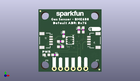
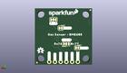
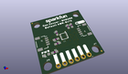

Contents
========

* [PROJ-SPAR-19096-STAN-01>Qwiic Environmental Sensor BME688](#proj-spar-19096-stan-01qwiic-environmental-sensor-bme688)
	* [Images](#images)
	* [Interactive BOM](#interactive-bom)
	* [OOMP Parts](#oomp-parts)
	* [Tags](#tags)
  
![][im]
# PROJ-SPAR-19096-STAN-01>Qwiic Environmental Sensor BME688

- ID: PROJ-SPAR-19096-STAN-01
- Hex ID: PRS19096
- Name: Qwiic Environmental Sensor BME688
- Description: 

## Images
  
  

|eagleImage|kicadPcb3dFront|kicadPcb3dBack|kicadPcb3d|
| :---: | :---: | :---: | :---: |
|||||

## Interactive BOM

- Interactive BOM page: [ibom.html](kicad/bom/ibom.html)

## OOMP Parts
  

|OOMP Parts|
| :---: |
|UNMATCHED-UNMATCHED-X-UNMATCHED-01, ADR, 11.43, 9.398, M180,ADR, JUMPER-SMT_3_1-NC_TRACE_SILK, SMT-JUMPER_3_1-NC_TRACE_SILK, SparkFun-Jumpers, (0.45, 0.37), MR180|
|<table><tr><td></td><td> C1</td><td>[CAPC-0603-X-NF100-V50 SMD (0603) 100 nF Capacitor (Ceramic) 50v](https://github.com/oomlout/oomlout_OOMP_parts/tree/main/CAPC-0603-X-NF100-V50/)</td><td>[C6N100](https://github.com/oomlout/oomlout_OOMP_parts/tree/main/CAPC-0603-X-NF100-V50/)</td></tr></table>|
|<table><tr><td></td><td> C2</td><td>[CAPC-0603-X-NF100-V50 SMD (0603) 100 nF Capacitor (Ceramic) 50v](https://github.com/oomlout/oomlout_OOMP_parts/tree/main/CAPC-0603-X-NF100-V50/)</td><td>[C6N100](https://github.com/oomlout/oomlout_OOMP_parts/tree/main/CAPC-0603-X-NF100-V50/)</td></tr></table>|
|UNMATCHED-UNMATCHED-X-UNMATCHED-01, CSB, 13.97, 16.509999999999998, M0,CSB, JUMPER-SMT_2_NC_TRACE_SILK, SMT-JUMPER_2_NC_TRACE_SILK, SparkFun-Jumpers, (0.55, 0.65), MR0|
|UNMATCHED-0603-X-UNMATCHED-01, D1, 3.302, 6.858, 180,D1, RED, LED-0603, SparkFun-LED, (0.13, 0.27), R180|
|UNMATCHED-UNMATCHED-X-UNMATCHED-01, I2C, 17.145, 20.32, M180,I2C, JUMPER-SMT_3_2-NC_TRACE_SILK, SMT-JUMPER_3_2-NC_TRACE_SILK, SparkFun-Jumpers, (0.675, 0.8), MR180|
|UNMATCHED-UNMATCHED-X-UNMATCHED-01, J2, 5.08, 12.7, 270,J2, QWIIC_RA, JST04_1MM_RA, SparkFun-Connectors, (0.2, 0.5), R270|
|UNMATCHED-UNMATCHED-X-UNMATCHED-01, J3, 19.049999999999997, 1.27, 180,J3, 1X06_NO_SILK, SparkFun-Connectors, (0.75, 0.05), R180|
|UNMATCHED-UNMATCHED-X-UNMATCHED-01, J4, 20.32, 12.7, 90,J4, QWIIC_RA, JST04_1MM_RA, SparkFun-Connectors, (0.8, 0.5), R90|
|LEDS-UNMATCHED-G-UNMATCHED-01, LED, 6.604, 7.619999999999999, M0,LED, JUMPER-SMT_2_NC_TRACE_SILK, SMT-JUMPER_2_NC_TRACE_SILK, SparkFun-Jumpers, (0.26, 0.3), MR0|
|RESE-0603-X-UNMATCHED-01, R1, 18.034, 17.018, 90,R1, 2.2k, 0603, SparkFun-Resistors, (0.71, 0.67), R90|
|RESE-0603-X-UNMATCHED-01, R2, 16.256, 17.018, 90,R2, 2.2k, 0603, SparkFun-Resistors, (0.64, 0.67), R90|
|RESE-0603-X-UNMATCHED-01, R3, 6.604, 6.858, 0,R3, 1k, 0603, SparkFun-Resistors, (0.26, 0.27), R0|
|<table><tr><td></td><td> R4</td><td>[RESE-0603-X-O103-01 SMD (0603) 10k Ohm Resistor](https://github.com/oomlout/oomlout_OOMP_parts/tree/main/RESE-0603-X-O103-01/)</td><td>[R6103](https://github.com/oomlout/oomlout_OOMP_parts/tree/main/RESE-0603-X-O103-01/)</td></tr></table>|
|UNMATCHED-UNMATCHED-X-UNMATCHED-01, U1, 12.7, 12.7, 0,U1, BME688LGA, LGA_8PIN, BME688, (0.5, 0.5), R0|

## Tags

- hexID: PRS19096
- oompType: PROJ
- oompSize: SPAR
- oompColor: 19096
- oompDesc: STAN
- oompIndex: 01
- oompName: Qwiic Environmental Sensor BME688
- sources: All source files from https://github.com/sparkfun/Qwiic_Environmental_Sensor_BME688 (source licence details in srcLicense.md)
- linkBuyPage: https://www.sparkfun.com/products/19096
- oompPart: UNMATCHED-UNMATCHED-X-UNMATCHED-01, ADR, 11.43, 9.398, M180
- oompPart: CAPC-0603-X-NF100-V50, C1, 8.889999999999999, 12.318999999999999, 180
- oompPart: CAPC-0603-X-NF100-V50, C2, 10.16, 15.278999921999999, 90
- oompPart: UNMATCHED-UNMATCHED-X-UNMATCHED-01, CSB, 13.97, 16.509999999999998, M0
- oompPart: UNMATCHED-0603-X-UNMATCHED-01, D1, 3.302, 6.858, 180
- oompPart: UNMATCHED-UNMATCHED-X-UNMATCHED-01, I2C, 17.145, 20.32, M180
- oompPart: UNMATCHED-UNMATCHED-X-UNMATCHED-01, J2, 5.08, 12.7, 270
- oompPart: UNMATCHED-UNMATCHED-X-UNMATCHED-01, J3, 19.049999999999997, 1.27, 180
- oompPart: UNMATCHED-UNMATCHED-X-UNMATCHED-01, J4, 20.32, 12.7, 90
- oompPart: SKIP-UNMATCHED-X-UNMATCHED-01, JP1, 0.7619999999999999, 24.637999999999998, M0
- oompPart: SKIP-UNMATCHED-X-UNMATCHED-01, JP2, 24.511, 0.889, 0
- oompPart: SKIP-UNMATCHED-X-UNMATCHED-01, JP5, 24.511, 0.889, M0
- oompPart: SKIP-UNMATCHED-X-UNMATCHED-01, JP6, 0.7619999999999999, 24.637999999999998, 0
- oompPart: LEDS-UNMATCHED-G-UNMATCHED-01, LED, 6.604, 7.619999999999999, M0
- oompPart: RESE-0603-X-UNMATCHED-01, R1, 18.034, 17.018, 90
- oompPart: RESE-0603-X-UNMATCHED-01, R2, 16.256, 17.018, 90
- oompPart: RESE-0603-X-UNMATCHED-01, R3, 6.604, 6.858, 0
- oompPart: RESE-0603-X-O103-01, R4, 8.889999999999999, 10.16, 0
- oompPart: UNMATCHED-UNMATCHED-X-UNMATCHED-01, U1, 12.7, 12.7, 0
- rawPart: ADR, JUMPER-SMT_3_1-NC_TRACE_SILK, SMT-JUMPER_3_1-NC_TRACE_SILK, SparkFun-Jumpers, (0.45, 0.37), MR180
- rawPart: C1, 0.1uF, 0603, SparkFun-Capacitors, (0.35, 0.485), R180
- rawPart: C2, 0.1uF, 0603, SparkFun-Capacitors, (0.4, 0.60153543), R90
- rawPart: CSB, JUMPER-SMT_2_NC_TRACE_SILK, SMT-JUMPER_2_NC_TRACE_SILK, SparkFun-Jumpers, (0.55, 0.65), MR0
- rawPart: D1, RED, LED-0603, SparkFun-LED, (0.13, 0.27), R180
- rawPart: I2C, JUMPER-SMT_3_2-NC_TRACE_SILK, SMT-JUMPER_3_2-NC_TRACE_SILK, SparkFun-Jumpers, (0.675, 0.8), MR180
- rawPart: J2, QWIIC_RA, JST04_1MM_RA, SparkFun-Connectors, (0.2, 0.5), R270
- rawPart: J3, 1X06_NO_SILK, SparkFun-Connectors, (0.75, 0.05), R180
- rawPart: J4, QWIIC_RA, JST04_1MM_RA, SparkFun-Connectors, (0.8, 0.5), R90
- rawPart: JP1, FIDUCIALUFIDUCIAL, FIDUCIAL-MICRO, SparkFun-Aesthetics, (0.03, 0.97), MR0
- rawPart: JP2, FIDUCIALUFIDUCIAL, FIDUCIAL-MICRO, SparkFun-Aesthetics, (0.965, 0.035), R0
- rawPart: JP5, FIDUCIALUFIDUCIAL, FIDUCIAL-MICRO, SparkFun-Aesthetics, (0.965, 0.035), MR0
- rawPart: JP6, FIDUCIALUFIDUCIAL, FIDUCIAL-MICRO, SparkFun-Aesthetics, (0.03, 0.97), R0
- rawPart: LED, JUMPER-SMT_2_NC_TRACE_SILK, SMT-JUMPER_2_NC_TRACE_SILK, SparkFun-Jumpers, (0.26, 0.3), MR0
- rawPart: R1, 2.2k, 0603, SparkFun-Resistors, (0.71, 0.67), R90
- rawPart: R2, 2.2k, 0603, SparkFun-Resistors, (0.64, 0.67), R90
- rawPart: R3, 1k, 0603, SparkFun-Resistors, (0.26, 0.27), R0
- rawPart: R4, 10k, 0603, SparkFun-Resistors, (0.35, 0.4), R0
- rawPart: U1, BME688LGA, LGA_8PIN, BME688, (0.5, 0.5), R0
- oompID: PROJ-SPAR-19096-STAN-01

[im]: kicadPcb3d_450.png
