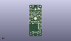
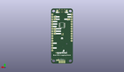
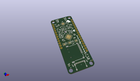

Contents
========

* [PROJ-SPAR-19217-STAN-01>Thing Plus Dual-Port Logging Shield](#proj-spar-19217-stan-01thing-plus-dual-port-logging-shield)
	* [Images](#images)
	* [Interactive BOM](#interactive-bom)
	* [OOMP Parts](#oomp-parts)
	* [Tags](#tags)
  
![][im]
# PROJ-SPAR-19217-STAN-01>Thing Plus Dual-Port Logging Shield

- ID: PROJ-SPAR-19217-STAN-01
- Hex ID: PRS19217
- Name: Thing Plus Dual-Port Logging Shield
- Description: 

## Images
  
  

|eagleImage|kicadPcb3dFront|kicadPcb3dBack|kicadPcb3d|
| :---: | :---: | :---: | :---: |
|||||

## Interactive BOM

- Interactive BOM page: [ibom.html](kicad/bom/ibom.html)

## OOMP Parts
  

|OOMP Parts|
| :---: |
|CAPC-0402-X-NF100-V50, C1, 11.43, 45.72, 270,C1, 0.1uF, 0402-TIGHT, SparkFun-Capacitors, (0.45, 1.8), R270|
|CAPC-0402-X-NF100-V50, C2, 13.334999999999999, 45.72, 270,C2, 0.1uF, 0402-TIGHT, SparkFun-Capacitors, (0.525, 1.8), R270|
|CAPC-0402-X-UF22D-01, C3, 5.715, 32.257999999999996, 180,C3, 2.2uF, 0402-TIGHT, SparkFun-Capacitors, (0.225, 1.27), R180|
|CAPC-0402-X-UF22D-01, C4, 11.43, 39.242999999999995, 90,C4, 2.2uF, 0402-TIGHT, SparkFun-Capacitors, (0.45, 1.545), R90|
|CAPC-0402-X-NF100-V50, C5, 19.177, 12.890499999999998, 0,C5, 0.1uF, 0402-TIGHT, SparkFun-Capacitors, (0.755, 0.5075), R0|
|CAPC-0402-X-UF22D-01, C6, 4.444999999999999, 40.259, 0,C6, 2.2uF, 0402-TIGHT, SparkFun-Capacitors, (0.175, 1.585), R0|
|CAPC-0402-X-UF22D-01, C7, 4.444999999999999, 45.974, 0,C7, 2.2uF, 0402-TIGHT, SparkFun-Capacitors, (0.175, 1.81), R0|
|CAPC-0402-X-NF100-V50, C8, 18.415, 23.495, 270,C8, 0.1uF, 0402-TIGHT, SparkFun-Capacitors, (0.725, 0.925), R270|
|CAPC-0402-X-NF100-V50, C9, 12.7, 26.669999999999998, 90,C9, 0.1uF, 0402-TIGHT, SparkFun-Capacitors, (0.5, 1.05), R90|
|CAPC-0402-X-UF22D-01, C10, 18.668999999999997, 41.275, 180,C10, 2.2uF, 0402-TIGHT, SparkFun-Capacitors, (0.735, 1.625), R180|
|CAPC-0402-X-NF100-V50, C11, 7.619999999999999, 26.669999999999998, 90,C11, 0.1uF, 0402-TIGHT, SparkFun-Capacitors, (0.3, 1.05), R90|
|CAPC-0402-X-UNMATCHED-01, C12, 13.97, 38.099999999999994, S45,C12, 12pF, 0402-TIGHT, SparkFun-Capacitors, (0.55, 1.5), SR45|
|CAPC-0402-X-NF100-V50, C13, 6.223, 49.529999999999994, 90,C13, 0.1uF, 0402-TIGHT, SparkFun-Capacitors, (0.245, 1.95), R90|
|CAPC-0402-X-NF100-V50, C14, 15.875, 30.479999999999997, 0,C14, 0.1uF, 0402-TIGHT, SparkFun-Capacitors, (0.625, 1.2), R0|
|CAPC-0402-X-UF22D-01, C15, 5.968999999999999, 34.036, 180,C15, 2.2uF, 0402-TIGHT, SparkFun-Capacitors, (0.235, 1.34), R180|
|CAPC-0402-X-NF100-V50, C16, 5.206999999999999, 30.733999999999998, 90,C16, 0.1uF, 0402-TIGHT, SparkFun-Capacitors, (0.205, 1.21), R90|
|CAPC-0402-X-UNMATCHED-01, C17, 16.128999999999998, 35.940999999999995, S45,C17, 12pF, 0402-TIGHT, SparkFun-Capacitors, (0.635, 1.415), SR45|
|CAPC-0402-X-UF22D-01, C18, 18.415, 45.72, 90,C18, 2.2uF, 0402-TIGHT, SparkFun-Capacitors, (0.725, 1.8), R90|
|CAPC-0402-X-NF100-V50, C19, 13.589, 39.624, 0,C19, 0.1uF, 0402-TIGHT, SparkFun-Capacitors, (0.535, 1.56), R0|
|CAPC-0402-X-UNMATCHED-01, C20, 12.572999999999999, 24.3205, 0,C20, 10uF, 0402-TIGHT, SparkFun-Capacitors, (0.495, 0.9575), R0|
|CAPC-0402-X-UNMATCHED-01, C21, 15.875, 29.463999999999995, 0,C21, 10uF, 0402-TIGHT, SparkFun-Capacitors, (0.625, 1.16), R0|
|CAPC-0402-X-UNMATCHED-01, C22, 7.492999999999999, 49.529999999999994, 90,C22, 10uF, 0402-TIGHT, SparkFun-Capacitors, (0.295, 1.95), R90|
|CAPC-0402-X-UNMATCHED-01, C23, 19.177, 11.8745, 0,C23, 10uF, 0402-TIGHT, SparkFun-Capacitors, (0.755, 0.4675), R0|
|CAPC-0402-X-UNMATCHED-01, C24, 7.619999999999999, 41.275, 0,C24, 10uF, 0402-TIGHT, SparkFun-Capacitors, (0.3, 1.625), R0|
|UNMATCHED-0603-X-UNMATCHED-01, D1, 6.35, 55.88, 90,D1, RED, LED-0603, SparkFun-LED, (0.25, 2.2), R90|
|UNMATCHED-0603-X-UNMATCHED-01, D2, 16.509999999999998, 55.88, 90,D2, Yellow, LED-0603, SparkFun-LED, (0.65, 2.2), R90|
|UNMATCHED-UNMATCHED-X-UNMATCHED-01, D3, 2.54, 6.985, 0,D3, PRTR5V0U2F, SOT886, SparkFun-IC-Power, (0.1, 0.275), R0|
|UNMATCHED-UNMATCHED-X-UNMATCHED-01, GPIO10, 11.43, 30.479999999999997, M0,GPIO10, TEST-POINT3, PAD.03X.03, SparkFun-Connectors, (0.45, 1.2), MR0|
|UNMATCHED-UNMATCHED-X-UNMATCHED-01, I2C, 4.444999999999999, 46.99, M180,I2C, JUMPER-SMT_3_2-NC_TRACE_SILK, SMT-JUMPER_3_2-NC_TRACE_SILK, SparkFun-Jumpers, (0.175, 1.85), MR180|
|UNMATCHED-UNMATCHED-X-UNMATCHED-01, IC1, 11.43, 33.019999999999996, S315,IC1, USB224X_2241_V04, 36-QFN, SparkFun-IC-Special-Function, (0.45, 1.3), SR315|
|UNMATCHED-UNMATCHED-X-UNMATCHED-01, J1, 11.43, 6.6674999999999995, 0,J1, USB-C-16P_4LAYER-PADS, SparkFun-Connectors, (0.45, 0.2625), R0|
|UNMATCHED-UNMATCHED-X-UNMATCHED-01, J2, 6.35, 15.938499999999998, 270,J2, MICRO-SD-PUSH-PUSH-EXT-PIN, MICROSD-EXTERNALPIN, SparkFun-Connectors, (0.25, 0.6275), R270|
|UNMATCHED-UNMATCHED-X-UNMATCHED-01, J4, 0.0, 0.0, 0,J4, THING_PLUS, THING_PLUS, SparkFun-Boards, (0, 0), R0|
|UNMATCHED-UNMATCHED-X-UNMATCHED-01, JP1, 19.049999999999997, 36.83, M0,JP1, JUMPER-SMT_2_NC_TRACE_SILK, SMT-JUMPER_2_NC_TRACE_SILK, SparkFun-Jumpers, (0.75, 1.45), MR0|
|UNMATCHED-UNMATCHED-X-UNMATCHED-01, JP2, 19.049999999999997, 34.29, M0,JP2, JUMPER-SMT_2_NO_SILK, SMT-JUMPER_2_NO_SILK, SparkFun-Jumpers, (0.75, 1.35), MR0|
|UNMATCHED-UNMATCHED-X-UNMATCHED-01, JP3, 19.049999999999997, 31.75, M0,JP3, JUMPER-SMT_2_NO_SILK, SMT-JUMPER_2_NO_SILK, SparkFun-Jumpers, (0.75, 1.25), MR0|
|UNMATCHED-UNMATCHED-X-UNMATCHED-01, LED1, 6.476999999999999, 55.88, M90,LED1, JUMPER-SMT_2_NC_TRACE_SILK, SMT-JUMPER_2_NC_TRACE_SILK, SparkFun-Jumpers, (0.255, 2.2), MR90|
|UNMATCHED-UNMATCHED-X-UNMATCHED-01, LED2, 16.383, 55.88, M90,LED2, JUMPER-SMT_2_NC_TRACE_SILK, SMT-JUMPER_2_NC_TRACE_SILK, SparkFun-Jumpers, (0.645, 2.2), MR90|
|UNMATCHED-UNMATCHED-X-UNMATCHED-01, MICROSD_VCC, 17.779999999999998, 11.43, M0,MICROSD_VCC, TEST-POINT3, PAD.03X.03, SparkFun-Connectors, (0.7, 0.45), MR0|
|UNMATCHED-UNMATCHED-X-UNMATCHED-01, Q1, 7.619999999999999, 38.099999999999994, 180,Q1, 20V/4.2A/52m?/1.4W, SOT23-3, SparkFun-DiscreteSemi, (0.3, 1.5), R180|
|UNMATCHED-UNMATCHED-X-UNMATCHED-01, Q2, 6.095999999999999, 36.57599999999999, 270,Q2, 20V/0.2A/8MHz/1.2?/1Vth, SOT-416FL, SparkFun-DiscreteSemi, (0.24, 1.44), R270|
|UNMATCHED-UNMATCHED-X-UNMATCHED-01, Q3, 19.685, 9.524999999999999, 90,Q3, 20V/4.2A/52m?/1.4W, SOT23-3, SparkFun-DiscreteSemi, (0.775, 0.375), R90|
|UNMATCHED-UNMATCHED-X-UNMATCHED-01, Q4, 8.889999999999999, 46.228, 0,Q4, 20V/4.2A/52m?/1.4W, SOT23-3, SparkFun-DiscreteSemi, (0.35, 1.82), R0|
|UNMATCHED-UNMATCHED-X-UNMATCHED-01, Q5, 8.889999999999999, 43.18, 180,Q5, SOT363_PHILIPS, SparkFun-DiscreteSemi, (0.35, 1.7), R180|
|UNMATCHED-UNMATCHED-X-UNMATCHED-01, Q6, 15.875, 46.228, 0,Q6, 20V/4.2A/52m?/1.4W, SOT23-3, SparkFun-DiscreteSemi, (0.625, 1.82), R0|
|UNMATCHED-UNMATCHED-X-UNMATCHED-01, Q7, 15.875, 43.18, 180,Q7, SOT363_PHILIPS, SparkFun-DiscreteSemi, (0.625, 1.7), R180|
|<table><tr><td></td><td> R1</td><td>[RESE-0402-X-O104-01 SMD (0402) 100k Ohm Resistor](https://github.com/oomlout/oomlout_OOMP_parts/tree/main/RESE-0402-X-O104-01/)</td><td>[R42104](https://github.com/oomlout/oomlout_OOMP_parts/tree/main/RESE-0402-X-O104-01/)</td></tr></table>|
|<table><tr><td></td><td> R2</td><td>[RESE-0402-X-O103-01 SMD (0402) 10k Ohm Resistor](https://github.com/oomlout/oomlout_OOMP_parts/tree/main/RESE-0402-X-O103-01/)</td><td>[R42103](https://github.com/oomlout/oomlout_OOMP_parts/tree/main/RESE-0402-X-O103-01/)</td></tr></table>|
|<table><tr><td></td><td> R3</td><td>[RESE-0402-X-O103-01 SMD (0402) 10k Ohm Resistor](https://github.com/oomlout/oomlout_OOMP_parts/tree/main/RESE-0402-X-O103-01/)</td><td>[R42103](https://github.com/oomlout/oomlout_OOMP_parts/tree/main/RESE-0402-X-O103-01/)</td></tr></table>|
|<table><tr><td></td><td> R4</td><td>[RESE-0402-X-O103-01 SMD (0402) 10k Ohm Resistor](https://github.com/oomlout/oomlout_OOMP_parts/tree/main/RESE-0402-X-O103-01/)</td><td>[R42103](https://github.com/oomlout/oomlout_OOMP_parts/tree/main/RESE-0402-X-O103-01/)</td></tr></table>|
|<table><tr><td></td><td> R5</td><td>[RESE-0402-X-O104-01 SMD (0402) 100k Ohm Resistor](https://github.com/oomlout/oomlout_OOMP_parts/tree/main/RESE-0402-X-O104-01/)</td><td>[R42104](https://github.com/oomlout/oomlout_OOMP_parts/tree/main/RESE-0402-X-O104-01/)</td></tr></table>|
|<table><tr><td></td><td> R6</td><td>[RESE-0402-X-O104-01 SMD (0402) 100k Ohm Resistor](https://github.com/oomlout/oomlout_OOMP_parts/tree/main/RESE-0402-X-O104-01/)</td><td>[R42104](https://github.com/oomlout/oomlout_OOMP_parts/tree/main/RESE-0402-X-O104-01/)</td></tr></table>|
|<table><tr><td></td><td> R7</td><td>[RESE-0402-X-O104-01 SMD (0402) 100k Ohm Resistor](https://github.com/oomlout/oomlout_OOMP_parts/tree/main/RESE-0402-X-O104-01/)</td><td>[R42104](https://github.com/oomlout/oomlout_OOMP_parts/tree/main/RESE-0402-X-O104-01/)</td></tr></table>|
|RESE-0402-X-UNMATCHED-01, R8, 6.858, 53.721000000000004, 0,R8, 1k, 0402-TIGHT, SparkFun-Resistors, (0.27, 2.115), R0|
|<table><tr><td></td><td> R9</td><td>[RESE-0402-X-O104-01 SMD (0402) 100k Ohm Resistor](https://github.com/oomlout/oomlout_OOMP_parts/tree/main/RESE-0402-X-O104-01/)</td><td>[R42104](https://github.com/oomlout/oomlout_OOMP_parts/tree/main/RESE-0402-X-O104-01/)</td></tr></table>|
|RESE-0402-X-UNMATCHED-01, R10, 17.399, 5.842, 270,R10, 5.1k, 0402-TIGHT, SparkFun-Resistors, (0.685, 0.23), R270|
|RESE-0402-X-UNMATCHED-01, R11, 5.08, 5.968999999999999, 270,R11, 5.1k, 0402-TIGHT, SparkFun-Resistors, (0.2, 0.235), R270|
|RESE-0402-X-UNMATCHED-01, R12, 14.731999999999998, 36.703, S135,R12, 1M, 0402-TIGHT, SparkFun-Resistors, (0.58, 1.445), SR135|
|<table><tr><td></td><td> R13</td><td>[RESE-0402-X-O103-01 SMD (0402) 10k Ohm Resistor](https://github.com/oomlout/oomlout_OOMP_parts/tree/main/RESE-0402-X-O103-01/)</td><td>[R42103](https://github.com/oomlout/oomlout_OOMP_parts/tree/main/RESE-0402-X-O103-01/)</td></tr></table>|
|<table><tr><td></td><td> R14</td><td>[RESE-0402-X-O103-01 SMD (0402) 10k Ohm Resistor](https://github.com/oomlout/oomlout_OOMP_parts/tree/main/RESE-0402-X-O103-01/)</td><td>[R42103](https://github.com/oomlout/oomlout_OOMP_parts/tree/main/RESE-0402-X-O103-01/)</td></tr></table>|
|<table><tr><td></td><td> R15</td><td>[RESE-0402-X-O104-01 SMD (0402) 100k Ohm Resistor](https://github.com/oomlout/oomlout_OOMP_parts/tree/main/RESE-0402-X-O104-01/)</td><td>[R42104](https://github.com/oomlout/oomlout_OOMP_parts/tree/main/RESE-0402-X-O104-01/)</td></tr></table>|
|<table><tr><td></td><td> R16</td><td>[RESE-0603-X-O123-01 SMD (0603) 12k Ohm Resistor](https://github.com/oomlout/oomlout_OOMP_parts/tree/main/RESE-0603-X-O123-01/)</td><td>[R6123](https://github.com/oomlout/oomlout_OOMP_parts/tree/main/RESE-0603-X-O123-01/)</td></tr></table>|
|RESE-0402-X-UNMATCHED-01, R17, 16.002, 53.721000000000004, 180,R17, 1k, 0402-TIGHT, SparkFun-Resistors, (0.63, 2.115), R180|
|RESE-0402-X-UNMATCHED-01, R18, 4.064, 52.06999999999999, 180,R18, 2.2k, 0402-TIGHT, SparkFun-Resistors, (0.16, 2.05), R180|
|RESE-0402-X-UNMATCHED-01, R19, 3.6829999999999994, 49.529999999999994, 270,R19, 2.2k, 0402-TIGHT, SparkFun-Resistors, (0.145, 1.95), R270|
|<table><tr><td></td><td> R20</td><td>[RESE-0402-X-O104-01 SMD (0402) 100k Ohm Resistor](https://github.com/oomlout/oomlout_OOMP_parts/tree/main/RESE-0402-X-O104-01/)</td><td>[R42104](https://github.com/oomlout/oomlout_OOMP_parts/tree/main/RESE-0402-X-O104-01/)</td></tr></table>|
|<table><tr><td></td><td> R21</td><td>[RESE-0402-X-O104-01 SMD (0402) 100k Ohm Resistor](https://github.com/oomlout/oomlout_OOMP_parts/tree/main/RESE-0402-X-O104-01/)</td><td>[R42104](https://github.com/oomlout/oomlout_OOMP_parts/tree/main/RESE-0402-X-O104-01/)</td></tr></table>|
|RESE-0402-X-UNMATCHED-01, R22, 6.985, 43.18, 90,R22, 1M, 0402-TIGHT, SparkFun-Resistors, (0.275, 1.7), R90|
|<table><tr><td></td><td> R23</td><td>[RESE-0402-X-O104-01 SMD (0402) 100k Ohm Resistor](https://github.com/oomlout/oomlout_OOMP_parts/tree/main/RESE-0402-X-O104-01/)</td><td>[R42104](https://github.com/oomlout/oomlout_OOMP_parts/tree/main/RESE-0402-X-O104-01/)</td></tr></table>|
|RESE-0402-X-UNMATCHED-01, R24, 13.97, 43.18, 270,R24, 1M, 0402-TIGHT, SparkFun-Resistors, (0.55, 1.7), R270|
|<table><tr><td></td><td> R25</td><td>[RESE-0402-X-O103-01 SMD (0402) 10k Ohm Resistor](https://github.com/oomlout/oomlout_OOMP_parts/tree/main/RESE-0402-X-O103-01/)</td><td>[R42103](https://github.com/oomlout/oomlout_OOMP_parts/tree/main/RESE-0402-X-O103-01/)</td></tr></table>|
|RESE-0402-X-UNMATCHED-01, R26, 19.685, 6.1594999999999995, 0,R26, 100, 0402-TIGHT, SparkFun-Resistors, (0.775, 0.2425), R0|
|RESE-0402-X-UNMATCHED-01, R27, 3.937, 36.57599999999999, 90,R27, 100, 0402-TIGHT, SparkFun-Resistors, (0.155, 1.44), R90|
|RESE-0402-X-UNMATCHED-01, R28, 5.968999999999999, 35.05199999999999, 0,R28, 100, 0402-TIGHT, SparkFun-Resistors, (0.235, 1.38), R0|
|<table><tr><td></td><td> R29</td><td>[RESE-0402-X-O103-01 SMD (0402) 10k Ohm Resistor](https://github.com/oomlout/oomlout_OOMP_parts/tree/main/RESE-0402-X-O103-01/)</td><td>[R42103](https://github.com/oomlout/oomlout_OOMP_parts/tree/main/RESE-0402-X-O103-01/)</td></tr></table>|
|<table><tr><td></td><td> R30</td><td>[RESE-0402-X-O103-01 SMD (0402) 10k Ohm Resistor](https://github.com/oomlout/oomlout_OOMP_parts/tree/main/RESE-0402-X-O103-01/)</td><td>[R42103](https://github.com/oomlout/oomlout_OOMP_parts/tree/main/RESE-0402-X-O103-01/)</td></tr></table>|
|UNMATCHED-UNMATCHED-X-UNMATCHED-01, RXD, 19.049999999999997, 49.529999999999994, M0,RXD, JUMPER-SMT_2_NO_SILK, SMT-JUMPER_2_NO_SILK, SparkFun-Jumpers, (0.75, 1.95), MR0|
|UNMATCHED-UNMATCHED-X-UNMATCHED-01, SDIO_!RESET!, 10.16, 30.479999999999997, M0,SDIO_!RESET!, TEST-POINT3, PAD.03X.03, SparkFun-Connectors, (0.4, 1.2), MR0|
|UNMATCHED-UNMATCHED-X-UNMATCHED-01, SDIO_VDD, 10.16, 31.75, M0,SDIO_VDD, TEST-POINT3, PAD.03X.03, SparkFun-Connectors, (0.4, 1.25), MR0|
|UNMATCHED-UNMATCHED-X-UNMATCHED-01, SH, 15.748, 3.556, M0,SH, JUMPER-SMT_2_NC_TRACE_NO-SILK, SMT-JUMPER_2_NC_TRACE_NO-SILK, SparkFun-Jumpers, (0.62, 0.14), MR0|
|UNMATCHED-UNMATCHED-X-UNMATCHED-01, TXD, 19.049999999999997, 46.99, M0,TXD, JUMPER-SMT_2_NO_SILK, SMT-JUMPER_2_NO_SILK, SparkFun-Jumpers, (0.75, 1.85), MR0|
|UNMATCHED-UNMATCHED-X-UNMATCHED-01, U1, 4.699, 43.18, 0,U1, 3.3V, SOT23-5, SparkFun-IC-Power, (0.185, 1.7), R0|
|UNMATCHED-UNMATCHED-X-UNMATCHED-01, U2, 5.08, 26.669999999999998, 270,U2, 74HC4066_QUAD_BILATERAL_SWITCH_QFN, 14-QFN, SparkFun-IC-Logic, (0.2, 1.05), R270|
|UNMATCHED-UNMATCHED-X-UNMATCHED-01, U3, 11.43, 50.165, S315,U3, ATTINY841-ARDUINO_QFN20M1, QFN20_20M1, SparkFun-IC-Microcontroller, (0.45, 1.975), SR315|
|UNMATCHED-UNMATCHED-X-UNMATCHED-01, U4, 16.509999999999998, 26.669999999999998, 270,U4, 74HC4066_QUAD_BILATERAL_SWITCH_QFN, 14-QFN, SparkFun-IC-Logic, (0.65, 1.05), R270|
|UNMATCHED-UNMATCHED-X-UNMATCHED-01, U5, 10.16, 26.669999999999998, 270,U5, 74HC4066_QUAD_BILATERAL_SWITCH_QFN, 14-QFN, SparkFun-IC-Logic, (0.4, 1.05), R270|
|UNMATCHED-UNMATCHED-X-UNMATCHED-01, U6, 11.43, 40.64, M90,U6, 24C04, SO08, SparkFun-IC-Memory, (0.45, 1.6), MR90|
|UNMATCHED-UNMATCHED-X-UNMATCHED-01, Y1, 16.256, 38.354, S90,Y1, 24MHz, CRYSTAL-SMD-2.0X1.6MM, SparkFun-Clocks, (0.64, 1.51), SR90|

## Tags

- hexID: PRS19217
- oompType: PROJ
- oompSize: SPAR
- oompColor: 19217
- oompDesc: STAN
- oompIndex: 01
- oompName: Thing Plus Dual-Port Logging Shield
- sources: All source files from https://github.com/sparkfun/Thing_Plus_Dual-Port_Logging_Shield (source licence details in srcLicense.md)
- linkBuyPage: https://www.sparkfun.com/products/19217
- oompPart: CAPC-0402-X-NF100-V50, C1, 11.43, 45.72, 270
- oompPart: CAPC-0402-X-NF100-V50, C2, 13.334999999999999, 45.72, 270
- oompPart: CAPC-0402-X-UF22D-01, C3, 5.715, 32.257999999999996, 180
- oompPart: CAPC-0402-X-UF22D-01, C4, 11.43, 39.242999999999995, 90
- oompPart: CAPC-0402-X-NF100-V50, C5, 19.177, 12.890499999999998, 0
- oompPart: CAPC-0402-X-UF22D-01, C6, 4.444999999999999, 40.259, 0
- oompPart: CAPC-0402-X-UF22D-01, C7, 4.444999999999999, 45.974, 0
- oompPart: CAPC-0402-X-NF100-V50, C8, 18.415, 23.495, 270
- oompPart: CAPC-0402-X-NF100-V50, C9, 12.7, 26.669999999999998, 90
- oompPart: CAPC-0402-X-UF22D-01, C10, 18.668999999999997, 41.275, 180
- oompPart: CAPC-0402-X-NF100-V50, C11, 7.619999999999999, 26.669999999999998, 90
- oompPart: CAPC-0402-X-UNMATCHED-01, C12, 13.97, 38.099999999999994, S45
- oompPart: CAPC-0402-X-NF100-V50, C13, 6.223, 49.529999999999994, 90
- oompPart: CAPC-0402-X-NF100-V50, C14, 15.875, 30.479999999999997, 0
- oompPart: CAPC-0402-X-UF22D-01, C15, 5.968999999999999, 34.036, 180
- oompPart: CAPC-0402-X-NF100-V50, C16, 5.206999999999999, 30.733999999999998, 90
- oompPart: CAPC-0402-X-UNMATCHED-01, C17, 16.128999999999998, 35.940999999999995, S45
- oompPart: CAPC-0402-X-UF22D-01, C18, 18.415, 45.72, 90
- oompPart: CAPC-0402-X-NF100-V50, C19, 13.589, 39.624, 0
- oompPart: CAPC-0402-X-UNMATCHED-01, C20, 12.572999999999999, 24.3205, 0
- oompPart: CAPC-0402-X-UNMATCHED-01, C21, 15.875, 29.463999999999995, 0
- oompPart: CAPC-0402-X-UNMATCHED-01, C22, 7.492999999999999, 49.529999999999994, 90
- oompPart: CAPC-0402-X-UNMATCHED-01, C23, 19.177, 11.8745, 0
- oompPart: CAPC-0402-X-UNMATCHED-01, C24, 7.619999999999999, 41.275, 0
- oompPart: UNMATCHED-0603-X-UNMATCHED-01, D1, 6.35, 55.88, 90
- oompPart: UNMATCHED-0603-X-UNMATCHED-01, D2, 16.509999999999998, 55.88, 90
- oompPart: UNMATCHED-UNMATCHED-X-UNMATCHED-01, D3, 2.54, 6.985, 0
- oompPart: SKIP-UNMATCHED-X-UNMATCHED-01, FD1, 0.635, 53.974999999999994, 0
- oompPart: SKIP-UNMATCHED-X-UNMATCHED-01, FD2, 22.224999999999998, 4.444999999999999, M0
- oompPart: SKIP-UNMATCHED-X-UNMATCHED-01, FD3, 22.224999999999998, 4.444999999999999, 0
- oompPart: SKIP-UNMATCHED-X-UNMATCHED-01, FD4, 0.635, 53.974999999999994, M0
- oompPart: UNMATCHED-UNMATCHED-X-UNMATCHED-01, GPIO10, 11.43, 30.479999999999997, M0
- oompPart: UNMATCHED-UNMATCHED-X-UNMATCHED-01, I2C, 4.444999999999999, 46.99, M180
- oompPart: UNMATCHED-UNMATCHED-X-UNMATCHED-01, IC1, 11.43, 33.019999999999996, S315
- oompPart: UNMATCHED-UNMATCHED-X-UNMATCHED-01, J1, 11.43, 6.6674999999999995, 0
- oompPart: UNMATCHED-UNMATCHED-X-UNMATCHED-01, J2, 6.35, 15.938499999999998, 270
- oompPart: SKIP-UNMATCHED-X-UNMATCHED-01, J3, 11.43, 55.88, M0
- oompPart: UNMATCHED-UNMATCHED-X-UNMATCHED-01, J4, 0.0, 0.0, 0
- oompPart: UNMATCHED-UNMATCHED-X-UNMATCHED-01, JP1, 19.049999999999997, 36.83, M0
- oompPart: UNMATCHED-UNMATCHED-X-UNMATCHED-01, JP2, 19.049999999999997, 34.29, M0
- oompPart: UNMATCHED-UNMATCHED-X-UNMATCHED-01, JP3, 19.049999999999997, 31.75, M0
- oompPart: SKIP-UNMATCHED-X-UNMATCHED-01, JP4, 11.43, 1.9049999999999998, M270
- oompPart: UNMATCHED-UNMATCHED-X-UNMATCHED-01, LED1, 6.476999999999999, 55.88, M90
- oompPart: UNMATCHED-UNMATCHED-X-UNMATCHED-01, LED2, 16.383, 55.88, M90
- oompPart: UNMATCHED-UNMATCHED-X-UNMATCHED-01, MICROSD_VCC, 17.779999999999998, 11.43, M0
- oompPart: UNMATCHED-UNMATCHED-X-UNMATCHED-01, Q1, 7.619999999999999, 38.099999999999994, 180
- oompPart: UNMATCHED-UNMATCHED-X-UNMATCHED-01, Q2, 6.095999999999999, 36.57599999999999, 270
- oompPart: UNMATCHED-UNMATCHED-X-UNMATCHED-01, Q3, 19.685, 9.524999999999999, 90
- oompPart: UNMATCHED-UNMATCHED-X-UNMATCHED-01, Q4, 8.889999999999999, 46.228, 0
- oompPart: UNMATCHED-UNMATCHED-X-UNMATCHED-01, Q5, 8.889999999999999, 43.18, 180
- oompPart: UNMATCHED-UNMATCHED-X-UNMATCHED-01, Q6, 15.875, 46.228, 0
- oompPart: UNMATCHED-UNMATCHED-X-UNMATCHED-01, Q7, 15.875, 43.18, 180
- oompPart: RESE-0402-X-O104-01, R1, 6.223, 30.733999999999998, 270
- oompPart: RESE-0402-X-O103-01, R2, 4.444999999999999, 39.1795, 180
- oompPart: RESE-0402-X-O103-01, R3, 4.444999999999999, 38.099999999999994, 0
- oompPart: RESE-0402-X-O103-01, R4, 4.953, 49.529999999999994, 270
- oompPart: RESE-0402-X-O104-01, R5, 16.256, 49.529999999999994, 270
- oompPart: RESE-0402-X-O104-01, R6, 15.239999999999998, 49.529999999999994, 90
- oompPart: RESE-0402-X-O104-01, R7, 7.619999999999999, 40.259, 180
- oompPart: RESE-0402-X-UNMATCHED-01, R8, 6.858, 53.721000000000004, 0
- oompPart: RESE-0402-X-O104-01, R9, 19.685, 7.175499999999999, 180
- oompPart: RESE-0402-X-UNMATCHED-01, R10, 17.399, 5.842, 270
- oompPart: RESE-0402-X-UNMATCHED-01, R11, 5.08, 5.968999999999999, 270
- oompPart: RESE-0402-X-UNMATCHED-01, R12, 14.731999999999998, 36.703, S135
- oompPart: RESE-0402-X-O103-01, R13, 12.572999999999999, 42.545, 90
- oompPart: RESE-0402-X-O103-01, R14, 12.572999999999999, 40.766999999999996, 180
- oompPart: RESE-0402-X-O104-01, R15, 13.97, 26.669999999999998, 90
- oompPart: RESE-0603-X-O123-01, R16, 10.16, 39.878, 270
- oompPart: RESE-0402-X-UNMATCHED-01, R17, 16.002, 53.721000000000004, 180
- oompPart: RESE-0402-X-UNMATCHED-01, R18, 4.064, 52.06999999999999, 180
- oompPart: RESE-0402-X-UNMATCHED-01, R19, 3.6829999999999994, 49.529999999999994, 270
- oompPart: RESE-0402-X-O104-01, R20, 3.937, 34.544000000000004, 90
- oompPart: RESE-0402-X-O104-01, R21, 10.795, 43.18, 270
- oompPart: RESE-0402-X-UNMATCHED-01, R22, 6.985, 43.18, 90
- oompPart: RESE-0402-X-O104-01, R23, 17.779999999999998, 43.18, 270
- oompPart: RESE-0402-X-UNMATCHED-01, R24, 13.97, 43.18, 270
- oompPart: RESE-0402-X-O103-01, R25, 16.827499999999997, 33.9725, 270
- oompPart: RESE-0402-X-UNMATCHED-01, R26, 19.685, 6.1594999999999995, 0
- oompPart: RESE-0402-X-UNMATCHED-01, R27, 3.937, 36.57599999999999, 90
- oompPart: RESE-0402-X-UNMATCHED-01, R28, 5.968999999999999, 35.05199999999999, 0
- oompPart: RESE-0402-X-O103-01, R29, 17.8435, 33.9725, 270
- oompPart: RESE-0402-X-O103-01, R30, 19.431, 45.72, 90
- oompPart: UNMATCHED-UNMATCHED-X-UNMATCHED-01, RXD, 19.049999999999997, 49.529999999999994, M0
- oompPart: UNMATCHED-UNMATCHED-X-UNMATCHED-01, SDIO_!RESET!, 10.16, 30.479999999999997, M0
- oompPart: UNMATCHED-UNMATCHED-X-UNMATCHED-01, SDIO_VDD, 10.16, 31.75, M0
- oompPart: UNMATCHED-UNMATCHED-X-UNMATCHED-01, SH, 15.748, 3.556, M0
- oompPart: UNMATCHED-UNMATCHED-X-UNMATCHED-01, TXD, 19.049999999999997, 46.99, M0
- oompPart: UNMATCHED-UNMATCHED-X-UNMATCHED-01, U1, 4.699, 43.18, 0
- oompPart: UNMATCHED-UNMATCHED-X-UNMATCHED-01, U2, 5.08, 26.669999999999998, 270
- oompPart: UNMATCHED-UNMATCHED-X-UNMATCHED-01, U3, 11.43, 50.165, S315
- oompPart: UNMATCHED-UNMATCHED-X-UNMATCHED-01, U4, 16.509999999999998, 26.669999999999998, 270
- oompPart: UNMATCHED-UNMATCHED-X-UNMATCHED-01, U5, 10.16, 26.669999999999998, 270
- oompPart: UNMATCHED-UNMATCHED-X-UNMATCHED-01, U6, 11.43, 40.64, M90
- oompPart: UNMATCHED-UNMATCHED-X-UNMATCHED-01, Y1, 16.256, 38.354, S90
- rawPart: C1, 0.1uF, 0402-TIGHT, SparkFun-Capacitors, (0.45, 1.8), R270
- rawPart: C2, 0.1uF, 0402-TIGHT, SparkFun-Capacitors, (0.525, 1.8), R270
- rawPart: C3, 2.2uF, 0402-TIGHT, SparkFun-Capacitors, (0.225, 1.27), R180
- rawPart: C4, 2.2uF, 0402-TIGHT, SparkFun-Capacitors, (0.45, 1.545), R90
- rawPart: C5, 0.1uF, 0402-TIGHT, SparkFun-Capacitors, (0.755, 0.5075), R0
- rawPart: C6, 2.2uF, 0402-TIGHT, SparkFun-Capacitors, (0.175, 1.585), R0
- rawPart: C7, 2.2uF, 0402-TIGHT, SparkFun-Capacitors, (0.175, 1.81), R0
- rawPart: C8, 0.1uF, 0402-TIGHT, SparkFun-Capacitors, (0.725, 0.925), R270
- rawPart: C9, 0.1uF, 0402-TIGHT, SparkFun-Capacitors, (0.5, 1.05), R90
- rawPart: C10, 2.2uF, 0402-TIGHT, SparkFun-Capacitors, (0.735, 1.625), R180
- rawPart: C11, 0.1uF, 0402-TIGHT, SparkFun-Capacitors, (0.3, 1.05), R90
- rawPart: C12, 12pF, 0402-TIGHT, SparkFun-Capacitors, (0.55, 1.5), SR45
- rawPart: C13, 0.1uF, 0402-TIGHT, SparkFun-Capacitors, (0.245, 1.95), R90
- rawPart: C14, 0.1uF, 0402-TIGHT, SparkFun-Capacitors, (0.625, 1.2), R0
- rawPart: C15, 2.2uF, 0402-TIGHT, SparkFun-Capacitors, (0.235, 1.34), R180
- rawPart: C16, 0.1uF, 0402-TIGHT, SparkFun-Capacitors, (0.205, 1.21), R90
- rawPart: C17, 12pF, 0402-TIGHT, SparkFun-Capacitors, (0.635, 1.415), SR45
- rawPart: C18, 2.2uF, 0402-TIGHT, SparkFun-Capacitors, (0.725, 1.8), R90
- rawPart: C19, 0.1uF, 0402-TIGHT, SparkFun-Capacitors, (0.535, 1.56), R0
- rawPart: C20, 10uF, 0402-TIGHT, SparkFun-Capacitors, (0.495, 0.9575), R0
- rawPart: C21, 10uF, 0402-TIGHT, SparkFun-Capacitors, (0.625, 1.16), R0
- rawPart: C22, 10uF, 0402-TIGHT, SparkFun-Capacitors, (0.295, 1.95), R90
- rawPart: C23, 10uF, 0402-TIGHT, SparkFun-Capacitors, (0.755, 0.4675), R0
- rawPart: C24, 10uF, 0402-TIGHT, SparkFun-Capacitors, (0.3, 1.625), R0
- rawPart: D1, RED, LED-0603, SparkFun-LED, (0.25, 2.2), R90
- rawPart: D2, Yellow, LED-0603, SparkFun-LED, (0.65, 2.2), R90
- rawPart: D3, PRTR5V0U2F, SOT886, SparkFun-IC-Power, (0.1, 0.275), R0
- rawPart: FD1, FIDUCIALUFIDUCIAL, FIDUCIAL-MICRO, SparkFun-Aesthetics, (0.025, 2.125), R0
- rawPart: FD2, FIDUCIALUFIDUCIAL, FIDUCIAL-MICRO, SparkFun-Aesthetics, (0.875, 0.175), MR0
- rawPart: FD3, FIDUCIALUFIDUCIAL, FIDUCIAL-MICRO, SparkFun-Aesthetics, (0.875, 0.175), R0
- rawPart: FD4, FIDUCIALUFIDUCIAL, FIDUCIAL-MICRO, SparkFun-Aesthetics, (0.025, 2.125), MR0
- rawPart: GPIO10, TEST-POINT3, PAD.03X.03, SparkFun-Connectors, (0.45, 1.2), MR0
- rawPart: I2C, JUMPER-SMT_3_2-NC_TRACE_SILK, SMT-JUMPER_3_2-NC_TRACE_SILK, SparkFun-Jumpers, (0.175, 1.85), MR180
- rawPart: IC1, USB224X_2241_V04, 36-QFN, SparkFun-IC-Special-Function, (0.45, 1.3), SR315
- rawPart: J1, USB-C-16P_4LAYER-PADS, SparkFun-Connectors, (0.45, 0.2625), R0
- rawPart: J2, MICRO-SD-PUSH-PUSH-EXT-PIN, MICROSD-EXTERNALPIN, SparkFun-Connectors, (0.25, 0.6275), R270
- rawPart: J3, AVR_SPI_PROG_3X2TESTPOINTS, 2X3_TEST_POINTS, SparkFun-Connectors, (0.45, 2.2), MR0
- rawPart: J4, THING_PLUS, THING_PLUS, SparkFun-Boards, (0, 0), R0
- rawPart: JP1, JUMPER-SMT_2_NC_TRACE_SILK, SMT-JUMPER_2_NC_TRACE_SILK, SparkFun-Jumpers, (0.75, 1.45), MR0
- rawPart: JP2, JUMPER-SMT_2_NO_SILK, SMT-JUMPER_2_NO_SILK, SparkFun-Jumpers, (0.75, 1.35), MR0
- rawPart: JP3, JUMPER-SMT_2_NO_SILK, SMT-JUMPER_2_NO_SILK, SparkFun-Jumpers, (0.75, 1.25), MR0
- rawPart: JP4, USB_SOLDER_PADS, USB-SOLDER-PADS, SparkFun-Connectors, (0.45, 0.075), MR270
- rawPart: LED1, JUMPER-SMT_2_NC_TRACE_SILK, SMT-JUMPER_2_NC_TRACE_SILK, SparkFun-Jumpers, (0.255, 2.2), MR90
- rawPart: LED2, JUMPER-SMT_2_NC_TRACE_SILK, SMT-JUMPER_2_NC_TRACE_SILK, SparkFun-Jumpers, (0.645, 2.2), MR90
- rawPart: MICROSD_VCC, TEST-POINT3, PAD.03X.03, SparkFun-Connectors, (0.7, 0.45), MR0
- rawPart: Q1, 20V/4.2A/52m?/1.4W, SOT23-3, SparkFun-DiscreteSemi, (0.3, 1.5), R180
- rawPart: Q2, 20V/0.2A/8MHz/1.2?/1Vth, SOT-416FL, SparkFun-DiscreteSemi, (0.24, 1.44), R270
- rawPart: Q3, 20V/4.2A/52m?/1.4W, SOT23-3, SparkFun-DiscreteSemi, (0.775, 0.375), R90
- rawPart: Q4, 20V/4.2A/52m?/1.4W, SOT23-3, SparkFun-DiscreteSemi, (0.35, 1.82), R0
- rawPart: Q5, SOT363_PHILIPS, SparkFun-DiscreteSemi, (0.35, 1.7), R180
- rawPart: Q6, 20V/4.2A/52m?/1.4W, SOT23-3, SparkFun-DiscreteSemi, (0.625, 1.82), R0
- rawPart: Q7, SOT363_PHILIPS, SparkFun-DiscreteSemi, (0.625, 1.7), R180
- rawPart: R1, 100k, 0402-TIGHT, SparkFun-Resistors, (0.245, 1.21), R270
- rawPart: R2, 10k, 0402-TIGHT, SparkFun-Resistors, (0.175, 1.5425), R180
- rawPart: R3, 10k, 0402-TIGHT, SparkFun-Resistors, (0.175, 1.5), R0
- rawPart: R4, 10k, 0402-TIGHT, SparkFun-Resistors, (0.195, 1.95), R270
- rawPart: R5, 100k, 0402-TIGHT, SparkFun-Resistors, (0.64, 1.95), R270
- rawPart: R6, 100k, 0402-TIGHT, SparkFun-Resistors, (0.6, 1.95), R90
- rawPart: R7, 100k, 0402-TIGHT, SparkFun-Resistors, (0.3, 1.585), R180
- rawPart: R8, 1k, 0402-TIGHT, SparkFun-Resistors, (0.27, 2.115), R0
- rawPart: R9, 100k, 0402-TIGHT, SparkFun-Resistors, (0.775, 0.2825), R180
- rawPart: R10, 5.1k, 0402-TIGHT, SparkFun-Resistors, (0.685, 0.23), R270
- rawPart: R11, 5.1k, 0402-TIGHT, SparkFun-Resistors, (0.2, 0.235), R270
- rawPart: R12, 1M, 0402-TIGHT, SparkFun-Resistors, (0.58, 1.445), SR135
- rawPart: R13, 10k, 0402-TIGHT, SparkFun-Resistors, (0.495, 1.675), R90
- rawPart: R14, 10k, 0402-TIGHT, SparkFun-Resistors, (0.495, 1.605), R180
- rawPart: R15, 100k, 0402-TIGHT, SparkFun-Resistors, (0.55, 1.05), R90
- rawPart: R16, 12k, 0603, SparkFun-Resistors, (0.4, 1.57), R270
- rawPart: R17, 1k, 0402-TIGHT, SparkFun-Resistors, (0.63, 2.115), R180
- rawPart: R18, 2.2k, 0402-TIGHT, SparkFun-Resistors, (0.16, 2.05), R180
- rawPart: R19, 2.2k, 0402-TIGHT, SparkFun-Resistors, (0.145, 1.95), R270
- rawPart: R20, 100k, 0402-TIGHT, SparkFun-Resistors, (0.155, 1.36), R90
- rawPart: R21, 100k, 0402-TIGHT, SparkFun-Resistors, (0.425, 1.7), R270
- rawPart: R22, 1M, 0402-TIGHT, SparkFun-Resistors, (0.275, 1.7), R90
- rawPart: R23, 100k, 0402-TIGHT, SparkFun-Resistors, (0.7, 1.7), R270
- rawPart: R24, 1M, 0402-TIGHT, SparkFun-Resistors, (0.55, 1.7), R270
- rawPart: R25, 10k, 0402-TIGHT, SparkFun-Resistors, (0.6625, 1.3375), R270
- rawPart: R26, 100, 0402-TIGHT, SparkFun-Resistors, (0.775, 0.2425), R0
- rawPart: R27, 100, 0402-TIGHT, SparkFun-Resistors, (0.155, 1.44), R90
- rawPart: R28, 100, 0402-TIGHT, SparkFun-Resistors, (0.235, 1.38), R0
- rawPart: R29, 10k, 0402-TIGHT, SparkFun-Resistors, (0.7025, 1.3375), R270
- rawPart: R30, 10k, 0402-TIGHT, SparkFun-Resistors, (0.765, 1.8), R90
- rawPart: RXD, JUMPER-SMT_2_NO_SILK, SMT-JUMPER_2_NO_SILK, SparkFun-Jumpers, (0.75, 1.95), MR0
- rawPart: SDIO_!RESET!, TEST-POINT3, PAD.03X.03, SparkFun-Connectors, (0.4, 1.2), MR0
- rawPart: SDIO_VDD, TEST-POINT3, PAD.03X.03, SparkFun-Connectors, (0.4, 1.25), MR0
- rawPart: SH, JUMPER-SMT_2_NC_TRACE_NO-SILK, SMT-JUMPER_2_NC_TRACE_NO-SILK, SparkFun-Jumpers, (0.62, 0.14), MR0
- rawPart: TXD, JUMPER-SMT_2_NO_SILK, SMT-JUMPER_2_NO_SILK, SparkFun-Jumpers, (0.75, 1.85), MR0
- rawPart: U1, 3.3V, SOT23-5, SparkFun-IC-Power, (0.185, 1.7), R0
- rawPart: U2, 74HC4066_QUAD_BILATERAL_SWITCH_QFN, 14-QFN, SparkFun-IC-Logic, (0.2, 1.05), R270
- rawPart: U3, ATTINY841-ARDUINO_QFN20M1, QFN20_20M1, SparkFun-IC-Microcontroller, (0.45, 1.975), SR315
- rawPart: U4, 74HC4066_QUAD_BILATERAL_SWITCH_QFN, 14-QFN, SparkFun-IC-Logic, (0.65, 1.05), R270
- rawPart: U5, 74HC4066_QUAD_BILATERAL_SWITCH_QFN, 14-QFN, SparkFun-IC-Logic, (0.4, 1.05), R270
- rawPart: U6, 24C04, SO08, SparkFun-IC-Memory, (0.45, 1.6), MR90
- rawPart: Y1, 24MHz, CRYSTAL-SMD-2.0X1.6MM, SparkFun-Clocks, (0.64, 1.51), SR90
- oompID: PROJ-SPAR-19217-STAN-01

[im]: kicadPcb3d_450.png
