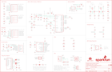

Contents
========

* [PRS19217 > Thing Plus Dual-Port Logging Shield](#prs19217--thing-plus-dual-port-logging-shield)
	* [Schematic](#schematic)
	* [PCB](#pcb)
	* [Interactive BOM](#interactive-bom)
	* [OOMP Parts](#oomp-parts)
	* [Images](#images)
	* [Tags](#tags)
  
![][im]
# PRS19217 > Thing Plus Dual-Port Logging Shield

- ID: PROJ-SPAR-19217-STAN-01
- Hex ID: PRS19217
- Name: Sparkfun
- Description: Sparkfun
- Long Link: [http://oom.lt/PROJ-SPAR-19217-STAN-01](http://oom.lt/PROJ-SPAR-19217-STAN-01)
- Short Link: [http://oom.lt/PRS19217](http://oom.lt/PRS19217)

## Schematic
  

## PCB
  

## Interactive BOM

- Interactive BOM page: [ibom.html](https://htmlpreview.github.io/?https://github.com/oomlout/oomlout_OOMP_projects/blob/main/PROJ-SPAR-19217-STAN-01/kicad/bom/ibom.html)

## OOMP Parts
  

|OOMP ID|Name|Identifier|
| :---: | :---: | :---: |
|[CAPC-0402-X-NF100-V10](https://github.com/oomlout/oomlout_OOMP_parts/tree/main/CAPC-0402-X-NF100-V10/)|[SMD (0402) 100 nF Capacitor (Ceramic) 10v](https://github.com/oomlout/oomlout_OOMP_parts/tree/main/CAPC-0402-X-NF100-V10/)|[C1, C2, C5, C8, C9, C11, C13, C14, C16, C19](https://github.com/oomlout/oomlout_OOMP_parts/tree/main/CAPC-0402-X-NF100-V10/)|
|CAPC-0402-X-UF22D-01||C3, C4, C6, C7, C10, C15, C18|
|[CAPC-0402-X-PF12-V50](https://github.com/oomlout/oomlout_OOMP_parts/tree/main/CAPC-0402-X-PF12-V50/)|[SMD (0402) 12 pF Capacitor (Ceramic) 50v](https://github.com/oomlout/oomlout_OOMP_parts/tree/main/CAPC-0402-X-PF12-V50/)|[C12, C17](https://github.com/oomlout/oomlout_OOMP_parts/tree/main/CAPC-0402-X-PF12-V50/)|
|[CAPC-0402-X-UF10-V63D](https://github.com/oomlout/oomlout_OOMP_parts/tree/main/CAPC-0402-X-UF10-V63D/)|[SMD (0402) 10 uF Capacitor (Ceramic) 6.3v](https://github.com/oomlout/oomlout_OOMP_parts/tree/main/CAPC-0402-X-UF10-V63D/)|[C20, C21, C22, C23, C24](https://github.com/oomlout/oomlout_OOMP_parts/tree/main/CAPC-0402-X-UF10-V63D/)|
|[LEDS-0603-R-STAN-01](https://github.com/oomlout/oomlout_OOMP_parts/tree/main/LEDS-0603-R-STAN-01/)|[SMD (0603) Red LED](https://github.com/oomlout/oomlout_OOMP_parts/tree/main/LEDS-0603-R-STAN-01/)|[D1](https://github.com/oomlout/oomlout_OOMP_parts/tree/main/LEDS-0603-R-STAN-01/)|
|[LEDS-0603-Y-STAN-01](https://github.com/oomlout/oomlout_OOMP_parts/tree/main/LEDS-0603-Y-STAN-01/)|[SMD (0603) Yellow LED](https://github.com/oomlout/oomlout_OOMP_parts/tree/main/LEDS-0603-Y-STAN-01/)|[D2](https://github.com/oomlout/oomlout_OOMP_parts/tree/main/LEDS-0603-Y-STAN-01/)|
|DIOD-UNMATCHED-X-UNMATCHED-01||D3|
|UNMATCHED-UNMATCHED-X-UNMATCHED-01||IC1, J1, J2, J4, U2, U3, U4, U5, U6, Y1|
|MOSP-SO23-X-UNMATCHED-01||Q1, Q3, Q4, Q6|
|MOSN-UNMATCHED-X-UNMATCHED-01||Q2|
|UNMATCHED-SO363-X-UNMATCHED-01||Q5, Q7|
|RESE-0402-X-O1003-01||R1, R5, R6, R7, R9, R15, R20, R21, R23|
|[RESE-0402-X-O103-01](https://github.com/oomlout/oomlout_OOMP_parts/tree/main/RESE-0402-X-O103-01/)|[SMD (0402) 10k Ohm Resistor](https://github.com/oomlout/oomlout_OOMP_parts/tree/main/RESE-0402-X-O103-01/)|[R2, R3, R4, R13, R14, R25, R29, R30](https://github.com/oomlout/oomlout_OOMP_parts/tree/main/RESE-0402-X-O103-01/)|
|[RESE-0402-X-O102-01](https://github.com/oomlout/oomlout_OOMP_parts/tree/main/RESE-0402-X-O102-01/)|[SMD (0402) 1k Ohm Resistor](https://github.com/oomlout/oomlout_OOMP_parts/tree/main/RESE-0402-X-O102-01/)|[R8, R17](https://github.com/oomlout/oomlout_OOMP_parts/tree/main/RESE-0402-X-O102-01/)|
|[RESE-0402-X-O472-01](https://github.com/oomlout/oomlout_OOMP_parts/tree/main/RESE-0402-X-O472-01/)|[SMD (0402) 4.7k Ohm Resistor](https://github.com/oomlout/oomlout_OOMP_parts/tree/main/RESE-0402-X-O472-01/)|[R10, R11](https://github.com/oomlout/oomlout_OOMP_parts/tree/main/RESE-0402-X-O472-01/)|
|[RESE-0402-X-O105-01](https://github.com/oomlout/oomlout_OOMP_parts/tree/main/RESE-0402-X-O105-01/)|[SMD (0402) 1M Ohm Resistor](https://github.com/oomlout/oomlout_OOMP_parts/tree/main/RESE-0402-X-O105-01/)|[R12, R22, R24](https://github.com/oomlout/oomlout_OOMP_parts/tree/main/RESE-0402-X-O105-01/)|
|[RESE-0603-X-O123-01](https://github.com/oomlout/oomlout_OOMP_parts/tree/main/RESE-0603-X-O123-01/)|[SMD (0603) 12k Ohm Resistor](https://github.com/oomlout/oomlout_OOMP_parts/tree/main/RESE-0603-X-O123-01/)|[R16](https://github.com/oomlout/oomlout_OOMP_parts/tree/main/RESE-0603-X-O123-01/)|
|[RESE-0402-X-O222-01](https://github.com/oomlout/oomlout_OOMP_parts/tree/main/RESE-0402-X-O222-01/)|[SMD (0402) 2.2k Ohm Resistor](https://github.com/oomlout/oomlout_OOMP_parts/tree/main/RESE-0402-X-O222-01/)|[R18, R19](https://github.com/oomlout/oomlout_OOMP_parts/tree/main/RESE-0402-X-O222-01/)|
|[RESE-0402-X-O101-01](https://github.com/oomlout/oomlout_OOMP_parts/tree/main/RESE-0402-X-O101-01/)|[SMD (0402) 100 Ohm Resistor](https://github.com/oomlout/oomlout_OOMP_parts/tree/main/RESE-0402-X-O101-01/)|[R26, R27, R28](https://github.com/oomlout/oomlout_OOMP_parts/tree/main/RESE-0402-X-O101-01/)|
|[VREG-SO235-X-KAP2112K-V33D](https://github.com/oomlout/oomlout_OOMP_parts/tree/main/VREG-SO235-X-KAP2112K-V33D/)|[SMD (SOT-23-5) AP2112K Voltage Regulator 3.3v](https://github.com/oomlout/oomlout_OOMP_parts/tree/main/VREG-SO235-X-KAP2112K-V33D/)|[U1](https://github.com/oomlout/oomlout_OOMP_parts/tree/main/VREG-SO235-X-KAP2112K-V33D/)|

## Images
  
  

|bominteractivefront|bominteractiveback|kicadPcb3d|kicadPcb3dFront|kicadPcb3dBack|eagleImage|eagleSchemImage|pcbdraw|pcbdrawback|
| :---: | :---: | :---: | :---: | :---: | :---: | :---: | :---: | :---: |
||||||||||

## Tags

- hexID: PRS19217
- oompType: PROJ
- oompSize: SPAR
- oompColor: 19217
- oompDesc: STAN
- oompIndex: 01
- oompName: Thing Plus Dual-Port Logging Shield
- sources: All source files from https://github.com/sparkfun/Thing_Plus_Dual-Port_Logging_Shield (source licence details in srcLicense.md)
- linkBuyPage: https://www.sparkfun.com/products/19217
- oompID: PROJ-SPAR-19217-STAN-01
- oompParts: C1,CAPC-0402-X-NF100-V10
- oompParts: C2,CAPC-0402-X-NF100-V10
- oompParts: C3,CAPC-0402-X-UF22D-01
- oompParts: C4,CAPC-0402-X-UF22D-01
- oompParts: C5,CAPC-0402-X-NF100-V10
- oompParts: C6,CAPC-0402-X-UF22D-01
- oompParts: C7,CAPC-0402-X-UF22D-01
- oompParts: C8,CAPC-0402-X-NF100-V10
- oompParts: C9,CAPC-0402-X-NF100-V10
- oompParts: C10,CAPC-0402-X-UF22D-01
- oompParts: C11,CAPC-0402-X-NF100-V10
- oompParts: C12,CAPC-0402-X-PF12-V50
- oompParts: C13,CAPC-0402-X-NF100-V10
- oompParts: C14,CAPC-0402-X-NF100-V10
- oompParts: C15,CAPC-0402-X-UF22D-01
- oompParts: C16,CAPC-0402-X-NF100-V10
- oompParts: C17,CAPC-0402-X-PF12-V50
- oompParts: C18,CAPC-0402-X-UF22D-01
- oompParts: C19,CAPC-0402-X-NF100-V10
- oompParts: C20,CAPC-0402-X-UF10-V63D
- oompParts: C21,CAPC-0402-X-UF10-V63D
- oompParts: C22,CAPC-0402-X-UF10-V63D
- oompParts: C23,CAPC-0402-X-UF10-V63D
- oompParts: C24,CAPC-0402-X-UF10-V63D
- oompParts: D1,LEDS-0603-R-STAN-01
- oompParts: D2,LEDS-0603-Y-STAN-01
- oompParts: D3,DIOD-UNMATCHED-X-UNMATCHED-01
- oompParts: IC1,UNMATCHED-UNMATCHED-X-UNMATCHED-01
- oompParts: J1,UNMATCHED-UNMATCHED-X-UNMATCHED-01
- oompParts: J2,UNMATCHED-UNMATCHED-X-UNMATCHED-01
- oompParts: J4,UNMATCHED-UNMATCHED-X-UNMATCHED-01
- oompParts: Q1,MOSP-SO23-X-UNMATCHED-01
- oompParts: Q2,MOSN-UNMATCHED-X-UNMATCHED-01
- oompParts: Q3,MOSP-SO23-X-UNMATCHED-01
- oompParts: Q4,MOSP-SO23-X-UNMATCHED-01
- oompParts: Q5,UNMATCHED-SO363-X-UNMATCHED-01
- oompParts: Q6,MOSP-SO23-X-UNMATCHED-01
- oompParts: Q7,UNMATCHED-SO363-X-UNMATCHED-01
- oompParts: R1,RESE-0402-X-O1003-01
- oompParts: R2,RESE-0402-X-O103-01
- oompParts: R3,RESE-0402-X-O103-01
- oompParts: R4,RESE-0402-X-O103-01
- oompParts: R5,RESE-0402-X-O1003-01
- oompParts: R6,RESE-0402-X-O1003-01
- oompParts: R7,RESE-0402-X-O1003-01
- oompParts: R8,RESE-0402-X-O102-01
- oompParts: R9,RESE-0402-X-O1003-01
- oompParts: R10,RESE-0402-X-O472-01
- oompParts: R11,RESE-0402-X-O472-01
- oompParts: R12,RESE-0402-X-O105-01
- oompParts: R13,RESE-0402-X-O103-01
- oompParts: R14,RESE-0402-X-O103-01
- oompParts: R15,RESE-0402-X-O1003-01
- oompParts: R16,RESE-0603-X-O123-01
- oompParts: R17,RESE-0402-X-O102-01
- oompParts: R18,RESE-0402-X-O222-01
- oompParts: R19,RESE-0402-X-O222-01
- oompParts: R20,RESE-0402-X-O1003-01
- oompParts: R21,RESE-0402-X-O1003-01
- oompParts: R22,RESE-0402-X-O105-01
- oompParts: R23,RESE-0402-X-O1003-01
- oompParts: R24,RESE-0402-X-O105-01
- oompParts: R25,RESE-0402-X-O103-01
- oompParts: R26,RESE-0402-X-O101-01
- oompParts: R27,RESE-0402-X-O101-01
- oompParts: R28,RESE-0402-X-O101-01
- oompParts: R29,RESE-0402-X-O103-01
- oompParts: R30,RESE-0402-X-O103-01
- oompParts: U1,VREG-SO235-X-KAP2112K-V33D
- oompParts: U2,UNMATCHED-UNMATCHED-X-UNMATCHED-01
- oompParts: U3,UNMATCHED-UNMATCHED-X-UNMATCHED-01
- oompParts: U4,UNMATCHED-UNMATCHED-X-UNMATCHED-01
- oompParts: U5,UNMATCHED-UNMATCHED-X-UNMATCHED-01
- oompParts: U6,UNMATCHED-UNMATCHED-X-UNMATCHED-01
- oompParts: Y1,UNMATCHED-UNMATCHED-X-UNMATCHED-01
- rawParts: C1,0.1uF,0.1UF-0402T-6.3V-10%-X7R,0402-TIGHT,0.1µF ceramic capacitors,,,CAP-14993,,0.1uF,
- rawParts: C2,0.1uF,0.1UF-0402T-6.3V-10%-X7R,0402-TIGHT,0.1µF ceramic capacitors,,,CAP-14993,,0.1uF,
- rawParts: C3,2.2uF,2.2UF-0402_TIGHT-10V-10%-X5R,0402-TIGHT,2.2µF ceramic capacitors,,,CAP-14232,,2.2uF,
- rawParts: C4,2.2uF,2.2UF-0402_TIGHT-10V-10%-X5R,0402-TIGHT,2.2µF ceramic capacitors,,,CAP-14232,,2.2uF,
- rawParts: C5,0.1uF,0.1UF-0402T-6.3V-10%-X7R,0402-TIGHT,0.1µF ceramic capacitors,,,CAP-14993,,0.1uF,
- rawParts: C6,2.2uF,2.2UF-0402_TIGHT-10V-10%-X5R,0402-TIGHT,2.2µF ceramic capacitors,,,CAP-14232,,2.2uF,
- rawParts: C7,2.2uF,2.2UF-0402_TIGHT-10V-10%-X5R,0402-TIGHT,2.2µF ceramic capacitors,,,CAP-14232,,2.2uF,
- rawParts: C8,0.1uF,0.1UF-0402T-6.3V-10%-X7R,0402-TIGHT,0.1µF ceramic capacitors,,,CAP-14993,,0.1uF,
- rawParts: C9,0.1uF,0.1UF-0402T-6.3V-10%-X7R,0402-TIGHT,0.1µF ceramic capacitors,,,CAP-14993,,0.1uF,
- rawParts: C10,2.2uF,2.2UF-0402_TIGHT-10V-10%-X5R,0402-TIGHT,2.2µF ceramic capacitors,,,CAP-14232,,2.2uF,
- rawParts: C11,0.1uF,0.1UF-0402T-6.3V-10%-X7R,0402-TIGHT,0.1µF ceramic capacitors,,,CAP-14993,,0.1uF,
- rawParts: C12,12pF,12PF-0402T-50V-5%,0402-TIGHT,12pF ceramic capacitors,,,CAP-14665,,12pF,
- rawParts: C13,0.1uF,0.1UF-0402T-6.3V-10%-X7R,0402-TIGHT,0.1µF ceramic capacitors,,,CAP-14993,,0.1uF,
- rawParts: C14,0.1uF,0.1UF-0402T-6.3V-10%-X7R,0402-TIGHT,0.1µF ceramic capacitors,,,CAP-14993,,0.1uF,
- rawParts: C15,2.2uF,2.2UF-0402_TIGHT-10V-10%-X5R,0402-TIGHT,2.2µF ceramic capacitors,,,CAP-14232,,2.2uF,
- rawParts: C16,0.1uF,0.1UF-0402T-6.3V-10%-X7R,0402-TIGHT,0.1µF ceramic capacitors,,,CAP-14993,,0.1uF,
- rawParts: C17,12pF,12PF-0402T-50V-5%,0402-TIGHT,12pF ceramic capacitors,,,CAP-14665,,12pF,
- rawParts: C18,2.2uF,2.2UF-0402_TIGHT-10V-10%-X5R,0402-TIGHT,2.2µF ceramic capacitors,,,CAP-14232,,2.2uF,
- rawParts: C19,0.1uF,0.1UF-0402T-6.3V-10%-X7R,0402-TIGHT,0.1µF ceramic capacitors,,,CAP-14993,,0.1uF,
- rawParts: C20,10uF,10UF-0402T-6.3V-20%,0402-TIGHT,10.0µF ceramic capacitors,,,CAP-14848,,10uF,
- rawParts: C21,10uF,10UF-0402T-6.3V-20%,0402-TIGHT,10.0µF ceramic capacitors,,,CAP-14848,,10uF,
- rawParts: C22,10uF,10UF-0402T-6.3V-20%,0402-TIGHT,10.0µF ceramic capacitors,,,CAP-14848,,10uF,
- rawParts: C23,10uF,10UF-0402T-6.3V-20%,0402-TIGHT,10.0µF ceramic capacitors,,,CAP-14848,,10uF,
- rawParts: C24,10uF,10UF-0402T-6.3V-20%,0402-TIGHT,10.0µF ceramic capacitors,,,CAP-14848,,10uF,
- rawParts: D1,RED,LED-RED0603,LED-0603,Red SMD LED,,,DIO-00819,,RED,
- rawParts: D2,Yellow,LED-YELLOW0603,LED-0603,Yellow SMD LED,,,DIO-09003,,Yellow,
- rawParts: D3,PRTR5V0U2F,PRTR5V0U2F,SOT886,A small ESD protection device. Most commonly used on USB D+/D- signals to protect large, expensive, or especially sensitive USB enabled devices.,,,DIO-14084,,,
- rawParts: FD1,FIDUCIALUFIDUCIAL,FIDUCIALUFIDUCIAL,FIDUCIAL-MICRO,Fiducial Alignment Points,,,,,,
- rawParts: FD2,FIDUCIALUFIDUCIAL,FIDUCIALUFIDUCIAL,FIDUCIAL-MICRO,Fiducial Alignment Points,,,,,,
- rawParts: FD3,FIDUCIALUFIDUCIAL,FIDUCIALUFIDUCIAL,FIDUCIAL-MICRO,Fiducial Alignment Points,,,,,,
- rawParts: FD4,FIDUCIALUFIDUCIAL,FIDUCIALUFIDUCIAL,FIDUCIAL-MICRO,Fiducial Alignment Points,,,,,,
- rawParts: FRAME1,FRAME-LEDGER,FRAME-LEDGER,CREATIVE_COMMONS,Schematic Frame - Ledger,,,,,,
- rawParts: GPIO10,TEST-POINT3,TEST-POINT3,PAD.03X.03,SparkFun Test Points,,,,,,
- rawParts: H1,STAND-OFF,STAND-OFF,STAND-OFF,Stand Off,,,,,,
- rawParts: H2,STAND-OFF,STAND-OFF,STAND-OFF,Stand Off,,,,,,
- rawParts: H3,STAND-OFF,STAND-OFF,STAND-OFF,Stand Off,,,,,,
- rawParts: H4,STAND-OFF,STAND-OFF,STAND-OFF,Stand Off,,,,,,
- rawParts: I2C,JUMPER-SMT_3_2-NC_TRACE_SILK,JUMPER-SMT_3_2-NC_TRACE_SILK,SMT-JUMPER_3_2-NC_TRACE_SILK,Normally closed trace jumper (2 of 2 connections),,,,,,
- rawParts: IC1,USB224X_2241_V04,USB224X_2241_V04,36-QFN,Microchip Technology USB224x Flash Media Controller 36-QFN,,,IC-16527,,,
- rawParts: J1,,USB_C_4-LAYER_PADS,USB-C-16P_4LAYER-PADS,USB Type C 16Pin Connector,,,CONN-14122,,,
- rawParts: J2,MICRO-SD-PUSH-PUSH-EXT-PIN,MICRO-SD-PUSH-PUSH-EXT-PIN,MICROSD-EXTERNALPIN,microSD Socket for Transflash,,,CONN-16110,,,
- rawParts: J3,AVR_SPI_PROG_3X2TESTPOINTS,AVR_SPI_PROG_3X2TESTPOINTS,2X3_TEST_POINTS,AVR ISP 6 Pin,,,,,,
- rawParts: J4,THING_PLUS,THING_PLUS,THING_PLUS,,,,,,,
- rawParts: JP1,JUMPER-SMT_2_NC_TRACE_SILK,JUMPER-SMT_2_NC_TRACE_SILK,SMT-JUMPER_2_NC_TRACE_SILK,Normally closed trace jumper,,,,,,
- rawParts: JP2,JUMPER-SMT_2_NO_SILK,JUMPER-SMT_2_NO_SILK,SMT-JUMPER_2_NO_SILK,Normally open jumper,,,,,,
- rawParts: JP3,JUMPER-SMT_2_NO_SILK,JUMPER-SMT_2_NO_SILK,SMT-JUMPER_2_NO_SILK,Normally open jumper,,,,,,
- rawParts: JP4,USB_SOLDER_PADS,USB_SOLDER_PADS,USB-SOLDER-PADS,Solder pad access to USB pins. Helpful to expose on PCBs so user can attach external USB connector if necessary.,,,,,,
- rawParts: LED1,JUMPER-SMT_2_NC_TRACE_SILK,JUMPER-SMT_2_NC_TRACE_SILK,SMT-JUMPER_2_NC_TRACE_SILK,Normally closed trace jumper,,,,,,
- rawParts: LED2,JUMPER-SMT_2_NC_TRACE_SILK,JUMPER-SMT_2_NC_TRACE_SILK,SMT-JUMPER_2_NC_TRACE_SILK,Normally closed trace jumper,,,,,,
- rawParts: LOGO2,OSHW-LOGOMINI,OSHW-LOGOMINI,OSHW-LOGO-MINI,Open-Source Hardware (OSHW) Logo,,,,,,
- rawParts: LOGO3,OSHW-LOGOMINI,OSHW-LOGOMINI,OSHW-LOGO-MINI,Open-Source Hardware (OSHW) Logo,,,,,,
- rawParts: LOGO4,SFE_LOGO_FLAME.2_INCH,SFE_LOGO_FLAME.2_INCH,SFE_LOGO_FLAME_.2,SparkFun Flame Logo,,,,,,
- rawParts: LOGO5,SFE_LOGO_NAME_FLAME.1_INCH,SFE_LOGO_NAME_FLAME.1_INCH,SFE_LOGO_NAME_FLAME_.1,SparkFun Font Logo w/ Flame,,,,,,
- rawParts: MICROSD_VCC,TEST-POINT3,TEST-POINT3,PAD.03X.03,SparkFun Test Points,,,,,,
- rawParts: Q1,20V/4.2A/52mΩ/1.4W,MOSFET_PCH-DMG2305UX-7,SOT23-3,P-channel MOSFETs,,,TRANS-14388,,20V/4.2A/52mΩ/1.4W,
- rawParts: Q2,20V/0.2A/8MHz/1.2Ω/1Vth,MOSFET-NCH-RE1C002UNTCL,SOT-416FL,N-channel MOSFETs,,,TRANS-14399,,20V/0.2A/8MHz/1.2Ω/1Vth,
- rawParts: Q3,20V/4.2A/52mΩ/1.4W,MOSFET_PCH-DMG2305UX-7,SOT23-3,P-channel MOSFETs,,,TRANS-14388,,20V/4.2A/52mΩ/1.4W,
- rawParts: Q4,20V/4.2A/52mΩ/1.4W,MOSFET_PCH-DMG2305UX-7,SOT23-3,P-channel MOSFETs,,,TRANS-14388,,20V/4.2A/52mΩ/1.4W,
- rawParts: Q5,,TRANS_PNP_DUALSOT-363,SOT363_PHILIPS,Dual PNP Transistors in Single Package,,,TRANS-14386,,,
- rawParts: Q6,20V/4.2A/52mΩ/1.4W,MOSFET_PCH-DMG2305UX-7,SOT23-3,P-channel MOSFETs,,,TRANS-14388,,20V/4.2A/52mΩ/1.4W,
- rawParts: Q7,,TRANS_PNP_DUALSOT-363,SOT363_PHILIPS,Dual PNP Transistors in Single Package,,,TRANS-14386,,,
- rawParts: R1,100k,100KOHM-0402T-1/16W-1%,0402-TIGHT,100kΩ resistor,,,RES-13495,,100k,
- rawParts: R2,10k,10KOHM-0402T-1/16W-1%,0402-TIGHT,10kΩ resistor,,,RES-14241,,10k,
- rawParts: R3,10k,10KOHM-0402T-1/16W-1%,0402-TIGHT,10kΩ resistor,,,RES-14241,,10k,
- rawParts: R4,10k,10KOHM-0402T-1/16W-1%,0402-TIGHT,10kΩ resistor,,,RES-14241,,10k,
- rawParts: R5,100k,100KOHM-0402T-1/16W-1%,0402-TIGHT,100kΩ resistor,,,RES-13495,,100k,
- rawParts: R6,100k,100KOHM-0402T-1/16W-1%,0402-TIGHT,100kΩ resistor,,,RES-13495,,100k,
- rawParts: R7,100k,100KOHM-0402T-1/16W-1%,0402-TIGHT,100kΩ resistor,,,RES-13495,,100k,
- rawParts: R8,1k,1KOHM-0402T-1/16W-1%,0402-TIGHT,1kΩ resistor,,,RES-14342,,1k,
- rawParts: R9,100k,100KOHM-0402T-1/16W-1%,0402-TIGHT,100kΩ resistor,,,RES-13495,,100k,
- rawParts: R10,5.1k,5.1KOHM-0402T-1/16W-1%,0402-TIGHT,,,,RES-14340,,5.1k,
- rawParts: R11,5.1k,5.1KOHM-0402T-1/16W-1%,0402-TIGHT,,,,RES-14340,,5.1k,
- rawParts: R12,1M,1MOHM-0402T-1/16W-5%,0402-TIGHT,1MΩ resistor,,,RES-15185,,1M,
- rawParts: R13,10k,10KOHM-0402T-1/16W-1%,0402-TIGHT,10kΩ resistor,,,RES-14241,,10k,
- rawParts: R14,10k,10KOHM-0402T-1/16W-1%,0402-TIGHT,10kΩ resistor,,,RES-14241,,10k,
- rawParts: R15,100k,100KOHM-0402T-1/16W-1%,0402-TIGHT,100kΩ resistor,,,RES-13495,,100k,
- rawParts: R16,12k,12KOHM-0603-1/10W-1%,0603,12kΩ resistor,,,RES-10327,,12k,
- rawParts: R17,1k,1KOHM-0402T-1/16W-1%,0402-TIGHT,1kΩ resistor,,,RES-14342,,1k,
- rawParts: R18,2.2k,2.2KOHM-0402T-1/16W-1%,0402-TIGHT,2.2kΩ resistor,,,RES-14341,,2.2k,
- rawParts: R19,2.2k,2.2KOHM-0402T-1/16W-1%,0402-TIGHT,2.2kΩ resistor,,,RES-14341,,2.2k,
- rawParts: R20,100k,100KOHM-0402T-1/16W-1%,0402-TIGHT,100kΩ resistor,,,RES-13495,,100k,
- rawParts: R21,100k,100KOHM-0402T-1/16W-1%,0402-TIGHT,100kΩ resistor,,,RES-13495,,100k,
- rawParts: R22,1M,1MOHM-0402T-1/16W-5%,0402-TIGHT,1MΩ resistor,,,RES-15185,,1M,
- rawParts: R23,100k,100KOHM-0402T-1/16W-1%,0402-TIGHT,100kΩ resistor,,,RES-13495,,100k,
- rawParts: R24,1M,1MOHM-0402T-1/16W-5%,0402-TIGHT,1MΩ resistor,,,RES-15185,,1M,
- rawParts: R25,10k,10KOHM-0402T-1/16W-1%,0402-TIGHT,10kΩ resistor,,,RES-14241,,10k,
- rawParts: R26,100,100OHM-0402-TIGHT-1/16W-1%,0402-TIGHT,100Ω resistor,,,RES-14962,,100,
- rawParts: R27,100,100OHM-0402-TIGHT-1/16W-1%,0402-TIGHT,100Ω resistor,,,RES-14962,,100,
- rawParts: R28,100,100OHM-0402-TIGHT-1/16W-1%,0402-TIGHT,100Ω resistor,,,RES-14962,,100,
- rawParts: R29,10k,10KOHM-0402T-1/16W-1%,0402-TIGHT,10kΩ resistor,,,RES-14241,,10k,
- rawParts: R30,10k,10KOHM-0402T-1/16W-1%,0402-TIGHT,10kΩ resistor,,,RES-14241,,10k,
- rawParts: RXD,JUMPER-SMT_2_NO_SILK,JUMPER-SMT_2_NO_SILK,SMT-JUMPER_2_NO_SILK,Normally open jumper,,,,,,
- rawParts: SDIO_!RESET!,TEST-POINT3,TEST-POINT3,PAD.03X.03,SparkFun Test Points,,,,,,
- rawParts: SDIO_VDD,TEST-POINT3,TEST-POINT3,PAD.03X.03,SparkFun Test Points,,,,,,
- rawParts: SH,JUMPER-SMT_2_NC_TRACE_NO-SILK,JUMPER-SMT_2_NC_TRACE_NO-SILK,SMT-JUMPER_2_NC_TRACE_NO-SILK,Normally closed trace jumper,,,,,,
- rawParts: TXD,JUMPER-SMT_2_NO_SILK,JUMPER-SMT_2_NO_SILK,SMT-JUMPER_2_NO_SILK,Normally open jumper,,,,,,
- rawParts: U1,3.3V,V_REG_AP2112K-3.3V,SOT23-5,AP2112 - 600mA CMOS LDO Regulator w/ Enable,,,VREG-12457,,3.3V,
- rawParts: U2,74HC4066_QUAD_BILATERAL_SWITCH_QFN,74HC4066_QUAD_BILATERAL_SWITCH_QFN,14-QFN,Nexperia Quad Bilateral Switch,,,IC-16528,,,
- rawParts: U3,ATTINY841-ARDUINO_QFN20M1,ATTINY841-ARDUINO_QFN20M1,QFN20_20M1,ATtiny841,,ATTINY841-MU-ND,IC-16067,,,
- rawParts: U4,74HC4066_QUAD_BILATERAL_SWITCH_QFN,74HC4066_QUAD_BILATERAL_SWITCH_QFN,14-QFN,Nexperia Quad Bilateral Switch,,,IC-16528,,,
- rawParts: U5,74HC4066_QUAD_BILATERAL_SWITCH_QFN,74HC4066_QUAD_BILATERAL_SWITCH_QFN,14-QFN,Nexperia Quad Bilateral Switch,,,IC-16528,,,
- rawParts: U6,24C04,EEPROM-I2C256K,SO08,I2C EEPROMs, 24LC256 and others,,,IC-09714,,24LC256,
- rawParts: Y1,24MHz,CRYSTAL-24MHZ-SMD-2.0X1.6MM,CRYSTAL-SMD-2.0X1.6MM,24MHz Crystal,,,XTAL-14845,,24MHz,

[im]: kicadPcb3d_450.png
