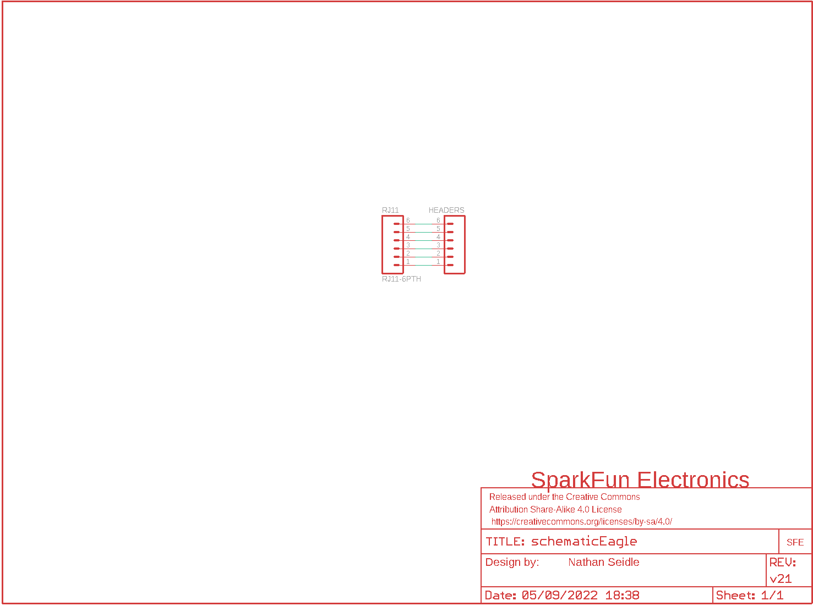
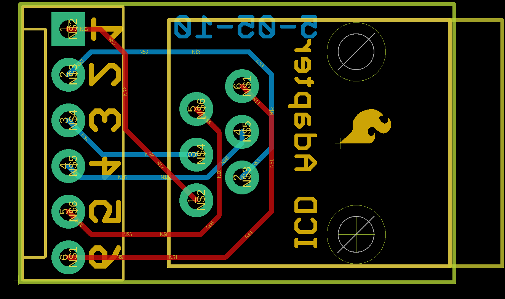
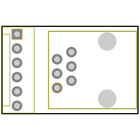
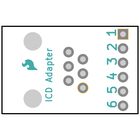
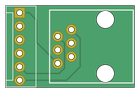
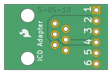

Contents
========

* [PRS193 > Adapter Board-ICD ICD2](#prs193--adapter-board-icd-icd2)
	* [Schematic](#schematic)
	* [PCB](#pcb)
	* [Interactive BOM](#interactive-bom)
	* [Images](#images)
	* [Tags](#tags)
  
![][im]
# PRS193 > Adapter Board-ICD ICD2

- ID: PROJ-SPAR-193-STAN-01
- Hex ID: PRS193
- Name: Sparkfun
- Description: Sparkfun
- Long Link: [http://oom.lt/PROJ-SPAR-193-STAN-01](http://oom.lt/PROJ-SPAR-193-STAN-01)
- Short Link: [http://oom.lt/PRS193](http://oom.lt/PRS193)

## Schematic
  

## PCB
  

## Interactive BOM

- Interactive BOM page: [ibom.html](https://htmlpreview.github.io/?https://github.com/oomlout/oomlout_OOMP_projects/blob/main/PROJ-SPAR-193-STAN-01/kicad/bom/ibom.html)

## Images
  
  

|bominteractivefront|bominteractiveback|kicadPcb3d|kicadPcb3dFront|kicadPcb3dBack|eagleImage|eagleSchemImage|pcbdraw|pcbdrawback|
| :---: | :---: | :---: | :---: | :---: | :---: | :---: | :---: | :---: |
||||||||||

## Tags

- hexID: PRS193
- oompType: PROJ
- oompSize: SPAR
- oompColor: 193
- oompDesc: STAN
- oompIndex: 01
- oompName: Adapter Board-ICD ICD2
- sources: All source files from https://github.com/sparkfun/Adapter_Board-ICD_ICD2 (source licence details in srcLicense.md)
- linkBuyPage: https://www.sparkfun.com/products/193
- oompID: PROJ-SPAR-193-STAN-01
- rawParts: FRAME1,,FRAME-LETTERNO_PACKAGE,DUMMY,Schematic Frame,Nathan Seidle,v21,
- rawParts: HEADERS,,M06POLAR,MOLEX-1X6,Header 6,,,
- rawParts: JP1,LOGO-SFESK,LOGO-SFESK,SFE-LOGO-FLAME,Spark Fun Electronics PCB Logo,,,
- rawParts: RJ11,RJ11-6PTH,RJ11-6PTH,RJ11-6,RJ11 Jack,,,

[im]: kicadPcb3d_450.png
