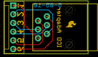
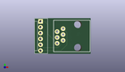
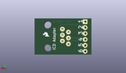
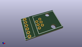

Contents
========

* [PROJ-SPAR-193-STAN-01>Adapter Board-ICD ICD2](#proj-spar-193-stan-01adapter-board-icd-icd2)
	* [Images](#images)
	* [Interactive BOM](#interactive-bom)
	* [Tags](#tags)
  
![][im]
# PROJ-SPAR-193-STAN-01>Adapter Board-ICD ICD2

- ID: PROJ-SPAR-193-STAN-01
- Hex ID: PRS193
- Name: Adapter Board-ICD ICD2
- Description: 

## Images
  
  

|eagleImage|kicadPcb3dFront|kicadPcb3dBack|kicadPcb3d|
| :---: | :---: | :---: | :---: |
|||||

## Interactive BOM

- Interactive BOM page: [ibom.html](kicad/bom/ibom.html)

## Tags

- hexID: PRS193
- oompType: PROJ
- oompSize: SPAR
- oompColor: 193
- oompDesc: STAN
- oompIndex: 01
- oompName: Adapter Board-ICD ICD2
- sources: All source files from https://github.com/sparkfun/Adapter_Board-ICD_ICD2 (source licence details in srcLicense.md)
- linkBuyPage: https://www.sparkfun.com/products/193
- oompID: PROJ-SPAR-193-STAN-01

[im]: kicadPcb3d_450.png
