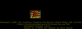
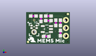
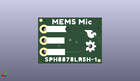
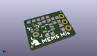

Contents
========

* [PROJ-SPAR-19389-STAN-01>SparkFun Analog MEMS Microphone Breakout SPH8878LR5H-1](#proj-spar-19389-stan-01sparkfun-analog-mems-microphone-breakout-sph8878lr5h-1)
	* [Images](#images)
	* [Interactive BOM](#interactive-bom)
	* [OOMP Parts](#oomp-parts)
	* [Tags](#tags)
  
![][im]
# PROJ-SPAR-19389-STAN-01>SparkFun Analog MEMS Microphone Breakout SPH8878LR5H-1

- ID: PROJ-SPAR-19389-STAN-01
- Hex ID: PRS19389
- Name: SparkFun Analog MEMS Microphone Breakout SPH8878LR5H-1
- Description: 

## Images
  
  

|eagleImage|kicadPcb3dFront|kicadPcb3dBack|kicadPcb3d|
| :---: | :---: | :---: | :---: |
|||||

## Interactive BOM

- Interactive BOM page: [ibom.html](kicad/bom/ibom.html)

## OOMP Parts
  

|OOMP Parts|
| :---: |
|CAPE-0603-X-UNMATCHED-01, C1, 2.3114, 8.915399999999998, 0,C1, 4.7uF, 0603, SparkFun-Capacitors, (0.091, 0.351), R0|
|CAPE-0603-X-UNMATCHED-01, C2, 9.4742, 6.731, 90,C2, 1.0uF, 0603, SparkFun-Capacitors, (0.373, 0.265), R90|
|CAPE-0603-X-UNMATCHED-01, C3, 7.112, 8.915399999999998, 0,C3, 27pF, 0603, SparkFun-Capacitors, (0.28, 0.351), R0|
|CAPE-0603-X-NF100-01, C4, 6.4262, 2.3876, 180,C4, 0.1uF, 0603, SparkFun-Capacitors, (0.253, 0.094), R180|
|UNMATCHED-UNMATCHED-X-UNMATCHED-01, FD1, 13.3604, 9.5504, 0,FD1, FIDUCIALUFIDUCIAL, FIDUCIAL-MICRO, SparkFun-Aesthetics, (0.526, 0.376), R0|
|UNMATCHED-UNMATCHED-X-UNMATCHED-01, FD2, 13.3604, 9.5504, M0,FD2, FIDUCIALUFIDUCIAL, FIDUCIAL-MICRO, SparkFun-Aesthetics, (0.526, 0.376), MR0|
|UNMATCHED-UNMATCHED-X-UNMATCHED-01, FD3, 0.6096, 0.635, 0,FD3, FIDUCIALUFIDUCIAL, FIDUCIAL-MICRO, SparkFun-Aesthetics, (0.024, 0.025), R0|
|UNMATCHED-UNMATCHED-X-UNMATCHED-01, FD4, 0.6096, 0.635, M0,FD4, FIDUCIALUFIDUCIAL, FIDUCIAL-MICRO, SparkFun-Aesthetics, (0.024, 0.025), MR0|
|UNMATCHED-UNMATCHED-X-UNMATCHED-01, JP1, 12.7, 2.54, 90,JP1, 1X03_NO_SILK, SparkFun-Connectors, (0.5, 0.1), R90|
|UNMATCHED-UNMATCHED-X-UNMATCHED-01, OUT-, 2.54, 7.619999999999999, M0,OUT-, TP_15TH, SparkFun-Connectors, (0.1, 0.3), MR0|
|<table><tr><td></td><td> R1</td><td>[RESE-0603-X-O103-01 SMD (0603) 10k Ohm Resistor](https://github.com/oomlout/oomlout_OOMP_parts/tree/main/RESE-0603-X-O103-01/)</td><td>[R6103](https://github.com/oomlout/oomlout_OOMP_parts/tree/main/RESE-0603-X-O103-01/)</td></tr></table>|
|<table><tr><td></td><td> R2</td><td>[RESE-0603-X-O103-01 SMD (0603) 10k Ohm Resistor](https://github.com/oomlout/oomlout_OOMP_parts/tree/main/RESE-0603-X-O103-01/)</td><td>[R6103](https://github.com/oomlout/oomlout_OOMP_parts/tree/main/RESE-0603-X-O103-01/)</td></tr></table>|
|RESE-0603-X-UNMATCHED-01, R3, 4.7498, 8.026399999999999, 90,R3, 4.7k, 0603, SparkFun-Resistors, (0.187, 0.316), R90|
|RESE-0603-X-O304-01, R4, 7.112, 7.442199999999999, 180,R4, 300k, 0603, SparkFun-Resistors, (0.28, 0.293), R180|
|UNMATCHED-UNMATCHED-X-UNMATCHED-01, U1, 6.6293999999999995, 4.7498, 90,U1, OPA344, SOT23-5, SparkFun-IC-Amplifiers, (0.261, 0.187), R90|
|UNMATCHED-UNMATCHED-X-UNMATCHED-01, U3, 2.54, 3.8099999999999996, 0,U3, SPH8878LR5H-1, SPH8878LR5H-1, temp, (0.1, 0.15), R0|

## Tags

- hexID: PRS19389
- oompType: PROJ
- oompSize: SPAR
- oompColor: 19389
- oompDesc: STAN
- oompIndex: 01
- oompName: SparkFun Analog MEMS Microphone Breakout SPH8878LR5H-1
- sources: All source files from https://github.com/sparkfun/SparkFun_Analog_MEMS_Microphone_Breakout_SPH8878LR5H-1 (source licence details in srcLicense.md)
- linkBuyPage: https://www.sparkfun.com/products/19389
- oompPart: CAPE-0603-X-UNMATCHED-01, C1, 2.3114, 8.915399999999998, 0
- oompPart: CAPE-0603-X-UNMATCHED-01, C2, 9.4742, 6.731, 90
- oompPart: CAPE-0603-X-UNMATCHED-01, C3, 7.112, 8.915399999999998, 0
- oompPart: CAPE-0603-X-NF100-01, C4, 6.4262, 2.3876, 180
- oompPart: UNMATCHED-UNMATCHED-X-UNMATCHED-01, FD1, 13.3604, 9.5504, 0
- oompPart: UNMATCHED-UNMATCHED-X-UNMATCHED-01, FD2, 13.3604, 9.5504, M0
- oompPart: UNMATCHED-UNMATCHED-X-UNMATCHED-01, FD3, 0.6096, 0.635, 0
- oompPart: UNMATCHED-UNMATCHED-X-UNMATCHED-01, FD4, 0.6096, 0.635, M0
- oompPart: UNMATCHED-UNMATCHED-X-UNMATCHED-01, JP1, 12.7, 2.54, 90
- oompPart: UNMATCHED-UNMATCHED-X-UNMATCHED-01, OUT-, 2.54, 7.619999999999999, M0
- oompPart: RESE-0603-X-O103-01, R1, 10.9474, 3.4544, 270
- oompPart: RESE-0603-X-O103-01, R2, 10.9474, 6.731, 270
- oompPart: RESE-0603-X-UNMATCHED-01, R3, 4.7498, 8.026399999999999, 90
- oompPart: RESE-0603-X-O304-01, R4, 7.112, 7.442199999999999, 180
- oompPart: UNMATCHED-UNMATCHED-X-UNMATCHED-01, U1, 6.6293999999999995, 4.7498, 90
- oompPart: UNMATCHED-UNMATCHED-X-UNMATCHED-01, U3, 2.54, 3.8099999999999996, 0
- rawPart: C1, 4.7uF, 0603, SparkFun-Capacitors, (0.091, 0.351), R0
- rawPart: C2, 1.0uF, 0603, SparkFun-Capacitors, (0.373, 0.265), R90
- rawPart: C3, 27pF, 0603, SparkFun-Capacitors, (0.28, 0.351), R0
- rawPart: C4, 0.1uF, 0603, SparkFun-Capacitors, (0.253, 0.094), R180
- rawPart: FD1, FIDUCIALUFIDUCIAL, FIDUCIAL-MICRO, SparkFun-Aesthetics, (0.526, 0.376), R0
- rawPart: FD2, FIDUCIALUFIDUCIAL, FIDUCIAL-MICRO, SparkFun-Aesthetics, (0.526, 0.376), MR0
- rawPart: FD3, FIDUCIALUFIDUCIAL, FIDUCIAL-MICRO, SparkFun-Aesthetics, (0.024, 0.025), R0
- rawPart: FD4, FIDUCIALUFIDUCIAL, FIDUCIAL-MICRO, SparkFun-Aesthetics, (0.024, 0.025), MR0
- rawPart: JP1, 1X03_NO_SILK, SparkFun-Connectors, (0.5, 0.1), R90
- rawPart: OUT-, TP_15TH, SparkFun-Connectors, (0.1, 0.3), MR0
- rawPart: R1, 10k, 0603, SparkFun-Resistors, (0.431, 0.136), R270
- rawPart: R2, 10k, 0603, SparkFun-Resistors, (0.431, 0.265), R270
- rawPart: R3, 4.7k, 0603, SparkFun-Resistors, (0.187, 0.316), R90
- rawPart: R4, 300k, 0603, SparkFun-Resistors, (0.28, 0.293), R180
- rawPart: U1, OPA344, SOT23-5, SparkFun-IC-Amplifiers, (0.261, 0.187), R90
- rawPart: U3, SPH8878LR5H-1, SPH8878LR5H-1, temp, (0.1, 0.15), R0

[im]: kicadPcb3d_450.png
