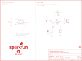

Contents
========

* [PRS19389 > SparkFun Analog MEMS Microphone Breakout SPH8878LR5H-1](#prs19389--sparkfun-analog-mems-microphone-breakout-sph8878lr5h-1)
	* [Schematic](#schematic)
	* [PCB](#pcb)
	* [Interactive BOM](#interactive-bom)
	* [Images](#images)
	* [Tags](#tags)
  
![][im]
# PRS19389 > SparkFun Analog MEMS Microphone Breakout SPH8878LR5H-1

- ID: PROJ-SPAR-19389-STAN-01
- Hex ID: PRS19389
- Name: Sparkfun
- Description: Sparkfun
- Long Link: [http://oom.lt/PROJ-SPAR-19389-STAN-01](http://oom.lt/PROJ-SPAR-19389-STAN-01)
- Short Link: [http://oom.lt/PRS19389](http://oom.lt/PRS19389)

## Schematic
  

## PCB
  

## Interactive BOM

- Interactive BOM page: [ibom.html](https://htmlpreview.github.io/?https://github.com/oomlout/oomlout_OOMP_projects/blob/main/PROJ-SPAR-19389-STAN-01/kicad/bom/ibom.html)

## Images
  
  

|bominteractivefront|bominteractiveback|kicadPcb3d|kicadPcb3dFront|kicadPcb3dBack|eagleImage|eagleSchemImage|
| :---: | :---: | :---: | :---: | :---: | :---: | :---: |
||||||||

## Tags

- hexID: PRS19389
- oompType: PROJ
- oompSize: SPAR
- oompColor: 19389
- oompDesc: STAN
- oompIndex: 01
- oompName: SparkFun Analog MEMS Microphone Breakout SPH8878LR5H-1
- sources: All source files from https://github.com/sparkfun/SparkFun_Analog_MEMS_Microphone_Breakout_SPH8878LR5H-1 (source licence details in srcLicense.md)
- linkBuyPage: https://www.sparkfun.com/products/19389
- oompID: PROJ-SPAR-19389-STAN-01

[im]: kicadPcb3d_450.png
