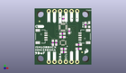
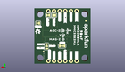
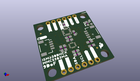

Contents
========

* [PROJ-SPAR-19895-STAN-01>SparkFun Qwiic 9DoF-ISM330DHCX-MMC5983MA](#proj-spar-19895-stan-01sparkfun-qwiic-9dof-ism330dhcx-mmc5983ma)
	* [Images](#images)
	* [Interactive BOM](#interactive-bom)
	* [OOMP Parts](#oomp-parts)
	* [Tags](#tags)
  
![][im]
# PROJ-SPAR-19895-STAN-01>SparkFun Qwiic 9DoF-ISM330DHCX-MMC5983MA

- ID: PROJ-SPAR-19895-STAN-01
- Hex ID: PRS19895
- Name: SparkFun Qwiic 9DoF-ISM330DHCX-MMC5983MA
- Description: 

## Images
  
  

|eagleImage|kicadPcb3dFront|kicadPcb3dBack|kicadPcb3d|
| :---: | :---: | :---: | :---: |
|||||

## Interactive BOM

- Interactive BOM page: [ibom.html](kicad/bom/ibom.html)

## OOMP Parts
  

|OOMP Parts|
| :---: |
|UNMATCHED-UNMATCHED-X-UNMATCHED-01, 6DOF_ADDR, 19.84375, 8.001, M90,6DOF_ADDR, JUMPER-SMT_3_1-NC_TRACE_SILK, SMT-JUMPER_3_1-NC_TRACE_SILK, SparkFun-Jumpers, (0.78125, 0.315), MR90|
|CAPC-0603-X-UNMATCHED-01, C1, 15.493999999999998, 15.112999999999998, 270,C1, 1.0uF, 0603, SparkFun-Capacitors, (0.61, 0.595), R270|
|CAPC-0603-X-UNMATCHED-01, C2, 12.446, 13.97, 180,C2, 10uF, 0603, SparkFun-Capacitors, (0.49, 0.55), R180|
|<table><tr><td></td><td> C3</td><td>[CAPC-0603-X-NF100-V50 SMD (0603) 100 nF Capacitor (Ceramic) 50v](https://github.com/oomlout/oomlout_OOMP_parts/tree/main/CAPC-0603-X-NF100-V50/)</td><td>[C6N100](https://github.com/oomlout/oomlout_OOMP_parts/tree/main/CAPC-0603-X-NF100-V50/)</td></tr></table>|
|<table><tr><td></td><td> C4</td><td>[CAPC-0603-X-NF100-V50 SMD (0603) 100 nF Capacitor (Ceramic) 50v](https://github.com/oomlout/oomlout_OOMP_parts/tree/main/CAPC-0603-X-NF100-V50/)</td><td>[C6N100](https://github.com/oomlout/oomlout_OOMP_parts/tree/main/CAPC-0603-X-NF100-V50/)</td></tr></table>|
|UNMATCHED-0603-X-UNMATCHED-01, D1, 24.409399999999998, 17.932399999999998, 90,D1, RED, LED-0603, SparkFun-LED, (0.961, 0.706), R90|
|UNMATCHED-UNMATCHED-X-UNMATCHED-01, I2C_PU, 12.8524, 8.147049999999998, M0,I2C_PU, S_MODE, SMT-JUMPER_3_2-NC_TRACE_SILK, SparkFun-Jumpers, (0.506, 0.32075), MR0|
|UNMATCHED-UNMATCHED-X-UNMATCHED-01, J1, 20.2946, 12.7, 90,J1, QWIIC_RIGHT_ANGLE, JST04_1MM_RA, SparkFun-Connectors, (0.799, 0.5), R90|
|UNMATCHED-UNMATCHED-X-UNMATCHED-01, J2, 5.08, 12.7, 270,J2, QWIIC_RIGHT_ANGLE, JST04_1MM_RA, SparkFun-Connectors, (0.2, 0.5), R270|
|<table><tr><td></td><td> JP1</td><td>[HEAD-I01-X-PI06-01 2.54 mm 6 Pin Header](https://github.com/oomlout/oomlout_OOMP_parts/tree/main/HEAD-I01-X-PI06-01/)</td><td>[H06](https://github.com/oomlout/oomlout_OOMP_parts/tree/main/HEAD-I01-X-PI06-01/)</td></tr></table>|
|<table><tr><td></td><td> JP3</td><td>[HEAD-I01-X-PI06-01 2.54 mm 6 Pin Header](https://github.com/oomlout/oomlout_OOMP_parts/tree/main/HEAD-I01-X-PI06-01/)</td><td>[H06](https://github.com/oomlout/oomlout_OOMP_parts/tree/main/HEAD-I01-X-PI06-01/)</td></tr></table>|
|LEDS-UNMATCHED-G-UNMATCHED-01, LED, 23.6982, 18.541999999999998, M180,LED, JUMPER-SMT_2_NC_TRACE_SILK, SMT-JUMPER_2_NC_TRACE_SILK, SparkFun-Jumpers, (0.933, 0.73), MR180|
|RESE-0603-X-UNMATCHED-01, R1, 12.953999999999999, 5.6324499999999995, 0,R1, 2.2k, 0603, SparkFun-Resistors, (0.51, 0.22175), R0|
|RESE-0603-X-UNMATCHED-01, R2, 12.953999999999999, 7.10565, 180,R2, 2.2k, 0603, SparkFun-Resistors, (0.51, 0.27975), R180|
|<table><tr><td></td><td> R3</td><td>[RESE-0603-X-O104-01 SMD (0603) 100k Ohm Resistor](https://github.com/oomlout/oomlout_OOMP_parts/tree/main/RESE-0603-X-O104-01/)</td><td>[R6104](https://github.com/oomlout/oomlout_OOMP_parts/tree/main/RESE-0603-X-O104-01/)</td></tr></table>|
|RESE-0603-X-UNMATCHED-01, R4, 22.8092, 17.983199999999997, 90,R4, 1k, 0603, SparkFun-Resistors, (0.898, 0.708), R90|
|<table><tr><td></td><td> R5</td><td>[RESE-0603-X-O104-01 SMD (0603) 100k Ohm Resistor](https://github.com/oomlout/oomlout_OOMP_parts/tree/main/RESE-0603-X-O104-01/)</td><td>[R6104](https://github.com/oomlout/oomlout_OOMP_parts/tree/main/RESE-0603-X-O104-01/)</td></tr></table>|
|<table><tr><td></td><td> R6</td><td>[RESE-0603-X-O104-01 SMD (0603) 100k Ohm Resistor](https://github.com/oomlout/oomlout_OOMP_parts/tree/main/RESE-0603-X-O104-01/)</td><td>[R6104](https://github.com/oomlout/oomlout_OOMP_parts/tree/main/RESE-0603-X-O104-01/)</td></tr></table>|
|<table><tr><td></td><td> R7</td><td>[RESE-0603-X-O104-01 SMD (0603) 100k Ohm Resistor](https://github.com/oomlout/oomlout_OOMP_parts/tree/main/RESE-0603-X-O104-01/)</td><td>[R6104](https://github.com/oomlout/oomlout_OOMP_parts/tree/main/RESE-0603-X-O104-01/)</td></tr></table>|
|UNMATCHED-UNMATCHED-X-UNMATCHED-01, SCX, 19.2024, 22.224999999999998, M0,SCX, JUMPER-SMT_2_NC_TRACE_SILK, SMT-JUMPER_2_NC_TRACE_SILK, SparkFun-Jumpers, (0.756, 0.875), MR0|
|UNMATCHED-UNMATCHED-X-UNMATCHED-01, SDX, 16.4592, 22.1996, M180,SDX, JUMPER-SMT_2_NC_TRACE_SILK, SMT-JUMPER_2_NC_TRACE_SILK, SparkFun-Jumpers, (0.648, 0.874), MR180|
|UNMATCHED-UNMATCHED-X-UNMATCHED-01, U1, 12.7, 9.906, 180,U1, ISM330DHCX, LGA-14L, ISM330DHCX, (0.5, 0.39), R180|
|UNMATCHED-UNMATCHED-X-UNMATCHED-01, U2, 12.7, 16.891, 0,U2, MMC5983MA_QFN16, LGA-16-3X3MM-4X4PINS, SparkFun-Sensors, (0.5, 0.665), R0|

## Tags

- hexID: PRS19895
- oompType: PROJ
- oompSize: SPAR
- oompColor: 19895
- oompDesc: STAN
- oompIndex: 01
- oompName: SparkFun Qwiic 9DoF-ISM330DHCX-MMC5983MA
- sources: All source files from https://github.com/sparkfun/SparkFun_Qwiic_9DoF-ISM330DHCX-MMC5983MA (source licence details in srcLicense.md)
- linkBuyPage: https://www.sparkfun.com/products/19895
- oompPart: UNMATCHED-UNMATCHED-X-UNMATCHED-01, 6DOF_ADDR, 19.84375, 8.001, M90
- oompPart: CAPC-0603-X-UNMATCHED-01, C1, 15.493999999999998, 15.112999999999998, 270
- oompPart: CAPC-0603-X-UNMATCHED-01, C2, 12.446, 13.97, 180
- oompPart: CAPC-0603-X-NF100-V50, C3, 9.652, 9.89965, 270
- oompPart: CAPC-0603-X-NF100-V50, C4, 12.446, 12.446, 180
- oompPart: UNMATCHED-0603-X-UNMATCHED-01, D1, 24.409399999999998, 17.932399999999998, 90
- oompPart: SKIP-UNMATCHED-X-UNMATCHED-01, FD1, 2.1590000000000003, 19.558, M0
- oompPart: SKIP-UNMATCHED-X-UNMATCHED-01, FD2, 21.234399999999997, 5.588, M0
- oompPart: SKIP-UNMATCHED-X-UNMATCHED-01, FID1, 2.1590000000000003, 19.558, 0
- oompPart: SKIP-UNMATCHED-X-UNMATCHED-01, FID2, 21.234399999999997, 5.588, 0
- oompPart: UNMATCHED-UNMATCHED-X-UNMATCHED-01, I2C_PU, 12.8524, 8.147049999999998, M0
- oompPart: UNMATCHED-UNMATCHED-X-UNMATCHED-01, J1, 20.2946, 12.7, 90
- oompPart: UNMATCHED-UNMATCHED-X-UNMATCHED-01, J2, 5.08, 12.7, 270
- oompPart: HEAD-I01-X-PI06-01, JP1, 19.049999999999997, 1.27, 180
- oompPart: HEAD-I01-X-PI06-01, JP3, 6.35, 24.13, 0
- oompPart: LEDS-UNMATCHED-G-UNMATCHED-01, LED, 23.6982, 18.541999999999998, M180
- oompPart: RESE-0603-X-UNMATCHED-01, R1, 12.953999999999999, 5.6324499999999995, 0
- oompPart: RESE-0603-X-UNMATCHED-01, R2, 12.953999999999999, 7.10565, 180
- oompPart: RESE-0603-X-O104-01, R3, 8.178799999999999, 9.89965, 90
- oompPart: RESE-0603-X-UNMATCHED-01, R4, 22.8092, 17.983199999999997, 90
- oompPart: RESE-0603-X-O104-01, R5, 19.7104, 9.017, 0
- oompPart: RESE-0603-X-O104-01, R6, 19.685, 7.188199999999999, 180
- oompPart: RESE-0603-X-O104-01, R7, 12.827, 20.700999999999997, 270
- oompPart: UNMATCHED-UNMATCHED-X-UNMATCHED-01, SCX, 19.2024, 22.224999999999998, M0
- oompPart: UNMATCHED-UNMATCHED-X-UNMATCHED-01, SDX, 16.4592, 22.1996, M180
- oompPart: UNMATCHED-UNMATCHED-X-UNMATCHED-01, U1, 12.7, 9.906, 180
- oompPart: UNMATCHED-UNMATCHED-X-UNMATCHED-01, U2, 12.7, 16.891, 0
- rawPart: 6DOF_ADDR, JUMPER-SMT_3_1-NC_TRACE_SILK, SMT-JUMPER_3_1-NC_TRACE_SILK, SparkFun-Jumpers, (0.78125, 0.315), MR90
- rawPart: C1, 1.0uF, 0603, SparkFun-Capacitors, (0.61, 0.595), R270
- rawPart: C2, 10uF, 0603, SparkFun-Capacitors, (0.49, 0.55), R180
- rawPart: C3, 0.1uF, 0603, SparkFun-Capacitors, (0.38, 0.38975), R270
- rawPart: C4, 0.1uF, 0603, SparkFun-Capacitors, (0.49, 0.49), R180
- rawPart: D1, RED, LED-0603, SparkFun-LED, (0.961, 0.706), R90
- rawPart: FD1, FIDUCIALUFIDUCIAL, FIDUCIAL-MICRO, SparkFun-Aesthetics, (0.085, 0.77), MR0
- rawPart: FD2, FIDUCIALUFIDUCIAL, FIDUCIAL-MICRO, SparkFun-Aesthetics, (0.836, 0.22), MR0
- rawPart: FID1, FIDUCIALUFIDUCIAL, FIDUCIAL-MICRO, SparkFun-Aesthetics, (0.085, 0.77), R0
- rawPart: FID2, FIDUCIALUFIDUCIAL, FIDUCIAL-MICRO, SparkFun-Aesthetics, (0.836, 0.22), R0
- rawPart: I2C_PU, S_MODE, SMT-JUMPER_3_2-NC_TRACE_SILK, SparkFun-Jumpers, (0.506, 0.32075), MR0
- rawPart: J1, QWIIC_RIGHT_ANGLE, JST04_1MM_RA, SparkFun-Connectors, (0.799, 0.5), R90
- rawPart: J2, QWIIC_RIGHT_ANGLE, JST04_1MM_RA, SparkFun-Connectors, (0.2, 0.5), R270
- rawPart: JP1, IO, 1X06_NO_SILK, SparkFun-Connectors, (0.75, 0.05), R180
- rawPart: JP3, IO, 1X06_NO_SILK, SparkFun-Connectors, (0.25, 0.95), R0
- rawPart: LED, JUMPER-SMT_2_NC_TRACE_SILK, SMT-JUMPER_2_NC_TRACE_SILK, SparkFun-Jumpers, (0.933, 0.73), MR180
- rawPart: R1, 2.2k, 0603, SparkFun-Resistors, (0.51, 0.22175), R0
- rawPart: R2, 2.2k, 0603, SparkFun-Resistors, (0.51, 0.27975), R180
- rawPart: R3, 100k, 0603, SparkFun-Resistors, (0.322, 0.38975), R90
- rawPart: R4, 1k, 0603, SparkFun-Resistors, (0.898, 0.708), R90
- rawPart: R5, 100k, 0603, SparkFun-Resistors, (0.776, 0.355), R0
- rawPart: R6, 100k, 0603, SparkFun-Resistors, (0.775, 0.283), R180
- rawPart: R7, 100k, 0603, SparkFun-Resistors, (0.505, 0.815), R270
- rawPart: SCX, JUMPER-SMT_2_NC_TRACE_SILK, SMT-JUMPER_2_NC_TRACE_SILK, SparkFun-Jumpers, (0.756, 0.875), MR0
- rawPart: SDX, JUMPER-SMT_2_NC_TRACE_SILK, SMT-JUMPER_2_NC_TRACE_SILK, SparkFun-Jumpers, (0.648, 0.874), MR180
- rawPart: U1, ISM330DHCX, LGA-14L, ISM330DHCX, (0.5, 0.39), R180
- rawPart: U2, MMC5983MA_QFN16, LGA-16-3X3MM-4X4PINS, SparkFun-Sensors, (0.5, 0.665), R0
- oompID: PROJ-SPAR-19895-STAN-01

[im]: kicadPcb3d_450.png
