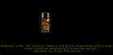
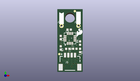
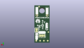
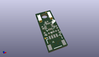

Contents
========

* [PROJ-SPAR-19921-STAN-01>SparkFun Qwiic Magnetometer-MMC5983MA](#proj-spar-19921-stan-01sparkfun-qwiic-magnetometer-mmc5983ma)
	* [Images](#images)
	* [Interactive BOM](#interactive-bom)
	* [OOMP Parts](#oomp-parts)
	* [Tags](#tags)
  
![][im]
# PROJ-SPAR-19921-STAN-01>SparkFun Qwiic Magnetometer-MMC5983MA

- ID: PROJ-SPAR-19921-STAN-01
- Hex ID: PRS19921
- Name: SparkFun Qwiic Magnetometer-MMC5983MA
- Description: 

## Images
  
  

|eagleImage|kicadPcb3dFront|kicadPcb3dBack|kicadPcb3d|
| :---: | :---: | :---: | :---: |
|||||

## Interactive BOM

- Interactive BOM page: [ibom.html](kicad/bom/ibom.html)

## OOMP Parts
  

|OOMP Parts|
| :---: |
|CAPC-0402-X-UNMATCHED-01, C2, 1.0287, 10.413999999999998, 270,C2, 1.0uF, 0402-TIGHT, SparkFun-Capacitors, (0.0405, 0.41), R270|
|CAPC-0402-X-UNMATCHED-01, C5, 3.556, 12.827, 180,C5, 10uF, 0402-TIGHT, SparkFun-Capacitors, (0.14, 0.505), R180|
|UNMATCHED-0402-X-UNMATCHED-01, D1, 6.838340654, 6.5024, 270,D1, RED, LED-0402, SparkFun-LED, (0.26922601, 0.256), R270|
|UNMATCHED-UNMATCHED-X-UNMATCHED-01, I2C_PU, 3.7591999999999994, 3.5242500000000003, M0,I2C_PU, S_MODE, SMT-JUMPER_3_2-NC_TRACE_SILK, SparkFun-Jumpers, (0.148, 0.13875), MR0|
|UNMATCHED-UNMATCHED-X-UNMATCHED-01, J1, 3.8099999999999996, 5.08, 0,J1, QWIIC_RIGHT_ANGLE, JST04_1MM_RA, SparkFun-Connectors, (0.15, 0.2), R0|
|UNMATCHED-UNMATCHED-X-UNMATCHED-01, J2, 1.27, 13.97, 0,J2, 1X01_1MM_NO_SILK, SparkFun-Connectors, (0.05, 0.55), R0|
|UNMATCHED-UNMATCHED-X-UNMATCHED-01, J4, 6.35, 13.97, 0,J4, 1X01_1MM_NO_SILK, SparkFun-Connectors, (0.25, 0.55), R0|
|LEDS-UNMATCHED-G-UNMATCHED-01, LED, 6.5024, 6.3754, M270,LED, JUMPER-SMT_2_NC_TRACE_SILK, SMT-JUMPER_2_NC_TRACE_SILK, SparkFun-Jumpers, (0.256, 0.251), MR270|
|RESE-0402-X-UNMATCHED-01, R1, 5.2578, 7.021599876, 0,R1, 2.2k, 0402-TIGHT, SparkFun-Resistors, (0.207, 0.27644094), R0|
|RESE-0402-X-UNMATCHED-01, R2, 3.1496, 6.999200124000001, 180,R2, 2.2k, 0402-TIGHT, SparkFun-Resistors, (0.124, 0.27555906), R180|
|RESE-0402-X-UNMATCHED-01, R4, 6.838340654, 8.737599999999999, 90,R4, 1k, 0402-TIGHT, SparkFun-Resistors, (0.26922601, 0.344), R90|
|<table><tr><td></td><td> R7</td><td>[RESE-0402-X-O104-01 SMD (0402) 100k Ohm Resistor](https://github.com/oomlout/oomlout_OOMP_parts/tree/main/RESE-0402-X-O104-01/)</td><td>[R42104](https://github.com/oomlout/oomlout_OOMP_parts/tree/main/RESE-0402-X-O104-01/)</td></tr></table>|
|UNMATCHED-UNMATCHED-X-UNMATCHED-01, U2, 3.8099999999999996, 10.16, 180,U2, MMC5983MA_QFN16, LGA-16-3X3MM-4X4PINS, SparkFun-Sensors, (0.15, 0.4), R180|

## Tags

- hexID: PRS19921
- oompType: PROJ
- oompSize: SPAR
- oompColor: 19921
- oompDesc: STAN
- oompIndex: 01
- oompName: SparkFun Qwiic Magnetometer-MMC5983MA
- sources: All source files from https://github.com/sparkfun/SparkFun_Qwiic_Magnetometer-MMC5983MA (source licence details in srcLicense.md)
- linkBuyPage: https://www.sparkfun.com/products/19921
- oompPart: CAPC-0402-X-UNMATCHED-01, C2, 1.0287, 10.413999999999998, 270
- oompPart: CAPC-0402-X-UNMATCHED-01, C5, 3.556, 12.827, 180
- oompPart: UNMATCHED-0402-X-UNMATCHED-01, D1, 6.838340654, 6.5024, 270
- oompPart: SKIP-UNMATCHED-X-UNMATCHED-01, FD1, 5.2578, 18.440399999999997, M90
- oompPart: SKIP-UNMATCHED-X-UNMATCHED-01, FD2, 0.6096, 5.384799999999999, M90
- oompPart: SKIP-UNMATCHED-X-UNMATCHED-01, FID1, 5.2578, 18.440399999999997, 270
- oompPart: SKIP-UNMATCHED-X-UNMATCHED-01, FID2, 0.6096, 5.384799999999999, 270
- oompPart: UNMATCHED-UNMATCHED-X-UNMATCHED-01, I2C_PU, 3.7591999999999994, 3.5242500000000003, M0
- oompPart: UNMATCHED-UNMATCHED-X-UNMATCHED-01, J1, 3.8099999999999996, 5.08, 0
- oompPart: UNMATCHED-UNMATCHED-X-UNMATCHED-01, J2, 1.27, 13.97, 0
- oompPart: UNMATCHED-UNMATCHED-X-UNMATCHED-01, J4, 6.35, 13.97, 0
- oompPart: LEDS-UNMATCHED-G-UNMATCHED-01, LED, 6.5024, 6.3754, M270
- oompPart: RESE-0402-X-UNMATCHED-01, R1, 5.2578, 7.021599876, 0
- oompPart: RESE-0402-X-UNMATCHED-01, R2, 3.1496, 6.999200124000001, 180
- oompPart: RESE-0402-X-UNMATCHED-01, R4, 6.838340654, 8.737599999999999, 90
- oompPart: RESE-0402-X-O104-01, R7, 1.0287, 7.264399999999999, 270
- oompPart: SKIP-UNMATCHED-X-UNMATCHED-01, TP1, 2.8575, 0.9524999999999999, M90
- oompPart: SKIP-UNMATCHED-X-UNMATCHED-01, TP2, 4.762499999999999, 0.9524999999999999, M90
- oompPart: SKIP-UNMATCHED-X-UNMATCHED-01, TP3, 6.6674999999999995, 0.9524999999999999, M90
- oompPart: SKIP-UNMATCHED-X-UNMATCHED-01, TP5, 0.9524999999999999, 0.9524999999999999, M90
- oompPart: UNMATCHED-UNMATCHED-X-UNMATCHED-01, U2, 3.8099999999999996, 10.16, 180
- rawPart: C2, 1.0uF, 0402-TIGHT, SparkFun-Capacitors, (0.0405, 0.41), R270
- rawPart: C5, 10uF, 0402-TIGHT, SparkFun-Capacitors, (0.14, 0.505), R180
- rawPart: D1, RED, LED-0402, SparkFun-LED, (0.26922601, 0.256), R270
- rawPart: FD1, FIDUCIALUFIDUCIAL, FIDUCIAL-MICRO, SparkFun-Aesthetics, (0.207, 0.726), MR90
- rawPart: FD2, FIDUCIALUFIDUCIAL, FIDUCIAL-MICRO, SparkFun-Aesthetics, (0.024, 0.212), MR90
- rawPart: FID1, FIDUCIALUFIDUCIAL, FIDUCIAL-MICRO, SparkFun-Aesthetics, (0.207, 0.726), R270
- rawPart: FID2, FIDUCIALUFIDUCIAL, FIDUCIAL-MICRO, SparkFun-Aesthetics, (0.024, 0.212), R270
- rawPart: I2C_PU, S_MODE, SMT-JUMPER_3_2-NC_TRACE_SILK, SparkFun-Jumpers, (0.148, 0.13875), MR0
- rawPart: J1, QWIIC_RIGHT_ANGLE, JST04_1MM_RA, SparkFun-Connectors, (0.15, 0.2), R0
- rawPart: J2, 1X01_1MM_NO_SILK, SparkFun-Connectors, (0.05, 0.55), R0
- rawPart: J4, 1X01_1MM_NO_SILK, SparkFun-Connectors, (0.25, 0.55), R0
- rawPart: LED, JUMPER-SMT_2_NC_TRACE_SILK, SMT-JUMPER_2_NC_TRACE_SILK, SparkFun-Jumpers, (0.256, 0.251), MR270
- rawPart: R1, 2.2k, 0402-TIGHT, SparkFun-Resistors, (0.207, 0.27644094), R0
- rawPart: R2, 2.2k, 0402-TIGHT, SparkFun-Resistors, (0.124, 0.27555906), R180
- rawPart: R4, 1k, 0402-TIGHT, SparkFun-Resistors, (0.26922601, 0.344), R90
- rawPart: R7, 100k, 0402-TIGHT, SparkFun-Resistors, (0.0405, 0.286), R270
- rawPart: TP1, TEST-POINT3, PAD.03X.03, SparkFun-Connectors, (0.1125, 0.0375), MR90
- rawPart: TP2, TEST-POINT3, PAD.03X.03, SparkFun-Connectors, (0.1875, 0.0375), MR90
- rawPart: TP3, TEST-POINT3, PAD.03X.03, SparkFun-Connectors, (0.2625, 0.0375), MR90
- rawPart: TP5, TEST-POINT3, PAD.03X.03, SparkFun-Connectors, (0.0375, 0.0375), MR90
- rawPart: U2, MMC5983MA_QFN16, LGA-16-3X3MM-4X4PINS, SparkFun-Sensors, (0.15, 0.4), R180
- oompID: PROJ-SPAR-19921-STAN-01

[im]: kicadPcb3d_450.png
