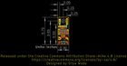
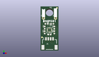
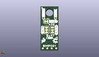
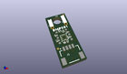

Contents
========

* [PROJ-SPAR-20170-STAN-01>SparkFun Qwiic Pressure Sensor BMP581](#proj-spar-20170-stan-01sparkfun-qwiic-pressure-sensor-bmp581)
	* [Images](#images)
	* [Interactive BOM](#interactive-bom)
	* [OOMP Parts](#oomp-parts)
	* [Tags](#tags)
  
![][im]
# PROJ-SPAR-20170-STAN-01>SparkFun Qwiic Pressure Sensor BMP581

- ID: PROJ-SPAR-20170-STAN-01
- Hex ID: PRS20170
- Name: SparkFun Qwiic Pressure Sensor BMP581
- Description: 

## Images
  
  

|eagleImage|kicadPcb3dFront|kicadPcb3dBack|kicadPcb3d|
| :---: | :---: | :---: | :---: |
|||||

## Interactive BOM

- Interactive BOM page: [ibom.html](kicad/bom/ibom.html)

## OOMP Parts
  

|OOMP Parts|
| :---: |
|CAPC-0402-X-NF100-V50, C1, 3.8099999999999996, 6.9342, 0,C1, 0.1uF, 0402-TIGHT, SparkFun-Capacitors, (0.15, 0.273), R0|
|UNMATCHED-0402-X-UNMATCHED-01, D1, 4.953, 11.557, 180,D1, RED, LED-0402, SparkFun-LED, (0.195, 0.455), R180|
|UNMATCHED-UNMATCHED-X-UNMATCHED-01, J1, 3.8099999999999996, 5.08, 0,J1, QWIIC_RIGHT_ANGLE, JST04_1MM_RA, SparkFun-Connectors, (0.15, 0.2), R0|
|UNMATCHED-UNMATCHED-X-UNMATCHED-01, J2, 1.27, 13.97, 0,J2, 1X01_1MM_NO_SILK, SparkFun-Connectors, (0.05, 0.55), R0|
|UNMATCHED-UNMATCHED-X-UNMATCHED-01, J3, 6.35, 13.97, 0,J3, 1X01_1MM_NO_SILK, SparkFun-Connectors, (0.25, 0.55), R0|
|UNMATCHED-UNMATCHED-X-UNMATCHED-01, JP1, 2.54, 8.889999999999999, M270,JP1, ADR, SMT-JUMPER_3_1-NC_TRACE_SILK, SparkFun-Jumpers, (0.1, 0.35), MR270|
|UNMATCHED-UNMATCHED-X-UNMATCHED-01, JP2, 5.08, 8.889999999999999, M90,JP2, I2C, SMT-JUMPER_3_2-NC_TRACE_SILK, SparkFun-Jumpers, (0.2, 0.35), MR90|
|UNMATCHED-UNMATCHED-X-UNMATCHED-01, JP3, 5.206999999999999, 12.572999999999999, M0,JP3, LED, SMT-JUMPER_2_NC_TRACE_SILK, SparkFun-Jumpers, (0.205, 0.495), MR0|
|RESE-0402-X-UNMATCHED-01, R1, 5.842, 9.906, 90,R1, 2.2k, 0402-TIGHT, SparkFun-Resistors, (0.23, 0.39), R90|
|RESE-0402-X-UNMATCHED-01, R2, 5.842, 7.874, 90,R2, 2.2k, 0402-TIGHT, SparkFun-Resistors, (0.23, 0.31), R90|
|<table><tr><td></td><td> R3</td><td>[RESE-0402-X-O103-01 SMD (0402) 10k Ohm Resistor](https://github.com/oomlout/oomlout_OOMP_parts/tree/main/RESE-0402-X-O103-01/)</td><td>[R42103](https://github.com/oomlout/oomlout_OOMP_parts/tree/main/RESE-0402-X-O103-01/)</td></tr></table>|
|<table><tr><td></td><td> R4</td><td>[RESE-0402-X-O103-01 SMD (0402) 10k Ohm Resistor](https://github.com/oomlout/oomlout_OOMP_parts/tree/main/RESE-0402-X-O103-01/)</td><td>[R42103](https://github.com/oomlout/oomlout_OOMP_parts/tree/main/RESE-0402-X-O103-01/)</td></tr></table>|
|RESE-0402-X-UNMATCHED-01, R5, 2.54, 11.557, 0,R5, 1k, 0402-TIGHT, SparkFun-Resistors, (0.1, 0.455), R0|
|UNMATCHED-UNMATCHED-X-UNMATCHED-01, U1, 3.8099999999999996, 8.889999999999999, 180,U1, BMP581, BMP581, BMP581, (0.15, 0.35), R180|

## Tags

- hexID: PRS20170
- oompType: PROJ
- oompSize: SPAR
- oompColor: 20170
- oompDesc: STAN
- oompIndex: 01
- oompName: SparkFun Qwiic Pressure Sensor BMP581
- sources: All source files from https://github.com/sparkfun/SparkFun_Qwiic_Pressure_Sensor_BMP581 (source licence details in srcLicense.md)
- linkBuyPage: https://www.sparkfun.com/products/20170
- oompPart: CAPC-0402-X-NF100-V50, C1, 3.8099999999999996, 6.9342, 0
- oompPart: UNMATCHED-0402-X-UNMATCHED-01, D1, 4.953, 11.557, 180
- oompPart: SKIP-UNMATCHED-X-UNMATCHED-01, FD1, 6.985, 18.415, 0
- oompPart: SKIP-UNMATCHED-X-UNMATCHED-01, FD2, 6.985, 18.415, M0
- oompPart: SKIP-UNMATCHED-X-UNMATCHED-01, FD3, 0.635, 5.715, M0
- oompPart: SKIP-UNMATCHED-X-UNMATCHED-01, FD4, 0.635, 5.715, 0
- oompPart: UNMATCHED-UNMATCHED-X-UNMATCHED-01, J1, 3.8099999999999996, 5.08, 0
- oompPart: UNMATCHED-UNMATCHED-X-UNMATCHED-01, J2, 1.27, 13.97, 0
- oompPart: UNMATCHED-UNMATCHED-X-UNMATCHED-01, J3, 6.35, 13.97, 0
- oompPart: UNMATCHED-UNMATCHED-X-UNMATCHED-01, JP1, 2.54, 8.889999999999999, M270
- oompPart: UNMATCHED-UNMATCHED-X-UNMATCHED-01, JP2, 5.08, 8.889999999999999, M90
- oompPart: UNMATCHED-UNMATCHED-X-UNMATCHED-01, JP3, 5.206999999999999, 12.572999999999999, M0
- oompPart: RESE-0402-X-UNMATCHED-01, R1, 5.842, 9.906, 90
- oompPart: RESE-0402-X-UNMATCHED-01, R2, 5.842, 7.874, 90
- oompPart: RESE-0402-X-O103-01, R3, 1.778, 7.874, 90
- oompPart: RESE-0402-X-O103-01, R4, 1.778, 9.906, 90
- oompPart: RESE-0402-X-UNMATCHED-01, R5, 2.54, 11.557, 0
- oompPart: SKIP-UNMATCHED-X-UNMATCHED-01, TP1, 0.9524999999999999, 0.9524999999999999, M0
- oompPart: SKIP-UNMATCHED-X-UNMATCHED-01, TP2, 2.8575, 0.9524999999999999, M0
- oompPart: SKIP-UNMATCHED-X-UNMATCHED-01, TP3, 4.762499999999999, 0.9524999999999999, M0
- oompPart: SKIP-UNMATCHED-X-UNMATCHED-01, TP4, 6.6674999999999995, 0.9524999999999999, M0
- oompPart: UNMATCHED-UNMATCHED-X-UNMATCHED-01, U1, 3.8099999999999996, 8.889999999999999, 180
- rawPart: C1, 0.1uF, 0402-TIGHT, SparkFun-Capacitors, (0.15, 0.273), R0
- rawPart: D1, RED, LED-0402, SparkFun-LED, (0.195, 0.455), R180
- rawPart: FD1, FIDUCIALUFIDUCIAL, FIDUCIAL-MICRO, SparkFun-Aesthetics, (0.275, 0.725), R0
- rawPart: FD2, FIDUCIALUFIDUCIAL, FIDUCIAL-MICRO, SparkFun-Aesthetics, (0.275, 0.725), MR0
- rawPart: FD3, FIDUCIALUFIDUCIAL, FIDUCIAL-MICRO, SparkFun-Aesthetics, (0.025, 0.225), MR0
- rawPart: FD4, FIDUCIALUFIDUCIAL, FIDUCIAL-MICRO, SparkFun-Aesthetics, (0.025, 0.225), R0
- rawPart: J1, QWIIC_RIGHT_ANGLE, JST04_1MM_RA, SparkFun-Connectors, (0.15, 0.2), R0
- rawPart: J2, 1X01_1MM_NO_SILK, SparkFun-Connectors, (0.05, 0.55), R0
- rawPart: J3, 1X01_1MM_NO_SILK, SparkFun-Connectors, (0.25, 0.55), R0
- rawPart: JP1, ADR, SMT-JUMPER_3_1-NC_TRACE_SILK, SparkFun-Jumpers, (0.1, 0.35), MR270
- rawPart: JP2, I2C, SMT-JUMPER_3_2-NC_TRACE_SILK, SparkFun-Jumpers, (0.2, 0.35), MR90
- rawPart: JP3, LED, SMT-JUMPER_2_NC_TRACE_SILK, SparkFun-Jumpers, (0.205, 0.495), MR0
- rawPart: R1, 2.2k, 0402-TIGHT, SparkFun-Resistors, (0.23, 0.39), R90
- rawPart: R2, 2.2k, 0402-TIGHT, SparkFun-Resistors, (0.23, 0.31), R90
- rawPart: R3, 10K, 0402-TIGHT, SparkFun-Resistors, (0.07, 0.31), R90
- rawPart: R4, 10K, 0402-TIGHT, SparkFun-Resistors, (0.07, 0.39), R90
- rawPart: R5, 1k, 0402-TIGHT, SparkFun-Resistors, (0.1, 0.455), R0
- rawPart: TP1, TEST-POINT3, PAD.03X.03, SparkFun-Connectors, (0.0375, 0.0375), MR0
- rawPart: TP2, TEST-POINT3, PAD.03X.03, SparkFun-Connectors, (0.1125, 0.0375), MR0
- rawPart: TP3, TEST-POINT3, PAD.03X.03, SparkFun-Connectors, (0.1875, 0.0375), MR0
- rawPart: TP4, TEST-POINT3, PAD.03X.03, SparkFun-Connectors, (0.2625, 0.0375), MR0
- rawPart: U1, BMP581, BMP581, BMP581, (0.15, 0.35), R180
- oompID: PROJ-SPAR-20170-STAN-01

[im]: kicadPcb3d_450.png
