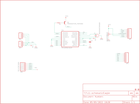
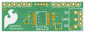

Contents
========

* [PRS258 > Serial Enabled LCD Backpack](#prs258--serial-enabled-lcd-backpack)
	* [Schematic](#schematic)
	* [PCB](#pcb)
	* [Interactive BOM](#interactive-bom)
	* [Images](#images)
	* [Tags](#tags)
  
![][im]
# PRS258 > Serial Enabled LCD Backpack

- ID: PROJ-SPAR-258-STAN-01
- Hex ID: PRS258
- Name: Sparkfun
- Description: Sparkfun
- Long Link: [http://oom.lt/PROJ-SPAR-258-STAN-01](http://oom.lt/PROJ-SPAR-258-STAN-01)
- Short Link: [http://oom.lt/PRS258](http://oom.lt/PRS258)

## Schematic
  

## PCB
  

## Interactive BOM

- Interactive BOM page: [ibom.html](https://htmlpreview.github.io/?https://github.com/oomlout/oomlout_OOMP_projects/blob/main/PROJ-SPAR-258-STAN-01/kicad/bom/ibom.html)

## Images
  
  

|bominteractivefront|bominteractiveback|kicadPcb3d|kicadPcb3dFront|kicadPcb3dBack|eagleImage|eagleSchemImage|pcbdraw|pcbdrawback|
| :---: | :---: | :---: | :---: | :---: | :---: | :---: | :---: | :---: |
||||||||||

## Tags

- hexID: PRS258
- oompType: PROJ
- oompSize: SPAR
- oompColor: 258
- oompDesc: STAN
- oompIndex: 01
- oompName: Serial Enabled LCD Backpack
- sources: All source files from https://github.com/sparkfun/Serial_Enabled_LCD_Backpack (source licence details in srcLicense.md)
- linkBuyPage: https://www.sparkfun.com/products/258
- oompID: PROJ-SPAR-258-STAN-01
- rawParts: C1,,CAP0402-CAP,0402-CAP,Capacitor,,
- rawParts: IC1,PIC16F88-SSOP,PIC16F88-SSOP,SSOP20,PIC 16F8x,,
- rawParts: JP1,,M06LOCK,1X06_LOCK,Header 6,,
- rawParts: JP2,,M06LOCK,1X06_LOCK,Header 6,,
- rawParts: JP3,,M03PTH,1X03,Header 3,,
- rawParts: JP4,,M03SCREW_LOCK,SCREWTERMINAL-3.5MM-3_LOCK.007S,Header 3,,
- rawParts: Q1,TRANSISTOR_PNPSMD,TRANSISTOR_PNPSMD,SOT23-3,,,
- rawParts: R1,,RESISTOR0402-RES,0402-RES,Resistor,,
- rawParts: R2,TRIMPOTSMD,TRIMPOTSMD,TRIMPOT-3MM,,,
- rawParts: TP1,,TEST-POINT3X5,PAD.03X.05,,,
- rawParts: U$1,PIC-ICSP-MINI,PIC-ICSP-MINI,PIC-ICSP-MINI,PIC-ICSP-Mini,,
- rawParts: U$2,LOGO-FLAME-LARGE,LOGO-FLAME-LARGE,LOGO-FLAME-LARGE,,,
- rawParts: U$3,FIDUCIAL1X2,FIDUCIAL1X2,FIDUCIAL-1X2,Fiducial Alignment Points,,
- rawParts: U$4,FIDUCIAL1X2,FIDUCIAL1X2,FIDUCIAL-1X2,Fiducial Alignment Points,,
- rawParts: U$5,LOGO-SFENEW,LOGO-SFENEW,SFE-NEW-WEBLOGO,Spark Fun Electronics PCB Logo,,
- rawParts: Y1,RESONATORSMD,RESONATORSMD,RESONATOR-SMD,Resonator,,

[im]: kicadPcb3d_450.png
