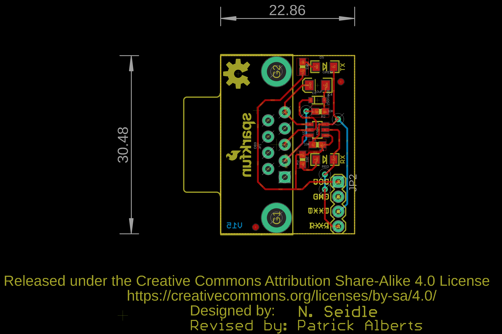
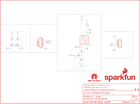

Contents
========

* [PRS449 > RS232 Shifter SMD](#prs449--rs232-shifter-smd)
	* [Schematic](#schematic)
	* [PCB](#pcb)
	* [Interactive BOM](#interactive-bom)
	* [Images](#images)
	* [Tags](#tags)
  
![][im]
# PRS449 > RS232 Shifter SMD

- ID: PROJ-SPAR-449-STAN-01
- Hex ID: PRS449
- Name: Sparkfun
- Description: Sparkfun
- Long Link: [http://oom.lt/PROJ-SPAR-449-STAN-01](http://oom.lt/PROJ-SPAR-449-STAN-01)
- Short Link: [http://oom.lt/PRS449](http://oom.lt/PRS449)

## Schematic
  

## PCB
  

## Interactive BOM

- Interactive BOM page: [ibom.html](https://htmlpreview.github.io/?https://github.com/oomlout/oomlout_OOMP_projects/blob/main/PROJ-SPAR-449-STAN-01/kicad/bom/ibom.html)

## Images
  
  

|kicadPcb3d|kicadPcb3dFront|kicadPcb3dBack|eagleImage|eagleSchemImage|
| :---: | :---: | :---: | :---: | :---: |
||||||

## Tags

- hexID: PRS449
- oompType: PROJ
- oompSize: SPAR
- oompColor: 449
- oompDesc: STAN
- oompIndex: 01
- oompName: RS232 Shifter SMD
- sources: All source files from https://github.com/sparkfun/RS232_Shifter_SMD (source licence details in srcLicense.md)
- linkBuyPage: https://www.sparkfun.com/products/449
- oompID: PROJ-SPAR-449-STAN-01

[im]: kicadPcb3d_450.png
