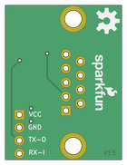

Contents
========

* [PRS449 > RS232 Shifter SMD](#prs449--rs232-shifter-smd)
	* [Schematic](#schematic)
	* [PCB](#pcb)
	* [Interactive BOM](#interactive-bom)
	* [Images](#images)
	* [Tags](#tags)
  
![][im]
# PRS449 > RS232 Shifter SMD

- ID: PROJ-SPAR-449-STAN-01
- Hex ID: PRS449
- Name: Sparkfun
- Description: Sparkfun
- Long Link: [http://oom.lt/PROJ-SPAR-449-STAN-01](http://oom.lt/PROJ-SPAR-449-STAN-01)
- Short Link: [http://oom.lt/PRS449](http://oom.lt/PRS449)

## Schematic
  

## PCB
  

## Interactive BOM

- Interactive BOM page: [ibom.html](https://htmlpreview.github.io/?https://github.com/oomlout/oomlout_OOMP_projects/blob/main/PROJ-SPAR-449-STAN-01/kicad/bom/ibom.html)

## Images
  
  

|bominteractivefront|bominteractiveback|kicadPcb3d|kicadPcb3dFront|kicadPcb3dBack|eagleImage|eagleSchemImage|pcbdraw|pcbdrawback|
| :---: | :---: | :---: | :---: | :---: | :---: | :---: | :---: | :---: |
||||||||||

## Tags

- hexID: PRS449
- oompType: PROJ
- oompSize: SPAR
- oompColor: 449
- oompDesc: STAN
- oompIndex: 01
- oompName: RS232 Shifter SMD
- sources: All source files from https://github.com/sparkfun/RS232_Shifter_SMD (source licence details in srcLicense.md)
- linkBuyPage: https://www.sparkfun.com/products/449
- oompID: PROJ-SPAR-449-STAN-01
- rawParts: C4,10uF,10UF-16V-10%(TANT),EIA3216,CAP-00811,,CAP-00811,10uF,,
- rawParts: D1,BAS16,DIODEBAS16,SOD-323,Diode,,DIO-09646,250mA/100V,,
- rawParts: D4,Red,LED-RED1206,LED-1206,Assorted Red LEDs,,DIO-00809,RED,,
- rawParts: D5,Grn,LED-GREENLARGE,LED-1206,Various green LEDs,,DIO-00862,GREEN,,
- rawParts: E$1,FIDUCIAL1X2,FIDUCIAL1X2,FIDUCIAL-1X2,Fiducial Alignment Points,,,,,
- rawParts: E$2,FIDUCIAL1X2,FIDUCIAL1X2,FIDUCIAL-1X2,Fiducial Alignment Points,,,,,
- rawParts: FRAME1,,FRAME-LETTER,CREATIVE_COMMONS,Schematic Frame,NAME,,,v01,
- rawParts: JP1,DB9,DB9FEMALE,DB9,DB9 Connector,,CONN-08194,,,
- rawParts: JP2,,M04PTH,1X04,Header 4,,,,,
- rawParts: LOGO1,SFE_LOGO_NAME_FLAME.1_INCH,SFE_LOGO_NAME_FLAME.1_INCH,SFE_LOGO_NAME_FLAME_.1,SFE Logo, name and flame,,,,,
- rawParts: LOGO2,OSHW-LOGOM,OSHW-LOGOM,OSHW-LOGO-M,Open Source Hardware Logo,,,,,
- rawParts: R1,10K,10KOHM1/10W1%(0603)0603,0603-RES,RES-00824,,RES-00824,10K,,
- rawParts: R2,10K,10KOHM1/10W1%(0603)0603,0603-RES,RES-00824,,RES-00824,10K,,
- rawParts: R3,330,330OHM1/10W1%(0603),0603-RES,RES-00818,,RES-00818,330,,
- rawParts: R4,330,330OHM1/10W1%(0603),0603-RES,RES-00818,,RES-00818,330,,
- rawParts: U2,XN04312,XN04312SOT,SOT23-6,NPN/PNP Transistor Array,,TRANS-00816,,,

[im]: kicadPcb3d_450.png
