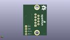

Contents
========

* [PROJ-SPAR-449-STAN-01>RS232 Shifter SMD](#proj-spar-449-stan-01rs232-shifter-smd)
	* [Images](#images)
	* [Interactive BOM](#interactive-bom)
	* [OOMP Parts](#oomp-parts)
	* [Tags](#tags)
  
![][im]
# PROJ-SPAR-449-STAN-01>RS232 Shifter SMD

- ID: PROJ-SPAR-449-STAN-01
- Hex ID: PRS449
- Name: RS232 Shifter SMD
- Description: 

## Images
  
  

|eagleImage|kicadPcb3dFront|kicadPcb3dBack|kicadPcb3d|
| :---: | :---: | :---: | :---: |
|||||

## Interactive BOM

- Interactive BOM page: [ibom.html](kicad/bom/ibom.html)

## OOMP Parts
  

|OOMP Parts|
| :---: |
|CAPC-UNMATCHED-X-UNMATCHED-01, C4, 16.509999999999998, 25.4, 180,C4, 10uF, EIA3216, SparkFun-Capacitors, (0.65, 1), R180|
|UNMATCHED-UNMATCHED-X-UNMATCHED-01, D1, 16.509999999999998, 22.86, 0,D1, BAS16, SOD-323, SparkFun-DiscreteSemi, (0.65, 0.9), R0|
|UNMATCHED-UNMATCHED-X-UNMATCHED-01, D4, 17.779999999999998, 12.7, 0,D4, Red, LED-1206, SparkFun-LED, (0.7, 0.5), R0|
|UNMATCHED-UNMATCHED-X-UNMATCHED-01, D5, 17.779999999999998, 28.575, 0,D5, Grn, LED-1206, SparkFun-LED, (0.7, 1.125), R0|
|UNMATCHED-UNMATCHED-X-UNMATCHED-01, JP1, 9.524999999999999, 15.239999999999998, 90,JP1, DB9, DB9, SparkFun-Connectors, (0.375, 0.6), R90|
|<table><tr><td></td><td> JP2</td><td>[HEAD-I01-X-PI04-01 2.54 mm 4 Pin Header](https://github.com/oomlout/oomlout_OOMP_parts/tree/main/HEAD-I01-X-PI04-01/)</td><td>[H04](https://github.com/oomlout/oomlout_OOMP_parts/tree/main/HEAD-I01-X-PI04-01/)</td></tr></table>|
|<table><tr><td></td><td> R1</td><td>[RESE-0603-X-O103-01 SMD (0603) 10k Ohm Resistor](https://github.com/oomlout/oomlout_OOMP_parts/tree/main/RESE-0603-X-O103-01/)</td><td>[R6103](https://github.com/oomlout/oomlout_OOMP_parts/tree/main/RESE-0603-X-O103-01/)</td></tr></table>|
|<table><tr><td></td><td> R2</td><td>[RESE-0603-X-O103-01 SMD (0603) 10k Ohm Resistor](https://github.com/oomlout/oomlout_OOMP_parts/tree/main/RESE-0603-X-O103-01/)</td><td>[R6103](https://github.com/oomlout/oomlout_OOMP_parts/tree/main/RESE-0603-X-O103-01/)</td></tr></table>|
|<table><tr><td></td><td> R3</td><td>[RESE-0603-X-O331-01 SMD (0603) 330 Ohm Resistor](https://github.com/oomlout/oomlout_OOMP_parts/tree/main/RESE-0603-X-O331-01/)</td><td>[R6331](https://github.com/oomlout/oomlout_OOMP_parts/tree/main/RESE-0603-X-O331-01/)</td></tr></table>|
|<table><tr><td></td><td> R4</td><td>[RESE-0603-X-O331-01 SMD (0603) 330 Ohm Resistor](https://github.com/oomlout/oomlout_OOMP_parts/tree/main/RESE-0603-X-O331-01/)</td><td>[R6331](https://github.com/oomlout/oomlout_OOMP_parts/tree/main/RESE-0603-X-O331-01/)</td></tr></table>|
|UNMATCHED-UNMATCHED-X-UNMATCHED-01, U2, 16.509999999999998, 17.779999999999998, 90,U2, XN04312, SOT23-6, SparkFun-DiscreteSemi, (0.65, 0.7), R90|

## Tags

- hexID: PRS449
- oompType: PROJ
- oompSize: SPAR
- oompColor: 449
- oompDesc: STAN
- oompIndex: 01
- oompName: RS232 Shifter SMD
- sources: All source files from https://github.com/sparkfun/RS232_Shifter_SMD (source licence details in srcLicense.md)
- linkBuyPage: https://www.sparkfun.com/products/449
- oompID: PROJ-SPAR-449-STAN-01
- oompPart: CAPC-UNMATCHED-X-UNMATCHED-01, C4, 16.509999999999998, 25.4, 180
- oompPart: UNMATCHED-UNMATCHED-X-UNMATCHED-01, D1, 16.509999999999998, 22.86, 0
- oompPart: UNMATCHED-UNMATCHED-X-UNMATCHED-01, D4, 17.779999999999998, 12.7, 0
- oompPart: UNMATCHED-UNMATCHED-X-UNMATCHED-01, D5, 17.779999999999998, 28.575, 0
- oompPart: SKIP-UNMATCHED-X-UNMATCHED-01, E$1, 5.968999999999999, 1.1429999999999998, 0
- oompPart: SKIP-UNMATCHED-X-UNMATCHED-01, E$2, 20.50541873, 26.007059491999996, 0
- oompPart: UNMATCHED-UNMATCHED-X-UNMATCHED-01, JP1, 9.524999999999999, 15.239999999999998, 90
- oompPart: HEAD-I01-X-PI04-01, JP2, 20.066, 8.889999999999999, 270
- oompPart: RESE-0603-X-O103-01, R1, 16.509999999999998, 15.239999999999998, 0
- oompPart: RESE-0603-X-O103-01, R2, 16.99768127, 20.92451873, 180
- oompPart: RESE-0603-X-O331-01, R3, 13.97, 12.7, 90
- oompPart: RESE-0603-X-O331-01, R4, 13.97, 28.575, 270
- oompPart: UNMATCHED-UNMATCHED-X-UNMATCHED-01, U2, 16.509999999999998, 17.779999999999998, 90
- rawPart: C4, 10uF, EIA3216, SparkFun-Capacitors, (0.65, 1), R180
- rawPart: D1, BAS16, SOD-323, SparkFun-DiscreteSemi, (0.65, 0.9), R0
- rawPart: D4, Red, LED-1206, SparkFun-LED, (0.7, 0.5), R0
- rawPart: D5, Grn, LED-1206, SparkFun-LED, (0.7, 1.125), R0
- rawPart: E$1, FIDUCIAL1X2, FIDUCIAL-1X2, SparkFun, (0.235, 0.045), R0
- rawPart: E$2, FIDUCIAL1X2, FIDUCIAL-1X2, SparkFun, (0.80729995, 1.02389998), R0
- rawPart: JP1, DB9, DB9, SparkFun-Connectors, (0.375, 0.6), R90
- rawPart: JP2, 1X04, SparkFun-Connectors, (0.79, 0.35), R270
- rawPart: R1, 10K, 0603-RES, SparkFun-Resistors, (0.65, 0.6), R0
- rawPart: R2, 10K, 0603-RES, SparkFun-Resistors, (0.66920005, 0.82379995), R180
- rawPart: R3, 330, 0603-RES, SparkFun-Resistors, (0.55, 0.5), R90
- rawPart: R4, 330, 0603-RES, SparkFun-Resistors, (0.55, 1.125), R270
- rawPart: U2, XN04312, SOT23-6, SparkFun-DiscreteSemi, (0.65, 0.7), R90

[im]: kicadPcb3d_450.png
