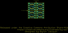
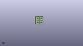
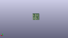
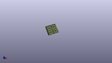

Contents
========

* [PROJ-SPAR-494-STAN-01>SOIC8-DIP Adapter](#proj-spar-494-stan-01soic8-dip-adapter)
	* [Images](#images)
	* [Interactive BOM](#interactive-bom)
	* [OOMP Parts](#oomp-parts)
	* [Tags](#tags)
  
![][im]
# PROJ-SPAR-494-STAN-01>SOIC8-DIP Adapter

- ID: PROJ-SPAR-494-STAN-01
- Hex ID: PRS494
- Name: SOIC8-DIP Adapter
- Description: 

## Images
  
  

|eagleImage|kicadPcb3dFront|kicadPcb3dBack|kicadPcb3d|
| :---: | :---: | :---: | :---: |
|||||

## Interactive BOM

- Interactive BOM page: [ibom.html](kicad/bom/ibom.html)

## OOMP Parts
  

|OOMP Parts|
| :---: |
|<table><tr><td></td><td> JP1</td><td>[HEAD-I01-X-PI04-01 2.54 mm 4 Pin Header](https://github.com/oomlout/oomlout_OOMP_parts/tree/main/HEAD-I01-X-PI04-01/)</td><td>[H04](https://github.com/oomlout/oomlout_OOMP_parts/tree/main/HEAD-I01-X-PI04-01/)</td></tr></table>|
|<table><tr><td></td><td> JP2</td><td>[HEAD-I01-X-PI04-01 2.54 mm 4 Pin Header](https://github.com/oomlout/oomlout_OOMP_parts/tree/main/HEAD-I01-X-PI04-01/)</td><td>[H04](https://github.com/oomlout/oomlout_OOMP_parts/tree/main/HEAD-I01-X-PI04-01/)</td></tr></table>|
|<table><tr><td></td><td> JP3</td><td>[HEAD-I01-X-PI04-01 2.54 mm 4 Pin Header](https://github.com/oomlout/oomlout_OOMP_parts/tree/main/HEAD-I01-X-PI04-01/)</td><td>[H04](https://github.com/oomlout/oomlout_OOMP_parts/tree/main/HEAD-I01-X-PI04-01/)</td></tr></table>|
|<table><tr><td></td><td> JP4</td><td>[HEAD-I01-X-PI04-01 2.54 mm 4 Pin Header](https://github.com/oomlout/oomlout_OOMP_parts/tree/main/HEAD-I01-X-PI04-01/)</td><td>[H04](https://github.com/oomlout/oomlout_OOMP_parts/tree/main/HEAD-I01-X-PI04-01/)</td></tr></table>|
|<table><tr><td></td><td> JP5</td><td>[HEAD-I01-X-PI04-01 2.54 mm 4 Pin Header](https://github.com/oomlout/oomlout_OOMP_parts/tree/main/HEAD-I01-X-PI04-01/)</td><td>[H04](https://github.com/oomlout/oomlout_OOMP_parts/tree/main/HEAD-I01-X-PI04-01/)</td></tr></table>|
|<table><tr><td></td><td> JP6</td><td>[HEAD-I01-X-PI04-01 2.54 mm 4 Pin Header](https://github.com/oomlout/oomlout_OOMP_parts/tree/main/HEAD-I01-X-PI04-01/)</td><td>[H04](https://github.com/oomlout/oomlout_OOMP_parts/tree/main/HEAD-I01-X-PI04-01/)</td></tr></table>|
|<table><tr><td></td><td> JP7</td><td>[HEAD-I01-X-PI04-01 2.54 mm 4 Pin Header](https://github.com/oomlout/oomlout_OOMP_parts/tree/main/HEAD-I01-X-PI04-01/)</td><td>[H04](https://github.com/oomlout/oomlout_OOMP_parts/tree/main/HEAD-I01-X-PI04-01/)</td></tr></table>|
|<table><tr><td></td><td> JP8</td><td>[HEAD-I01-X-PI04-01 2.54 mm 4 Pin Header](https://github.com/oomlout/oomlout_OOMP_parts/tree/main/HEAD-I01-X-PI04-01/)</td><td>[H04](https://github.com/oomlout/oomlout_OOMP_parts/tree/main/HEAD-I01-X-PI04-01/)</td></tr></table>|
|UNMATCHED-UNMATCHED-X-UNMATCHED-01, U1, 5.08, 15.748, 180,U1, GENERIC-SOIC8, SO08-UNIVERSAL, SparkFun-AnalogIC, (0.2, 0.62), R180|
|UNMATCHED-UNMATCHED-X-UNMATCHED-01, U2, 15.748, 15.748, 180,U2, GENERIC-SOIC8, SO08-UNIVERSAL, SparkFun-AnalogIC, (0.62, 0.62), R180|
|UNMATCHED-UNMATCHED-X-UNMATCHED-01, U3, 5.08, 5.08, 180,U3, GENERIC-SOIC8, SO08-UNIVERSAL, SparkFun-AnalogIC, (0.2, 0.2), R180|
|UNMATCHED-UNMATCHED-X-UNMATCHED-01, U4, 15.748, 5.08, 180,U4, GENERIC-SOIC8, SO08-UNIVERSAL, SparkFun-AnalogIC, (0.62, 0.2), R180|

## Tags

- hexID: PRS494
- oompType: PROJ
- oompSize: SPAR
- oompColor: 494
- oompDesc: STAN
- oompIndex: 01
- oompName: SOIC8-DIP Adapter
- sources: All source files from https://github.com/sparkfun/SOIC8-DIP_Adapter (source licence details in srcLicense.md)
- linkBuyPage: https://www.sparkfun.com/products/494
- oompPart: HEAD-I01-X-PI04-01, JP1, 1.27, 19.558, 270
- oompPart: HEAD-I01-X-PI04-01, JP2, 8.889999999999999, 19.558, 270
- oompPart: HEAD-I01-X-PI04-01, JP3, 11.937999999999999, 19.558, 270
- oompPart: HEAD-I01-X-PI04-01, JP4, 19.558, 19.558, 270
- oompPart: HEAD-I01-X-PI04-01, JP5, 1.27, 8.889999999999999, 270
- oompPart: HEAD-I01-X-PI04-01, JP6, 8.889999999999999, 8.889999999999999, 270
- oompPart: HEAD-I01-X-PI04-01, JP7, 11.937999999999999, 8.889999999999999, 270
- oompPart: HEAD-I01-X-PI04-01, JP8, 19.558, 8.889999999999999, 270
- oompPart: UNMATCHED-UNMATCHED-X-UNMATCHED-01, U1, 5.08, 15.748, 180
- oompPart: UNMATCHED-UNMATCHED-X-UNMATCHED-01, U2, 15.748, 15.748, 180
- oompPart: UNMATCHED-UNMATCHED-X-UNMATCHED-01, U3, 5.08, 5.08, 180
- oompPart: UNMATCHED-UNMATCHED-X-UNMATCHED-01, U4, 15.748, 5.08, 180
- rawPart: JP1, 1x4, 1X04_NO_SILK, SparkFun-Connectors, (0.05, 0.77), R270
- rawPart: JP2, 1x4, 1X04_NO_SILK_ALL_ROUND, SparkFun-Connectors, (0.35, 0.77), R270
- rawPart: JP3, 1x4, 1X04_NO_SILK, SparkFun-Connectors, (0.47, 0.77), R270
- rawPart: JP4, 1x4, 1X04_NO_SILK_ALL_ROUND, SparkFun-Connectors, (0.77, 0.77), R270
- rawPart: JP5, 1x4, 1X04_NO_SILK, SparkFun-Connectors, (0.05, 0.35), R270
- rawPart: JP6, 1x4, 1X04_NO_SILK_ALL_ROUND, SparkFun-Connectors, (0.35, 0.35), R270
- rawPart: JP7, 1x4, 1X04_NO_SILK, SparkFun-Connectors, (0.47, 0.35), R270
- rawPart: JP8, 1x4, 1X04_NO_SILK_ALL_ROUND, SparkFun-Connectors, (0.77, 0.35), R270
- rawPart: U1, GENERIC-SOIC8, SO08-UNIVERSAL, SparkFun-AnalogIC, (0.2, 0.62), R180
- rawPart: U2, GENERIC-SOIC8, SO08-UNIVERSAL, SparkFun-AnalogIC, (0.62, 0.62), R180
- rawPart: U3, GENERIC-SOIC8, SO08-UNIVERSAL, SparkFun-AnalogIC, (0.2, 0.2), R180
- rawPart: U4, GENERIC-SOIC8, SO08-UNIVERSAL, SparkFun-AnalogIC, (0.62, 0.2), R180
- oompID: PROJ-SPAR-494-STAN-01

[im]: kicadPcb3d_450.png
